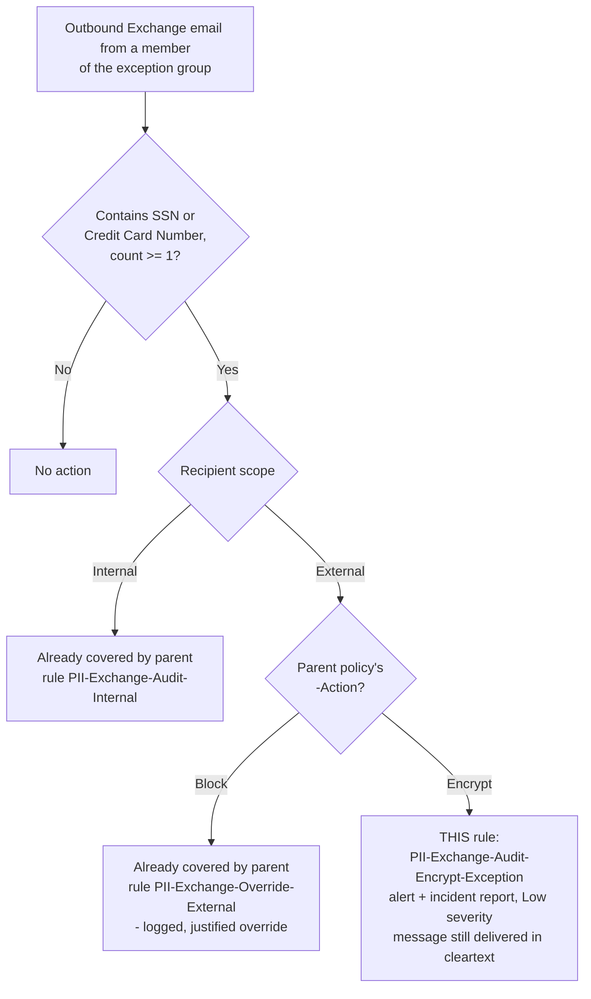

## 1. Scenario summary

A single, additive DLP rule that closes a specific, previously-documented gap in
`scenarios/dlp/exchange-pii-exfil-block/`: when that scenario is deployed with `-Action Encrypt`
**and** a business-exception group (`-ExceptionGroupEmail`), a member of that group who sends
matching PII content (SSN / Credit Card Number) to an external recipient currently leaves the
tenant in **cleartext with zero alert, incident report, or override record** — because
`EncryptRMSTemplate` is a non-halting action with no override concept, the exception group is
simply excluded from it (`ExceptIfFromMemberOf`) rather than routed through a logged path. This
companion adds one low-severity, non-blocking audit rule scoped to exactly that combination, so the
event is at least visible even though — by design, and by the base scenario's own accepted
trade-off — it is not blocked or encrypted.

**Who it's for:** any buyer who has deployed (or is deploying)
`scenarios/dlp/exchange-pii-exfil-block/` with `-Action Encrypt` and an `-ExceptionGroupEmail`, and
wants the documented silent-exception residual risk in that scenario's `README.md` §11 turned into
at least a detected-and-reported one. Not applicable to Block-mode deployments — that mode already
has a logged override rule (`PII-Exchange-Override-External`) and does not need this companion.

## 2. Business/regulatory driver

Same drivers as the parent scenario — **GDPR Article 32**, **CCPA/CPRA**, and **ISO/IEC 27001:2022
Annex A.5.12/A.8.2** — narrowed to a specific audit-trail-completeness gap: a control that is silent
for one specific, identifiable population (the exception group, in Encrypt mode) is a weaker
evidentiary position for a regulator or auditor than one where every matching event — enforced or
not — leaves a record. This companion doesn't change what data protection the base scenario
provides; it changes what the tenant can *prove happened* to that specific population.

## 3. Prerequisites

Full licensing detail and citations: `docs/licensing-matrix.md`.

| Requirement | Minimum | Notes |
|---|---|---|
| `scenarios/dlp/exchange-pii-exfil-block/` already deployed | `-Action Encrypt` and a non-empty `-ExceptionGroupEmail` | This companion is meaningless without both — see §11 "Dependency, not a standalone control." |
| DLP for Exchange Online | **Microsoft 365 E3** (basic) | Same tier as the parent scenario — this companion adds only a `GenerateAlert`/`GenerateIncidentReport` rule, no advanced classification or Teams condition. |
| Role to author/edit the DLP rule | **Compliance Administrator**, **Compliance Data Administrator**, or a custom role group with the **DLP Compliance Management** role | `docs/rbac-model.md` §3, DLP row — identical to the parent scenario. |
| Automation identity | App registration with **Exchange.ManageAsApp**, granted a role group with DLP Compliance Management | Certificate-based app-only auth — `docs/automation-surface.md` §3 |
| Tenant configuration: unified audit logging on | Audit log search enabled | Required for the alert/incident report this rule generates to be visible. |

> Verify current entitlement names against `docs/licensing-matrix.md` (dated 2026-09-02) and the
> Product Terms before a sales commitment — SKU names change.

## 4. Architecture



One additional rule (`PII-Exchange-Audit-Encrypt-Exception`), added to the parent scenario's
**existing** policy (`PII DLP - Exchange External Send Control` by default) rather than a new
policy — see `design.md` §2 for why. Full architecture rationale: `design.md` §3.

## 5. Step-by-step implementation

### Portal path (for a first manual walkthrough / to validate intent before scripting)

1. Sign in to the [Microsoft Purview portal](https://purview.microsoft.com) → **Solutions** →
   **Data loss prevention** → **Policies** → open the parent scenario's existing policy (`PII DLP -
   Exchange External Send Control`) → **Edit policy** → **Create or customize advanced DLP rules**
   → **+ Create rule**.
2. Rule name: `PII-Exchange-Audit-Encrypt-Exception`. **Conditions**: **Content contains** →
   **Sensitive info types** → **U.S. Social Security Number (SSN)** and **Credit Card Number**,
   minimum count **1** each, **Any of these** (OR) — identical SIT conditions to every other rule in
   this policy. Add **Sender is a member of** → the same nominated business-exception group used at
   parent-scenario deploy time (`-ExceptionGroupEmail`). Add **Recipient is** → **outside my
   organization**.
3. **Actions**: no restriction/encryption action — **Generate an incident report and send it to**
   the same SOC/admin distribution list the parent scenario notifies, with severity **Low**
   (matching `PII-Exchange-Audit-Internal`'s severity convention — this event is informational, not
   an enforcement failure; the exception is intentional and approved, only its *visibility* was
   missing).
4. Leave **Priority** unset if this is the first rule created after the parent policy's existing
   three — the portal auto-assigns the next available slot for a rule added to an Exchange-scoped
   policy [[7]](#references). If reconciling via script, see §6 for the explicit `-Priority` this
   scenario's deploy script requires.
5. **Save**. No change to the policy's overall `Mode` is needed — this rule inherits whatever mode
   (`TestWithNotifications` or `Enable`) the parent policy is already running in; being audit-only,
   it behaves identically in both.

### Script path (idempotent, parameterized, dry-run capable)

```powershell
# 1. Connect (certificate app-only — see docs/automation-surface.md §3)
Connect-IPPSSession -AppId $AppId -Certificate $Cert -Organization $TenantDomain

# 2. Dry run — reports the change, makes none
./deploy/New-ExchangePiiEncryptModeAuditCompanion.ps1 `
    -ExceptionGroupEmail 'hr-benefits-ops@contoso.com' `
    -AdminNotificationEmail 'soc@contoso.com' `
    -WhatIf

# 3. Deploy
./deploy/New-ExchangePiiEncryptModeAuditCompanion.ps1 `
    -ExceptionGroupEmail 'hr-benefits-ops@contoso.com' `
    -AdminNotificationEmail 'soc@contoso.com'

# 4. Validate
./validate/Test-ExchangePiiEncryptModeAuditCompanion.ps1 -ExceptionGroupEmail 'hr-benefits-ops@contoso.com'
```

The deploy script uses the same Security & Compliance PowerShell surface as the parent scenario
(`New-DlpComplianceRule` against the parent's **existing** `-PolicyName`) — automation surface 2 per
`docs/automation-surface.md` §1. It does not call `New-DlpCompliancePolicy` — this fragment never
creates a policy of its own; see `design.md` §2.

## 6. Configuration reference

| Setting | `PII-Exchange-Audit-Encrypt-Exception` |
|---|---|
| Sensitive info types | SSN, Credit Card Number — `mincount = 1` each, OR-combined (identical to every other rule in the policy) |
| `FromMemberOf` | `<ExceptionGroupEmail>` (must match the parent scenario's own `-ExceptionGroupEmail` exactly) |
| `AccessScope` | `NotInOrganization` |
| `BlockAccess` | `$false` (non-halting — this rule never restricts delivery) |
| `GenerateAlert` / `GenerateIncidentReport` | `<AdminNotificationEmail>` |
| `ReportSeverityLevel` | `<ReportSeverityLevel>` (default `Low`; raise to `High` for a higher-risk exception group — see `design.md` §4 and the Blue Team finding in `reviews.md`) |
| `Priority` | Explicit, deploy-script-computed — defaults to one past the highest existing rule priority in the target policy; the script fails clearly rather than silently colliding with an existing rule's priority. See `design.md` §4. |
| `StopPolicyProcessing` | Not set (`$false`/default) — there is nothing after it to stop; see `design.md` §4. |

| Policy-level setting | Value |
|---|---|
| Target policy | `<PolicyName>` (default `PII DLP - Exchange External Send Control` — must match the parent scenario's `-PolicyName`) |
| `Mode` | Not touched by this script — inherits the parent policy's current mode |

Full cmdlet parameter grounding: `deploy/New-ExchangePiiEncryptModeAuditCompanion.ps1` inline
comments and its `.NOTES` block cite the exact Microsoft Learn PowerShell reference pages.

## 7. Validation / how to prove it works

1. **Automated config check** — `./validate/Test-ExchangePiiEncryptModeAuditCompanion.ps1
   -ExceptionGroupEmail 'hr-benefits-ops@contoso.com'` confirms the rule exists on the target
   policy, scoped to the exception group and external recipients, non-blocking, with an alert and
   incident report configured. Exits non-zero on any hard failure.
2. **Dependency check** — the same validation script also confirms the parent scenario's own
   `PII-Exchange-Protect-External` rule still carries `ExceptIfFromMemberOf` for the same group
   (warns, does not fail, if not — see §11: this companion is inert if the parent's exclusion is
   ever removed, since the exception-group traffic would then hit the Protect rule directly).
3. **Functional test.** While the parent policy is in simulation or enforced mode and running in
   Encrypt mode, send a test message containing a documented test SSN or card-brand test number
   (never real PII) from a member of the exception group to an external test mailbox you control.
   Confirm: (a) the message is delivered — normal Encrypt-mode exception behavior, unchanged by this
   companion; (b) a Low-severity alert/incident report now appears for
   `PII-Exchange-Audit-Encrypt-Exception`, where previously nothing did.
4. **Non-member control test.** Send the same content from a sender who is **not** a member of the
   exception group to an external recipient. Confirm the parent's own
   `PII-Exchange-Protect-External` rule still fires (encrypted, High-severity) and this companion's
   rule does **not** also fire for that sender — it should be exception-group-exclusive.
5. **Negative test — Block mode.** If the parent policy is ever switched to `-Action Block`, confirm
   (via the automated check, §11) that this companion rule is flagged as no longer meaningful — it
   remains harmless (it never matches Block-mode traffic differently than before) but has no
   purpose in that mode, since `PII-Exchange-Override-External` already provides a logged path.

## 8. Operations & tuning

**Deployment sequence:** no separate simulation stage — this rule is audit-only by construction, so
there is no "enforcement" phase to stage into. Deploy it directly once the parent scenario is
confirmed running in Encrypt mode with an exception group configured.

**KPIs to watch:**
- **Volume of `PII-Exchange-Audit-Encrypt-Exception` alerts.** This is expected to be low — it only
  fires for a nominated, presumably small exception group. A sustained or growing volume is a signal
  worth investigating on its own terms (is the exception group's approved use case actually this
  frequent, or has group membership drifted beyond its original intent?), independent of whether the
  underlying Encrypt action is "working as designed."
- **Severity is a policy decision, not a fixed default.** This rule's default `ReportSeverityLevel`
  is `Low` to match the internal-audit convention, but if the nominated exception group includes
  privileged or otherwise high-risk mailboxes, deploy with `-ReportSeverityLevel High` instead so a
  compromised account isn't triaged at the same priority as routine audit noise — see `design.md`
  §4.
- **Correlate against the exception group's membership review cadence.** Since this rule's entire
  purpose is visibility into a population that was deliberately excluded from a stronger control,
  its alert volume is a natural input to the same group-membership review this library recommends
  for the parent scenario's Block-mode override path (`exchange-pii-exfil-block/README.md` §8).

**Alert routing:** lands in the same DLP Alerts dashboard / Microsoft Defender portal as every other
rule in the parent policy — no separate pipeline. An analyst triaging that dashboard should
recognize this rule by name (`PII-Exchange-Audit-Encrypt-Exception`) as "expected exception traffic,
now visible" rather than "a new attack pattern."

**Runbook — confirming this companion is still doing its job:**
1. Run `./validate/Test-ExchangePiiEncryptModeAuditCompanion.ps1` — confirms the rule still exists
   and is still correctly scoped.
2. Confirm the parent policy is still running `-Action Encrypt` with the same `-ExceptionGroupEmail`
   — if either changed without re-running this companion's deploy script, the two can drift out of
   sync (see §11).
3. If the parent scenario's `-ExceptionGroupEmail` changes (a different group is nominated), re-run
   `deploy/New-ExchangePiiEncryptModeAuditCompanion.ps1 -Force` with the new group email — this
   script does not watch for that change automatically.

**Review cadence:** align with the parent scenario's own review cadence (`exchange-pii-exfil-
block/README.md` §8) — monthly for the first quarter, quarterly thereafter. There is no independent
cadence for this companion; it is not a standalone control with its own lifecycle.

## 9. Rollback / decommission

See `rollback.md` for the full procedure. Quick reference:
`./deploy/Remove-ExchangePiiEncryptModeAuditCompanion.ps1` removes only this rule — the parent
policy and its other rules are untouched.

## 10. Cost & licensing notes

- **No incremental license cost.** This companion adds one `GenerateAlert`/`GenerateIncidentReport`
  rule to an already-licensed E3-tier DLP policy — no new capability tier, no Teams condition, no
  advanced classification.
- **No additional Azure subscription required.**
- **Effectively free to deploy relative to the risk it closes visibility on** — this is the cheapest
  fragment in this library's DLP module, by design: it is a pure compensating control for a gap the
  parent scenario already flagged rather than new detection surface.

## 11. Known limitations & gotchas

- **This does not block or encrypt anything — it only makes the existing gap visible.** The
  underlying residual risk documented in `exchange-pii-exfil-block/README.md` §11 (a member of the
  exception group can still send matching PII externally in cleartext in Encrypt mode) is
  **unchanged** by this companion. What changes is that the event is now recorded — an alert and
  incident report exist where previously there were none. A buyer who needs the traffic actually
  stopped, not just logged, needs a different design (e.g., dropping the exception group entirely in
  Encrypt mode, or switching that population to `-Action Block` where the existing logged-override
  rule already applies).
- **Dependency, not a standalone control.** This fragment has no independent value without the
  parent scenario deployed in Encrypt mode with a non-empty `-ExceptionGroupEmail`. Deploying it
  against a Block-mode policy, or one without an exception group, creates a rule that can never
  match anything (no traffic reaches it — the parent's own rules already cover every other case) —
  the deploy script warns but does not block this, since a buyer may deploy this companion ahead of
  switching the parent scenario to Encrypt mode.
- **Drift risk if the parent scenario's `-ExceptionGroupEmail` or `-PolicyName` changes without
  re-running this script.** This companion's rule hard-codes the exception-group SMTP address and
  target policy name at deploy time; it does not read the parent policy's live configuration to stay
  in sync. `validate/Test-ExchangePiiEncryptModeAuditCompanion.ps1` checks for this drift (comparing
  this rule's `FromMemberOf` against the parent's `PII-Exchange-Protect-External` rule's
  `ExceptIfFromMemberOf`) and warns, but does not auto-correct it.
- **Priority placement is explicit and deploy-script-computed, not portal-default.** Microsoft's own
  guidance states that for hosted-service locations like Exchange, a rule's priority is normally
  assigned in the order it is created within a policy [[7]](#references); this script instead
  computes and passes an explicit `-Priority` (one past the current highest priority in the target
  policy) so a re-run is deterministic and idempotent rather than dependent on creation-order
  side effects. If an operator has manually reordered rules in the portal since this companion was
  last deployed, re-running with `-Force` will re-set this rule's priority to the computed value,
  not preserve a manual reordering — flagged here rather than silently overwritten without notice.
- **A match on this rule and a match on another rule in the same policy are independent — Microsoft
  documents that when content matches multiple rules, only the single most-restrictive rule's action
  is *enforced*, but every matching rule's match is still recorded in audit logs and DLP reports
  [[7]](#references).** In this scenario's specific design, this rule is scoped so it is the *only*
  rule that can match its target population (exception-group members, external recipients, Encrypt
  mode) — see the Non-member control test in §7 step 4 — so this nuance should not, in practice,
  cause a double-count or a suppressed alert here. Documented for completeness because it is a
  genuine, non-obvious DLP evaluation behavior relevant to anyone extending this pattern to a
  population that could also match another rule in the same policy.
- **Config validation is not match validation.** `validate/
  Test-ExchangePiiEncryptModeAuditCompanion.ps1` confirms the rule is shaped correctly; it cannot
  confirm any email from the exception group has actually been logged. Always run the functional
  test in §7 before treating a green validation run as proof.

## 12. References

1. New-DlpComplianceRule reference — full parameter syntax, confirms `FromMemberOf`, `AccessScope`,
   `BlockAccess`, `GenerateAlert`, `GenerateIncidentReport`, `ReportSeverityLevel`, `Priority` — <https://learn.microsoft.com/powershell/module/exchangepowershell/new-dlpcompliancerule>
2. Set-DlpComplianceRule reference — <https://learn.microsoft.com/powershell/module/exchangepowershell/set-dlpcompliancerule>
3. Remove-DlpComplianceRule reference — <https://learn.microsoft.com/powershell/module/exchangepowershell/remove-dlpcompliancerule>
4. Get-DlpComplianceRule reference — <https://learn.microsoft.com/powershell/module/exchangepowershell/get-dlpcompliancerule>
5. New-DlpComplianceRule reference — `-AccessScope` parameter: "InOrganization: ... a recipient
   inside the organization. NotInOrganization: ... a recipient outside the organization." — <https://learn.microsoft.com/powershell/module/exchangepowershell/new-dlpcompliancerule#-accessscope>
6. New-DlpComplianceRule reference — `-FromMemberOf` parameter (sender is a member of the specified
   distribution group, mail-enabled security group, or Microsoft 365 group) — <https://learn.microsoft.com/powershell/module/exchangepowershell/new-dlpcompliancerule#-frommemberof>
7. Data Loss Prevention policy reference — rule priority: "For the hosted service locations, like
   Exchange, SharePoint, and OneDrive, each rule is assigned a priority in the order in which it's
   created," and multi-rule-match behavior: "If content matches multiple rules, the first rule
   evaluated that has the most restrictive action is enforced... matches for all of the rules are
   recorded in the audit logs and shown in the DLP reports, even though only the most restrictive
   rule is applied." — <https://learn.microsoft.com/purview/dlp-policy-reference#rules>
8. Credit Card Number SIT definition — <https://learn.microsoft.com/purview/sit-defn-credit-card-number>
9. U.S. Social Security Number (SSN) SIT definition — <https://learn.microsoft.com/purview/sit-defn-us-social-security-number>
10. `scenarios/dlp/exchange-pii-exfil-block/README.md` §11 — the documented gap this companion
    closes (visibility, not prevention).
11. `scenarios/dlp/exchange-pii-exfil-block/design.md` §6 — the original design decision explaining
    why Encrypt mode has no override concept to log against, which is the root cause this companion
    works around rather than reverses.

> Re-verify all links against current Microsoft Learn before a customer-facing assessment or
> sale — same caveat as every other scenario in this library.
