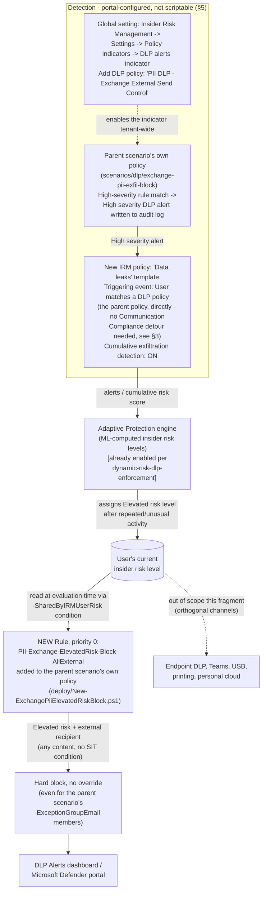

## 1. Problem statement

`scenarios/dlp/exchange-pii-exfil-block/README.md` §11 and `reviews.md` identified the same
structural gap this repository's Teams PCI scenario already documented for a different workload:
the SSN and Credit Card Number sensitive information types (SITs) match within a single message's
content. A sender who splits an SSN or PAN across two or more emails, or spells digits as words,
or inserts separators the pattern doesn't tolerate, defeats every rule in that scenario's policy,
because none of its three rules correlate content across messages or time. This is an inherent
limitation of per-message, pattern-based DLP, not a configuration error.

**This fragment does not claim to solve that problem.** No Microsoft Purview capability
reconstructs split content across separate messages or performs cross-message text correlation, 
this build's grounding pass found none, and `AGENTS.md` §4 prohibits inventing one. What this
fragment builds instead is the best-available, honestly-scoped **behavioral compensating
control**: detect the *pattern of repeated, unusual exfiltration-adjacent activity* a sustained
drip-feed evasion attempt produces, and use that detection to automatically cut off the sender's
external Exchange channel entirely, closing the channel for *continued* attempts after the first
qualifying signal, even though it cannot catch the very first split message. The residual gap for
a single, one-time, perfectly-executed split is documented as still open in `README.md` §11, not
closed by this fragment.

## 2. Why this shape (Insider Risk Management + Adaptive Protection, not a DLP-only fix)

`scenarios/dlp/exchange-pii-exfil-block/README.md` §11 named content-based DLP's single-message
boundary as an accepted, documented residual risk and pointed at
`scenarios/dlp/pci-teams-exfil-block-part2-obfuscation-mitigation/`'s Adaptive Protection pattern
as the applicable fix shape for "other content-pattern-based DLP scenarios in this library"
(`PROGRESS.md`, "Follow-ups discovered while building the PCI Teams Part 2" section, item 3). This
fragment is that generalization applied to Exchange: a **dedicated** Insider Risk Management (IRM)
policy, wired through the already-grounded Adaptive Protection `-SharedByIRMUserRisk` mechanism
into a **new rule added to the parent scenario's own named policy**
(`PII DLP - Exchange External Send Control`), rather than relying solely on
`dynamic-risk-dlp-enforcement`'s general-purpose Exchange+Teams policy.

## 3. Why this fragment is materially simpler than its Teams sibling

The Teams sibling fragment's design.md §3 documents a hard constraint: Microsoft Teams DLP policy
matches are **not** a supported workload for the "High Severity DLP Alert" indicator that feeds
Insider Risk Management, forcing that fragment to route through a Communication Compliance SIT
indicator as a workaround. **That constraint does not apply here.** Microsoft's own reference is
explicit that the DLP-alerts indicator's supported workloads are Exchange Online, SharePoint
Online, and OneDrive for Business, Exchange Online by name. The Insider Risk
Management policy-templates reference independently confirms the **Data leaks** template's
triggering-event option: *"Data leak policy activity that creates a High severity alert... DLP
policy configured for High severity alerts (Exchange Online, SharePoint Online, or OneDrive for
Business workloads only)"*.

This means the feeder IRM policy for this fragment can point **directly** at the parent scenario's
own `PII DLP - Exchange External Send Control` policy as its triggering event, no Communication
Compliance policy, no separate SIT indicator, no second detection surface to keep in sync with the
parent policy's own SIT choices. This is a genuine, worth-stating product-fit finding, not merely
a simplification for its own sake: it means fewer moving parts, one less portal-only prerequisite
to drift out of sync, and a tighter, more auditable line from "the parent policy already flags
this as High severity" to "Insider Risk Management already knows about it." See §6a for the exact
triggering-event choice and why the alternative (the exfiltration-activity trigger the Teams
sibling had to use) is deliberately *not* used here even though it would also work.

## 4. Architecture

Full rule-by-rule rationale for the new rule is in §6. What stays portal-only vs. what this
fragment's code deploys is in §5.

## 5. What's scriptable vs. portal-only

| Component | Mechanism | Scriptable? |
|---|---|---|
| Exchange DLP-alerts indicator, pointed at the parent policy | Purview portal → Insider Risk Management → Settings → Policy indicators → Built-in Indicators → Data loss prevention (DLP) indicators → Add DLP policies | No, portal-only global setting; no Graph/PowerShell write surface for Insider Risk Management global indicator settings was found in this build or in either prior IRM/Adaptive Protection scenario in this library |
| New IRM policy (triggering event, indicators, cumulative exfiltration detection) | Purview portal → Insider Risk Management → Policies → Create policy | No, portal-only; same already-documented finding this fragment inherits from `pci-teams-exfil-block-part2-obfuscation-mitigation/design.md` §5 and `dynamic-risk-dlp-enforcement/design.md` §4 |
| Adding this new feeder policy to Adaptive Protection's scope | Purview portal → Insider Risk Management → Adaptive protection → Insider risk levels | No, portal-only, same constraint already documented across every IRM/Adaptive Protection scenario in this library |
| New DLP rule on the parent policy, keyed on `-SharedByIRMUserRisk` (Elevated) | `deploy/New-ExchangePiiElevatedRiskBlock.ps1` → `New-/Set-DlpComplianceRule` | **Yes**, reuses the GUID/parameter already independently grounded in `dynamic-risk-dlp-enforcement` and the Teams sibling fragment, applied as a new rule on the parent scenario's specific named policy instead of a separate general-purpose policy |

This split is the same shape every IRM/Adaptive Protection scenario in this library has already
established: the *detection/risk-level* side of Adaptive Protection has no scriptable surface;
only the *enforcement* side (a DLP rule condition) does. This fragment does not re-derive that
finding, it inherits it and applies it to a new, more narrowly-scoped rule.

## 6. Key decisions

| Decision | Choice | Rationale |
|---|---|---|
| New rule's scope | `ExchangeLocation` (inherited from the parent policy) + `AccessScope = NotInOrganization`, **no content/SIT condition** | The rule must fire on *any* Exchange message an Elevated-risk sender sends externally, not just ones that happen to match SSN or Credit Card Number, the entire point is to stop continued drip-feed attempts regardless of whether any individual fragment matches a SIT. Scoped to **external** only (not internal) to stay proportionate: the parent scenario's own driver (GDPR Article 32, CCPA/CPRA, ISO/IEC 27001:2022 Annex A.5.12/A.8.2) is about data *leaving* the organization, and blocking an Elevated-risk employee's *internal* mail (e.g., to their own manager) is a materially more disruptive action this fragment does not attempt to justify. |
| Priority | **0** (highest, ahead of every other rule on the parent policy, which compact to start at 1, see §6a below for why this is name-agnostic rather than a fixed list) | An Elevated-risk sender must not receive the parent scenario's own override path (`PII-Exchange-Override-External`) even if they are a nominated exception-group member, a flagged risk level is itself a reason to withhold the self-service override, not merely to fall back to the content-based rules. |
| Action regardless of the parent policy's `-Action` mode | Always `BlockAccess = $true`, **never** `EncryptRMSTemplate`, even if the parent scenario is deployed with `-Action Encrypt` | An Elevated-risk sender gets the strictest available treatment (hard block), not the operator's chosen leniency level for the general population. Encrypting matching content for an *already-flagged* sender still lets the message leave the tenant, the compensating control's entire purpose is to close that channel, not to protect content that is still being sent. |
| No override (`NotifyAllowOverride` omitted) | Deliberate | Mirrors `dynamic-risk-dlp-enforcement`'s own Elevated-block rule and the Teams sibling fragment's identical decision: a user already flagged Elevated cannot self-override a block, by Microsoft's own documented Quick Setup reference behavior for this condition. |
| Priority reconciliation technique | Name-agnostic compaction: read whichever rules currently exist on the policy, preserve their relative order, reassign contiguous priorities starting at 1 (see §6a) | Deliberately **not** the Teams sibling fragment's hardcoded three-rule-name list. The parent Exchange scenario's own policy can carry two, three, or four rules by the time this fragment runs (`-ExceptionGroupEmail` is optional; `scenarios/dlp/exchange-pii-exfil-block-encrypt-mode-audit-companion` is a separate, optional deploy that appends its own rule at a dynamically-computed priority). A hardcoded name list would silently miscount or collide if the companion scenario was deployed. Reading the actual rule set at run time and compacting by relative order handles any combination correctly without needing to know in advance which sibling scenarios are present. |
| Feeder IRM policy | A **new, dedicated** policy (not reusing `departing-employee-data-theft` or the Teams sibling's own feeder policy) | `departing-employee-data-theft` only scores *departing* users (triggering event: resignation/termination date), the wrong population. The Teams sibling's feeder policy is scoped to a Communication Compliance SIT indicator that has no bearing on this fragment's direct DLP-policy trigger. A dedicated **Data leaks**-template policy, triggered directly off the parent Exchange policy, is the correct, independent construct, see §6a. Both this fragment's and the Teams sibling's feeder policies can coexist in Adaptive Protection's scope simultaneously; insider risk levels are tenant-wide and computed from every in-scope feeder policy (`dynamic-risk-dlp-enforcement/README.md` §11, an already-documented constraint this fragment inherits, not re-derives). |

## 6a. Triggering event choice: "User matches a DLP policy," not "User performs an exfiltration activity"

Both triggering-event options are available on the **Data leaks** template's policy workflow
, and both would technically work here since Exchange is a supported DLP-alerts
workload (§3). This fragment deliberately uses the direct DLP-policy-match trigger rather than the
built-in-exfiltration-indicators trigger the Teams sibling fragment had to use, for three reasons:

1. **Precision.** The DLP-policy trigger fires specifically off the parent scenario's own
 `PII-Exchange-Protect-External`/`PII-Exchange-Override-External` High-severity rule matches, 
 exactly the SSN/Credit Card Number exfiltration attempts this fragment exists to compensate for.
 The exfiltration-activity trigger is broader (any built-in Office exfiltration indicator,
 independent of whether the content matched a SIT at all), which is the *only* option available
 for the Teams sibling but is a strictly less-targeted choice here where a better option exists.
2. **One fewer configuration surface to drift.** The DLP-policy trigger reads the parent policy's
 existing `ReportSeverityLevel` settings directly, no separate SIT list to keep in sync with the
 parent scenario's own SIT choices if a buyer later adds a third SIT to that policy.
3. **Consistency with Microsoft's own stated guidance for the Data leaks template**, whose
 documented purpose is explicitly built around a DLP policy as the triggering event
, this fragment uses the template as designed rather than falling back to the
 generic exfiltration-activity path only because a workload gap forces it elsewhere (as the Teams
 sibling must).

**Guideline this fragment's manifest deliberately surfaces** (§ manifest,
`parentDlpPolicyPrerequisite`): Microsoft's own Data leaks policy guidance cautions against
over-assigning High severity broadly, since it directly gates this triggering event
, the parent scenario's default of High severity only on its two
external-recipient rules (not the Low-severity internal-audit rule) is already the correct,
minimal-noise configuration; this fragment requires no change to it.

**Scaling note:** a Data leaks-template IRM policy can have up to 20 DLP policies assigned as a
triggering event. This fragment uses exactly one (the parent Exchange policy),
well within that limit, noted here only so a future buyer who wants one feeder IRM policy to
watch several DLP policies (e.g., this fragment's parent policy plus a future SharePoint/OneDrive
PII policy) knows the ceiling exists, not because this fragment is anywhere near it.

## 6b. VERIFY: no single Microsoft-published example validates this exact composition

Every individual piece of this design, the Exchange DLP-alerts indicator, the Data leaks
template's direct DLP-policy trigger, Cumulative exfiltration detection, and the
`-SharedByIRMUserRisk` DLP condition, is independently grounded against its own Microsoft Learn
reference (§8/`README.md` §12). **No single Microsoft document demonstrates this specific
end-to-end combination** (a named Exchange DLP policy's High-severity alerts feeding a Data-leaks
policy's cumulative exfiltration scoring, in turn driving an Adaptive Protection DLP rule scoped to
that same named policy) as one worked scenario. This is a deliberate, documented composition of
individually-confirmed building blocks, not a fabricated one, but it has not been run end-to-end
against a live tenant during this build. Flagged as an explicit `VERIFY` in `README.md` §7
(pilot-tenant functional test) rather than asserted as Microsoft-validated. This is the same class
of open item already carried by the Teams sibling fragment's own design.md §6b, for the analogous
Teams-side composition.

## 7. Non-goals

- **Does not reconstruct or correlate literal message content across messages.** No Microsoft
 capability does this; this fragment closes the channel *after* a behavioral signal, not by
 detecting the split content itself. Documented as an explicit residual risk in `README.md` §11,
 not fixed.
- **Does not modify or duplicate `scenarios/adaptive-protection/dynamic-risk-dlp-enforcement/`'s
 own DLP policy, or either of `scenarios/dlp/exchange-pii-exfil-block`'s own three rules, or
 `scenarios/dlp/exchange-pii-exfil-block-encrypt-mode-audit-companion`'s rule.** All keep
 operating independently and unchanged (other than the priority-compaction shift this fragment's
 deploy script applies to make room at priority 0); this fragment adds a *separate* rule to the
 parent scenario's *own* named policy so the control's behavior (rule name, alert routing,
 exception-group interaction) stays self-contained and auditable as one control, rather than
 splitting evidence across two differently-owned policies.
- **Does not create or modify any Communication Compliance policy.** Unlike the Teams sibling
 fragment, this fragment needs none, see §3.
- **Does not configure Endpoint DLP, Teams DLP, USB/print restrictions, or personal-cloud-upload
 controls.** An Elevated-risk user blocked from external Exchange sharing by this fragment can
 still exfiltrate via other channels Adaptive Protection's Devices policy or the Teams sibling
 fragment would cover, same already-documented gap `dynamic-risk-dlp-enforcement/README.md` §11
 names, not re-litigated here.
- **Does not attempt to lower the up-to-36-hour Adaptive Protection propagation delay, or the IRM
 cumulative-exfiltration-detection daily evaluation cadence** (§8, `README.md`), both are backend
 processing characteristics of the Purview service, not properties this fragment's code can
 script around.

## 8. References

Full citation list with URLs is in `README.md` §12. Numbered references above:
[1] Configure policy indicators in Insider Risk Management, Data loss prevention alerts
 indicators, supported DLP workloads (Exchange Online, SharePoint Online, OneDrive for
 Business).
[2] Learn about Insider Risk Management policy templates, Data leaks template's DLP-policy
 triggering event and configuration guidelines.
[3] Get started with Insider Risk Management, Step 6, Triggers for this policy page (the "User
 matches a data loss prevention (DLP) policy" vs. "User performs an exfiltration activity"
 triggering-event choice).
