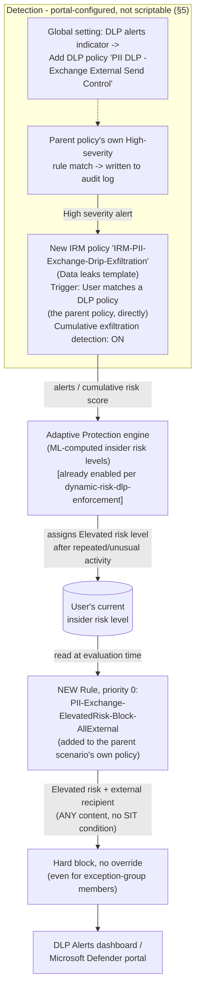

## 1. Scenario summary

Extends [`dlp/exchange-pii-exfil-block`](/scenarios/dlp/exchange-pii-exfil-block/) with a behavioral compensating control for the
gap that scenario's own `README.md` §11 and `reviews.md` deliberately left open: a sender who
splits a Social Security Number (SSN) or credit-card number (PAN) across multiple emails, or
otherwise obfuscates it so no single message matches the SSN/Credit Card Number sensitive
information type (SIT), defeats per-message DLP pattern matching entirely. This fragment wires a
dedicated Insider Risk Management (IRM) policy and Adaptive Protection to detect the *pattern* of
repeated, exfiltration-adjacent activity such an attempt produces, and automatically blocks that
sender from any further external Exchange mail once their insider risk level reaches **Elevated**
— closing the channel for continued attempts, not the first one.

**Who it's for:** a buyer who has already deployed [`dlp/exchange-pii-exfil-block`](/scenarios/dlp/exchange-pii-exfil-block/) and
wants the documented residual risk in its `reviews.md` addressed with a real, working control
rather than left as a permanent gap — while understanding plainly what this control can and cannot
do (§11). This fragment is the Exchange-workload sibling of
[`dlp/pci-teams-exfil-block-part2-obfuscation-mitigation`](/scenarios/dlp/pci-teams-exfil-block-part2-obfuscation-mitigation/), reusing the same
Adaptive-Protection compensating-control pattern with a materially simpler feeder-policy design —
see §4 and `design.md` §3.

## 2. Business/regulatory driver

Same GDPR Article 32 / CCPA/CPRA / ISO/IEC 27001:2022 Annex A.5.12/A.8.2 driver as Part 1 — this
fragment doesn't add a new compliance citation, it strengthens the existing control's
defensibility. An auditor who asks "what stops someone from just splitting the SSN across two
emails?" is asking the single most common DLP bypass question; Part 1 alone answers "nothing, and
we document that." This fragment changes the answer to "a behavioral control that shuts off the
channel once the pattern is detected — not the first message, but every one after it," which is a
materially stronger, still-honest position for a board-level or audit narrative (see `reviews.md`,
CISO lens).

## 3. Prerequisites

Full licensing detail and citations: `docs/licensing-matrix.md`.

| Requirement | Minimum | Notes |
|---|---|---|
| [`dlp/exchange-pii-exfil-block`](/scenarios/dlp/exchange-pii-exfil-block/) already deployed | The named policy `PII DLP - Exchange External Send Control` with at least one existing rule | This fragment's deploy script errors out if the parent policy has no rules to compact around — see `design.md` §6 |
| Insider Risk Management + Adaptive Protection | **Microsoft 365 E5**, **Purview Suite**, or the underlying add-ons | Same entitlement `dynamic-risk-dlp-enforcement/README.md` §3 already documents in full. **This is a new licensing requirement beyond what Part 1 alone needs** — Part 1's own §10 notes DLP for Exchange is included at base **E3**; adding this fragment moves the overall deployment onto the E5/Purview Suite tier. See §10 below. |
| Adaptive Protection already enabled, with Elevated/Moderate/Minor risk levels defined | Portal-only prerequisite | Assumed already complete if `dynamic-risk-dlp-enforcement` is deployed; if not, complete its `README.md` §5 Steps 1–3, 5 first |
| Role to configure IRM policies and the DLP-alerts indicator | **Insider Risk Management** or **Insider Risk Management Admins** role group | Same role used in `dynamic-risk-dlp-enforcement/README.md` §3 |
| Role to extend the DLP policy | **Compliance Administrator**, **Compliance Data Administrator**, or **DLP Compliance Management** | Same DLP-authoring roles used throughout this library |
| Automation identity for the deploy script | App-only certificate authentication to Security & Compliance PowerShell | `docs/automation-surface.md` §3 |

> Verify current entitlement names against `docs/licensing-matrix.md` and the Product Terms before
> a sales commitment — SKU names change.

## 4. Architecture



Unlike this fragment's Microsoft Teams sibling, **no Communication Compliance policy is required**
— Exchange Online is a natively supported "High Severity DLP Alert" indicator workload, so the
feeder IRM policy triggers directly off the parent scenario's own DLP policy. Full rule-by-rule
rationale and the reasoning behind this simplification are in `design.md` §3–6a.

## 5. Step-by-step implementation

### Step 1 — Confirm Part 1 and Adaptive Protection are already deployed

This fragment extends, rather than replaces, [`dlp/exchange-pii-exfil-block`](/scenarios/dlp/exchange-pii-exfil-block/)'s policy.
Confirm it exists and Adaptive Protection is already enabled (per `dynamic-risk-dlp-enforcement/
README.md` §5 Steps 1–3, 5) before continuing.

### Step 2 — Enable the Exchange DLP-alerts indicator (portal, not scriptable)

Purview portal → **Insider Risk Management** → **Settings** → **Policy indicators** → **Built-in
Indicators** tab → **Data loss prevention (DLP) indicators** → **Add DLP policies** → select
**PII DLP - Exchange External Send Control** → **Add** → check **Generating alerts from selected
DLP policies** → **Save** [[1]](#references). Confirm the parent policy's
`PII-Exchange-Protect-External` and `PII-Exchange-Override-External` (if configured) rules are
already at `ReportSeverityLevel: High` — the parent scenario's deploy script sets this by default,
so no change should be needed [[2]](#references).

### Step 3 — Create the feeder Insider Risk Management policy (portal, not scriptable)

Purview portal → **Insider Risk Management** → **Policies** → **Create policy** → template
**Data leaks**. Use `deploy/policy/irm-exchange-drip-exfiltration-config-manifest.json` as the
checklist/reference while doing this:
- **Users/groups:** same population as the parent scenario's DLP policy scope.
- **Triggering event:** on the **Triggers for this policy** page, select **User matches a data
  loss prevention (DLP) policy** and choose **PII DLP - Exchange External Send Control** from the
  dropdown [[3]](#references) — **not** "User performs an exfiltration activity" (that's the
  correct choice only for the Teams sibling fragment, which has no direct DLP-alert path — see
  `design.md` §6a for why the direct trigger is the better choice here).
- **Cumulative exfiltration detection:** leave **ON** (default for this template)
  [[4]](#references).
- **Prioritize content:** sensitive information types → SSN, Credit Card Number.

### Step 4 — Add the feeder policy to Adaptive Protection's scope (portal, not scriptable)

Purview portal → **Insider Risk Management** → **Adaptive protection** → **Insider risk levels** →
confirm the new policy from Step 3 is included, alongside any existing feeder policy (e.g.
[`insider-risk/departing-employee-data-theft`](/scenarios/insider-risk/departing-employee-data-theft/) or the Teams sibling fragment's own feeder
policy). Insider risk levels are tenant-wide and computed from every in-scope feeder policy — see
`dynamic-risk-dlp-enforcement/README.md` §11.

### Step 5 — Deploy the new DLP rule (scripted, dry-run capable)

```powershell
Connect-IPPSSession -AppId $AppId -Certificate $Cert -Organization $TenantDomain

# Dry run - shows exactly what would change, makes no changes
./deploy/New-ExchangePiiElevatedRiskBlock.ps1 -AdminNotificationEmail 'soc@contoso.com' -WhatIf

# Deploy: compacts every existing rule on the parent policy to start at priority 1,
# adds the new rule at priority 0
./deploy/New-ExchangePiiElevatedRiskBlock.ps1 -AdminNotificationEmail 'soc@contoso.com'

# Validate
./validate/Test-ExchangePiiElevatedRiskBlock.ps1
```

The new rule's block action takes effect as soon as the parent policy is in `Enable` mode (Part
1's own deploy/rollout cadence governs that, unchanged by this fragment) — there is no separate
simulation toggle for one rule within an already-live policy. If Part 1's policy is still in
`TestWithNotifications`, this rule will also only simulate.

## 6. Configuration reference

| Setting | `PII-Exchange-ElevatedRisk-Block-AllExternal` (this fragment) |
|---|---|
| Priority | **0** (every other rule on the parent policy compacts to start at 1, preserving relative order — see `design.md` §6, name-agnostic to how many rules exist) |
| Condition | `SharedByIRMUserRisk = FCB9FA93-6269-4ACF-A756-832E79B36A2A` (Elevated) AND `AccessScope = NotInOrganization` |
| Content/SIT condition | **None** — fires on any Exchange message content, matching or not matching SSN/Credit Card Number |
| `BlockAccess` | `$true` — always, regardless of whether the parent policy is running `-Action Block` or `-Action Encrypt` |
| Override allowed | **No** — even for the parent scenario's `-ExceptionGroupEmail` members (see `design.md` §6) |
| `StopPolicyProcessing` | `$true` |
| `ReportSeverityLevel` | High |

Full cmdlet parameter grounding: `deploy/New-ExchangePiiElevatedRiskBlock.ps1` inline comments and
its `.NOTES` block. Portal-only prerequisite configuration (DLP-alerts indicator, feeder IRM
policy, Adaptive Protection scope): `deploy/policy/irm-exchange-drip-exfiltration-config-manifest.json`.

## 7. Validation / how to prove it works

1. **Automated config check** — `./validate/Test-ExchangePiiElevatedRiskBlock.ps1` confirms the
   new rule exists at priority 0 with the correct condition/action, and that every other rule on
   the parent policy was compacted to unique, contiguous priorities starting at 1 without their
   own conditions being altered. Exits non-zero on a hard failure.
2. **Manual checklist** — the same script prints a checklist for everything it has no API to query
   (Exchange DLP-alerts indicator enabled and pointed at the parent policy, feeder IRM policy
   configuration, Adaptive Protection scope) — see its output.
3. **End-to-end functional test (non-production accounts only, pilot tenant) — VERIFY, see §11:**
   a. Confirm a test account's insider risk level is currently **not** Elevated (Purview portal →
      Insider Risk Management → Users).
   b. Drive that account's insider risk level to Elevated — either by waiting for a real detection
      from the feeder policy's trigger (repeated High-severity matches against the parent DLP
      policy), or via **Start scoring activity for users** (Purview portal → Insider Risk
      Management → Policies) to manually add the test account to the feeder policy for a defined
      window, then generating qualifying activity [[5]](#references).
   c. From that account, attempt to send a test message (any content, containing no real PII) to
      an external test mailbox. Expect: **blocked**, no override offered, even if the account is
      an `-ExceptionGroupEmail` member.
   d. From the same account, attempt an internal-only message. Expect: **not** blocked by this
      rule (external-only scope) — the parent scenario's own `PII-Exchange-Audit-Internal` rule
      still applies if the content matches SSN/Credit Card Number.
4. **Evidence for review** — confirm the blocked event appears in the DLP Alerts dashboard /
   Microsoft Defender portal under rule name `PII-Exchange-ElevatedRisk-Block-AllExternal`, and
   cross-reference the triggering IRM alert by user and timestamp (§8 — no shared correlation ID
   exists, same manual-correlation caveat `dynamic-risk-dlp-enforcement/README.md` §8 already
   documents).

## 8. Operations & tuning

**KPIs to watch (first 90 days), in addition to Part 1's own and `dynamic-risk-dlp-enforcement`'s
own KPI sets:**
- **Time from a user's first qualifying High-severity DLP alert to Elevated-risk assignment** —
  measures how long the exposure window actually is for this control, given Cumulative
  exfiltration detection's ~daily evaluation cadence and up-to-36-hour Adaptive Protection
  propagation (§11). If this is consistently multiple days, the compensating control is closing the
  channel too late to matter for a fast, deliberate exfiltration attempt — a finding to escalate
  to CISO review, not something to silently tune around.
- **`PII-Exchange-ElevatedRisk-Block-AllExternal` match volume vs. the parent policy's
  `PII-Exchange-Protect-External`/`PII-Exchange-Override-External` volume** — a rule-0 match with
  no preceding Protect-External match for the same user in recent history suggests the
  Elevated-risk assignment came from a *different* IRM indicator entirely (e.g., SharePoint/OneDrive
  exfiltration, or the Teams sibling fragment's own feeder policy) — investigate via the feeder
  policy's own alert before assuming an Exchange-specific pattern.

**Coordinate with HR/Legal before broad enforcement rollout**, same as
`dynamic-risk-dlp-enforcement/README.md` §8 already requires for its own Elevated-block rule — this
fragment's rule is an *additional*, PII-specific enforcement point driven by the same ML-computed,
opaque risk score, and removes even the `-ExceptionGroupEmail` override path Part 1 otherwise
guarantees. Treat it as the same class of HR/Legal-notified change, not a purely technical
deployment step.

**Incident-response runbook (this rule's block event):**
1. **Triage** — same first step as `dynamic-risk-dlp-enforcement/README.md` §8: open the DLP
   Alerts dashboard/Defender incident, confirm the rule name and sender.
2. **Cross-reference the feeder IRM policy's alert** by user and timestamp (manual — no shared
   correlation ID, §7) **and confirm which indicator actually drove the Elevated assignment** — a
   repeated Exchange PII match, or an unrelated exfiltration indicator (including the Teams sibling
   fragment's own feeder policy, if both are deployed) (§11). Don't assume a PII-data link without
   checking.
3. **Classify** — is the Elevated risk level a true or false positive? Same guidance as
   `dynamic-risk-dlp-enforcement/README.md` §8 — fix the *feeder policy's* tuning if it's a false
   positive, not this rule.
4. **If true positive:** treat as a live incident under the parent scenario's own regulatory
   drivers — this user has already been blocked from further external Exchange sharing; escalate
   per the org's incident-response process and consider a full account review, not just DLP-alert
   closure, given the drip-feed evasion pattern this control exists to catch.

**Review cadence:** quarterly, aligned with the parent scenario's own review cadence and
`dynamic-risk-dlp-enforcement`'s.

## 9. Rollback / decommission

See `rollback.md`. Quick reference: `./deploy/Remove-ExchangePiiElevatedRiskBlock.ps1` switches the
rule to audit-only (reversible); `-Purge` permanently removes it and decompacts the parent policy's
remaining rules back to contiguous 0-based priorities in their original relative order. Neither
action touches the parent scenario's own rules' content, the Encrypt-mode audit companion's rule
(if deployed), or `dynamic-risk-dlp-enforcement`'s separate policy.

## 10. Cost & licensing notes

- **This fragment moves the overall deployment onto the E5/Purview Suite licensing tier.** Part 1
  alone (`exchange-pii-exfil-block/README.md` §10) deliberately stays on base **E3** by avoiding
  advanced classification or Teams conditions. Adding this fragment requires Insider Risk
  Management and Adaptive Protection, both **Microsoft 365 E5 / Purview Suite** capabilities — a
  buyer choosing this fragment accepts that tier uplift for the whole deployment, not just an
  incremental add-on charge. State this plainly when quoting: "Part 1 alone" and "Part 1 + Part 2"
  are materially different licensing conversations.
- **No incremental license cost beyond that tier uplift** — this fragment reuses the same
  E5/Purview Suite entitlement for IRM, Adaptive Protection, and DLP that
  `dynamic-risk-dlp-enforcement` and the Teams sibling fragment already require. No PAYG component.
- **No additional Azure subscription required.**

## 11. Known limitations & gotchas

- **This control does NOT detect or block a single, perfectly-executed split-SSN/PAN message.** No
  Microsoft Purview capability performs cross-message content reconstruction or correlation as of
  this writing (grounded during this build — see `design.md` §1). This fragment is a behavioral
  compensating control that shortens the *exposure window after* a qualifying signal, not a fix
  for the underlying per-message pattern-matching limitation. State this plainly to a buyer —
  overclaiming here is the single easiest way to lose credibility with a technical reviewer.
- **Zero detectable signal against a maximally disciplined attacker.** If a sender splits an
  SSN/PAN finely enough that *no single message* ever contains a recognizable fragment (e.g., one
  digit per message) and generates no other exfiltration-type activity during the attempt, then
  neither the parent DLP policy's High-severity alert nor any other Cumulative Exfiltration
  Detection indicator this fragment relies on produces any scored signal for that user at all —
  Adaptive Protection has nothing to elevate. This control's real-world value is bounded to senders
  whose evasion attempt is imperfect (some fragment still trips a SIT, or the attempt is paired
  with other exfiltration-type behavior Cumulative Exfiltration Detection already tracks), not to a
  theoretically perfect one. Communicate this bound plainly — it is the honest limit of what any
  currently-documented Purview capability can do here, not a gap specific to this fragment's
  design.
- **The parent scenario's `-ExceptionGroupEmail` population in `-Action Encrypt` mode gets ZERO
  additional protection from this fragment, by construction.** The parent scenario's own `README.md`
  §11 already documents that an exception-group member's matching external mail is a "silent
  exception" in Encrypt mode — excluded from `PII-Exchange-Protect-External` (High severity) via
  `ExceptIfFromMemberOf`, with no equivalent override rule created (Encrypt mode has no
  `PII-Exchange-Override-External` rule at all). Unless
  [`dlp/exchange-pii-exfil-block-encrypt-mode-audit-companion`](/scenarios/dlp/exchange-pii-exfil-block-encrypt-mode-audit-companion/) is *also* deployed, that
  traffic generates **no alert of any severity**; even with the companion deployed, its rule is
  fixed at **Low** severity by design (routine-audit priority for expected, approved-exception
  traffic). This fragment's feeder IRM policy only triggers on **High**-severity alerts from the
  parent policy (§5, Step 2) — so a compromised or malicious exception-group member sending
  split-SSN/PAN content externally in Encrypt mode never accumulates the signal this fragment relies
  on, no matter how much they send. **This is not a gap this fragment can close without changing the
  companion scenario's own severity default** (a decision that scenario's own docs already justify
  for its stated purpose — routine-exception visibility, not high-risk detection — and this
  fragment does not relitigate). A buyer running `-Action Encrypt` with an exception group who wants
  this fragment's protection to actually cover that population should raise the companion rule's
  `-ReportSeverityLevel` to `High` (a parameter that script already exposes) as a prerequisite,
  understanding the resulting trade-off (routine exception traffic now triaged at the same priority
  as this fragment's feeder trigger).
- **A user can reach Elevated risk — and be fully blocked from external Exchange sharing by this
  rule — from activity that has nothing to do with SSN/PAN data.** Cumulative Exfiltration
  Detection scores *all* enabled indicators for an in-scope user, not just repeated matches against
  the parent DLP policy. A legitimate bulk SharePoint migration, a large but authorized external
  file share, or the Teams sibling fragment's own feeder-policy activity could independently drive
  a user to Elevated and trigger this rule with no PII-data involvement at all. The
  incident-response runbook (§8, step 2) exists specifically to catch this — always confirm the
  underlying IRM alert's actual triggering source before assuming a PII-data drip-feed pattern.
- **Cumulative exfiltration detection is evaluated ~daily, not in real time** — Microsoft describes
  it as identifying "unusual levels of risk activities when evaluated daily" [[4]](#references).
  Combined with Adaptive Protection's own up-to-36-hour propagation delay after first enabling
  (already documented in `dynamic-risk-dlp-enforcement/README.md` §11), the realistic end-to-end
  exposure window between a user's first qualifying High-severity alert and this rule actually
  blocking them can be **on the order of one to two days**, not minutes. Track this via the KPI in
  §8 rather than assuming near-real-time response.
- **No shared correlation ID between a DLP incident report and the IRM alert that produced the
  triggering risk level.** Same manual-correlation-by-user-and-timestamp caveat
  `dynamic-risk-dlp-enforcement/README.md` §8 already documents — not resolved by this fragment.
- **This rule does not block internal Exchange mail.** Deliberately scoped to external recipients
  only (§6) — an Elevated-risk user can still email colleagues internally. See `design.md` §6 for
  why this is the proportionate choice, not an oversight.
- **VERIFY (pilot tenant): rule priority compaction behavior.** This fragment's deploy script
  explicitly reassigns every other rule's priority rather than relying on `New-DlpComplianceRule
  -Priority 0` to auto-shift existing rules, because Microsoft's cmdlet reference does not document
  whether that auto-shift happens — see `deploy/New-ExchangePiiElevatedRiskBlock.ps1` `.NOTES`.
  This is the same open item already flagged for the Teams sibling fragment's analogous
  reprioritization step. Confirm the resulting priority order with
  `validate/Test-ExchangePiiElevatedRiskBlock.ps1` after deployment.
- **VERIFY (pilot tenant or a future Microsoft Learn pass): no single Microsoft-published example
  validates this exact end-to-end composition** (a named DLP policy's High-severity alerts →
  Data-leaks direct trigger → Cumulative exfiltration scoring → Adaptive Protection → a rule on
  that same named policy). Every individual piece is independently grounded; the combination has
  not been run against a live tenant during this build. See `design.md` §6b.
- **Inherits every "VERIFY before go-live" item already flagged in the parent scenario's and
  `dynamic-risk-dlp-enforcement`'s own Known Limitations sections** — this fragment does not
  re-verify `BlockAccess` behavior for `ExchangeLocation` rules, the `AccessScope`-only condition
  form, or the exact `Get-RMSTemplate` name used when the parent policy runs `-Action Encrypt`; all
  three are still open VERIFY items in those scenarios' own docs.

## 12. References

1. Configure policy indicators in Insider Risk Management — Data loss prevention alerts
   indicators, supported workloads (Exchange Online, SharePoint Online, OneDrive for Business) — <https://learn.microsoft.com/purview/insider-risk-management-settings-policy-indicators#data-loss-prevention-alerts-indicators>
2. Learn about Insider Risk Management policy templates — Data leaks policy guidelines, the
   Incident-reports-High-severity requirement for the DLP-policy triggering event — <https://learn.microsoft.com/purview/insider-risk-management-policy-templates#policy-templates>
3. Get started with Insider Risk Management — Step 6, "Triggers for this policy" page: "User
   matches a data loss prevention (DLP) policy" vs. "User performs an exfiltration activity" — <https://learn.microsoft.com/purview/insider-risk-management-configure#step-6-required-create-an-insider-risk-management-policy>
4. Create and manage Insider Risk Management policies — Cumulative exfiltration detection (daily
   evaluation, 30-day comparison window, enabled-by-default templates) — <https://learn.microsoft.com/purview/insider-risk-management-policies#cumulative-exfiltration-detection>
5. Create and manage Insider Risk Management policies — Immediately start scoring user activity
   ("Start scoring activity for users") — <https://learn.microsoft.com/purview/insider-risk-management-policies#immediately-start-scoring-user-activity>
6. Help dynamically mitigate risks with Adaptive Protection — 36-hour propagation delay — <https://learn.microsoft.com/purview/insider-risk-management-adaptive-protection>
7. New-DlpComplianceRule / Set-DlpComplianceRule reference (`SharedByIRMUserRisk`, `Priority`) — <https://learn.microsoft.com/powershell/module/exchangepowershell/new-dlpcompliancerule>, <https://learn.microsoft.com/powershell/module/exchangepowershell/set-dlpcompliancerule>
8. Remove-DlpComplianceRule reference — <https://learn.microsoft.com/powershell/module/exchangepowershell/remove-dlpcompliancerule>
9. Learn about Insider Risk Management policy templates — policy template prerequisites and
   triggering events table (Data leaks: DLP policy configured for High severity alerts, Exchange
   Online/SharePoint Online/OneDrive for Business workloads only) — <https://learn.microsoft.com/purview/insider-risk-management-policy-templates#policy-template-prerequisites-and-triggering-events>
10. Create and manage Insider Risk Management policies — Policy health notification messages
    ("DLP policy doesn't meet requirements", "DLP policy isn't selected as the triggering event") — <https://learn.microsoft.com/purview/insider-risk-management-policies#policy-health>
11. `scenarios/dlp/exchange-pii-exfil-block/README.md` §11–12 — the original documented gap and
    Part 1's own citation list (SSN/Credit Card Number SITs, Exchange DLP conditions/actions).
12. [`dlp/pci-teams-exfil-block-part2-obfuscation-mitigation`](/scenarios/dlp/pci-teams-exfil-block-part2-obfuscation-mitigation/) — the sibling scenario this
    one's compensating-control pattern (`-SharedByIRMUserRisk`, no-override, priority-0 rule)
    directly reuses, and the source of the Teams-workload constraint this fragment's design.md §3
    contrasts against.
13. `scenarios/adaptive-protection/dynamic-risk-dlp-enforcement/README.md` §3–6, §11–12 — the
    `SharedByIRMUserRisk` grounding and Adaptive Protection prerequisites this fragment reuses
    without re-deriving.

> Re-verify all links and product behavior against current Microsoft Learn before a
> customer-facing assessment or sale — Insider Risk Management and Adaptive Protection are
> comparatively new capabilities that change faster than most in the Purview portfolio.
