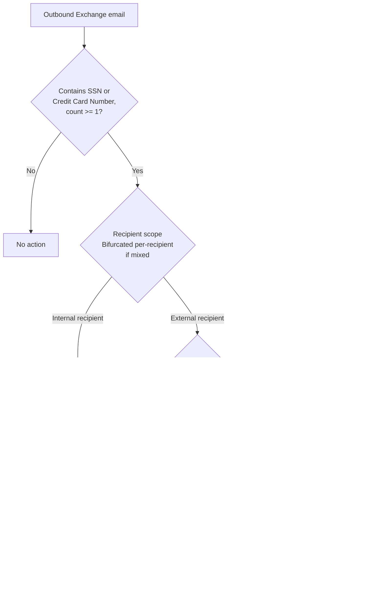

## 1. Problem statement

`scenarios/information-protection/auto-label-confidential-exchange/` automatically labels
Exchange email containing SSNs or credit card numbers as **Confidential**, and — for internal
senders only — that label happens to carry encryption as a side effect. Its own `README.md` §11
documents the resulting gap in plain terms:

> out of the box, a message containing an SSN or card number sent to an external recipient is
> labeled Confidential but leaves the tenant in cleartext

Labeling is a classification action, not a real-time movement control: it never inspects a
recipient's domain, and its "encrypt if labeled" behavior is an incidental property of the label
definition, not something the auto-labeling policy itself decides per-message. This scenario
closes that specific gap with what Purview actually ships for movement-based enforcement — a
**content-based DLP policy**, not a label-conditioned one — that evaluates the SSN/Credit Card
Number sensitive information types directly against the message and its recipients, the same
pattern `scenarios/dlp/pci-teams-exfil-block/` already established for Teams.

This scenario is additive to, not a replacement for, the auto-labeling scenario: labeling still
gives classification coverage and (for internal mail) encryption; this policy adds the movement
control labeling alone cannot provide — an outbound-to-external check that blocks or encrypts on
its own terms, independent of whether the message happens to carry a label.

## 2. Design goals

1. Detect the same two representative PII/financial sensitive information types this library's
   Exchange and SharePoint/OneDrive scenarios already use — **U.S. Social Security Number (SSN)**
   and **Credit Card Number** — in outbound Exchange email addressed to at least one external
   recipient.
2. Give the buyer an explicit choice between two real, Microsoft-documented actions for the
   external-recipient case: a **hard block** (mail is not delivered to the external recipient) or
   **forced encryption** (mail is delivered, protected by Microsoft Purview Message Encryption) —
   not silently default to one without the operator choosing.
3. Provide a controlled, logged **override path** for a nominated business-exception group
   (e.g., an HR/Payroll team with an approved, recurring need to email PII to a named external
   benefits administrator) when running in Block mode — the same override-with-justification
   pattern already proven in `pci-teams-exfil-block`.
4. Keep visibility on **internal** sharing of the same content via a non-blocking audit rule, the
   same audit-first posture this library uses everywhere content is not yet fully locked down.
5. Idempotent and re-runnable: running the deploy script twice must not create duplicate policies
   or rules.
6. Ship "off" by default: `TestWithNotifications` simulation mode first, matching `AGENTS.md` §4
   and every other DLP scenario in this library.
7. Content-based, not label-conditioned: this policy's rules never reference a sensitivity label
   as a condition. It evaluates and acts on content directly, so it protects a message regardless
   of whether an auto-labeling policy has run, is delayed, or is disabled — see §3.

## 3. Why content-based, not label-conditioned

A tempting alternative design would be a DLP rule with a **condition** of "the message carries
the Confidential label" (`ContentContainsSensitiveInformation` isn't the only option — DLP
supports label-based conditions too). This scenario deliberately does not do that, for two
reasons:

- **Ordering is not guaranteed.** Auto-labeling and DLP are both evaluated as the message passes
  through the transport pipeline, but nothing in Microsoft's documentation guarantees the label
  is already applied by the time this DLP rule evaluates the same message. A label-conditioned
  rule risks silently not firing on the very first message a sender ever sends this content in,
  before either policy has "seen" the sender's pattern.
- **The auto-labeling and DLP scenarios are independent deployments.** A buyer might deploy this
  DLP scenario without the auto-labeling one (or vice versa), or might use a different label name
  entirely. Content-based conditions have no dependency on the sibling scenario's label being
  deployed, named a specific way, or even existing.

The cost of this choice: this rule's own audit/incident-report history and the label-based
Activity Explorer history are two independent signals for the same event, not one unified trail.
`README.md` §8 documents this explicitly rather than implying the two scenarios share a single
detection surface.

## 3a. Why a custom policy instead of a built-in DLP policy template

Microsoft ships several built-in DLP policy templates that overlap this scenario's shape closely
enough to need an explicit justification, not just a passing mention. The closest is **U.S.
Patriot Act**, whose high-count rule already combines Credit Card Number + U.S. Social Security
Number (SSN) conditions, a "Content is shared with: People outside my organization" condition
(the template-wizard name for `AccessScope: NotInOrganization`), and a block-with-override action
— structurally almost identical to this scenario's `PII-Exchange-Protect-External` +
`PII-Exchange-Override-External` pair [[15]](#references). The separate **U.S. Personally
Identifiable Information (PII) Data** template family covers SSN but not Credit Card Number
[[15]](#references), so it alone wouldn't meet this scenario's goal even before considering the
other reasons below.

This scenario deploys a named, purpose-built policy instead of editing/enabling the Patriot Act
template, for the same class of reason `pci-teams-exfil-block/design.md` §3a gives for not editing
the tenant's default Teams DLP policy:

- **Volume-banding mismatch.** The Patriot Act template's two-rule low/high-count split (1–9 vs.
  10–500) is designed around a different tuning philosophy than this library's `mincount = 1`
  standard, already used consistently across `pci-teams-exfil-block` and both auto-labeling
  scenarios. Reusing the template means either accepting its banding (inconsistent with every
  sibling scenario in this library) or rewriting both of its rules anyway — at which point the
  claimed reuse benefit is gone.
- **No Encrypt-mode option.** The template's high-count rule only blocks; it has no
  `EncryptRMSTemplate` action. A buyer choosing this scenario's `-Action Encrypt` mode (§6) has no
  template starting point to adapt.
- **No group-scoped exception.** The template's override is a generic "any user can request an
  override," not scoped to a nominated business-exception group the way `-ExceptionGroupEmail`
  is. Restricting the override path to a specific team is a deliberate design choice this
  scenario's rules make explicit, not a generic self-service override any sender can invoke.
- **Regulatory-narrative conflation.** The template is named and framed around U.S. Patriot Act
  compliance specifically; a buyer whose actual driver is GDPR/CCPA/ISO 27001 (§2) inherits a
  misleading policy name and Insights-tab regulatory framing that doesn't match their compliance
  narrative, and a later admin "resetting to template defaults" risks silently discarding this
  scenario's customizations.

None of this makes the built-in templates wrong for every buyer — a buyer whose actual driver
*is* U.S. Patriot Act reporting, with the Microsoft-designed volume bands, is well served by
using it directly instead of this scenario. This scenario is for the buyer who needs the specific
shape described in §1–§2: consistent `mincount = 1` detection matching every sibling scenario in
this library, a documented choice between Block and Encrypt, and a group-scoped, logged exception
path.

## 4. Policy architecture

One DLP policy (`<PolicyName>`, default `PII DLP - Exchange External Send Control`), two or three
rules depending on parameters, evaluated in priority order:

| Priority | Rule | Created when | Scope | Action |
|---|---|---|---|---|
| 0 | `PII-Exchange-Override-External` | `-Action Block` **and** `-ExceptionGroupEmail` supplied | `FromMemberOf <ExceptionGroupEmail>`, `AccessScope NotInOrganization` | `BlockAccess $true` with `NotifyAllowOverride WithJustification` — logged, justified override, not a silent bypass |
| 1 | `PII-Exchange-Protect-External` | Always | `AccessScope NotInOrganization`; `ExceptIfFromMemberOf <ExceptionGroupEmail>` when supplied and `-Action Block` (the override rule already handles that group); `ExceptIfFromMemberOf` also applied when `-Action Encrypt` (no override concept for a non-halting action — see §6) | `-Action Block` → `BlockAccess $true`. `-Action Encrypt` → `EncryptRMSTemplate <EncryptTemplateName>` |
| 2 | `PII-Exchange-Audit-Internal` | Always | `AccessScope InOrganization` | `BlockAccess $false`, alert + incident report only |

Both SIT conditions are OR-combined, `mincount 1` each, the same shape as
`auto-label-confidential-exchange` and `pci-teams-exfil-block`:

```powershell
@(
    @{ name = 'U.S. Social Security Number (SSN)'; mincount = '1' },
    @{ name = 'Credit Card Number'; mincount = '1' }
)
```



## 5. Bifurcation — why a mixed-recipient message needs no special handling

A message addressed to both an internal and an external recipient is **bifurcated** (forked) by
Exchange transport into separate copies per recipient before DLP rules evaluate it, and rule
conditions/actions apply independently to each fork — including generating a separate
alert/incident report per fork [[9]](#references). Concretely: a message to one internal and one
external recipient, containing an SSN, produces two independent rule evaluations — the internal
fork matches Rule 2 (audit, delivered) and the external fork matches Rule 0 or 1 (override or
block/encrypt) — with no extra logic required in this scenario's rules to handle the mixed case.
This is a genuine behavioral difference from `pci-teams-exfil-block`: a Teams chat message is a
single unit with no per-recipient forking, so that scenario's rules don't need this same
reasoning. `README.md` §11 documents the operational consequence: an internal user included on
the same thread as an external recipient still receives their (audited, undelivered-anywhere-else)
copy even when the external copy is hard-blocked.

## 6. Key decisions

| Decision | Choice | Rationale |
|---|---|---|
| Condition parameter for "external recipient" | `-AccessScope NotInOrganization` / `InOrganization` | Confirmed applicable to Exchange DLP rules directly (not just SharePoint/OneDrive/Teams) — same enum, same parameter, on the official `New-DlpComplianceRule` reference [[3]](#references); reuses the exact pattern `pci-teams-exfil-block` already established, keeping this library's DLP scenarios consistent. |
| Default action | `-Action Block` (`BlockAccess $true`) | Matches this library's existing default posture (`pci-teams-exfil-block`'s hard-block rule) and needs no additional tenant configuration (Message Encryption/RMS templates) to work correctly on first deploy. |
| Encrypt action mechanism | `-EncryptRMSTemplate <EncryptTemplateName>`, default `Encrypt-Only` | `EncryptRMSTemplate` is a real, documented `New-/Set-DlpComplianceRule` parameter identifying an RMS template by name [[4]](#references); **Encrypt-Only** is a real, Microsoft-documented ad-hoc template automatically available once Microsoft Purview Message Encryption is active in the tenant [[6]](#references), and (unlike **Do Not Forward**) doesn't restrict the recipient's ability to forward/print/reply, which is the closer match to "let external mail through, just protect it in transit" rather than also imposing usage-rights restrictions the buyer didn't ask for. Not asserted as the literal string `Get-RMSTemplate` returns for every tenant — see the pre-flight check below and `README.md` §11. **Trade-off, not a free lunch:** because Encrypt-Only imposes no forward/print/reply restriction [[12]](#references), it protects the message in transit and at rest, but not after a legitimate external recipient decrypts it — they can forward the plaintext content further with no additional control from this scenario. A buyer whose threat model includes "the external recipient themselves is the risk, not just the network path" should pass `-EncryptTemplateName 'Do Not Forward'` instead; this scenario defaults to Encrypt-Only because it more narrowly matches "protect the exfiltration path," not because it's the safer choice in every case. Documented as a Red Team finding in `reviews.md`. |
| Encrypt-mode pre-flight check | Deploy script runs `Get-RMSTemplate -ResultSize Unlimited` and confirms a template matching `-EncryptTemplateName` exists before creating/updating the rule, rather than trusting the name blindly | `Get-RMSTemplate`'s own reference confirms it lists the tenant's actual active templates by name [[5]](#references), but neither that reference nor the Message Encryption documentation gives a canonical, byte-exact `Name` property value for the auto-created Encrypt-Only template across all tenants — checking at deploy time turns a possible silent misconfiguration (a rule referencing a template that doesn't exist) into a clear, actionable pre-flight failure instead. Flagged as `VERIFY` in `README.md` §11 rather than assumed. |
| Override mechanism for the exception group | Block-with-justification (`NotifyAllowOverride WithJustification`), **Block mode only** | Directly reuses `pci-teams-exfil-block`'s proven Rule-0 pattern (same audit trail, same logged-override guarantee) rather than inventing a new mechanism. Not offered in Encrypt mode: `EncryptRMSTemplate` is a non-halting action with no user-facing block to override — the exception group is instead excluded from the encrypt rule outright via `ExceptIfFromMemberOf`, which is a real behavioral difference (silent exception, not a logged override) documented as a residual risk in `README.md` §11, the same class of finding already raised and accepted for the sibling Exchange auto-labeling scenario's own sender exception. |
| Internal-audit rule's recipient condition | Explicit `-AccessScope InOrganization`, not omitted | `pci-teams-exfil-block`'s internal-audit rule omits any recipient condition and relies on priority + `StopPolicyProcessing` alone, which is correct for Teams (no bifurcation). For Exchange, being explicit keeps the rule's intent legible against the bifurcation behavior in §5 rather than depending on an implicit "whatever didn't match the rules above" assumption carrying over correctly to a workload where a single message can produce differently-scoped forks. |
| Sensitive information types | Same **SSN** + **Credit Card Number** pair as every other Exchange/SharePoint/OneDrive scenario in this library | Consistency with `auto-label-confidential-exchange`, `auto-label-confidential-sharepoint`, and `pci-teams-exfil-block` — same U.S.-centric starter-set caveat applies (see those scenarios' `README.md` §2, not repeated here to avoid drift). |
| Deploy surface | Security & Compliance PowerShell (`Connect-IPPSSession`, `New-/Set-/Remove-DlpCompliancePolicy`/`DlpComplianceRule`) | Automation surface 2 per `docs/automation-surface.md` §1 — same surface every other DLP scenario in this library uses. |
| Default policy mode | `TestWithNotifications` | Matches `AGENTS.md` §4 and this library's established precedent for every DLP/auto-labeling scenario. |

## 7. Non-goals

- This scenario does not author, publish, or reference the `Confidential` sensitivity label from
  `auto-label-confidential-exchange` — it is fully independent of that scenario by design (§3).
- This scenario does not cover SharePoint/OneDrive, Teams, or Endpoint DLP locations — those are
  `auto-label-confidential-sharepoint`, `pci-teams-exfil-block`, and `endpoint-dlp-usb-block`
  respectively. `-ExchangeLocation` is the only location this policy targets.
- This scenario does not build a group-scoped pilot rollout mechanism beyond the existing
  `-Mode TestWithNotifications` simulation stage — the same staged-rollout precedent as every
  other DLP scenario in this library.
- This scenario does not configure Microsoft Purview Advanced Message Encryption (expiration,
  revocation, custom branding, encrypted-portal activity logs) — the basic `EncryptRMSTemplate`
  action this scenario uses is included at the same E3-tier entitlement as base DLP
  [[7]](#references)[[8]](#references); Advanced Message Encryption is a separate, higher-tier
  add-on with no bearing on whether this scenario's `-Action Encrypt` mode works.
- This scenario does not set up Microsoft Purview Message Encryption / activate Azure Rights
  Management in the tenant — that is a one-time tenant prerequisite (usually already active by
  default) documented as a prerequisite in `README.md` §3, not something this scenario's deploy
  script configures.
- This scenario does not attempt cross-message correlation (e.g., a PAN split across two separate
  emails) — the same single-message evaluation boundary already documented as an accepted,
  unmitigated residual risk for `pci-teams-exfil-block` (`reviews.md` there, Red Team finding 1).

## References

1. New-DlpComplianceRule reference — full parameter syntax, confirms `AccessScope`,
   `EncryptRMSTemplate`, `BlockAccess` — <https://learn.microsoft.com/powershell/module/exchangepowershell/new-dlpcompliancerule>
2. Set-DlpComplianceRule reference — <https://learn.microsoft.com/powershell/module/exchangepowershell/set-dlpcompliancerule>
3. New-DlpComplianceRule reference — `-AccessScope` parameter description: "InOrganization: ... a
   recipient inside the organization. NotInOrganization: ... a recipient outside the
   organization." — <https://learn.microsoft.com/powershell/module/exchangepowershell/new-dlpcompliancerule#-accessscope>
4. New-DlpComplianceRule reference — `-EncryptRMSTemplate` parameter description (identifies an
   RMS template by name; use `Get-RMSTemplate` to see available templates) — <https://learn.microsoft.com/powershell/module/exchangepowershell/new-dlpcompliancerule#-encryptrmstemplate>
5. Get-RMSTemplate reference — <https://learn.microsoft.com/powershell/module/exchangepowershell/get-rmstemplate>
6. How to disable the Encrypt-Only feature in Outlook (confirms **Encrypt-Only** is added
   automatically as an ad-hoc template once Microsoft Purview Message Encryption is enabled) —
   <https://learn.microsoft.com/troubleshoot/microsoft-365/purview/office-message-encryption/disable-encrypt-only>
7. Message encryption FAQ — "What subscriptions do I need to use Microsoft Purview Message
   Encryption?" (included in Office 365/Microsoft 365 Enterprise E3 and E5, no extra license) —
   <https://learn.microsoft.com/purview/ome-faq#what-subscriptions-do-i-need-to-use-microsoft-purview-message-encryption->
8. Microsoft Purview service description — Information Protection Message Encryption feature
   availability table (E3/E5 tiers) — <https://learn.microsoft.com/office365/servicedescriptions/microsoft-365-service-descriptions/microsoft-365-tenantlevel-services-licensing-guidance/microsoft-purview-service-description#microsoft-purview-information-protection-message-encryption>
9. Bifurcation (Exchange reference) — DLP policy implications: "Policies that might have applied
   to the original message might no longer apply to some of the forks. Rule actions will be
   executed independently for all the forks (for example, generating a notification or incident
   report for each copy of the message)." — <https://learn.microsoft.com/exchange/reference/bifurcation#why-bifurcation>
10. Data Loss Prevention policy reference — Exchange action table, halting/non-halting behavior
    ("Restrict access or encrypt the content in Microsoft 365 locations (Block Everyone, Block
    only people outside your organization)" is halting; the Encrypt Email Messages sub-option is
    non-halting) — <https://learn.microsoft.com/purview/dlp-policy-reference#rules>
11. Data loss prevention Exchange conditions and actions reference — condition/action-to-PowerShell-parameter
    mapping table — <https://learn.microsoft.com/purview/dlp-exchange-conditions-and-actions>
12. How to disable the Encrypt-Only feature in Outlook — confirms Encrypt-Only imposes no
    forward/print/reply restriction (unlike Do Not Forward), relevant to §6's template choice —
    <https://learn.microsoft.com/troubleshoot/microsoft-365/purview/office-message-encryption/disable-encrypt-only>
13. Data Loss Prevention policy reference — "Content is shared from Microsoft 365, with people
    outside my organization" condition wording used by the DLP policy-creation wizard, corroborates
    that this maps to the same `AccessScope` condition used by policy templates and by this
    scenario's custom rules — <https://learn.microsoft.com/purview/dlp-policy-reference#rules>
14. Data Loss Prevention policy reference — policy template catalog (category/template/SIT table) —
    <https://learn.microsoft.com/purview/dlp-policy-reference#policy-templates>
15. What the DLP policy templates include — U.S. Patriot Act and U.S. Personally Identifiable
    Information (PII) Data / PII Data Enhanced template definitions (conditions, actions, SIT
    lists) — <https://learn.microsoft.com/purview/dlp-policy-templates-include>
