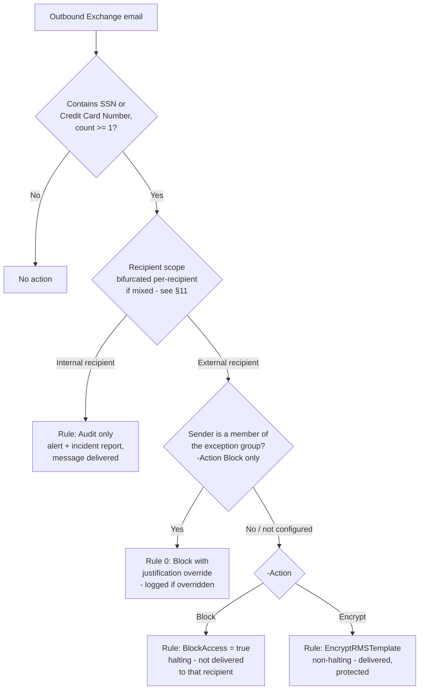

## 1. Scenario summary

A content-based Microsoft Purview DLP policy that inspects outbound Exchange Online email for
U.S. Social Security Numbers and credit card numbers, and, for mail addressed to at least one
**external** recipient, either **hard-blocks delivery** or **forces Microsoft Purview Message
Encryption**, per an operator choice. A nominated business-exception group can be given a logged,
justified override path (Block mode only). Internal-only sharing of the same content is
audit-only, matching this library's staged-rollout posture. Unlike this library's Information
Protection auto-labeling scenarios, this policy never references a sensitivity label, it acts on
content directly and independently of whether any label has been applied.

**Who it's for:** any enterprise that has deployed
`scenarios/information-protection/auto-label-confidential-exchange/` (or plans to) and needs the
movement control that labeling alone cannot provide, a real-time check against the recipient's
domain, not just a classification tag. Also stands alone for a buyer that wants Exchange PII
exfiltration control without an auto-labeling program at all.

## 2. Business/regulatory driver

Same drivers as the sibling scenarios in this library, **GDPR Article 32**, **CCPA/CPRA**, and
**ISO/IEC 27001:2022 Annex A.5.12/A.8.2**, but aimed specifically at the moment data leaves the
tenant, not just at classifying it. `auto-label-confidential-exchange/README.md` §11 documents the
gap this scenario exists to close: by default, an internal-sender message matching SSN/Credit Card
Number conditions is labeled Confidential, but a message to an **external** recipient leaves the
tenant in cleartext unless a separate Rights Management owner is configured on that policy. A
regulator or auditor evaluating "what actually stops this data from leaving the company" needs an
answer that doesn't depend on a label's side effects, this scenario is that answer.

## 3. Prerequisites

Full licensing detail and citations: [Licensing matrix](/docs/licensing-matrix/).

| Requirement | Minimum | Notes |
|---|---|---|
| DLP for Exchange Online | **Microsoft 365 E3** (basic) | This scenario uses only built-in sensitive information types and standard conditions, no advanced classification, no Teams, so it does not require the E5-tier uplift [Licensing matrix](/docs/licensing-matrix/) §DLP row notes for advanced classification/Teams. |
| `-Action Encrypt` mode (Microsoft Purview Message Encryption / `EncryptRMSTemplate`) | Included in the same **Office 365 / Microsoft 365 Enterprise E3 or E5** entitlement, no extra license for the basic Encrypt-Only/Do Not Forward templates this scenario uses | Only the **Advanced** Message Encryption add-on (expiration, revocation, custom branding) needs a higher tier, not used by this scenario. |
| Azure Rights Management activated | Usually active by default for eligible plans | Prerequisite for `-Action Encrypt` only. Confirm with `Get-IRMConfiguration` (`AzureRMSLicensingEnabled = $true`); see `design.md` §7 and Microsoft's "Set up Message Encryption" guide. |
| Role to author/edit the DLP policy and rules | **Compliance Administrator**, **Compliance Data Administrator**, or a custom role group with the **DLP Compliance Management** role | [RBAC model §3](/docs/rbac-model/#3-microsoft-entra-roles-that-map-into-purview), DLP row. |
| Automation identity | App registration with **Exchange.ManageAsApp**, granted a role group with DLP Compliance Management | Certificate-based app-only auth, [Automation surface §3](/docs/automation-surface/#3-authentication-patterns-interactive-vs-unattended) |
| Business-exception group (optional) | An existing mail-enabled security group or Microsoft 365 group | Not created by this scenario, see `-ExceptionGroupEmail` in `deploy/New-ExchangePiiDlpPolicy.ps1` |
| Tenant configuration: unified audit logging on | Audit log search enabled | Required for DLP Alerts / Activity Explorer / incident reports |

> Verify current entitlement names against [Licensing matrix](/docs/licensing-matrix/) (dated 2026-09-02) and the
> Product Terms before a sales commitment, SKU names change.

## 4. Architecture



One DLP policy (`PII DLP - Exchange External Send Control`), two or three rules depending on
parameters, deployed as a named custom policy rather than the built-in **U.S. Patriot Act**
template it structurally overlaps with, see `design.md` §3a for why. Full architecture rationale:
`design.md` §4.

## 5. Step-by-step implementation

### Portal path (for a first manual walkthrough / to validate intent before scripting)

1. Sign in to the [Microsoft Purview portal](https://purview.microsoft.com) → **Solutions** →
 **Data loss prevention** → **Policies** → **+ Create policy** → **Custom** → **Custom policy**
 → **Next**.
2. Name: `PII DLP - Exchange External Send Control`.
3. **Choose locations**: select **Exchange email** only.
4. **Define policy settings** → **Create or customize advanced DLP rules** → **+ Create rule**.
5. Rule `PII-Exchange-Protect-External`: **Conditions** → **Content contains** → **Sensitive info
 types** → add **U.S. Social Security Number (SSN)** and **Credit Card Number**, minimum count
 **1** each, **Any of these** (OR). Add condition **Recipient is** → **outside my organization**
 (`AccessScope: NotInOrganization`). **Actions** → **Restrict access or
 encrypt the content in Microsoft 365 locations** → either **Block users from receiving email**
 (hard block) or **Encrypt email messages** and pick an RMS template (e.g. **Encrypt-Only**)
.
6. Rule `PII-Exchange-Audit-Internal`: same SIT conditions, **Recipient is** → **inside my
 organization**. **Actions**: alert + incident report only, no block.
7. (Optional) Rule `PII-Exchange-Override-External` (Block mode only, priority above the protect
 rule): same SIT conditions + **Sender is a member of** the nominated exception group, **Recipient
 is outside my organization**, **Block users from receiving email**, with **User can override
 the rule** → **With business justification**.
8. **Policy mode**: select **Run the policy in simulation mode** (do not select "turn it on
 automatically after 7 days", same deliberate-enable standard as every other scenario in this
 library). **Submit** → **Done**.

### Script path (idempotent, parameterized, dry-run capable)

```powershell
# 1. Connect (certificate app-only, see docs/automation-surface.md §3)
Connect-IPPSSession -AppId $AppId -Certificate $Cert -Organization $TenantDomain

# 2. Dry run, reports every change, makes none
./deploy/New-ExchangePiiDlpPolicy.ps1 `
    -AdminNotificationEmail 'soc@contoso.com' `
    -ExceptionGroupEmail 'hr-benefits-ops@contoso.com' `
    -WhatIf

# 3. Deploy in simulation mode (default), Block mode, with a business-exception group
./deploy/New-ExchangePiiDlpPolicy.ps1 `
    -AdminNotificationEmail 'soc@contoso.com' `
    -ExceptionGroupEmail 'hr-benefits-ops@contoso.com'

# 3b. Or deploy in Encrypt mode instead of Block
./deploy/New-ExchangePiiDlpPolicy.ps1 `
    -AdminNotificationEmail 'soc@contoso.com' `
    -Action Encrypt

# 4. After a review window, enforce
./deploy/New-ExchangePiiDlpPolicy.ps1 `
    -AdminNotificationEmail 'soc@contoso.com' `
    -ExceptionGroupEmail 'hr-benefits-ops@contoso.com' `
    -Mode Enable -Force

# 5. Validate
./validate/Test-ExchangePiiDlpPolicy.ps1 -Action Block -ExceptionGroupEmail 'hr-benefits-ops@contoso.com'
```

The deploy script uses Security & Compliance PowerShell (`New-DlpCompliancePolicy`,
`New-DlpComplianceRule`), automation surface 2 per [Automation surface §1](/docs/automation-surface/#1-five-automation-surfaces-not-one-read-this-first), the same
surface every other DLP scenario in this library uses.

## 6. Configuration reference

| Setting | `PII-Exchange-Override-External` (Priority 0, Block mode + exception group only) | `PII-Exchange-Protect-External` (Priority 1) | `PII-Exchange-Audit-Internal` (Priority 2) |
|---|---|---|---|
| Sensitive info types | SSN, Credit Card Number, `mincount = 1` each, OR-combined | Same | Same |
| `AccessScope` | `NotInOrganization` | `NotInOrganization` | `InOrganization` |
| `FromMemberOf` / `ExceptIfFromMemberOf` | `FromMemberOf = <ExceptionGroupEmail>` | `ExceptIfFromMemberOf = <ExceptionGroupEmail>` when set |, |
| Action | `BlockAccess $true` + `NotifyAllowOverride WithJustification` | `-Action Block` → `BlockAccess $true`. `-Action Encrypt` → `EncryptRMSTemplate <EncryptTemplateName>` | `BlockAccess $false` |
| `StopPolicyProcessing` | `$true` | `$true` | (n/a, last rule) |
| `ReportSeverityLevel` | `High` | `High` | `Low` |

| Policy-level setting | Value |
|---|---|
| `Name` | `<PolicyName>` (default `PII DLP - Exchange External Send Control`) |
| `ExchangeLocation` | `All` |
| `Mode` | `TestWithNotifications` (deploy default) → `Enable` after review |

Full cmdlet parameter grounding: `deploy/New-ExchangePiiDlpPolicy.ps1` inline comments and its
`.NOTES` block cite the exact Microsoft Learn PowerShell reference pages.

## 7. Validation / how to prove it works

1. **Automated config check**, `./validate/Test-ExchangePiiDlpPolicy.ps1 -Action Block` (or
 `-Action Encrypt`, matching deploy) confirms the policy and rules exist with the expected
 recipient scope, action, and (if configured) exception-group wiring. Exits non-zero on any hard
 failure. Proves the policy is *shaped* correctly, not that it is *matching real mail*, do steps
 2-5 before trusting it in production.
2. **Simulation results**, Purview portal → Data loss prevention → Policies → select the policy →
 **Activity** / **Insights** tab, reviewing matches from simulation-mode traffic.
3. **Functional test, external block/encrypt.** While in simulation or enforced, send a test
 message containing a documented test SSN or card-brand test number (never real PII) from an
 in-scope mailbox to an external test mailbox you control. In Block mode, confirm the sender
 receives a policy-tip/NDR-style notice and the message is not delivered externally. In Encrypt
 mode, confirm the external recipient receives a protected message (Encrypt-Only prompts for a
 one-time passcode or Microsoft account sign-in) rather than plaintext.
4. **Functional test, internal audit.** Send the same test content to an internal-only recipient.
 Confirm the message is delivered normally and an alert/incident report is generated (audit, not
 block).
5. **Override test (Block mode + exception group only).** Send matching content from a member of
 the exception group to an external test recipient. Confirm the policy tip offers an override
 with justification, and confirm the resulting override is visible in the DLP Alerts /
 incident-report history, this is the control that makes the exception auditable rather than
 silent.
6. **Bifurcation test.** Send one message with both an internal and an external recipient,
 containing matching content. Confirm the internal recipient still receives their copy
 (audited) while the external copy is blocked/encrypted independently, see `design.md` §5 and
 §11 below.
7. **Enforcement confirmation**, after moving to `-Mode Enable`, re-run the automated config
 check and confirm it reports `Mode: Enable` rather than a `Test*` value.

## 8. Operations & tuning

**Deployment sequence**: Off → simulation mode → review for at least a business cycle (7+ days,
with representative test/real traffic during the window) → Enable. Same deliberate-enable
standard as every other DLP scenario in this library.

**KPIs to watch (first 30-60 days):**
- **DLP Alerts / incident-report volume** for the `PII-Exchange-Protect-External` rule, split by
 Block vs. override (if an exception group is configured), a sudden spike in overrides is the
 earliest signal the exception group's approved workflow has changed or is being misused.
- **`PII-Exchange-Audit-Internal` volume**, watched for the same truncated-digit-string
 false-positive pattern documented for `pci-teams-exfil-block` (help-desk staff quoting partial
 card numbers, etc.), tune before this becomes noise that gets ignored.
- **Bounce/NDR-related help-desk tickets** in Block mode, which are the practical detection signal
 for a sender who didn't understand why their external mail didn't arrive.

**Alert routing:** lands in the DLP Alerts dashboard / Microsoft Defender portal, same as every
other DLP scenario in this library; see [Automation surface §4](/docs/automation-surface/#4-routing-table-which-surface-for-which-purview-task) for building a custom
SIEM pipeline (out of scope for this scenario's deliverable).

**Runbook, an external message containing PII wasn't blocked/encrypted as expected:**
1. Confirm the policy `Mode` is `Enable`, not still `TestWithNotifications` (§7, step 7).
2. Confirm the message wasn't sent by a member of the exception group (Block mode), that traffic
 is expected to go through the override path, not the hard block, by design.
3. Confirm the recipient really is external, `AccessScope: NotInOrganization` is evaluated
 against the actual recipient domain, not a display name; a shared-domain guest or a
 federated-partner mailbox may not evaluate the way an operator expects. Corroborate with a
 controlled test to a domain you know is external.
4. If the message had both internal and external recipients, confirm you're checking the correct
 **fork**, bifurcation means each recipient's copy is evaluated (and reported) independently
 (§11, `design.md` §5); an internal recipient's copy being delivered normally is expected, not a
 sign the external copy also went through.
5. If none of the above explains it, check for a rule-load failure the same way this library's
 Exchange auto-labeling scenario documents, re-run the automated config check; if it reports a
 rule missing or malformed, recreate it via `-Force`.

**Runbook, investigating a historical `PII-Exchange-Protect-External` alert or incident
report:**
1. The alert/incident report itself does not record which `-Action` (Block or Encrypt) was
 active at match time, that context lives only in the rule's *current* configuration, which
 may have changed since. Run the automated config check (§7, step 1) to see the **current**
 action mode; do not assume it matches what fired historically if `-Action` was ever switched
 (§9, "Switching -Action") without also checking change history (e.g., the audit log entry for
 the `Set-DlpComplianceRule` call that made the switch).
2. Identify which **fork** of a bifurcated message the alert refers to (§8, main runbook, step 4)
 before concluding anything about recipients not named in that specific alert.

**Review cadence:** monthly for the first quarter, quarterly thereafter, align with the review
cadence already established for `auto-label-confidential-exchange` if both scenarios are deployed
against the same tenant, since they cover overlapping content but are operationally independent
(`design.md` §3).

## 9. Rollback / decommission

See `rollback.md` for the full staged procedure (disable → simulation → permanent purge). Quick
reference: `./deploy/Remove-ExchangePiiDlpPolicy.ps1` disables (reversible); add `-Purge` to
permanently delete the policy and its rules.

## 10. Cost & licensing notes

- **No PAYG component for M365 mail.** Base DLP for Exchange is included at **E3**, not E5, this
 scenario deliberately avoids advanced classification or Teams conditions that would raise the
 tier, per [Licensing matrix](/docs/licensing-matrix/) §DLP row. This is a genuine cost advantage over
 `pci-teams-exfil-block`, which needs E5 for Teams DLP.
- **`-Action Encrypt` adds no incremental license cost** for the basic templates this scenario
 uses (Encrypt-Only / Do Not Forward), included in the same E3/E5 entitlement as base Message
 Encryption. Only Advanced Message Encryption (not used
 here) requires a higher tier.
- **No additional Azure subscription required.**
- **Sizing note:** `ExchangeLocation = All` means every licensed mailbox is in scope by default, 
 no incremental licensing decision beyond the tenant's existing E3/E5 population.

## 11. Known limitations & gotchas

- **Single-message evaluation boundary, no cross-message correlation.** A PAN or SSN split across
 two separate emails, or spelled out to defeat pattern matching, is not detected by this policy, 
 the same accepted, documented residual risk as `pci-teams-exfil-block/reviews.md` (Red Team
 finding 1). Cross-message behavioral detection is a different capability
 (`scenarios/dlp/pci-teams-exfil-block-part2-obfuscation-mitigation/`'s Adaptive Protection /
 IRM pattern), not something this content-based DLP rule alone can provide.
- **Bifurcation means "one message" is not always "one decision."** A message to a mixed
 internal/external recipient list is split into independent forks per recipient before rules
 evaluate it, each generating its own alert/incident report. An operator
 reviewing a single incident report should not assume it represents the fate of the whole
 message, the internal recipient(s) may have received their copy normally while the external
 fork was blocked or encrypted. `design.md` §5 covers this in full.
- **Exception-group handling differs by `-Action`, and the Encrypt-mode version is a silent
 exception, not a logged override.** In Block mode, the exception group gets a
 block-with-justification override, every use is logged. In Encrypt mode, the exception group is
 simply excluded from the encrypt rule (`ExceptIfFromMemberOf`) because a non-halting action has
 no override concept to log against. **This means a member of the exception group in Encrypt mode
 sends matching content to an external recipient in cleartext, with no alert, no incident report,
 and no override record**, a genuine, unmitigated gap for that specific combination, flagged as
 a Red Team finding in `reviews.md`. A buyer who needs Encrypt mode **and** a logged exception
 path should not use `-ExceptionGroupEmail` as designed here without a compensating control (e.g.,
 a separate low-severity audit rule scoped to `FromMemberOf` the same group).
- **Encrypt-Only protects the exfiltration path, not what the recipient does after decrypting.**
 The default `-EncryptTemplateName 'Encrypt-Only'` imposes no forward/print/reply restriction
, a legitimate external recipient can decrypt the message and then forward
 its plaintext content onward with no further control from this scenario. A buyer whose threat
 model treats the external recipient themselves as a risk (not just the network path) should
 deploy with `-EncryptTemplateName 'Do Not Forward'` instead, accepting that template's usage-
 rights restrictions. See `design.md` §6 for the full trade-off.
- **`-Action Encrypt`'s default RMS template name is not independently confirmed for every
 tenant.** `Encrypt-Only` is a real, Microsoft-documented ad-hoc template automatically available
 once Message Encryption is active, but neither that documentation nor the
 `Get-RMSTemplate` reference gives a canonical, byte-exact `Name` property value guaranteed
 identical across tenants. **VERIFY** the exact name in your tenant (`Get-RMSTemplate -ResultSize
 Unlimited | Select-Object Name`) before relying on the default, the deploy script's pre-flight
 check fails clearly rather than silently misconfiguring the rule if the name doesn't match, but
 a mismatch still blocks a first deploy until corrected.
- **No worked Microsoft example combines `-AccessScope NotInOrganization` with `BlockAccess`/
 `EncryptRMSTemplate` for this exact Exchange SIT pair.** Every individual parameter is confirmed
 from official Microsoft Learn references (`design.md` References), and the pattern directly
 mirrors `pci-teams-exfil-block`'s own combination for Teams (there also flagged as unconfirmed
 by a Teams-specific worked example), but **VERIFY** by running the functional tests in §7
 before relying on `-Mode Enable` in production, the same standard already applied to that
 sibling scenario.
- **Content-based, so no shared audit trail with the auto-labeling scenario.** This policy's own
 incident reports/alerts and `auto-label-confidential-exchange`'s Activity Explorer entries are
 two independent signals for potentially the same message, deliberate, per `design.md` §3, but
 an analyst correlating "was this message labeled AND blocked/encrypted" needs to check both
 surfaces, not one unified dashboard.
- **Config validation is not match validation.** `validate/Test-ExchangePiiDlpPolicy.ps1` confirms
 the policy and rules are shaped correctly; it cannot confirm any email has actually been
 blocked, encrypted, or audited. Always run the functional tests in §7 before treating a green
 validation run as end-to-end proof.
- **Same U.S.-centric SIT scope caveat as every sibling scenario.** SSN and Credit Card Number are
 a representative starter set, not jurisdiction-complete personal-data coverage, see
 `auto-label-confidential-sharepoint/README.md` §2 for the full discussion (not repeated here to
 avoid drift between multiple copies of the same caveat).

## 12. References

1. New-DlpCompliancePolicy reference, <https://learn.microsoft.com/powershell/module/exchangepowershell/new-dlpcompliancepolicy>
2. New-DlpComplianceRule reference, full parameter syntax, confirms `AccessScope`,
 `EncryptRMSTemplate`, `BlockAccess`, `FromMemberOf`/`ExceptIfFromMemberOf`, <https://learn.microsoft.com/powershell/module/exchangepowershell/new-dlpcompliancerule>
3. New-DlpComplianceRule reference, `-AccessScope` parameter: "InOrganization:... a recipient
 inside the organization. NotInOrganization:... a recipient outside the organization.", <https://learn.microsoft.com/powershell/module/exchangepowershell/new-dlpcompliancerule#-accessscope>
4. Set-DlpComplianceRule reference, <https://learn.microsoft.com/powershell/module/exchangepowershell/set-dlpcompliancerule>
5. Remove-DlpComplianceRule reference, <https://learn.microsoft.com/powershell/module/exchangepowershell/remove-dlpcompliancerule>
6. Bifurcation (Exchange reference), per-recipient forking, independent DLP rule evaluation and
 incident reporting per fork, <https://learn.microsoft.com/exchange/reference/bifurcation#why-bifurcation>
7. Message encryption FAQ, subscription requirements (Office 365/Microsoft 365 E3 and E5 include
 Microsoft Purview Message Encryption at no extra cost), <https://learn.microsoft.com/purview/ome-faq#what-subscriptions-do-i-need-to-use-microsoft-purview-message-encryption->
8. Microsoft Purview service description, Information Protection Message Encryption feature
 availability (E3/E5 tiers), <https://learn.microsoft.com/office365/servicedescriptions/microsoft-365-service-descriptions/microsoft-365-tenantlevel-services-licensing-guidance/microsoft-purview-service-description#microsoft-purview-information-protection-message-encryption>
9. Set up Message Encryption, verifying Azure Rights Management activation
 (`Get-IRMConfiguration`, `AzureRMSLicensingEnabled`), <https://learn.microsoft.com/purview/set-up-new-message-encryption-capabilities#verify-that-azure-rights-management-is-active>
10. Data Loss Prevention policy reference, Exchange action table; "Restrict access or encrypt the
 content in Microsoft 365 locations (Block Everyone, Block only people outside your
 organization)" is halting, the Encrypt Email Messages sub-option is non-halting, <https://learn.microsoft.com/purview/dlp-policy-reference#rules>
11. Data loss prevention Exchange conditions and actions reference, condition/action-to-
 PowerShell-parameter mapping table (`BlockAccess`, recipient conditions), <https://learn.microsoft.com/purview/dlp-exchange-conditions-and-actions>
12. How to disable the Encrypt-Only feature in Outlook, confirms **Encrypt-Only** is an
 automatically-added ad-hoc template once Message Encryption is enabled, <https://learn.microsoft.com/troubleshoot/microsoft-365/purview/office-message-encryption/disable-encrypt-only>
13. Get-RMSTemplate reference, <https://learn.microsoft.com/powershell/module/exchangepowershell/get-rmstemplate>
14. Credit Card Number SIT definition, <https://learn.microsoft.com/purview/sit-defn-credit-card-number>
15. U.S. Social Security Number (SSN) SIT definition, <https://learn.microsoft.com/purview/sit-defn-us-social-security-number>
16. `scenarios/information-protection/auto-label-confidential-exchange/README.md` §11, the
 documented gap this scenario closes.
17. `scenarios/dlp/pci-teams-exfil-block/`, the sibling scenario this one's rule pattern (override
 group, `AccessScope`, `StopPolicyProcessing`) directly reuses.

> Re-verify all links against current Microsoft Learn before a customer-facing assessment or
> sale, DLP action/condition surfaces have changed more than once in this feature's history, same
> caveat as every other scenario in this library.
