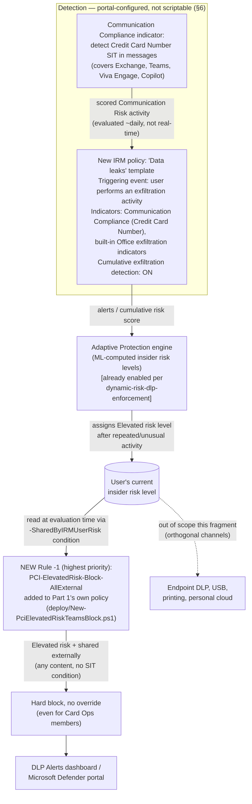

## 1. Problem statement

`scenarios/dlp/pci-teams-exfil-block/reviews.md` (Red Team, finding 1) identified a gap this
repository committed to closing as a follow-up rather than pretending to fix in place: the
Credit Card Number sensitive information type (SIT) matches within a single message's proximity
window. A sender who splits a 16-digit PAN across two or more Teams messages — or spells digits
as words, or inserts separators the pattern doesn't tolerate — defeats every rule in that
scenario's policy, because none of its three rules correlate content across messages or time.
This is an inherent limitation of per-message, pattern-based DLP, not a configuration error.

**This fragment does not claim to solve that problem.** No Microsoft Purview capability
reconstructs split content across separate messages or performs cross-message text correlation —
this build's grounding pass found none, and `AGENTS.md` §4 prohibits inventing one. What this
fragment builds instead is the best-available, honestly-scoped **behavioral compensating
control**: detect the *pattern of repeated, unusual exfiltration-adjacent activity* a sustained
drip-feed evasion attempt produces, and use that detection to automatically cut off the sender's
Teams external-sharing channel entirely — closing the channel for *continued* attempts after the
first qualifying signal, even though it cannot catch the very first split message. The residual
gap for a single, one-time, perfectly-executed split is documented as still open in `README.md`
§11, not closed by this fragment.

## 2. Why this shape (Insider Risk Management + Adaptive Protection, not a DLP-only fix)

`scenarios/dlp/pci-teams-exfil-block/README.md` §11 already named the intended direction: pair
the static PCI Teams policy with `scenarios/insider-risk/departing-employee-data-theft/` or
`scenarios/adaptive-protection/dynamic-risk-dlp-enforcement/` "for cumulative, behavior-based
detection that correlates multiple near-in-time messages from the same sender." Both of those
scenarios are now built (see `PROGRESS.md` DONE). This fragment is the integration point that
was deferred until they existed: a **dedicated** Insider Risk Management (IRM) policy tuned to
the card-data/Teams context, wired through the already-grounded Adaptive Protection
`-SharedByIRMUserRisk` mechanism into a **new rule added to Part 1's own named policy**
(`PCI DSS - Teams Card Data Exfiltration Block`), rather than relying solely on
`dynamic-risk-dlp-enforcement`'s general-purpose Exchange+Teams policy.

## 3. The Teams-coverage constraint (the fact that shapes this whole design)

Grounding this fragment surfaced a specific, material constraint that is not obvious from either
prior scenario's docs and must be stated plainly rather than glossed over:

> **Microsoft Teams DLP policy matches are explicitly *not* a supported workload for the "High
> Severity DLP Alert" indicator that feeds Insider Risk Management.** Microsoft's own reference
> states: *"The following DLP workloads are not currently supported by the High Severity DLP
> Alert indicator... Microsoft Teams: DLP policy matches in Teams chat and channel messages...
> This is by design."* Only Exchange Online, SharePoint Online, and OneDrive for Business DLP
> alerts are evaluated by IRM's DLP-alerts indicator
> [[1]](#references).

This means the naive design — "wire Part 1's `PCI-Audit-Internal-AllUsers` rule as an IRM
triggering event" — **does not work**. It was the first design considered during this build and
was discarded once this constraint was confirmed, rather than shipped as a silent assumption.

The one documented path that *does* extend IRM coverage to Teams messages is the **Communication
Compliance indicators integration**: enabling it creates (or reuses) a Communication Compliance
policy that "detects messages in Microsoft Exchange Online, Microsoft Teams, Microsoft Viva
Engage, and Microsoft 365 Copilot and Microsoft 365 Copilot Chat," optionally configured to
"detect messages matching specific sensitive information types (SITs)" — up to 30 SITs, which can
include the same built-in **Credit Card Number** SIT Part 1 already uses. Matches become scored
"Communication Risk" activity inside IRM once a user is in-scope for a policy
[[2]](#references). This is the mechanism this fragment actually wires — not a Teams DLP-alert
trigger, which the constraint above rules out.

## 4. Architecture

Full rule-by-rule rationale for the new rule is in §6. What stays portal-only vs. what this
fragment's code deploys is in §5.

## 5. What's scriptable vs. portal-only

| Component | Mechanism | Scriptable? |
|---|---|---|
| Communication Compliance indicator: detect Credit Card Number SIT in messages | Purview portal → Insider Risk Management → Settings → Policy indicators → Communication Compliance indicators | No — portal-only; this repo already established (`scenarios/communication-compliance/harassment-and-code-of-conduct/design.md`) that Communication Compliance policy authoring has no supported write cmdlet |
| New IRM policy (triggering event, indicators, cumulative exfiltration detection) | Purview portal → Insider Risk Management → Policies → Create policy | No — portal-only; no Graph/PowerShell write surface for IRM policy authoring was found in this build or in either prior IRM scenario in this library |
| Adding this new feeder policy to Adaptive Protection's scope | Purview portal → Insider Risk Management → Adaptive protection → Insider risk levels | No — portal-only, same constraint `dynamic-risk-dlp-enforcement/design.md` §4 already documented |
| New DLP rule on Part 1's policy, keyed on `-SharedByIRMUserRisk` (Elevated) | `deploy/New-PciElevatedRiskTeamsBlock.ps1` → `New-/Set-DlpComplianceRule` | **Yes** — reuses the GUID/parameter already independently grounded in `scenarios/adaptive-protection/dynamic-risk-dlp-enforcement/deploy/New-AdaptiveProtectionDlpPolicy.ps1`, applied as a new rule on Part 1's specific named policy instead of a separate general-purpose policy |

This split is the same shape `dynamic-risk-dlp-enforcement` already established: the
*detection/risk-level* side of Adaptive Protection has no scriptable surface; only the
*enforcement* side (a DLP rule condition) does. This fragment does not re-derive that finding —
it inherits it and applies it to a new, more narrowly-scoped rule.

## 6. Key decisions

| Decision | Choice | Rationale |
|---|---|---|
| New rule's scope | `TeamsLocation` (inherited from Part 1's policy) + `AccessScope = NotInOrganization`, **no content/SIT condition** | The rule must fire on *any* Teams message an Elevated-risk sender sends externally, not just ones that happen to match Credit Card Number — the entire point is to stop continued drip-feed attempts regardless of whether any individual fragment matches the SIT. Scoped to **external** only (not internal) to stay proportionate: PCI DSS Requirement 4.2 is about data *leaving* the organization, and blocking an Elevated-risk employee's *internal* Teams messages (e.g., to their own manager) is a materially more disruptive action this fragment does not attempt to justify. |
| Priority | **0** (highest, ahead of Part 1's existing Rules 0/1/2, which shift to 1/2/3) | An Elevated-risk sender must not receive the Card Ops override path (Part 1 Rule 0) even if they are a Card Ops group member — a flagged risk level is itself a reason to withhold the self-service override, not merely to fall back to the content-based rules. |
| No override (`NotifyAllowOverride` omitted) | Deliberate | Mirrors `dynamic-risk-dlp-enforcement`'s own Elevated-block rule (§6 there): a user already flagged Elevated cannot self-override a block, by Microsoft's own documented Quick Setup reference behavior for this condition. |
| Priority renumbering technique | Script explicitly re-prioritizes all three existing rules (3←2, 2←1, 1←0, applied highest-number-first) before creating the new rule at 0, rather than relying on `New-DlpComplianceRule -Priority 0` to auto-shift them | Microsoft's `New-DlpComplianceRule`/`Set-DlpComplianceRule` reference documents the `-Priority` parameter's type and default but does not document whether inserting a colliding priority value auto-shifts other rules in the same policy. Rather than assume undocumented behavior, this script performs the reordering explicitly and deterministically — see `deploy/New-PciElevatedRiskTeamsBlock.ps1` `.NOTES`. |
| Feeder IRM policy | A **new, dedicated** policy (not reusing `departing-employee-data-theft`) | `departing-employee-data-theft` only scores *departing* users (triggering event: resignation/termination date). The PCI Teams card-data audience (Card Operations, Finance, support staff handling payment conversations) is not primarily a departing-employee population — a dedicated **Data leaks**-template policy, scoped to the same user population as Part 1's DLP policy, is the correct template per Microsoft's own template-selection guidance [[3]](#references). Both policies can coexist in Adaptive Protection's scope simultaneously — insider risk levels are tenant-wide and computed from every in-scope feeder policy (`dynamic-risk-dlp-enforcement/README.md` §11, already-documented constraint this fragment inherits, not re-derives). |
| Triggering event for the new IRM policy | **User performs an exfiltration activity** (built-in Office exfiltration indicators), not a DLP-alert trigger | The DLP-alert trigger only supports Exchange/SharePoint/OneDrive workloads (§3) — using it would silently exclude the one workload (Teams) this fragment exists to cover. The exfiltration-activity trigger has no such workload restriction. |
| Communication Compliance SIT indicator | Enabled, scoped to **Credit Card Number** only | Reuses Part 1's own SIT choice — already reviewed and confirmed Luhn-checksum-validated and Microsoft-maintained (`pci-teams-exfil-block/reviews.md`, Product Owner lens) — rather than introducing a second, unreviewed detection mechanism. |
| Cumulative exfiltration detection | Enabled (default for the Data leaks template) | This is the specific, ML-based feature Microsoft documents as designed for exactly this evasion shape: *"departing users slowly exfiltrate data across a range of days, or... users repeatedly share data across multiple channels more than usual"* [[4]](#references) — the closest documented analogue to a drip-fed, split-message exfiltration pattern that exists in the product today. |

## 6a. Template choice: "Data leaks", not "Data leaks by priority users"

Microsoft also publishes a **Data leaks by priority users** template, which scopes scoring to a
defined priority-user group and could plausibly fit a "Card Operations / Finance" population.
This fragment uses the plain **Data leaks** template instead, scoped by ordinary user/group
selection to the same population Part 1's DLP policy already targets, for two reasons: (1) the
priority-users variant is designed around a materially different use case — users an org
identifies as inherently higher-risk *before* any activity (e.g., recent performance issues,
access to critical IP) — not simply "the group this control's content-based rule already
applies to," and conflating the two would misrepresent Card Ops/Finance staff as a priori
higher-risk when the actual risk driver is the *activity*, not the *role*; (2) reusing the
group-based scoping this library's IRM/Adaptive Protection scenarios already establish
(`departing-employee-data-theft`, `dynamic-risk-dlp-enforcement`) keeps the pattern consistent
across the library rather than introducing a third scoping mechanism for one fragment.

## 6b. VERIFY: no single Microsoft-published example validates this exact composition

Every individual piece of this design — the Communication Compliance SIT indicator, the Data
leaks template's exfiltration-activity trigger, Cumulative exfiltration detection, and the
`-SharedByIRMUserRisk` DLP condition — is independently grounded against its own Microsoft Learn
reference (§8/README.md §12). **No single Microsoft document demonstrates this specific
end-to-end combination** (Communication Compliance Teams-coverage indicator feeding a Data-leaks
policy's cumulative exfiltration scoring, in turn driving an Adaptive Protection DLP rule scoped
to one specific named PCI policy) as one worked scenario. This is a deliberate, documented
composition of individually-confirmed building blocks, not a fabricated one — but it has not been
run end-to-end against a live tenant during this build. Flagged as an explicit `VERIFY` in
`README.md` §7 (pilot-tenant functional test) rather than asserted as Microsoft-validated.

## 7. Non-goals

- **Does not reconstruct or correlate literal message content across messages.** No Microsoft
  capability does this; this fragment closes the channel *after* a behavioral signal, not by
  detecting the split content itself. Documented as an explicit residual risk in `README.md` §11,
  not fixed.
- **Does not modify or duplicate `scenarios/adaptive-protection/dynamic-risk-dlp-enforcement/`'s
  own DLP policy.** That policy's Exchange+Teams, external-share-only rules keep operating
  independently and unchanged; this fragment adds a *separate* rule to Part 1's *own* named
  policy so the PCI-specific control's behavior (rule names, alert routing, Card Ops interaction)
  stays self-contained and auditable as one control for a QSA, rather than splitting PCI evidence
  across two differently-owned policies.
- **Does not create or modify the Communication Compliance policy beyond enabling the SIT
  indicator with Credit Card Number selected.** Broader Communication Compliance coverage
  (harassment, code-of-conduct language, etc.) is `scenarios/communication-compliance/
  harassment-and-code-of-conduct/`'s scope, not this fragment's.
- **Does not configure Endpoint DLP, USB/print restrictions, or personal-cloud-upload
  controls.** An Elevated-risk user blocked from external Teams/Exchange sharing by this
  fragment can still exfiltrate via other channels Adaptive Protection's Devices policy would
  cover — same already-documented gap `dynamic-risk-dlp-enforcement/README.md` §11 names, not
  re-litigated here.
- **Does not attempt to lower the up-to-36-hour Adaptive Protection propagation delay, or the
  IRM cumulative-exfiltration-detection daily evaluation cadence** (§8, `README.md`) — both are
  backend processing characteristics of the Purview service, not properties this fragment's code
  can script around.

## 8. References

Full citation list with URLs is in `README.md` §12. Numbered references above:
[1] Configure policy indicators in Insider Risk Management — supported DLP workloads.
[2] Configure policy indicators in Insider Risk Management — Communication Compliance
    indicators.
[3] Learn about Insider Risk Management policy templates — triggering events and prerequisites.
[4] Create and manage Insider Risk Management policies — Cumulative exfiltration detection.
