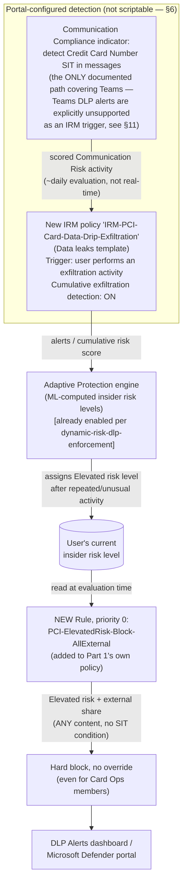

## 1. Scenario summary

Extends `scenarios/dlp/pci-teams-exfil-block/` with a behavioral compensating control for the
one gap that scenario's own Red Team review flagged and deliberately left open: a sender who
splits a credit-card number (PAN) across multiple Teams messages, or otherwise obfuscates it so
no single message matches the Credit Card Number sensitive information type (SIT), defeats
per-message DLP pattern matching entirely. This fragment wires a dedicated Insider Risk
Management (IRM) policy and Adaptive Protection to detect the *pattern* of repeated,
exfiltration-adjacent activity such an attempt produces, and automatically blocks that sender
from any further external Teams sharing once their insider risk level reaches **Elevated** —
closing the channel for continued attempts, not the first one.

**Who it's for:** a buyer who has already deployed `scenarios/dlp/pci-teams-exfil-block/` and
wants the documented residual risk in its `reviews.md` addressed with a real, working control
rather than left as a permanent gap — while understanding plainly what this control can and
cannot do (§11).

## 2. Business/regulatory driver

Same PCI DSS v4.0.1 Requirement 4.2 driver as Part 1 — this fragment doesn't add a new compliance
citation, it strengthens the existing control's defensibility. A QSA (Qualified Security Assessor)
or auditor who asks "what stops someone from just splitting the number across two messages?" is
asking the single most common DLP bypass question; Part 1 alone answers "nothing, and we document
that." This fragment changes the answer to "a behavioral control that shuts off the channel once
the pattern is detected — not the first message, but every one after it," which is a materially
stronger, still-honest position for a board-level or audit narrative (see `reviews.md`, CISO
lens).

## 3. Prerequisites

Full licensing detail and citations: `docs/licensing-matrix.md`. This fragment adds no new
licensing requirement beyond what Part 1 and `scenarios/adaptive-protection/
dynamic-risk-dlp-enforcement/` already require — Adaptive Protection, DLP for Teams, and Insider
Risk Management are all built on the same Microsoft 365 E5 / Purview Suite entitlement tier.

| Requirement | Minimum | Notes |
|---|---|---|
| `scenarios/dlp/pci-teams-exfil-block/` already deployed | The named policy `PCI DSS - Teams Card Data Exfiltration Block` with its original three rules | This fragment's deploy script errors out if the parent policy or its rules aren't found — see `design.md` §5 |
| Insider Risk Management + Adaptive Protection | **Microsoft 365 E5**, **Purview Suite**, or the underlying add-ons | Same entitlement `dynamic-risk-dlp-enforcement/README.md` §3 already documents in full |
| Communication Compliance (for the SIT-in-Teams-messages indicator) | Included in the same E5/Purview Suite entitlement | This fragment enables one specific Communication Compliance indicator, not a standalone Communication Compliance deployment — see `scenarios/communication-compliance/harassment-and-code-of-conduct/` for that module's own scenario |
| Adaptive Protection already enabled, with Elevated/Moderate/Minor risk levels defined | Portal-only prerequisite | Assumed already complete if `dynamic-risk-dlp-enforcement` is deployed; if not, complete its README.md §5 Steps 1–3, 5 first |
| Role to configure IRM policies and Communication Compliance indicators | **Insider Risk Management** or **Insider Risk Management Admins** role group | Same role used in `dynamic-risk-dlp-enforcement/README.md` §3 |
| Role to extend the DLP policy | **Compliance Administrator**, **Compliance Data Administrator**, or **DLP Compliance Management** | Same DLP-authoring roles used throughout this library |
| Automation identity for the deploy script | App-only certificate authentication to Security & Compliance PowerShell | `docs/automation-surface.md` §3 |

> Verify current entitlement names against `docs/licensing-matrix.md` and the Product Terms
> before a sales commitment — SKU names change.

## 4. Architecture



Full rule-by-rule rationale and the Teams-coverage constraint that shapes this design are in
`design.md` §3–6.

## 5. Step-by-step implementation

### Step 1 — Confirm Part 1 and Adaptive Protection are already deployed

This fragment extends, rather than replaces, `scenarios/dlp/pci-teams-exfil-block/`'s policy.
Confirm it exists and Adaptive Protection is already enabled (per `dynamic-risk-dlp-enforcement/
README.md` §5 Steps 1–3, 5) before continuing.

### Step 2 — Enable the Communication Compliance SIT indicator (portal, not scriptable)

Purview portal → **Insider Risk Management** → **Settings** → **Policy indicators** →
**Communication Compliance indicators (preview)** → under **Detect messages matching specific
trainable classifiers (preview)**, select **Create policy**. Then, in the **Policy indicators**
setting, select the sensitive-information-type detection option and choose **Credit Card
Number** [[1]](#references). This is the one documented mechanism that extends IRM coverage to
Microsoft Teams messages — see §11 for why the more obvious "wire the Teams DLP policy directly"
approach does not work.

### Step 3 — Create the feeder Insider Risk Management policy (portal, not scriptable)

Purview portal → **Insider Risk Management** → **Policies** → **Create policy** → template
**Data leaks**. Use `deploy/policy/irm-drip-exfiltration-config-manifest.json` as the
checklist/reference while doing this:
- **Users/groups:** same population as Part 1's DLP policy scope.
- **Triggering event:** **User performs an exfiltration activity** (built-in Office exfiltration
  indicators) — not the DLP-policy-match trigger, which excludes Teams (§11).
- **Indicators:** the Communication Compliance indicator from Step 2 (Credit Card Number), plus
  the default built-in Office exfiltration indicators.
- **Cumulative exfiltration detection:** leave **ON** (default for this template)
  [[2]](#references).
- **Prioritize content:** sensitive information types → Credit Card Number.

### Step 4 — Add the feeder policy to Adaptive Protection's scope (portal, not scriptable)

Purview portal → **Insider Risk Management** → **Adaptive protection** → **Insider risk levels**
→ confirm the new policy from Step 3 is included, alongside any existing feeder policy (e.g.
`scenarios/insider-risk/departing-employee-data-theft/`). Insider risk levels are tenant-wide and
computed from every in-scope feeder policy — see `dynamic-risk-dlp-enforcement/README.md` §11.

### Step 5 — Deploy the new DLP rule (scripted, dry-run capable)

```powershell
Connect-IPPSSession -AppId $AppId -Certificate $Cert -Organization $TenantDomain

# Dry run - shows exactly what would change, makes no changes
./deploy/New-PciElevatedRiskTeamsBlock.ps1 -AdminNotificationEmail 'soc@contoso.com' -WhatIf

# Deploy: re-prioritizes Part 1's three rules to 1/2/3, adds the new rule at priority 0
./deploy/New-PciElevatedRiskTeamsBlock.ps1 -AdminNotificationEmail 'soc@contoso.com'

# Validate
./validate/Test-PciElevatedRiskTeamsBlock.ps1
```

The new rule's block action takes effect as soon as the parent policy is in `Enable` mode (Part
1's own deploy/rollout cadence governs that, unchanged by this fragment) — there is no separate
simulation toggle for one rule within an already-live policy. If Part 1's policy is still in
`TestWithNotifications`, this rule will also only simulate.

## 6. Configuration reference

| Setting | `PCI-ElevatedRisk-Block-AllExternal` (this fragment) |
|---|---|
| Priority | **0** (Part 1's `PCI-CardOps-Override-External`, `PCI-Block-External-AllUsers`, `PCI-Audit-Internal-AllUsers` shift to 1/2/3) |
| Condition | `SharedByIRMUserRisk = FCB9FA93-6269-4ACF-A756-832E79B36A2A` (Elevated) AND `AccessScope = NotInOrganization` |
| Content/SIT condition | **None** — fires on any Teams message content, matching or not matching Credit Card Number |
| `BlockAccess` | `$true` |
| Override allowed | **No** — even for Card Operations group members (see `design.md` §6) |
| `StopPolicyProcessing` | `$true` |
| `ReportSeverityLevel` | High |

Full cmdlet parameter grounding: `deploy/New-PciElevatedRiskTeamsBlock.ps1` inline comments and
its `.NOTES` block. Portal-only prerequisite configuration (IRM policy, Communication Compliance
indicator, Adaptive Protection scope): `deploy/policy/irm-drip-exfiltration-config-manifest.json`.

## 7. Validation / how to prove it works

1. **Automated config check** — `./validate/Test-PciElevatedRiskTeamsBlock.ps1` confirms the new
   rule exists at priority 0 with the correct condition/action, and that Part 1's three original
   rules were re-prioritized without their own conditions being altered. Exits non-zero on a hard
   failure.
2. **Manual checklist** — the same script prints a checklist for everything it has no API to
   query (Communication Compliance indicator enabled, feeder IRM policy configuration, Adaptive
   Protection scope) — see its output.
3. **End-to-end functional test (non-production accounts only, pilot tenant):**
   a. Confirm a test account's insider risk level is currently **not** Elevated
      (Purview portal → Insider Risk Management → Users).
   b. Drive that account's insider risk level to Elevated — either by waiting for a real
      detection from the feeder policy's indicators, or via **Start scoring activity for users**
      (Purview portal → Insider Risk Management → Policies) to manually add the test account to
      the feeder policy for a defined window, then generating qualifying activity
      [[3]](#references).
   c. From that account, attempt to send a Teams message (any content) to an external guest.
      Expect: **blocked**, no override offered, even if the account is a Card Operations group
      member.
   d. From the same account, attempt an internal Teams message. Expect: **not** blocked by this
      rule (external-only scope) — Part 1's own Rule 2 (audit-internal) still applies if the
      content matches Credit Card Number.
4. **Evidence for review** — confirm the blocked event appears in the DLP Alerts dashboard /
   Microsoft Defender portal under rule name `PCI-ElevatedRisk-Block-AllExternal`, and
   cross-reference the triggering IRM alert by user and timestamp (§8 — no shared correlation ID
   exists, same manual-correlation caveat `dynamic-risk-dlp-enforcement/README.md` §8 already
   documents).

## 8. Operations & tuning

**KPIs to watch (first 90 days), in addition to Part 1's own and `dynamic-risk-dlp-enforcement`'s
own KPI sets:**
- **Time from a user's first card-data-adjacent Teams activity to Elevated-risk assignment** —
  measures how long the exposure window actually is for this control, given the ~daily
  cumulative-exfiltration-detection cadence and up-to-36-hour Adaptive Protection propagation
  (§11). If this is consistently multiple days, the compensating control is closing the channel
  too late to matter for a fast, deliberate exfiltration attempt — a finding to escalate to CISO
  review, not something to silently tune around.
- **`PCI-ElevatedRisk-Block-AllExternal` match volume vs. Part 1's Rule 1/Rule 2 volume** — a
  rule 0 match with no preceding Rule 2 (internal audit) match for the same user in recent
  history suggests the Elevated-risk assignment came from a *different* IRM indicator entirely
  (e.g., SharePoint/OneDrive exfiltration, not Teams card-data activity at all) — investigate via
  the feeder policy's own alert before assuming a Teams-specific pattern.

**Coordinate with HR/Legal before broad enforcement rollout**, same as
`dynamic-risk-dlp-enforcement/README.md` §8 already requires for its own Elevated-block rule —
this fragment's rule is an *additional*, PCI-specific enforcement point driven by the same
ML-computed, opaque risk score, and removes even the Card Ops override path Part 1 otherwise
guarantees. Treat it as the same class of HR/Legal-notified change, not a purely technical
deployment step.

**Incident-response runbook (this rule's block event):**
1. **Triage** — same first step as `dynamic-risk-dlp-enforcement/README.md` §8: open the DLP
   Alerts dashboard/Defender incident, confirm the rule name and sender.
2. **Cross-reference the feeder IRM policy's alert** by user and timestamp (manual — no shared
   correlation ID, §7) **and confirm which indicator actually drove the Elevated assignment** —
   the Credit Card Number Communication Compliance indicator, or an unrelated exfiltration
   indicator (§11). Don't assume a card-data link without checking.
3. **Classify** — is the Elevated risk level a true or false positive? Same guidance as
   `dynamic-risk-dlp-enforcement/README.md` §8 — fix the *feeder policy's* tuning if it's a false
   positive, not this rule.
4. **If true positive:** treat as a live PCI-scoped incident — this user has already been blocked
   from further external Teams sharing; escalate per the org's incident-response process and
   consider a full account review, not just DLP-alert closure, given the drip-feed evasion
   pattern this control exists to catch.

**Review cadence:** quarterly, aligned with Part 1's own review cadence and
`dynamic-risk-dlp-enforcement`'s.

## 9. Rollback / decommission

See `rollback.md`. Quick reference: `./deploy/Remove-PciElevatedRiskTeamsBlock.ps1` switches the
rule to audit-only (reversible); `-Purge` permanently removes it and restores Part 1's original
0/1/2 rule priorities. Neither action touches Part 1's own three rules' content or
`dynamic-risk-dlp-enforcement`'s separate policy.

## 10. Cost & licensing notes

No incremental license cost beyond what Part 1 and `dynamic-risk-dlp-enforcement` already
require — this fragment reuses the same E5/Purview Suite entitlement for IRM, Adaptive
Protection, DLP, and the one Communication Compliance indicator it enables. No PAYG component.

## 11. Known limitations & gotchas

- **This control does NOT detect or block a single, perfectly-executed split-PAN message.** No
  Microsoft Purview capability performs cross-message content reconstruction or correlation as of
  this writing (grounded during this build — see `design.md` §1). This fragment is a behavioral
  compensating control that shortens the *exposure window after* a qualifying signal, not a fix
  for the underlying per-message pattern-matching limitation. State this plainly to a buyer —
  overclaiming here is the single easiest way to lose credibility with a technical reviewer.
- **Microsoft Teams DLP alerts are explicitly not a supported Insider Risk Management trigger
  workload.** Microsoft's own documentation states this "is by design" — only Exchange Online,
  SharePoint Online, and OneDrive for Business DLP alerts feed the "High Severity DLP Alert"
  indicator [[4]](#references). This is why this fragment routes through the Communication
  Compliance SIT indicator instead of wiring Part 1's own DLP policy directly — see `design.md`
  §3 for the full reasoning.
- **The Communication Compliance SIT indicator shares the same per-message blind spot.** It is
  still Credit Card Number pattern matching under the hood — a perfectly split PAN evades it the
  same way it evades Part 1's DLP rule. Its value here is as one more contributing signal to
  Cumulative Exfiltration Detection's volume/pattern analysis, not as an independent content-fix.
- **Zero detectable signal against a maximally disciplined attacker.** If a sender splits a PAN
  finely enough that *no single message* ever contains a recognizable card-shaped fragment (e.g.,
  one digit per message) and generates no other exfiltration-type activity (no external file
  shares, no SharePoint/OneDrive downloads) during the attempt, then **neither** the Communication
  Compliance SIT indicator **nor** any other Cumulative Exfiltration Detection indicator this
  fragment enables produces any scored signal for that user at all — Adaptive Protection has
  nothing to elevate. This control's real-world value is bounded to senders whose evasion attempt
  is imperfect (some fragment still trips a SIT, or the attempt is paired with other
  exfiltration-type behavior Cumulative Exfiltration Detection already tracks), not to a
  theoretically perfect one. Communicate this bound plainly — it is the honest limit of what any
  currently-documented Purview capability can do here, not a gap specific to this fragment's
  design.
- **A user can reach Elevated risk — and be fully blocked from external Teams sharing by this
  rule — from activity that has nothing to do with card data.** The triggering event ("user
  performs an exfiltration activity") and Cumulative Exfiltration Detection both score *all*
  enabled indicators for an in-scope user, not just the Credit Card Number one this fragment
  cares about. A legitimate bulk SharePoint migration or an unusually large but authorized
  external file share could independently drive a user to Elevated and trigger this rule with no
  card-data involvement at all. The incident-response runbook (§8, step 2) exists specifically to
  catch this — always confirm the underlying IRM alert's actual indicator before assuming a
  card-data drip-feed pattern.
- **Cumulative exfiltration detection is evaluated ~daily, not in real time** — Microsoft
  describes it as identifying "unusual levels of risk activities when evaluated daily"
  [[2]](#references). Combined with Adaptive Protection's own up-to-36-hour propagation delay
  after first enabling (already documented in `dynamic-risk-dlp-enforcement/README.md` §11), the
  realistic end-to-end exposure window between a user's first qualifying activity and this rule
  actually blocking them can be **on the order of one to two days**, not minutes. Track this via
  the KPI in §8 rather than assuming near-real-time response.
- **No shared correlation ID between a DLP incident report and the IRM alert that produced the
  triggering risk level.** Same manual-correlation-by-user-and-timestamp caveat
  `dynamic-risk-dlp-enforcement/README.md` §8 already documents — not resolved by this fragment.
- **This rule does not block internal Teams messages.** Deliberately scoped to external share
  only (§6) — an Elevated-risk user can still message colleagues internally. See `design.md` §6
  for why this is the proportionate choice, not an oversight.
- **VERIFY (pilot tenant): rule priority reordering behavior.** This fragment's deploy script
  explicitly re-prioritizes Part 1's three rules rather than relying on `New-DlpComplianceRule
  -Priority 0` to auto-shift existing rules, because Microsoft's cmdlet reference does not
  document whether that auto-shift happens — see `deploy/New-PciElevatedRiskTeamsBlock.ps1`
  `.NOTES`. Confirm the resulting priority order with `validate/
  Test-PciElevatedRiskTeamsBlock.ps1` after deployment.
- **Inherits every "VERIFY before go-live" item already flagged in Part 1's and
  `dynamic-risk-dlp-enforcement`'s own Known Limitations sections** — this fragment does not
  re-verify `BlockAccess` behavior for `TeamsLocation` rules or the `AccessScope`-only condition
  form; both are still open VERIFY items in those scenarios' own docs.

## 12. References

1. Configure policy indicators in Insider Risk Management — Communication Compliance indicators
   (Teams/Exchange/Viva Engage/Copilot coverage, SIT detection) — <https://learn.microsoft.com/purview/insider-risk-management-settings-policy-indicators#built-in-indicators-vs-custom-indicators>
2. Create and manage Insider Risk Management policies — Cumulative exfiltration detection (daily
   evaluation, 30-day comparison window, enabled-by-default templates) — <https://learn.microsoft.com/purview/insider-risk-management-policies#cumulative-exfiltration-detection>
3. Create and manage Insider Risk Management policies — Immediately start scoring user activity
   ("Start scoring activity for users") — <https://learn.microsoft.com/purview/insider-risk-management-policies#immediately-start-scoring-user-activity>
4. Configure policy indicators in Insider Risk Management — Data loss prevention alerts
   indicators, supported DLP workloads (Teams explicitly excluded, "by design") — <https://learn.microsoft.com/purview/insider-risk-management-settings-policy-indicators#built-in-indicators-vs-custom-indicators>
5. Learn about Insider Risk Management policy templates — policy template prerequisites and
   triggering events — <https://learn.microsoft.com/purview/insider-risk-management-policy-templates#policy-template-prerequisites-and-triggering-events>
6. Help dynamically mitigate risks with Adaptive Protection — 36-hour propagation delay — <https://learn.microsoft.com/purview/insider-risk-management-adaptive-protection>
7. New-DlpComplianceRule / Set-DlpComplianceRule reference (`SharedByIRMUserRisk`, `Priority`) — <https://learn.microsoft.com/powershell/module/exchangepowershell/new-dlpcompliancerule>, <https://learn.microsoft.com/powershell/module/exchangepowershell/set-dlpcompliancerule>
8. Remove-DlpComplianceRule reference — <https://learn.microsoft.com/powershell/module/exchangepowershell/remove-dlpcompliancerule>
9. `scenarios/dlp/pci-teams-exfil-block/README.md` §11–12 — the original Red Team finding and
   Part 1's own citation list (Credit Card Number SIT, DLP-for-Teams licensing/scoping).
10. `scenarios/adaptive-protection/dynamic-risk-dlp-enforcement/README.md` §3–6, §11–12 — the
    `SharedByIRMUserRisk` grounding and Adaptive Protection prerequisites this fragment reuses
    without re-deriving.

> Re-verify all links and product behavior against current Microsoft Learn before a
> customer-facing assessment or sale — Insider Risk Management and Adaptive Protection are
> comparatively new capabilities that change faster than most in the Purview portfolio.
