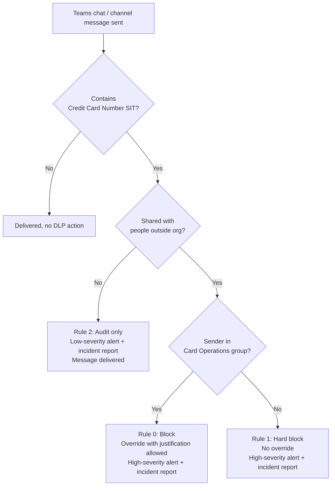

## 1. Problem statement

A PCI-DSS-scoped tenant (retailer, payment facilitator, or any merchant that stores/processes
cardholder data and has Teams as its primary collaboration tool) needs to stop employees from
pasting full Primary Account Numbers (PANs) into Teams chats and channel messages, both to
external guests (a clear exfiltration path) and internally (a PCI-DSS hygiene violation even
when the recipient is a coworker, because it puts unencrypted PAN into chat history, search
indexes, and export/eDiscovery scope). One legitimate business function, the Card Operations /
Finance team, which routinely confirms transaction details with the acquiring bank's support
desk over a guest-enabled Teams channel, needs a narrower, justified-override path rather than
a hard block, or the control will get disabled within a month of go-live.

## 2. Design goals

1. Block, don't just audit, credit-card numbers leaving the tenant via Teams to external
   participants, this is the PCI-DSS 4.0 Requirement 4 / Requirement 3 exposure this control
   exists to close (cardholder data must not traverse open, unmonitored channels; DLP for Teams
   is Microsoft's control point for that channel, see `README.md` §2 for the exact requirement
   mapping).
2. Give a single named security group (Card Operations) a narrower path: still blocked by
   default, but able to override with a logged business justification, instead of being locked
   out of a legitimate, already-approved workflow.
3. Don't silently allow internal PAN sharing, audit it (alert + incident report) so the security
   team has visibility to tighten the policy later, without breaking internal support workflows
   on day one.
4. Everything is idempotent and re-runnable: running `New-PciTeamsDlpPolicy.ps1` twice must not
   create duplicate policies/rules or error out.
5. Ship "off" by default. The deploy script's default `-Mode` is `TestWithNotifications`
   (simulation, no blocking, but policy tips/notifications fire) so a buyer can observe real
   traffic against the policy before committing to `Enable`. This mirrors Microsoft's own
   documented rollout sequence (see `README.md` §5, "Policy deployment steps").

## 3. Why Teams DLP (not IRM, not Communication Compliance) for this control

- **Insider Risk Management** detects and scores risky behavior after the fact (exfiltration
  indicators, cumulative risk), it does not block the message in real time. Good complementary
  signal (see `scenarios/insider-risk/departing-employee-data-theft/`, not yet built), wrong tool
  for a hard, deterministic block on a specific regulated data type.
- **Communication Compliance** reviews messages for policy violations (harassment, regulatory
  language) after they're sent, for human reviewers, again, not a real-time block.
- **DLP for Teams** is the only Purview control that inspects a chat/channel message before
  delivery and can block it outright. It's also the mechanism Microsoft's own PCI-DSS Compliance
  Manager premium assessment template expects to see evidenced for the cardholder-data-in-chat
  control area.

## 3a. Why a new policy, not tuning the tenant's default Teams DLP policy

Every tenant already has a **default DLP policy for Teams** that tracks Credit Card Number
mentions tenant-wide. It is intentionally weak by design: it never blocks, never shows a policy
tip, and only sends a low-severity alert email to the admin, Microsoft ships it as a starting
point, not an enforcement control. It also has no group-based override path and no distinction
between internal and external sharing. Editing it in place (rather than building a dedicated
policy) would conflate this control's PCI-specific block/override/audit logic with whatever else
the tenant later layers onto "the default policy," and would be lost if an admin ever resets it.
This scenario deploys a separate, named policy for that reason (see `README.md` §5 for the exact
naming and `reviews.md`, Microsoft Product Owner lens, for why this doesn't count as
reinventing a native capability).

## 4. Policy architecture

One DLP policy, three rules, evaluated in priority order (0 = evaluated first). Rules 0 and 1 set
`StopPolicyProcessing = $true` so a message that matches either one is not also re-evaluated by
rule 2, this avoids duplicate alerts for the same message and keeps rule 2 scoped to exactly
the traffic the other two didn't already handle (internal-only sharing).

| Priority | Rule | Scope | Condition | Action |
|---|---|---|---|---|
| 0 | `PCI-CardOps-Override-External` | Sender is a member of the Card Operations security group | Content contains **Credit Card Number** AND is shared with people **outside** the organization | Block, but allow override **with business justification** (`NotifyAllowOverride = WithJustification`); alert (High); incident report to admins |
| 1 | `PCI-Block-External-AllUsers` | Everyone **except** Card Operations (`ExceptIfFromMemberOf`) | Content contains **Credit Card Number** AND is shared with people **outside** the organization | Hard block, **no** override; alert (High); incident report to admins; sender notified via policy tip |
| 2 | `PCI-Audit-Internal-AllUsers` | Everyone (rule only reached for traffic rules 0/1 didn't stop-process, i.e. not shared externally) | Content contains **Credit Card Number** | Audit only, no block; alert (Low); incident report to admins |

## 5. Data flow / where enforcement happens

Teams DLP evaluation runs server-side in the Teams service, driven by the policy synced from
Security & Compliance PowerShell / the Purview portal (~1 hour propagation after a policy
change, see `README.md` §5). The control point is per-message, before the message is durably
delivered to other participants; a match against a blocking rule replaces the message content
with a "message blocked" notice for recipients and shows the sender a policy tip.

**Important scoping constraint carried into `README.md` §11 (Known limitations):** DLP protection
for standard/private/shared **channel** messages requires the policy location to include a
**security group, distribution group, or Microsoft 365 group**, a policy scoped only to
individual user accounts does **not** cover channel messages (it only covers that user's 1:1/n
chats). This scenario's policy uses `TeamsLocation = "All"`, which covers both, but a buyer who
narrows the location scope to specific groups must include the groups that own the channels they
care about, not just the individual users.

## 6. Key decisions

| Decision | Choice | Rationale |
|---|---|---|
| Deploy surface | Security & Compliance PowerShell (`Connect-IPPSSession`), per `docs/automation-surface.md` surface 2 | DLP policy/rule objects are S&C PowerShell objects, no Graph equivalent for policy authoring exists today. |
| Sensitive info type | Built-in **Credit Card Number** SIT | Purpose-built, Luhn-checksum-validated, maintained by Microsoft; matches the SIT used in Microsoft's own default Teams DLP policy and every regional "Financial Data" DLP template. Building a custom regex SIT would be reinventing a well-tested control, flagged explicitly in the Microsoft Product Owner review (`reviews.md`). |
| External-sharing condition | `AccessScope = NotInOrganization` (rule-level) | Documented S&C PowerShell condition equivalent to the portal's "Content is shared from Microsoft 365 > with people outside my organization." |
| Card Ops exception mechanism | `FromMemberOf` / `ExceptIfFromMemberOf` on a mail-enabled security group, not a named-user list | Security-group membership is auditable, survives staff turnover without script edits, and is the same primitive `rbac-model.md` recommends for scoping Purview controls generally. |
| Override type for Card Ops | `WithJustification` (not `WithoutJustification`) | PCI-DSS auditors expect a documented reason per override; `WithJustification` writes the reason to the audit log `ExceptionInfo`/X-header (see `README.md` §7, Validation). |
| Internal sharing | Audit only, not blocked, at initial rollout | Blocking 100% of internal PAN mentions on day one is the single most common cause of a DLP rollout getting killed by business pushback; audit-first is Microsoft's own documented deployment sequence (simulation → notify → enforce). A buyer with a mature program can tighten rule 2 to `BlockAccess $true` later, see `README.md` §8. |
| Default policy mode | `TestWithNotifications` | Matches the code standard in `AGENTS.md` §4 (dry-run path) and `automation-surface.md` §6: nothing in this repo enforces by default against a live tenant without an explicit, deliberate flag. |

## 7. Non-goals

- This scenario does not deploy the DLP-for-**documents** control (a card-number spreadsheet
  shared via a Teams file tab is a SharePoint/OneDrive DLP concern, see the `information-protection`
  and future `dlp` file-sharing scenarios). It is scoped to **message text**, matching the
  `TeamsLocation` DLP surface only.
- This scenario does not configure Adaptive Protection risk-based enforcement
  (`scenarios/adaptive-protection/dynamic-risk-dlp-enforcement/`, planned), the block/audit
  split here is static (group membership + share target), not risk-score-driven.
