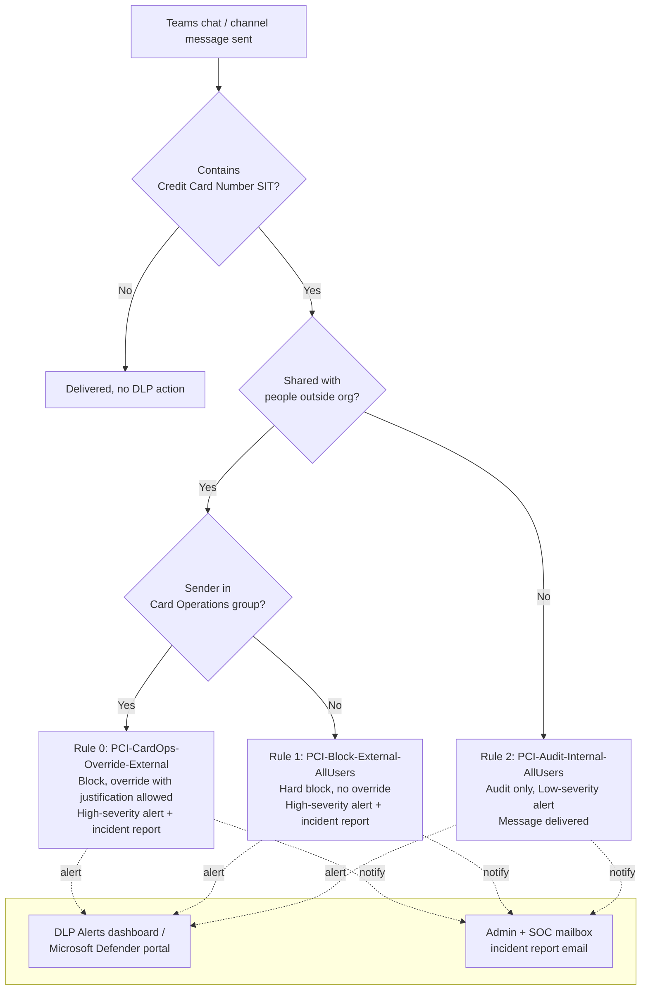

## 1. Scenario summary

Blocks full credit-card numbers (PANs) from leaving the tenant through Microsoft Teams chat and
channel messages, using Microsoft Purview Data Loss Prevention (DLP) for Teams. A named
exception path (block-with-logged-justification) is carved out for the Card Operations /
Finance team, who have a legitimate, already-approved workflow that occasionally requires
confirming card details with the acquiring bank over a guest-enabled Teams channel. Internal
(non-external) card-number sharing is audited, not blocked, on initial rollout.

**Who it's for:** a PCI-DSS-scoped merchant, payment facilitator, or retailer that uses Microsoft
Teams as its primary collaboration platform and needs an evidenced, real-time control against
cardholder data traveling through chat, for a PCI assessment, a QSA (Qualified Security
Assessor) walkthrough, or a customer/partner security questionnaire.

## 2. Business/regulatory driver

**PCI DSS v4.0.1, Requirement 4.2**, "Never send unprotected PANs by end-user messaging
technologies (for example, e-mail, instant messaging, SMS, chat, etc.)." Assessors test this by
sampling outbound transmissions and confirming PAN is rendered unreadable or blocked. Microsoft
Teams chat and channel messages are exactly the "chat" end-user messaging technology this
requirement names [[6]](#references). This scenario is the technical control an assessor expects
to see evidenced for that requirement in a tenant where Teams is in scope for the cardholder data
environment (CDE) or connects to systems that are.

Two secondary drivers this control also supports:
- **PCI DSS Requirement 10** (logging and monitoring), every block and every override is logged
  (alert, incident report, and, for overrides, a business-justification record in the audit
  log), giving the evidence trail a QSA will ask for.
- **General data-minimization hygiene**, even *internal* PAN sharing over chat puts unencrypted
  cardholder data into Teams message history, search indexes, and (if litigation or a subject
  access request arises) eDiscovery scope. The internal-audit rule (§4 of `design.md`) exists to
  surface that exposure, not to eliminate it on day one.

Microsoft Purview Compliance Manager ships a **premium PCI DSS v4.0 assessment template**
(`assessment templates` page in Compliance Manager) that can track this control as an improvement
action alongside the technical implementation, see `scenarios/compliance-manager/
pci-dss-assessment/` for the assessment-side companion scenario, which also cross-references this
control in its own control crosswalk [[7]](#references).

## 3. Prerequisites

Full licensing detail and citations: `docs/licensing-matrix.md`. Summary for this scenario:

| Requirement | Minimum | Notes |
|---|---|---|
| Purview DLP for Teams (chat + channel, including private channels) | **Microsoft 365 E5 / A5 / G5**, **Office 365 E5 / A5 / G5**, **Microsoft Purview Suite** (or the **E5 Information Protection & Governance** add-on), or **Microsoft 365/F5 Compliance / F5 Security & Compliance** | Confirmed per-user for every sender covered by the policy; DLP for SharePoint/OneDrive/Exchange (including Teams files) is covered at E3, but **Teams chat DLP specifically requires E5** [[1]](#references) |
| Tenant-level service toggle | **Microsoft Communications DLP** service enabled under the qualifying license in the Microsoft 365 admin center | Required in addition to the per-user license, this is a tenant service flag, not just an entitlement [[3]](#references) |
| Role to author/edit DLP policies | **DLP Compliance Management** role (built into the *Compliance Administrator* / custom S&C role group) | See `docs/rbac-model.md` §3 (Purview role groups) |
| Automation identity | App registration with **Exchange Online Protection → `Exchange.ManageAsApp`** application permission, granted the DLP-authoring role group | Certificate-based app-only auth, see `docs/automation-surface.md` §3 |
| Dependency (not deployed by this scenario) | A mail-enabled security group or Microsoft 365 group for **Card Operations** | Must exist before running `deploy/New-PciTeamsDlpPolicy.ps1` |
| Scoping nuance | Policy location must include a **group**, not just individual accounts | Individual-account scoping in Teams DLP covers only 1:1/n chats, **not** standard/private/shared channel messages. This scenario uses `TeamsLocation = "All"`, which covers both [[1]](#references) |

> Verify current entitlement names against `docs/licensing-matrix.md` (dated 2026-09-02) and the
> Product Terms before a sales commitment, SKU names change.

## 4. Architecture



One DLP policy (`PCI DSS - Teams Card Data Exfiltration Block`), scoped to the **Teams chat and
channel messages** location, containing three priority-ordered rules. Full rule-by-rule rationale
is in `design.md` §4-6. Enforcement happens server-side in the Teams service, driven by policy
synced from Security & Compliance PowerShell (~1 hour propagation after a change) [[2]](#references).

## 5. Step-by-step implementation

### Portal path (for a first manual walkthrough / to validate intent before scripting)

1. Sign in to the [Microsoft Purview portal](https://purview.microsoft.com) → **Data loss
   prevention** → **Policies** → **Create policy**.
2. Category: **Custom** → template: **Custom policy** → **Next**.
3. Name: `PCI DSS - Teams Card Data Exfiltration Block`. **Policies can't be renamed after
   creation**, confirm the name before continuing [[4]](#references).
4. **Assign admin units**: accept **Full directory** (unless the tenant uses administrative
   units, see `docs/rbac-model.md` §4).
5. **Choose locations**: select **Teams chat and channel messages** only; deselect all other
   locations.
6. **Define policy settings**: choose **Create or customize advanced DLP rules**.
7. Create rule **PCI-CardOps-Override-External** (priority 0):
   - Conditions: **Content contains** → **Sensitive info types** → **Credit Card Number**; add
     group **Sender is a member of** → the Card Operations group; **Content is shared from
     Microsoft 365** → **with people outside my organization**.
   - Actions: **Restrict access or encrypt the content in Microsoft 365 locations** → for Teams
     this is the only supported action family [[5]](#references); enable **user overrides** with
     **require a business justification**.
   - Notifications: policy tip on, custom text explaining the override path.
   - Incident reports: alert **High** severity, send to the SOC/admin mailbox.
8. Create rule **PCI-Block-External-AllUsers** (priority 1): same conditions as rule 0 but
   **excluding** the Card Operations group, and **no** override allowed.
9. Create rule **PCI-Audit-Internal-AllUsers** (priority 2): condition is **Content contains
   Credit Card Number** only (no external-sharing condition); action is **audit only**, do not
   add a restrict/block action; alert **Low** severity.
10. **Policy mode**: choose **Run the policy in simulation mode** first (or
    **...and show policy tips**), do not turn it on immediately. Follow the staged rollout in
    §8 below.
11. **Submit**, then **Done**.

### Script path (idempotent, parameterized, dry-run capable)

```powershell
# 1. Connect (certificate app-only, see docs/automation-surface.md §3)
Connect-IPPSSession -AppId $AppId -Certificate $Cert -Organization $TenantDomain

# 2. Dry run, reports every change, makes none
./deploy/New-PciTeamsDlpPolicy.ps1 `
    -CardOpsGroupEmail 'card-ops@contoso.com' `
    -AdminNotificationEmail 'soc@contoso.com' `
    -WhatIf

# 3. Deploy in simulation mode (default) to observe real traffic first
./deploy/New-PciTeamsDlpPolicy.ps1 `
    -CardOpsGroupEmail 'card-ops@contoso.com' `
    -AdminNotificationEmail 'soc@contoso.com'

# 4. After a tuning window, enforce
./deploy/New-PciTeamsDlpPolicy.ps1 `
    -CardOpsGroupEmail 'card-ops@contoso.com' `
    -AdminNotificationEmail 'soc@contoso.com' `
    -Mode Enable -Force

# 5. Validate
./validate/Test-PciTeamsDlpPolicy.ps1 -CardOpsGroupEmail 'card-ops@contoso.com'
```

The deploy script uses Security & Compliance PowerShell (`New-DlpCompliancePolicy`,
`New-DlpComplianceRule`), automation surface 2 per `docs/automation-surface.md` §1, because DLP
policy/rule objects have no Graph authoring equivalent today.

## 6. Configuration reference

| Setting | Rule 0: `PCI-CardOps-Override-External` | Rule 1: `PCI-Block-External-AllUsers` | Rule 2: `PCI-Audit-Internal-AllUsers` |
|---|---|---|---|
| Priority | 0 | 1 | 2 |
| Sender scope | `FromMemberOf` = Card Ops group | `ExceptIfFromMemberOf` = Card Ops group | (all senders) |
| Share-target condition | `AccessScope = NotInOrganization` | `AccessScope = NotInOrganization` | (none, reached only for non-external traffic, see `design.md` §4) |
| Sensitive info type | Credit Card Number (built-in SIT, Luhn-validated) | Credit Card Number | Credit Card Number |
| `BlockAccess` | `$true` | `$true` | `$false` |
| `NotifyAllowOverride` | `WithJustification` | (none) | n/a |
| `ReportSeverityLevel` | High | High | Low |
| `GenerateAlert` / `GenerateIncidentReport` | Admin + SOC mailbox | Admin + SOC mailbox | Admin + SOC mailbox |
| `StopPolicyProcessing` | `$true` | `$true` | `$false` |
| Policy location | `TeamsLocation = "All"` (all three rules share the one policy) | | |
| Policy `Mode` | `TestWithNotifications` (deploy default) → `Enable` after tuning | | |

Full cmdlet parameter grounding: `deploy/New-PciTeamsDlpPolicy.ps1` inline comments and its
`.NOTES` block cite the exact Microsoft Learn PowerShell reference pages.

## 7. Validation / how to prove it works

1. **Automated config check**, `./validate/Test-PciTeamsDlpPolicy.ps1 -CardOpsGroupEmail
   'card-ops@contoso.com'` confirms the policy and all three rules exist with the expected
   scoping, exits non-zero on any hard failure (safe for a CI-style pre-flight).
2. **Functional test (non-Card-Ops user)**, from a test account **not** in the Card Ops group,
   send a Teams chat message containing a test card number (use a documented test PAN, e.g. a
   card-brand-issued test number, never a real cardholder's PAN) to an external guest. Expect:
   message blocked, "Preview Unavailable" shown to the recipient, sender sees a blocked-message
   policy tip with no override option [[5]](#references).
3. **Functional test (Card Ops user)**, same test, from an account in the Card Ops group. Expect:
   message blocked by default, but the sender's policy tip offers **Override** with a
   justification text box; after override, the message sends.
4. **Functional test (internal)**, send the same test content to an internal colleague. Expect:
   message delivered (not blocked), but a Low-severity alert appears in the DLP Alerts dashboard.
5. **Evidence for the QSA**, in the **DLP Alerts dashboard** (Purview portal → Data loss
   prevention → Alerts) or the **Microsoft Defender portal** incidents queue, confirm the three
   test events appear with the correct rule name and severity. For the override event, search the
   **audit log** for the `ExceptionInfo` value to retrieve the logged business justification text
   [[5]](#references), this is the artifact a QSA will sample.
6. **Activity Explorer**, Purview portal → Data loss prevention → Activity explorer → filter by
   policy name to confirm ongoing match volume once in `Enable` mode.

## 8. Operations & tuning

**Deployment sequence** (Microsoft's documented staged rollout [[2]](#references)): Off → Run in
simulation mode → Run in simulation mode + show policy tips (pilot group) → Turn it on. The deploy
script's default `-Mode TestWithNotifications` corresponds to stage 2; pass `-Mode Enable`
deliberately once tuning is complete.

**KPIs to watch (first 30 days):**
- **Rule 1 (hard block) match count**, a sudden spike after enabling usually means a legitimate
  business process was missed by the Card Ops exception, not a wave of attempted exfiltration.
  Investigate before assuming malice.
- **Rule 0 (override) usage rate**, track how often Card Ops actually overrides. A rate near
  100% suggests the "audit only, confirm last 4 digits" workflow the group is meant to do is
  routinely hitting the full-PAN block instead, a training or process gap, not a policy bug.
- **Rule 2 (internal audit) volume**, this is your baseline for how much internal PAN sharing
  exists before you consider tightening it to a block. Trend it weekly; a flat or rising trend
  after a security-awareness push is a signal the control needs to move from audit to block.
- **False-positive rate**, sensitive info type false positives (test data, truncated/partial
  numbers that still pass the Luhn check) show up as override requests or user complaints; tune
  by adjusting the SIT's confidence level or count thresholds only after confirming the pattern in
  Activity Explorer, not from a single report.

**Alert routing:** all three rules generate alerts and incident reports to the SOC/admin mailbox
parameter. Route the DLP alert source into the SIEM (Microsoft Sentinel connector, or the
Microsoft Defender XDR incident queue export) so it lands in existing on-call rotation rather than
living only in the Purview portal, see `docs/automation-surface.md` §4 for the Audit Search /
Graph pull pattern if building a custom pipeline instead.

**Review cadence:** quarterly at minimum (PCI DSS expects documented, periodic review of security
controls) for the overall control; re-run `validate/Test-PciTeamsDlpPolicy.ps1` as part of that
review to catch configuration drift (e.g., someone editing the policy directly in the portal
without updating this repo's script parameters). Review **Rule 0 override usage** on a **weekly**
cadence, not quarterly, a compromised or coerced Card Ops account is the one path in this design
that can move a live PAN externally with a single click, and a weekly Advanced Hunting query
against DLP alert data (per-user override count, `docs/automation-surface.md` §4 audit-search
routing) catches abuse long before a quarterly review would.

**Incident-response runbook (Rule 1 / Rule 0 block or override alert):**
1. **Triage**, open the alert in the DLP Alerts dashboard or Microsoft Defender portal incident
   queue; confirm which rule matched, the sender, and (for Teams) that the "Sensitive info types"
   tab shows an actual PAN-shaped match rather than a false positive (test data, a truncated
   number that still passes the Luhn check, an unrelated 16-digit identifier).
2. **Classify**, true positive vs. false positive. False positive: no further action beyond
   noting the pattern for a future SIT confidence-threshold tuning pass (see KPI notes above).
3. **True positive, Rule 1 (hard block, non-Card-Ops sender)**, the message never left the
   tenant; contact the sender's manager and initiate the org's standard data-handling incident
   process. Determine whether the sender needs to be added to a legitimate workflow (Card Ops
   membership) or needs security-awareness follow-up.
4. **True positive, Rule 0 (Card Ops override used)**, pull the business-justification text from
   the audit log `ExceptionInfo` value (§7, step 5). If the justification is legitimate and
   consistent with the group's known workflow, close as expected behavior. If not, escalate as a
   potential insider-risk event and consider a temporary removal from the Card Ops group pending
   investigation.
5. **Document**, every true positive and every override closure is retained as PCI DSS
   Requirement 10 evidence; do not delete or edit alert records.

## 9. Rollback / decommission

See `rollback.md` for the full staged procedure (disable → simulation → permanent purge). Quick
reference: `./deploy/Remove-PciTeamsDlpPolicy.ps1` disables (reversible); add `-Purge` to
permanently delete the policy and its rules.

## 10. Cost & licensing notes

- **No PAYG component.** Teams chat/channel DLP is a per-user entitlement feature, not billed
  through Purview's Azure consumption model, see `docs/licensing-matrix.md` §1-2. Cost is the
  marginal cost of moving any currently-E3 users who send Teams messages containing regulated
  card data up to E5 (or an E5-tier add-on), see §3 above for qualifying SKUs.
- **No additional Azure subscription required** for this control specifically (contrast with
  Data Map/Unified Catalog scenarios, which do require PAYG).
- **Sizing note:** license only the users in scope, this typically means retail/support/finance
  staff who handle payment conversations, not the whole tenant, unless the whole tenant is already
  E5 for other reasons (a common state in the enterprises this repo targets).

## 11. Known limitations & gotchas

- **Chat-initiator asymmetry.** Microsoft's documented external-chat blocking behavior requires
  **your tenant to be the initiator of the chat or thread**, if an external guest initiates the
  thread, verify (VERIFY: confirm current behavior for guest-initiated threads against
  `dlp-microsoft-teams` at deploy time, Microsoft's docs describe the initiator requirement for
  the "protecting sensitive information in messages" scenario but don't fully enumerate every
  guest-initiated-thread edge case) whether coverage differs before relying on this control for
  guest-initiated support channels.
- **Individual-account scoping gap.** A policy location scoped to individual user accounts (not
  groups) does **not** cover standard/private/shared channel messages, only 1:1/n chats. This
  scenario avoids the gap by using `TeamsLocation = "All"`, but a buyer who narrows scope later
  must re-verify group coverage [[1]](#references).
- **No user notification email for Teams matches.** Unlike Exchange/SharePoint/OneDrive DLP,
  Teams DLP does not send a notification email to the sender, only an in-Teams message flag
  [[5]](#references). If a buyer's process assumes an email trail for every block, this scenario's
  admin/SOC alert (not a user-facing email) is the artifact instead.
- **~1 hour propagation delay** after any policy change before it's fully synced to the Teams
  service, do not test immediately after deploying/updating [[2]](#references).
- **Copy/paste of an image containing a card number is not caught** by this text-pattern SIT
  match, DLP for Teams inspects message text, not OCR'd image content. If card images (e.g.
  screenshots) are a realistic exfiltration path in the target environment, pair this control with
  endpoint DLP (`scenarios/dlp/endpoint-dlp-usb-block/`, planned) or a broader review of allowed
  attachment types.
- **This scenario does not cover Teams meeting chat/transcript export**, voice/video content, or
  third-party bridged meeting participants, scope is limited to the DLP-inspectable chat and
  channel message text.
- **Split/obfuscated PAN evasion is not mitigated by this control alone.** The Credit Card Number
  SIT evaluates each message independently within its own proximity window; a sender who splits a
  16-digit PAN across two or more separate messages (or spells digits as words, or inserts
  zero-width/unusual separators the pattern doesn't tolerate) will not trigger a match on any
  single message. This is an inherent limitation of per-message, pattern-based DLP, not a
  configuration gap this scenario can close. Residual-risk mitigation: pair with
  `scenarios/insider-risk/departing-employee-data-theft/` (planned) or
  `scenarios/adaptive-protection/dynamic-risk-dlp-enforcement/` (planned) for cumulative,
  behavior-based detection that correlates multiple near-in-time messages from the same sender,
  rather than relying on this control as the sole line of defense.
- **VERIFY before go-live:** confirm in a pilot tenant that `BlockAccess $true` on a
  `TeamsLocation`-scoped rule fully blocks message delivery (not merely a link/attachment
  sub-action), Microsoft's DLP policy reference documents "Restrict access or encrypt the
  content in Microsoft 365 locations" as the one supported action *category* for Teams
  [[13]](#references), and `BlockAccess` is the same underlying Security & Compliance PowerShell
  flag used for that category across Exchange/SharePoint/OneDrive/Teams, but Microsoft's
  cmdlet reference does not show a Teams-specific worked example. Run the functional tests in §7
  before relying on this in production.

## 12. References

1. DLP licensing and scope of protection for Microsoft Teams, <https://learn.microsoft.com/purview/dlp-microsoft-teams>
2. Create and deploy data loss prevention policies (staged rollout, ~1 hour sync), <https://learn.microsoft.com/purview/dlp-create-deploy-policy>
3. Microsoft Purview service description, DLP for Teams (Microsoft Communications DLP service), <https://learn.microsoft.com/office365/servicedescriptions/microsoft-365-service-descriptions/microsoft-365-tenantlevel-services-licensing-guidance/microsoft-purview-service-description#microsoft-purview-data-loss-prevention-dlp-for-teams>
4. Learn about the default DLP policy in Microsoft Teams (naming, DLP Compliance Management permission), <https://learn.microsoft.com/purview/dlp-teams-default-policy>
5. Data loss prevention and Microsoft Teams (blocking behavior, policy tips, no email notification, override/business-justification logging), <https://learn.microsoft.com/purview/dlp-microsoft-teams>
6. PCI DSS Requirement 4.2, never send unprotected PANs by end-user messaging technologies, <https://learn.microsoft.com/azure/aks/pci-data#protect-cardholder-data> (Microsoft's mapping of PCI DSS 4.0.1 Requirement 4.2; cross-check sub-clause numbering (4.2.1/4.2.2) against the current PCI SSC PCI DSS v4.0.1 standard at <https://docs-prv.pcisecuritystandards.org/PCI%20DSS/Standard/PCI-DSS-v4_0_1.pdf> before an assessment)
7. Payment Card Industry (PCI) Data Security Standard (DSS), Compliance Manager premium template, <https://learn.microsoft.com/compliance/regulatory/offering-pci-dss>
8. New-DlpCompliancePolicy reference (TeamsLocation, Mode), <https://learn.microsoft.com/powershell/module/exchangepowershell/new-dlpcompliancepolicy>
9. New-DlpComplianceRule reference (AccessScope, BlockAccess, NotifyAllowOverride, StopPolicyProcessing, ReportSeverityLevel), <https://learn.microsoft.com/powershell/module/exchangepowershell/new-dlpcompliancerule>
10. Set-DlpCompliancePolicy reference (Mode: Enable/Disable/TestWithNotifications/TestWithoutNotifications), <https://learn.microsoft.com/powershell/module/exchangepowershell/set-dlpcompliancepolicy>
11. Remove-DlpCompliancePolicy reference, <https://learn.microsoft.com/powershell/module/exchangepowershell/remove-dlpcompliancepolicy>
12. Credit Card Number sensitive information type definition (Luhn checksum, format), <https://learn.microsoft.com/purview/sit-defn-credit-card-number>
13. Data Loss Prevention policy reference (supported actions per location, user overrides, business-justification X-header), <https://learn.microsoft.com/purview/dlp-policy-reference>
14. Learn about investigating data loss prevention alerts (alert lifecycle, DLP Alerts dashboard 30-day retention, Defender portal 6-month retention), <https://learn.microsoft.com/purview/dlp-alert-investigation-learn>
15. Connect-IPPSSession reference (app-only certificate auth), <https://learn.microsoft.com/powershell/module/exchangepowershell/connect-ippssession>

> Re-verify all links and sub-clause citations against current Microsoft Learn and the PCI SSC
> standard before a customer-facing assessment or sale, both product behavior and the PCI DSS
> standard revision in force change over time.
