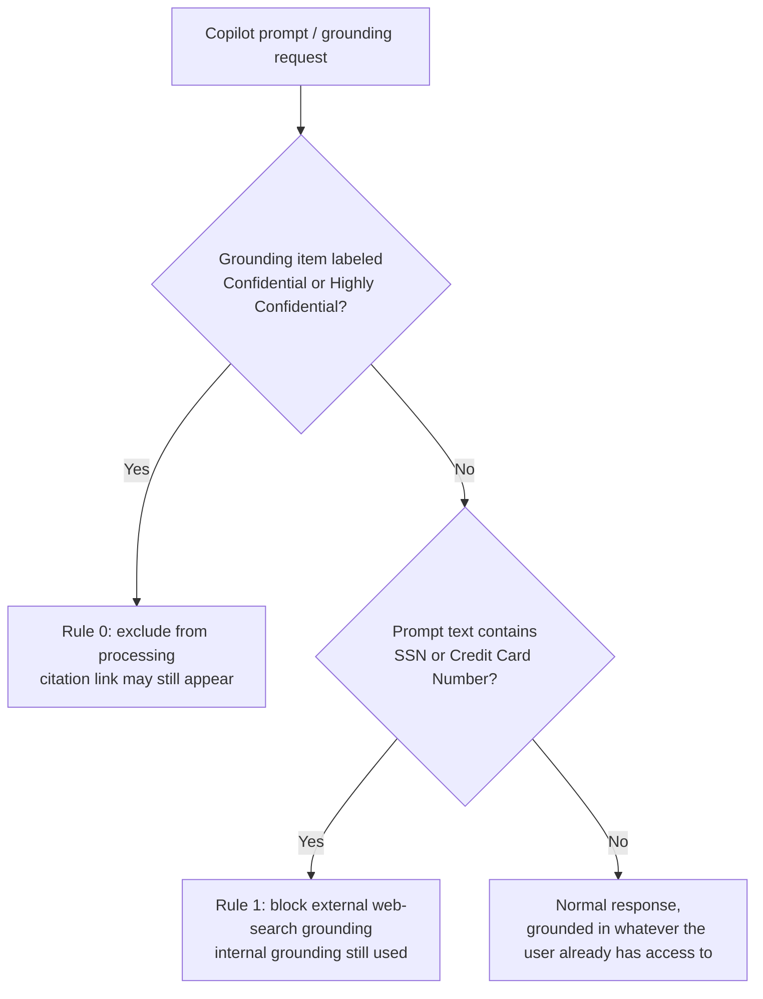

## 1. Problem statement

Microsoft 365 Copilot answers prompts in the querying user's own security context — it does not
grant new access, but it makes every file that user can technically reach dramatically easier to
discover and synthesize. Years of accumulated SharePoint/OneDrive oversharing (broad "Everyone
except external users" grants, stale "Anyone" links, permission inheritance nobody has audited)
that was previously a low-visibility risk becomes a one-prompt discoverability risk the moment
Copilot is licensed. An organization needs two things before and during a Copilot rollout: (1) a
technical control that stops Copilot from actually using content that is deliberately marked
sensitive, and (2) visibility into how much *unlabeled* oversharing exposure exists, because the
technical control in (1) cannot see it.

## 2. Design goals

1. Deploy a real, idempotent, re-runnable DLP policy for the **Microsoft 365 Copilot and Copilot
   Chat** location that excludes sensitivity-labeled confidential content from Copilot processing —
   the one part of "Copilot oversharing risk" a content-level DLP control can actually close.
2. Add a second, narrower rule that restricts Copilot's use of external web search as a grounding
   source when a prompt itself contains a sensitive information type (SSN, credit card number) —
   a different, real risk (sensitive prompt fragments leaking to a web search provider) that this
   repo's Purview DLP-for-Copilot location also supports natively.
3. Be explicit, everywhere in this scenario's deliverables, that neither rule fixes **unlabeled**
   oversharing — the actual permissions problem. Point instead at the DSPM for AI oversharing data
   risk assessment as the tool that finds that exposure, and at permissions remediation /
   auto-labeling expansion as the fix. A scenario that lets a buyer believe this DLP policy alone
   solves "Copilot oversharing" would be selling a control that doesn't match its own limitations —
   flagged explicitly as a Product Owner review item (see `reviews.md`).
4. Only script what Microsoft's own PowerShell reference documents with a worked, citable example.
   The Copilot location DLP surface has at least one additional documented action (full
   prompt-response blocking) with no published PowerShell example as of this build — that action is
   deliberately left portal-only rather than reconstructed from an unconfirmed parameter/setting
   name (`AGENTS.md` §4 no-invented-cmdlets rule).
5. Ship "off" by default (`-Mode TestWithNotifications`), matching every other DLP scenario in this
   repo.

## 3. Why DLP for Copilot (not DSPM for AI policies, not sensitivity label enforcement alone) for the technical control

- **DSPM for AI (classic) itself has no DLP authoring surface.** It is a dashboard, reporting, and
  recommendation layer that *creates* one-click DLP/IRM/Communication Compliance policies on the
  buyer's behalf through the portal — there is no PowerShell/Graph cmdlet in Microsoft's published
  reference that creates a *custom* data risk assessment or a Copilot DLP policy through DSPM for AI
  directly. The only real deploy surface for the technical control this scenario needs is DLP
  itself, targeting the Copilot location — DSPM for AI (classic) is documented here as the
  discovery/reporting layer this scenario complements, not the deploy target.
- **Sensitivity labeling and its enforcement policies alone are not enough.** A label's own
  encryption/access-restriction settings control who can *open* a file; they do not, by themselves,
  stop Copilot from *summarizing* a file the user is already permitted to open. DLP for the Copilot
  location is the mechanism that adds that additional "don't process this in a Copilot response"
  behavior on top of an existing label — this scenario assumes the label taxonomy already exists
  (via `scenarios/information-protection/auto-label-confidential-sharepoint/`) and adds the Copilot
  enforcement layer on top.
- **Endpoint DLP / Teams DLP do not cover Copilot grounding or prompts at all.** They are different
  policy locations entirely; DLP for Microsoft 365 Copilot and Copilot Chat is a distinct location
  introduced specifically for this surface [[README §12, ref 2]].

## 3a. Why a new, named policy instead of the one-click "DSPM for AI - Protect sensitive data from Copilot processing" default

DSPM for AI's Recommendations page offers a one-click policy that creates functionally the same
label-exclusion rule this scenario's script deploys (`dspm-for-ai-considerations`, one-click
policies list). This scenario deploys a separately named, script-managed policy instead, for the
same reason `scenarios/dlp/pci-teams-exfil-block/design.md` §3a gives for not editing that
workload's default policy in place: a one-click policy is portal-managed state outside this
repository's version control, can be silently reset or reconfigured by any admin with DSPM for AI
access, and (unlike this scenario's script) does not ship with the second, SIT-based web-grounding
rule this scenario also deploys in the same policy object. A buyer who already activated the
one-click policy should treat this scenario's script as the versioned, auditable replacement for
it, not an addition — the validation script's config check (§7) will surface a naming collision if
both exist.

## 4. Policy architecture

One DLP policy, two rules, both scoped to `Locations` = the Microsoft 365 Copilot Applications
location GUID `470f2276-e011-4e9d-a6ec-20768be3a4b0`, `EnforcementPlanes = @("CopilotExperiences")`.
Microsoft's documentation states a single rule cannot combine a sensitivity-labels condition and a
sensitive-information-types condition — hence two rules, not one with two conditions
[[README §12, ref 2]].

| Priority | Rule | Condition | Action |
|---|---|---|---|
| 0 | `Copilot-Exclude-Labeled-Content` | `AdvancedRule` JSON: content contains sensitivity label (Confidential, Highly Confidential, by label GUID) | `RestrictAccess = @{setting='ExcludeContentProcessing'; value='Block'}` — item excluded from Copilot processing; may still appear in citations |
| 1 | `Copilot-Restrict-WebGrounding-SensitivePrompts` | `ContentContainsSensitiveInformation` = U.S. Social Security Number (SSN), Credit Card Number | `RestrictWebGrounding = $true` — external web search grounding blocked for that prompt; internal M365 grounding unaffected |

## 5. Data flow / where enforcement happens

DLP for the Copilot location evaluates server-side as part of the Copilot grounding pipeline,
driven by policy synced from Security & Compliance PowerShell / the Purview portal — up to **four
hours** propagation after a policy change, longer than the ~1 hour this repo's Teams DLP scenario
cites [[README §12, ref 2]]. For Word/Excel/PowerPoint specifically, the label-exclusion check is
evaluated **at file open**, not continuously during an editing session — a label applied mid-session
takes effect only the next time the file is opened.

**Important scoping boundary carried into `README.md` §11 (Known limitations):** this evaluation
happens entirely within the Copilot grounding/response pipeline. It has no effect on the
underlying SharePoint/OneDrive/Exchange permission that let the user's account reach the item in
the first place, and no effect on a user opening the item directly outside Copilot. This is a
content-processing control, not an access control — see §7 (Non-goals) below.

## 6. Key decisions

| Decision | Choice | Rationale |
|---|---|---|
| Deploy surface | Security & Compliance PowerShell (`Connect-IPPSSession`), per `docs/automation-surface.md` surface 2 | Same as every other DLP scenario in this repo; no Graph authoring equivalent for DLP policy/rule objects exists today. |
| Label-condition mechanism | `-AdvancedRule` JSON (not a simple named parameter) | This is the only mechanism Microsoft's own `New-DlpComplianceRule` reference documents for combining a sensitivity-label condition with the Copilot location's `RestrictAccess` action — reproduced from that reference's own worked Example 4, not invented. |
| Sensitivity labels | **Confidential**, **Highly Confidential** (parameterizable list) | Reuses and extends the label taxonomy already established by `scenarios/information-protection/auto-label-confidential-sharepoint/` rather than introducing a new one. |
| SITs for the web-grounding rule | **U.S. Social Security Number (SSN)**, **Credit Card Number** | Reuses the exact SIT pair already established by `auto-label-confidential-sharepoint` and `endpoint-dlp-usb-block`, keeping this repo's example tenant's sensitive-data taxonomy consistent across scenarios rather than introducing a third variant. |
| Web-search action mechanism | `-RestrictWebGrounding $true` (typed boolean parameter) | A confirmed, named parameter on `New-DlpComplianceRule`/`Set-DlpComplianceRule`, and its name directly matches the documented "Prevent Copilot from processing content > Performing Web Searches" portal action. Preferred over attempting the same effect through an undocumented `-RestrictAccess` setting string. |
| Prompt-response full-block action | **Out of scope for this scenario's deploy script; built separately** | No published Microsoft PowerShell worked example combined this action with the Copilot location as of this build. Flagged as a `VERIFY`/follow-up in `README.md` §5 and `PROGRESS.md`; a later re-grounding pass built it as `scenarios/dspm-for-ai/copilot-prompt-full-block/`, a third rule on this same policy, with the remaining PowerShell-grounding gap still disclosed rather than fabricated. |
| Default policy mode | `TestWithNotifications` | Matches `AGENTS.md` §4's dry-run-by-default code standard and every other DLP scenario in this repo. |
| Locations JSON formatting | Fully-quoted, standards-conformant JSON (`{"Type":"Tenant","Identity":"All"}`) rather than the unquoted-key form shown in Microsoft's own Example 4 (`{Type:"Tenant", Identity:"All"}`) | The published example's JSON is not strictly valid; this script emits valid JSON with the same semantic content, consistent with the fully-quoted form Microsoft uses in its own `New-FeatureConfiguration` Example 1 for the same Copilot Applications location pattern. Flagged as an explicit `VERIFY` in `README.md` §11 pending pilot-tenant confirmation that the portal-generated value matches byte-for-byte. |

## 7. Non-goals

- This scenario does not remediate SharePoint/OneDrive oversharing itself (removing "Anyone" links,
  tightening inherited permissions, Restricted Access Control). That is the output of the DSPM for
  AI oversharing assessment this scenario documents as a required companion activity, not a
  deliverable of this scenario's code.
- This scenario does not configure the DSPM for AI custom (non-default) data risk assessment for
  Fabric or other item-level scanning — those require a separate Entra app registration with
  `Sites.ReadWrite.All`/`Files.ReadWrite.All` and other Graph application permissions
  (`dspm-for-ai-considerations` prerequisites) that are a materially different automation surface
  from this scenario's DLP policy and are better scoped as their own fragment.
- This scenario does not configure DLP restriction of external email as a Copilot grounding source
  (the "Block external email from being processed" preview feature) — a related but distinct
  Copilot-location DLP action with its own condition type (`Email is received from > External
  users`), out of scope here to keep this fragment to the oversharing/labeled-content exposure
  problem it is named for. **Built** as `scenarios/dspm-for-ai/copilot-external-email-block/`, which
  adds it as a fourth rule on this same shared policy.
- This scenario does not configure Adaptive Protection-driven, risk-based DLP for **third-party**
  generative AI sites accessed via a browser (a different location/enforcement plane from the
  first-party Microsoft 365 Copilot location this scenario covers). A dedicated grounding pass
  (`PROGRESS.md`, 2026-09-09) investigated this as a follow-up scenario and found it is **not**
  a straightforward extension of `scenarios/adaptive-protection/dynamic-risk-dlp-enforcement/`'s
  Teams/Exchange pattern the way this note previously implied: the DSPM for AI one-click policies
  that cover third-party AI sites split across two structurally different mechanisms — an
  Endpoint DLP (`Devices`) policy against the built-in, non-editable "Generative AI Websites"
  sensitive service domain group, and a newer "Inline web traffic" / Edge for Business location
  using an "Adaptive app scopes" cloud-app construct — and neither has a Microsoft-published
  PowerShell/Graph worked example as of this pass, so this repo does not script either rather than
  fabricate the missing parameters. See the closed `PROGRESS.md` follow-up item for the full
  citation trail.
