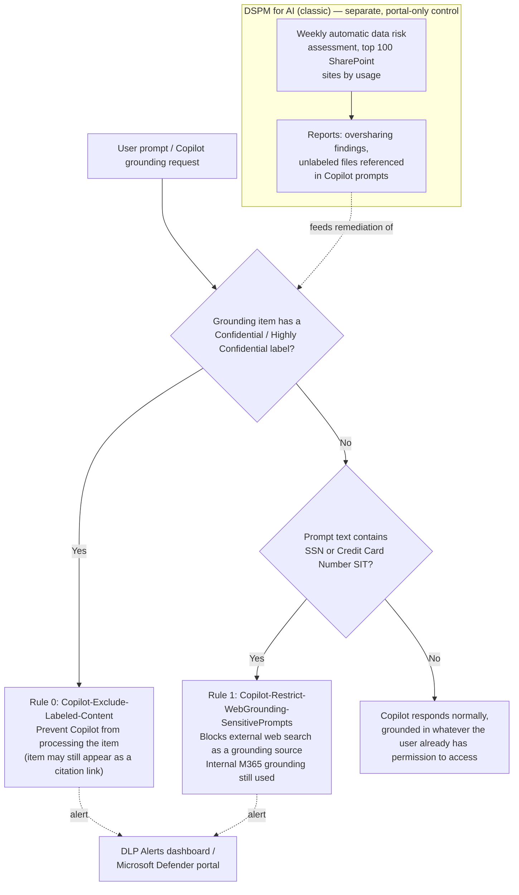

## 1. Scenario summary

Reduces the risk that Microsoft 365 Copilot and Copilot Chat surface sensitivity-labeled
confidential content, or leak prompt-embedded sensitive data to external web search, during and
after a Copilot rollout. Combines a Microsoft Purview Data Loss Prevention (DLP) policy scoped to
the **Microsoft 365 Copilot and Copilot Chat** location (blocking Copilot from processing
**Confidential**/**Highly Confidential**-labeled files and emails, and restricting web-search
grounding when a prompt contains SSNs or credit card numbers) with the **Data Security Posture
Management (DSPM) for AI** oversharing data risk assessment that identifies the broader, unlabeled
oversharing exposure this DLP policy does **not** cover.

**Who it's for:** an organization that already has (or is about to deploy) Microsoft 365 Copilot
licenses and needs a documented, evidenced control against Copilot inadvertently summarizing
confidential content a user can technically reach through an overshared SharePoint/OneDrive
permission, plus visibility into how much of that oversharing exposure exists before/during
rollout — a common pre-Copilot-rollout security review requirement and a GDPR/data-minimization
control point.

## 2. Business/regulatory driver

Microsoft 365 Copilot answers in the **security context of the querying user** — it does not grant
new access, but it makes *existing* access dramatically more discoverable: a user who could
technically reach an overshared file via a stale "Everyone except external users" SharePoint
permission previously had to know the file existed and find it manually; Copilot will now
summarize it for them from a single prompt. This is Microsoft's own documented pre-Copilot-rollout
risk, and Microsoft's own guidance is explicit that DSPM for AI's oversharing data risk assessment
and DLP for Copilot are the two controls that address it together, not either alone
[[1]](#references)[[2]](#references).

Regulatory/business drivers this scenario supports:
- **GDPR / data-minimization hygiene** — a labeled-PII file becoming instantly summarizable
  tenant-wide (to anyone with pre-existing, possibly stale, access) increases the practical
  exposure of that data even though no new grant occurred; excluding labeled confidential content
  from Copilot processing is a documented, low-friction mitigation.
- **Pre-deployment security review** — most enterprise Copilot rollouts now require a completed
  oversharing risk assessment and a documented technical control before broad licensing, per
  Microsoft's own secure-Copilot-foundation guidance [[3]](#references).
- **Prompt-injection / data-exfiltration-via-web-search hygiene** — a prompt that echoes sensitive
  data (SSN, card number) can otherwise be used by Copilot as a grounding signal for an external
  web search, sending that fragment outside the tenant boundary as part of the search query
  [[2]](#references).

**Critical scope note carried through this scenario (see `design.md` §2 and §7):** the DLP policy
this scenario deploys protects **labeled** content and **prompt text matching a sensitive
information type (SIT)**. It does **not** by itself fix oversharing of **unlabeled** content — that
is a permissions problem, not a DLP problem, and the correct tool for finding it is the DSPM for AI
data risk assessment (§5, §8 below), not this policy. Selling or deploying this scenario as "the"
fix for Copilot oversharing without also running the assessment and remediating what it finds is a
Microsoft Product Owner **Fix** finding from this scenario's own review — see `reviews.md`.

## 3. Prerequisites

Full licensing detail and citations: `docs/licensing-matrix.md`. Summary for this scenario:

| Requirement | Minimum | Notes |
|---|---|---|
| Microsoft 365 Copilot license | Per-user add-on | Required for any user this scenario's controls apply to; DSPM for AI itself and the underlying Purview capabilities don't require a Copilot license, but they have no Copilot-specific data to act on without it |
| DLP to restrict Copilot from processing **files and emails** (label-based rule) | **Microsoft 365/Office 365 E5/A5**, **Microsoft Purview Suite/EDU/FLW**, or **Microsoft 365/A5/F5 Information Protection and Governance** | **Not available** on Microsoft 365 Business Basic/Standard/Premium or the E3/A3/A1/G3/F3/F1 tiers — this is an E5-tier capability [[4]](#references) |
| DLP to **safeguard prompts** (SIT-based web-grounding rule) | **All Microsoft 365 Copilot and Copilot Chat licenses**, any tier | Unlike the label-based rule, prompt-safeguard DLP is available regardless of the underlying Microsoft 365 license tier [[4]](#references) — do not over-quote E5 as a requirement for this half of the policy |
| Published sensitivity labels | At least one label (this scenario defaults to **Confidential** and **Highly Confidential**, parameterizable) | Reuses the label taxonomy from `scenarios/information-protection/auto-label-confidential-sharepoint/` — label authoring is a separate prerequisite, not deployed by this scenario |
| Role to author/edit the Copilot-location DLP policy | One of: **Microsoft Entra AI Admin**, **Purview Data Security AI Admin(s)**, **Purview Compliance Administrator**, **Purview Compliance Data Administrator**, **Purview Information Protection (Admin)**, **Purview Security Administrator**, or **Microsoft Entra Global Admin** | This is a **narrower, Copilot-location-specific role list** than the generic "DLP Compliance Management" role used by every other DLP scenario in this repo (Teams/Endpoint) — confirm the automation identity holds one of these specific roles, not just generic DLP authoring rights [[5]](#references) |
| DSPM for AI (classic) view/manage permissions | **Microsoft Entra Compliance Administrator**, **Microsoft Entra Global Administrator**, or **Microsoft Purview Compliance Administrator** role group | See `docs/rbac-model.md` §3; view-only via **Microsoft Purview Security Reader** or **Purview Data Security AI Viewer** [[6]](#references) |
| Automation identity | App registration with **Exchange Online Protection → `Exchange.ManageAsApp`** application permission, granted one of the Copilot-DLP-authoring roles above | Certificate-based app-only auth — see `docs/automation-surface.md` §3 |
| Tenant-level | **Microsoft Purview Audit** turned on | Prerequisite for DSPM for AI's Copilot activity insights and Activity explorer events; on by default for new tenants [[7]](#references) |

> Verify current entitlement names against `docs/licensing-matrix.md` and the Product Terms before
> a sales commitment — SKU names and the Copilot-DLP-for-prompts preview/GA status change.

## 4. Architecture



One DLP policy (`Copilot DLP - Sensitive Data Exposure Protection`) scoped to the **Microsoft 365
Copilot and Copilot Chat** location, with two rules (label-based content exclusion, SIT-based
web-grounding restriction) — full rationale in `design.md` §4–6 — plus the DSPM for AI (classic)
oversharing data risk assessment, which is portal-only (no PowerShell/Graph authoring surface as of
this build) and is documented as a configuration reference and operational step, not deployed by
the script. Policy changes to the Copilot location can take **up to four hours** to reflect in the
Copilot experience [[2]](#references) — longer than the ~1 hour Teams DLP propagation this repo's
other DLP scenarios cite.

## 5. Step-by-step implementation

### Portal path (for a first manual walkthrough / to validate intent before scripting)

**DLP policy:**

1. Sign in to the [Microsoft Purview portal](https://purview.microsoft.com) → **Data loss
   prevention** → **Policies** → **Create policy**.
2. Category: **Custom** → template: **Custom policy** → **Next**. The **Microsoft 365 Copilot and
   Copilot Chat** location is **only available in the Custom template** [[2]](#references).
3. Name: `Copilot DLP - Sensitive Data Exposure Protection`. Policies can't be renamed after
   creation — confirm before continuing.
4. **Choose locations**: turn **on** only **Microsoft 365 Copilot and Copilot Chat**. Selecting
   this location disables every other location for the same policy [[2]](#references).
   **Admin units are not supported** for this location — it always applies tenant-wide
   [[2]](#references).
5. **Define policy settings**: choose **Create or customize advanced DLP rules**.
6. Create rule **Copilot-Exclude-Labeled-Content** (priority 0):
   - Condition: **Content contains** → **Sensitivity labels** → select **Confidential** and
     **Highly Confidential**.
   - Action: **Prevent Copilot from processing content**. The item can still appear in the
     response's citations, but its content is not summarized or used [[2]](#references).
7. Create rule **Copilot-Restrict-WebGrounding-SensitivePrompts** (priority 1):
   - Condition: **Content contains** → **Sensitive information types** → **U.S. Social Security
     Number (SSN)**, **Credit Card Number**. Microsoft's documentation is explicit that **you
     cannot combine a sensitivity-labels condition and a sensitive-information-types condition in
     the same rule** — this must be a second rule, not an added condition on rule 0
     [[2]](#references).
   - Action: **Prevent Copilot from processing content** → **Performing Web Searches**.
8. **Policy mode**: choose **Run the policy in simulation mode** first. Follow the staged rollout
   in §8 below.
9. **Submit**, then **Done**.

> **Now scripted as a separate, extending scenario:** Microsoft also offers a third Copilot-location
> action — **Prevent Copilot from processing content > Processing prompts**, which fully blocks a
> Copilot response when the prompt itself contains a chosen SIT (rather than only restricting
> web-search grounding). A dedicated re-grounding pass (`PROGRESS.md`, 2026-09-10) found Microsoft
> has since published a fuller worked use case for this action (still preview, still no worked
> PowerShell example for this exact condition/action combination) — see
> `scenarios/dspm-for-ai/copilot-prompt-full-block/`, which adds this action as a third rule on this
> same policy, with the remaining PowerShell-grounding gap explicitly disclosed rather than resolved
> by guessing (`AGENTS.md` §4).

**DSPM for AI oversharing assessment (no activation needed, but review the results):**

10. Sign in to the [Microsoft Purview portal](https://purview.microsoft.com) → **Solutions** →
    **DSPM for AI (classic)** → **Overview**. A weekly data risk assessment against the tenant's
    top 100 SharePoint sites by usage runs automatically, no setup required [[1]](#references).
11. From **Reports**, review the SharePoint sites with the most unlabeled files referenced in
    Copilot prompts, and the sites with the broadest oversharing risk. Wait at least 24 hours after
    initial DSPM for AI activation for data to populate [[1]](#references).
12. Work the **Recommendations** page: in particular, **Protect your data from potential
    oversharing risks** (data risk assessment results) and **Protect items with sensitivity labels
    from Microsoft 365 Copilot and agent processing** (the one-click equivalent of the DLP policy
    this scenario deploys by named script instead — see `design.md` §3a for why this scenario uses
    a separately named, script-managed policy rather than the one-click default).

### Script path (idempotent, parameterized, dry-run capable)

```powershell
# 1. Connect (certificate app-only — see docs/automation-surface.md §3)
Connect-IPPSSession -AppId $AppId -Certificate $Cert -Organization $TenantDomain

# 2. Dry run — reports every change, makes none
./deploy/New-CopilotSensitiveDataProtectionPolicy.ps1 `
    -AdminNotificationEmail 'soc@contoso.com' `
    -WhatIf

# 3. Deploy in simulation mode (default) to observe real Copilot traffic first
./deploy/New-CopilotSensitiveDataProtectionPolicy.ps1 `
    -AdminNotificationEmail 'soc@contoso.com'

# 4. After a tuning window (allow up to 4 hours for propagation before testing), enforce
./deploy/New-CopilotSensitiveDataProtectionPolicy.ps1 `
    -AdminNotificationEmail 'soc@contoso.com' `
    -Mode Enable -Force

# 5. Validate
./validate/Test-CopilotSensitiveDataProtectionPolicy.ps1
```

The deploy script uses Security & Compliance PowerShell (`New-DlpCompliancePolicy`,
`New-DlpComplianceRule`) — automation surface 2 per `docs/automation-surface.md` §1. The
label-exclusion rule uses the `-AdvancedRule` JSON form (there is no simple
`-ContentContainsSensitiveInformation`-style parameter for a sensitivity-label condition combined
with the Copilot location's `-RestrictAccess` action); the web-grounding-restriction rule uses the
standard `-ContentContainsSensitiveInformation` parameter plus the `-RestrictWebGrounding` boolean
parameter. Both patterns are taken directly from Microsoft's own `New-DlpCompliancePolicy` /
`New-DlpComplianceRule` PowerShell reference examples — see the script's `.NOTES` block for exact
citations.

## 6. Configuration reference

| Setting | Rule 0: `Copilot-Exclude-Labeled-Content` | Rule 1: `Copilot-Restrict-WebGrounding-SensitivePrompts` |
|---|---|---|
| Priority | 0 | 1 |
| Condition | `AdvancedRule` — content contains sensitivity label (Confidential, Highly Confidential, by GUID) | `ContentContainsSensitiveInformation` = U.S. Social Security Number (SSN), Credit Card Number |
| Action | `RestrictAccess` = `@{setting='ExcludeContentProcessing'; value='Block'}` | `RestrictWebGrounding` = `$true` |
| What it stops | Copilot from using the item's content in a response summary (item may still appear as a citation link) | Copilot from using external web search as a grounding source for that prompt; internal M365 grounding is unaffected |
| What it does **not** stop | Access to the item outside Copilot (open/download); it is not a permissions control | Copilot from answering using internal (already-accessible) Microsoft 365 content, even unlabeled overshared content |
| `GenerateAlert` / `GenerateIncidentReport` | Admin/SOC mailbox | Admin/SOC mailbox |
| `ReportSeverityLevel` | High | Medium |
| Policy location | `Locations` = Copilot Applications location GUID `470f2276-e011-4e9d-a6ec-20768be3a4b0`, `EnforcementPlanes` = `CopilotExperiences` (both rules share the one policy) | |
| Policy `Mode` | `TestWithNotifications` (deploy default) → `Enable` after tuning | |

Full cmdlet parameter grounding: `deploy/New-CopilotSensitiveDataProtectionPolicy.ps1` inline
comments and its `.NOTES` block cite the exact Microsoft Learn PowerShell reference pages.

## 7. Validation / how to prove it works

1. **Automated config check** — `./validate/Test-CopilotSensitiveDataProtectionPolicy.ps1` confirms
   the policy and both rules exist with the expected settings, exits non-zero on any hard failure.
2. **Functional test (labeled content)** — apply the **Confidential** label to a test document in a
   SharePoint site a test user can access. Wait for the up-to-4-hour propagation window
   [[2]](#references), then ask Copilot (in Copilot Chat or the SharePoint agent) a question that
   would normally surface that document. Expect: the document does not appear as a used/summarized
   source; it may still appear as a citation link the user can open directly.
3. **Functional test (sensitive prompt)** — from a test account, submit a Copilot prompt containing
   a documented test SSN or test card number (never a real one) phrased as a request that would
   normally trigger a web search (e.g., "search the web for guidance on reporting SSN
   012-34-5678"). Expect: Copilot does not perform an external web search for that prompt; it may
   still answer using internal Microsoft 365 sources.
4. **Evidence** — in the **DLP Alerts dashboard** (Purview portal → Data loss prevention → Alerts)
   or the Microsoft Defender portal incidents queue, confirm both test events appear with the
   correct rule name.
5. **DSPM for AI Activity explorer** — Purview portal → DSPM for AI (classic) → Activity explorer →
   filter by event type **DLP rule match** and **Sensitive info types** to confirm ongoing match
   volume once in `Enable` mode; filter by **AI interaction** to see general Copilot usage volume
   for context.
6. **Oversharing assessment evidence** — DSPM for AI (classic) → Reports → review the current
   top-100-SharePoint-sites oversharing assessment results as the baseline this scenario's
   remediation work (outside this script's scope) should measurably reduce over time.

## 8. Operations & tuning

**Deployment sequence:** Off → Run in simulation mode → Run in simulation mode + show policy tips
(pilot group, where supported for this location) → Turn it on. The deploy script's default `-Mode
TestWithNotifications` corresponds to the simulation stage; pass `-Mode Enable` deliberately once
tuning is complete. Allow the documented **up to four hours** for a policy change to reach the
Copilot experience before drawing conclusions from a test [[2]](#references) — longer than this
repo's Teams/Exchange DLP scenarios (~1 hour), plan test windows accordingly.

**KPIs to watch (first 30 days):**
- **Rule 0 (label exclusion) match count** — trend by SharePoint site. A concentration of matches
  on a small number of sites usually indicates a site whose sensitivity-label coverage or
  permissions need attention beyond this DLP policy — cross-reference against the DSPM for AI
  oversharing assessment for that site (§7, step 6).
- **Rule 1 (web-grounding restriction) match count** — a sustained high rate can indicate users
  routinely including real sensitive data in prompts as a matter of habit (e.g., pasting a customer
  record to ask Copilot to reformat it) — a training/process signal, not necessarily malicious.
- **DSPM for AI oversharing assessment trend** — this is the primary metric this scenario exists to
  move: falling site-count and file-count in the weekly oversharing assessment over time is the
  evidence that permissions remediation (not this DLP policy, which is a content-level backstop)
  is working. Review monthly at minimum during an active Copilot rollout.
- **Unlabeled-file-in-Copilot-prompt volume** (DSPM for AI Reports) — files referenced in Copilot
  prompts that carry **no** sensitivity label at all are invisible to Rule 0 by definition; a high
  and rising trend here is the strongest available signal that label coverage (not this DLP policy)
  needs expansion — see `design.md` §7 and Known Limitations below.

**Ownership note:** assign an accountable owner for the DSPM for AI oversharing-assessment trend
who is **not** solely the DLP/Security team — permissions remediation (removing stale "Anyone"
links, tightening inherited SharePoint permissions) is typically a SharePoint admin / data
governance responsibility. A program that only tunes this DLP policy while nobody owns the
underlying permissions backlog will show declining Rule 0 match *rates* (fewer labeled items get
touched as usage patterns shift) without the oversharing assessment's site/file counts actually
improving — a misleading signal for a board-level report. Name the owner before reporting this
control as "in place."

**Alert routing:** both rules generate alerts and incident reports to the SOC/admin mailbox
parameter. Route into the SIEM (Microsoft Sentinel connector or Microsoft Defender XDR incident
queue export) per `docs/automation-surface.md` §4.

**Review cadence:** quarterly at minimum for the DLP policy configuration (re-run
`validate/Test-CopilotSensitiveDataProtectionPolicy.ps1` to catch drift); **monthly** for the DSPM
for AI oversharing assessment trend during an active Copilot rollout, dropping to quarterly once
the oversharing backlog is under control.

**Incident-response runbook (Rule 0 / Rule 1 alert):**
1. **Triage** — open the alert in the DLP Alerts dashboard or Microsoft Defender portal incident
   queue; confirm which rule matched and the sending user.
2. **Classify** — Rule 0 match: expected, routine behavior (a user asked about something they can
   technically access but is labeled confidential) unless the volume or specific site is anomalous
   for that user — escalate anomalies to the DSPM for AI **Activity explorer** user-risk view (for
   analysts with Insider Risk Management Analyst/Investigator access) rather than treating every
   match as an incident. Rule 1 match: check whether the prompt content resembles a real customer
   record (possible legitimate but risky workflow needing process guidance) or looks like probing/
   test behavior.
3. **Document** — retain alert records; do not delete or edit them. They are the evidence trail for
   the pre-rollout security review this scenario exists to support.
4. **Escalate to permissions remediation, not just DLP tuning** — if Rule 0 matches cluster on a
   specific SharePoint site, that site is a candidate for the DSPM for AI oversharing
   recommendation workflow (tighten sharing links, review site permissions) — closing the loop back
   to §8's primary KPI, not just suppressing the DLP alert.

## 9. Rollback / decommission

See `rollback.md` for the full staged procedure. Quick reference:
`./deploy/Remove-CopilotSensitiveDataProtectionPolicy.ps1` disables (reversible); add `-Purge` to
permanently delete the policy and its rules. The DSPM for AI oversharing assessment is not deployed
by this scenario (portal-only, automatic) and has nothing to roll back.

## 10. Cost & licensing notes

- **No PAYG component for this scenario's DLP policy.** It is a per-user entitlement feature
  (E5-tier for the label-exclusion rule; any tier for the prompt-safeguard rule), not billed
  through Purview's Azure consumption model.
- **Copilot licensing is the dominant cost driver**, and is a prerequisite this scenario assumes is
  already funded — this scenario does not add incremental Copilot licensing cost, it protects an
  investment already being made.
- **Sizing note:** the label-exclusion rule (Rule 0) only requires E5-tier licensing for users
  whose Copilot interactions need this Purview DLP control — in practice this typically means every
  Copilot-licensed user, since Copilot licensing itself already implies significant per-user
  spend that E5-tier Purview add-ons are a comparatively small increment against, but confirm the
  buyer's actual current tier before assuming zero incremental cost.
- **DSPM for AI (classic) itself carries no separate SKU** beyond the underlying Compliance
  Administrator-tier permissions and (for custom, non-default assessments) potential PAYG billing
  for advanced item-level scanning — see `docs/licensing-matrix.md` §"DSPM for AI" row and
  re-verify before quoting a custom-assessment engagement.

## 11. Known limitations & gotchas

- **This scenario does not fix oversharing — it is a content-level backstop.** The single most
  important limitation, repeated because it is also this scenario's core selling point: Rule 0 only
  excludes content that already carries a sensitivity label. Unlabeled overshared content is
  invisible to this DLP policy and will be summarized by Copilot exactly as if this scenario did
  not exist. The DSPM for AI oversharing assessment (§5, §8) is how a buyer finds that exposure;
  fixing it means SharePoint/OneDrive permissions remediation and/or expanding auto-labeling
  coverage (`scenarios/information-protection/auto-label-confidential-sharepoint/`), not more DLP
  rules.
- **Citations still leak existence and a clickable link.** A user who already has access to a
  labeled-excluded item can still see it referenced in Copilot's citations and open it directly —
  DLP for Copilot prevents Copilot from *summarizing* the content, not from a user with pre-existing
  access reaching the file through the citation link. This is documented, expected behavior, not a
  bug — but it means this control does not reduce raw access, only Copilot-mediated discoverability
  and effortless synthesis.
- **Rule 1 does not stop internal grounding.** `RestrictWebGrounding` only blocks *external* web
  search as a grounding source; it has no effect on Copilot's use of internal Microsoft 365
  content (files, email, Teams) to answer a sensitive-looking prompt. Do not present this rule as a
  general "block sensitive prompts" control — it solves a narrower, real problem (sensitive prompt
  fragments leaking to a web search provider), not the oversharing problem.
- **Full prompt-response blocking ("Processing prompts" action) is now scripted separately.** See
  the callout in §5 and `scenarios/dspm-for-ai/copilot-prompt-full-block/`, which adds it as a third
  rule on this same policy. It remains a preview feature without a published PowerShell worked
  example for this exact condition/action combination as of that scenario's build — see its own
  `README.md` §5/§11 for the disclosed gap.
- **Files uploaded directly into a prompt are not scanned by DLP at all** — Microsoft's
  documentation is explicit that DLP only inspects the text typed into the prompt, not the content
  of an uploaded file [[2]](#references). A user can bypass both rules entirely by uploading a
  labeled or sensitive file directly rather than referencing it by name/search.
- **Up to four hours propagation** for a policy change to reach the Copilot experience — longer
  than the ~1 hour this repo's other DLP scenarios cite for Teams; do not test immediately after
  deploying or updating.
- **Word/Excel/PowerPoint enforcement is evaluated at file open**, not continuously — if a
  sensitivity label is applied to a file mid-session, the exclusion only takes effect the next time
  the file is opened [[2]](#references).
- **No documented pilot-group scoping for this location.** Every worked Microsoft example for the
  Copilot location's `-Locations` JSON scopes `Inclusions` to `{"Type":"Tenant","Identity":"All"}`
  — this scenario's deploy script follows that pattern and applies tenant-wide once `Mode` is set
  to `Enable`. A `{"Type":"Group","Identity":"..."}` inclusion is documented for the same
  `Applications`-workload location shape on the *collection*-policy cmdlets
  (`New-/Set-FeatureConfiguration`), but no worked example confirms this also works for a
  `New-DlpCompliancePolicy` rule on the Copilot location specifically. **VERIFY** in a pilot tenant
  before promising a customer a group-scoped pilot rollout of this DLP policy; until confirmed,
  treat `TestWithNotifications` (simulation) as the only safe pre-enforcement pilot mechanism this
  scenario supports, and see `PROGRESS.md` for the follow-up to close this gap.
- **VERIFY before go-live:** confirm in a pilot tenant that the JSON `Locations` string this
  scenario's deploy script constructs (`deploy/New-CopilotSensitiveDataProtectionPolicy.ps1`
  `.NOTES`) is byte-accurate to what the Purview portal itself generates when the **Microsoft 365
  Copilot and Copilot Chat** location is selected through the UI — Microsoft's own published
  `New-DlpCompliancePolicy` reference example for this location contains unquoted JSON object keys
  (`{Type:"Tenant", Identity:"All"}`) that would fail strict JSON parsing; this script's
  `.NOTES` documents the fully-quoted, standards-conformant JSON it uses instead and why.

## 12. References

1. Learn about Data Security Posture Management for AI (classic) — automatic weekly top-100
   SharePoint site oversharing assessment, Reports, Activity explorer — <https://learn.microsoft.com/purview/dspm-for-ai>
2. Learn about using Microsoft Purview Data Loss Prevention to protect interactions with Microsoft
   365 Copilot and Copilot Chat (locations, conditions/actions table, licensing, permissions,
   four-hour propagation, file-open enforcement timing, uploaded-file scanning limitation) — <https://learn.microsoft.com/purview/dlp-microsoft365-copilot-location-learn-about>
3. Configure a secure and governed foundation for Microsoft Copilot (pre-rollout oversharing
   guardrails, DLP-for-Copilot as the sensitivity-label enforcement step) — <https://learn.microsoft.com/microsoft-365/copilot/configure-secure-governed-data-foundation-microsoft-365-copilot>
4. Microsoft Purview service description — DLP for Microsoft Copilot licensing table (label-based
   restriction requires E5-tier; prompt-safeguard DLP available at all tiers) — <https://learn.microsoft.com/office365/servicedescriptions/microsoft-365-service-descriptions/microsoft-365-tenantlevel-services-licensing-guidance/microsoft-purview-service-description#microsoft-purview-data-loss-prevention-dlp-for-microsoft-copilot>
5. Learn about using Microsoft Purview Data Loss Prevention to protect interactions with Microsoft
   365 Copilot and Copilot Chat — Permissions section (Copilot-location-specific role list) — <https://learn.microsoft.com/purview/dlp-microsoft365-copilot-location-learn-about#permissions>
6. Permissions for Data Security Posture Management for AI (classic) — <https://learn.microsoft.com/purview/ai-microsoft-purview-permissions>
7. Learn about Data Security Posture Management for AI (classic) — Microsoft Purview Audit
   prerequisite for Copilot activity insights — <https://learn.microsoft.com/purview/dspm-for-ai#how-to-use-data-security-posture-management-for-ai>
8. New-DlpCompliancePolicy reference — Example 4 (Copilot location JSON, `-EnforcementPlanes
   CopilotExperiences`, `-AdvancedRule` label-condition JSON, `-RestrictAccess
   ExcludeContentProcessing`) — <https://learn.microsoft.com/powershell/module/exchangepowershell/new-dlpcompliancepolicy>
9. New-DlpComplianceRule reference (`-RestrictAccess`, `-RestrictWebGrounding`,
   `-ContentContainsSensitiveInformation` parameters) — <https://learn.microsoft.com/powershell/module/exchangepowershell/new-dlpcompliancerule>
10. Set-DlpCompliancePolicy reference (`-Mode` values) — <https://learn.microsoft.com/powershell/module/exchangepowershell/set-dlpcompliancepolicy>
11. Remove-DlpCompliancePolicy reference — <https://learn.microsoft.com/powershell/module/exchangepowershell/remove-dlpcompliancepolicy>
12. Learn about the default data loss prevention policy for Microsoft 365 Copilot location (the
    one-click `Default DLP policy - Protect sensitive M365 Copilot interactions`, ships in
    simulation mode by default) — <https://learn.microsoft.com/purview/dlp-microsoft365-copilot-location-default-policy>
13. Considerations for DSPM for AI to manage data security and compliance protections for AI
    interactions (classic) — one-click policies including **DSPM for AI - Protect sensitive data
    from Copilot processing** — <https://learn.microsoft.com/purview/dspm-for-ai-considerations>
14. Connect-IPPSSession reference (app-only certificate auth) — <https://learn.microsoft.com/powershell/module/exchangepowershell/connect-ippssession>

> Re-verify all links, preview/GA status, and licensing tier citations against current Microsoft
> Learn before a customer-facing assessment or sale — Copilot-related Purview capabilities are
> changing faster than this repo's other, more mature DLP surfaces (Teams/Exchange/Endpoint).
