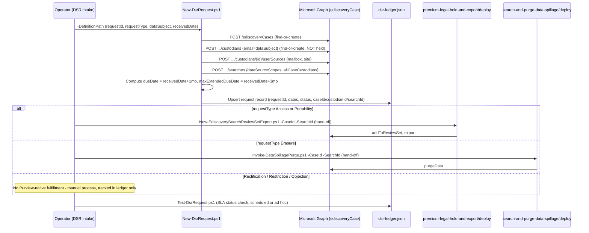

## 1. Scenario summary

Adds a request-tracking and SLA layer on top of this repo's existing eDiscovery capability for
GDPR **Data Subject Requests**: intake a request, create a custodian-scoped eDiscovery case/search
covering exactly the named person's own mailbox and OneDrive/SharePoint site, compute the
Article 12(3) response deadline, and hand off to this repo's already-built export/purge scripts for
Access/Portability/Erasure fulfillment. Rectification, Restriction, and Objection get a tracked
Discovery search and an honest statement that Purview has no technical fulfillment control for them
(§6).

**Who it's for:** a privacy/compliance team or Data Protection Officer that already has (or is
about to build) `scenarios/compliance-manager/gdpr-assessment/`'s regulatory posture assessment,
and needs the operational counterpart, a repeatable way to log a real DSR, know when it's due, and
run the actual Microsoft 365 discovery/export/erasure work without reinventing this repo's
already-reviewed eDiscovery scripts.

## 2. Business/regulatory driver

GDPR Articles 15-22 give data subjects rights, access, rectification, erasure ("right to be
forgotten"), restriction of processing, portability, and objection, that an organization must act
on. Article 12(3) sets the clock: a controller must respond **"without undue delay and in any event
within one month of receipt of the request,"** extendable by **"two further months where necessary,
taking into account the complexity and number of the requests,"** with the data subject informed of
any such extension, and the reasons, **within the original month**
. Microsoft's own guidance frames a DSR as six activities, 
**Discovery, Access, Rectification, Restriction, Export, Deletion**, and states directly that
Microsoft 365 content in scope for the Access/Export/Deletion activities lives in Exchange
mailboxes, Exchange public folders, SharePoint sites, and OneDrive accounts, all searchable via
eDiscovery. `gdpr-assessment/README.md` §8/§11 names the gap
this scenario closes: the closest prior technical building block had no request-tracking or SLA
timer at all, a real risk given Article 12(3)'s deadline is a compliance obligation with regulator
exposure, not a best-effort target.

> ⚠️ **This is not Microsoft Priva.** Priva Subject Rights Requests is a separate, purpose-built
> Microsoft product with its own case-management UI, SLA tracking, and Graph surface
> (`/security/subjectRightsRequests`). It is out of scope for this library by design
> (`AGENTS.md` §10; [Automation surface §4](/docs/automation-surface/#4-routing-table-which-surface-for-which-purview-task)). This scenario's ledger is a minimal,
> scenario-owned substitute for the SLA-tracking piece only, see `design.md` §2/§4.

## 3. Prerequisites

Full licensing detail: [Licensing matrix §2](/docs/licensing-matrix/#2-master-capability--license-matrix) (eDiscovery (Premium) row, a Graph-created
case is Premium-configured, the same finding `search-and-purge-data-spillage/design.md` §3 already
made). RBAC: [RBAC model §4](/docs/rbac-model/#4-purview-role-groups-by-module-representative-not-exhaustive). Automation surface: [Automation surface §3](/docs/automation-surface/#3-authentication-patterns-interactive-vs-unattended) (Microsoft
Graph, the supported app-only path for eDiscovery automation) and §4 (routing table; also names
Priva's Graph surface as explicitly out of scope for this library). Summary:

| Requirement | Minimum | Notes |
|---|---|---|
| Licensing | **eDiscovery (Premium)**: M365/Office 365 **E5**, **Microsoft Purview Suite**, or **E5 eDiscovery & Audit** add-on | A Graph-created case is always Premium-configured regardless of query scope, [Licensing matrix §2](/docs/licensing-matrix/#2-master-capability--license-matrix); `design.md` §3 |
| Role to author case/custodian/search via Graph app-only | **eDiscovery Manager** (own cases) or **eDiscovery Administrator** (all cases), the **Custodian** role (data-source management) is required and is only available to eDiscovery Manager members | [RBAC model §4](/docs/rbac-model/#4-purview-role-groups-by-module-representative-not-exhaustive) |
| Role to purge (Erasure requests only) | **Search And Purge** | Only needed when the request-type hand-off reaches `search-and-purge-data-spillage`'s purge script, see that scenario's own README.md §3 |
| Graph permission | Application **`eDiscovery.ReadWrite.All`** (read-only validation: `eDiscovery.Read.All`) | [Automation surface §3](/docs/automation-surface/#3-authentication-patterns-interactive-vs-unattended); same permission this repo's two eDiscovery siblings already use |
| Auth | Certificate-based app-only via `Connect-MgGraph` | [Automation surface §3](/docs/automation-surface/#3-authentication-patterns-interactive-vs-unattended) |
| PowerShell module | `Microsoft.Graph.Security` ≥ 2.25.0 | Same module/version floor as this scenario's siblings |
| Organizational | A documented intake process (how a DSR reaches whoever runs `New-DsrRequest.ps1`) and an identity-verification step **before** this scenario's scripts run | Out of scope for this scenario's code, see §11 |

## 4. Architecture



Full rationale for custodian-scoped (not tenant-wide) search, why no hold is applied, and why
Access/Erasure fulfillment is a hand-off rather than new code: `design.md` §3/§5.

## 5. Step-by-step implementation

### PowerShell path

```powershell
# 1. Intake - creates the case/custodian/userSource/search, computes SLA dates, writes the ledger.
#    -WhatIf first: reports every Graph action and the ledger write, mutates nothing.
./deploy/New-DsrRequest.ps1 -DefinitionPath ./deploy/policy/dsr-request-definition.sample.json `
    -AppId $AppId -TenantId $TenantId -CertificateThumbprint $Thumbprint -WhatIf

./deploy/New-DsrRequest.ps1 -DefinitionPath ./deploy/policy/dsr-request-definition.sample.json `
    -AppId $AppId -TenantId $TenantId -CertificateThumbprint $Thumbprint

# 1b. (Optional, Access/Portability where completeness matters) also search tenant-wide for
#     messages ABOUT the data subject stored in other people's mailboxes -- content the primary
#     custodian-scoped search cannot see (reviews.md Red Team finding 1):
./deploy/New-DsrRequest.ps1 -DefinitionPath ./deploy/policy/dsr-request-definition.sample.json `
    -AppId $AppId -TenantId $TenantId -CertificateThumbprint $Thumbprint -IncludeParticipantSearch

# 2. Review the search results (portal or Graph) before choosing a fulfillment path.

# 3a. Access or Portability - hand off to the review-set/export sibling, pointed at this case/search:
../premium-legal-hold-and-export/deploy/New-EdiscoverySearchReviewSetExport.ps1 `
    -CaseId $caseId -SearchId $searchId -AppId $AppId -TenantId $TenantId `
    -CertificateThumbprint $Thumbprint -WhatIf
../premium-legal-hold-and-export/deploy/Get-EdiscoveryExportPackage.ps1 `
    -CaseId $caseId -ExportOperationId $exportOpId -AppId $AppId -TenantId $TenantId `
    -CertificateThumbprint $Thumbprint

# 3b. Erasure - hand off to the search-and-purge sibling, pointed at this case/search:
../search-and-purge-data-spillage/deploy/Invoke-DataSpillagePurge.ps1 `
    -CaseId $caseId -SearchId $searchId -PurgeType Recoverable `
    -AppId $AppId -TenantId $TenantId -CertificateThumbprint $Thumbprint -WhatIf

# 3c. Rectification / Restriction / Objection - no script; correct the record in its system of
#     record, or make the licensing/service decision the Discovery search's results inform (§6).

# 4. Update the ledger's Status as the request progresses, and/or record an extension:
./deploy/New-DsrRequest.ps1 -DefinitionPath ./deploy/policy/dsr-request-definition.sample.json `
    -AppId $AppId -TenantId $TenantId -CertificateThumbprint $Thumbprint `
    -Status Fulfilled

./deploy/New-DsrRequest.ps1 -DefinitionPath ./deploy/policy/dsr-request-definition.sample.json `
    -AppId $AppId -TenantId $TenantId -CertificateThumbprint $Thumbprint `
    -ApplyExtension -ExtensionReason 'High request volume this quarter - Article 12(3)'

# 5. SLA check (run ad hoc or on a schedule) - reports every open request's days-remaining/overdue
#    status; exits non-zero on any breach.
./validate/Test-DsrRequest.ps1 -AppId $AppId -TenantId $TenantId -CertificateThumbprint $Thumbprint
```

### Portal reference

The case, custodian, userSource, and search are all visible under **eDiscovery** in the
[Microsoft Purview portal](https://purview.microsoft.com), using the identical
object model `New-DsrRequest.ps1` drives via Graph, a request can be reconciled in either
direction. There is **no portal "DSR case" button** in the current experience (§2 of `design.md`
explains why); a DSR case looks like any other eDiscovery case with one custodian.

## 6. Configuration reference

| Setting | Value this scenario uses | Notes |
|---|---|---|
| Custodian cmdlet | `New-MgSecurityCaseEdiscoveryCaseCustodian` | POST `.../custodians`, `email` |
| Custodian userSource | `New-MgSecurityCaseEdiscoveryCaseCustodianUserSource` | `includedSources = 'mailbox, site'`, same combined-string form `premium-legal-hold-and-export` uses; its own open VERIFY on whether this exact form is accepted applies unchanged (§11) |
| Hold | **Never applied** | Deliberate, `design.md` §3 |
| Search cmdlet | `New-MgSecurityCaseEdiscoveryCaseSearch` | `dataSourceScopes = 'allCaseCustodians'`, `contentQuery` optional and empty by default |
| Participant search (optional, `-IncludeParticipantSearch`) | Same cmdlet, second search | `dataSourceScopes = 'allTenantMailboxes'`, `contentQuery = "participants:<email>"`, catches messages about the data subject in other people's mailboxes; off by default (blast-radius tradeoff, `reviews.md` Red Team finding 1) |
| Request types | `Access`, `Portability`, `Erasure`, `Rectification`, `Restriction`, `Objection` | This scenario's own enum, mapped to GDPR Articles 15/20/17/16/18/21 respectively, not a Microsoft-defined type |
| SLA due date | `receivedDate` + 1 calendar month | GDPR Article 12(3) baseline |
| SLA extended due date | `receivedDate` + 3 calendar months | If the two-further-months extension is invoked; the data subject must be notified, with reasons, **within the original month**, this scenario records that the extension was applied, it does not send the notice (§11) |
| Fulfillment (Access/Portability) | Hand off to `premium-legal-hold-and-export/deploy/New-EdiscoverySearchReviewSetExport.ps1` + `Get-EdiscoveryExportPackage.ps1` | `design.md` §5 |
| Fulfillment (Erasure) | Hand off to `search-and-purge-data-spillage/deploy/Invoke-DataSpillagePurge.ps1` | Inherits that sibling's litigation-hold gap and `priority-cleanup-exchange-data-spillage` hand-off unchanged |
| Fulfillment (Rectification/Restriction/Objection) | None, manual/process | `design.md` §6 |
| Ledger | `deploy/dsr-ledger.json` (JSON array, one record per `requestId`) | This scenario's own state, not a Microsoft object, `design.md` §4 |

## 7. Validation / how to prove it works

1. **Automated (SLA + object-level)**, `./validate/Test-DsrRequest.ps1` reports every open
 request's SLA status ([PASS]/[WARN]/[FAIL] against the due/extended-due date), confirms the
 case/custodian/search still exist, and (best-effort, [WARN]-only) reports whether a review set
 (Access/Portability) or a `purgeData` operation (Erasure) has appeared in the case. Exits
 non-zero on any Overdue request, safe to run on a schedule as a breach alert.
2. **Idempotency proof**, re-run `New-DsrRequest.ps1` with the same definition file; the
 case/custodian/userSource/search all report "already exists," and the ledger entry is updated in
 place (same `requestId`), never duplicated.
3. **Fulfillment proof**, for Access/Portability, the hand-off sibling's own
 `validate/Test-EdiscoveryPremiumCaseSetup.ps1`; for Erasure, the hand-off sibling's own
 `validate/Test-DataSpillageSearchAndPurge.ps1`, both work unmodified against this scenario's
 `-CaseId`/`-SearchId`, since it's the same object model.
4. **Audit**, search the unified audit log for the eDiscovery case/custodian/search creation
 activity (RecordType `Discovery`); see `premium-legal-hold-and-export`'s
 `Export-EdiscoveryAuditTrail.ps1` for the query pattern this repo already uses.

## 8. Operations & tuning

**KPIs / signals:** open-request count by SLA status (OnTrack/DueSoon/Overdue) from
`Test-DsrRequest.ps1`'s output; time-to-fulfillment per request type; extension-invocation rate
(a rising rate across many requests is itself a signal worth reporting to the DPO, Article 12(3)
frames the extension as conditional on "complexity and number of the requests," not a routine
buffer). **Tuning:** if DSR volume is high enough that manually invoking `Test-DsrRequest.ps1` isn't
enough, schedule it (a cron job / scheduled task / Azure Automation runbook calling it with
`-AppId`/`-TenantId`/`-CertificateThumbprint`) and route its non-zero exit code to your
ticketing/alerting system, the script's `[FAIL]`/`[WARN]` lines are already structured enough to
parse. **Identity verification is out of scope but load-bearing:** this scenario assumes the
operator has already verified the requester's identity before running `New-DsrRequest.ps1`, a
custodian-scoped search created for the wrong person is itself a data-minimization problem (§11).
**Change management:** one request, one `requestId`, one case, do not reuse a case across multiple
data subjects' requests, even if they arrive close together, since `allCaseCustodians` scoping and
the ledger's per-request SLA tracking both assume a 1:1 case-to-request mapping.

## 9. Rollback / decommission

See `rollback.md`. Quick reference: closing or deleting the eDiscovery case follows the same
options `search-and-purge-data-spillage/rollback.md` and `premium-legal-hold-and-export/rollback.md`
already document; the ledger entry should be retained per the organization's own DSR
record-keeping/accountability policy (Article 5(2)) even after the case itself is closed, since it
is the only record of when the request was received and answered.

## 10. Cost & licensing notes

- **eDiscovery (Premium)** entitlement (E5/Suite/add-on), no separate per-search or per-custodian
 meter, same as this scenario's siblings.
- **Access/Portability fulfillment inherits the Export API's PAYG data-volume billing** from
 `premium-legal-hold-and-export` ([Licensing matrix §2](/docs/licensing-matrix/#2-master-capability--license-matrix)), only the export step is metered,
 not the search/custodian setup this scenario's own script performs.
- **The real cost driver is DSR volume, not the Purview meter**: a high-volume DSR program (many
 requests per month) is better served by Microsoft Priva's purpose-built, licensed Subject Rights
 Requests workflow than by scaling this scenario's flat-file ledger, see §2's warning banner. This
 scenario is sized for an organization with a low-to-moderate DSR volume that doesn't yet justify a
 separate Priva deployment.

## 11. Known limitations & gotchas

- **Not Priva. Not a replacement for legal/privacy judgment.** This scenario tracks a deadline and
 runs a search; it does not determine whether a request is valid, whether an exemption applies
 (e.g., data processed for legal claims, or a manifestly unfounded/excessive request under Article
 12(5)), or whether disclosing certain content would infringe a third party's rights. All of that
 remains a human decision before §5's fulfillment steps run.
- **Identity verification is not scripted.** A wrong-person custodian search is itself a
 data-protection problem, verify the requester's identity through your organization's own process
 before running `New-DsrRequest.ps1` (§8).
- **The Article 12(3) extension notice is not sent by this scenario.** `-ApplyExtension` only
 records that the extension was invoked and why; emailing the data subject, with reasons, within
 the original month remains the operator's action.
- **Export format may not satisfy Article 20 for Portability specifically.** eDiscovery review-set
 exports use PST (mail) and native file formats (documents), reasonable for an
 Access request, but Article 20 requires a "structured, commonly used, machine-readable format"
, a bar PST/native-format exports don't obviously clear for every Portability
 request. Review the exported package's format against the specific request before delivering it;
 this scenario doesn't reformat the export.
- **The default (custodian-scoped) search only reaches the data subject's own mailbox and site, 
 not messages *about* them stored in someone else's mailbox.** A colleague's email discussing the
 data subject, with the data subject only as a recipient/participant, lives in that colleague's
 mailbox and is invisible to `allCaseCustodians` scoping. Use `-IncludeParticipantSearch` (§5/§6)
 for a request where Article 15 completeness matters, it trades the narrower blast radius for a
 tenant-wide sweep, the same tradeoff `search-and-purge-data-spillage` already disclosed for its
 own `allTenantMailboxes` default. Even with it enabled, SharePoint/OneDrive content *about* the
 person (not authored/owned by them) has no equivalent participant-style KQL property this build
 confirmed, a residual gap, disclosed rather than silently left off the participant-search fix.
- **The ledger has no concurrent-write protection.** `New-DsrRequest.ps1` does a read-modify-write
 of `dsr-ledger.json` with no file lock, two operators (or two scheduled runs) writing to the same
 ledger file at the same moment can lose one's update. Fine for the low-to-moderate DSR volume this
 scenario is sized for (§10); serialize execution (a single queue/job, not concurrent invocations)
 if volume grows, or migrate to Priva before it becomes a real risk.
- **Never commit a populated request-definition file or the ledger to source control.** Both
 contain a real person's name, email, and (once populated) live case/search IDs. `.gitignore` at
 the repo root excludes `dsr-ledger.json` and any non-`.sample.json` file under this scenario's
 `deploy/policy/`, verify that exclusion is in place before running this scenario inside a forked
 or cloned copy of this repository.
- **Rectification/Restriction/Objection have zero technical fulfillment support.** Not an oversight
, `design.md` §6 explains why no Purview API exists for any of the three. This scenario still logs
 and SLA-tracks them.
- **The ledger is a flat JSON file, not a database.** No concurrent-write protection, no access
 control of its own, store it on an access-controlled share/repo and back it up; it is the only
 record of every open request's due date once this scenario's scripts run (`design.md` §4;
 `rollback.md`).
- **`allCaseCustodians` scoping inherits `premium-legal-hold-and-export`'s own open VERIFY**
 (pilot tenant): whether the `includedSources: 'mailbox, site'` combined string is accepted by the
 current v1.0 endpoint, or only a single value at a time, see that sibling's `README.md` §11.
 Unresolved here for the same reason: no Microsoft Learn worked example was found confirming either
 way during this build's grounding pass.
- **VERIFY (pilot tenant or a future Microsoft Learn pass):** whether `dataSourceScopes` accepts a
 comma-combined value the way `IncludedSources` does, or requires separate handling, this
 scenario's script passes the single value `'allCaseCustodians'` (matching `premium-legal-hold-and-
 export`'s own confirmed usage) and was not tested against any combined-scope value.
- **Illustrative values.** The request ID, data subject, and dates in the sample definition are
 placeholders, replace with the real, confirmed request details before use, and treat the
 populated file (and the ledger it produces) as containing personal data (§4 of `design.md`).

## 12. References

1. Art. 12 GDPR, Transparent information, communication and modalities for the exercise of the rights of the data subject (one-month/two-further-months response timeline), <https://gdpr-info.eu/art-12-gdpr/>
2. Art. 20 GDPR, Right to data portability (structured, commonly used, machine-readable format requirement), <https://gdpr-info.eu/art-20-gdpr/>
3. Data Subject Requests for the GDPR and CCPA (the six DSR activities: Discovery, Access, Rectification, Restriction, Export, Deletion), <https://learn.microsoft.com/en-us/compliance/regulatory/gdpr-data-subject-requests>
4. Office 365 Data Subject Requests Under the GDPR and CCPA (Exchange mailboxes/public folders, SharePoint, OneDrive as the searchable locations), <https://learn.microsoft.com/en-us/compliance/regulatory/gdpr-dsr-office365>
5. Search for content in an eDiscovery (Standard) case (current, non-retired mechanism; its URL carries the redirect slug from the retired classic "User Data Search"/DSR-case-tool article, confirming the August 30, 2023 merge), <https://learn.microsoft.com/en-us/purview/ediscovery-search-for-content>
6. Create custodians (Graph v1.0), <https://learn.microsoft.com/en-us/graph/api/security-ediscoverycase-post-custodians?view=graph-rest-1.0>
7. Create custodian userSource (Graph v1.0; `includedSources` values), <https://learn.microsoft.com/en-us/graph/api/security-ediscoverycustodian-post-usersources?view=graph-rest-1.0>
8. Create searches (Graph v1.0; `contentQuery` optional, `dataSourceScopes` enum), <https://learn.microsoft.com/en-us/graph/api/security-ediscoverycase-post-searches?view=graph-rest-1.0>
9. ediscoverySearch resource type (`dataSourceScopes`: none/allTenantMailboxes/allTenantSites/allCaseCustodians/allCaseNoncustodialDataSources), <https://learn.microsoft.com/en-us/graph/api/resources/security-ediscoverysearch?view=graph-rest-1.0>
10. Export items from a review set in eDiscovery (PST/individual-message and native-file export formats), <https://learn.microsoft.com/purview/edisc-review-set-export>
11. Legacy eDiscovery tools retired (classic Content Search/eDiscovery, August 31, 2025), <https://learn.microsoft.com/en-us/purview/ediscovery-legacy-retirement>
12. Assign permissions in eDiscovery (eDiscovery Manager/Administrator, Custodian role), <https://learn.microsoft.com/purview/edisc-permissions>
13. Message properties and search operators for In-Place eDiscovery (the `participants:` recipient property; expands to an Entra ID identity lookup across From/To/Cc/Bcc/Participants/Recipients), <https://learn.microsoft.com/en-us/exchange/policy-and-compliance/ediscovery/message-properties-and-search-operators>

> Re-verify all links and Graph SDK cmdlet names against current Microsoft Learn before a
> customer-facing deployment, this scenario's grounding pass used web search rather than a direct
> Microsoft Learn fetch (environment constraint, not a shortcut taken by choice); the request-type
> routing and the "no technical control exists" claims in §6/§11 are the parts most worth
> re-confirming first, since they're the easiest to get wrong by omission.
