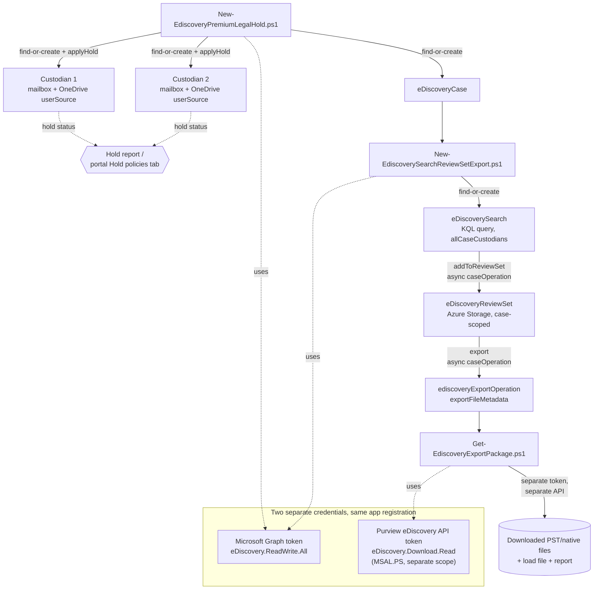

## 1. Scenario summary

Builds a Microsoft Purview eDiscovery (Premium) case end to end: create the case, add custodians
and place a legal hold on their Exchange mailboxes and OneDrive sites, run a scoped search,
commit the results to a review set, and export a production package for outside counsel — all
via app-only Microsoft Graph automation, with a portal walkthrough alongside each scripted step.

**Who it's for:** a legal/compliance team (or an MSSP acting on their behalf) that needs a
repeatable, auditable way to stand up litigation holds and productions across many matters,
instead of hand-clicking through the Purview portal for every new case — while keeping every
irreversible action (releasing a hold, closing or deleting a case) as a deliberate, separately
gated step.

## 2. Business/regulatory driver

A legal hold obligation arises the moment litigation is reasonably anticipated — under the
U.S. Federal Rules of Civil Procedure (FRCP Rule 37(e)) and the common-law duty to preserve
recognized across most jurisdictions, failing to suspend routine deletion of potentially relevant
electronically stored information (ESI) once that duty attaches can result in spoliation
sanctions, adverse-inference instructions, or an adverse judgment. Regulatory investigations
(SEC, FTC, DOJ civil investigative demands) and internal investigations (HR, whistleblower,
audit-committee referrals) carry the same preservation obligation even before a lawsuit is filed.

eDiscovery (Premium) is Microsoft's purpose-built control for this obligation inside Microsoft
365: it lets a legal team place a preservation hold on specific custodians' content the moment a
matter opens, independent of whatever retention/deletion policies would otherwise apply to that
content [[1]](#references), and produces a documented chain from hold → collection → review →
export that supports a defensible preservation and production narrative. This scenario is the
technical control a legal/compliance team stands up the moment a matter is opened — not a
one-time configuration, but a repeatable pattern run once per matter.

## 3. Prerequisites

Full licensing and role detail: `docs/licensing-matrix.md` and `docs/rbac-model.md`. Summary for
this scenario:

| Requirement | Minimum | Notes |
|---|---|---|
| eDiscovery (Premium) features | **Microsoft 365 / Office 365 E5**, **Microsoft Purview Suite**, or the **Microsoft 365 E5 eDiscovery and Audit** add-on, for both the custodians being held **and** the administrator running searches/review sets/analytics | E3 alone gives eDiscovery (Standard) — cases, holds, search, export — but not custodian management, review sets, tagging, or analytics [[2]](#references)[[13]](#references) |
| Premium features enabled for new cases | Tenant-level **eDiscovery (Premium)** toggle under **Settings → eDiscovery → General**, and confirm it's on for this specific case under **Case settings** | Enabled by default for tenants with premium access, but can be turned off per case after creation — verify before running the deploy scripts against a case created by someone else [[3]](#references)[[4]](#references) |
| Role to author cases/custodians/holds via Graph app-only | **eDiscovery Manager** role group (least-privileged; scoped to cases the app-registration service principal is a member of) or **eDiscovery Administrator** (org-wide case visibility) | See `docs/rbac-model.md` §4. The **Custodian** role (data-source management) is only available to eDiscovery Manager members [[5]](#references) |
| Automation identity (case/custodian/search/review-set/export authoring) | Entra app registration, certificate-based app-only auth, granted **`eDiscovery.ReadWrite.All`** application permission and registered as an eDiscovery Manager (or Administrator) service principal | **App-only auth for eDiscovery cmdlets in Security & Compliance PowerShell is explicitly unsupported by Microsoft** — this is the one Purview module where Graph, not S&C PowerShell, is the only supported app-only path. See §5 and `docs/automation-surface.md` §3 [[6]](#references)[[7]](#references) |
| Automation identity (export **package download**) | The same app registration additionally granted **`eDiscovery.Download.Read`** application permission against the first-party **MicrosoftPurviewEDiscovery** service principal | A *separate* API from Graph, with its own token and its own permission grant — see §5 step 6 and `deploy/Get-EdiscoveryExportPackage.ps1` [[8]](#references) |
| Licensing on every held custodian | E3/E5 (Standard hold rights) plus, for the hold capabilities this scenario uses (custodian-scoped hold via Graph), E5-tier or the eDiscovery & Audit add-on. **Frontline (F1/F3) users cannot be the target of a hold.** | Confirm before adding a custodian — an unlicensed target isn't a supported configuration, not merely a soft warning [[9]](#references) |
| Shared mailbox custodians (if any) | **Exchange Online Plan 2**, or **Plan 1 + Exchange Online Archiving add-on** | Same licensing rule as placing a hold directly in Exchange [[13]](#references) |
| Dependency (not deployed by this scenario) | The matter's outside-counsel engagement, a defined preservation date range, and a keyword/date scope agreed with counsel | Drives `deploy/policy/ediscovery-case-definition.json`'s `search.contentQuery` — this scenario doesn't decide what to preserve/collect, it executes what legal has already scoped |
| **Gating prerequisite for any hold release (`Remove-EdiscoveryPremiumLegalHold.ps1`)** | Written confirmation from counsel that the preservation duty for the affected custodian(s)/matter has actually lapsed | Releasing a hold before the duty ends can itself be a spoliation event — this is a legal determination no script in this scenario can make; see `rollback.md` |

> Verify current entitlement names against `docs/licensing-matrix.md` and the Product Terms
> before a sales commitment — SKU names change.

## 4. Architecture



All authoring (case, custodian, userSource, hold, search, review set, export *request*) goes
through Microsoft Graph, `microsoft.graph.security` namespace — the only supported app-only path
for eDiscovery (Premium) automation. Downloading the resulting export **package** goes through a
second, separate Microsoft Purview eDiscovery API with its own token, per Microsoft's documented
two-API design (§5, `deploy/Get-EdiscoveryExportPackage.ps1`). `addToReviewSet` and `export` are
both long-running, asynchronous `caseOperation`s — the deploy scripts poll them rather than
assuming synchronous completion, per `docs/automation-surface.md` §5.

## 5. Step-by-step implementation

### Portal path (for a first manual walkthrough / to validate intent before scripting)

1. **Confirm Premium is available**: Purview portal → **Settings** → **eDiscovery** →
   **General** → confirm the **eDiscovery (Premium)** toggle is on for new cases [[4]](#references).
2. **Create the case**: eDiscovery solution card → **Cases** → **Create case** → name and
   description → **Create**. On **Case settings**, confirm the **Premium features** toggle for
   this specific case is on [[3]](#references).
3. **Add custodians**: in the case, **Data sources** (or the **Custodians** tab) → **Add
   custodian** → enter the SMTP address → confirm **mailbox** and **OneDrive** as included
   sources → **Place custodian on hold** [[10]](#references).
4. **Create a search**: **Searches** tab → **New search** → scope to **All case custodians** →
   enter the KQL query agreed with counsel → **Run query**, then **View estimated statistics**
   before collecting.
5. **Add to a review set**: from the search, **Add to review set** → **new review set**, name
   it, choose **Add all search results** (or configure sampling) [[11]](#references).
6. **Register the download API app** (one-time, per tenant, before your first export
   download): register/confirm the **MicrosoftPurviewEDiscovery** first-party service principal
   exists (`New-MgServicePrincipal -BodyParameter @{ AppId = 'b26e684c-5068-4120-a679-64a5d2c909d9' }`
   if not already present), then on your automation app registration → **API permissions** →
   **Add a permission** → **APIs my organization uses** → **MicrosoftPurviewEDiscovery** →
   **Application permissions** → **`eDiscovery.Download.Read`** → **Grant admin consent**
   [[8]](#references).
7. **Export**: in the review set, **Action** → **Export** → name the export, choose export
   options (original files, tags) and structure (PST) → **Export**. Track progress under
   **Process manager**; retrieve the download link from the export's **Copy support information**
   or via the Graph operation as in §6 below [[11]](#references)[[12]](#references).

### Script path (idempotent, parameterized, dry-run capable)

```powershell
# 1. Connect (app-only, certificate — see docs/automation-surface.md §3). All three deploy
#    scripts below share this connection if you Connect-MgGraph once first, or connect
#    per-invocation using the -AppId/-TenantId/-CertificateThumbprint parameters shown.

# 2. Dry run — reports every case/custodian/hold action this run would take, makes none.
./deploy/New-EdiscoveryPremiumLegalHold.ps1 `
    -DefinitionPath ./deploy/policy/ediscovery-case-definition.json `
    -AppId $AppId -TenantId $TenantId -CertificateThumbprint $Thumbprint -WhatIf

# 3. Create the case, add custodians, apply hold.
./deploy/New-EdiscoveryPremiumLegalHold.ps1 `
    -DefinitionPath ./deploy/policy/ediscovery-case-definition.json `
    -AppId $AppId -TenantId $TenantId -CertificateThumbprint $Thumbprint
# Note the case id printed at the end (or look it up via
# Get-MgSecurityCaseEdiscoveryCase | Where-Object DisplayName -eq '<name>').

# 4. Search, commit to review set, export. Stop short of export with -SkipExport to let a
#    reviewer tag/cull first.
./deploy/New-EdiscoverySearchReviewSetExport.ps1 `
    -DefinitionPath ./deploy/policy/ediscovery-case-definition.json `
    -CaseId $caseId `
    -AppId $AppId -TenantId $TenantId -CertificateThumbprint $Thumbprint

# 5. Download the export package (requires the eDiscovery.Download.Read permission from §5
#    step 6, above).
./deploy/Get-EdiscoveryExportPackage.ps1 `
    -CaseId $caseId -ExportOperationId $exportOpId `
    -OutputDirectory ./exports/CONTOSO-LIT-2026-014-export1 `
    -AppId $AppId -TenantId $TenantId -CertificateThumbprint $Thumbprint

# 6. Validate.
./validate/Test-EdiscoveryPremiumCaseSetup.ps1 `
    -DefinitionPath ./deploy/policy/ediscovery-case-definition.json `
    -CaseId $caseId -AppId $AppId -TenantId $TenantId -CertificateThumbprint $Thumbprint

# 7. Audit trail (independent of the Graph objects above; run on a recurring schedule per Section 8
#    "Audit visibility" — Exchange Online PowerShell, not Graph, so connect separately).
Connect-ExchangeOnline -AppId $AppId -Certificate $Cert -Organization $TenantDomain
./deploy/Export-EdiscoveryAuditTrail.ps1 `
    -CaseName 'CONTOSO-LIT-2026-014' -OutputCsvPath ./deploy/out/edisc-audit-trail.csv
./validate/Test-EdiscoveryAuditTrail.ps1 -AuditTrailCsvPath ./deploy/out/edisc-audit-trail.csv
```

All three deploy scripts use Microsoft Graph (`Microsoft.Graph.Security` module,
`microsoft.graph.security` namespace) — automation surface 3 per `docs/automation-surface.md` §1,
because app-only authentication for eDiscovery cmdlets in Security & Compliance PowerShell is
explicitly unsupported [[6]](#references). The download script additionally uses a separate,
non-Graph Purview eDiscovery API authenticated via `MSAL.PS`, per Microsoft's documented two-API
design [[8]](#references).

## 6. Configuration reference

| Object | Cmdlet | Key fields (from `deploy/policy/ediscovery-case-definition.json`) |
|---|---|---|
| Case | `New-MgSecurityCaseEdiscoveryCase` | `displayName`, `description`, `externalId` |
| Custodian | `New-MgSecurityCaseEdiscoveryCaseCustodian` | `email` |
| Custodian userSource | `New-MgSecurityCaseEdiscoveryCaseCustodianUserSource` | `email`, `includedSources = 'mailbox, site'` |
| Hold | `Add-MgSecurityCaseEdiscoveryCaseCustodianHold` | (no body — targets one custodian per call) |
| Search | `New-MgSecurityCaseEdiscoveryCaseSearch` | `displayName`, `contentQuery` (KQL), `dataSourceScopes = 'allCaseCustodians'` |
| Review set | `New-MgSecurityCaseEdiscoveryCaseReviewSet` | `displayName` |
| Add to review set | `Add-MgSecurityCaseEdiscoveryCaseReviewSetToReviewSet` | `search.id`, `itemsToInclude = 'searchHits'`, `additionalDataOptions = 'linkedFiles'` |
| Export | `Export-MgSecurityCaseEdiscoveryCaseReviewSet` | `outputName`, `exportOptions = 'originalFiles,tags'`, `exportStructure = 'pst'` |
| Release hold | `Invoke-MgGraphRequest POST .../custodians/{id}/release` | — |
| Close/delete case | `Update-MgSecurityCaseEdiscoveryCase -Status closed`, `Remove-MgSecurityCaseEdiscoveryCase` | — |
| Audit trail (read-only) | `Search-UnifiedAuditLog -RecordType Discovery -Operations ...` | `CaseAdded`/`CaseUpdated`/`CaseClosed`/`CaseReopened`/`CaseRemoved`; `HoldCreated`/`HoldUpdated`/`HoldRemoved`/`HoldRetryDistributionSync` — see §8 and `deploy/Export-EdiscoveryAuditTrail.ps1` |

`caseOperationStatus` values used by the poll loops in both `New-Ediscovery*.ps1` scripts:
`notStarted`, `submissionFailed`, `running`, `succeeded`, `partiallySucceeded`, `failed`,
`unknownFutureValue` — the exact v1.0 enum, not carried over from beta [[14]](#references).

Full parameter grounding: each script's `.NOTES` block cites the exact Microsoft Learn REST/
PowerShell reference page for every cmdlet it calls.

## 7. Validation / how to prove it works

1. **Automated check** — `./validate/Test-EdiscoveryPremiumCaseSetup.ps1 -DefinitionPath ...
   -CaseId $caseId ...` confirms the case, every custodian's hold status, userSources, the
   search, and the review set; exits non-zero on any hard failure (safe for a CI-style
   pre-flight or a scheduled drift check).
2. **Hold propagation** — a freshly applied hold can take up to 24 hours to take effect
   [[10]](#references); the validate script reports a not-yet-`success` `HoldStatus` as `WARN`,
   not `FAIL`, in that window. Re-run after 24 hours and expect `PASS`.
3. **Functional proof (portal)** — open the case's **Hold policies** (or, if the tenant has the
   preview **hold report** enabled, **Settings → eDiscovery → Hold report**) and confirm the
   custodian's mailbox and OneDrive site show as **On** with no location errors
   [[15]](#references).
4. **Search accuracy** — before collecting into a review set, run **View estimated statistics**
   on the search (portal, or the `estimateStatistics` operation) and sanity-check the hit count
   against what counsel expects for the date range/keywords — an estimate near zero usually means
   a scoping mistake (wrong custodian, wrong date syntax), not an empty mailbox.
5. **Export completeness** — after `Get-EdiscoveryExportPackage.ps1` finishes, confirm the
   downloaded file count and combined size match the `exportFileMetadata` entries the operation
   reported, and open the summary/load file the export always includes alongside the content
   files [[16]](#references).

## 8. Operations & tuning

**KPIs to watch:**
- **Custodian `HoldStatus`** — track for every custodian in every open matter; a status that
  regresses from `success` to anything else after the initial propagation window is a signal
  something (a mailbox move, a license change, a manual portal edit) disrupted the hold — treat
  it as an incident, not routine drift, given the spoliation exposure in §2.
- **Export age vs. the 30-day download window** — `validate/Test-EdiscoveryPremiumCaseSetup.ps1`
  flags an export older than 30 days as `WARN` (content is very likely no longer downloadable by
  then) [[17]](#references). Download every export you intend to keep well before that window
  closes; there is no automatic renewal.
- **Case/hold-policy counts against tenant limits** — 20,000 hold policies tenant-wide, 200 per
  Premium case, 2,000 mailboxes and 2,000 sites per case hold [[18]](#references). A high-volume
  MSSP/legal-ops practice running many concurrent matters should watch these, not just per-case
  health.
- **PAYG export storage cost** (if the tenant has activated Purview's pay-as-you-go billing) —
  Export API usage is billed by exported data volume; case/search/hold operations themselves are
  not billed [[19]](#references). See §10.

**Review cadence:** re-run `validate/Test-EdiscoveryPremiumCaseSetup.ps1` on every case with an
active hold at least weekly for the life of the matter — a released hold that should still be
active is a preservation failure, not a cosmetic drift.

**Audit visibility for hold-apply/hold-release/case-close/case-delete actions:** none of this
scenario's own objects retain a full history of *who* released a hold or closed/deleted a case
beyond the single `lastModifiedBy`/`closedBy` snapshot on the case itself — an actor with
eDiscovery Administrator access who quietly releases a custodian's hold and later re-applies it
leaves no trace in the objects this scenario's scripts read. `deploy/Export-EdiscoveryAuditTrail.ps1`
routes around this by pulling case-lifecycle events (`CaseAdded`/`CaseUpdated`/`CaseClosed`/
`CaseReopened`/`CaseRemoved`) and hold-policy-lifecycle events (`HoldCreated`/`HoldUpdated`/
`HoldRemoved`/`HoldRetryDistributionSync`) from the Microsoft 365 unified audit log
(`Search-UnifiedAuditLog`, automation surface 1, `RecordType Discovery`) into a rolling,
de-duplicated CSV — the same pattern this library's other no-independent-audit-trail scenarios use
([`compliance-manager/assess-against-iso27001`](/scenarios/compliance-manager/assess-against-iso27001/),
[`communication-compliance/harassment-and-code-of-conduct`](/scenarios/communication-compliance/harassment-and-code-of-conduct/)), both `Operation` sets
confirmed verbatim against Microsoft's own "Audit log activities" eDiscovery reference rather than
guessed by analogy [[25]](#references). **One real gap remains, disclosed rather than papered
over:** those four hold-policy `Operation` values are documented against the case-level
`ediscoveryHoldPolicy` object (the "Hold policies" tab, and this repo's sibling
[`ediscovery/location-scoped-legal-hold`](/scenarios/ediscovery/location-scoped-legal-hold/) scenario) — whether they also fire for *this*
scenario's own custodian-scoped `ediscoveryCustodian: applyHold`/`release` calls is not confirmed
for the current, non-legacy eDiscovery experience; the one Microsoft Learn page describing
per-custodian audit search carries a caution banner limiting it to organizations hosted by
21Vianet (China) after the classic experience's August 2025 retirement everywhere else
[[26]](#references)[[27]](#references). See the script's own `.DESCRIPTION`/`.NOTES` for the full
reasoning and the pilot-tenant VERIFY step tracked in `PROGRESS.md`. Until that VERIFY closes,
treat a `HoldPolicyLifecycle` row in this scenario's audit trail as strong evidence *some*
eDiscovery hold changed, and cross-check its `CaseName`/`ObjectName` columns against this case
before assuming it's this scenario's own custodian hold rather than an unrelated
`ediscoveryHoldPolicy` action in a different matter. Run it weekly alongside
`validate/Test-EdiscoveryPremiumCaseSetup.ps1` per this section's Review cadence, and pair it with
the case's own `Get-MgSecurityCaseEdiscoveryCase`/`Get-MgSecurityCaseEdiscoveryCaseCustodian`
snapshots for the point-in-time status those scripts already report.

**Operational dependency this scenario does not close:** whether the *right* custodians were
identified for a given matter is a legal-judgment call this scenario's automation cannot make —
it only guarantees that whichever custodians are listed in `deploy/policy/
ediscovery-case-definition.json` are reliably placed on hold. Getting the custodian list right is
outside code's ability to verify.

## 9. Rollback / decommission

See `rollback.md` for the full staged procedure (release hold → close case → delete case). Quick
reference: `./deploy/Remove-EdiscoveryPremiumLegalHold.ps1 -CaseId $caseId` releases every
custodian currently on hold; add `-CloseCase` or `-DeleteCase` for the progressively more
destructive stages, each requiring an explicit switch.

## 10. Cost & licensing notes

- **No PAYG component for hold/search/case management.** Creating cases, custodians, holds, and
  searches — and running `estimateStatistics` — is included in the qualifying E5/Suite/add-on
  license; only the **Export API's data volume** is metered under Purview's pay-as-you-go billing
  model, if activated [[19]](#references).
- **Licensing is per-custodian, not per-case.** A custodian who is a member of five concurrent
  matters needs the qualifying license once, not five times — but every distinct individual
  placed on hold anywhere in the tenant needs it.
- **Sizing note:** unlike the DLP/DSPM scenarios in this library (which typically license a broad
  population), eDiscovery (Premium) licensing tracks *litigation exposure*, not headcount — budget
  for the population of employees realistically likely to become custodians (executives, the
  function most often named in disputes, departing-employee cohorts), not the whole org.

## 11. Known limitations & gotchas

- **This scenario's Graph app-only path cannot author `eDiscoveryHoldPolicy` (the case-level
  "legal hold" object with `siteSources`/`userSources` and an optional `contentQuery`) — only
  custodian-scoped holds via `applyHold`.** Both mechanisms exist in the v1.0 API and both are
  called "legal hold" in Microsoft's own documentation, which can be confusing when reading
  Microsoft Learn: `ediscoveryHoldPolicy` (`POST .../legalHolds`) is better suited to a
  location-scoped hold not necessarily tied to a named "custodian" (for example, holding a
  distribution-list-derived set of mailboxes for a regulatory sweep), while this scenario's
  custodian+`applyHold` pattern is the natural fit when the matter is organized around named
  individuals — the more common litigation-hold shape. A future companion scenario could cover
  the `ediscoveryHoldPolicy` path for the location-scoped case (tracked in `PROGRESS.md`).
- **Hold propagation can take up to 24 hours** — don't treat a non-`success` `HoldStatus`
  immediately after `applyHold` as a failure [[10]](#references).
- **Export packages must be downloaded within 30 days of the export completing**, even though the
  export *operation record* is retained for the life of the case [[17]](#references). There is no
  documented way to extend this window — re-run the export if it lapses.
- **The `addToReviewSet`/export idempotency checks in `New-EdiscoverySearchReviewSetExport.ps1`
  match on operation type + `outputName`/"any succeeded addToReviewSet in this case," not an
  exact per-search/per-review-set key** — Microsoft's API doesn't expose a documented "does an
  equivalent operation already exist" filter. Keep definition-file display names stable across
  re-runs of the same matter's collection; see the script's own `.NOTES`.
- **VERIFY (pilot tenant, before production reliance):** whether a custodian's `userSource`
  `includedSources` value must be the exact string `"mailbox, site"` (as shown in Microsoft's own
  worked beta example) or whether the v1.0 endpoint expects a JSON array / different delimiter —
  the v1.0 REST reference for this specific endpoint documents the *possible values* (`mailbox`,
  `site`) but its own worked example for `POST .../custodians/{id}/userSources` only shows a
  single value (`"mailbox"`), not the combined form. `New-EdiscoveryPremiumLegalHold.ps1` uses the
  combined-string form by analogy with the (deprecated, beta-namespace) sibling endpoint's worked
  example rather than fabricating a JSON-array shape neither reference confirms.
- **A custodian's `userSource` (mailbox + OneDrive) does not automatically cover Microsoft Teams
  *channel* messages.** Teams 1:1/group chat is stored in the custodian's own mailbox and is
  covered by the mailbox `userSource`, but channel messages live in the team's own mailbox/site,
  not the individual custodian's — a matter where team/channel conversations are in scope needs
  the relevant team added as a **non-custodial data source**
  (`New-MgSecurityCaseEdiscoveryCaseNoncustodialDataSource`, out of scope for this fragment) in
  addition to the custodians this scenario holds, not instead of them.
- **Legal hold custodian communications (the Premium "Communications" tab — initial notice,
  reminders, escalations, acknowledgment tracking) was permanently retired by Microsoft on
  August 31, 2025 and is not available in the current eDiscovery experience** — confirmed directly
  against Microsoft's own current (non-legacy) "Manage hold notifications" page, which states this
  in an `Important` callout rather than the classic-experience/21Vianet-China-only caution banner
  this build initially expected to find [[28]](#references). A prior pass tracked "add a
  legal-hold-notifications companion scenario" as a follow-up in `PROGRESS.md`, assuming the gap
  was simply "no Graph write API for an otherwise-current portal feature" (the same shape as
  several other no-write-API Purview surfaces this library documents). It wasn't that: the feature
  itself no longer exists to automate or walk through, in either direction. Two consequences worth
  being explicit about, since a defensible preservation narrative in many jurisdictions still
  expects a documented custodian notification alongside the technical hold:
  - **There is currently no in-product way to formally notify a custodian of a hold, or to track
    their acknowledgment, inside Microsoft Purview eDiscovery (Premium).** Do not point a customer
    at the "Create a legal hold notice" / "Work with communications" Microsoft Learn articles as
    current guidance — both carry the classic-experience/21Vianet-China-only banner and describe a
    retired workflow. Treat legal hold notice delivery and acknowledgment tracking as an
    **external, non-Purview process** (e.g., a counsel-managed email + read-receipt or e-signature
    tool, tracked in a matter-management or case-file system) until Microsoft ships a
    current-experience replacement — the Microsoft 365 Roadmap is the place to watch for one, not
    a promise this scenario can make.
  - **The `ediscoveryCustodian` object's `acknowledgedDateTime` and `releasedDateTime` properties
    (Graph v1.0, `microsoft.graph.security` namespace — still a live, current-experience surface,
    unrelated to the retired Communications tab) are worth monitoring only as a residual signal,
    not relied on as primary evidence.** With no in-product way left to send a notice, there is no
    confirmed mechanism populating `acknowledgedDateTime` for a custodian in a current-experience
    case — a persistently-null value across every custodian in a tenant is the expected state now,
    not a sign of an unacknowledged hold. `validate/Test-EdiscoveryPremiumCaseSetup.ps1` does not
    check this field for exactly this reason.
- **Attorney-client privilege detection, near-duplicate/theme analytics, and predictive coding**
  are Premium review-set capabilities this scenario doesn't configure or exercise — it stops at
  "collect, commit to review set, export," which is sufficient for many straightforward matters
  but not a substitute for the analytics workflow a large-scale review would use.
- **Closing or deleting a case turns off every hold in it**, including custodians this scenario
  didn't add — `Remove-EdiscoveryPremiumLegalHold.ps1` warns before `-CloseCase`/`-DeleteCase`,
  but the responsibility to confirm every custodian's hold should actually end is the operator's,
  not the script's [[20]](#references).

## 12. References

1. Create holds in eDiscovery (preserve independent of retention policies, up to 24-hour propagation) — <https://learn.microsoft.com/purview/edisc-hold-create>
2. eDiscovery subscription comparison (Standard vs. Premium capability table) — <https://learn.microsoft.com/purview/ediscovery#comparison-of-key-capabilities>
3. Learn about case settings in eDiscovery (per-case Premium features toggle) — <https://learn.microsoft.com/purview/edisc-settings-cases>
4. Configure general settings in eDiscovery (tenant-level Premium default toggle) — <https://learn.microsoft.com/purview/edisc-settings-general>
5. Assign permissions in eDiscovery (eDiscovery Manager/Administrator, Custodian role) — <https://learn.microsoft.com/purview/edisc-permissions>
6. Assign permissions in eDiscovery — app-only auth for S&C PowerShell eDiscovery cmdlets is unsupported — <https://learn.microsoft.com/purview/edisc-permissions#configure-app-only-authentication-for-ediscovery-powershell>
7. Set up app-only access for Microsoft Purview eDiscovery (Graph app-only setup, step by step) — <https://learn.microsoft.com/graph/security-ediscovery-appauthsetup>
8. Use Microsoft Purview APIs for eDiscovery (two-API design, MicrosoftPurviewEDiscovery app registration, `eDiscovery.Download.Read`, MSAL.PS download scripts) — <https://learn.microsoft.com/purview/edisc-ref-api-guide>
9. Create holds in eDiscovery (licensing requirement on every held user, Frontline exclusion) — <https://learn.microsoft.com/purview/edisc-hold-create>
10. Create holds in eDiscovery (custodian mailbox/OneDrive/Teams/Groups hold scope, 24-hour propagation) — <https://learn.microsoft.com/purview/edisc-hold-create>
11. Add search results to a review set in eDiscovery — <https://learn.microsoft.com/purview/edisc-search-add-to-review-set>
12. Export items from a review set in eDiscovery (portal export flow, Process manager) — <https://learn.microsoft.com/purview/edisc-review-set-export>
13. Microsoft Purview service description — eDiscovery licensing, shared-mailbox hold licensing parity with Exchange — <https://learn.microsoft.com/office365/servicedescriptions/microsoft-365-service-descriptions/microsoft-365-tenantlevel-services-licensing-guidance/microsoft-purview-service-description#microsoft-purview-ediscovery>
14. caseOperation resource type (v1.0 `caseOperationStatus` enum) — <https://learn.microsoft.com/graph/api/resources/security-caseoperation?view=graph-rest-1.0>
15. Use the hold report (preview) in eDiscovery — <https://learn.microsoft.com/purview/edisc-hold-report>
16. Export items from a review set in eDiscovery (summary/load file always included) — <https://learn.microsoft.com/purview/edisc-review-set-export>
17. Export items from a review set in eDiscovery (30-day download window, life-of-case retention of the operation record) — <https://learn.microsoft.com/purview/edisc-review-set-export>
18. Limits in eDiscovery (hold policy and per-case mailbox/site limits) — <https://learn.microsoft.com/purview/edisc-ref-limits>
19. Billing in eDiscovery (Graph API usage billing — only Export API is metered) — <https://learn.microsoft.com/purview/edisc-billing>
20. Create and manage cases in eDiscovery (closing/deleting a case turns off all its holds) — <https://learn.microsoft.com/purview/edisc-cases-manage>
21. ediscoveryCase resource type (v1.0 `caseStatus` enum: active/closing/closed/closedWithError) — <https://learn.microsoft.com/graph/api/resources/security-ediscoverycase?view=graph-rest-1.0>
22. ediscoveryCustodian resource type (Apply hold / Release / Activate methods) — <https://learn.microsoft.com/graph/api/resources/security-ediscoverycustodian?view=graph-rest-1.0>
23. Create custodian userSource (v1.0 REST reference, `includedSources` values) — <https://learn.microsoft.com/graph/api/security-ediscoverycustodian-post-usersources?view=graph-rest-1.0>
24. Use the Microsoft Purview eDiscovery API (v1.0 object/cmdlet overview) — <https://learn.microsoft.com/graph/api/resources/security-ediscovery-apioverview?view=graph-rest-1.0>
25. Audit log activities — eDiscovery activity reference (the exact `Operation` names/descriptions `deploy/Export-EdiscoveryAuditTrail.ps1`'s two query categories are built from verbatim) — <https://learn.microsoft.com/purview/audit-log-activities#ediscovery-activities>
26. Manage holds in eDiscovery (Premium) — the "custodian hold policy" claim; carries Microsoft's classic-eDiscovery-experience/21Vianet-China-only caution banner — <https://learn.microsoft.com/purview/ediscovery-managing-holds>
27. View custodian audit activity — the one per-custodian audit UI Microsoft documents; also carries the classic-experience/21Vianet-China-only caution banner — <https://learn.microsoft.com/purview/ediscovery-view-custodian-activity>
28. Manage hold notifications (current, non-legacy page — the `Important` callout stating legal hold custodian communications were permanently retired August 31, 2025 and aren't available in the new eDiscovery experience) — <https://learn.microsoft.com/purview/ediscovery-manage-hold-notifications>

> Re-verify all links against current Microsoft Learn before a customer-facing deployment —
> Purview's Graph eDiscovery surface has moved from the `microsoft.graph.ediscovery` namespace to
> `microsoft.graph.security` within the product's own history, and beta-to-v1.0 promotions can
> change property/enum shapes without notice.
