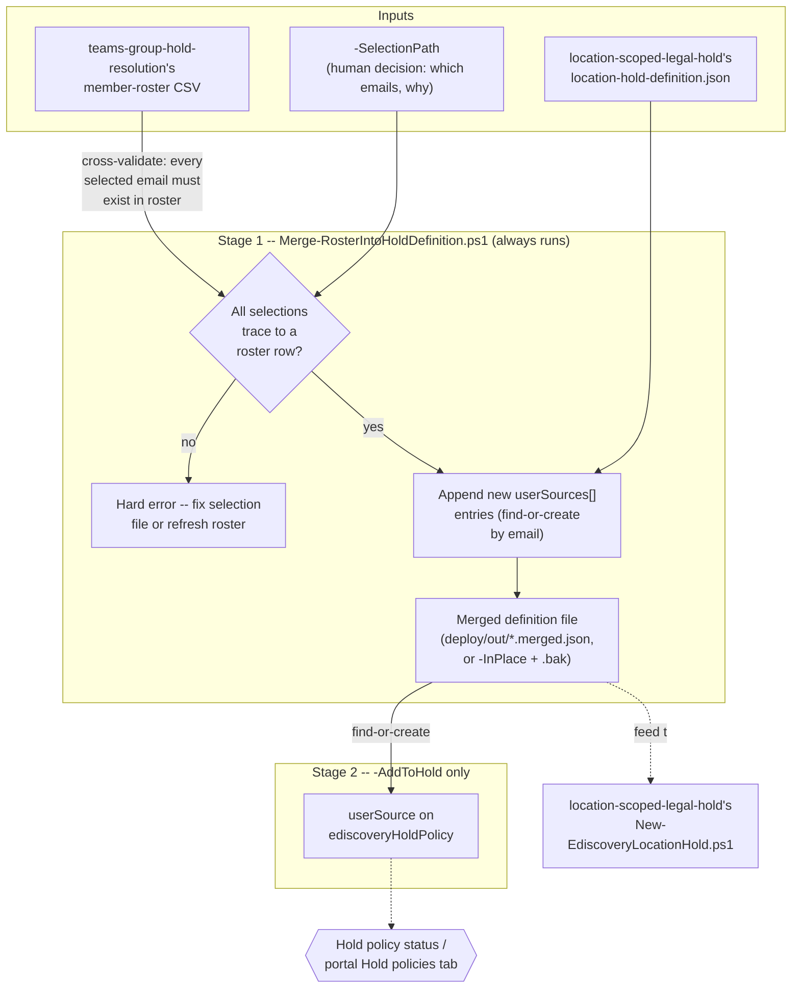

## 1. Scenario summary

Merges a human-selected subset of a Microsoft Teams / Microsoft 365 Group member roster —
produced by [`ediscovery/teams-group-hold-resolution`](/scenarios/ediscovery/teams-group-hold-resolution/)'s `-ResolveMembers` roster CSV —
into [`ediscovery/location-scoped-legal-hold`](/scenarios/ediscovery/location-scoped-legal-hold/)'s `location-hold-definition.json` shape as
new `userSources[]` entries, and optionally reconciles them directly onto an existing hold policy.

**Who it's for:** the same legal/compliance operator running the other two eDiscovery scenarios in
this repo, at the specific moment a matter's counsel decides that placing a Team/group's own
mailbox and site on hold isn't enough — one or more *named individuals* within that group also need
their own mailbox preserved. This scenario is the last-mile translation step between "counsel named
these two people" and "here are the exact `userSources[]` entries to add," closing the hand-off
`teams-group-hold-resolution/design.md` §7 explicitly deferred rather than folded into either
sibling scenario.

## 2. Business/regulatory driver

Identical underlying preservation duty to `location-scoped-legal-hold/README.md` §2 and
`teams-group-hold-resolution/README.md` §2. What's specific here is a common refinement in a
regulatory inquiry or internal sweep: a matter starts out scoped to a Team ("preserve the Payments
Team"), and then narrows — outside counsel or an internal investigator identifies specific
individuals within that group as direct subjects, requiring their mailboxes preserved
*individually*, not just as part of the group mailbox's aggregate content. Doing this by hand means
someone copy-pastes SMTP addresses out of a roster export into a JSON file under time pressure — a
manual step with real spoliation exposure if an address is mistyped or a selected person is quietly
dropped. This fragment makes that translation a single auditable script run instead.

## 3. Prerequisites

Full licensing and role detail: `docs/licensing-matrix.md` and `docs/rbac-model.md`. This
scenario's requirements are the union of its two inputs' own prerequisites — it introduces no new
licensing or role beyond what building the roster and the hold definition already require.

| Requirement | Minimum | Notes |
|---|---|---|
| A roster CSV already produced | `teams-group-hold-resolution/deploy/Resolve-TeamsGroupHoldLocations.ps1 -ResolveMembers` run beforehand | This scenario never calls `Get-UnifiedGroup`/`Get-UnifiedGroupLinks` itself — it only reads that script's CSV output. No Exchange Online PowerShell connection is required to run this scenario's own scripts. |
| A definition file to merge into | Any file matching `location-scoped-legal-hold/deploy/policy/location-hold-definition.json`'s shape | Typically that scenario's own tracked sample, or a matter-specific copy of it |
| eDiscovery Premium licensing + eDiscovery Manager/Administrator RBAC | Only for the optional `-AddToHold` path | Identical requirement to both sibling scenarios' own `-AddToHold`/deploy paths — see `location-scoped-legal-hold/README.md` §3 |
| Microsoft Graph app-only auth (surface 3) | Only for `-AddToHold` | Same shape as both sibling scenarios: `-AppId`/`-TenantId`/`-CertificateThumbprint` or `-Certificate` |

> Verify current entitlement names against `docs/licensing-matrix.md` and the Product Terms before
> a sales commitment — SKU names change.

## 4. Architecture



Stage 1 is pure file manipulation — no Exchange Online or Graph connection required. Stage 2
(`-AddToHold` only) reuses `location-scoped-legal-hold`'s and `teams-group-hold-resolution`'s own
Graph v1.0 `ediscoveryHoldPolicy` `userSources` REST calls (surface 3), duplicated rather than
dot-sourced per this repo's self-contained-deploy-tree convention (`design.md` §5).

## 5. Step-by-step implementation

### Portal path (for a first manual walkthrough / to validate intent before scripting)

There is no dedicated portal equivalent for this specific hand-off — the portal's own **Create a
hold** → **Manage data sources** flow lets an operator add an individual custodian's mailbox
directly by typing their name/address [[1]](#references), which is exactly what this script
automates from a roster + selection file instead of manual entry. Use the portal path for a single
one-off addition; use this script when the addition needs to be reproducible, auditable (the
`-SelectionPath` `reason` field), or applied consistently across more than one matter.

### Script path (idempotent, parameterized, dry-run capable)

```powershell
# 1. Produce the roster (if not already done -- see teams-group-hold-resolution).
Connect-ExchangeOnline -AppId $AppId -CertificateThumbprint $Thumbprint -Organization $TenantDomain
../teams-group-hold-resolution/deploy/Resolve-TeamsGroupHoldLocations.ps1 `
    -DefinitionPath ../teams-group-hold-resolution/deploy/config/teams-group-hold-resolution.sample.json `
    -ResolveMembers

# 2. Author the selection file recording which roster members counsel identified, and why
#    (see deploy/config/roster-selection.sample.json).

# 3. Dry-run the merge -- reports what would change, writes nothing.
./deploy/Merge-RosterIntoHoldDefinition.ps1 `
    -RosterPath ../teams-group-hold-resolution/deploy/out/teams-group-hold-members.roster.csv `
    -SelectionPath ./deploy/config/roster-selection.sample.json `
    -DefinitionPath ../location-scoped-legal-hold/deploy/policy/location-hold-definition.json `
    -WhatIf

# 4. Merge for real -- writes deploy/out/location-hold-definition.merged.json (gitignored).
./deploy/Merge-RosterIntoHoldDefinition.ps1 `
    -RosterPath ../teams-group-hold-resolution/deploy/out/teams-group-hold-members.roster.csv `
    -SelectionPath ./deploy/config/roster-selection.sample.json `
    -DefinitionPath ../location-scoped-legal-hold/deploy/policy/location-hold-definition.json

# 5a. Feed the merged file into location-scoped-legal-hold's own deploy script -- OR --
../location-scoped-legal-hold/deploy/New-EdiscoveryLocationHold.ps1 `
    -DefinitionPath ./deploy/out/location-hold-definition.merged.json `
    -AppId $AppId -TenantId $TenantId -CertificateThumbprint $Thumbprint

# 5b. -- or reconcile directly onto an already-existing hold policy in one step:
./deploy/Merge-RosterIntoHoldDefinition.ps1 `
    -RosterPath ../teams-group-hold-resolution/deploy/out/teams-group-hold-members.roster.csv `
    -SelectionPath ./deploy/config/roster-selection.sample.json `
    -DefinitionPath ../location-scoped-legal-hold/deploy/policy/location-hold-definition.json `
    -AddToHold -CaseId $caseId -HoldId $holdId `
    -AppId $AppId -TenantId $TenantId -CertificateThumbprint $Thumbprint -WhatIf
# then re-run without -WhatIf once the plan looks right.

# 6. Validate.
./validate/Test-RosterHoldDefinitionMerge.ps1 `
    -RosterPath ../teams-group-hold-resolution/deploy/out/teams-group-hold-members.roster.csv `
    -SelectionPath ./deploy/config/roster-selection.sample.json `
    -MergedDefinitionPath ./deploy/out/location-hold-definition.merged.json `
    -CaseId $caseId -HoldId $holdId `
    -AppId $AppId -TenantId $TenantId -CertificateThumbprint $Thumbprint
```

## 6. Configuration reference

| Field (`deploy/config/roster-selection.sample.json`) | Meaning |
|---|---|
| `reason` | Free-text record of why these members were selected (matter/counsel decision) — carried into each merged `userSource`'s `note` field for audit purposes |
| `selectedEmails[]` | Exact SMTP addresses to add as individual `userSources[]`. Every entry must exist in `-RosterPath`'s `MemberPrimarySmtpAddress` column — the script throws on any that don't (`design.md` §4) |

| Parameter | Effect |
|---|---|
| `-OutputPath` | Where the merged definition file is written. Defaults to a gitignored `deploy/out/<name>.merged.json` |
| `-InPlace` | Overwrite `-DefinitionPath` directly instead of `-OutputPath`; first writes a `.bak-<yyyyMMddHHmmss>` backup alongside it |
| `-AddToHold` + `-CaseId`/`-HoldId` | Also reconcile newly merged members directly onto a live hold policy (requires Graph auth parameters) |

| Output object | Written by | Shape |
|---|---|---|
| Merged definition file | `Merge-RosterIntoHoldDefinition.ps1` (Stage 1, always) | Same shape as `location-scoped-legal-hold/deploy/policy/location-hold-definition.json`, with new `userSources[]` entries appended: `{ "email": "...", "note": "Individual member of '<Group>' (<Name>) added via roster-to-hold-locations/deploy/Merge-RosterIntoHoldDefinition.ps1. Reason: <reason>" }` |

Graph endpoint used by `-AddToHold` (identical to both sibling scenarios' own — full grounding
there): `POST .../legalHolds/{id}/userSources` [[2]](#references).

## 7. Validation / how to prove it works

1. **Automated check** — `./validate/Test-RosterHoldDefinitionMerge.ps1` confirms every selected
   email still traces to a roster row, appears exactly once in the merged definition file with a
   non-empty audit-trail note, and — with `-CaseId`/`-HoldId` — is present and `applied` on the
   named hold policy. Exits non-zero on any hard failure.
2. **Functional proof (portal)** — after `-AddToHold`, open the case's **Hold policies** tab and
   confirm each newly added individual's mailbox appears as a location with no errors, the same
   proof both sibling scenarios' own §7 describe [[3]](#references).
3. **Audit-trail sanity check** — open the merged definition file directly and confirm each new
   entry's `note` field names the correct source group and reflects the selection file's `reason` —
   this is the artifact a compliance reviewer or outside counsel would actually read to confirm
   *why* a given mailbox was individually preserved.

## 8. Operations & tuning

**KPIs to watch:**
- **A roster/selection pair that has drifted apart** — if `-RosterPath` is re-generated (a group's
  membership changed) after a `-SelectionPath` was authored against an older roster, re-run
  `validate/Test-RosterHoldDefinitionMerge.ps1`'s traceability check before re-running the merge;
  a selected email that no longer appears in a refreshed roster is a signal to confirm with counsel
  whether that person is still relevant, not to silently drop or silently keep them.
- **An `-InPlace` run's `.bak-*` files accumulating** — these are plain local backups with no
  automatic cleanup; prune them like any other local working file once a matter's holds are
  confirmed stable.

**Review cadence:** re-run `validate/Test-RosterHoldDefinitionMerge.ps1` on the same cadence as
`location-scoped-legal-hold`'s own hold-status checks (at least weekly for the life of the matter),
since this scenario's output feeds directly into that hold.

**What this scenario deliberately does not monitor:** current group membership (no live
`Get-UnifiedGroupLinks` re-check — `design.md` §6), and any location type other than a mailbox
`userSource` (no `siteSource`, no OneDrive).

## 9. Rollback / decommission

See `rollback.md`. Quick reference: Stage 1 (the merge itself) has no tenant-side effect — its
output is a plain file; delete it, or restore an `-InPlace` run's `.bak-*` copy, with no further
action. If `-AddToHold` was used, releasing an individually added member's mailbox from the hold is
`location-scoped-legal-hold/deploy/Remove-EdiscoveryLocationHold.ps1 -UserSourceEmail`, not a script
this scenario ships separately — see `rollback.md` for why.

## 10. Cost & licensing notes

No incremental licensing beyond `location-scoped-legal-hold/README.md` §10 — this scenario doesn't
create any new billable object; it only prepares and, optionally, applies `userSources[]` entries
that scenario's own hold policy already accepts. File-merge operations have no cost; `-AddToHold`'s
Graph calls are the same no-PAYG/metered-cost reads/writes both sibling scenarios already document.

## 11. Known limitations & gotchas

- **This script never decides who to select — and never re-validates current membership.** See
  `design.md` §2 and §6. A stale roster or a mistaken selection is a human-process risk this script
  cannot detect on its own; its only defense is the hard-error check that every selected email
  traces to *some* roster row (`design.md` §4), not that the roster itself is current.
- **`-InPlace`'s `.bak-*` backup is local-only.** It protects against this script's own overwrite
  mistake, not against the original tracked file being lost some other way (a bad `git` operation,
  a wiped working directory). Prefer the default `-OutputPath` behavior (never touches
  `-DefinitionPath`) unless there's a specific reason to overwrite in place.
- **Only adds `userSources[]` (mailboxes) — never `siteSources[]` or OneDrive.** See `design.md`
  §6. A matter that also needs an individually named person's OneDrive preserved needs a different,
  not-yet-built mechanism (OneDrive is a distinct Purview eDiscovery location type from both
  `userSource` and `siteSource`).
- **Does not create or modify the hold policy or case itself.** `-AddToHold` requires an existing
  `-CaseId`/`-HoldId` from `location-scoped-legal-hold/deploy/New-EdiscoveryLocationHold.ps1` (or
  the portal); this scenario is purely the roster-to-definition-file translation step, optionally
  followed by reconciliation onto an already-existing hold.
- **Inherits both sibling scenarios' own open VERIFYs unchanged** — the 100-vs->1,000-member
  group-expansion-cap discrepancy (relevant only to how large a roster this scenario might be asked
  to select from) and the `siteSource` title-matching weak point (not applicable here, since this
  scenario never touches `siteSources[]`) — see `location-scoped-legal-hold/README.md` §11 and
  `teams-group-hold-resolution/README.md` §11 for the full analysis; not re-derived here.

## 12. References

1. Create holds in eDiscovery — "Create a hold" (adding an individual custodian mailbox as a data source) — <https://learn.microsoft.com/purview/edisc-hold-create>
2. Create userSource (v1.0, `ediscoveryHoldPolicy` context) — <https://learn.microsoft.com/graph/api/security-ediscoveryholdpolicy-post-usersources?view=graph-rest-1.0>
3. Manage holds in eDiscovery — "Check the status of a hold" — <https://learn.microsoft.com/purview/edisc-hold-manage>
4. [`ediscovery/teams-group-hold-resolution`](/scenarios/ediscovery/teams-group-hold-resolution/) — the roster-producing sibling this fragment consumes; see its own README §12 for the `Get-UnifiedGroup`/`Get-UnifiedGroupLinks` grounding not repeated here.
5. [`ediscovery/location-scoped-legal-hold`](/scenarios/ediscovery/location-scoped-legal-hold/) — the hold-definition-consuming sibling this fragment feeds; see its own README §12 for the full `ediscoveryHoldPolicy` v1.0 REST citation set not repeated here.

> This fragment introduces no new Microsoft Learn citations beyond confirming the portal path
> (reference 1) and re-linking the already-grounded `Create userSource` endpoint (reference 2) —
> every other product fact it depends on was grounded in the two sibling scenarios above. Re-verify
> all links against current Microsoft Learn before a customer-facing deployment.
