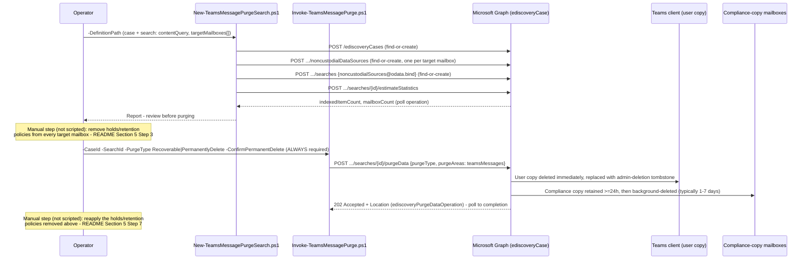

## 1. Scenario summary

Scripts Microsoft Purview eDiscovery's search-and-purge capability for **Microsoft Teams chat
messages**, the Teams-specific half of Microsoft Graph's `purgeData` action
(`purgeAreas: teamsMessages`) that this repo's `search-and-purge-data-spillage` sibling scoped out.
Unlike that sibling's mailbox purge, **there is no reversible mode for Teams**: any successful purge
permanently deletes the user-visible message immediately, regardless of which `purgeType` is chosen.

**Who it's for:** a security/compliance responder who needs an inappropriate, confidential, or
malicious Teams chat message removed from view **right now**, who understands (and whose approval
workflow reflects) that this action cannot be undone once it succeeds.

## 2. Business/regulatory driver

Teams chat is now a first-class channel for the same data-spillage and inappropriate-content
incidents email has always presented, a confidential file summary pasted into a group chat, a
harassment message in a channel, a wrong-recipient 1:1 share. Microsoft's own eDiscovery search-and-
purge workflow documents Teams messages as a directly supported target for exactly this response
. This scenario builds that workflow as code, on the same idempotent-search /
explicit-purge pattern this repo already established for mailboxes.

> ⚠️ **There is no "soft delete" for a Teams purge.** Microsoft's own Graph reference states plainly:
> "When purgeType is set to either `recoverable` or `permanentlyDelete` and purgeAreas is set to
> `teamsMessages`, the Teams messages are permanently deleted". The user-visible
> message is removed **immediately** and replaced with an admin-deletion tombstone; it "can't be
> recovered by the user". Review the search estimate carefully, there is no
> analog to the mailbox sibling's Recoverable-Items recovery window here. See `design.md` §2/§7 for
> why this corrects an assumption an earlier build of this repo's mailbox sibling scenario carried.

## 3. Prerequisites

Full licensing detail: [Licensing matrix §2](/docs/licensing-matrix/#2-master-capability--license-matrix) (eDiscovery (Premium), a Graph-created case is
Premium-configured, same as the mailbox sibling; `design.md` §3 of that scenario). RBAC:
[RBAC model §4](/docs/rbac-model/#4-purview-role-groups-by-module-representative-not-exhaustive). Automation surface: [Automation surface §3](/docs/automation-surface/#3-authentication-patterns-interactive-vs-unattended).

| Requirement | Minimum | Notes |
|---|---|---|
| Licensing | **eDiscovery (Premium)**: M365/Office 365 **E5**, **Microsoft Purview Suite**, or **E5 eDiscovery & Audit** add-on | Same tier as `search-and-purge-data-spillage`, a Graph-created case is Premium-configured |
| Role to create/run a search | **eDiscovery Manager** (own cases) or **eDiscovery Administrator** (all cases) | [RBAC model §4](/docs/rbac-model/#4-purview-role-groups-by-module-representative-not-exhaustive) |
| Role to purge | **Search And Purge** | For this Teams-specific workflow, Microsoft states the role "is assigned to the **Data Investigator** and **Organization Management** role groups by default", note this is a broader default than the mailbox sibling's own citation ("available by default only to Organization Management members"); grant a **custom role group** with just the needed roles rather than relying on either default, least privilege |
| Graph permission | Application **`eDiscovery.ReadWrite.All`** | Same as the mailbox sibling; confirmed against the `purgeData`/`searches`/`noncustodialDataSources` Graph reference pages |
| Auth | Certificate-based app-only via `Connect-MgGraph` | [Automation surface §3](/docs/automation-surface/#3-authentication-patterns-interactive-vs-unattended) |
| PowerShell module | `Microsoft.Graph.Security` ≥ 2.25.0 | Same module/version floor as the mailbox sibling |
| Pre-resolved target mailboxes | Parent-team mailbox (`scenarios/ediscovery/teams-group-hold-resolution/`), or known participant/private-channel addresses | See `design.md` §4, this scenario does not re-derive Teams/group mailbox resolution |

## 4. Architecture



Full rationale, including the correction to this repo's own mailbox sibling's prior "compliance-
copy-only" assumption, is in `design.md` §2/§3.

## 5. Step-by-step implementation

### PowerShell path

```powershell
# 1. Resolve target mailboxes first (not this scenario's job):
#    - Standard/shared channel -> parent team mailbox via
#      ../teams-group-hold-resolution/deploy/Resolve-TeamsGroupHoldLocations.ps1
#    - 1:1 / group chat -> the participants' own known mailbox addresses
#    - Private channel -> see README Section 11's VERIFY before relying on a single "dedicated mailbox"

# 2. Create (or find) the case and search, bind target mailboxes, then estimate.
./deploy/New-TeamsMessagePurgeSearch.ps1 -DefinitionPath ./deploy/policy/teams-message-purge-search-definition.sample.json `
    -AppId $AppId -TenantId $TenantId -CertificateThumbprint $Thumbprint -WhatIf

./deploy/New-TeamsMessagePurgeSearch.ps1 -DefinitionPath ./deploy/policy/teams-message-purge-search-definition.sample.json `
    -AppId $AppId -TenantId $TenantId -CertificateThumbprint $Thumbprint

# Review indexedItemCount / mailboxCount. If larger than expected, narrow the definition file's
# search.contentQuery (add a date range or distinctive keyword) and re-run (idempotent).

# 3. MANUAL, not scripted: identify and remove any hold or retention policy on every target
#    mailbox the estimate's Top Locations reported -- an active hold BLOCKS this purge entirely
#    (it does not just hide the item, unlike the mailbox sibling). Record which holds you removed
#    so you can reapply them in step 6.

# 4. Purge -- ALWAYS requires -ConfirmPermanentDelete, for EITHER -PurgeType value (README Section 2).
./deploy/Invoke-TeamsMessagePurge.ps1 -CaseId $caseId -SearchId $searchId -PurgeType Recoverable `
    -ConfirmPermanentDelete -AppId $AppId -TenantId $TenantId -CertificateThumbprint $Thumbprint -WhatIf

./deploy/Invoke-TeamsMessagePurge.ps1 -CaseId $caseId -SearchId $searchId -PurgeType Recoverable `
    -ConfirmPermanentDelete -AppId $AppId -TenantId $TenantId -CertificateThumbprint $Thumbprint

# 5. Validate.
./validate/Test-TeamsMessagePurgeSearchAndPurge.ps1 -DefinitionPath ./deploy/policy/teams-message-purge-search-definition.sample.json `
    -CaseId $caseId -AppId $AppId -TenantId $TenantId -CertificateThumbprint $Thumbprint

# 6. MANUAL, not scripted: reapply every hold/retention policy removed in step 3.
```

### Portal reference

The case and search are visible under **eDiscovery** in the
[Microsoft Purview portal](https://purview.microsoft.com). The portal's own
**Search** page flyout (**More → Purge data**) drives the identical `purgeData` action this
scenario's script calls, so a purge started in the portal is visible to, and re-checkable by,
`validate/Test-TeamsMessagePurgeSearchAndPurge.ps1`.

## 6. Configuration reference

| Setting | Value this scenario uses | Notes |
|---|---|---|
| Search cmdlet | `New-MgSecurityCaseEdiscoveryCaseSearch` (`-BodyParameter`, `noncustodialSources@odata.bind`) | POST `.../ediscoveryCases/{id}/searches` |
| `contentQuery` | `kind:microsoftteams` -led KQL | Message kind condition value for Teams content, not `kind:im` (Skype for Business; matches Teams too but needs an exclusion clause) |
| Data sources | Explicit `noncustodialDataSource` per target mailbox (`userSource`, `email`) | No Teams-appropriate `allTenantMailboxes`-style blanket scope exists; `design.md` §6 |
| `dataSourceScopes` | `none` | Sources supplied explicitly via `noncustodialSources@odata.bind` instead |
| Estimate cmdlet | `Invoke-MgEstimateSecurityCaseEdiscoveryCaseSearchStatistics` | Same as the mailbox sibling; returns `indexedItemCount`/`mailboxCount` via the polled operation |
| Purge cmdlet | `Clear-MgSecurityCaseEdiscoveryCaseSearchData` | POST `.../searches/{id}/purgeData` |
| `purgeType` | `recoverable` or `permanentlyDelete`, **both permanently delete the user copy for Teams** | `-ConfirmPermanentDelete` required for both, §2, `design.md` §7 |
| `purgeAreas` | `teamsMessages` (hardcoded, this script never purges mailboxes) | The mailbox sibling's own `purgeAreas: mailboxes` remains that scenario's scope |
| Items purged per mailbox/location per run | **≤ 100** | Same documented ceiling as the mailbox sibling |
| Compliance-copy retention after purge | Retained ≥ 24 hours, then background-deleted (typically 1-7 days) | `SubstrateHolds` folder; reapplying a hold within the 24-hour window can preserve the compliance copy, but never the already-deleted user copy |
| Operation polling | `Get-MgSecurityCaseEdiscoveryCaseOperation` | Same pattern as the mailbox sibling |

## 7. Validation / how to prove it works

1. **Automated (object-level)**, `./validate/Test-TeamsMessagePurgeSearchAndPurge.ps1` confirms the
 case and search exist, lists the search's bound non-custodial (mailbox) sources, reports the
 latest `estimateStatistics` result, and lists every `purgeData` operation against the case with
 its status. Exits non-zero on a `failed`/`submissionFailed` purge operation.
2. **Teams client tombstone**, the fastest direct confirmation: the purged message is replaced in
 the Teams client with **"This message was deleted by an admin"** immediately on a successful purge
, a client-visible signal the mailbox sibling has no equivalent for.
3. **Re-run the search's estimate**, a falling `indexedItemCount` across successive
 `New-TeamsMessagePurgeSearch.ps1` runs after a purge is the same secondary evidence pattern the
 mailbox sibling uses.
4. **Audit**, search the unified audit log for the eDiscovery search/purge activity, the same
 `RecordType Discovery` pattern this repo's `premium-legal-hold-and-export` and
 `search-and-purge-data-spillage` scenarios already use.
5. **Idempotency proof**, re-run `New-TeamsMessagePurgeSearch.ps1`; the case/search/noncustodial
 sources all report `exists`, not `created`.

## 8. Operations & tuning

**KPIs / signals:** `indexedItemCount` trend per search; count of bound target mailboxes vs. the
number your incident's roster actually names (a mismatch means a mailbox is missing from the
definition file); purge operation `status`/`percentProgress`; time from search creation to first
purge. **Tuning:** narrow `contentQuery` the same way as the mailbox sibling, a distinctive keyword
or date range, before widening the target-mailbox list. **The hold-removal step is the single
biggest operational risk in this workflow**: forgetting to remove a hold means the purge silently
retains the content (Microsoft's own documented behavior, §2), and forgetting to **reapply** a
removed hold afterward is a preservation-duty gap this scenario cannot detect on its own; track both
steps explicitly in your incident runbook, not just in the script output. **SIEM integration:**
forward `ediscoveryCase` operation-completion events to Sentinel/SIEM, the same pattern this repo's
other high-severity eDiscovery/DLM controls already use. **Change management:** one case per
incident, named to the incident ticket, matching the mailbox sibling's own guidance.

## 9. Rollback / decommission

See `rollback.md`. Quick reference: **there is no recovery stage for the purged message itself**, 
unlike the mailbox sibling's `Recoverable`-purge Stage 1, Teams offers no end-user or admin recovery
path once a purge succeeds. What remains reversible is process state: the search definition, the
case, and the holds you removed and must reapply.

## 10. Cost & licensing notes

- **eDiscovery (Premium)** entitlement (E5/Suite/add-on), same as the mailbox sibling, no separate
 per-search or per-purge meter for this action.
- **The real cost is the hold-removal/reapplication process**, not a licensing meter: every purge
 requires a human to identify, remove, and later reapply holds on each target mailbox, a
 heavier operational sequence than the mailbox sibling's "purge, held mailboxes are just skipped"
 model.

## 11. Known limitations & gotchas

- **No reversible purge mode.** Both `-PurgeType` values permanently delete the Teams user-visible
 message on success. See §2's warning and `design.md` §2/§7. This is the single most important
 fact about this scenario, and the reason `-ConfirmPermanentDelete` is required unconditionally.
- **A hold or retention policy on a target mailbox blocks the purge entirely** rather than just
 hiding the item from view (the mailbox sibling's behavior). Remove it first, purge, then reapply, 
 §5 steps 3/6. This scenario does not automate either step.
- **100 items per mailbox/location per run.** Same documented ceiling as the mailbox sibling; repeat
 the purge to clear more.
- **Not supported for Teams Connect Chat (external access/federation) conversations, or for chats
 with yourself**, Microsoft states both plainly; not scriptable around.
- **VERIFY:** private-channel compliance-copy storage, one Microsoft Learn page describes "a
 dedicated mailbox for each private channel", another describes storage "in the
 Exchange Online mailboxes of all members of the private channel". This build
 found no page reconciling the two. Do not assume a single dedicated mailbox is sufficient for a
 private-channel target without confirming against the member-based model too, `design.md` §4.
- **VERIFY (pilot tenant or a future Microsoft Learn/SDK pass):** the exact typed PowerShell cmdlet
 for binding an existing `noncustodialDataSource` onto a search via the `$ref` endpoint, 
 `deploy/New-TeamsMessagePurgeSearch.ps1` calls the confirmed raw HTTP shape via
 `Invoke-MgGraphRequest` instead of guessing an unconfirmed SDK cmdlet name. `design.md` §6.
- **VERIFY (pilot tenant):** how a case-level `ediscoveryNoncustodialDataSource`'s `DisplayName` is
 populated for a mailbox (`userSource`), this scenario's idempotency check matches on `DisplayName`
 as a best-effort heuristic; `validate/Test-TeamsMessagePurgeSearchAndPurge.ps1` reports this as
 `[WARN]`, not `[PASS]`. `design.md` §6.
- **VERIFY:** whether `-PurgeType` still meaningfully affects the **compliance copy's** retention or
 hold-interaction timeline for Teams, even though it no longer gates the user-copy outcome, no
 Microsoft Learn page found during this build confirms either way. `design.md` §7.
- **This scenario purges Teams messages only** (`purgeAreas: teamsMessages`), it never touches
 Exchange mailbox content; use the `search-and-purge-data-spillage` sibling for that.
- **This build corrected a factual error in the `search-and-purge-data-spillage` sibling's own
 docs** (it previously described Teams purge as compliance-copy-only, the opposite of current
 Microsoft Learn guidance for the Graph-based mechanism), see `design.md` §2. Both scenarios' texts
 now agree.
- **Illustrative values.** The case name, query, and mailbox list in the sample config are
 placeholders, replace with the real, confirmed incident details before use.

## 12. References

1. Find and delete Microsoft Teams chat messages in eDiscovery (data sources table, hold-removal
 requirement, role assignment, tombstone behavior, compliance-copy retention timing, Teams Connect
 Chat/self-chat exclusions), <https://learn.microsoft.com/purview/edisc-search-teams-data>
2. ediscoverySearch: purgeData (Graph v1.0; `purgeType`/`purgeAreas`; permanent-deletion note for
 `teamsMessages`), <https://learn.microsoft.com/graph/api/security-ediscoverysearch-purgedata>
3. Finding content in Microsoft Teams in eDiscovery (Teams content storage table; private-channel
 member-mailbox description), <https://learn.microsoft.com/purview/edisc-search-teams>
4. Use the condition builder to create search queries in eDiscovery (Message kind condition, value
 `microsoftteams`), <https://learn.microsoft.com/purview/edisc-condition-builder>
5. Feature reference for Content search (`kind:microsoftteams` KQL; `kind:im` Skype-for-Business
 caveat), <https://learn.microsoft.com/purview/ediscovery-content-search-reference>
6. Create searches (Graph v1.0; `dataSourceScopes`, `custodianSources@odata.bind`,
 `noncustodialSources@odata.bind` worked example), <https://learn.microsoft.com/graph/api/security-ediscoverycase-post-searches>
7. Create nonCustodialDataSources (Graph v1.0; `userSource`/`siteSource` dataSource shape), <https://learn.microsoft.com/graph/api/security-ediscoverycase-post-noncustodialdatasources>
8. Add noncustodialDataSources (Graph v1.0; `$ref` bind to a search), <https://learn.microsoft.com/graph/api/security-ediscoverysearch-post-noncustodialsources>
9. Assign eDiscovery permissions, <https://learn.microsoft.com/purview/edisc-permissions>
10. `scenarios/ediscovery/search-and-purge-data-spillage/`, the mailbox-purge sibling this scenario
 completes; shares its case/search/estimate helper patterns and `Get-OperationIdFromLocation`
 Location-header handling.
11. `scenarios/ediscovery/teams-group-hold-resolution/`, resolves a Team/Microsoft 365 Group's own
 mailbox address, reused here for standard/shared-channel targets.

> Re-verify all links, Graph SDK cmdlet names, and, especially, the private-channel storage model
> and the unconfirmed `$ref`-bind cmdlet name (§11) against current Microsoft Learn before a
> customer-facing deployment. This scenario treats every Teams purge as irreversible for the user
> copy; there is no "safe default" to fall back on the way the mailbox sibling has.
