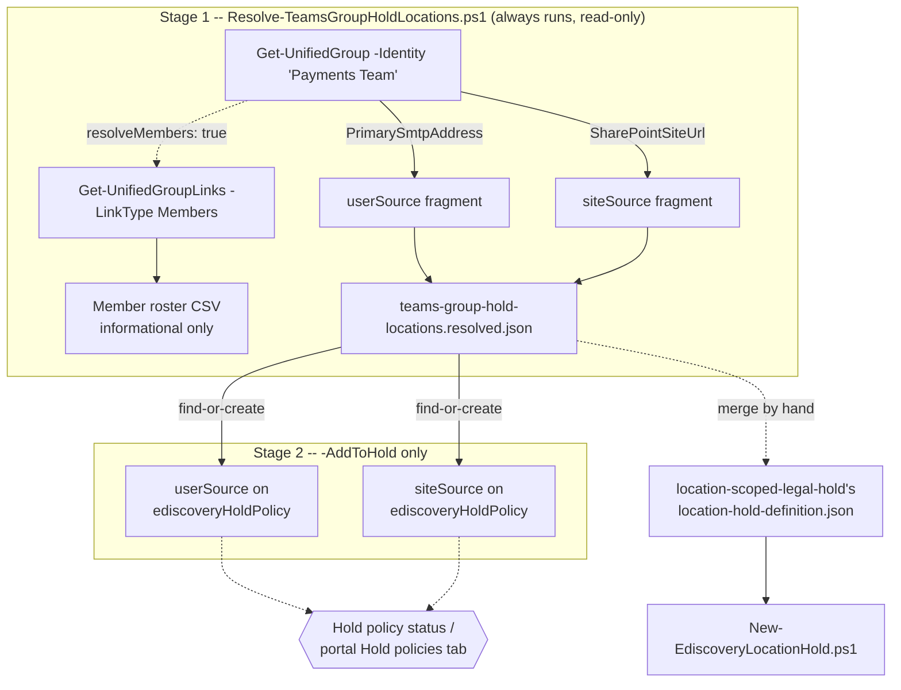

## 1. Scenario summary

Resolves a Microsoft Teams team or Microsoft 365 Group's own preservable content locations, its
group mailbox and its SharePoint site, into the `userSource`/`siteSource` pair that
`scenarios/ediscovery/location-scoped-legal-hold/`'s hold scripts already accept, and optionally
reconciles those locations directly onto an existing hold policy.

**Who it's for:** the same legal/compliance operator running `location-scoped-legal-hold`, at the
specific moment a matter names a Team or Microsoft 365 Group by its display name ("preserve the
*Payments Team* Teams channel") rather than by the group's own mailbox address or SharePoint site
URL. This scenario is the lookup step between "a Team was named in scope" and "here is the
userSource/siteSource pair to add to the hold", a distinct, separately scoped concern the sibling
scenario's `design.md` §8 explicitly deferred rather than folded in.

## 2. Business/regulatory driver

Identical to `scenarios/ediscovery/location-scoped-legal-hold/README.md` §2, the preservation duty
this control implements doesn't change based on which object type names the in-scope location.
What's specific to this scenario is a genuinely common naming pattern in a regulatory inquiry or
internal sweep: a matter names a **Team**, not a mailbox address or a SharePoint URL. A Team's
preservable content spans two Purview-hold-relevant locations that aren't visible from the Team
name alone (its group mailbox and SharePoint site, §4), and Microsoft's own guidance is explicit
that placing a Team/group on hold **only** covers those two locations, not the mailboxes/OneDrive
accounts of the people who are members of it (§11), a distinction with real spoliation exposure if
a legal team assumes "the Team is on hold" covers more than it actually does.

## 3. Prerequisites

Full licensing and role detail: [Licensing matrix](/docs/licensing-matrix/) and [RBAC model](/docs/rbac-model/). This
scenario's core requirements are identical to `location-scoped-legal-hold/README.md` §3 (eDiscovery
Premium licensing on the group's mailbox, tenant/case Premium toggles, eDiscovery Manager/
Administrator RBAC, Graph app-only auth for the `-AddToHold` path). Two differences specific to
this scenario:

| Requirement | Minimum | Notes |
|---|---|---|
| **View-Only Recipients** role in Exchange Online (or membership in a role group assigned it) | Required to run `Get-UnifiedGroup`/`Get-UnifiedGroupLinks`, Microsoft states this explicitly on both cmdlets' own reference pages | Separate from the Graph eDiscovery RBAC the `-AddToHold` path needs; an operator with only eDiscovery Manager/Administrator cannot run the resolve stage without this Exchange role too |
| Exchange Online PowerShell connection (surface 1) already established | `Connect-ExchangeOnline` run by the caller before invoking either script | Unlike the sibling scenario's Graph-only scripts, this scenario's deploy/validate scripts do not self-connect to Exchange Online, see `design.md` §4 for why |

> Verify current entitlement names against [Licensing matrix](/docs/licensing-matrix/) and the Product Terms before
> a sales commitment, SKU names change.

## 4. Architecture



Stage 1 uses Exchange Online PowerShell (`Get-UnifiedGroup`/`Get-UnifiedGroupLinks`, automation
surface 1 per [Automation surface §1](/docs/automation-surface/#1-five-automation-surfaces-not-one-read-this-first)), the only surface that exposes a Team/Microsoft 365
Group's `SharePointSiteUrl` directly, per Microsoft's own worked example (§5). Stage 2 (`-AddToHold`
only) reuses `location-scoped-legal-hold`'s Graph v1.0 `ediscoveryHoldPolicy` REST calls (surface
3), duplicated rather than dot-sourced per this repo's self-contained-deploy-tree convention.

## 5. Step-by-step implementation

### Portal path (for a first manual walkthrough / to validate intent before scripting)

1. **Get the group's mailbox and site**: Purview eDiscovery hold-creation flow itself resolves a
 Team/group's mailbox and site automatically when you add it as a data source, no separate
 lookup is needed in the portal (**Create a hold** → **Manage data sources** → search by group
 name). This scenario's script exists for the **automation** path, where a
 Team name arrives from an intake ticket or case-management system and the caller needs the
 underlying mailbox/site values to build a hold-definition file programmatically.
2. **Confirm via Exchange Online PowerShell** (equivalent to what the script does): `Get-UnifiedGroup
 "<Team name>" | FL DisplayName,Alias,PrimarySmtpAddress,SharePointSiteUrl`.

### Script path (idempotent, parameterized, dry-run capable)

```powershell
# 1. Connect to Exchange Online (surface 1 -- this scenario's scripts do not connect for you).
Connect-ExchangeOnline -AppId $AppId -CertificateThumbprint $Thumbprint -Organization $TenantDomain

# 2. Resolve every declared group's mailbox/site (read-only; -WhatIf still writes nothing to disk).
./deploy/Resolve-TeamsGroupHoldLocations.ps1 `
    -DefinitionPath ./deploy/config/teams-group-hold-resolution.sample.json -WhatIf

# 3. Resolve for real -- writes deploy/out/teams-group-hold-locations.resolved.json (gitignored).
./deploy/Resolve-TeamsGroupHoldLocations.ps1 `
    -DefinitionPath ./deploy/config/teams-group-hold-resolution.sample.json

# 4a. Merge the resolved fragment into location-scoped-legal-hold's definition file by hand, then
#     run that sibling scenario's own deploy script -- OR --
# 4b. Reconcile directly onto an already-existing hold policy:
./deploy/Resolve-TeamsGroupHoldLocations.ps1 `
    -DefinitionPath ./deploy/config/teams-group-hold-resolution.sample.json `
    -AddToHold -CaseId $caseId -HoldId $holdId `
    -AppId $AppId -TenantId $TenantId -CertificateThumbprint $Thumbprint -WhatIf
# then re-run without -WhatIf once the plan looks right.

# 5. Validate.
./validate/Test-TeamsGroupHoldLocations.ps1 `
    -DefinitionPath ./deploy/config/teams-group-hold-resolution.sample.json `
    -CaseId $caseId -HoldId $holdId `
    -AppId $AppId -TenantId $TenantId -CertificateThumbprint $Thumbprint
```

## 6. Configuration reference

| Field (`deploy/config/teams-group-hold-resolution.sample.json`) | Meaning |
|---|---|
| `groups[].identity` | Any value `Get-UnifiedGroup -Identity` accepts, display name, alias, or SMTP address |
| `groups[].resolveMembers` | Optional, default `false`. If `true`, also runs `Get-UnifiedGroupLinks -LinkType Members` and writes a member-roster CSV (informational only, §11) |

| Output object | Written by | Shape |
|---|---|---|
| Resolved hold-location fragment | `Resolve-TeamsGroupHoldLocations.ps1` (always) | `{ "userSources": [{ "email": "..." }], "siteSources": [{ "site": "..." }] }`, the exact `userSources[]`/`siteSources[]` shape `location-scoped-legal-hold`'s definition file uses |
| Member roster CSV | `Resolve-TeamsGroupHoldLocations.ps1` (only if any group requests `resolveMembers`) | `Group, MemberDisplayName, MemberPrimarySmtpAddress`, one row per current member, per group |

`Get-UnifiedGroup` properties this script reads: `DisplayName`, `Alias`, `PrimarySmtpAddress`,
`SharePointSiteUrl`. Graph endpoints used by `-AddToHold` (identical to the
sibling scenario's, full grounding there): `POST.../legalHolds/{id}/userSources`,
`POST.../legalHolds/{id}/siteSources`.

## 7. Validation / how to prove it works

1. **Automated check**, `./validate/Test-TeamsGroupHoldLocations.ps1 -DefinitionPath...` confirms
 every declared group still resolves to the mailbox/site address recorded in the last resolved
 fragment (drift detection); add `-CaseId`/`-HoldId` to also confirm those locations are actually
 present and `applied` on a named hold policy. Exits non-zero on any hard failure.
2. **Functional proof (portal)**, after `-AddToHold`, open the case's **Hold policies** tab and
 confirm the group's mailbox and site both appear as locations with no errors, exactly as the
 sibling scenario's own §7 describes.
3. **Member-roster sanity check**, if `resolveMembers: true` was used, the emitted CSV's row count
 should match what **Groups** in the Microsoft 365 admin center reports for that group's current
 membership, a mismatch suggests a stale cached result rather than a script
 bug, since both this script and the admin center read live directory state at call time.

## 8. Operations & tuning

**KPIs to watch:**
- **A group's `resolved.json` entry going stale**, re-run `Resolve-TeamsGroupHoldLocations.ps1`
 (and, if the group is already on a hold, `-AddToHold` again) whenever a group's mailbox alias or
 SharePoint site URL changes; `validate/Test-TeamsGroupHoldLocations.ps1`'s drift check exists
 specifically to catch this without requiring a human to remember every group's original resolved
 values.
- **A SharePoint-site-provisioning `WARN`** persisting across multiple runs, see this scenario's
 open VERIFY (§11) on provisioning timing; treat a `WARN` that doesn't clear within a working day
 as worth investigating directly in the SharePoint admin center rather than continuing to re-run
 this script on a fixed interval.

**Review cadence:** re-run `validate/Test-TeamsGroupHoldLocations.ps1` on the same cadence as the
sibling scenario's own hold-status checks (`location-scoped-legal-hold/README.md` §8, at least
weekly for the life of the matter), since this scenario's output feeds directly into that hold.

**What this scenario deliberately does not monitor:** individual member mailboxes/OneDrive
accounts, and any chat/1:1 content stored outside the group mailbox and site, see §11 and
`design.md` §6.

## 9. Rollback / decommission

See `rollback.md`. Quick reference: this scenario's own resolve-only output (the JSON fragment and
CSV roster) are plain files with no tenant-side effect, delete them locally with no further action.
If `-AddToHold` was used, releasing the group's mailbox/site from the hold is the sibling scenario's
own `deploy/Remove-EdiscoveryLocationHold.ps1 -UserSourceEmail`/`-SiteSourceUrl`, not a script this
scenario ships separately, see `rollback.md` for why.

## 10. Cost & licensing notes

No incremental licensing beyond `location-scoped-legal-hold/README.md` §10, this scenario doesn't
create any new billable object; it only resolves values that scenario's own hold policy consumes.
`Get-UnifiedGroup`/`Get-UnifiedGroupLinks` calls are Exchange Online PowerShell reads with no PAYG
or metered cost.

## 11. Known limitations & gotchas

- **Placing a group's mailbox/site on hold does not cover its members' 1:1/1:N chats or personal
 OneDrive files.** Microsoft's own guidance states this explicitly: "the mailboxes and OneDrive
 sites of group members aren't placed on hold unless you explicitly add them to the eDiscovery
 hold". This scenario's `-ResolveMembers` output is a
 reporting aid for that separate decision, it never adds a member's own mailbox to a hold.
- **Group membership is captured as a point-in-time snapshot, and only if a portal or automation
 path explicitly expands it**, not applicable to this scenario's own default output (one
 userSource per group, its own mailbox, regardless of member count), but directly relevant if the
 `-ResolveMembers` roster is later used to add individual members by hand: members added to the
 group after that point wouldn't be covered without re-resolving and re-adding.
- **Re-grounded (2026-09-04), not reconciled, cross-referenced against
 `location-scoped-legal-hold`'s own VERIFY:** Microsoft's current "Create holds in eDiscovery"
 page states that expanding **any** supported group type as a hold data source (distribution
 list, mail-enabled security group, Microsoft 365 group, Microsoft Teams group, Viva Engage
 group) in the portal's own interactive data-source picker is "limited to a maximum of 100
 members", a smaller, more specific figure than the ">1,000 email addresses"
 **"Distribution group has too many members"** hold-application error the current "Manage holds
 in eDiscovery" page documents. Re-fetching both pages directly confirmed
 neither is a stale/superseded reference, both are current, non-legacy articles, and the
 >1,000 figure lives in a still-current table on the second page, not an older separate page as
 originally suspected. Microsoft's text does not state whether the two figures describe the same
 limit surfaced at two different UI moments (the portal member-picker vs. a post-apply error) or
 two independent limits on two different code paths, so this remains an open VERIFY rather than a
 guess at which is authoritative (full analysis: `location-scoped-legal-hold/design.md` §3). This
 scenario's own default output is not itself subject to either cap (one userSource per group, 
 its own mailbox, never a per-member expansion); the discrepancy would only matter to a human
 choosing to add this script's `-ResolveMembers` roster entries as individual userSources, where
 **100 members** is the conservative planning threshold to apply.
- **VERIFY:** no canonical Microsoft Learn page states an exact SLA for `SharePointSiteUrl`
 appearing on `Get-UnifiedGroup` after a Microsoft 365 group/Team is created, see the deploy
 script's `.NOTES` for the (non-canonical) community-reported range and the confirmed
 `ProvisionSiteOnDemand` provisioning-deferral option that can make a blank result persistent by
 design, not just transient.
- **A SharePoint site without a title cannot be placed on hold at all**, the same Microsoft-
 documented hard requirement `location-scoped-legal-hold/README.md` §11 already carries, inherited
 unchanged since this scenario feeds that scenario's own `siteSource` object.
- **This scenario does not resolve a Team channel down to individual private channels.** Private
 channel chats live in their own dedicated mailbox, separate from the parent Team's group mailbox
, out of scope here; see `design.md` §6.
- **Does not create or modify the hold policy or case itself**, `-AddToHold` requires an existing
 `-CaseId`/`-HoldId` from `location-scoped-legal-hold/deploy/New-EdiscoveryLocationHold.ps1` (or
 the portal); this scenario is purely the resolve-and-attach step.

## 12. References

1. Get-UnifiedGroup (Exchange PowerShell reference, `SharePointSiteUrl`, View-Only Recipients role requirement), <https://learn.microsoft.com/powershell/module/exchangepowershell/get-unifiedgroup>
2. Get-UnifiedGroupLinks (Exchange PowerShell reference, `-LinkType`, View-Only Recipients role requirement), <https://learn.microsoft.com/powershell/module/exchangepowershell/get-unifiedgrouplinks>
3. Create holds in eDiscovery, "Create a hold" (group-as-data-source expansion, 100-member cap, point-in-time snapshot) and "Preserve content in Microsoft Teams" / "Microsoft 365 groups" (Get-UnifiedGroup/Get-UnifiedGroupLinks worked example), <https://learn.microsoft.com/purview/edisc-hold-create>
4. Create userSource (v1.0, `ediscoveryHoldPolicy` context), <https://learn.microsoft.com/graph/api/security-ediscoveryholdpolicy-post-usersources?view=graph-rest-1.0>
5. Create siteSource (v1.0, `ediscoveryHoldPolicy` context), <https://learn.microsoft.com/graph/api/security-ediscoveryholdpolicy-post-sitesources?view=graph-rest-1.0>
6. Manage holds in eDiscovery, "Place a hold on Microsoft Teams and Microsoft 365 groups", <https://learn.microsoft.com/purview/edisc-hold-manage#place-a-hold-on-microsoft-teams-and-microsoft-365-groups>
7. Groups page in the Microsoft 365 admin center, <https://go.microsoft.com/fwlink/p/?linkid=2052855>
8. Microsoft 365 Group behaviors and provisioning options (`resourceBehaviorOptions.ProvisionSiteOnDemand`), <https://learn.microsoft.com/graph/group-set-options>
9. `scenarios/ediscovery/location-scoped-legal-hold/`, the sibling scenario this fragment feeds; see its own README §12 for the full `ediscoveryHoldPolicy` v1.0 REST citation set (case/hold/userSource/siteSource create, retry, delete) not repeated here.
10. Manage holds in eDiscovery, "Manage hold status errors" ("Distribution group has too many members," >1,000 addresses; current page, re-fetched 2026-09-04), <https://learn.microsoft.com/purview/edisc-hold-manage#manage-hold-status-errors>

> Re-verify all links against current Microsoft Learn before a customer-facing deployment, 
> Purview's Graph eDiscovery surface has moved namespaces within the product's own history. The
> 100-member vs. >1,000-member group-expansion figures (§11) were re-grounded on 2026-09-04 and
> found to be two distinct, current, unreconciled figures, not a stale-vs-current pair, so treat
> the smaller (100-member) figure as the conservative planning threshold until a pilot tenant
> confirms otherwise.
