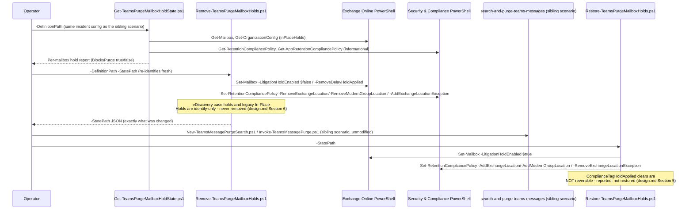

## 1. Scenario summary

Scripts the hold-identification, hold-removal, and hold-reapplication sequence that
`scenarios/ediscovery/search-and-purge-teams-messages/` deliberately left manual: before a Teams
message purge can remove anything, every hold and retention policy on each target mailbox must be
removed, and Microsoft states plainly that skipping this step means **the content is silently
retained, not deleted**. This companion scenario identifies every documented hold
type on a mailbox list, removes the genuinely scriptable subset, records exactly what it changed, and
restores it afterward, while being explicit about the hold types it cannot safely or completely
automate.

**Who it's for:** the same security/compliance responder running the Teams-purge sibling scenario, who
needs the hold-removal step to be a repeatable, auditable script rather than an ad hoc portal walk-
through performed under incident time pressure.

## 2. Business/regulatory driver

A Teams purge that silently no-ops because a hold was never removed is worse than no purge at all, it
gives the responder false confidence that inappropriate or spillage content is gone, when Microsoft's
own documented behavior for this exact workflow is that it was never touched
. Conversely, forgetting to **reapply** a removed hold is a preservation-duty gap:
the mailbox's other content loses its litigation, retention, or organizational hold coverage until
someone remembers to put it back. Both failure modes are process gaps, not tooling gaps, this
scenario turns the process into a script with a recorded, auditable state trail.

## 3. Prerequisites

Full licensing detail: [Licensing matrix §2](/docs/licensing-matrix/#2-master-capability--license-matrix) (eDiscovery, the parent scenario's own
entitlement covers this companion; no separate license is required for the Exchange Online/Security &
Compliance PowerShell surfaces this scenario uses). RBAC: [RBAC model §4](/docs/rbac-model/#4-purview-role-groups-by-module-representative-not-exhaustive) (eDiscovery role
groups), §6 (Exchange Online RBAC dependency, directly applicable here, since Litigation Hold and
delay-hold removal are pure Exchange Online RBAC actions, not Purview RBAC). Automation surface:
[Automation surface §3](/docs/automation-surface/#3-authentication-patterns-interactive-vs-unattended).

| Requirement | Minimum | Notes |
|---|---|---|
| Licensing | Same as `search-and-purge-teams-messages`, eDiscovery (Premium): M365/Office 365 **E5**, **Microsoft Purview Suite**, or **E5 eDiscovery & Audit** add-on | No separate meter for the hold-management cmdlets themselves |
| Role, identify (read-only) | Exchange Online **View-Only Recipients** (or broader) for `Get-Mailbox`/`Get-OrganizationConfig`; Purview **View-Only Retention Management** (or broader) for `Get-RetentionCompliancePolicy`/`Get-AppRetentionCompliancePolicy` | Read-only credentials are sufficient for `Get-TeamsPurgeMailboxHoldState.ps1` |
| Role, remove/restore Litigation Hold and delay holds | Exchange Online **Legal Hold** role (assigned via **Organization Management** or **Discovery Management** by default) | A pure Exchange Online RBAC role, not a Purview role group, [RBAC model §6](/docs/rbac-model/#6-exchange-online-dependency-the-most-common-permissions-gap) |
| Role, remove/restore retention-policy membership | Purview **Retention Management** role, part of the **Records Management** role group | [RBAC model §4](/docs/rbac-model/#4-purview-role-groups-by-module-representative-not-exhaustive) already documents this role group for Records Management/Data Lifecycle Management |
| Graph/eDiscovery-hold resolution | **Not attempted by this scenario**, `Get-CaseHoldPolicy`/`Get-ComplianceCase` are eDiscovery cmdlets, the one documented app-only-unsupported exception ([Automation surface §3](/docs/automation-surface/#3-authentication-patterns-interactive-vs-unattended)) | design.md §6 |
| Auth | Certificate-based app-only via **both** `Connect-ExchangeOnline` and `Connect-IPPSSession` | [Automation surface §3](/docs/automation-surface/#3-authentication-patterns-interactive-vs-unattended), surfaces 1 and 2 |
| PowerShell module | `ExchangeOnlineManagement` ≥ 3.2.0 | Same module/version floor as this repo's other Exchange Online/S&CC-based scenarios |
| Pre-resolved target mailboxes | Same `-DefinitionPath` JSON schema as the parent scenario's `New-TeamsMessagePurgeSearch.ps1`, or `-Mailbox` directly | design.md §3 goal 1 |

## 4. Architecture



Full rationale, including the hold-type scope table and why two hold types are identify-only by
design, is in `design.md` §2/§6/§7.

## 5. Step-by-step implementation

### PowerShell path

```powershell
# 1. Connect both surfaces (docs/automation-surface.md Section 3).
Connect-ExchangeOnline -AppId $AppId -Certificate $Cert -Organization 'contoso.onmicrosoft.com'
Connect-IPPSSession -AppId $AppId -Certificate $Cert -Organization 'contoso.onmicrosoft.com'

# 2. Identify -- read-only, safe to run any time.
./deploy/Get-TeamsPurgeMailboxHoldState.ps1 `
    -DefinitionPath ./deploy/policy/teams-purge-hold-lifecycle-mailboxes.sample.json
# (or point -DefinitionPath at the SAME incident config file used with search-and-purge-teams-messages)

# Review BlocksPurge per mailbox. If a mailbox's only blocker is an eDiscovery case hold or legacy
# In-Place Hold, this scenario's Remove script cannot help -- resolve it manually first (README.md
# Section 6/design.md Section 6).

# 3. Remove -- preview first.
./deploy/Remove-TeamsPurgeMailboxHolds.ps1 `
    -DefinitionPath ./deploy/policy/teams-purge-hold-lifecycle-mailboxes.sample.json `
    -StatePath ./hold-removal-state-2026-014.json -WhatIf

./deploy/Remove-TeamsPurgeMailboxHolds.ps1 `
    -DefinitionPath ./deploy/policy/teams-purge-hold-lifecycle-mailboxes.sample.json `
    -StatePath ./hold-removal-state-2026-014.json
# Add -IncludeComplianceTagHold only after reading design.md Section 5 -- this one clear is IRREVERSIBLE.

# 4. Re-confirm readiness before purging.
./validate/Test-TeamsPurgeMailboxHoldLifecycle.ps1 `
    -DefinitionPath ./deploy/policy/teams-purge-hold-lifecycle-mailboxes.sample.json

# 5. Run the sibling scenario's purge -- NOT part of this scenario.
#    ../search-and-purge-teams-messages/deploy/New-TeamsMessagePurgeSearch.ps1 ...
#    ../search-and-purge-teams-messages/deploy/Invoke-TeamsMessagePurge.ps1 ...

# 6. Restore -- as soon as the purge is validated. Time-sensitive (README.md Section 8).
./deploy/Restore-TeamsPurgeMailboxHolds.ps1 -StatePath ./hold-removal-state-2026-014.json -WhatIf
./deploy/Restore-TeamsPurgeMailboxHolds.ps1 -StatePath ./hold-removal-state-2026-014.json

# 7. Confirm restoration.
./validate/Test-TeamsPurgeMailboxHoldLifecycle.ps1 -StatePath ./hold-removal-state-2026-014.json
```

### Portal reference

The equivalent manual actions are documented directly by Microsoft under **Step 3/Step 4/Step 7** of
"Find and delete Microsoft Teams chat messages in eDiscovery", which itself points
to **eDiscovery → Cases → [case] → Hold policies** for eDiscovery case holds
specifically (the one hold type this scenario's scripts never touch, §6), and **Data lifecycle
management → Retention policies** in the Microsoft Purview portal for editing a retention policy's
location list directly.

## 6. Configuration reference

| Setting | Value this scenario uses | Notes |
|---|---|---|
| Identify cmdlets | `Get-Mailbox` (`LitigationHoldEnabled`, `InPlaceHolds`, `ComplianceTagHoldApplied`, `DelayHoldApplied`, `DelayReleaseHoldApplied`), `Get-OrganizationConfig` (`InPlaceHolds`) | Exchange Online PowerShell |
| `InPlaceHolds` prefix parsing | `UniH` = eDiscovery hold; `mbx`/`skp` = mailbox-scoped (specific-location, regular mailbox) or org-wide retention policy (cross-checked); `grp` = org-wide Group policy when GUID matches `Get-OrganizationConfig`, otherwise a mailbox-scoped Group-location policy (group/team mailbox only) or, on a non-group mailbox, an unrecognized anomaly; `-mbx` = org-wide exclusion; no prefix = legacy In-Place Hold | design.md §4/§8.1, grounded against Microsoft's own prefix table |
| Resolve policy name | `Get-RetentionCompliancePolicy <guid> -DistributionDetail` | Security & Compliance PowerShell |
| Remove, Litigation Hold | `Set-Mailbox -LitigationHoldEnabled $false` | |
| Remove, mailbox-scoped policy (regular mailbox) | `Set-RetentionCompliancePolicy -RemoveExchangeLocation <mailbox>` |; never used against a group/team mailbox, |
| Remove, mailbox-scoped Group-location policy | `Set-RetentionCompliancePolicy -RemoveModernGroupLocation <mailbox>` | **Only** when the target is a group/team mailbox (`RecipientTypeDetails -eq 'GroupMailbox'`), ; resulting `InPlaceHolds` notation is an open VERIFY, design.md §8.1 |
| Remove, org-wide Exchange policy | `Set-RetentionCompliancePolicy -AddExchangeLocationException <mailbox>` (excludes the mailbox; does not edit the policy itself) | **Only** for a non-group mailbox, |
| Remove, org-wide Group policy | `Set-RetentionCompliancePolicy -AddModernGroupLocationException <mailbox>` | **Only** when the target is a group/team mailbox (`RecipientTypeDetails -eq 'GroupMailbox'`, e.g. a standard/shared channel's parent team), never conflate with the Exchange-location parameter above. design.md §8 |
| Remove, retention-label hold (opt-in) | `Set-Mailbox -RemoveComplianceTagHoldApplied -ProvideConsent` | `-IncludeComplianceTagHold` switch; **irreversible**, no restore cmdlet exists |
| Remove, delay hold (pre-existing only) | `Set-Mailbox -RemoveDelayHoldApplied` / `-RemoveDelayReleaseHoldApplied` | Requires the **Legal Hold** role |
| Restore, Litigation Hold | `Set-Mailbox -LitigationHoldEnabled $true` | |
| Restore, mailbox-scoped policy (regular mailbox) | `Set-RetentionCompliancePolicy -AddExchangeLocation <mailbox>` | |
| Restore, mailbox-scoped Group-location policy | `Set-RetentionCompliancePolicy -AddModernGroupLocation <mailbox>` |; design.md §8.1 |
| Restore, org-wide exception | `Set-RetentionCompliancePolicy -RemoveExchangeLocationException <mailbox>` | |
| Never touched | eDiscovery case holds (`UniH`), legacy In-Place Holds, `*-AppRetentionCompliancePolicy`-governed newer-location policies, an unrecognized `grp`-prefixed entry on a non-group mailbox | design.md §6/§7/§8.1 |
| Informational listing | `Get-AppRetentionCompliancePolicy` | Tenant-wide, never matched to a specific mailbox |
| State file | `-StatePath` JSON (`Remove-TeamsPurgeMailboxHolds.ps1` writes it; `Restore-`/`Test-` scripts read it) | Records only what was actually changed, design.md §3 goal 3 |

## 7. Validation / how to prove it works

1. **Pre-purge readiness (Mode 1)**, `./validate/Test-TeamsPurgeMailboxHoldLifecycle.ps1
 -DefinitionPath...` re-identifies every target mailbox and `[FAIL]`s any that still has a blocking
 hold, scriptable or not. A clean run here is a precondition for the sibling scenario's purge to
 actually remove anything (per §1's citation), not a guarantee by itself, a newer-location policy
 (§6 "Never touched") could still be silently in effect.
2. **Post-restore validation (Mode 2)**, `./validate/Test-TeamsPurgeMailboxHoldLifecycle.ps1
 -StatePath...` re-checks every field the Remove script recorded as changed against current state,
 `[FAIL]`ing anything not actually restored.
3. **Idempotency**, re-running `Get-TeamsPurgeMailboxHoldState.ps1` at any point is always safe
 (read-only); re-running `Remove-TeamsPurgeMailboxHolds.ps1` on an already-clean mailbox correctly
 reports nothing to remove; re-running `Restore-TeamsPurgeMailboxHolds.ps1` skips any field already
 in its target state rather than issuing a redundant `Set-RetentionCompliancePolicy` call (which
 Microsoft documents as triggering "a full synchronization across your organization", a cost worth
 avoiding when unnecessary).
4. **Audit**, search the unified audit log for the underlying `Set-Mailbox`/`Set-RetentionCompliancePolicy`
 operations, the same pattern this repo's other DLM/Exchange-RBAC scenarios use.

## 8. Operations & tuning

**KPIs / signals:** count of mailboxes with `BlocksPurge=true` before remediation vs. after Remove
runs; count of mailboxes whose only remaining blocker is a non-scriptable hold type (eDiscovery case
hold or legacy In-Place Hold), these need manual resolution before the purge can succeed at all;
whether `-IncludeComplianceTagHold` was ever used (track separately, it's a one-way action with no
scripted undo). **The single biggest operational-timing risk in this scenario is the 30-day delay
hold** (design.md §5): removing a hold doesn't take effect at Managed Folder Assistant speed, and this
scenario cannot force that assistant to run immediately, if a purge attempt still fails after Remove
reports success, a just-triggered delay hold on the *next* Managed Folder Assistant pass is a plausible
cause, not necessarily a script defect. **Restore promptly**: Microsoft notes that reapplying a hold
within 24 hours of a Teams purge can still preserve the mailbox's compliance copy from background
deletion (`search-and-purge-teams-messages/README.md` §6), treat Stage 6 (Restore) as time-sensitive,
not a background chore. **SIEM integration:** forward the underlying `Set-Mailbox`/
`Set-RetentionCompliancePolicy` audit events to Sentinel/SIEM alongside the sibling scenario's own
`ediscoveryCase` operation-completion events, so a hold-removal/reapplication gap is visible
independent of the purge's own success/failure.

## 9. Rollback / decommission

See `rollback.md`. Quick reference: this scenario's own "rollback" **is** its Restore stage, there is
no separate decommission step beyond deleting the `-StatePath` state files once an incident record no
longer needs them (they may contain mailbox addresses and policy names, treat as sensitive for the
life of the incident, matching the sibling scenario's own guidance for its search definition).

## 10. Cost & licensing notes

- No separate licensing meter, this scenario's cmdlets are Exchange Online/Security & Compliance
 PowerShell surfaces already covered by the same entitlement (eDiscovery Premium, per the sibling
 scenario) plus standard Exchange Online licensing.
- **The real cost is operational, not licensing**: correctly identifying, removing, and, critically, 
 restoring holds across every target mailbox for every incident is a heavier ask than the mailbox-purge
 sibling's own "held mailboxes are just skipped" model. This scenario turns that cost into a scripted,
 auditable sequence rather than eliminating it.

## 11. Known limitations & gotchas

- **Org-wide "Group" (`grp`-prefixed) policy exceptions cannot be verified from `InPlaceHolds` after
 the fact.** No confirmed notation for a Group-location exclusion (the `grp`-prefixed equivalent of
 `-mbx<guid>` for Exchange-location exclusions) was found during this build's grounding pass.
 `Restore-TeamsPurgeMailboxHolds.ps1` always issues the restore call for a recorded Group-kind
 exception rather than pre-checking state first, and `validate/
 Test-TeamsPurgeMailboxHoldLifecycle.ps1` reports it as `[WARN]` ("cannot verify"), never
 `[PASS]`/`[FAIL]`. design.md §8.
- **FIXED (this round): a mailbox-scoped `grp`-prefixed retention policy is now correctly routed
 through `-RemoveModernGroupLocation`/`-AddModernGroupLocation`, not `-RemoveExchangeLocation`/
 `-AddExchangeLocation`.** Microsoft's retention-settings reference confirms the Exchange-mailboxes
 location, org-wide or specific-location, never covers a Microsoft 365 Group mailbox at all (a
 static-scope save attempt errors "RemoteGroupMailbox isn't a valid selection"), and its "Identify
 Exchange mailbox hold types" reference documents `mbx`/`skp` as the only prefixes for a
 `Get-Mailbox`-visible specific-location stamp. The initial draft's `mailboxScoped` handling had not
 carried the Exchange-vs-Group distinction across from the (already-correct) org-wide case, a real
 remediation-accuracy bug for any target that is a group/team mailbox, now fixed across all four
 scripts. design.md §8.1.
- **VERIFY (pilot tenant or a future Microsoft Learn pass): the exact `InPlaceHolds` notation a
 mailbox-scoped Group-location retention policy stamps on a group/team mailbox is not explicitly
 confirmed by Microsoft.** `-AddModernGroupLocation`/`-RemoveModernGroupLocation` are confirmed real
 `Set-RetentionCompliancePolicy` parameters, but no Microsoft Learn page states what, if anything,
 shows up in `InPlaceHolds` for this specific (non-org-wide) case. This scenario's scripts treat a
 `grp`-prefixed, non-org-wide entry on a confirmed group/team mailbox as exactly that case, the only
 mechanism that could plausibly have produced it, and act on it, but the notation itself is disclosed
 as unconfirmed rather than asserted. design.md §8.1.
- **A `grp`-prefixed, non-org-wide `InPlaceHolds` entry on a mailbox that is NOT a group/team mailbox
 is reported as `UnrecognizedPolicyGuids`/`unrecognizedPolicyGuidsNotRemoved` and never acted on.** No
 Microsoft Learn citation this scenario carries explains that combination, treated as a disclosed
 anomaly, not silently merged into either removal path. design.md §8.1.
- **eDiscovery case holds are identify-only.** Resolving/removing a `UniH`-prefixed hold needs
 `Get-CaseHoldPolicy`/`Get-ComplianceCase`, both eDiscovery cmdlets unsupported for app-only auth in
 Security & Compliance PowerShell, the one documented exception this repo's `docs/automation-
 surface.md` §3 already carries. design.md §6.
- **Legacy In-Place Holds are identify-only.** Microsoft's own retirement guidance: not removable for
 an active mailbox. design.md §2.
- **Newer-location retention policies (`*-AppRetentionCompliancePolicy`) are invisible to this
 scenario's detection mechanism.** No documented per-mailbox applicability check exists; Microsoft's
 own recommended check is Policy Lookup, a portal-only feature. A `[PASS]`/no-blockers result from
 this scenario's scripts is **not** a guarantee against this policy class. design.md §7.
- **Clearing a retention-label hold (`ComplianceTagHoldApplied`) is irreversible.** No documented
 cmdlet sets it back to `True`; it only re-sets itself when a *new* labeled item triggers it. Opt-in
 only, via `-IncludeComplianceTagHold`. design.md §5.
- **Removing a hold triggers a 30-day delay hold on the Managed Folder Assistant's own schedule, not
 instantly.** This scenario cannot force that schedule, so a hold removal reported as successful by
 `Remove-TeamsPurgeMailboxHolds.ps1` does not guarantee the purge will succeed on the very next
 attempt. design.md §5.
- **`Set-RetentionCompliancePolicy` triggers a full tenant-wide synchronization per call** (Microsoft's
 own documented note), `Restore-TeamsPurgeMailboxHolds.ps1` checks current state first to avoid a
 redundant call, but a large target-mailbox list against the same policy will still be the slowest
 part of a run.
- **VERIFY (pilot tenant):** whether `-RemoveDelayHoldApplied`/`-RemoveDelayReleaseHoldApplied` behave
 identically when the underlying hold this scenario itself just removed hasn't yet triggered a delay
 hold (i.e. calling it defensively/pre-emptively) versus the documented case of an already-present
 delay hold from a prior cycle, this scenario only calls it in the latter case (state already
 observed as `True`), matching the documented usage, but the former was not independently tested.
- **VERIFY (pilot tenant or a future Microsoft Learn pass):** whether a mailbox-scoped retention
 policy's `Set-RetentionCompliancePolicy -RemoveExchangeLocation`/`-AddExchangeLocation` (or, for a
 group/team mailbox, `-RemoveModernGroupLocation`/`-AddModernGroupLocation`) distribution (like the
 org-wide `-AddExchangeLocationException` path) takes up to 24 hours to synchronize, Microsoft's own
 guidance states this delay explicitly for the org-wide exclusion path but this
 build found no equivalent explicit statement for either mailbox-scoped add/remove-location path.
 `Restore-TeamsPurgeMailboxHolds.ps1`'s pre-check may therefore observe a stale (not-yet-synchronized)
 state shortly after a change.
- **Illustrative values.** The mailbox list, case name, and file paths in the sample config are
 placeholders, replace with the real, confirmed incident details before use.

## 12. References

1. Find and delete Microsoft Teams chat messages in eDiscovery (Step 3/4/7 hold-removal/reapplication
 sequence, Top Locations statistics), <https://learn.microsoft.com/purview/edisc-search-teams-data>
2. Feature permissions in Exchange Online (In-Place Hold / Legal Hold role table), <https://learn.microsoft.com/exchange/permissions-exo/feature-permissions>
3. Records Management role group (Retention Management role), see [RBAC model §4](/docs/rbac-model/#4-purview-role-groups-by-module-representative-not-exhaustive); Microsoft
 Purview compliance portal permissions, <https://learn.microsoft.com/purview/microsoft-365-compliance-center-permissions>
4. Manage holds in eDiscovery (Turn on/off/retry a hold policy, the portal-only action for the
 eDiscovery-case-hold gap this scenario discloses), <https://learn.microsoft.com/purview/edisc-hold-manage>
5. Identify Exchange mailbox hold types in eDiscovery (InPlaceHolds prefix table, delay holds,
 ComplianceTagHoldApplied, `Get-AppRetentionCompliancePolicy`/newer-locations reference), <https://learn.microsoft.com/purview/edisc-hold-types-mailboxes>
6. Delete items in the Recoverable Items folder for mailboxes on hold in eDiscovery (Litigation Hold
 removal, org-wide-policy exclusion mechanism, 24-hour sync note, delay-hold removal), <https://learn.microsoft.com/purview/edisc-hold-delete-recoverable-items>
7. Set-RetentionCompliancePolicy reference (`-RemoveExchangeLocation`/`-AddExchangeLocation`,
 `-AddExchangeLocationException`/`-RemoveExchangeLocationException`), <https://learn.microsoft.com/powershell/module/exchangepowershell/set-retentioncompliancepolicy>
8. PowerShell cmdlets for retention policies and retention labels (`*-AppRetentionCompliancePolicy`
 newer-locations table), <https://learn.microsoft.com/purview/retention-cmdlets>
9. `scenarios/ediscovery/search-and-purge-teams-messages/`, the parent scenario this companion
 removes/restores holds for; shares its `-DefinitionPath` JSON schema.
10. Common settings for retention policies and retention label policies (confirms the Exchange-mailboxes
 location, org-wide or specific-location, never covers a Microsoft 365 Group mailbox, including
 the exact "RemoteGroupMailbox isn't a valid selection" save-time error), <https://learn.microsoft.com/purview/retention-settings>

> Re-verify all links and cmdlet parameter names against current Microsoft Learn before a
> customer-facing deployment. This scenario treats a `-IncludeComplianceTagHold` clear as an
> irreversible action requiring deliberate opt-in, and treats eDiscovery case holds/legacy In-Place
> Holds/newer-location policies as disclosed gaps rather than solved problems, see §11.
