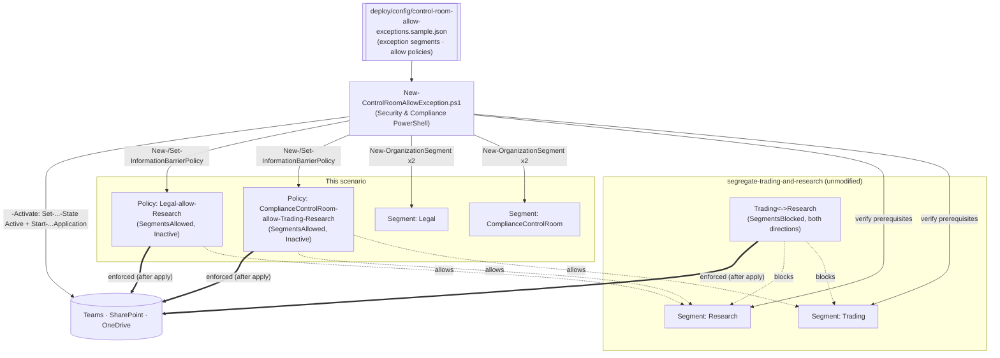

## 1. Scenario summary

A companion to `segregate-trading-and-research`: models **Allow**-type (`-SegmentsAllowed`)
information-barrier topologies that give a compliance/control-room function visibility into **both**
sides of an existing Trading/Research wall, plus a narrower, one-sided allow-list example (Legal, who
may reach Research but not Trading). Segments and policies are created **inactive** and reconciled
against config on every run, so a changing exception membership (a new control-room analyst) is a
config edit, not a manual portal click.

**Who it's for:** a compliance/IT team that already runs (or is deploying) an ethical wall and needs
to script the real-world exception every such wall eventually needs, someone who must legitimately
see across it, as a reviewable, auditable object instead of an ad-hoc bypass.

## 2. Business/regulatory driver

The same conflict-of-interest regime that requires the Trading/Research wall (**FINRA Rule 2241**,
**SEC Regulation AC**, **MiFID II** Art. 37, market-abuse rules) also expects firms to run a
**control room / compliance monitoring function** that can see across information barriers to
supervise them, a wall that is *not* independently supervisable is itself a control gap. Legal and
compliance functions also routinely need bounded, asymmetric access (e.g. counsel consulted by
Research on a specific matter, without a blanket exemption from the wall). Modeling both as
explicit, named Allow policies, rather than simply leaving the control room's segment unassigned to
any policy, gives an examiner a reviewable artifact for exactly who can cross the wall and why.

> ⚠️ **This changes live communication for the exception segments.** Activation restricts
> `ComplianceControlRoom`/`Legal` members to communicating *only* within their allowed segments (plus
> people outside IB entirely, per §11), it does not touch the `Trading`/`Research` wall itself. Stage
> inactive, review with `-DryRun`, and get Compliance/Legal sign-off before `-Activate`. See §11.

## 3. Prerequisites

Full licensing detail: `docs/licensing-matrix.md`. RBAC: `docs/rbac-model.md`. Automation surface:
`docs/automation-surface.md` (surface 1, Security & Compliance PowerShell). Summary:

| Requirement | Minimum | Notes |
|---|---|---|
| **Base scenario deployed** | `scenarios/information-barriers/segregate-trading-and-research/` | This scenario hard-fails if the `Trading`/`Research` segments don't already exist |
| Licensing | **M365 E5 / E5 Compliance / Insider Risk Management** or the **IB add-on** | Same entitlement as the base scenario [[7]](#references) |
| Role | **Information Barriers** roles / **Compliance Administrator** / **Organization Management** | To create segments, policies, and run application |
| Auth | `Connect-IPPSSession` (certificate app-only preferred) | Security & Compliance PowerShell, `docs/automation-surface.md` §3 |
| Directory data | A populated Entra attribute cleanly identifying each exception group | e.g. `Department -eq 'ComplianceControlRoom'` |
| IB mode | **SingleSegment**, not Legacy, not MultiSegment | Legacy mode + an Allow policy hides ALL non-IB users/groups from the assigned segment's members (a severe collateral impact); MultiSegment requires every tenant policy to be Allow-type, incompatible with the base scenario's Block policies. `Get-PolicyConfig` reports current mode; the deploy/validate scripts check and warn, see §11 |
| Groups | IB supports **Microsoft 365 Groups** only; DLs/Security Groups are non-IB | [[1]](#references) |

> Verify current entitlement names against `docs/licensing-matrix.md` before a sales commitment, SKU
> names change.

## 4. Architecture



`ComplianceControlRoom` is the classic "sees both sides" exception; `Legal` is a narrower, asymmetric
example (Research only). Both are Allow-type, so each is default-deny to everything **except** what's
listed, the `Trading`/`Research` Block wall itself is untouched. Full rationale: `design.md`.

## 5. Step-by-step implementation

### PowerShell path

```powershell
# Connect (certificate app-only preferred - docs/automation-surface.md §3)
Connect-IPPSSession -AppId $AppId -Certificate $Cert -Organization 'contoso.onmicrosoft.com'

# 0. Prerequisite: segregate-trading-and-research must already be deployed (Trading/Research segments exist)

# 1. Dry run, prints the exact New-/Set-OrganizationSegment / New-/Set-InformationBarrierPolicy cmdlets
./deploy/New-ControlRoomAllowException.ps1 -ConfigPath ./deploy/config/control-room-allow-exceptions.json -DryRun

# 2. Create/reconcile segments + allow policies, INACTIVE (no user impact), review before enforcing
./deploy/New-ControlRoomAllowException.ps1 -ConfigPath ./deploy/config/control-room-allow-exceptions.json

# 3. Validate the staged objects
./validate/Test-ControlRoomAllowException.ps1 -ConfigPath ./deploy/config/control-room-allow-exceptions.json

# 4. Activate + apply (restricts the exception segments to their allow-lists), after sign-off
./deploy/New-ControlRoomAllowException.ps1 -ConfigPath ./deploy/config/control-room-allow-exceptions.json -Activate

# 5. Validate enforced state
./validate/Test-ControlRoomAllowException.ps1 -ConfigPath ./deploy/config/control-room-allow-exceptions.json -RequireActive

# --- Later: add a segment to an existing allow-list (e.g. Legal must now also see Trading) ---
# Edit deploy/config/control-room-allow-exceptions.json: "Legal" -> "allows": ["Research", "Trading"]
./deploy/New-ControlRoomAllowException.ps1 -ConfigPath ./deploy/config/control-room-allow-exceptions.json -DryRun   # see the reconciliation diff
./deploy/New-ControlRoomAllowException.ps1 -ConfigPath ./deploy/config/control-room-allow-exceptions.json           # reconciles, leaves Inactive if it was Active
./deploy/New-ControlRoomAllowException.ps1 -ConfigPath ./deploy/config/control-room-allow-exceptions.json -Activate # reactivate + re-apply
```

### Portal reference

Segments and policies are visible in the [Microsoft Purview portal](https://purview.microsoft.com) →
**Information Barriers** → **Segments** / **Policies** / **Policy application**
[[1]](#references). `-WhatIf` is non-functional in S&C PowerShell, so the scripts ship a `-DryRun`.

## 6. Configuration reference

| Setting | Value this scenario uses | Notes |
|---|---|---|
| Segment cmdlet | `New-OrganizationSegment -Name -UserGroupFilter` | Same as the base scenario [[3]](#references) |
| Policy cmdlet (create) | `New-InformationBarrierPolicy -AssignedSegment -SegmentsAllowed -State Inactive` | Comma-separated list; cannot combine with `-SegmentsBlocked` [[4]](#references) |
| Policy cmdlet (reconcile) | `Set-InformationBarrierPolicy -Identity -SegmentsAllowed` | Set the policy **Inactive first** if it's Active before editing [[11]](#references) |
| Policy naming | `<assignedSegment>-allow-<allows, joined by '-'>` | e.g. `ComplianceControlRoom-allow-Trading-Research`, `Legal-allow-Research` |
| Allow-list shapes modeled | "Sees both sides" (`ComplianceControlRoom`) and "one-sided" (`Legal`) | Same mechanism, different `allows` list, the pattern generalizes to any number of exception segments |
| Activate | `Set-InformationBarrierPolicy -Identity <GUID> -State Active` | Then apply [[1]](#references) |
| Apply | `Start-InformationBarrierPoliciesApplication` | Async: ~30 min to start, ~5,000 users/hour; SharePoint up to 24h [[1]](#references) |
| Status | `Get-InformationBarrierPoliciesApplicationStatus` | Track application progress [[5]](#references) |
| Policy type immutability | Can't convert Allow<->Block in place | Deactivate + create a new policy of the other type instead [[11]](#references) |
| One policy per segment | Enforced by design | Never assign 2 policies to the same segment [[1]](#references) |

Exact cmdlet syntax and Learn sources are cited in each script's `.NOTES`.

## 7. Validation / how to prove it works

1. **Automated (staged)**, `./validate/Test-ControlRoomAllowException.ps1` confirms both prerequisite
   segments exist, both exception segments exist, both allow policies exist with the right assigned
   segment, and that each policy's live `SegmentsAllowed` set exactly matches config.
2. **Automated (enforced)**, after `-Activate`, re-run with `-RequireActive`; policies must be
   **Active** and an application run must have occurred.
3. **Real-world allow test**, after application completes, confirm a `ComplianceControlRoom` user
   **can** communicate with both a `Trading` and a `Research` user, and a `Legal` user **can**
   communicate with a `Research` user.
4. **Real-world scope test**, confirm a `Legal` user **cannot** communicate with a `Trading` user
   (the asymmetric allow-list is enforced, not just the union of everyone's access).
5. **No-collateral test**, confirm the `Trading`/`Research` wall itself still blocks as before (this
   scenario didn't weaken it), and that users outside IB entirely are unaffected.
6. **Reconciliation proof**, edit an `allows` list in config, re-run the deploy, and confirm the
   validate script's live-vs-desired check now passes for the new list (and that an initially-Active
   policy was left Inactive pending a fresh `-Activate`).
7. **Idempotency proof**, re-run the deploy with no config changes; segments/policies report
   `exists`/`already matches config` and nothing is duplicated or re-mutated.

## 8. Operations & tuning

**Signals:** `Get-InformationBarrierPoliciesApplicationStatus` (application completion/errors);
exception-segment membership counts (an exception segment that grows unexpectedly signals scope
creep in "who needs to see across the wall"); the validate script's live-vs-desired `SegmentsAllowed`
diff (a Fail here after a deploy means an edit didn't take, or was applied out of band via the
portal). **Tuning:** review exception-segment membership on the same cadence as the wall itself, 
every added member widens who can cross it. Treat a growing `ComplianceControlRoom` as a finding, not
a convenience: exceptions should be as narrow as the supervisory function actually requires (`Legal`'s
one-sided allow-list is the model to prefer over "sees everything" unless the role genuinely needs
both sides).

**Detecting misuse of the exception is out of this scenario's scope**, IB stops *unauthorized*
communication; whether an authorized `ComplianceControlRoom` member is *using* their cross-wall access
appropriately is a DLP/Activity Explorer/insider-risk concern layered on top, not an IB policy setting.

**Change management:** every allow-list edit is a Compliance/Legal-reviewable change (it's a
diffable JSON entry). Keep the config file under version control as the record of who has standing
cross-wall access and why, for audit/exam.

## 9. Rollback / decommission

See `rollback.md`. Quick reference: `./deploy/Remove-ControlRoomAllowException.ps1` sets the allow
policies **Inactive**; add `-Apply` to run the application so the exception is actually **revoked**;
add `-Delete` to remove the policies and exception segments. The `Trading`/`Research` wall itself is
never touched by this scenario's rollback.

## 10. Cost & licensing notes

- **No incremental licensing** beyond the base scenario's E5 / E5 Compliance / IRM / IB add-on
  entitlement [[7]](#references), exception segments/policies are additional objects under the same
  entitlement, not a separately metered capability.
- **Cost is operational discipline, not $.** The real cost is keeping exception-segment membership
  narrow and current, an over-broad or stale allow-list is a bigger risk to the wall's credibility
  than any licensing spend.
- **Reconciliation reduces portal drift risk.** Scripting the allow-list edit (vs. a manual portal
  change) keeps the config file as the single source of truth for who has cross-wall access.

## 11. Known limitations & gotchas

- **Additive only, does not create the wall.** This scenario hard-fails if `Trading`/`Research`
  don't already exist; it never creates or edits the base scenario's Block policies.
- **Activation affects live communication for the exception segments.** Restricts
  `ComplianceControlRoom`/`Legal` to their allow-lists once application completes, stage inactive,
  `-DryRun`, get sign-off first.
- **Editing an Active Allow policy requires deactivation first.** The deploy script does this
  automatically for a detected `SegmentsAllowed` drift and leaves the policy **Inactive**, you must
  re-run with `-Activate` to reactivate and re-apply; it never silently reactivates an edited policy.
- **Can't convert Allow<->Block on the same policy.** Changing a policy's *type* requires deactivating
  it and creating a new policy of the other type, not scripted here since this scenario only ever
  creates Allow-type policies [[11]](#references).
- **Legacy IB mode + an Allow policy hides non-IB users/groups from that segment's members, grounded,
  not a guess.** This is the single biggest gotcha in this scenario: in **Legacy** mode specifically
  (not SingleSegment, not MultiSegment), assigning an Allow policy to `ComplianceControlRoom`/`Legal`
  would hide **every** non-segmented user/group from that segment's members once applied, not just
  the segments left off the allow list. A control-room analyst could lose the ability to reach their
  own manager or IT helpdesk. `New-ControlRoomAllowException.ps1` and
  `validate/Test-ControlRoomAllowException.ps1` both check `Get-PolicyConfig` and warn (non-fatally)
  if the tenant is in Legacy mode, confirm/move to **SingleSegment** mode
  (`Set-PolicyConfig -InformationBarrierMode SingleSegment`) before activating this scenario
  [[2]](#references).
- **VERIFY (pilot tenant):** whether `Set-InformationBarrierPolicy -SegmentsAllowed` fully **replaces**
  the allowed-segment list or **merges** with the existing one. Microsoft's own worked example shows
  setting a single new value but doesn't state replace-vs-merge semantics explicitly.
  `deploy/New-ControlRoomAllowException.ps1` always sends the complete desired list (assumes replace)
  rather than guessing merge behavior, confirm before relying on this for partial/incremental
  updates in a pilot tenant.
- **MultiSegment mode is incompatible with this composition as designed.** MultiSegment mode requires
  **every** policy in the tenant to be Allow-type, configuring even one Block policy (as
  `Trading`/`Research` does) breaks it. This scenario deliberately requires SingleSegment mode
  (one segment per user); it does **not** support a person belonging to both `Trading` and
  `ComplianceControlRoom` simultaneously. A future migration to an all-Allow-policy model would be a
  rebuild of the base scenario, not an extension of it, see `design.md` §6.
- **Mixing Allow-type and Block-type policies across different segments is grounded in Microsoft's own
  worked example (a third "compatible" segment alongside two mutually-blocked segments,
  [[1]](#references)), not independently confirmed against a live tenant in this build.** The
  mechanics (each policy type only restricts its own assigned segment; an unlisted segment is
  unaffected by a policy that doesn't name it) are documented per-cmdlet, but this exact 3-segment
  composition (two Block-walled segments plus a third Allow-type segment reaching both) has not been
  pilot-tested here, validate in a pilot tenant before a customer-facing deployment.
- **`-WhatIf` is non-functional in S&C PowerShell**, the scripts ship a `-DryRun` instead.
- **Application is async and delayed.** ~30 min to start, ~5,000 users/hour; SharePoint/OneDrive
  enforcement up to 24 hours after activation [[1]](#references).
- **Groups: M365 Groups only.** DLs and Security Groups are treated as non-IB [[1]](#references).
- **Illustrative values.** Segment attributes, filters, and names are placeholders, set them to your
  real directory data, validated by Compliance, before activating.

## 12. References

1. Get started with Information Barriers (Allow/Block policies, one-policy-per-segment, and the compatible-third-segment worked example), <https://learn.microsoft.com/purview/information-barriers-policies>
2. Use multi-segment support in Information Barriers (IB modes, segment limits, "configuring any Block policy breaks multi-segment"; Legacy mode + Allow policy hides non-IB users/groups from the assigned segment, unlike SingleSegment/MultiSegment), <https://learn.microsoft.com/purview/information-barriers-multi-segment>
3. New-OrganizationSegment (`-UserGroupFilter`), <https://learn.microsoft.com/powershell/module/exchangepowershell/new-organizationsegment>
4. New-InformationBarrierPolicy (`-AssignedSegment`, `-SegmentsAllowed`/`-SegmentsBlocked`, cannot combine, `-State`), <https://learn.microsoft.com/powershell/module/exchangepowershell/new-informationbarrierpolicy>
5. Start-InformationBarrierPoliciesApplication / Get-InformationBarrierPoliciesApplicationStatus, <https://learn.microsoft.com/powershell/module/exchangepowershell/start-informationbarrierpoliciesapplication>
6. Attributes for information barrier policies, <https://learn.microsoft.com/purview/information-barriers-attributes>
7. Microsoft Purview service description, Information Barriers licensing, <https://learn.microsoft.com/office365/servicedescriptions/microsoft-365-service-descriptions/microsoft-365-tenantlevel-services-licensing-guidance/microsoft-purview-service-description>
8. Use Information Barriers with SharePoint (enablement, 24h propagation), <https://learn.microsoft.com/purview/information-barriers-sharepoint>
9. Information Barriers in Microsoft Teams (block/allow behavior), <https://learn.microsoft.com/purview/information-barriers-teams>
10. Resolve communication issues in Information Barriers (troubleshooting), <https://learn.microsoft.com/troubleshoot/microsoft-365/purview/information-barriers/information-barriers-troubleshooting>
11. Manage/edit segments and policies (deactivate-before-edit workflow; can't change policy type in place; Set-InformationBarrierPolicy `-SegmentsAllowed`/`-SegmentsBlocked`), <https://learn.microsoft.com/purview/information-barriers-edit-segments-policies>
12. Get-PolicyConfig / Set-PolicyConfig (`-InformationBarrierMode`: Legacy/SingleSegment/MultiSegment), <https://learn.microsoft.com/powershell/module/exchangepowershell/get-policyconfig>

> Re-verify all links, cmdlet parameters, licensing, IB modes, and the replace-vs-merge
> `-SegmentsAllowed` semantics against current Microsoft Learn (and a pilot tenant) before a
> customer-facing deployment. Activation changes live communication for the exception segments, 
> stage inactive, review, and get Compliance/Legal sign-off first.
