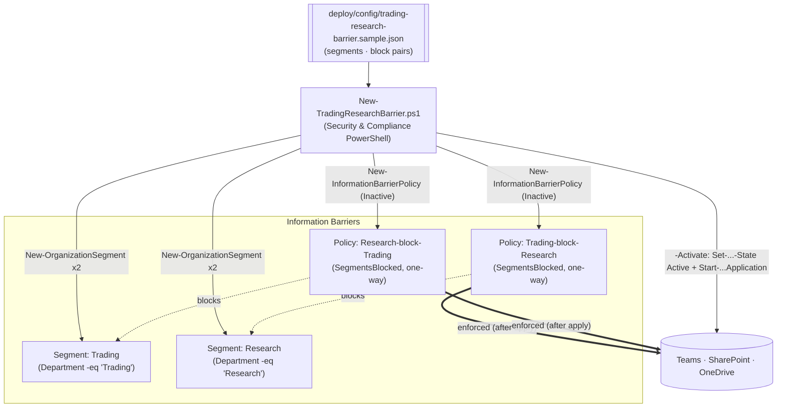

## 1. Scenario summary

Builds a Microsoft Purview **Information Barriers** "ethical wall" that blocks communication and
collaboration between the **Trading** desk and **Research** — as code, via Security & Compliance
PowerShell. It defines an organization **segment** per side (from a Microsoft Entra attribute) and the
**two one-way block policies** that fully wall them off, then (only on an explicit `-Activate`)
activates and applies them across Teams, SharePoint, and OneDrive. Segments and policies are created
**inactive** by default so they can be reviewed before anyone's communication is affected.

**Who it's for:** a compliance/IT team at a regulated financial firm (broker-dealer, investment bank,
asset manager) that must enforce a conflict-of-interest wall between market-facing and research/
advisory functions and wants the segmentation and policies defined, reviewed, and deployed as
reproducible code.

## 2. Business/regulatory driver

An **ethical wall** (historically "Chinese wall") between research and trading/sales is a core
conflict-of-interest control in financial services. **FINRA Rule 2241** (research analysts and
conflicts) and **SEC Regulation AC**, the **Global Research Analyst Settlement**, **MiFID II** (Art.
37 organizational requirements / conflicts of interest), and **market-abuse rules (MAR)** all require
firms to prevent inappropriate information flow between people who produce research and people who
trade or sell. Purview Information Barriers enforce this in the collaboration layer: once applied,
users in incompatible segments **can't chat/call in Teams, can't be added to the same 1:1/group
conversations, and can't access each other's SharePoint/OneDrive content**. Managing the wall as code
makes the segmentation and policy set reproducible, reviewable, and auditable — which is exactly what
a compliance examiner or internal audit will probe.

> ⚠️ **Applying an ethical wall changes live communication.** Activation blocks Teams chat/calls and
> SharePoint/OneDrive collaboration between the two sides and can remove users from existing chats.
> Stage the segments/policies **inactive**, review with `-DryRun`, and get Compliance/Legal sign-off
> before `-Activate`. See §11.

## 3. Prerequisites

Full licensing detail: `docs/licensing-matrix.md`. RBAC: `docs/rbac-model.md`. Automation surface:
`docs/automation-surface.md` (surface 1 — Security & Compliance PowerShell). Summary:

| Requirement | Minimum | Notes |
|---|---|---|
| Licensing | **M365 E5 / E5 Compliance / Insider Risk Management** or the **IB add-on** | Information Barriers is an E5-tier capability [[7]](#references) |
| Role | **Information Barriers** roles / **Compliance Administrator** / **Organization Management** | To create segments, policies, and run application |
| Auth | `Connect-IPPSSession` (certificate app-only preferred) | Security & Compliance PowerShell — `docs/automation-surface.md` §3 |
| Directory data | A populated **Entra attribute** (e.g. `Department`) that cleanly separates the two sides | Segments are attribute-driven; no user may be in both sides [[6]](#references) |
| Groups | IB supports **Microsoft 365 Groups** only; DLs/Security Groups are non-IB | [[1]](#references) |
| Scoping directory sync | Address book policy / directory segmentation may be needed for full GAL separation | Beyond this scenario's core; see IB docs |

> Verify current entitlement names against `docs/licensing-matrix.md` (dated 2026-09-02) before a
> sales commitment — SKU names change.

## 4. Architecture



Two segments (one per side) and **two one-way block policies** — a full wall needs both directions,
because a single policy blocks one way only. Objects are created inactive; a separate, explicit
activation + tenant-wide application step enforces them. Full rationale: `design.md`.

## 5. Step-by-step implementation

### PowerShell path

```powershell
# Connect (certificate app-only preferred - docs/automation-surface.md §3)
Connect-IPPSSession -AppId $AppId -Certificate $Cert -Organization 'contoso.onmicrosoft.com'

# 1. Dry run — prints the exact New-OrganizationSegment / New-InformationBarrierPolicy cmdlets
./deploy/New-TradingResearchBarrier.ps1 -ConfigPath ./deploy/config/trading-research-barrier.json -DryRun

# 2. Create segments + block policies, INACTIVE (no user impact) — review before enforcing
./deploy/New-TradingResearchBarrier.ps1 -ConfigPath ./deploy/config/trading-research-barrier.json

# 3. Validate the staged objects
./validate/Test-TradingResearchBarrier.ps1 -ConfigPath ./deploy/config/trading-research-barrier.json

# 4. Activate + apply (BLOCKS live communication) — after Compliance/Legal sign-off
./deploy/New-TradingResearchBarrier.ps1 -ConfigPath ./deploy/config/trading-research-barrier.json -Activate

# 5. Validate enforced state
./validate/Test-TradingResearchBarrier.ps1 -ConfigPath ./deploy/config/trading-research-barrier.json -RequireActive
```

### Portal reference

Segments and policies are visible in the [Microsoft Purview portal](https://purview.microsoft.com) →
**Information Barriers** → **Segments** / **Policies** / **Policy application** [[1]](#references).
`-WhatIf` is non-functional in S&C PowerShell, so the scripts ship a `-DryRun`.

## 6. Configuration reference

| Setting | Value this scenario uses | Notes |
|---|---|---|
| Segment cmdlet | `New-OrganizationSegment -Name -UserGroupFilter` | Attribute filter, e.g. `"Department -eq 'Trading'"` [[3]](#references) |
| Policy cmdlet | `New-InformationBarrierPolicy -AssignedSegment -SegmentsBlocked -State Inactive` | One-way block; `-SegmentsAllowed` for allow-lists [[4]](#references) |
| Policy naming | `<assigned>-block-<blocks>` | e.g. `Trading-block-Research` |
| Directions | Two policies (Trading→Research, Research→Trading) | A full wall needs both [[1]](#references) |
| Activate | `Set-InformationBarrierPolicy -Identity <GUID> -State Active` | Then apply [[1]](#references) |
| Apply | `Start-InformationBarrierPoliciesApplication` | Async: ~30 min to start, ~5,000 users/hour; SharePoint up to 24h [[1]](#references) |
| Status | `Get-InformationBarrierPoliciesApplicationStatus` | Track application progress [[5]](#references) |
| One policy per segment | Enforced by design | Never assign 2 policies to the same segment [[1]](#references) |

Exact cmdlet syntax and Learn sources are cited in each script's `.NOTES`.

## 7. Validation / how to prove it works

1. **Automated (staged)** — `./validate/Test-TradingResearchBarrier.ps1` confirms both segments exist,
   both block policies exist and are assigned to the right segment, and reports application status.
2. **Automated (enforced)** — after `-Activate`, re-run with `-RequireActive`; policies must be
   **Active** and an application run must have occurred.
3. **Real-world block test** — after application completes (~30 min; up to 24h for SharePoint), confirm
   a **Trading** user and a **Research** user **cannot** start a Teams chat/call, can't be added to the
   same conversation, and can't access each other's OneDrive/associated SharePoint content
   [[8]](#references)[[9]](#references).
4. **No-collateral test** — confirm users **within** each segment, and users **outside** IB entirely,
   still communicate as expected (the wall is between the two sides, not a blanket block).
5. **Idempotency proof** — re-run the deploy; segments/policies report `exists` and nothing is
   duplicated.

## 8. Operations & tuning

**Signals:** `Get-InformationBarrierPoliciesApplicationStatus` (application completion/errors);
segment membership counts (a segment that suddenly covers too many/too few users signals an attribute
data problem); IB troubleshooting cmdlets for "communication allowed when it should be blocked"
[[10]](#references). **Tuning:** keep segments **mutually exclusive** — a user who ends up in both
Trading and Research breaks the wall; audit the source attribute regularly. New joiners/movers get
walled automatically as their attribute changes and the next application runs, so keep the attribute
authoritative and re-apply on cadence.

**Change management:** activation is a controlled, Compliance/Legal-approved change (it removes people
from conversations). Communicate before enforcing. Keep the config file under version control as the
record of the wall's definition for audit/exam.

## 9. Rollback / decommission

See `rollback.md`. Quick reference: `./deploy/Remove-TradingResearchBarrier.ps1` sets the policies
**Inactive**; add `-Apply` to run the application so the wall is actually **lifted**; add `-Delete` to
remove the policies and segments. Lifting an ethical wall re-enables communication that may carry
regulatory obligations — do it only with Compliance/Legal confirmation.

## 10. Cost & licensing notes

- **Per-user E5 entitlement**, no Azure consumption meter. Information Barriers is E5 / E5 Compliance /
  IRM / IB add-on [[7]](#references).
- **Cost is licensing + operational care.** The real operating cost is keeping the segmentation
  attribute accurate and handling exceptions (e.g. a compliance officer who must see both sides) —
  model those as their own segments/policies rather than ad-hoc bypasses.
- **Collateral-impact risk, not $ risk, is the thing to manage** — an over-broad or mis-attributed
  segment blocks people who shouldn't be blocked (§11).

## 11. Known limitations & gotchas

- **Activation affects live communication.** Enforcing the wall blocks Teams chat/calls and SharePoint/
  OneDrive collaboration between the sides and can remove users from existing chats. Stage inactive,
  `-DryRun`, get sign-off, communicate to users, then `-Activate` [[8]](#references).
- **Two policies for a full wall.** One `-SegmentsBlocked` policy blocks a single direction; both
  directions are required to fully segregate — the scenario's `blockPairs` encodes both [[1]](#references).
- **One policy per segment.** Never assign more than one IB policy to the same segment [[1]](#references).
- **Mutually-exclusive segments.** A user in both Trading and Research defeats the wall — segments must
  be exclusive; audit the source attribute [[6]](#references).
- **`-WhatIf` is non-functional in S&C PowerShell** — the scripts ship a `-DryRun` instead.
- **Application is async and delayed.** ~30 min to start, ~5,000 users/hour; SharePoint/OneDrive
  enforcement up to 24 hours after activation — don't expect instant blocking [[1]](#references).
- **Groups: M365 Groups only.** DLs and Security Groups are treated as non-IB [[1]](#references).
- **Modes matter.** Legacy vs. SingleSegment vs. MultiSegment mode changes segment limits (250 vs.
  5,000), whether a user can be in multiple segments, and how non-IB users are treated for allow
  policies — this scenario uses block policies (recommended) and two exclusive segments, which behaves
  consistently, but confirm your tenant's IB mode [[2]](#references).
- **SharePoint/OneDrive needs enabling.** IB for SharePoint/OneDrive is a separate enablement step
  beyond the Teams wall — see the SharePoint IB guidance if file-level segregation is required
  [[8]](#references).
- **Idempotency is create-or-report.** The deploy locates objects by name and does not silently mutate
  an existing segment/policy — edit deliberately.
- **Illustrative values.** Segment attributes, filters, and names are placeholders — set them to your
  real directory data and desegregation obligation, validated by Compliance, before activating.

## 12. References

1. Get started with Information Barriers (segments, block/allow policies, apply, one-policy-per-segment) — <https://learn.microsoft.com/purview/information-barriers-policies>
2. Use multi-segment support in Information Barriers (IB modes, segment limits) — <https://learn.microsoft.com/purview/information-barriers-multi-segment>
3. New-OrganizationSegment (`-UserGroupFilter`) — <https://learn.microsoft.com/powershell/module/exchangepowershell/new-organizationsegment>
4. New-InformationBarrierPolicy (`-AssignedSegment`, `-SegmentsBlocked`/`-SegmentsAllowed`, `-State`) — <https://learn.microsoft.com/powershell/module/exchangepowershell/new-informationbarrierpolicy>
5. Start-InformationBarrierPoliciesApplication / Get-InformationBarrierPoliciesApplicationStatus — <https://learn.microsoft.com/powershell/module/exchangepowershell/start-informationbarrierpoliciesapplication>
6. Attributes for information barrier policies — <https://learn.microsoft.com/purview/information-barriers-attributes>
7. Microsoft Purview service description — Information Barriers licensing — <https://learn.microsoft.com/office365/servicedescriptions/microsoft-365-service-descriptions/microsoft-365-tenantlevel-services-licensing-guidance/microsoft-purview-service-description>
8. Use Information Barriers with SharePoint (enablement, 24h propagation, app-only bypass) — <https://learn.microsoft.com/purview/information-barriers-sharepoint>
9. Information Barriers in Microsoft Teams (block behavior) — <https://learn.microsoft.com/purview/information-barriers-teams>
10. Resolve communication issues in Information Barriers (troubleshooting) — <https://learn.microsoft.com/troubleshoot/microsoft-365/purview/information-barriers/information-barriers-troubleshooting>
11. Manage / edit segments and policies (deactivate, remove) — <https://learn.microsoft.com/purview/information-barriers-edit-segments-policies>

> Re-verify all links, cmdlet parameters, licensing, IB modes, and the propagation timings against
> current Microsoft Learn before a customer-facing deployment. Activation changes live communication —
> stage inactive, review, and get Compliance/Legal sign-off first.
