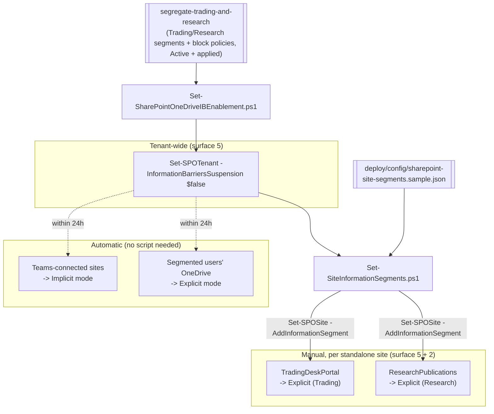

## 1. Scenario summary

Extends an existing Microsoft Purview **Information Barriers** ethical wall, built by
`../segregate-trading-and-research/`, from Teams-only enforcement to **SharePoint and OneDrive**
file access and sharing. Enables the single tenant-wide switch that turns on IB for SharePoint/
OneDrive, then associates the wall's segments with the specific standalone SharePoint sites that
need Explicit-mode protection. Teams-connected sites and segmented users' own OneDrive protect
themselves automatically once the switch is on, this scenario scripts what's genuinely manual.

**Who it's for:** the same compliance/IT team that deployed `segregate-trading-and-research` and
needs the wall to also cover file collaboration, not just chat/calls, a gap that scenario's own
`README.md` §11 flags explicitly as a required follow-up before the wall is complete.

## 2. Business/regulatory driver

Same drivers as the parent scenario, **FINRA Rule 2241**, **SEC Regulation AC**, the **Global
Research Analyst Settlement**, **MiFID II** Art. 37, and market-abuse rules (MAR), extended to the
collaboration surface where the actual work product (research notes, trade blotters, pitch decks)
lives: SharePoint and OneDrive. A wall that blocks Teams chat but leaves SharePoint sites and
OneDrive shares open is not a wall an examiner would accept; Microsoft documents SharePoint/
OneDrive coverage as a distinct, required configuration step for exactly this reason
.

> ⚠️ **Enabling this switch changes live SharePoint/OneDrive access and sharing behavior**, and
> associating a segment with a site immediately narrows who can access or be added to it. Confirm
> the parent scenario's IB policies are Active and applied (24h propagated) first, and review the
> configured site list with the same Compliance/Legal sign-off used for the parent scenario's
> `-Activate` step. See §11.

## 3. Prerequisites

Full licensing detail: [Licensing matrix](/docs/licensing-matrix/). RBAC: [RBAC model](/docs/rbac-model/). Automation surface:
[Automation surface](/docs/automation-surface/) (surfaces 2 and 5, see §5 below). Summary:

| Requirement | Minimum | Notes |
|---|---|---|
| Parent scenario | `../segregate-trading-and-research/` deployed, `-Activate`d, and 24h propagated | Microsoft requires IB policies to be Active and applied *before* enabling SharePoint/OneDrive IB |
| Licensing | **M365 E5 / E5 Compliance / Insider Risk Management** or the **IB add-on** | Same entitlement as the parent scenario, no separate SKU for SharePoint/OneDrive coverage |
| Role | **SharePoint Administrator** or **Global Administrator** | Required for both tenant enablement and per-site segment management |
| Auth (surface 5) | `Connect-SPOService` (certificate app-only preferred) | SharePoint Online Management Shell, [Automation surface §3](/docs/automation-surface/#3-authentication-patterns-interactive-vs-unattended). **Windows-only**: no documented cross-platform path for this surface, §6 |
| Auth (surface 2) | `Connect-IPPSSession` (certificate app-only preferred) | To resolve segment names to GUIDs via `Get-OrganizationSegment`, [Automation surface §3](/docs/automation-surface/#3-authentication-patterns-interactive-vs-unattended) |
| Module | `Microsoft.Online.SharePoint.PowerShell` | Windows PowerShell 5.1-native; PowerShell 7 needs `-UseWindowsPowerShell`, [Automation surface §2](/docs/automation-surface/#2-module-install) |

> Verify current entitlement names against [Licensing matrix](/docs/licensing-matrix/) (dated 2026-09-02) before a
> sales commitment, SKU names change.

## 4. Architecture



Enablement is one tenant-wide switch; from there, Teams-connected sites and OneDrive protect
themselves automatically, while standalone SharePoint sites need an explicit segment association.
Full rationale: `design.md`.

## 5. Step-by-step implementation

### PowerShell path

```powershell
# Connect both surfaces (certificate app-only preferred - docs/automation-surface.md Section 3)
Connect-IPPSSession -AppId $AppId -Certificate $Cert -Organization 'contoso.onmicrosoft.com'
Connect-SPOService -Url https://contoso-admin.sharepoint.com -ClientId $AppId -Certificate $Cert

# 0. Confirm the parent scenario's policies are Active and applied (24h propagated)
../segregate-trading-and-research/validate/Test-TradingResearchBarrier.ps1 -RequireActive

# 1. Dry run, tenant enablement
./deploy/Set-SharePointOneDriveIBEnablement.ps1 -DryRun

# 2. Enable SharePoint/OneDrive IB tenant-wide (~1 hour to take effect)
./deploy/Set-SharePointOneDriveIBEnablement.ps1

# 3. Dry run, site segment association
./deploy/Set-SiteInformationSegments.ps1 -ConfigPath ./deploy/config/sharepoint-site-segments.json -DryRun

# 4. Associate segments with the configured standalone sites
./deploy/Set-SiteInformationSegments.ps1 -ConfigPath ./deploy/config/sharepoint-site-segments.json

# 5. Validate
./validate/Test-SharePointOneDriveInformationBarrierSetup.ps1 -ConfigPath ./deploy/config/sharepoint-site-segments.json
```

### Portal reference

Segments-per-site are visible in the [SharePoint admin center](https://admin.microsoft.com) →
**Active sites** → select a site → **Settings** tab; the tenant-wide switch has no portal toggle, 
it's SharePoint Online Management Shell only. `-WhatIf` is non-functional in
this module, so both scripts ship a `-DryRun`.

## 6. Configuration reference

| Setting | Value this scenario uses | Notes |
|---|---|---|
| Tenant enablement | `Set-SPOTenant -InformationBarriersSuspension $false` | Enables SharePoint **and** OneDrive IB together, cannot be enabled separately |
| Tenant suspend (rollback) | `Set-SPOTenant -InformationBarriersSuspension $true` | Tenant-wide; drops enforcement on Teams-Implicit sites too, §9/§11 |
| Segment lookup | `Get-OrganizationSegment \| ft Name, EXOSegmentID` | Security & Compliance PowerShell (surface 2); this scenario's scripts also fall back to `.Guid`, §11 |
| Add segment to site | `Set-SPOSite -Identity <url> -AddInformationSegment <GUID>` | Sets the site's mode to Explicit; up to 100 compatible segments per site |
| Remove segment from site | `Set-SPOSite -Identity <url> -RemoveInformationSegment <GUID>` | Reverts to Open if it was the site's last segment |
| Read site segments | `Get-SPOSite -Identity <url> \| Select InformationSegment` | Returns associated segment GUIDs |
| Read site IB mode | `Get-SPOSite -Identity <url> \| Select InformationBarriersMode` | `Open` / `Owner Moderated` / `Implicit` / `Explicit` |
| App-only bypass (not enabled by default) | `Set-SPOTenant -AppBypassInformationBarriers $true` | Opt-in; widens the wall's exceptions, §11 |

Exact cmdlet syntax and Learn sources are cited in each script's `.NOTES`.

## 7. Validation / how to prove it works

1. **Automated**, `./validate/Test-SharePointOneDriveInformationBarrierSetup.ps1` confirms tenant
 enablement (where `Get-SPOTenant` exposes the property, §11) and that each configured site is
 Explicit-mode with the right segments associated.
2. **Real-world block test**, after propagation (~1 hour tenant-wide; allow up to 24h for a given
 site/OneDrive), confirm a Trading user cannot access or be shared into `ResearchPublications`
 and vice versa, and that neither can access the other's OneDrive content
.
3. **Teams/OneDrive auto-coverage spot check**, confirm a Teams-connected site tied to the
 Trading or Research group shows `InformationBarriersMode = Implicit` and a segmented user's
 OneDrive shows `Explicit` within 24h of enablement, with no manual script run against either
.
4. **No-collateral test**, confirm a non-segmented site/user, and a site associated with a
 segment compatible with both sides (e.g. a hypothetical HR segment), still work as expected.
5. **Idempotency proof**, re-run both deploy scripts; already-enabled/already-associated state is
 reported, not re-applied.

## 8. Operations & tuning

**Signals:** the seven audit activities Microsoft documents for SharePoint IB, enabling/disabling
tenant-wide, and applying/changing/removing a segment or IB mode on a site, are logged and visible
via the Microsoft Purview portal audit log; the exact `Search-UnifiedAuditLog`
`RecordType`/`Operations` values for scripted export aren't confirmed in this build (§11, a
follow-up shared with the parent scenario's own open audit-trail item). **Tuning:** re-run
`Set-SiteInformationSegments.ps1` whenever a new standalone site is provisioned for either side, 
this scenario does not auto-discover new sites (`design.md` §6); use the Information Barriers
policy compliance report to catch sites that fall out of compliance after a segment/policy change
.

**Change management:** treat both the tenant-enablement step and each site association with the
same Compliance/Legal sign-off used for the parent scenario's `-Activate`, associating a segment
with a live, in-use site immediately narrows who can access it.

## 9. Rollback / decommission

See `rollback.md`. Quick reference: `./deploy/Set-SiteInformationSegments.ps1 -RemoveConfigured`
removes this scenario's own site associations (sites revert to Open if that was their last
segment); `./deploy/Set-SharePointOneDriveIBEnablement.ps1 -Suspend` suspends the tenant-wide
switch, **only for a full decommission**, since it also drops enforcement on the Teams-Implicit
sites the parent scenario protects.

## 10. Cost & licensing notes

- **No separate meter or SKU.** SharePoint/OneDrive IB coverage is part of the same E5 / E5
 Compliance / IRM / IB add-on entitlement as the parent scenario, enabling it doesn't add cost
.
- **Operating cost is curation, not licensing.** The real ongoing cost is keeping the standalone-
 site list current as new sites are provisioned, Teams-connected sites and OneDrive need no
 ongoing attention once enabled.

## 11. Known limitations & gotchas

- **Single switch for both services.** SharePoint and OneDrive IB are enabled/suspended together, 
 you cannot turn on one without the other.
- **Prerequisite ordering matters.** Enable this only after the parent scenario's segments/
 policies are Active, applied, and given 24h to propagate, enabling first has nothing to enforce
.
- **Suspending is tenant-wide.** `-Suspend` drops IB enforcement for **every** SharePoint site and
 **every** OneDrive account, including the Teams-Implicit sites the parent scenario's wall
 already covers, prefer `-RemoveConfigured` for anything short of a full decommission (§9,
 `reviews.md` Red Team finding 2).
- **Surface 5 is Windows-only.** `Microsoft.Online.SharePoint.PowerShell` has no documented
 cross-platform path; a CI/CD pipeline needs a Windows runner for this scenario's steps
 ([Automation surface §6](/docs/automation-surface/#6-cicd-and-unattended-execution-guidance)).
- **Two automation surfaces in one workflow.** `Set-SiteInformationSegments.ps1` needs both
 `Connect-SPOService` (surface 5) and `Connect-IPPSSession` (surface 2) connected, the first
 scenario in this library to require both together.
- **`-WhatIf` is non-functional** in the SharePoint Online Management Shell, both scripts ship a
 `-DryRun` instead.
- **VERIFY (pilot tenant):** whether `Get-SPOTenant`'s returned object exposes
 `InformationBarriersSuspension`, its own Microsoft Learn reference documents no output
 properties beyond storage/site-creation settings, unlike `Set-SPOTenant`'s explicit parameter
 documentation. The enablement script degrades to "unknown, set explicitly" rather than assuming
 the property is present.
- **VERIFY (pilot tenant):** which property name `Get-OrganizationSegment` actually exposes for a
 segment's GUID in this context, Microsoft's SharePoint-association worked example uses
 `EXOSegmentId`; `segregate-trading-and-research`'s own scripts use `.Guid` for the same cmdlet's
 output. Both scripts here try `EXOSegmentId` first and fall back to `.Guid`.
- **VERIFY (pilot tenant or a future Microsoft Learn pass):** `Set-SPOTenant
 -DefaultOneDriveInformationBarrierMode`'s accepted values and exact effect, the fetched
 reference documents the parameter (type `String`) but not its value set; not scripted here
 (`design.md` §6).
- **Teams-connected sites aren't directly manageable.** A SharePoint Administrator can't set
 segments on an Implicit-mode site; out-of-compliance Teams sites are fixed by correcting the
 Team's membership instead.
- **Illustrative values.** Site URLs and segment assignments in the sample config are placeholders
, set them to your real site inventory, validated by Compliance, before running against a
 tenant.

## 12. References

1. Use Information Barriers with SharePoint (enablement, site/segment association, modes, audit activities, suspend), <https://learn.microsoft.com/purview/information-barriers-sharepoint>
2. Get started with Information Barriers, Step 5 (SharePoint/OneDrive configuration overview), <https://learn.microsoft.com/purview/information-barriers-policies#step-5-configure-information-barriers-on-sharepoint-and-onedrive>
3. Set-SPOTenant (`-InformationBarriersSuspension`, `-IBImplicitGroupBased`, `-AppBypassInformationBarriers`, `-DefaultOneDriveInformationBarrierMode`), <https://learn.microsoft.com/powershell/module/microsoft.online.sharepoint.powershell/set-spotenant>
4. Set-SPOSite (`-InformationBarriersMode`), <https://learn.microsoft.com/powershell/module/microsoft.online.sharepoint.powershell/set-sposite>
5. Get-SPOTenant reference (no documented parameters; output properties not exhaustively listed), <https://learn.microsoft.com/powershell/module/microsoft.online.sharepoint.powershell/get-spotenant>
6. `../segregate-trading-and-research/`, the parent scenario this one extends (segments, block policies, activation).
7. Microsoft Purview service description, Information Barriers licensing, <https://learn.microsoft.com/office365/servicedescriptions/microsoft-365-service-descriptions/microsoft-365-tenantlevel-services-licensing-guidance/microsoft-purview-service-description>
8. Use Information Barriers with SharePoint, Explicit mode access/sharing behavior, <https://learn.microsoft.com/purview/information-barriers-sharepoint#explicit-mode>
9. Use Information Barriers with OneDrive (modes, automatic Explicit-mode protection within 24h), <https://learn.microsoft.com/purview/information-barriers-onedrive>
10. Use Information Barriers with SharePoint, Auditing (the seven logged activities), <https://learn.microsoft.com/purview/information-barriers-sharepoint#auditing>
11. Learn how to create an Information Barriers policy compliance report in PowerShell, <https://learn.microsoft.com/purview/information-barriers-sharepoint-report>

> Re-verify all links, cmdlet parameters, property names (§11 VERIFY items), and propagation
> timings against current Microsoft Learn before a customer-facing deployment. Both enabling the
> tenant switch and associating a segment with a live site change real access/sharing behavior, 
> stage with `-DryRun`, review, and get Compliance/Legal sign-off first.
