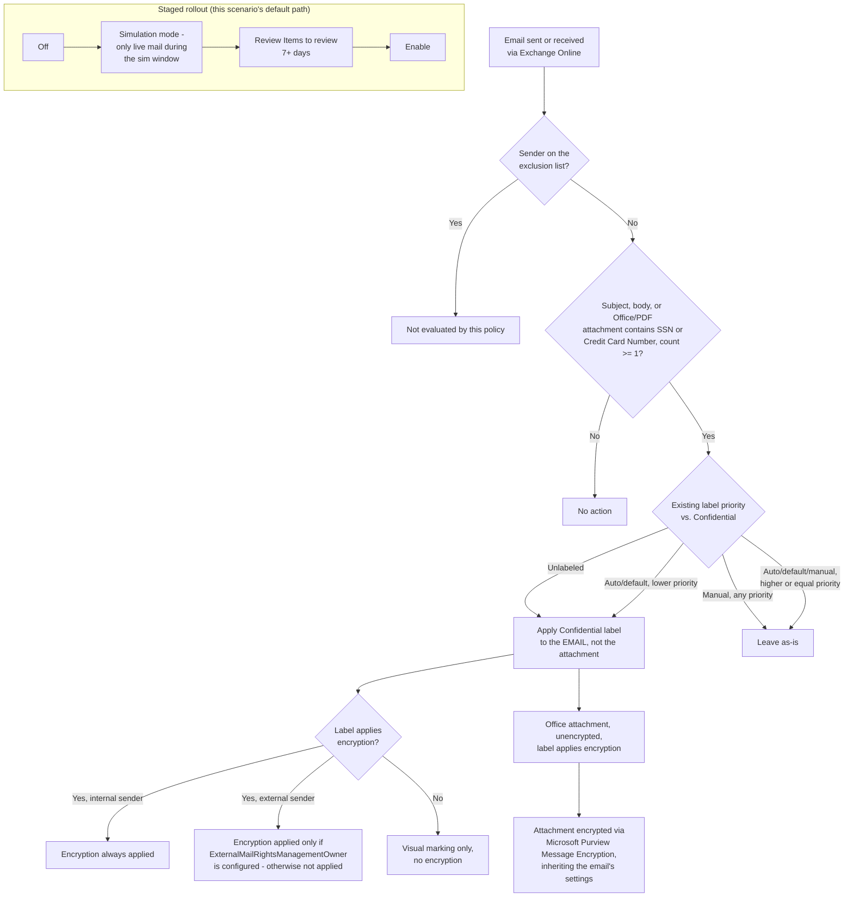

## 1. Problem statement

[`information-protection/auto-label-confidential-sharepoint`](/scenarios/information-protection/auto-label-confidential-sharepoint/) closes the classification
gap for data **at rest** in SharePoint and OneDrive. It explicitly does not cover Exchange
(`design.md` §7 of that scenario), even though the exact same policy family
(`New-AutoSensitivityLabelPolicy` / `New-AutoSensitivityLabelRule`) supports an Exchange location
and workload. Email is a distinct, high-volume exfiltration channel for the same regulated PII
(SSNs, card numbers) this library already protects in SharePoint/OneDrive and blocks in Teams
([`dlp/pci-teams-exfil-block`](/scenarios/dlp/pci-teams-exfil-block/)) — an enterprise that has closed the file-storage gap but
not the email gap still has an unlabeled, unclassified channel for the same data leaving the
tenant every day. This scenario closes that gap.

Exchange auto-labeling is **not** a smaller version of the SharePoint/OneDrive scenario copy-pasted
with a different workload value — it evaluates content in transit, not at rest, has a materially
different failure/observability surface, and different encryption and location-scoping semantics.
Those differences, not just the shared cmdlet family, are what this design document exists to
capture precisely rather than paper over.

## 2. Design goals

1. Apply the same **Confidential** label automatically to email (subject/body/attachments
   evaluated for conditions) containing SSNs or credit card numbers, as messages are sent and
   received, without requiring any user action.
2. Reuse the override-safety guarantees already established for the sibling scenario: never
   override a manually applied label; only override a lower-priority, previously auto-applied or
   default label.
3. Exclude a nominated set of mailboxes (e.g., a legal/eDiscovery holding mailbox or a Legal
   distribution list whose outbound mail must not be silently encrypted/relabeled mid-matter) —
   the email-transit equivalent of the sibling scenario's excluded SharePoint site, expressed
   through the parameter Exchange auto-labeling policies actually expose for this, which is
   sender-based, not location-URL-based (§4).
4. Idempotent and re-runnable: running the deploy script twice must not create duplicate policies
   or rules.
5. Ship "off" by default: simulation mode first, matching `AGENTS.md` §4 and this library's
   established precedent.
6. Document — rather than silently omit — the operational differences from the SharePoint/OneDrive
   sibling scenario a buyer would otherwise discover the hard way: no "Labeled items" dashboard
   coverage for Exchange, a different simulation semantics, and an in-transit-only evaluation model
   with no backlog/existing-mailbox coverage.

## 3. Why one rule, not two, and why the exclusion mechanism differs from the sibling scenario

- **One rule, one workload.** The sibling scenario needs two rules because
  `New-AutoSensitivityLabelRule -Workload` is single-valued and it targets two workloads
  (SharePoint, OneDriveForBusiness). This scenario targets exactly one workload (Exchange), so one
  rule is both sufficient and correct — not a simplification of the sibling's design, a direct
  consequence of scope.
- **No `-ExchangeLocationException` parameter exists.** `SharePointLocationException` and
  `OneDriveLocationException` are real parameters on `New-/Set-AutoSensitivityLabelPolicy`, but the
  cmdlet's parameter reference has no `-ExchangeLocationException` — confirmed directly against the
  full parameter syntax for `New-AutoSensitivityLabelPolicy` [[9]](#references). The
  Exchange-specific inclusion/exclusion parameters are **sender**-based instead of
  **location**-based: `-ExchangeSender`/`-ExchangeSenderException` (specific mailboxes, by SMTP
  address) and `-ExchangeSenderMemberOf`/`-ExchangeSenderMemberOfException` (group membership).
  This scenario uses `-ExchangeSenderException` to exclude one or more nominated mailboxes — the
  closest available equivalent to the sibling's site-level exclusion, but scoped to **senders**
  and evaluated against the person **sending** the mail, not a location the mail is stored in
  (there is no Exchange "location" analog to a SharePoint site for this purpose; a mailbox is the
  location and the sender identity is what the exclusion parameters key off).
- **This is a real behavioral difference, not just a naming difference.** A sender-based exclusion
  protects a nominated custodian's *outbound* mail from being labeled/encrypted by this policy.
  It does not exclude mail *sent to* that custodian by someone else, and does not exclude mail
  the excluded sender receives — asymmetric in a way the sibling's whole-site exclusion is not.
  Documented explicitly in `README.md` §11 rather than left for an operator to discover by testing.

## 4. Policy architecture

One auto-labeling policy (`Confidentiality - Auto-Label PII in Exchange Email`), one rule
(`AutoLabel-Confidential-PII-Exchange`, `-Workload Exchange`), same sensitive information type
conditions as the sibling scenario (U.S. Social Security Number OR Credit Card Number, minimum
count 1 each).

| Setting | Value |
|---|---|
| `ExchangeLocation` | `All` (default) — required for the policy to evaluate incoming mail from external senders [[3]](#references) |
| `ExchangeSenderException` | `<ExcludedMailboxSmtpAddress>` (optional) — one or more nominated mailboxes (e.g., a legal-hold mailbox) whose **outbound** mail is never evaluated |
| `OverwriteLabel` | `$true` — same override semantics as the sibling scenario: never overrides a manual label, only a lower-priority auto-applied/default one |
| `ExternalMailRightsManagementOwner` | Not set by default (optional parameter) — see §6 |
| `Mode` | `TestWithNotifications` (deploy default) → `Enable` after review |

## 5. Data flow / where enforcement happens — in transit, not at rest

This is the single most consequential difference from the sibling scenario, and it drives most of
this design document.

- **Exchange auto-labeling evaluates messages as they are sent and received — it does not evaluate
  messages already stored in mailboxes** [[3]](#references)[[6]](#references). There is no
  backlog/on-demand-classification equivalent for existing mail the way there is for SharePoint/
  OneDrive; a message delivered before this policy existed (or before it was turned on) is never
  retroactively labeled.
- **Simulation for Exchange only evaluates live traffic during the simulation run**, not a scan of
  existing mailbox content — confirmed directly: *"simulation evaluates messages sent or received
  while the simulation is running"* [[6]](#references). A tester must send/receive representative
  test messages **while** simulation is active; running simulation overnight with no mail flow
  during the window will show zero matches regardless of whether the rule is correct.
- **Attachments are scanned for the rule's conditions, but only the email itself is labeled — never
  the attachment file** [[2]](#references). If the applied label carries encryption and the
  attachment is an unencrypted Word/PowerPoint/Excel file, Purview encrypts the attachment via
  Microsoft Purview Message Encryption, inheriting the email's encryption settings; other
  attachment types (including PDF, which is only *scanned*, not itself protected this way) are left
  as delivered.
- **No "Labeled items" dashboard, no policy-level Insights enforcement metrics for Exchange** — both
  surfaces this library's sibling scenario relies on for its runbook report only SharePoint/OneDrive
  files [[7]](#references). The Insights tab's own Exchange match counts, where shown during
  simulation, are explicitly documented as **estimates based on sampled data**, not exact counts
  [[8]](#references). The only Microsoft-documented way to confirm a specific Exchange message was
  actually labeled by this policy is **Activity Explorer**, filtered to the **Sensitivity label
  applied** activity type, with a 60–90 minute delay before the activity appears — and even then,
  Activity Explorer identifies the resulting label and how it was applied, but **not** which
  specific auto-labeling policy or rule applied it [[7]](#references). `README.md` §7/§8 build the
  validation and KPI approach around this constraint rather than assuming Exchange has the same
  observability as SharePoint/OneDrive.

## 6. Key decisions

| Decision | Choice | Rationale |
|---|---|---|
| Deploy surface | Security & Compliance PowerShell (`Connect-IPPSSession`), same as the sibling scenario | Auto-labeling policy/rule objects for Exchange are the same S&C PowerShell object family, `docs/automation-surface.md` surface 2. |
| Sensitive info types | Same built-in **SSN** and **Credit Card Number**, OR-combined | Consistency with the sibling scenario and with `docs/licensing-matrix.md`'s existing coverage narrative — this scenario extends the same classification pattern to a new location, not a new pattern. |
| One rule, one workload | `-Workload Exchange` only | `New-AutoSensitivityLabelRule -Workload` is single-valued, and this scenario targets exactly one workload — see §3. |
| Exclusion mechanism | `-ExchangeSenderException` (sender-based) | The only Exchange-native equivalent to a location exclusion — see §3. Deliberately documented as asymmetric (outbound-only) rather than presented as a drop-in replacement for the sibling's site exclusion. |
| `ExternalMailRightsManagementOwner` | Not configured by default | Encryption is applied to internal senders automatically once the label is applied, but is **not** applied to external senders unless this parameter names a Rights Management owner [[3]](#references). Left unconfigured by default because naming a specific owner mailbox is a deliberate, buyer-specific decision (who should be able to decrypt mail sent by an outside party under this label) this scenario should not default silently. |
| Default policy mode | `TestWithNotifications` | Matches `AGENTS.md` §4 and this library's established precedent; also the only way to see **Items to review** matches before committing to enforcement, given Exchange's live-traffic-only simulation model (§5). |
| Label scope prerequisite | Confidential label's scope must include **Emails** | Distinct from the sibling scenario's "Files & other data assets" scope requirement — confirmed from Microsoft's own worked Exchange auto-labeling example [[6]](#references). A label scoped only to files will not be selectable/effective for an Exchange-only policy. |
| Encryption permission model | Either **Assign permissions now** or **Let users assign permissions** (Do Not Forward / Encrypt-Only) is valid for an Exchange-only auto-labeling policy | Genuinely different from the sibling scenario, which requires **Assign permissions now** with **User access to content expires: Never** for SharePoint/OneDrive [[3]](#references). Not asserted as interchangeable — documented as its own, less restrictive rule for this location. |
| No `EnableAIPIntegration` tenant toggle | Not required for this scenario | That toggle governs SharePoint/OneDrive file labeling only; Exchange auto-labeling has no equivalent tenant-wide enablement step. Documented as a genuine simplification versus the sibling scenario's prerequisite list, not an oversight. |

## 7. Non-goals

- This scenario does not author or publish the `Confidential` sensitivity label — same
  prerequisite-dependency pattern as the sibling scenario (`design.md` §7 there). It additionally
  assumes the existing label's scope already includes (or is extended to include) **Emails**; if
  the label was published only for the sibling scenario's SharePoint/OneDrive use case, extending
  its scope is a prerequisite step outside this scenario.
- This scenario does not cover mail already at rest in mailboxes — Exchange auto-labeling is
  in-transit only (§5); a historical-mail classification sweep is a different capability
  (Content Search / eDiscovery-based export and manual/administrative relabeling) not built here.
- This scenario does not configure `-ExternalMailRightsManagementOwner` — left as an explicit,
  buyer-specific extension point (§6), not a default.
- This scenario does not build the Exchange mail-flow-rule / DLP-based x-header marking pattern
  Microsoft documents for cross-organization classification interoperability (e.g., the PSPF
  `msip_labels`/x-protective-marking pattern surfaced during this build's grounding pass
  [[10]](#references)) — a different, government/regulated-sector-specific use case layered on top
  of the same label metadata, out of scope for this starter scenario.
- This scenario does not configure Teams voicemail-message protection, which uses a related but
  separately documented setup path [[2]](#references).
- This scenario does not re-validate or change the sibling SharePoint/OneDrive scenario's own
  prerequisites or scripts — it is an additive, independent policy against the same label, matching
  the pattern this library already used for `pci-teams-exfil-block-part2-obfuscation-mitigation`
  (an additive rule alongside an existing scenario's policy, not a modification of it) — although in
  this case the addition is a wholly separate policy object, not a new rule inside the sibling's
  existing one, since the two target entirely different locations.
