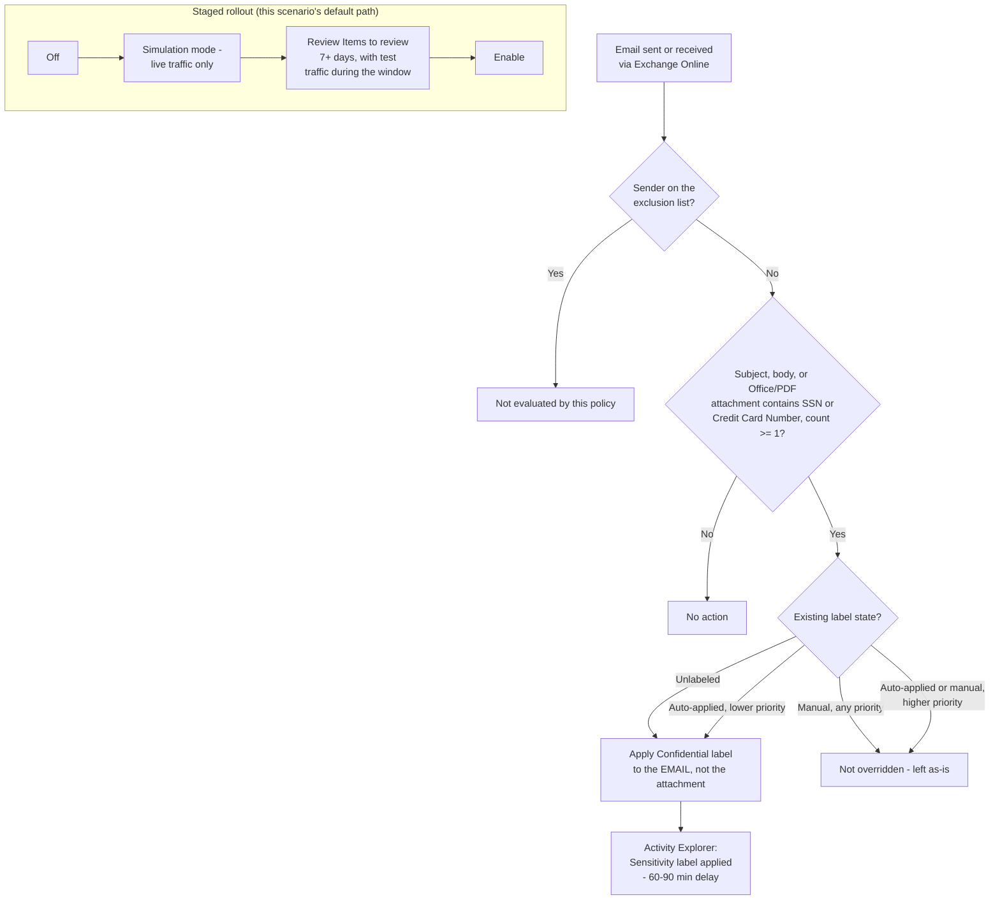

## 1. Scenario summary

Automatically applies an existing **"Confidential"** sensitivity label to Exchange Online email
(subject, body, and Office/PDF attachments) that contains personal data (U.S. Social Security
Numbers and credit card numbers, the same representative PII/financial sensitive information
types as the sibling scenario) as messages are sent and received — without waiting on end users to
label anything themselves. Deployed as a single Microsoft Purview auto-labeling policy with one
rule, staged simulation-first, with an optional sender-based exclusion for a nominated
legal/eDiscovery mailbox.

**Who it's for:** the exact buyer of
`scenarios/information-protection/auto-label-confidential-sharepoint/` — any enterprise that needs
systematic, evidenced classification coverage for regulated personal data — extended to close the
email channel that scenario explicitly leaves open. Deploy this **alongside**, not instead of, the
SharePoint/OneDrive scenario; they share a label and a design philosophy but are otherwise
independent policies with materially different evaluation models (§2 of `design.md`).

## 2. Business/regulatory driver

Same drivers as the sibling scenario — **GDPR Article 32**, **CCPA/CPRA**, and **ISO/IEC
27001:2022 Annex A.5.12/A.8.2** — applied to a different, high-volume channel for the same
regulated data. Email is a common, often overlooked exfiltration and mishandling path for SSNs and
card numbers: a well-meaning employee forwarding an unredacted spreadsheet, a customer service
reply that pastes a card number back to a customer, or a departing employee mailing records to a
personal account are all covered by this scenario's classification pass even before any
DLP-style blocking control exists on the same content.

**Scope note:** the same U.S.-centric starter-set caveat from the sibling scenario applies
here — SSN and Credit Card Number are a representative starter set, not jurisdiction-complete
personal-data coverage. See that scenario's `README.md` §2 for the full discussion; it isn't
repeated here to avoid drift between two copies of the same caveat.

## 3. Prerequisites

Full licensing detail and citations: `docs/licensing-matrix.md`. Summary for this scenario
(deltas from the sibling scenario called out explicitly):

| Requirement | Minimum | Notes |
|---|---|---|
| Automatic / policy-based labeling | **Microsoft 365 E5 / A5 / G5**, **Microsoft Purview Suite** (ex-E5 Compliance), or the **Information Protection & Governance (IP&G)** add-on | Same tier as the sibling scenario — `docs/licensing-matrix.md` §2, Information Protection row |
| Role to author/edit the policy | **Information Protection Admin** role group | `docs/rbac-model.md` §3. This role can create the policy and run it in simulation. |
| Role to turn the policy on after simulation | **Compliance Administrator** or **Compliance Data Administrator** | Distinct from the authoring role above — without one of these, the **Turn on policy** action is greyed out in the portal even after a successful simulation [[8]](#references). Not previously called out in the sibling scenario's prerequisites; applies there too. |
| Automation identity | App registration with **Exchange.ManageAsApp**, granted the Information Protection Admin role group (plus Compliance Administrator/Compliance Data Administrator if the same identity also enforces) | Certificate-based app-only auth — `docs/automation-surface.md` §3 |
| Dependency (not deployed by this scenario) | A published sensitivity label named **Confidential** (parameterizable), with label scope including **Emails**, and **not** a parent label | **Different scope requirement than the sibling scenario**, which needs "Files & other data assets." If the label was published only for that scenario, confirm (or extend) its scope to include Emails before deploying this one — see `design.md` §6/§7 |
| Tenant configuration: unified audit logging on | Audit log search enabled | Required for simulation results and for **Activity Explorer**, this scenario's primary validation surface (§7) [[6]](#references) |
| Tenant configuration: sensitivity labels enabled for SharePoint/OneDrive (`EnableAIPIntegration`) | **Not required for this scenario** | Genuine simplification versus the sibling scenario — that toggle is SharePoint/OneDrive-specific and has no Exchange equivalent (`design.md` §6) |
| Region availability | Auto-labeling available in tenant's region | Same regional-availability caveat as the sibling scenario [[2]](#references) |
| Scoping nuance | At least one **non-EDM** sensitive information type per rule | Same rule as the sibling scenario [[2]](#references) |

> Verify current entitlement names against `docs/licensing-matrix.md` (dated 2026-09-02) and the
> Product Terms before a sales commitment — SKU names change.

## 4. Architecture



One auto-labeling policy (`Confidentiality - Auto-Label PII in Exchange Email`) with one rule
(`-Workload Exchange` is single-valued and this scenario targets exactly one workload — no
multi-rule split needed, unlike the sibling scenario's SharePoint/OneDrive pair). Full rationale:
`design.md` §3–§4.

## 5. Step-by-step implementation

### Portal path (for a first manual walkthrough / to validate intent before scripting)

1. Confirm the **Confidential** label's scope includes **Emails** (Purview portal → Information
   Protection → Labels → select **Confidential** → Edit → confirm **Emails** is checked under
   scope). If it only covers Files & other data assets today, add Emails to its scope before
   continuing.
2. Sign in to the [Microsoft Purview portal](https://purview.microsoft.com) → **Solutions** →
   **Information Protection** → **Policies** → **Auto-labeling policies** → **+ Create
   auto-labeling policy** → **Automatically apply label only**.
3. Category: **Custom** → **Custom policy** → **Next**.
4. Name: `Confidentiality - Auto-Label PII in Exchange Email`.
5. **Choose a label to auto-apply**: select the existing **Confidential** label.
6. **Choose locations**: select **Exchange email** only (leave SharePoint/OneDrive unselected —
   those are covered by the sibling scenario's own policy). Keep **All** included and **None**
   excluded if the policy must evaluate incoming mail from outside your organization; otherwise
   exclude the nominated legal/eDiscovery mailbox under **Excluded**.
7. **Set up common or advanced rules** → **Common rules** → add condition **Content contains** →
   **Sensitive info types** → add **U.S. Social Security Number (SSN)** and **Credit Card
   Number**, minimum count **1** each, combined with **Any of these** (logical OR)
   [[4]](#references).
8. **Additional label settings**: leave default (don't force-override higher-priority labels).
9. **Decide if you want to test out the policy now or later**: select **Run policy in simulation
   mode**; do **not** enable "turn on automatically after 7 days" — same deliberate-enable
   standard as the sibling scenario (§8).
10. **Submit** → **Done**.
11. **While simulation is running, send and receive representative test messages.** Unlike the
    SharePoint/OneDrive sibling scenario, Exchange simulation does not scan existing mailbox
    content — it only evaluates live traffic during the simulation window
    [[6]](#references)(`design.md` §5). A simulation run with no test traffic during the window
    will show zero matches even for a correctly configured rule.

### Script path (idempotent, parameterized, dry-run capable)

```powershell
# 1. Connect (certificate app-only — see docs/automation-surface.md §3)
Connect-IPPSSession -AppId $AppId -Certificate $Cert -Organization $TenantDomain

# 2. Dry run — reports every change, makes none
./deploy/New-ConfidentialAutoLabelExchangePolicy.ps1 `
    -LabelName 'Confidential' `
    -ExcludedMailboxSmtpAddress 'legalhold@contoso.com' `
    -WhatIf

# 3. Deploy in simulation mode (default) — then send/receive test mail while it runs
./deploy/New-ConfidentialAutoLabelExchangePolicy.ps1 `
    -LabelName 'Confidential' `
    -ExcludedMailboxSmtpAddress 'legalhold@contoso.com'

# 4. After a review window with real test traffic, enforce
./deploy/New-ConfidentialAutoLabelExchangePolicy.ps1 `
    -LabelName 'Confidential' `
    -ExcludedMailboxSmtpAddress 'legalhold@contoso.com' `
    -Mode Enable -Force

# 5. Validate
./validate/Test-ConfidentialAutoLabelExchangePolicy.ps1 -LabelName 'Confidential'
```

The deploy script uses Security & Compliance PowerShell (`New-AutoSensitivityLabelPolicy`,
`New-AutoSensitivityLabelRule`) — automation surface 2 per `docs/automation-surface.md` §1, the
same surface the sibling scenario uses.

## 6. Configuration reference

| Setting | Rule: `AutoLabel-Confidential-PII-Exchange` |
|---|---|
| `Workload` | `Exchange` |
| Sensitive info types | U.S. Social Security Number (SSN), Credit Card Number — `mincount = 1` each, OR-combined (same conditions as the sibling scenario) |
| `Policy` | `Confidentiality - Auto-Label PII in Exchange Email` |

| Policy-level setting | Value |
|---|---|
| `ApplySensitivityLabel` | `<LabelName>` (default `Confidential`) — must reference an existing, published, non-parent label whose scope includes **Emails** |
| `ExchangeLocation` | `All` |
| `ExchangeSenderException` | `<ExcludedMailboxSmtpAddress>` (optional; one or more SMTP addresses) — excludes that mailbox's **outbound** mail only, not mail sent to it (`design.md` §3) |
| `OverwriteLabel` | `$true` — same semantics as the sibling scenario: overrides a lower-priority auto-applied/default label only, never a manual one [[5]](#references) |
| `ExternalMailRightsManagementOwner` | Not set (optional; see §11) |
| `Mode` | `TestWithNotifications` (deploy default) → `Enable` after review |

Full cmdlet parameter grounding: `deploy/New-ConfidentialAutoLabelExchangePolicy.ps1` inline
comments and its `.NOTES` block cite the exact Microsoft Learn PowerShell reference pages.

## 7. Validation / how to prove it works

**Read this section before assuming a passing check proves the control works — Exchange's
observability surface is genuinely different from the sibling scenario's, not just smaller.**

1. **Automated config check** — `./validate/Test-ConfidentialAutoLabelExchangePolicy.ps1
   -LabelName 'Confidential'` confirms the policy and rule exist with the expected location, SIT
   conditions, and target label; exits non-zero on any hard failure. Like the sibling scenario,
   this proves the policy is *shaped* correctly, not that it is *labeling anything*.
2. **Simulation results** — Purview portal → Information Protection → Auto-labeling policies →
   select the policy → **Items to review** tab. Unlike the sibling scenario's "Labeled items" tab,
   this only shows messages sent/received **while the simulation was actively running**
   [[6]](#references) — re-running simulation with no test traffic shows nothing, which is expected
   behavior, not a failure.
3. **Functional test** — send a test email containing a documented test SSN or card-brand test
   number (never real PII) from an in-scope mailbox to another in-scope mailbox, while the policy is
   in simulation or enabled. Confirm the match appears on **Items to review** (simulation) or, once
   enforced, in **Activity Explorer** (step 4).
4. **Post-enforcement confirmation — Activity Explorer, not Labeled items.** After moving to
   `-Mode Enable`, Purview portal → **Data classification** → **Activity Explorer** → filter
   **Activity type = Sensitivity label applied**, narrow by label/date/location. Allow **60–90
   minutes** for the activity to appear [[7]](#references). Activity Explorer confirms the
   resulting label and **How applied** (automatic vs. manual), but does **not** identify which
   specific auto-labeling policy or rule applied it — if more than one auto-labeling policy targets
   Exchange in the tenant, corroborate with the single-policy **Items to review** history instead of
   assuming Activity Explorer disambiguates for you.
5. **Exclusion test** — send a test message *from* the excluded mailbox. Confirm it is **not**
   labeled. Then send a test message *to* the excluded mailbox from an unrelated in-scope sender.
   Confirm it **is** labeled — the exclusion is sender-scoped, not mailbox-scoped, and this
   asymmetry is exactly what this test is meant to catch (`design.md` §3).
6. **Override-safety test** — same pattern as the sibling scenario: manually apply a different
   label to a test message before sending, then confirm the policy does not replace it.
7. **Enforcement confirmation** — after moving to `-Mode Enable`, re-run the automated config check
   and confirm it reports `Mode: Enable` rather than a `Test*` value.

## 8. Operations & tuning

**Deployment sequence**: Off → simulation mode (with test traffic sent/received during the window,
§5/§7) → review for at least a business cycle (7+ days) → Enable. Same deliberate-enable standard
as the sibling scenario and `AGENTS.md` §4 — do not accept the portal's "auto-turn-on after 7 days"
option.

**KPIs to watch (first 30–60 days):**
- **Activity Explorer "Sensitivity label applied" volume for Exchange**, filtered to this label and
  a How-applied value of automatic. This is the closest Exchange equivalent to the sibling
  scenario's Labeled-items count, with the caveat that it aggregates every auto-labeling policy
  applying this label, not just this one, if more than one exists.
- **Items-to-review match volume during any future re-simulation** (e.g., after a rule change) —
  remember this only reflects traffic sent during that specific window (§5), so a "zero matches"
  result after a rule change needs fresh test traffic before it can be trusted.
- **False-positive rate on the SSN SIT** — same tuning guidance as the sibling scenario: nine-digit
  numbers that aren't SSNs are the most common false-positive source; watch for user-reported
  "why was my email suddenly Confidential/encrypted" tickets as the practical detection signal,
  since there is no per-item failure dashboard for email the way there is for files.

**Alert routing:** same as the sibling scenario — no DLP-style incident-report email from
auto-labeling itself. For Exchange specifically, also budget for the **encryption side-effect**:
an internal sender whose message matches this rule will see their message encrypted whether or not
the encryption was the intended outcome (§6, `design.md` §4) — an unexpected support ticket
("why is my recipient unable to forward this email") is a plausible early signal worth routing to
the Information Protection team's queue, not just to help desk generic triage.

**Review cadence:** monthly for the first quarter alongside the sibling scenario's own review
cadence (same underlying label, same team, same false-positive tuning conversation), quarterly
thereafter.

**Runbook — an email that should be labeled isn't:**
1. Confirm the message wasn't sent/received outside a simulation window if you're still validating
   in simulation (§7, step 2) — this is expected, not a bug.
2. Confirm the sender isn't the excluded mailbox (§7, step 5) — outbound mail from that mailbox is
   never evaluated, by design.
3. Confirm at least 60–90 minutes have passed before checking Activity Explorer
   [[7]](#references) — a message that hasn't shown up yet may simply not have propagated to the
   activity feed.
4. Confirm the label's scope still includes **Emails** — an edit to the label (e.g., by someone
   working on the sibling scenario's SharePoint/OneDrive use case) that narrows scope back to
   "Files & other data assets only" would silently stop this policy from having any effect, with no
   portal error surfaced (same class of silent-failure risk the sibling scenario documents for its
   own prerequisites).
5. If none of the above explains it, check for a **rule-load failure** — a malformed rule can
   silently stop matching all Exchange traffic with no item-level failure to review, because the
   rule never loaded in the first place [[9]](#references). Re-run the automated config check; if
   it reports the rule missing or malformed, recreate it from this scenario's deploy script.

## 9. Rollback / decommission

See `rollback.md` for the full staged procedure (disable → simulation → permanent purge). Quick
reference: `./deploy/Remove-ConfidentialAutoLabelExchangePolicy.ps1` disables (reversible); add
`-Purge` to permanently delete the policy and its rule.

## 10. Cost & licensing notes

- **No PAYG component for M365 mail.** Exchange auto-labeling is covered by the same per-user
  E5-tier/IP&G entitlement as the sibling scenario — see `docs/licensing-matrix.md` §1–2. No
  separate licensing line for this scenario if the sibling scenario is already deployed; both draw
  from the same entitlement.
- **No additional Azure subscription required.**
- **Sizing note:** unlike the sibling scenario's "All" SharePoint/OneDrive location scope, this
  policy's default `ExchangeLocation = All` similarly means every licensed mailbox is effectively
  in scope — no incremental licensing decision beyond what the sibling scenario already requires
  for the same user population.

## 11. Known limitations & gotchas

- **In-transit only — no backlog coverage.** This is the load-bearing limitation of the whole
  scenario (`design.md` §5). Mail delivered before this policy existed, or before it was turned
  on, is never retroactively labeled. There is no on-demand-classification equivalent for Exchange.
  If a buyer needs historical-mail classification, that is a separate eDiscovery/Content
  Search-based project, not an extension of this scenario.
- **No "Labeled items" dashboard or policy-level Insights enforcement metrics for Exchange** — both
  report only SharePoint/OneDrive files [[7]](#references). Use Activity Explorer instead (§7),
  and budget for its 60–90 minute delay and its inability to name which specific policy/rule
  applied a given label.
- **Exchange match counts shown during simulation Insights are estimates from sampled data, not
  exact counts** [[8]](#references) — do not report a simulation match count to a compliance
  stakeholder as an exact figure.
- **Simulation only sees live traffic during the run window.** A common false alarm: re-running
  simulation after a rule edit and seeing zero matches, when the real cause is that no test traffic
  was sent during the window — see the runbook in §8.
- **The exclusion mechanism is sender-scoped, not mailbox-scoped, and asymmetric — and that
  asymmetry is also a standing exfiltration path, not just an under-protection gap.**
  `-ExchangeSenderException` protects a nominated mailbox's outbound mail only; mail *sent to* that
  mailbox by anyone else is still evaluated and can still be labeled/encrypted. Read the other
  direction (a Red Team finding from this scenario's four-lens review, `reviews.md`): **any mail
  this excluded mailbox sends — including sensitive content — leaves completely unlabeled and
  unencrypted by this control, by design.** If the excluded mailbox is ever compromised, shared
  more broadly than intended, or simply used for something other than its original legal-hold
  purpose, it is a standing, control-free channel for the exact data this scenario exists to
  protect. Treat the exclusion list the same way the sibling scenario treats its excluded
  SharePoint site (§11 there): a monitored asset, reviewed periodically, not a "set once and
  forget" configuration value. A legal-hold custodian's *inbound* Confidential-labeled mail is
  separately not exempted by this configuration either — if that is also required, it needs its
  own explicit design decision (e.g., excluding the sender who routinely emails that custodian,
  which doesn't generalize) rather than being assumed covered by this parameter.
- **Encryption side effects are workload-specific and easy to under-scope — and the default is
  weaker for the more dangerous direction of travel.** If `Confidential` applies encryption:
  internal senders are always encrypted once labeled; external senders are **not** encrypted by
  default unless `-ExternalMailRightsManagementOwner` is configured (`design.md` §6). Read
  plainly: **out of the box, a message containing an SSN or card number sent to an external
  recipient is labeled Confidential but leaves the tenant in cleartext** — the exact direction of
  travel (data leaving the org) that matters most for breach-notification exposure under the
  GDPR/CCPA drivers in §2. This is a genuine Red Team/CISO finding from this scenario's four-lens
  review (`reviews.md`), not a minor configuration nuance: a buyer whose primary concern is
  external data loss (not just internal classification hygiene) should configure
  `-ExternalMailRightsManagementOwner` deliberately, or pair this scenario with
  `scenarios/dlp/exchange-pii-exfil-block/` — a content-based Exchange DLP policy, built
  specifically to close this gap, that blocks or forces encryption on outbound SSN/Credit-Card-
  Number mail to external recipients regardless of whether this auto-labeling policy has run —
  the same "don't rely on the label alone for real-time protection" pattern already established for
  the sibling scenario (§11 there) and for `scenarios/dlp/pci-teams-exfil-block/`. Unencrypted
  Office (Word/PowerPoint/Excel) attachments on a matching, encryption-applying message are
  documented to be separately encrypted to match the email; whether a PDF attachment on the same
  message ends up protected as part of the overall encrypted message envelope, or left effectively
  in the clear alongside a protected email body, is not stated explicitly by Microsoft's
  documentation for this specific case — **VERIFY** (pilot tenant) before relying on this control
  for PDF-carried sensitive content specifically; treat PDF as unconfirmed rather than protected in
  the interim.
- **Label scope requirement differs from the sibling scenario.** This scenario needs the
  `Confidential` label's scope to include **Emails**; the sibling scenario needs "Files & other
  data assets." If both scenarios are deployed against the same label (the intended pattern), the
  label's scope must include both — confirm this explicitly rather than assuming one scenario's
  prerequisite check covers the other.
- **A rule-load failure has no item-level symptom.** Unlike a SharePoint/OneDrive labeling failure
  (which shows up per-file with a reason), a malformed Exchange auto-labeling rule can silently stop
  matching **all** Exchange traffic tenant-wide with nothing to review, because the rule never
  compiled in the first place [[9]](#references) — see the runbook in §8, step 5.
- **Config validation is not match validation** — same caveat as the sibling scenario.
  `validate/Test-ConfidentialAutoLabelExchangePolicy.ps1` confirms the policy and rule are shaped
  correctly; it cannot confirm any email has actually been labeled. Always cross-check Activity
  Explorer (§7, step 4) before treating a green validation run as end-to-end proof.
- **A manually applied label permanently defeats this control**, same bypass class already
  documented for the sibling scenario: a message pre-labeled by a human keeps that label
  indefinitely, regardless of content added afterward (impossible to edit content after send in
  practice, but a draft saved with a manual label and later completed with sensitive content is the
  realistic version of this gap for email). No auto-labeling-side mitigation exists; pair with a
  content-based Exchange DLP condition for movement-blocking use cases that must not depend on the
  label being correct.
- **Don't repurpose this policy for mass encrypted mailings.** Microsoft explicitly documents that
  auto-labeling policies aren't designed for bulk encrypted-distribution mailing and can cause
  delivery failures if used that way [[3]](#references); Message Encryption's own "automatically
  send emails" label setting is the correct mechanism for that use case, not this scenario.

## 12. References

1. Automatically apply a sensitivity label to Microsoft 365 data — <https://learn.microsoft.com/purview/apply-sensitivity-label-automatically>
2. Automatically apply a sensitivity label to Microsoft 365 data — "Auto-labeling for Exchange" behavior (attachment scanning vs. labeling, Message Encryption inheritance, IRM interaction with mail flow rules/DLP, external-sender labeling and encryption defaults) — <https://learn.microsoft.com/purview/apply-sensitivity-label-automatically#compare-auto-labeling-for-office-apps-with-auto-labeling-policies>
3. Automatically apply a sensitivity label to Microsoft 365 data — "How to configure auto-labeling policies for SharePoint, OneDrive, and Exchange" (mass-mailing caution, ExchangeLocation All/None-excluded requirement for external senders, encryption permission-model differences for Exchange-only policies) — <https://learn.microsoft.com/purview/apply-sensitivity-label-automatically#how-to-configure-auto-labeling-policies-for-sharepoint,-onedrive,-and-exchange>
4. Data Loss Prevention policy reference — "Content contains" supports multiple sensitive info types combined with "Any of these" (OR) or "All of these" (AND); same condition-group model underlies auto-labeling rules — <https://learn.microsoft.com/purview/dlp-policy-reference#rules>
5. Automatically apply a sensitivity label to Microsoft 365 data — "Will an existing label be overridden?" — <https://learn.microsoft.com/purview/apply-sensitivity-label-automatically#will-an-existing-label-be-overridden>
6. Automatically apply a sensitivity label to Microsoft 365 data — "Example: Apply a label to Exchange email based on the subject" (live-traffic-only simulation for Exchange, label scope must include Emails) — <https://learn.microsoft.com/purview/apply-sensitivity-label-automatically#example-apply-a-label-to-exchange-email-based-on-the-subject>
7. Use the Insights tab to analyze auto-labeling policies in Microsoft Purview — Exchange email excluded from Labeled items/enforcement metrics; Activity Explorer as the documented alternative, 60–90 minute delay, doesn't identify the specific policy/rule — <https://learn.microsoft.com/purview/auto-label-insights-tab>
8. Use the Insights tab to analyze auto-labeling policies in Microsoft Purview — simulation-mode Insights, Exchange matched-item counts are estimates from sampled data; pre-flight checklist role requirements for turning on a policy (Compliance Administrator / Compliance Data Administrator) — <https://learn.microsoft.com/purview/apply-sensitivity-label-automatically#before-you-begin>
9. New-AutoSensitivityLabelPolicy reference (full parameter syntax — confirms no `-ExchangeLocationException` parameter exists; `-ExchangeSender`/`-ExchangeSenderException`/`-ExchangeSenderMemberOf`/`-ExchangeSenderMemberOfException`/`-ExternalMailRightsManagementOwner`) — <https://learn.microsoft.com/powershell/module/exchangepowershell/new-autosensitivitylabelpolicy>
10. New-AutoSensitivityLabelRule reference (`-Workload` accepted values: Exchange, SharePoint, OneDriveForBusiness; Exchange-only advanced conditions such as `-SubjectMatchesPatterns`, `-SenderIPRanges`) — <https://learn.microsoft.com/powershell/module/exchangepowershell/new-autosensitivitylabelrule>
11. Automatically apply a sensitivity label to Microsoft 365 data — "Policy rule fails to load" troubleshooting (rule-load failure has no item-level symptom) — <https://learn.microsoft.com/purview/apply-sensitivity-label-automatically#policy-rule-fails-to-load>
12. Set-AutoSensitivityLabelPolicy reference — <https://learn.microsoft.com/powershell/module/exchangepowershell/set-autosensitivitylabelpolicy>
13. Remove-AutoSensitivityLabelPolicy reference — <https://learn.microsoft.com/powershell/module/exchangepowershell/remove-autosensitivitylabelpolicy>
14. Get-Label reference — <https://learn.microsoft.com/powershell/module/exchange/get-label>
15. Connect-IPPSSession reference (app-only certificate auth) — <https://learn.microsoft.com/powershell/module/exchangepowershell/connect-ippssession>
16. Email marking strategies using Microsoft Purview for the Australian Government — `msip_labels` header and x-header-based cross-organization marking (background for the non-goal in `design.md` §7, not implemented by this scenario) — <https://learn.microsoft.com/compliance/anz/pspf-dlp-marking>

> Re-verify all links against current Microsoft Learn before a customer-facing assessment or
> sale — auto-labeling behavior for Exchange (simulation semantics, Insights tab detail) has
> changed more than once in this feature's history, same caveat as the sibling scenario.
