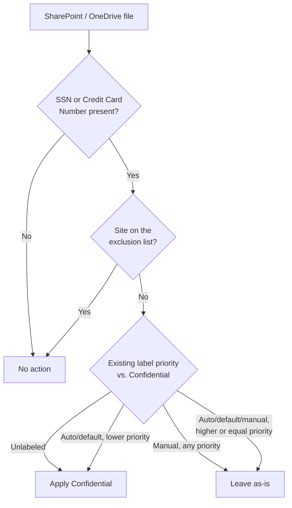

## 1. Problem statement

An enterprise tenant with years of accumulated SharePoint and OneDrive content has no reliable way
to know which files contain regulated personal data (SSNs, card numbers) unless a user happened to
apply a sensitivity label by hand. Manual-only labeling programs under-cover in practice — busy
users skip it, historical content was never labeled at all, and there's no audit trail proving
coverage. This scenario needs to close that gap tenant-wide, without relying on user behavior,
while not disturbing content already under an active legal hold or already manually classified by
someone who made a deliberate labeling decision.

## 2. Design goals

1. Apply the **Confidential** label automatically to SharePoint/OneDrive content containing SSNs
   or credit card numbers, going forward and across the existing backlog, without requiring any
   user action.
2. Never override a **manually applied** label, regardless of priority — a human's deliberate
   classification decision is authoritative and this control must not second-guess it.
3. Allow overriding only a **lower-priority, previously auto-applied or default** label — so the
   control can still tighten classification over time (e.g., a file auto-labeled "General" that
   later matches this rule should upgrade to "Confidential"), while never downgrading.
4. Exclude a nominated legal-hold/eDiscovery site from auto-labeling entirely — an active legal
   matter's content should not be relabeled mid-hold by an unrelated automated process.
5. Idempotent and re-runnable: running the deploy script twice must not create duplicate policies
   or rules.
6. Ship "off" by default: simulation mode first, matching the code standard in `AGENTS.md` §4 and
   the pattern established in `scenarios/dlp/pci-teams-exfil-block/`.

## 3. Why auto-labeling (not DLP, not a default library label, not manual-only)

- **DLP for SharePoint/OneDrive** can *detect* the same sensitive information types, but its job
  is to act on data movement/sharing (block, restrict, audit) — it doesn't durably mark the file
  with a sensitivity label other controls can key off of. This scenario is the classification
  layer DLP conditions on, not a substitute for DLP.
- **A default sensitivity label for a document library** (`sensitivity-labels-sharepoint-default-label`)
  applies to *new, unlabeled* files uploaded to a specific library based on where they land, not
  based on *content*. It's location-based, not content-based — useful for "everything in this one
  library is Confidential by policy," not for "find the SSNs wherever they are across the tenant."
- **Manual-only labeling** (users pick a label themselves) remains the *primary* path for content
  that doesn't match a specific automatable pattern, and this scenario explicitly never overrides
  a manual choice (§2, goal 2) — auto-labeling is a backstop and accelerant, not a replacement for
  a labeling program's human judgment on ambiguous content.

## 4. Policy architecture

One auto-labeling policy, two rules (one per workload — see `README.md` §11 for why
`New-AutoSensitivityLabelRule` requires this split). Both rules share the same sensitive
information type conditions and the same target label.

| Rule | Workload | Condition | Action |
|---|---|---|---|
| `AutoLabel-Confidential-PII-SharePoint` | SharePoint | Content contains **U.S. Social Security Number (SSN)** OR **Credit Card Number**, count ≥ 1 | Apply `Confidential` label |
| `AutoLabel-Confidential-PII-OneDrive` | OneDriveForBusiness | Same | Same |

Policy-level settings apply to both rules: `SharePointLocation = All`, `OneDriveLocation = All`,
`SharePointLocationException = <legal-hold site URL>` (optional), `OverwriteLabel = $true`
(governs override of lower-priority auto-applied labels only — see `README.md` §6 and the
override-behavior table it cites).

## 5. Data flow / where enforcement happens

Auto-labeling for SharePoint/OneDrive runs as an ongoing, asynchronous scan against content in the
configured locations — it is not a synchronous, upload-time gate the way Endpoint DLP or Teams DLP
is. A file is evaluated on the policy's regular scan cadence (not on every save), which means there
is an inherent lag between a file matching the condition and the label actually appearing —
budgeted for explicitly in `README.md` §11 (do not test immediately after a change) and §8
(the review runbook checks the last evaluation pass before assuming a failure).

**Important dependency carried into `README.md` §3 and §11:** the label-appearing pipeline for
SharePoint/OneDrive requires `EnableAIPIntegration = $true` at the SharePoint tenant level
(`Set-SPOTenant`), which is a *separate* one-time tenant configuration step outside the
auto-labeling policy itself, run over the SharePoint Online Management Shell — automation surface
5, now documented in `docs/automation-surface.md` §1/§2/§3/§6 (closed 2026-09-04). If that toggle
is off, or gets reset by unrelated SharePoint administration,
this policy runs and reports success in its own dashboard while never actually labeling anything,
with no error surfaced anywhere obvious.

## 6. Key decisions

| Decision | Choice | Rationale |
|---|---|---|
| Deploy surface | Security & Compliance PowerShell (`Connect-IPPSSession`), per `docs/automation-surface.md` surface 2 | Auto-labeling policy/rule objects are S&C PowerShell objects, same family as DLP policies. |
| Sensitive info types | Built-in **U.S. Social Security Number (SSN)** and **Credit Card Number** | Purpose-built, Microsoft-maintained, representative of the two most common regulated-PII categories that trigger GDPR/CCPA obligations when found in an unmanaged document store. A production rollout would extend this list per the buyer's actual data inventory — this scenario ships the pattern, not an exhaustive SIT catalog. |
| Combination logic | OR (`Any of these`) across the two SITs | Either sensitive info type alone is sufficient reason to classify the file as Confidential — there's no requirement both be present. |
| Two rules instead of one | One rule per `-Workload` (SharePoint, OneDriveForBusiness) | `New-AutoSensitivityLabelRule -Workload` is single-valued — see `README.md` §11. |
| Override setting | `OverwriteLabel $true` | Lets the control tighten classification on content that was previously auto-labeled to something less sensitive, without ever touching a human's manual choice — see design goal 2/3 and the override-behavior table cited in `README.md` §6. |
| Exclusion mechanism | `SharePointLocationException` by site URL, not by content condition | A legal hold is a site-level concept in this scenario's assumed environment (a dedicated eDiscovery/hold site), so excluding at the location level is simpler and more auditable than trying to express "unless under hold" as a content condition — no such condition exists natively for auto-labeling rules. |
| Default policy mode | `TestWithNotifications` | Matches the code standard in `AGENTS.md` §4 and the precedent set by `scenarios/dlp/pci-teams-exfil-block/`: nothing in this repo enforces by default against a live tenant without an explicit, deliberate flag. |
| Encryption | Not configured by this scenario | Whether `Confidential` applies encryption is a property of the label itself, authored separately — see `README.md` §11 and §7 below. |

## 7. Non-goals

- This scenario does not author or publish the `Confidential` sensitivity label itself — it is a
  prerequisite dependency (same pattern as the Card Operations security group in
  `scenarios/dlp/pci-teams-exfil-block/design.md` §6), not a deployed artifact.
- This scenario does not cover Exchange (email) auto-labeling, even though the same policy family
  supports it — scoped to SharePoint/OneDrive at-rest content per the scenario's title. Built as
  `scenarios/information-protection/auto-label-confidential-exchange/` (closed 2026-09-04).
- This scenario does not configure the one-time `EnableAIPIntegration` tenant toggle — it is a
  manual/portal prerequisite documented in `README.md` §3, not something this scenario's
  idempotent deploy script re-asserts on every run (it's a tenant-wide setting unrelated to this
  specific policy's lifecycle).
- This scenario does not implement on-demand classification for backlog acceleration — it is
  referenced in `README.md` §8 as a recommended pairing for tenants with a large pre-existing
  content estate, not built here.
