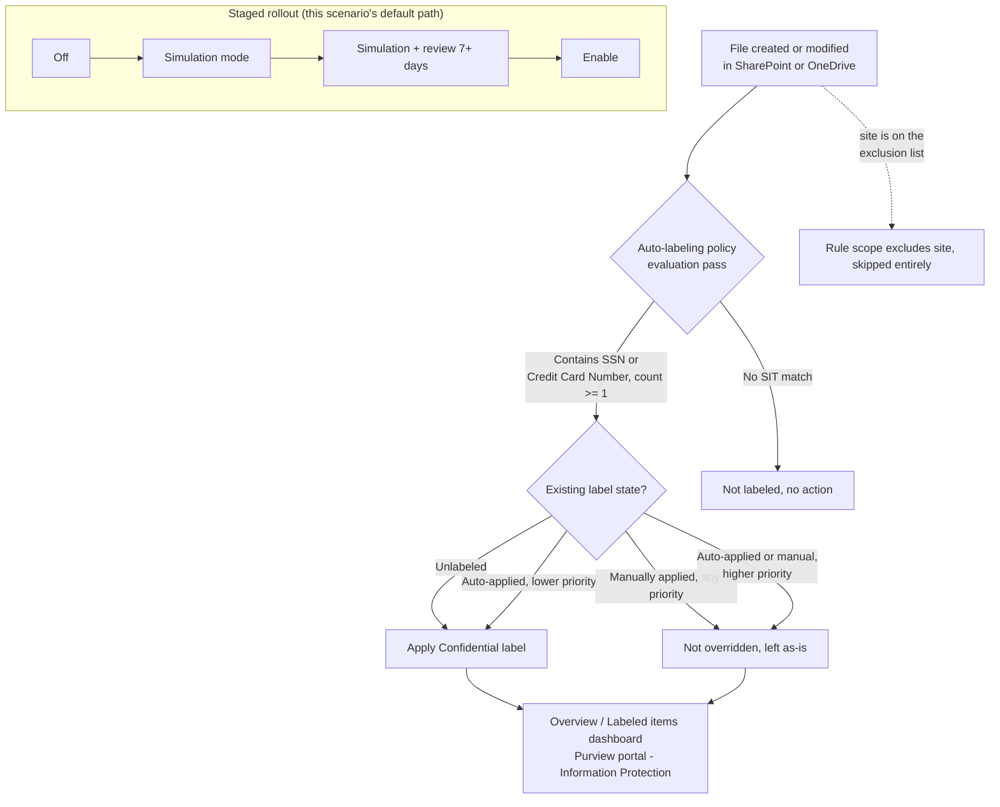

## 1. Scenario summary

Automatically applies an existing **"Confidential"** sensitivity label to SharePoint and OneDrive
files that contain personal data (U.S. Social Security Numbers and credit card numbers, as the
representative PII/financial sensitive information types), without waiting on end users to label
anything themselves. Deployed as a single Microsoft Purview **auto-labeling policy** with one rule
per workload, staged simulation-first, and scoped to exclude a nominated legal-hold/eDiscovery
site so an active hold's content isn't relabeled mid-matter.

**Who it's for:** any enterprise that stores regulated personal data in SharePoint/OneDrive and
needs systematic, evidenced classification coverage, not "we told users to label their files", 
as the foundation that later DLP, retention, and Insider Risk Management controls in this library
key off of (those controls condition on the label being present).

## 2. Business/regulatory driver

**GDPR Article 32** ("appropriate technical and organisational measures" for the security of
personal data processing) and the parallel intent of **CCPA/CPRA** and **ISO/IEC 27001:2022
Annex A.5.12 / A.8.2** (information classification) all converge on the same practical
requirement: an organization must be able to show *where* regulated personal data lives and that
it is *marked and protected accordingly*, not rely on staff remembering to classify it by hand.
Manual-only labeling programs consistently under-cover: Microsoft's own guidance frames
auto-labeling for SharePoint/OneDrive/Exchange as the mechanism for closing that gap at scale
[[1]](#references).

This scenario is the **classification and marking control**, distinct from (and a prerequisite
signal for) the **movement-blocking control** already in this library
(`scenarios/dlp/pci-teams-exfil-block/`): a DLP rule that conditions on "sensitivity label is
Confidential" needs files to actually carry that label first. Auto-labeling is what makes that
condition reliably true across the tenant's existing and newly created content, not just the
subset a user happened to label.

**Scope note:** the two built-in sensitive information types this scenario ships with, U.S.
Social Security Number and Credit Card Number, are a representative **starter set**, not a
jurisdiction-complete catalog of "personal data" under GDPR/CCPA (which is far broader: names,
emails, health data, national IDs outside the U.S., etc.). SSN in particular is a U.S.-specific
identifier; a tenant whose regulated population is EU/UK-only should swap in the relevant
EU national-ID and equivalent built-in SITs (§6 shows exactly where in the rule definition to
change this) rather than treating this scenario's default condition set as regulatory coverage
by itself, or deploy `scenarios/information-protection/auto-label-eu-personal-data-sharepoint/`
directly, the built EU/UK-region sibling of this scenario, which ships that swap already made
(EU national identification number, EU Social Security Number (SSN) or Equivalent ID, EU debit
card number) plus a `-SensitiveInfoTypeName` parameter for narrowing to specific member states.
ISO/IEC 27001 Annex A.5.12/A.8.2 (information classification generally) is the driver
this default configuration most directly satisfies as shipped; treat the GDPR/CCPA framing above
as the reason the *capability* matters, not a claim that two SITs alone achieve GDPR-complete
personal-data coverage.

## 3. Prerequisites

Full licensing detail and citations: `docs/licensing-matrix.md`. Summary for this scenario:

| Requirement | Minimum | Notes |
|---|---|---|
| Automatic / policy-based labeling | **Microsoft 365 E5 / A5 / G5**, **Microsoft Purview Suite** (ex-E5 Compliance), or the **Information Protection & Governance (IP&G)** add-on | Per-user for every account whose SharePoint/OneDrive content is in scope, see `docs/licensing-matrix.md` §2, Information Protection row |
| Role to author/edit auto-labeling policies | **Information Protection Admin** role group (create/edit/delete labels, DLP policies, classifiers; manage auto-labeling simulation) | `docs/rbac-model.md` §3. This role can create the policy and run it in simulation. |
| Role to turn the policy on after simulation | **Compliance Administrator** or **Compliance Data Administrator** | Distinct from the authoring role above, without one of these, the **Turn on policy** action is greyed out in the portal even after a successful simulation [[15]](#references). Not called out in this scenario's prerequisites when it was first built; backported from the sibling Exchange scenario, which surfaced it, see `scenarios/information-protection/auto-label-confidential-exchange/README.md` §3. |
| Automation identity | App registration with **Exchange.ManageAsApp**, granted the Information Protection Admin role group (plus Compliance Administrator/Compliance Data Administrator if the same identity also enforces) | Certificate-based app-only auth, `docs/automation-surface.md` §3 |
| Dependency (not deployed by this scenario) | A published sensitivity label named **Confidential** (parameterizable), with label scope including **Files & other data assets**, and **not** a parent label (parent labels, those with sublabels, cannot be applied to content and the policy will silently label nothing if one is selected) | Label authoring is a separate scenario/prerequisite; see `docs/rbac-model.md` for the label-creation permission and Known Limitations §11 below |
| Tenant configuration: sensitivity labels enabled for Office files in SharePoint/OneDrive | `Set-SPOTenant -EnableAIPIntegration $true` (or the Purview portal one-click banner) | **Requires the SharePoint Online Management Shell** (`Connect-SPOService`), automation surface 5, `docs/automation-surface.md` §1/§3; see §11 below. Without this, files can be scanned but never actually labeled, with no error surfaced in the portal [[2]](#references) |
| Tenant configuration: unified audit logging on | Audit log search enabled | Required for the auto-labeling policy's **simulation mode** to have results to show [[2]](#references) |
| Tenant configuration (recommended): PDF support | `Set-SPOTenant -EnableSensitivityLabelforPDF $true` | **Off by default.** Without it, PDFs are not labeled by this (or any) auto-labeling policy even if they match a rule's conditions, a common source of "why wasn't this PDF labeled" confusion. Turning it on can materially increase daily labeled-file volume against the 100,000-files/day limit in §11 [[8]](#references) |
| Region availability | Auto-labeling available in tenant's region | If **Auto-labeling policies** isn't visible under Information Protection > Policies, the tenant is in a region blocked by an Azure backend dependency [[2]](#references) |
| Scoping nuance | At least one **non-EDM** sensitive information type per rule | A rule built only from Exact Data Match SITs silently disables auto-labeling for that label [[2]](#references) |

> Verify current entitlement names against `docs/licensing-matrix.md` (dated 2026-09-02) and the
> Product Terms before a sales commitment, SKU names change.

## 4. Architecture



One auto-labeling policy (`Confidentiality - Auto-Label PII in SharePoint and OneDrive`) with two
rules, one per workload, because `New-AutoSensitivityLabelRule -Workload` accepts a single
workload per rule [[3]](#references). Both rules share the same sensitive-information-type
conditions and target label. Full rationale in `design.md` §4.

## 5. Step-by-step implementation

### Portal path (for a first manual walkthrough / to validate intent before scripting)

1. Confirm the prerequisite banner **Turn on now** has been accepted under **Information
   Protection > Sensitivity labels** (enables sensitivity labels for Office files in SharePoint
   and OneDrive), or run `Set-SPOTenant -EnableAIPIntegration $true` from SharePoint Online
   Management Shell [[2]](#references).
2. Sign in to the [Microsoft Purview portal](https://purview.microsoft.com) → **Solutions** →
   **Information Protection** → **Policies** → **Auto-labeling policies** → **+ Create
   auto-labeling policy** → **Automatically apply label only**.
3. Category: **Custom** → **Custom policy** → **Next**.
4. Name: `Confidentiality - Auto-Label PII in SharePoint and OneDrive`.
5. **Choose a label to auto-apply**: select the existing **Confidential** label. Confirm it is
   *not* shown as a parent label in the picker (parent labels are grayed out or, if selected
   anyway, silently label nothing).
6. **Choose locations**: select **SharePoint sites** and **OneDrive accounts**; keep **All**
   included, or exclude the legal-hold/eDiscovery site by URL under **Excluded**.
7. **Set up common or advanced rules** → **Common rules** → add condition **Content contains** →
   **Sensitive info types** → add **U.S. Social Security Number (SSN)** and **Credit Card
   Number**, minimum count **1** each, combined with **Any of these** (logical OR)
   [[4]](#references).
8. **Additional label settings**: leave default (don't force-override higher-priority labels).
9. **Decide if you want to test out the policy now or later**: select **Run policy in simulation
   mode**; do **not** enable "turn on automatically after 7 days", this scenario's staged
   rollout (§8) enables deliberately, not on a timer.
10. **Submit** → **Done**.

### Script path (idempotent, parameterized, dry-run capable)

```powershell
# 1. Connect (certificate app-only, see docs/automation-surface.md §3)
Connect-IPPSSession -AppId $AppId -Certificate $Cert -Organization $TenantDomain

# 2. Dry run, reports every change, makes none
./deploy/New-ConfidentialAutoLabelPolicy.ps1 `
    -LabelName 'Confidential' `
    -ExcludedSharePointSiteUrl 'https://contoso.sharepoint.com/sites/LegalHold' `
    -WhatIf

# 3. Deploy in simulation mode (default) to observe real content first
./deploy/New-ConfidentialAutoLabelPolicy.ps1 `
    -LabelName 'Confidential' `
    -ExcludedSharePointSiteUrl 'https://contoso.sharepoint.com/sites/LegalHold'

# 4. After a review window, enforce
./deploy/New-ConfidentialAutoLabelPolicy.ps1 `
    -LabelName 'Confidential' `
    -ExcludedSharePointSiteUrl 'https://contoso.sharepoint.com/sites/LegalHold' `
    -Mode Enable -Force

# 5. Validate
./validate/Test-ConfidentialAutoLabelPolicy.ps1 -LabelName 'Confidential'
```

The deploy script uses Security & Compliance PowerShell (`New-AutoSensitivityLabelPolicy`,
`New-AutoSensitivityLabelRule`), automation surface 2 per `docs/automation-surface.md` §1.

## 6. Configuration reference

| Setting | Rule: `AutoLabel-Confidential-PII-SharePoint` | Rule: `AutoLabel-Confidential-PII-OneDrive` |
|---|---|---|
| `Workload` | `SharePoint` | `OneDriveForBusiness` |
| Sensitive info types | U.S. Social Security Number (SSN), Credit Card Number, `mincount = 1` each, OR-combined | Same |
| `Policy` | `Confidentiality - Auto-Label PII in SharePoint and OneDrive` (shared) | Same |

| Policy-level setting | Value |
|---|---|
| `ApplySensitivityLabel` | `<LabelName>` (default `Confidential`), must reference an existing, published, non-parent label |
| `SharePointLocation` / `OneDriveLocation` | `All` |
| `SharePointLocationException` | `<ExcludedSharePointSiteUrl>` (optional; legal-hold/eDiscovery site) |
| `OverwriteLabel` | `$true`, allows overriding a **lower-priority auto-applied** label only; manual labels and higher-priority labels are never overridden regardless of this setting [[5]](#references) |
| `Mode` | `TestWithNotifications` (deploy default) → `Enable` after review |

Full cmdlet parameter grounding: `deploy/New-ConfidentialAutoLabelPolicy.ps1` inline comments and
its `.NOTES` block cite the exact Microsoft Learn PowerShell reference pages.

## 7. Validation / how to prove it works

1. **Automated config check**, `./validate/Test-ConfidentialAutoLabelPolicy.ps1 -LabelName
   'Confidential'` confirms the policy and both rules exist with the expected locations, SIT
   conditions, and target label; exits non-zero on any hard failure.
2. **Simulation results**, Purview portal → Information Protection → Auto-labeling policies →
   select the policy → review the **Labeled items** tab (sample of would-be-labeled files) and the
   **Labeling failures** card (top failure reasons) [[6]](#references). If expected files don't
   appear, re-run simulation, a file updated after the last simulation pass won't show until the
   next one [[2]](#references).
3. **Functional test**, upload a test document containing a documented test SSN or card-brand
   test number (never real PII) to an in-scope SharePoint library. After the next policy pass,
   confirm the file shows the Confidential label in **File info** / the SharePoint column, and
   that `Get-AutoSensitivityLabelPolicy` failure counts didn't increase for that item.
4. **Exclusion test**, upload the same test document to the excluded legal-hold site. Confirm it
   is **not** labeled.
5. **Override-safety test**, manually apply a *different* sensitivity label to a test file, then
   confirm a subsequent policy pass does **not** replace the manual label (expected: manual labels
   are never overridden, regardless of priority) [[5]](#references).
6. **Enforcement confirmation**, after moving to `-Mode Enable`, re-run the automated config check
   and confirm it reports `Mode: Enable` rather than a `Test*` value.

## 8. Operations & tuning

**Deployment sequence**: Off → simulation mode → simulation mode reviewed for at least a business
cycle (7+ days) → Enable. The deploy script's default `-Mode TestWithNotifications` corresponds to
simulation; pass `-Mode Enable` deliberately once the Labeled items / failures review looks right.
Do not accept the portal wizard's "automatically turn on after 7 days if not edited" option, a
deliberate, reviewed enable is the standard this library holds all controls to (`AGENTS.md` §4).

**KPIs to watch (first 30-60 days):**
- **Labeled file volume vs. failure count**, from the policy's Overview page, a rising failure
  count with a flat labeled count usually means files are checked out, in a check-out-required
  library, or open elsewhere at scan time [[6]](#references); investigate the failure-reason
  breakdown before assuming a policy misconfiguration.
- **Backlog coverage**, auto-labeling policies evaluate content going forward from activation and
  on an ongoing scan cadence; a tenant with years of existing SharePoint/OneDrive content should
  pair this rollout with an **on-demand classification** run to extend coverage to files that
  haven't been modified recently [[2]](#references) rather than waiting for the standard pass to
  reach them.
- **False-positive rate on the SSN SIT**, nine-digit numbers that aren't SSNs (order numbers,
  some internal IDs) are the most common false-positive source for this SIT; track override/manual
  relabel activity in Activity Explorer to catch a pattern worth tuning (e.g., raising the SIT's
  confidence requirement) rather than reacting to a single report.

**Alert routing:** auto-labeling doesn't generate DLP-style incident-report emails; its
observability surface is the policy's **Overview / Labeled items / Labeling failures** dashboard
in the Purview portal, and **Activity Explorer** for ongoing labeling activity across the tenant.
For SIEM integration, pull labeling events via the Audit Search / Graph pattern in
`docs/automation-surface.md` §4 rather than expecting a native alert feed.

**Review cadence:** monthly for the first quarter (labeling failure trend, backlog coverage),
quarterly thereafter alongside the tenant's broader Information Protection posture review;
re-run `validate/Test-ConfidentialAutoLabelPolicy.ps1` each time to catch configuration drift.

**Runbook, a file that should be labeled isn't:**
1. Confirm the file wasn't updated after the last simulation/evaluation pass (§7, step 2), 
   re-run simulation or wait for the next production pass.
2. Check the **Labeled items → Failed** view for a specific failure reason (checked out, password
   protected, unsupported format, existing higher-priority label) [[6]](#references).
3. If the failure reason is "existing label, not overridden" and that's unexpected, confirm
   whether the existing label was applied manually (never overridden by design) versus by another,
   higher-priority auto-labeling or default-label policy (also never overridden), this is
   expected behavior per §6, not a bug.
4. If no failure reason is surfaced and the file still isn't labeled after a full pass cycle,
   confirm `EnableAIPIntegration` is still `$true` on the tenant (`(Get-SPOTenant).EnableAIPIntegration`)
, this can be reset by unrelated SharePoint tenant administration and silently stops all
   labeling with no portal error [[2]](#references).

## 9. Rollback / decommission

See `rollback.md` for the full staged procedure (disable → simulation → permanent purge). Quick
reference: `./deploy/Remove-ConfidentialAutoLabelPolicy.ps1` disables (reversible); add `-Purge`
to permanently delete the policy and its rules.

## 10. Cost & licensing notes

- **No PAYG component for M365 content.** SharePoint/OneDrive auto-labeling is a per-user
  entitlement feature (E5-tier or the IP&G add-on), see `docs/licensing-matrix.md` §1-2. PAYG
  applies only if the same auto-labeling capability is later extended to non-M365 sources (AWS S3,
  Box, Google Drive, etc.), which this scenario does not cover.
- **No additional Azure subscription required** for this control specifically.
- **Sizing note:** license the users whose SharePoint/OneDrive content is in scope, for a
  tenant-wide "All" location scope like this scenario's default, that's effectively every licensed
  user with SharePoint/OneDrive content, which is the common state for an enterprise already on E5
  for other Purview controls in this library.

## 11. Known limitations & gotchas

- **SharePoint Online Management Shell (automation surface 5) is now cataloged in
  `docs/automation-surface.md` §1, §7** (closed 2026-09-04; this scenario's original build had
  flagged it as an uncataloged fifth surface). `Set-SPOTenant -EnableAIPIntegration` and the
  `EnableSensitivityLabelforPDF` / `EnableSensitivityLabelForVideoFiles` toggles run over
  `Connect-SPOService` (the `Microsoft.Online.SharePoint.PowerShell` module), a Windows
  PowerShell 5.1-native module with no documented cross-platform path (`automation-surface.md`
  §2/§6). This scenario's deploy script still does **not** automate that one-time tenant
  toggle, it remains a manual/portal prerequisite step (§3) run once per tenant, not a
  repeatable per-scenario action, and app-only certificate/managed-identity automation of it (per
  the now-documented surface 5 pattern) is a candidate follow-up if a buyer wants it scripted
  rather than run by hand.
- **Auto-labeling is not instantaneous.** Content is evaluated on an ongoing scan cadence, not the
  instant a file is saved; budget for a delay between upload and label appearing, and don't test
  immediately after a deploy or policy change.
- **New/modified sensitive information types only apply going forward.** If the Credit Card Number
  or SSN built-in SIT definitions are ever customized, that change only affects content created or
  modified after the SIT change, not a retroactive rescan [[2]](#references).
- **Auto-labeling policies support a maximum of 100,000 files a day** per Microsoft's documented
  PDF-support guidance, for a very large SharePoint/OneDrive estate, the initial backlog pass can
  take multiple days to fully catch up; this is expected, not a stalled policy [[2]](#references).
- **A parent label silently labels nothing.** If `-LabelName` is pointed at a label that has
  sublabels (a parent in the label taxonomy), the policy runs without error but never actually
  applies a label to any file [[2]](#references). This scenario's validation script cannot
  reliably detect "is this a parent label" from `Get-Label` output alone, confirm manually in the
  Purview portal label list before deploying (**VERIFY**: if a reliable PowerShell property for
  parent-label detection is confirmed in a future revision, add it to `validate/`).
- **This scenario does not configure encryption.** Whether the `Confidential` label also applies
  encryption/access restriction is a property of the label itself (a separate authoring decision,
  out of this scenario's scope, same "dependency, not deployed here" pattern as the label's
  existence). If the label does apply encryption, note that auto-labeling requires the label to
  use **Assign permissions now**, not user-defined permissions, there's no interactive user
  present when a policy (rather than a person) applies the label
  [[7]](#references).
- **This scenario does not cover Exchange (email).** `New-AutoSensitivityLabelPolicy` supports an
  Exchange location and rule in the same policy family, but this scenario is scoped to
  SharePoint/OneDrive at-rest content per its title. The Exchange companion is now built as
  `scenarios/information-protection/auto-label-confidential-exchange/` (closed 2026-09-04), a
  separate policy object, not an additional rule on this scenario's own policy, because Exchange
  auto-labeling has materially different location, exclusion, and encryption semantics (see that
  scenario's `design.md`).
- **Two rules, one per workload, is a scripting necessity, not a design choice.**
  `New-AutoSensitivityLabelRule -Workload` accepts exactly one workload value per call
  [[3]](#references); the portal's "Common rules" experience creates the equivalent multi-workload
  rule set behind the scenes. Keep both rules' SIT conditions in sync manually (or via this
  script, which is the point of using it) if either changes.
- **A manual label applied before the file ever contained sensitive content permanently defeats
  this control.** Because manual labels are never overridden regardless of priority (§6), a file
  manually labeled e.g. "Public" and *then* edited to add an SSN or card number keeps the manual
  label indefinitely, this policy will never touch it. This is documented, intended behavior (a
  human's classification decision is authoritative, `design.md` §2 goal 2), but it is also the
  most direct way to defeat the control, whether by accident (a template file pre-labeled early in
  its life) or deliberately. There is no auto-labeling-side mitigation for this; it's a case for
  pairing this control with content-based DLP conditions that key directly off the sensitive
  information type rather than the label alone (as `scenarios/dlp/pci-teams-exfil-block/` already
  does), so a mislabeled file with sensitive content is still caught by a control that doesn't
  depend on the label being correct.
- **The exclusion list is a permanent blind spot, not just a legal-hold accommodation.** Any site
  added to `-ExcludedSharePointSiteUrl` is invisible to this control entirely, content moved into
  an excluded site is never evaluated, whether or not it's genuinely under legal hold at the time.
  Treat the exclusion list itself as a monitored asset: review its membership periodically, and
  consider a periodic audit-log query for files moved into an excluded site as a compensating
  control, since this scenario does not build one.
- **The scan-cadence lag (§11, "not instantaneous") is a real detection gap, not just a testing
  inconvenience.** Any control elsewhere in this library that conditions on "sensitivity label is
  Confidential" (e.g., a DLP rule) provides no protection for a file during the window between
  upload and the next auto-labeling pass. This scenario's residual risk here is the same
  single-message/single-pass class of gap flagged in `scenarios/dlp/pci-teams-exfil-block/README.md`
  §11 for split-PAN evasion: pattern-based, point-in-time controls have an inherent window they
  don't cover. Content-based DLP conditions (matching the SIT directly, not the label) close this
  gap for movement-blocking use cases; this scenario's job is durable classification, not
  real-time interdiction.
- **Config validation is not match validation.** `validate/Test-ConfidentialAutoLabelPolicy.ps1`
  confirms the policy and rules are *shaped* correctly, it cannot confirm the policy is actually
  labeling any files (zero real-world matches looks identical to a correctly-configured-but-idle
  policy from the script's point of view). Always cross-check the Overview/Labeled items dashboard
  (§7, step 2) for non-zero match volume before treating a green validation run as proof the
  control works end-to-end.

## 12. References

1. Automatically apply a sensitivity label to Microsoft 365 data, <https://learn.microsoft.com/purview/apply-sensitivity-label-automatically>
2. Automatically apply a sensitivity label to Microsoft 365 data, pre-flight checklist, prerequisites, PDF 100,000-files/day limit, SIT going-forward-only behavior, <https://learn.microsoft.com/purview/apply-sensitivity-label-automatically#how-to-configure-auto-labeling-policies-for-sharepoint,-onedrive,-and-exchange>
3. New-AutoSensitivityLabelRule reference (`-Workload` accepted values: Exchange, SharePoint, OneDriveForBusiness), <https://learn.microsoft.com/powershell/module/exchangepowershell/new-autosensitivitylabelrule>
4. Data Loss Prevention policy reference, "Content contains" supports multiple sensitive info types combined with "Any of these" (OR) or "All of these" (AND); same condition-group model underlies auto-labeling rules, <https://learn.microsoft.com/purview/dlp-policy-reference#rules>
5. Automatically apply a sensitivity label to Microsoft 365 data, "Will an existing label be overridden?" (manual labels never overridden; lower-priority auto-applied/default labels overridden only with the override setting enabled), <https://learn.microsoft.com/purview/apply-sensitivity-label-automatically#will-an-existing-label-be-overridden>
6. Automatically apply a sensitivity label to Microsoft 365 data, policy Overview / Labeled items / Labeling failures review pages, <https://learn.microsoft.com/purview/apply-sensitivity-label-automatically#how-to-configure-auto-labeling-policies-for-sharepoint,-onedrive,-and-exchange>
7. Configure SharePoint with a sensitivity label to extend permissions to downloaded documents, label requirements including "Assign permissions now" vs. user-defined permissions for encryption, <https://learn.microsoft.com/purview/sensitivity-labels-sharepoint-extend-permissions#requirements>
8. Enable sensitivity labels for files in SharePoint and OneDrive (`Set-SPOTenant -EnableAIPIntegration`, replication timing, PDF/video support toggles), <https://learn.microsoft.com/purview/sensitivity-labels-sharepoint-onedrive-files>
9. New-AutoSensitivityLabelPolicy reference (`-Mode`, `-SharePointLocation`, `-OneDriveLocation`, `-SharePointLocationException`, `-OverwriteLabel`, `-ApplySensitivityLabel`), <https://learn.microsoft.com/powershell/module/exchangepowershell/new-autosensitivitylabelpolicy>
10. Set-AutoSensitivityLabelPolicy reference, <https://learn.microsoft.com/powershell/module/exchangepowershell/set-autosensitivitylabelpolicy>
11. Remove-AutoSensitivityLabelPolicy reference, <https://learn.microsoft.com/powershell/module/exchangepowershell/remove-autosensitivitylabelpolicy>
12. Get-Label reference (retrieving label GUID/name for search and validation), <https://learn.microsoft.com/powershell/module/exchange/get-label>
13. Learn about sensitive information types, confidence levels, SSN/Credit Card Number built-in SITs, <https://learn.microsoft.com/purview/sit-sensitive-information-type-learn-about>
14. Connect-IPPSSession reference (app-only certificate auth), <https://learn.microsoft.com/powershell/module/exchangepowershell/connect-ippssession>
15. Automatically apply a sensitivity label to Microsoft 365 data, pre-flight checklist role requirements for turning on a policy (Compliance Administrator / Compliance Data Administrator), <https://learn.microsoft.com/purview/apply-sensitivity-label-automatically#before-you-begin>

> Re-verify all links against current Microsoft Learn before a customer-facing assessment or
> sale, auto-labeling behavior (limits, region availability, prerequisite toggles) has changed
> more than once in this feature's history.
