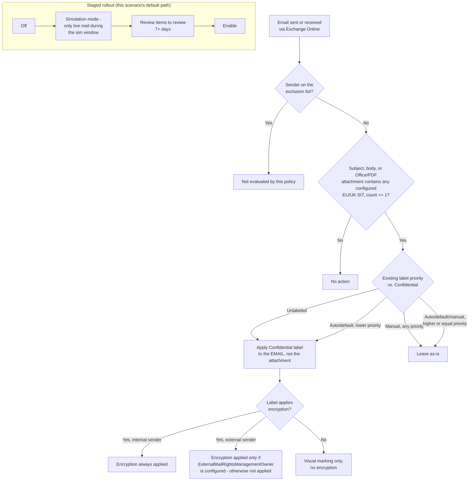

## 1. Problem statement

This library ships two closely related, already-reviewed auto-labeling scenarios, each closing
half of the gap this scenario finishes:

- `scenarios/information-protection/auto-label-eu-personal-data-sharepoint/` applies
  jurisdiction-appropriate EU/UK sensitive information types (SITs) to SharePoint/OneDrive content
  **at rest**, but explicitly leaves Exchange out of scope (`design.md` §8 there).
- `scenarios/information-protection/auto-label-confidential-exchange/` applies the same
  auto-labeling mechanism to Exchange email **in transit**, but defaults to U.S. Social Security
  Number and Credit Card Number — the same U.S.-centric starter set the EU/UK SharePoint sibling
  was built to move away from for a non-U.S. buyer.

An enterprise whose regulated population is EU/UK-only and has deployed both existing siblings
still has no email-channel coverage for EU/UK personal data specifically: the SharePoint/OneDrive
sibling doesn't reach mail, and the Exchange sibling's SIT set doesn't match EU/UK identifier
formats. This scenario is the missing intersection — the EU/UK SIT set, applied to the Exchange
location — closing the last cell in a 2×2 (location × SIT-region) this library had already built
three of the four corners for.

Nothing here is a new pattern. Every mechanical decision in this scenario was already made,
reviewed, and grounded by one of the two siblings above; this design document exists to state
plainly which decision came from which sibling, and to flag the one place their combination
surfaces a genuinely new (if modest) consideration — GDPR is now the *direct*, not adjacent,
regulatory driver for the exact data class this control protects (§2 of `README.md`).

## 2. Design goals

1. Apply the **Confidential** label (parameterizable) automatically to Exchange email (subject,
   body, and Office/PDF attachments evaluated for conditions) containing EU/UK personal
   identifiers — national ID numbers, the EU Social-Security-or-equivalent family, and EU-format
   debit card numbers — as messages are sent and received, without requiring any user action.
2. Reuse, unchanged, every Exchange-specific mechanical decision the `auto-label-confidential-
   exchange` sibling already made and had reviewed: one rule (`-Workload` is single-valued),
   sender-based exclusion (`-ExchangeSenderException`, not a location exception — no
   `-ExchangeLocationException` parameter exists), `-ExchangeLocation All`, and the same
   override-safety guarantee (never override a manual label; only a lower-priority auto-applied/
   default one).
3. Reuse, unchanged, every SIT-selection mechanical decision the `auto-label-eu-personal-data-
   sharepoint` sibling already made and had reviewed: the three-SIT EU-wide bundle default (EU
   national identification number, EU Social Security Number (SSN) or Equivalent ID, EU debit card
   number), the `-SensitiveInfoTypeName` localization parameter, and resolving every configured
   name against `Get-DlpSensitiveInformationType` at deploy time rather than trusting a literal
   string.
4. Idempotent and re-runnable: running the deploy script twice must not create duplicate policies
   or rules.
5. Ship "off" by default: simulation mode first, matching `AGENTS.md` §4 and this library's
   established precedent.

## 3. Why a third scenario, not a parameter on either sibling

Retrofitting either existing sibling to cover this scenario's combination would mean either:

- Adding an Exchange location option to `auto-label-eu-personal-data-sharepoint` — but that
  scenario's whole policy/rule naming, README prose, and `reviews.md` findings are written
  specifically around SharePoint/OneDrive's at-rest, location-exception, two-workload model. An
  Exchange branch bolted on would need a second, materially different exclusion mechanism
  (sender-based, not location-based) and a second, materially different observability story (no
  Labeled-items dashboard, live-traffic-only simulation) living inside one README — exactly the
  "stops reading as the clean, niche format `AGENTS.md` §4 requires" problem the EU/UK SharePoint
  sibling's own `design.md` §3 already used to justify *not* retrofitting the U.S.-SIT sibling.
- Adding an EU-SIT-set option to `auto-label-confidential-exchange` — but that scenario's identity
  is specifically the U.S.-SIT Exchange scenario; parameterizing its SIT set open-endedly would
  either require the same `Get-DlpSensitiveInformationType`-resolution machinery this scenario
  needs anyway (duplicating it inside an already-shipped, already-reviewed fragment) or silently
  changing what a buyer who deployed it for its documented U.S. SSN/Credit-Card-Number behavior
  gets going forward.

A third, sibling scenario folder — same overall architecture as both, borrowing the Exchange
mechanics from one and the SIT mechanics from the other — keeps all three scenarios independently
deployable, independently rollback-able, and independently readable. This mirrors the precedent
already set twice in this repo: `auto-label-confidential-exchange` (a sibling by *location*, not
*SIT set*) and `auto-label-eu-personal-data-sharepoint` (a sibling by *SIT set*, not *location*).
This scenario is a sibling by *both* axes at once — the remaining unbuilt cell, not a new axis.

## 4. Policy architecture

One auto-labeling policy (`Confidentiality - Auto-Label EU Personal Data in Exchange Email`), one
rule (`AutoLabel-EuPersonalData-Exchange`, `-Workload Exchange`), same SIT conditions as the
SharePoint/OneDrive EU sibling (EU national identification number OR EU Social Security Number
(SSN) or Equivalent ID OR EU debit card number, minimum count 1 each — grounding for these three
SITs as real, selectable SIT objects, not just a documentation grouping, is inherited unchanged
from that sibling's `design.md` §4 and is not re-derived here).

| Setting | Value |
|---|---|
| `ExchangeLocation` | `All` (default) — required for the policy to evaluate incoming mail from external senders [[7]](#references) |
| `ExchangeSenderException` | `<ExcludedMailboxSmtpAddress>` (optional) — one or more nominated mailboxes (e.g., a legal-hold mailbox) whose **outbound** mail is never evaluated |
| `OverwriteLabel` | `$true` — never overrides a manual label, only a lower-priority auto-applied/default one |
| `ExternalMailRightsManagementOwner` | Not set by default (optional parameter) |
| `SensitiveInfoTypeName` | `'EU national identification number'`, `'EU Social Security Number (SSN) or Equivalent ID'`, `'EU debit card number'` (default; overridable — §5) |
| `Mode` | `TestWithNotifications` (deploy default) → `Enable` after review |

## 5. Localization parameter — `-SensitiveInfoTypeName`

Identical mechanism and rationale to the SharePoint/OneDrive EU sibling's `design.md` §5, applied
to the Exchange rule's `ContentContainsSensitiveInformation` condition list instead of the
SharePoint/OneDrive rules'. Not re-derived here beyond stating it is unchanged: a buyer whose
regulated population is limited to specific member states passes just those countries' own SITs
(e.g. `-SensitiveInfoTypeName 'Germany Identity Card Number','France Social Security Number','EU
debit card number'`) for tighter false-positive control than the full 26-country default bundle.

**Opt-in travel-document bundle (`-IncludeTravelDocumentSits`)** — ported unchanged from the
SharePoint/OneDrive EU sibling's own switch of the same name (`design.md` §4/§5 there), added to
this scenario as a follow-up (`PROGRESS.md`, "Follow-ups discovered while building the opt-in
travel-document bundle switch") for parity across both locations rather than leaving the Exchange
channel one switch behind its file-scoped sibling. Appends `'EU passport number'` and `"EU driver's
license number"` — both real, confirmed EU-wide bundle SITs — to whatever `-SensitiveInfoTypeName`
set is already in effect (default or a caller's narrowed override), not a replacement of it.

Both bundle memberships were re-fetched directly from their own Microsoft Learn index pages during
this addition (2026-09-09) and confirmed identical to the SharePoint/OneDrive sibling's original
grounding, not assumed to still match:

- **EU passport number**: 25 EU member states' own entities + one combined **"U.S./U.K. passport
  number"** entity — no standalone U.K. entity, and no Luxembourg or Netherlands entity either
  [[9]](#references).
- **EU driver's license number**: all 27 EU member states' own entities + a standalone **U.K.**
  entity — the more complete of the two bundles [[10]](#references).

**The same U.S./U.K.-merge consequence the SharePoint/OneDrive sibling's `design.md` §4 already
disclosed applies unchanged to email**: a buyer who enables this switch specifically for U.K.
travel-document coverage in email also enables U.S. passport-number detection as an inseparable
side effect — there is no way to select one without the other via this bundle SIT. Flagged in
`README.md` §6/§11 and the deploy script's `.PARAMETER IncludeTravelDocumentSits` block, not
silently absorbed into "just enable the bundle" framing.

**Per-country checksum/confidence detail lives in one place, not duplicated:** the SharePoint/
OneDrive sibling's `design.md` §4 now tables all 26 "EU passport number" and all 28 "EU driver's
license number" members (only 8% and 11% checksum-validated, respectively, versus 73% for the
default national-ID bundle) — this scenario references that single table rather than duplicating it,
avoiding drift across two scenario folders that both reference the same two SITs. The headline
finding applies unchanged to email: a buyer enabling `-IncludeTravelDocumentSits` here should expect
the same materially higher false-positive rate as the SharePoint/OneDrive sibling.

## 6. Where the two siblings' designs combine without friction, and the one place they don't

Combining the two siblings' already-reviewed decisions was mechanical everywhere except one
place, described here rather than glossed over:

- **No conflict**: SIT selection and exclusion mechanism are orthogonal. `-ExchangeSenderException`
  (from the Exchange sibling) and `-SensitiveInfoTypeName` (from the EU/UK sibling) apply to
  different parts of the rule/policy object and don't interact — a sender exclusion works
  identically regardless of which SIT set the rule matches on.
- **No conflict**: rollout staging, override semantics (`OverwriteLabel = $true`), and idempotency
  pattern are identical across all three scenarios in this family and required no reconciliation.
- **The one place that needed an explicit decision, not a copy-paste**: which sibling's
  regulatory framing (`README.md` §2) should lead. The EU/UK SharePoint sibling frames GDPR
  Article 32 as directly defensible because its SITs genuinely match EU/UK formats (unlike the
  U.S.-SIT Exchange sibling, which explicitly disclaims GDPR-completeness). Because this scenario
  combines the EU/UK SIT set with the highest-volume exfiltration channel (email) for that data,
  its GDPR framing is not just "as defensible as the SharePoint sibling's" — it is the scenario in
  this three-scenario family where a real external-mail data-loss event is both most GDPR-relevant
  (Article 33/34 breach-notification exposure turns on data actually leaving the organization) and
  least protected by the current default (§6 of `README.md`: external-sender encryption is opt-in,
  not automatic). §2 and §11 of `README.md` state this plainly rather than inheriting the softer
  "adjacent driver" framing either sibling alone would suggest.

## 7. Key decisions

| Decision | Choice | Source / rationale |
|---|---|---|
| Deploy surface | Security & Compliance PowerShell (`Connect-IPPSSession`) | Same as both siblings — `docs/automation-surface.md` surface 2. |
| One rule, one workload | `-Workload Exchange` only | Inherited from `auto-label-confidential-exchange/design.md` §3 — `New-AutoSensitivityLabelRule -Workload` is single-valued and this scenario targets exactly one workload. |
| Exclusion mechanism | `-ExchangeSenderException` (sender-based) | Inherited from `auto-label-confidential-exchange/design.md` §3 — no `-ExchangeLocationException` parameter exists; confirmed against the cmdlet's full parameter syntax. |
| Default SITs | EU national identification number, EU Social Security Number (SSN) or Equivalent ID, EU debit card number | Inherited from `auto-label-eu-personal-data-sharepoint/design.md` §4 — the same EU-wide bundle grounding, unchanged by the location switch. |
| Localization mechanism | `-SensitiveInfoTypeName string[]`, resolved via `Get-DlpSensitiveInformationType` at deploy time | Inherited from `auto-label-eu-personal-data-sharepoint/design.md` §5. |
| `ExternalMailRightsManagementOwner` | Not configured by default | Inherited from `auto-label-confidential-exchange/design.md` §6 — a deliberate, buyer-specific decision this scenario should not default silently, now sharper given §6's GDPR framing. |
| Label scope prerequisite | Confidential label's scope must include **Emails** | Inherited from `auto-label-confidential-exchange/design.md` §6 — distinct from the SharePoint/OneDrive siblings' "Files & other data assets" requirement. |
| Regulatory framing | GDPR Article 32 as the primary driver, with an explicit sharper note on the external-encryption gap | §6 — the one place this scenario's combination surfaces a decision neither sibling alone made. |
| Opt-in travel-document bundle | `-IncludeTravelDocumentSits` switch, ported unchanged from the SharePoint/OneDrive EU sibling | §5 — parity follow-up so the Exchange channel isn't one switch behind its file-scoped sibling; both bundle memberships re-confirmed directly, not assumed. |

## 8. Non-goals

- This scenario does not author or publish the `Confidential` sensitivity label — same
  prerequisite-dependency pattern as both siblings.
- This scenario does not cover mail already at rest in mailboxes — Exchange auto-labeling is
  in-transit only, inherited unchanged from `auto-label-confidential-exchange/design.md` §5/§7.
- This scenario does not attempt EU personal-data-category completeness (names, physical
  addresses, health data, biometric data are all "personal data" under GDPR Article 4(1) but are
  covered by entirely separate SIT/named-entity families) — inherited unchanged from
  `auto-label-eu-personal-data-sharepoint/design.md` §8.
- This scenario does not configure `-ExternalMailRightsManagementOwner` — left as an explicit,
  buyer-specific extension point (§7), not a default.
- This scenario does not re-validate or change either sibling scenario's own prerequisites,
  scripts, or `reviews.md` findings — it is an additive, independent policy against the same
  label, reusing (not re-opening) both siblings' already-reviewed designs.

## References

1. Automatically apply a sensitivity label to Microsoft 365 data — <https://learn.microsoft.com/purview/apply-sensitivity-label-automatically>
2. Automatically apply a sensitivity label to Microsoft 365 data — "Compare auto-labeling for Office apps with auto-labeling policies" — <https://learn.microsoft.com/purview/apply-sensitivity-label-automatically#compare-auto-labeling-for-office-apps-with-auto-labeling-policies>
3. New-AutoSensitivityLabelPolicy reference (`-ExchangeLocation`, `-ExchangeSenderException`, `-ExternalMailRightsManagementOwner` — confirms no `-ExchangeLocationException` parameter exists) — <https://learn.microsoft.com/powershell/module/exchangepowershell/new-autosensitivitylabelpolicy>
4. New-AutoSensitivityLabelRule reference (`-Workload` accepted values: Exchange, SharePoint, OneDriveForBusiness) — <https://learn.microsoft.com/powershell/module/exchangepowershell/new-autosensitivitylabelrule>
5. Get-DlpSensitiveInformationType reference — <https://learn.microsoft.com/powershell/module/exchangepowershell/get-dlpsensitiveinformationtype>
6. EU national identification number / EU Social Security Number (SSN) or Equivalent ID / EU debit card number entity definitions — <https://learn.microsoft.com/purview/sit-defn-eu-national-identification-number>, <https://learn.microsoft.com/purview/sit-defn-eu-social-security-number-equivalent-identification>, <https://learn.microsoft.com/purview/sit-defn-eu-debit-card-number>
7. Automatically apply a sensitivity label to Microsoft 365 data — "Example: Apply a label to Exchange email based on the subject" (ExchangeLocation All requirement for external senders) — <https://learn.microsoft.com/purview/apply-sensitivity-label-automatically#example-apply-a-label-to-exchange-email-based-on-the-subject>
8. Create custom sensitive information types — "These SITs can't be copied" (confirms the EU-wide bundle SITs are real, selectable SIT objects) — <https://learn.microsoft.com/purview/sit-create-a-custom-sensitive-information-type#before-you-begin>
9. EU passport number bundle membership (25 EU states + one combined "U.S./U.K. passport number" entity — no standalone U.K., Luxembourg, or Netherlands entity), re-fetched directly 2026-09-09 — <https://learn.microsoft.com/purview/sit-defn-eu-passport-number>
10. EU driver's license number bundle membership (all 27 EU member states + a standalone U.K. entity), re-fetched directly 2026-09-09 — <https://learn.microsoft.com/purview/sit-defn-eu-drivers-license-number>
