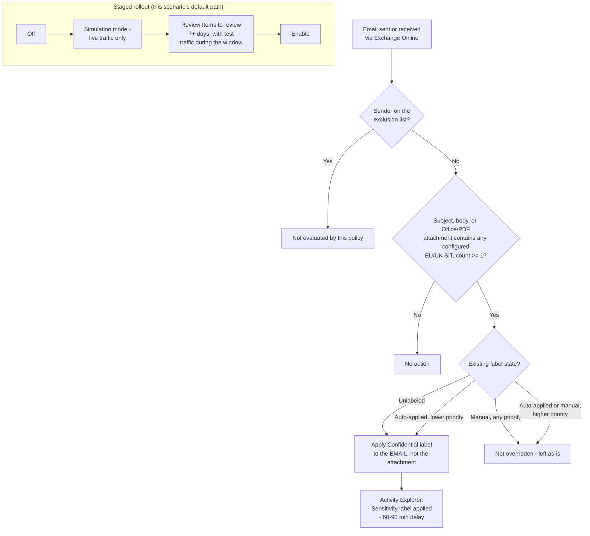

## 1. Scenario summary

Automatically applies an existing **"Confidential"** sensitivity label to Exchange Online email
(subject, body, and Office/PDF attachments) that contains EU/UK personal identifiers, national ID
numbers, the EU Social-Security-or-equivalent family, and EU-format debit card numbers, as
messages are sent and received, without waiting on end users to label anything themselves.
Deployed as a single Microsoft Purview auto-labeling policy with one rule, staged
simulation-first, with an optional sender-based exclusion for a nominated legal/eDiscovery
mailbox and a localizable sensitive-information-type (SIT) list.

**Who it's for:** an enterprise whose regulated population is EU/UK-only (or includes a
significant EU/UK segment) that has already deployed, or is evaluating,
`scenarios/information-protection/auto-label-eu-personal-data-sharepoint/` (EU/UK coverage for
files at rest) and/or `scenarios/information-protection/auto-label-confidential-exchange/` (email
coverage with U.S.-format SITs), and needs the one combination neither of those two ships:
EU/UK-format personal data, classified in email. This is the direct email-channel counterpart of
the SharePoint/OneDrive EU/UK scenario, and the direct EU/UK-SIT counterpart of the U.S.-SIT
Exchange scenario. Deploy this **alongside**, not instead of, either sibling, all three are
independent policies sharing a label and a design philosophy (`design.md` §3).

## 2. Business/regulatory driver

**GDPR Article 32** ("appropriate technical and organisational measures" for the security of
personal data processing) and the parallel intent of **ISO/IEC 27001:2022 Annex A.5.12 / A.8.2**
(information classification). This scenario's GDPR framing is the most directly load-bearing of
this library's three related auto-labeling scenarios, not just an equally-applicable one: it pairs
the SIT set that actually matches EU/UK personal-data formats with the channel, email, where
data most often actually leaves an organization. A real incident here (an employee forwarding an
unredacted spreadsheet of EU national ID numbers, a support reply pasting an EU debit card number
back to a customer, a departing employee mailing records externally) is exactly the kind of event
that triggers **GDPR Article 33/34 breach-notification** obligations, and, as §11 makes explicit
, this control's *default* configuration does not encrypt that exact external-bound case
automatically. Read §11 before assuming "GDPR driver" means "GDPR-safe by default."

**Scope note:** the same starter-set caveat from both sibling scenarios applies here, the
three-SIT default (EU national identification number, EU Social Security Number (SSN) or
Equivalent ID, EU debit card number) is a representative identity+financial pair, not a
jurisdiction-complete catalog of "personal data" under GDPR Article 4(1) (which is far broader:
names, physical addresses, health data, biometric data). See
`auto-label-eu-personal-data-sharepoint/README.md` §2 for the full discussion; not repeated here to
avoid drift between three copies of the same caveat.

## 3. Prerequisites

Full licensing detail and citations: [Licensing matrix](/docs/licensing-matrix/). Identical to
`auto-label-confidential-exchange`'s prerequisite set (same deploy surface, same location type),
with the EU/UK sibling's SIT-name-resolution caveat added:

| Requirement | Minimum | Notes |
|---|---|---|
| Automatic / policy-based labeling | **Microsoft 365 E5 / A5 / G5**, **Microsoft Purview Suite** (ex-E5 Compliance), or the **Information Protection & Governance (IP&G)** add-on | [Licensing matrix §2](/docs/licensing-matrix/#2-master-capability--license-matrix), Information Protection row, same entitlement as both sibling scenarios |
| Role to author/edit the policy | **Information Protection Admin** role group | [RBAC model §3](/docs/rbac-model/#3-microsoft-entra-roles-that-map-into-purview) |
| Role to turn the policy on after simulation | **Compliance Administrator** or **Compliance Data Administrator** | Distinct from the authoring role, the **Turn on policy** action is greyed out in the portal even after a successful simulation |
| Automation identity | App registration with **Exchange.ManageAsApp**, granted the Information Protection Admin role group (plus Compliance Administrator/Compliance Data Administrator if the same identity also enforces) | Certificate-based app-only auth, [Automation surface §3](/docs/automation-surface/#3-authentication-patterns-interactive-vs-unattended) |
| Dependency (not deployed by this scenario) | A published sensitivity label named **Confidential** (parameterizable), with label scope including **Emails**, and **not** a parent label | Same scope requirement as `auto-label-confidential-exchange`, **different** from the SharePoint/OneDrive EU sibling's "Files & other data assets" requirement. If the label was published only for one of the file-scoped scenarios, confirm (or extend) its scope to include Emails first |
| Tenant configuration: unified audit logging on | Audit log search enabled | Required for simulation results and Activity Explorer, this scenario's primary validation surface (§7) |
| Tenant configuration: sensitivity labels enabled for SharePoint/OneDrive (`EnableAIPIntegration`) | **Not required for this scenario** | That toggle is SharePoint/OneDrive-specific and has no Exchange equivalent, same simplification `auto-label-confidential-exchange/README.md` §3 already documents |
| Region availability | Auto-labeling available in tenant's region | Same regional-availability caveat as all three scenarios |
| Scoping nuance | At least one **non-EDM** sensitive information type per rule | Same rule as all three scenarios |
| SIT-name resolution risk | Byte-exact casing of the EU-wide bundle SIT names is unconfirmed against a live tenant | Same open item as the SharePoint/OneDrive EU sibling, see §11. The deploy script defends against it at runtime; this table flags it as a pre-flight awareness item, not a blocker |

> Verify current entitlement names against [Licensing matrix](/docs/licensing-matrix/) (dated 2026-09-02) and the
> Product Terms before a sales commitment, SKU names change.

## 4. Architecture



One auto-labeling policy (`Confidentiality - Auto-Label EU Personal Data in Exchange Email`) with
one rule (`-Workload Exchange` is single-valued and this scenario targets exactly one workload).
Location/exclusion mechanics borrowed unchanged from `auto-label-confidential-exchange`; SIT set
and localization mechanics borrowed unchanged from `auto-label-eu-personal-data-sharepoint`. Full
rationale: `design.md` §3, §7.

## 5. Step-by-step implementation

### Portal path (for a first manual walkthrough / to validate intent before scripting)

1. Confirm the **Confidential** label's scope includes **Emails** (Purview portal → Information
 Protection → Labels → select **Confidential** → Edit → confirm **Emails** is checked under
 scope). If it only covers Files & other data assets today (e.g., because only the SharePoint/
 OneDrive EU sibling has been deployed so far), add Emails to its scope before continuing.
2. Sign in to the [Microsoft Purview portal](https://purview.microsoft.com) → **Solutions** →
 **Information Protection** → **Policies** → **Auto-labeling policies** → **+ Create
 auto-labeling policy** → **Automatically apply label only**.
3. Category: **Custom** → **Custom policy** → **Next**.
4. Name: `Confidentiality - Auto-Label EU Personal Data in Exchange Email`.
5. **Choose a label to auto-apply**: select the existing **Confidential** label. Confirm it is
 *not* shown as a parent label in the picker.
6. **Choose locations**: select **Exchange email** only (leave SharePoint/OneDrive unselected, 
 those are covered by the SharePoint/OneDrive EU sibling's own policy). Keep **All** included and
 **None** excluded if the policy must evaluate incoming mail from outside your organization;
 otherwise exclude the nominated legal/eDiscovery mailbox under **Excluded**.
7. **Set up common or advanced rules** → **Common rules** → add condition **Content contains** →
 **Sensitive info types** → add **EU national identification number**, **EU Social Security
 Number (SSN) or Equivalent ID**, and **EU debit card number**, minimum count **1** each,
 combined with **Any of these** (logical OR). To localize to specific member
 states instead of the full EU-wide bundles, search the picker for the individual per-country SIT
 (e.g. "Germany Identity Card Number") and use that in place of the bundle.
8. **Additional label settings**: leave default (don't force-override higher-priority labels).
9. **Decide if you want to test out the policy now or later**: select **Run policy in simulation
 mode**; do **not** enable "turn on automatically after 7 days", same deliberate-enable standard
 as both sibling scenarios (§8).
10. **Submit** → **Done**.
11. **While simulation is running, send and receive representative test messages.** Exchange
 simulation does not scan existing mailbox content, it only evaluates live traffic during the
 simulation window (`design.md` §4 sibling reference). A simulation run with
 no test traffic during the window will show zero matches even for a correctly configured rule.

### Script path (idempotent, parameterized, dry-run capable)

```powershell
# 1. Connect (certificate app-only, see docs/automation-surface.md §3)
Connect-IPPSSession -AppId $AppId -Certificate $Cert -Organization $TenantDomain

# 2. Dry run, reports every change, makes none. Default SIT set: EU-wide bundles (§6).
./deploy/New-EuPersonalDataAutoLabelExchangePolicy.ps1 `
    -LabelName 'Confidential' `
    -ExcludedMailboxSmtpAddress 'legalhold@contoso.com' `
    -WhatIf

# 3. Deploy in simulation mode (default), then send/receive test mail while it runs
./deploy/New-EuPersonalDataAutoLabelExchangePolicy.ps1 `
    -LabelName 'Confidential' `
    -ExcludedMailboxSmtpAddress 'legalhold@contoso.com'

# 3b. Or, localized to specific member states instead of the full EU-wide bundle (§6):
./deploy/New-EuPersonalDataAutoLabelExchangePolicy.ps1 `
    -LabelName 'Confidential' `
    -SensitiveInfoTypeName 'Germany Identity Card Number','France Social Security Number','EU debit card number'

# 3c. Or, add the opt-in passport/driver's-license bundle on top of whichever set above is in
#     effect (§6), read the U.S./U.K. passport-merge gotcha in §11 before enabling for a
#     U.K.-only buyer:
./deploy/New-EuPersonalDataAutoLabelExchangePolicy.ps1 `
    -LabelName 'Confidential' `
    -IncludeTravelDocumentSits

# 4. After a review window with real test traffic, enforce
./deploy/New-EuPersonalDataAutoLabelExchangePolicy.ps1 `
    -LabelName 'Confidential' `
    -ExcludedMailboxSmtpAddress 'legalhold@contoso.com' `
    -Mode Enable -Force

# 5. Validate
./validate/Test-EuPersonalDataAutoLabelExchangePolicy.ps1 -LabelName 'Confidential'
```

The deploy script uses Security & Compliance PowerShell (`New-AutoSensitivityLabelPolicy`,
`New-AutoSensitivityLabelRule`, `Get-DlpSensitiveInformationType`), automation surface 2 per
[Automation surface §1](/docs/automation-surface/#1-five-automation-surfaces-not-one-read-this-first), the same surface both sibling scenarios use.

## 6. Configuration reference

| Setting | Rule: `AutoLabel-EuPersonalData-Exchange` |
|---|---|
| `Workload` | `Exchange` |
| Sensitive info types (default) | EU national identification number, EU Social Security Number (SSN) or Equivalent ID, EU debit card number, `mincount = 1` each, OR-combined |
| `Policy` | `Confidentiality - Auto-Label EU Personal Data in Exchange Email` |

| Policy-level setting | Value |
|---|---|
| `ApplySensitivityLabel` | `<LabelName>` (default `Confidential`), must reference an existing, published, non-parent label whose scope includes **Emails** |
| `ExchangeLocation` | `All` |
| `ExchangeSenderException` | `<ExcludedMailboxSmtpAddress>` (optional; one or more SMTP addresses), excludes that mailbox's **outbound** mail only, not mail sent to it (`design.md` §4/§7, inherited from `auto-label-confidential-exchange`) |
| `OverwriteLabel` | `$true`, overrides a lower-priority auto-applied/default label only, never a manual one |
| `ExternalMailRightsManagementOwner` | Not set (optional; see §11) |
| `Mode` | `TestWithNotifications` (deploy default) → `Enable` after review |

**Localizing the SIT set (`-SensitiveInfoTypeName`):** identical mechanism to the SharePoint/
OneDrive EU sibling's own §6, passing a narrower per-country list instead of the default bundle
gives tighter false-positive control and a clearer per-jurisdiction legal-basis mapping:

| Scenario | `-SensitiveInfoTypeName` example |
|---|---|
| Full EU/UK coverage (default) | `'EU national identification number','EU Social Security Number (SSN) or Equivalent ID','EU debit card number'` |
| Germany + France only | `'Germany Identity Card Number','France Social Security Number','EU debit card number'` |
| Add passport numbers too | append `'EU passport number'` (also a real, confirmed EU-wide bundle SIT, `design.md` §4 sibling reference) |

**Opt-in travel-document bundle (`-IncludeTravelDocumentSits`):** additive switch, appends `'EU
passport number'` and `"EU driver's license number"` (also real, confirmed EU-wide bundle SITs, 
`design.md` §5) to whichever `-SensitiveInfoTypeName` set is already in effect (default or
localized), instead of requiring the full list to be retyped by hand. Ported from the
SharePoint/OneDrive EU sibling's own switch of the same name, for parity across both locations. Use
for a buyer whose email traffic is travel-document- or HR-record-heavy. **Before enabling for a
U.K.-only buyer:** the "EU passport number" bundle has no standalone U.K. entity, U.K. passport
coverage is merged into a single combined "U.S./U.K. passport number" entity, so this switch also
enables U.S. passport-number detection as an inseparable side effect (`design.md` §5). The two
opt-in bundles' member-state coverage also isn't identical to each other or to the default
national-ID bundle, see the SharePoint/OneDrive sibling's `design.md` §4 for the full per-bundle
membership table (not re-tabled here, per `design.md` §5).

The deploy script resolves every name against `Get-DlpSensitiveInformationType` before creating or
updating the rule, and fails with a list of close matches if a name doesn't resolve exactly, see
§11 and `design.md` §4 for why this validation exists.

Full cmdlet parameter grounding: `deploy/New-EuPersonalDataAutoLabelExchangePolicy.ps1` inline
comments and its `.NOTES` block cite the exact Microsoft Learn PowerShell reference pages.

## 7. Validation / how to prove it works

**Read this section before assuming a passing check proves the control works, Exchange's
observability surface is genuinely thinner than the SharePoint/OneDrive siblings', not just
smaller.**

1. **Automated config check**, `./validate/Test-EuPersonalDataAutoLabelExchangePolicy.ps1
 -LabelName 'Confidential'` confirms the policy and rule exist with the expected location, SIT
 conditions (checked individually against `-SensitiveInfoTypeName`, not just "at least one"), and
 target label; exits non-zero on any hard failure. This proves the policy is *shaped* correctly,
 not that it is *labeling anything*.
2. **Simulation results**, Purview portal → Information Protection → Auto-labeling policies →
 select the policy → **Items to review** tab. This only shows messages sent/received **while the
 simulation was actively running**, re-running simulation with no test
 traffic shows nothing, which is expected behavior, not a failure.
3. **Functional test**, send a test email containing a documented test national-ID or card-brand
 test number for one of the configured EU/UK countries (never real personal data) from an
 in-scope mailbox to another in-scope mailbox, while the policy is in simulation or enabled.
 Confirm the match appears on **Items to review** (simulation) or, once enforced, in **Activity
 Explorer** (step 4).
4. **Post-enforcement confirmation, Activity Explorer, not Labeled items.** After moving to
 `-Mode Enable`, Purview portal → **Data classification** → **Activity Explorer** → filter
 **Activity type = Sensitivity label applied**, narrow by label/date/location. Allow **60-90
 minutes** for the activity to appear. Activity Explorer confirms the
 resulting label and **How applied** (automatic vs. manual), but does **not** identify which
 specific auto-labeling policy or rule applied it, if more than one auto-labeling policy targets
 Exchange in the tenant (plausible once both this scenario and `auto-label-confidential-exchange`
 are deployed against the same label), corroborate with the single-policy **Items to review**
 history instead of assuming Activity Explorer disambiguates for you.
5. **Exclusion test**, send a test message *from* the excluded mailbox. Confirm it is **not**
 labeled. Then send a test message *to* the excluded mailbox from an unrelated in-scope sender.
 Confirm it **is** labeled, the exclusion is sender-scoped, not mailbox-scoped, and this
 asymmetry is exactly what this test is meant to catch (`design.md` §4/§7).
6. **Override-safety test**, manually apply a different label to a test message before sending,
 then confirm the policy does not replace it.
7. **Localization test (if `-SensitiveInfoTypeName` was overridden)**, send a test message
 matching a *removed* country's format (e.g. an Italy Fiscal Code, if the deployment was narrowed
 to Germany + France only). Confirm it is **not** labeled, proving the narrower condition set is
 actually enforced and not silently falling back to the full bundle.
8. **Enforcement confirmation**, after moving to `-Mode Enable`, re-run the automated config check
 and confirm it reports `Mode: Enable` rather than a `Test*` value.
9. **Opt-in bundle test (if `-IncludeTravelDocumentSits` was used)**, run
 `./validate/Test-EuPersonalDataAutoLabelExchangePolicy.ps1 -LabelName 'Confidential'
 -IncludeTravelDocumentSits` to confirm the rule's condition list includes `EU passport number`
 and `EU driver's license number` in addition to the base SIT set. Send a test email containing a
 test U.S. or U.K. passport-number value (never a real one, and only while in simulation or
 enabled) to confirm the combined-entity gotcha in §11 in practice, both should match on
 **Items to review** or Activity Explorer, since this bundle has no way to select one without the
 other.

## 8. Operations & tuning

**Deployment sequence**: Off → simulation mode (with test traffic sent/received during the window,
§5/§7) → review for at least a business cycle (7+ days) → Enable. Same deliberate-enable standard
as both sibling scenarios and `AGENTS.md` §4, do not accept the portal's "auto-turn-on after 7
days" option.

**KPIs to watch (first 30-60 days):**
- **Activity Explorer "Sensitivity label applied" volume for Exchange**, filtered to this label and
 a How-applied value of automatic. Aggregates every auto-labeling policy applying this label, not
 just this one, if more than one exists, same caveat as `auto-label-confidential-exchange`
 README §8.
- **Items-to-review match volume during any future re-simulation** (e.g., after a rule change), 
 only reflects traffic sent during that specific window, so a "zero matches" result after a rule
 change needs fresh test traffic before it can be trusted.
- **Per-country match distribution**, inherited from the SharePoint/OneDrive EU sibling's own §8, 
 Activity Explorer's contextual summary can show which specific country's pattern matched a given
 message. A tenant that only ever sees matches from 2-3 countries is a signal to consider
 narrowing to a per-country `-SensitiveInfoTypeName` list (§6) rather than running the full
 26-country bundle indefinitely.
- **False-positive rate**, the EU national ID bundle's checksum coverage varies by country: 19 of
 26 members are checksum-validated, 7 are pattern-only (Austria, Croatia, Cyprus, France, Greece,
 Malta, U.K., full table in the SharePoint/OneDrive sibling's `design.md` §4, cited from this
 scenario's own §11); watch for user-reported "why was my email suddenly Confidential/encrypted"
 tickets, since there is no per-item failure dashboard for email the way there is for files.

**Alert routing:** no DLP-style incident-report email from auto-labeling itself. For Exchange
specifically, also budget for the **encryption side-effect**: an internal sender whose message
matches this rule will see their message encrypted whether or not the encryption was the intended
outcome (§6, `design.md` §4), an unexpected support ticket ("why is my recipient unable to forward
this email") is a plausible early signal worth routing to the Information Protection team's queue.

**Review cadence:** monthly for the first quarter alongside both sibling scenarios' own review
cadence (same underlying label, same team, same false-positive tuning conversation), quarterly
thereafter. Re-run `validate/Test-EuPersonalDataAutoLabelExchangePolicy.ps1` each time to catch
configuration drift, **including drift in the configured `-SensitiveInfoTypeName` list itself** if
it was ever narrowed or widened after initial deployment, and, if `auto-label-eu-personal-data-
sharepoint` is also deployed, confirm its own `-SensitiveInfoTypeName` list still matches this
scenario's (§11: nothing ties the two scripts' parameters together automatically).

**Related auto-labeling policies in this tenant (disambiguation for incident response):** if a
tenant has deployed more than one of this library's Information Protection auto-labeling
scenarios, their policy names are similar by design (same naming convention) but target different
locations and/or SIT sets. Confirm the exact policy name before disabling one during an incident:

| Policy name | Location | SIT set |
|---|---|---|
| `Confidentiality - Auto-Label EU Personal Data in Exchange Email` | Exchange | EU/UK (this scenario) |
| `Confidentiality - Auto-Label PII in Exchange Email` | Exchange | U.S. (`auto-label-confidential-exchange`) |
| `Confidentiality - Auto-Label EU Personal Data in SharePoint and OneDrive` | SharePoint/OneDrive | EU/UK (`auto-label-eu-personal-data-sharepoint`) |
| `Confidentiality - Auto-Label PII in SharePoint and OneDrive` | SharePoint/OneDrive | U.S. (`auto-label-confidential-sharepoint`) |

**Runbook, an email that should be labeled isn't:**
1. Confirm the message wasn't sent/received outside a simulation window if you're still validating
 in simulation (§7, step 2), this is expected, not a bug.
2. Confirm the sender isn't the excluded mailbox (§7, step 5), outbound mail from that mailbox is
 never evaluated, by design.
3. Confirm at least 60-90 minutes have passed before checking Activity Explorer
.
4. If a localized `-SensitiveInfoTypeName` list is in use, confirm the test message's country
 format is actually in the configured list (not the full default bundle) before treating it as a
 policy failure, same EU-specific addition the SharePoint/OneDrive sibling's own runbook makes.
5. Confirm the label's scope still includes **Emails**, an edit to the label (e.g., by someone
 working on either file-scoped sibling scenario's use case) that narrows scope back to "Files &
 other data assets only" would silently stop this policy from having any effect, with no portal
 error surfaced.
6. If none of the above explains it, check for a **rule-load failure**, a malformed rule can
 silently stop matching all Exchange traffic with no item-level failure to review, because the
 rule never loaded in the first place. Re-run the automated config check; if
 it reports the rule missing or malformed, recreate it from this scenario's deploy script.

## 9. Rollback / decommission

See `rollback.md` for the full staged procedure (disable → simulation → permanent purge). Quick
reference: `./deploy/Remove-EuPersonalDataAutoLabelExchangePolicy.ps1` disables (reversible); add
`-Purge` to permanently delete the policy and its rule.

## 10. Cost & licensing notes

- **No PAYG component for M365 mail.** Covered by the same per-user E5-tier/IP&G entitlement as
 both sibling scenarios, see [Licensing matrix §1](/docs/licensing-matrix/#1-the-two-billing-models-read-this-first), 2. No separate licensing line for this
 scenario if either sibling is already deployed; all three draw from the same entitlement.
- **No additional Azure subscription required.**
- **Sizing note:** identical to `auto-label-confidential-exchange`, `ExchangeLocation = All` means
 every licensed mailbox is effectively in scope, with no incremental licensing decision beyond
 what any sibling already requires for the same user population.

## 11. Known limitations & gotchas

- **In-transit only, no backlog coverage.** Inherited unchanged from `auto-label-confidential-
 exchange/README.md` §11 (`design.md` §8): mail delivered before this policy existed, or before it
 was turned on, is never retroactively labeled. There is no on-demand-classification equivalent for
 Exchange.
- **No "Labeled items" dashboard or policy-level Insights enforcement metrics for Exchange**, both
 report only SharePoint/OneDrive files. Use Activity Explorer instead (§7), and
 budget for its 60-90 minute delay and its inability to name which specific policy/rule applied a
 given label.
- **Exchange match counts shown during simulation Insights are estimates from sampled data, not
 exact counts**, do not report a simulation match count to a compliance
 stakeholder as an exact figure.
- **The exclusion mechanism is sender-scoped, not mailbox-scoped, and asymmetric, and that
 asymmetry is also a standing exfiltration path, not just an under-protection gap.**
 `-ExchangeSenderException` protects a nominated mailbox's outbound mail only; mail *sent to* that
 mailbox by anyone else is still evaluated and can still be labeled/encrypted. Read the other
 direction: **any mail this excluded mailbox sends, including EU/UK personal data, leaves
 completely unlabeled and unencrypted by this control, by design.** If the excluded mailbox is
 ever compromised, shared more broadly than intended, or simply repurposed, it is a standing,
 control-free channel for exactly the data class this scenario protects, and, because this
 scenario's regulatory driver is GDPR specifically, not the CCPA/GDPR pairing the U.S.-SIT sibling
 cites, a breach through that channel is a direct GDPR Article 33/34 exposure, not a secondary
 one. Treat the exclusion list as a monitored asset, reviewed periodically, not a "set once and
 forget" configuration value. Inherited from `auto-label-confidential-exchange/README.md` §11 and
 sharpened here for the GDPR-specific stakes (`design.md` §6).
- **Encryption side effects are workload-specific, and the default is weaker for the more dangerous
 direction of travel, the single most consequential finding for this scenario specifically.** If
 `Confidential` applies encryption: internal senders are always encrypted once labeled; external
 senders are **not** encrypted by default unless `-ExternalMailRightsManagementOwner` is configured
 (`design.md` §4/§6). Read plainly: **out of the box, a message containing an EU national ID number
 or EU debit card number sent to an external recipient is labeled Confidential but leaves the
 tenant in cleartext**, the exact direction of travel that determines GDPR Article 33/34
 breach-notification exposure. This risk is inherited mechanically from `auto-label-confidential-
 exchange/README.md` §11, but it lands harder here: that sibling's regulatory framing treats
 GDPR/CCPA as one of two adjacent drivers for a U.S.-format SIT pair, while this scenario's entire
 premise is GDPR-format personal data specifically. A buyer deploying this scenario should treat
 `-ExternalMailRightsManagementOwner` configuration, or pairing this scenario with a content-based
 Exchange DLP rule for external send, as materially higher-priority than for the U.S.-SIT sibling, 
 not an equally-optional extension.
- **EU checksums vary by country, unlike the U.S.-SIT sibling's fully-checksummed SIT pair.**
 Inherited unchanged from `auto-label-eu-personal-data-sharepoint/README.md` §11, now backed by a
 full 26-country table in that sibling's `design.md` §4: **19 members are checksum-validated**
 (e.g. Belgium, Germany post-2010, Spain), **7 are pattern-only** (Austria, Croatia, Cyprus, France,
 Greece, Malta, U.K.), expect a higher false-positive rate from the bundle overall, and treat this
 as one more reason a precision-conscious buyer should consider the per-country localization path
 in §6, especially if the tenant's regulated population sits in one of the 7 pattern-only markets.
- **The `-SensitiveInfoTypeName` localization parameter is independent per scenario, and nothing
 keeps this scenario's list in sync with `auto-label-eu-personal-data-sharepoint`'s.** Both
 scripts accept the same-shaped parameter and default to the same three-SIT bundle, which invites
 an operator to assume "our EU personal-data program is configured consistently." If a buyer later
 narrows the SharePoint/OneDrive sibling to, say, Germany + France only but leaves this Exchange
 scenario on the full 26-country default (or narrows this one and forgets the other), the two
 channels silently diverge, a message containing an Italy Fiscal Code could be caught in email
 but not in a SharePoint upload, or vice versa, with no error or warning from either script. There
 is no shared configuration store between the two independent scenario folders (`design.md` §3
 explains why they are separate folders at all), so this is a genuine, disclosed operational gap,
 not a defect either script can fix alone: treat "confirm both scripts' `-SensitiveInfoTypeName`
 lists match" as a standing item in the review cadence above, not a one-time deployment check.
- **"EU" as used by Microsoft's SIT naming does not track EU membership exactly.** Inherited
 unchanged from the SharePoint/OneDrive EU sibling's §11: the national ID bundle includes the U.K.
 (post-Brexit, no longer an EU member state) as one of its member entities, 
 treat "EU national identification number" as "EU + UK," not strictly EU-27, when explaining
 coverage to a buyer.
- **The opt-in `-IncludeTravelDocumentSits` bundle's U.K. passport coverage is merged with U.S.
 passport coverage**, same gotcha as the SharePoint/OneDrive EU sibling's own switch of the same
 name, ported here for email-channel parity (`design.md` §5). Microsoft's "EU passport number"
 bundle has no standalone U.K. passport entity, U.K. coverage exists only as a single combined
 "U.S./U.K. passport number" entity, per the bundle's own index page (re-fetched directly for this
 addition, 2026-09-09). Enabling this switch to add U.K. passport-number detection to email also
 enables U.S. passport-number detection with no way to select one without the other via this
 bundle SIT. A buyer who needs U.K.-only passport detection without U.S. false positives would
 need a custom SIT (out of scope here). Per-country checksum/confidence detail for both opt-in
 bundles is now fully tabled in the SharePoint/OneDrive sibling's `design.md` §4 (not duplicated
 here): only **8% of the 26 passport-bundle entities** (Germany, Poland) and **11% of the 28
 driver's-license-bundle entities** (Germany, Spain, U.K.) are checksum-validated, versus 73% for
 the default national-ID bundle, expect a materially higher false-positive rate from email
 matches on either opt-in SIT than from the default condition set.
- **VERIFY (pilot tenant, before production reliance): byte-exact SIT name capitalization.**
 Inherited unchanged from the SharePoint/OneDrive EU sibling's own open item (`design.md` §4), 
 Microsoft's Learn pages render the same SIT names with inconsistent casing across pages. Mitigated
 at runtime (the deploy script resolves every name against the tenant's live SIT catalog and fails
 clearly on a mismatch) but not resolved with certainty.
- **VERIFY (pilot tenant): `Get-AutoSensitivityLabelRule`'s read-back property casing for
 `ContentContainsSensitiveInformation`** (`name` vs. `Name`), same open item as both sibling
 scenarios. `validate/Test-EuPersonalDataAutoLabelExchangePolicy.ps1` checks both defensively
 rather than assuming one.
- **VERIFY (pilot tenant): whether a PDF attachment on a message an auto-labeling policy encrypts
 ends up protected as part of the overall encrypted message envelope, or left effectively in the
 clear alongside a protected email body.** Inherited unchanged from `auto-label-confidential-
 exchange/README.md` §11, Microsoft's documentation confirms this behavior for unencrypted Office
 (Word/PowerPoint/Excel) attachments specifically but doesn't state the PDF case with the same
 confidence.
- **A rule-load failure has no item-level symptom.** Inherited unchanged from `auto-label-
 confidential-exchange/README.md` §11, see the runbook in §8, step 6.
- **Config validation is not match validation**, same caveat as both sibling scenarios.
 `validate/Test-EuPersonalDataAutoLabelExchangePolicy.ps1` confirms the policy and rule are shaped
 correctly; it cannot confirm any email has actually been labeled. Always cross-check Activity
 Explorer (§7, step 4) before treating a green validation run as end-to-end proof.
- **A manually applied label permanently defeats this control**, same bypass class already
 documented for both sibling scenarios. No auto-labeling-side mitigation exists; pair with a
 content-based Exchange DLP condition for movement-blocking use cases that must not depend on the
 label being correct.
- **This scenario does not cover mail already at rest in mailboxes.** Same as `auto-label-
 confidential-exchange`, a historical-mail classification sweep is a separate eDiscovery/Content
 Search-based project, not an extension of this scenario.
- **Don't repurpose this policy for mass encrypted mailings.** Microsoft explicitly documents that
 auto-labeling policies aren't designed for bulk encrypted-distribution mailing and can cause
 delivery failures if used that way; Message Encryption's own "automatically
 send emails" label setting is the correct mechanism for that use case, not this scenario.

## 12. References

1. Automatically apply a sensitivity label to Microsoft 365 data, <https://learn.microsoft.com/purview/apply-sensitivity-label-automatically>
2. Automatically apply a sensitivity label to Microsoft 365 data, "Auto-labeling for Exchange" behavior (attachment scanning vs. labeling, Message Encryption inheritance, external-sender labeling and encryption defaults), <https://learn.microsoft.com/purview/apply-sensitivity-label-automatically#compare-auto-labeling-for-office-apps-with-auto-labeling-policies>
3. Automatically apply a sensitivity label to Microsoft 365 data, "How to configure auto-labeling policies for SharePoint, OneDrive, and Exchange" (mass-mailing caution, ExchangeLocation All/None-excluded requirement for external senders), <https://learn.microsoft.com/purview/apply-sensitivity-label-automatically#how-to-configure-auto-labeling-policies-for-sharepoint,-onedrive,-and-exchange>
4. Data Loss Prevention policy reference, "Content contains" supports multiple sensitive info types combined with "Any of these" (OR) or "All of these" (AND), <https://learn.microsoft.com/purview/dlp-policy-reference#rules>
5. Automatically apply a sensitivity label to Microsoft 365 data, "Will an existing label be overridden?", <https://learn.microsoft.com/purview/apply-sensitivity-label-automatically#will-an-existing-label-be-overridden>
6. Automatically apply a sensitivity label to Microsoft 365 data, "Example: Apply a label to Exchange email based on the subject" (live-traffic-only simulation for Exchange, label scope must include Emails), <https://learn.microsoft.com/purview/apply-sensitivity-label-automatically#example-apply-a-label-to-exchange-email-based-on-the-subject>
7. Use the Insights tab to analyze auto-labeling policies in Microsoft Purview, Exchange email excluded from Labeled items/enforcement metrics; Activity Explorer as the documented alternative, 60-90 minute delay, doesn't identify the specific policy/rule, <https://learn.microsoft.com/purview/auto-label-insights-tab>
8. Use the Insights tab to analyze auto-labeling policies in Microsoft Purview, simulation-mode Insights, Exchange matched-item counts are estimates from sampled data; pre-flight checklist role requirements for turning on a policy (Compliance Administrator / Compliance Data Administrator), <https://learn.microsoft.com/purview/apply-sensitivity-label-automatically#before-you-begin>
9. New-AutoSensitivityLabelPolicy reference (full parameter syntax, confirms no `-ExchangeLocationException` parameter exists; `-ExchangeSender`/`-ExchangeSenderException`/`-ExchangeSenderMemberOf`/`-ExchangeSenderMemberOfException`/`-ExternalMailRightsManagementOwner`), <https://learn.microsoft.com/powershell/module/exchangepowershell/new-autosensitivitylabelpolicy>
10. EU national identification number entity definition (member list includes U.K. National Insurance Number), <https://learn.microsoft.com/purview/sit-defn-eu-national-identification-number>
11. EU Social Security Number (SSN) or Equivalent ID entity definition, <https://learn.microsoft.com/purview/sit-defn-eu-social-security-number-equivalent-identification>
12. EU debit card number entity definition, <https://learn.microsoft.com/purview/sit-defn-eu-debit-card-number>
13. Get-DlpSensitiveInformationType reference, <https://learn.microsoft.com/powershell/module/exchangepowershell/get-dlpsensitiveinformationtype>
14. New-AutoSensitivityLabelRule reference (`-Workload` accepted values: Exchange, SharePoint, OneDriveForBusiness), <https://learn.microsoft.com/powershell/module/exchangepowershell/new-autosensitivitylabelrule>
15. Create custom sensitive information types, "These SITs can't be copied" list (names the EU-wide bundle SITs individually, confirming each is a real, selectable SIT object), <https://learn.microsoft.com/purview/sit-create-a-custom-sensitive-information-type#before-you-begin>
16. Get-Label reference, <https://learn.microsoft.com/powershell/module/exchange/get-label>
17. Connect-IPPSSession reference (app-only certificate auth), <https://learn.microsoft.com/powershell/module/exchangepowershell/connect-ippssession>
18. Automatically apply a sensitivity label to Microsoft 365 data, "Policy rule fails to load" troubleshooting (rule-load failure has no item-level symptom), <https://learn.microsoft.com/purview/apply-sensitivity-label-automatically#policy-rule-fails-to-load>

> Re-verify all links against current Microsoft Learn before a customer-facing assessment or
> sale, auto-labeling behavior for Exchange (simulation semantics, Insights tab detail) and the
> SIT catalog have both changed more than once in this feature's history, same caveat as both
> sibling scenarios.
