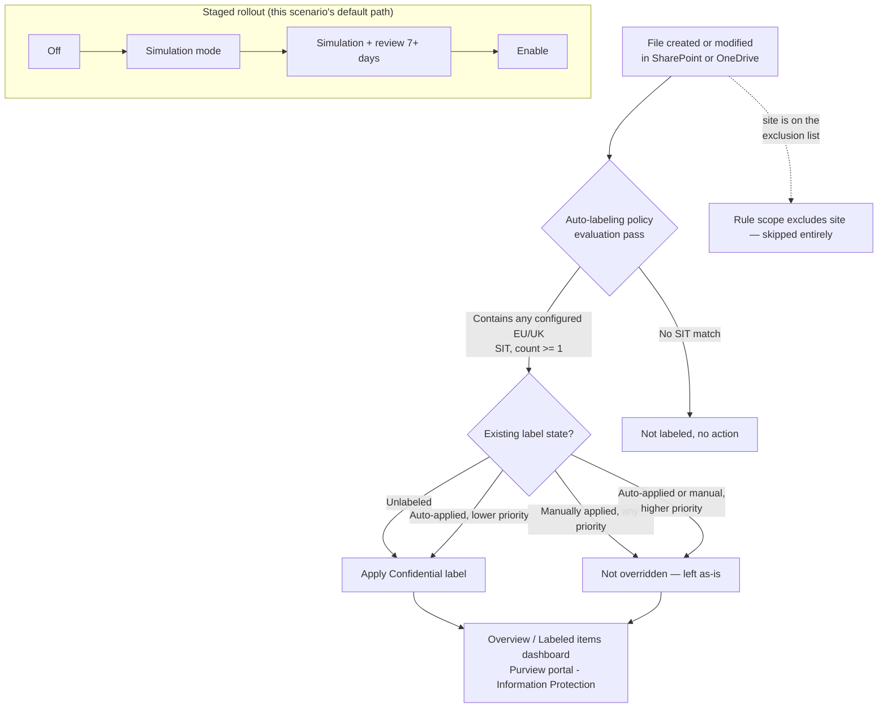

## 1. Scenario summary

Automatically applies an existing **"Confidential"** sensitivity label to SharePoint and OneDrive
files that contain EU/UK personal identifiers — national ID numbers, the EU Social-Security-or-
equivalent family, and EU-format debit card numbers — without waiting on end users to label
anything themselves. Deployed as a single Microsoft Purview **auto-labeling policy** with one rule
per workload, staged simulation-first, and scoped to exclude a nominated legal-hold/eDiscovery
site so an active hold's content isn't relabeled mid-matter.

**Who it's for:** any enterprise whose regulated population is EU/UK-only (or includes a
significant EU/UK segment) and needs classification coverage built on the jurisdiction-appropriate
identifiers Microsoft actually ships for that region — not the U.S. Social Security Number
condition this library's sibling scenario defaults to. This is the direct EU/UK counterpart of
`scenarios/information-protection/auto-label-confidential-sharepoint/`, built specifically because
that sibling scenario's own Red Team review flagged its U.S.-centric default as materially weaker
coverage for a non-U.S. buyer (see §11 and `design.md` §1).

## 2. Business/regulatory driver

**GDPR Article 32** ("appropriate technical and organisational measures" for the security of
personal data processing) and the parallel intent of **ISO/IEC 27001:2022 Annex A.5.12 / A.8.2**
(information classification) converge on the same practical requirement: an organization must be
able to show *where* regulated personal data lives and that it is *marked and protected
accordingly*. Because this scenario's default condition set actually matches EU/UK national
identifiers — not a U.S.-specific substitute — its GDPR framing is more directly defensible than
the sibling scenario's own (which explicitly disclaims jurisdiction-complete GDPR coverage from a
U.S. SSN condition).

This scenario is the **classification and marking control**, distinct from (and a prerequisite
signal for) any movement-blocking DLP control keyed off the same label — the same relationship the
sibling scenario has to `scenarios/dlp/pci-teams-exfil-block/`.

**Scope note:** the default condition set — EU national identification number, EU Social Security
Number (SSN) or Equivalent ID, EU debit card number — is a representative **starter set**, not a
jurisdiction-complete catalog of "personal data" under GDPR (which is far broader: names, physical
addresses, health data, biometric data — see `design.md` §8). It is, however, a genuinely
EU/UK-scoped starter set, unlike the sibling scenario's U.S.-SIT default. §6 and `design.md` §5
show exactly how to narrow the condition set further to only the member states a specific tenant
actually operates in.

## 3. Prerequisites

Full licensing detail and citations: `docs/licensing-matrix.md`. Identical prerequisite set to the
sibling scenario (same policy family, same deploy surface) — summarized here:

| Requirement | Minimum | Notes |
|---|---|---|
| Automatic / policy-based labeling | **Microsoft 365 E5 / A5 / G5**, **Microsoft Purview Suite** (ex-E5 Compliance), or the **Information Protection & Governance (IP&G)** add-on | Per-user for every account whose SharePoint/OneDrive content is in scope — see `docs/licensing-matrix.md` §2, Information Protection row |
| Role to author/edit auto-labeling policies | **Information Protection Admin** role group | `docs/rbac-model.md` §3 |
| Role to turn the policy on after simulation | **Compliance Administrator** or **Compliance Data Administrator** | Distinct from the authoring role — the **Turn on policy** action is greyed out in the portal without one of these, even after a successful simulation [[8]](#references) |
| Automation identity | App registration with **Exchange.ManageAsApp**, granted the Information Protection Admin role group (plus Compliance Administrator/Compliance Data Administrator if the same identity also enforces) | Certificate-based app-only auth — `docs/automation-surface.md` §3 |
| Dependency (not deployed by this scenario) | A published sensitivity label named **Confidential** (parameterizable), with label scope including **Files & other data assets**, and **not** a parent label | Same requirement and failure mode as the sibling scenario — see §11 below |
| Tenant configuration: sensitivity labels enabled for Office files in SharePoint/OneDrive | `Set-SPOTenant -EnableAIPIntegration $true` (or the Purview portal one-click banner) | Requires the SharePoint Online Management Shell (`Connect-SPOService`) — automation surface 5, `docs/automation-surface.md` §1/§3. Shared, tenant-wide setting — if the sibling scenario is already deployed, this is already satisfied |
| Tenant configuration: unified audit logging on | Audit log search enabled | Required for the auto-labeling policy's simulation mode to have results to show [[1]](#references) |
| Tenant configuration (recommended): PDF support | `Set-SPOTenant -EnableSensitivityLabelforPDF $true` | Off by default — see §11 |
| Region availability | Auto-labeling available in tenant's region | If **Auto-labeling policies** isn't visible under Information Protection > Policies, the tenant is in a region blocked by an Azure backend dependency [[1]](#references) |
| Scoping nuance | At least one **non-EDM** sensitive information type per rule | A rule built only from Exact Data Match SITs silently disables auto-labeling for that label [[1]](#references) |

> Verify current entitlement names against `docs/licensing-matrix.md` (dated 2026-09-05) and the
> Product Terms before a sales commitment — SKU names change.

## 4. Architecture



One auto-labeling policy (`Confidentiality - Auto-Label EU Personal Data in SharePoint and
OneDrive`) with two rules — one per workload, same `New-AutoSensitivityLabelRule -Workload`
single-value constraint as the sibling scenario [[2]](#references). Full rationale in
`design.md` §6.

## 5. Step-by-step implementation

### Portal path (for a first manual walkthrough / to validate intent before scripting)

1. Confirm the prerequisite banner **Turn on now** has been accepted under **Information
   Protection > Sensitivity labels** (or run `Set-SPOTenant -EnableAIPIntegration $true`) — same
   one-time tenant step as the sibling scenario [[1]](#references).
2. Sign in to the [Microsoft Purview portal](https://purview.microsoft.com) → **Solutions** →
   **Information Protection** → **Policies** → **Auto-labeling policies** → **+ Create
   auto-labeling policy** → **Automatically apply label only**.
3. Category: **Custom** → **Custom policy** → **Next**.
4. Name: `Confidentiality - Auto-Label EU Personal Data in SharePoint and OneDrive`.
5. **Choose a label to auto-apply**: select the existing **Confidential** label. Confirm it is
   *not* shown as a parent label in the picker.
6. **Choose locations**: select **SharePoint sites** and **OneDrive accounts**; keep **All**
   included, or exclude the legal-hold/eDiscovery site by URL under **Excluded**.
7. **Set up common or advanced rules** → **Common rules** → add condition **Content contains** →
   **Sensitive info types** → add **EU national identification number**, **EU Social Security
   Number (SSN) or Equivalent ID**, and **EU debit card number**, minimum count **1** each,
   combined with **Any of these** (logical OR) [[3]](#references). To localize to specific member
   states instead of the full EU-wide bundles, search the picker for the individual per-country
   SIT (e.g. "Germany Identity Card Number") and use that in place of the bundle — see §6.
8. **Additional label settings**: leave default (don't force-override higher-priority labels).
9. **Decide if you want to test out the policy now or later**: select **Run policy in simulation
   mode**; do **not** enable "turn on automatically after 7 days."
10. **Submit** → **Done**.

### Script path (idempotent, parameterized, dry-run capable)

```powershell
# 1. Connect (certificate app-only — see docs/automation-surface.md §3)
Connect-IPPSSession -AppId $AppId -Certificate $Cert -Organization $TenantDomain

# 2. Dry run — reports every change, makes none. Default SIT set: EU-wide bundles (§6).
./deploy/New-EuPersonalDataAutoLabelPolicy.ps1 `
    -LabelName 'Confidential' `
    -ExcludedSharePointSiteUrl 'https://contoso.sharepoint.com/sites/LegalHold' `
    -WhatIf

# 3. Deploy in simulation mode (default) to observe real content first
./deploy/New-EuPersonalDataAutoLabelPolicy.ps1 `
    -LabelName 'Confidential' `
    -ExcludedSharePointSiteUrl 'https://contoso.sharepoint.com/sites/LegalHold'

# 3b. Or, localized to specific member states instead of the full EU-wide bundle (§6):
./deploy/New-EuPersonalDataAutoLabelPolicy.ps1 `
    -LabelName 'Confidential' `
    -SensitiveInfoTypeName 'Germany Identity Card Number','France Social Security Number','EU debit card number'

# 3c. Or, add the opt-in passport/driver's-license bundle on top of whichever set above is in
#     effect (§6) — read the U.S./U.K. passport-merge gotcha in §11 before enabling for a
#     U.K.-only buyer:
./deploy/New-EuPersonalDataAutoLabelPolicy.ps1 `
    -LabelName 'Confidential' `
    -IncludeTravelDocumentSits

# 4. After a review window, enforce
./deploy/New-EuPersonalDataAutoLabelPolicy.ps1 `
    -LabelName 'Confidential' `
    -ExcludedSharePointSiteUrl 'https://contoso.sharepoint.com/sites/LegalHold' `
    -Mode Enable -Force

# 5. Validate
./validate/Test-EuPersonalDataAutoLabelPolicy.ps1 -LabelName 'Confidential'
```

The deploy script uses Security & Compliance PowerShell (`New-AutoSensitivityLabelPolicy`,
`New-AutoSensitivityLabelRule`, `Get-DlpSensitiveInformationType`) — automation surface 2 per
`docs/automation-surface.md` §1.

## 6. Configuration reference

| Setting | Rule: `AutoLabel-EuPersonalData-SharePoint` | Rule: `AutoLabel-EuPersonalData-OneDrive` |
|---|---|---|
| `Workload` | `SharePoint` | `OneDriveForBusiness` |
| Sensitive info types (default) | EU national identification number, EU Social Security Number (SSN) or Equivalent ID, EU debit card number — `mincount = 1` each, OR-combined | Same |
| `Policy` | `Confidentiality - Auto-Label EU Personal Data in SharePoint and OneDrive` (shared) | Same |

| Policy-level setting | Value |
|---|---|
| `ApplySensitivityLabel` | `<LabelName>` (default `Confidential`) — must reference an existing, published, non-parent label |
| `SharePointLocation` / `OneDriveLocation` | `All` |
| `SharePointLocationException` | `<ExcludedSharePointSiteUrl>` (optional; legal-hold/eDiscovery site) |
| `OverwriteLabel` | `$true` — overrides a lower-priority **auto-applied** label only; manual and higher-priority labels are never overridden [[4]](#references) |
| `Mode` | `TestWithNotifications` (deploy default) → `Enable` after review |

**Localizing the SIT set (`-SensitiveInfoTypeName`):** the default three-SIT set (§4/design.md §4)
matches every EU member state's own identifier format via Microsoft's built-in EU-wide bundle
SITs. A buyer whose regulated population is limited to specific member states gets tighter
false-positive control, and a clearer per-jurisdiction legal-basis mapping, by passing only those
countries' own per-country SITs instead — e.g.:

| Scenario | `-SensitiveInfoTypeName` example |
|---|---|
| Full EU/UK coverage (default) | `'EU national identification number','EU Social Security Number (SSN) or Equivalent ID','EU debit card number'` |
| Germany + France only | `'Germany Identity Card Number','France Social Security Number','EU debit card number'` |

**Opt-in travel-document bundle (`-IncludeTravelDocumentSits`):** additive switch — appends `'EU
passport number'` and `"EU driver's license number"` (also real, confirmed EU-wide bundle SITs —
`design.md` §4) to whichever `-SensitiveInfoTypeName` set is already in effect (default or
localized), instead of requiring the full list to be retyped by hand. Use for a buyer whose
SharePoint/OneDrive estate is travel-document- or HR-record-heavy. **Before enabling for a U.K.-only
buyer:** the "EU passport number" bundle has no standalone U.K. entity — U.K. passport coverage is
merged into a single combined "U.S./U.K. passport number" entity, so this switch also enables U.S.
passport-number detection as an inseparable side effect (`design.md` §4). The two opt-in bundles'
member-state coverage also isn't identical to each other or to the default national-ID bundle — see
`design.md` §4 for the full per-bundle membership table.

The deploy script resolves every name against `Get-DlpSensitiveInformationType` before creating or
updating any rule, and fails with a list of close matches if a name doesn't resolve exactly — see
§11 and `design.md` §4 for why this validation exists.

Full cmdlet parameter grounding: `deploy/New-EuPersonalDataAutoLabelPolicy.ps1` inline comments and
its `.NOTES` block.

## 7. Validation / how to prove it works

1. **Automated config check** — `./validate/Test-EuPersonalDataAutoLabelPolicy.ps1 -LabelName
   'Confidential'` confirms the policy and both rules exist with the expected locations, SIT
   conditions (checked individually against `-SensitiveInfoTypeName`, not just "at least one"),
   and target label; exits non-zero on any hard failure.
2. **Simulation results** — Purview portal → Information Protection → Auto-labeling policies →
   select the policy → review the **Labeled items** tab and **Labeling failures** card
   [[5]](#references). A file updated after the last simulation pass won't show until the next
   one [[1]](#references).
3. **Functional test** — upload a test document containing a documented test national-ID or
   card-brand test number for one of the configured EU/UK countries (never real personal data) to
   an in-scope SharePoint library. After the next policy pass, confirm the file shows the
   Confidential label.
4. **Exclusion test** — upload the same test document to the excluded legal-hold site. Confirm it
   is **not** labeled.
5. **Override-safety test** — manually apply a *different* sensitivity label to a test file, then
   confirm a subsequent policy pass does **not** replace the manual label [[4]](#references).
6. **Localization test (if `-SensitiveInfoTypeName` was overridden)** — confirm a test file
   matching a *removed* country's format (e.g. an Italy Fiscal Code, if the deployment was
   narrowed to Germany + France only) is **not** labeled, proving the narrower condition set is
   actually enforced and not silently falling back to the full bundle.
7. **Enforcement confirmation** — after moving to `-Mode Enable`, re-run the automated config
   check and confirm it reports `Mode: Enable`.
8. **Opt-in bundle test (if `-IncludeTravelDocumentSits` was used)** — run
   `./validate/Test-EuPersonalDataAutoLabelPolicy.ps1 -LabelName 'Confidential'
   -IncludeTravelDocumentSits` to confirm both rules' condition lists include `EU passport number`
   and `EU driver's license number` in addition to the base SIT set. Upload a test U.S. or U.K.
   passport-number test value (never a real one) to confirm the combined-entity gotcha in §11 in
   practice — both should match, since this bundle has no way to select one without the other.

## 8. Operations & tuning

**Deployment sequence**: identical staged model to the sibling scenario — Off → simulation mode →
simulation mode reviewed for at least a business cycle (7+ days) → Enable.

**KPIs to watch (first 30–60 days):**
- **Labeled file volume vs. failure count**, from the policy's Overview page — same triage
  approach as the sibling scenario (checked-out files, unsupported formats, etc.) [[5]](#references).
- **Per-country match distribution** — if using the default EU-wide bundle, Activity Explorer's
  contextual summary can show which specific country's pattern matched a given file
  (keyword-highlighting is supported on these SITs, per each entity definition page). A tenant
  that only ever sees matches from 2–3 countries is a strong signal to consider narrowing to a
  per-country `-SensitiveInfoTypeName` list (§6) for tighter false-positive control, rather than
  running the full 26-country bundle indefinitely.
- **False-positive rate** — national ID formats with weak or no checksum validation carry a
  materially higher false-positive risk than checksum-validated formats like EU debit card number.
  `design.md` §4 now tables all 26 EU national ID bundle members: 19 are checksum-validated, 7 are
  pattern-only (Austria, Croatia, Cyprus, France, Greece, Malta, U.K.) — if a tenant's regulated
  population includes one of those 7, expect a higher false-positive rate from that country's
  matches specifically; track override/manual relabel activity in Activity Explorer.
- **Backlog coverage** — same on-demand classification recommendation as the sibling scenario for
  a tenant with years of existing content [[1]](#references).
- **If `-IncludeTravelDocumentSits` is enabled**, watch its false-positive rate separately from the
  default condition set — `design.md` §4 tables both opt-in bundles and finds only 8% (passport)
  and 11% (driver's license) of their per-country entities are checksum-validated, versus 73% for
  the default national-ID bundle. Expect proportionally more manual overrides/relabels from these
  two SITs and narrow to specific countries via §6 if the volume is high.

**Alert routing:** same as the sibling scenario — no DLP-style incident-report email; use the
policy's Overview/Labeled items/Labeling failures dashboard and Activity Explorer, or pull labeling
events via the Audit Search/Graph pattern in `docs/automation-surface.md` §4 for SIEM integration.

**Review cadence:** monthly for the first quarter, quarterly thereafter; re-run
`validate/Test-EuPersonalDataAutoLabelPolicy.ps1` each time to catch configuration drift,
**including drift in the configured `-SensitiveInfoTypeName` list itself** if it was ever narrowed
or widened after initial deployment (the validation script checks the exact set passed to it, not
just "some SIT is configured").

**Runbook — a file that should be labeled isn't:** identical triage sequence to the sibling
scenario (`auto-label-confidential-sharepoint/README.md` §8) — confirm evaluation-pass timing,
check the Labeled items → Failed view, distinguish "existing label, not overridden" from a real
failure, and confirm `EnableAIPIntegration` is still `$true` on the tenant. One EU-specific
addition: if a file that should match a **localized, narrowed** `-SensitiveInfoTypeName` list
isn't labeled, first confirm the file's country format is actually in the configured list (not the
full default bundle) before treating it as a policy failure.

## 9. Rollback / decommission

See `rollback.md` for the full staged procedure (disable → simulation → permanent purge). Quick
reference: `./deploy/Remove-EuPersonalDataAutoLabelPolicy.ps1` disables (reversible); add `-Purge`
to permanently delete the policy and its rules.

## 10. Cost & licensing notes

- **No PAYG component for M365 content.** Same per-user E5-tier/IP&G-add-on entitlement as the
  sibling scenario — see `docs/licensing-matrix.md` §1–2. No incremental licensing cost for
  choosing EU-region SITs over U.S.-region SITs; both draw from the same built-in SIT catalog
  included with the same entitlement.
- **No additional Azure subscription required** for this control specifically.
- **Sizing note:** identical to the sibling scenario — license the users whose SharePoint/OneDrive
  content is in scope. If both this scenario and the sibling U.S.-SIT scenario are deployed in the
  same tenant against overlapping locations, they do not require separate or additional licensing
  — the entitlement covers auto-labeling generally, not per-policy.

## 11. Known limitations & gotchas

- **This scenario shares every SharePoint/OneDrive-auto-labeling-mechanism limitation already
  documented for the sibling scenario** (`auto-label-confidential-sharepoint/README.md` §11): not
  instantaneous (ongoing scan cadence, not upload-time), new/modified SIT definitions apply only
  going forward, the 100,000-files/day auto-labeling limit, a parent label silently labels
  nothing, this scenario does not configure encryption, two rules per policy is a scripting
  necessity (`-Workload` is single-valued), a manual label applied before sensitive content exists
  permanently defeats the control, the exclusion list is a permanent blind spot, the scan-cadence
  lag is a real detection gap for any label-conditioned downstream control, and config validation
  is not match validation. None of these are re-derived here; see that scenario's §11 for the full
  detail on each.
- **VERIFY (pilot tenant, before production reliance): byte-exact SIT name capitalization.**
  Microsoft's own Learn pages render the EU-wide bundle SIT names with inconsistent casing across
  pages — this build could not confirm the exact string the portal's SIT picker and
  `Get-DlpSensitiveInformationType` require with certainty. The deploy script mitigates this by
  resolving every configured name against the tenant's own live SIT catalog before deploying and
  failing clearly (with near-matches) rather than silently deploying a rule that matches nothing —
  but the *default* names in this scenario's parameters have not themselves been confirmed against
  a live tenant. See `design.md` §4.
- **VERIFY (pilot tenant): `Get-AutoSensitivityLabelRule`'s read-back property casing for
  `ContentContainsSensitiveInformation`.** Microsoft's documented *write* shape for this parameter
  family uses lowercase `name`/`mincount` keys (confirmed directly against `New-DlpComplianceRule`'s
  own reference examples), but no example in this build's grounding pass showed the exact property
  casing the corresponding `Get-*` cmdlet returns on read. `validate/
  Test-EuPersonalDataAutoLabelPolicy.ps1`'s per-SIT check handles both `name` and `Name`
  defensively rather than assuming one and silently reporting false failures.
- **The EU-wide bundle SITs cannot be copied or edited.** Microsoft's own documentation lists "EU
  national identification number," "EU Social Security Number or equivalent identification," "EU
  passport number," and "EU driver's license number" among SITs that cannot be used as a copy
  source for a custom SIT [[6]](#references). If a buyer needs a *modified* version of one of
  these (e.g. adding a keyword, adjusting confidence), the per-country entity SITs underneath the
  bundle can be individually customized instead, or a net-new custom SIT authored from scratch —
  the bundle itself is not a starting template.
- **EU checksums vary by country, unlike the sibling scenario's SITs.** Both U.S. SSN and Credit
  Card Number carry checksum validation; within the EU national ID bundle, checksum support is
  inconsistent per country. `design.md` §4 tables all 26 members: **19 are checksum-validated**
  (e.g. Belgium, Germany post-2010, Spain) and **7 are pattern-only** (Austria, Croatia, Cyprus,
  France, Greece, Malta, U.K.) — expect a higher false-positive rate from the bundle overall than
  from the sibling scenario's fully-checksummed U.S. SIT pair, and treat this as one more reason a
  precision-conscious buyer should consider the per-country localization path in §6, especially if
  the tenant's regulated population sits in one of the 7 pattern-only markets.
- **"EU" as used by Microsoft's SIT naming does not track EU membership exactly.** The national ID
  bundle includes the U.K. (post-Brexit, no longer an EU member state) as one of its member
  entities [[7]](#references) — the bundle name is a Microsoft product-naming convention, not a
  legal EU-membership boundary. Treat "EU national identification number" as "EU + UK," not
  strictly EU-27, when explaining coverage to a buyer.
- **The opt-in `-IncludeTravelDocumentSits` bundle's U.K. passport coverage is merged with U.S.
  passport coverage.** Microsoft's "EU passport number" bundle has no standalone U.K. passport
  entity — U.K. coverage exists only as a single combined "U.S./U.K. passport number" entity, per
  the bundle's own index page. Enabling this switch to add U.K. passport-number detection also
  enables U.S. passport-number detection with no way to select one without the other via this
  bundle SIT. If a buyer needs U.K.-only passport detection without U.S. false positives, this
  scenario's bundle switch is the wrong tool — a custom SIT would be required instead (out of
  scope here). See `design.md` §4.
- **The three EU-wide bundles this scenario can reference do not cover the same member states.**
  The default national-ID bundle (26 entities) has no Poland or Sweden entity; the opt-in passport
  bundle (26 entities) has no standalone Luxembourg or Netherlands entity (and merges U.K. into the
  U.S./U.K. entity above); the opt-in driver's-license bundle (28 entities) is the only one of the
  three covering all 27 EU member states plus a standalone U.K. entity. Don't assume "EU-wide"
  means identical coverage across these three SITs — see `design.md` §4 for the full
  per-bundle membership table.
- **The two opt-in travel-document bundles carry far weaker checksum validation than the default
  national-ID bundle.** `design.md` §4 now tables all 26 "EU passport number" members and all 28
  "EU driver's license number" members to the same depth as the default bundle's table: only **2 of
  26 passport entities (8%)** are checksum-validated (Germany, Poland) and only **3 of 28
  driver's-license entities (11%)** are (Germany, Spain, U.K.) — versus 73% for the default
  national-ID bundle. The driver's-license bundle additionally caps at Medium (75) confidence for 25
  of its 28 members (no High-confidence tier exists for the non-checksum countries in this SIT
  family). A buyer who enables `-IncludeTravelDocumentSits` should expect a materially higher
  false-positive rate than the default condition set and should weigh the per-country
  `-SensitiveInfoTypeName` narrowing in §6 more heavily than for the default bundle.
- **This scenario does not cover Exchange (email).** The Exchange companion is now built as
  `scenarios/information-protection/auto-label-eu-personal-data-exchange/` (closed 2026-09-08) — a
  separate policy object, not an additional rule on this scenario's own policy, because Exchange
  auto-labeling has a materially different exclusion mechanism (sender-based, not location-based)
  and observability model — see that scenario's `design.md` §3 and this scenario's own
  `design.md` §8.

## 12. References

1. Automatically apply a sensitivity label to Microsoft 365 data — <https://learn.microsoft.com/purview/apply-sensitivity-label-automatically>
2. New-AutoSensitivityLabelRule reference (`-Workload` accepted values: Exchange, SharePoint, OneDriveForBusiness) — <https://learn.microsoft.com/powershell/module/exchangepowershell/new-autosensitivitylabelrule>
3. Data Loss Prevention policy reference — "Content contains" supports multiple sensitive info types combined with "Any of these" (OR) or "All of these" (AND) — <https://learn.microsoft.com/purview/dlp-policy-reference#rules>
4. Automatically apply a sensitivity label to Microsoft 365 data — "Will an existing label be overridden?" — <https://learn.microsoft.com/purview/apply-sensitivity-label-automatically#will-an-existing-label-be-overridden>
5. Automatically apply a sensitivity label to Microsoft 365 data — policy Overview / Labeled items / Labeling failures review pages — <https://learn.microsoft.com/purview/apply-sensitivity-label-automatically#how-to-configure-auto-labeling-policies-for-sharepoint,-onedrive,-and-exchange>
6. Create custom sensitive information types — "These SITs can't be copied" list (names the EU-wide bundle SITs individually) — <https://learn.microsoft.com/purview/sit-create-a-custom-sensitive-information-type#before-you-begin>
7. EU national identification number entity definition (member list includes U.K. National Insurance Number) — <https://learn.microsoft.com/purview/sit-defn-eu-national-identification-number>
8. Automatically apply a sensitivity label to Microsoft 365 data — pre-flight checklist role requirements for turning on a policy — <https://learn.microsoft.com/purview/apply-sensitivity-label-automatically#before-you-begin>
9. Get-DlpSensitiveInformationType reference — <https://learn.microsoft.com/powershell/module/exchangepowershell/get-dlpsensitiveinformationtype>
10. EU Social Security Number (SSN) or Equivalent ID entity definition — <https://learn.microsoft.com/purview/sit-defn-eu-social-security-number-equivalent-identification>
11. EU debit card number entity definition — <https://learn.microsoft.com/purview/sit-defn-eu-debit-card-number>
12. New-AutoSensitivityLabelPolicy reference (`-Mode`, `-SharePointLocation`, `-OneDriveLocation`, `-SharePointLocationException`, `-OverwriteLabel`, `-ApplySensitivityLabel`) — <https://learn.microsoft.com/powershell/module/exchangepowershell/new-autosensitivitylabelpolicy>

> Re-verify all links against current Microsoft Learn before a customer-facing assessment or
> sale — auto-labeling behavior and the SIT catalog have both changed more than once in this
> feature's history.
