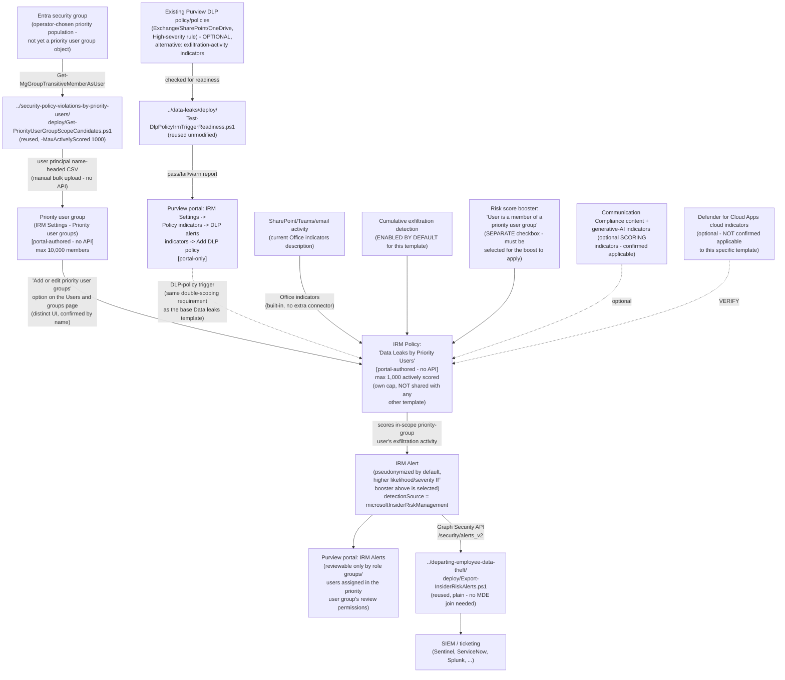

## 1. Scenario summary

Deploys Microsoft Purview Insider Risk Management's **Data leaks by priority users** policy
template — the third and last member of the **Data leaks…** template family (base `Data leaks`,
`…by risky users`, `…by priority users`) to be built in this library. It combines the base
`Data leaks` template's own triggering-event choice — **"User matches a DLP policy"** (up to 20
policies, Exchange Online/SharePoint Online/OneDrive for Business only) or **"User performs an
exfiltration activity"** (built-in indicators) — with the `security-policy-violations-by-priority-
users` sibling's population mechanism: a formal, Microsoft-managed **priority user group**, required
for this template, which also increases scoring likelihood/severity and lets an operator restrict
who can review that population's data. This scenario reuses three already-built scripts from two
different siblings unmodified — no new `deploy/` script was needed.

**Who it's for:** a tenant that wants the base `Data leaks` template's unconditional,
DLP-policy-triggered exfiltration detection, but scoped to a formally-designated, higher-scrutiny
population — executives, privileged administrators, staff on an active investigation — with both a
stronger scoring response and reviewer-access restrictions the base template's plain-group mechanism
cannot provide. Like both of its already-built siblings in this family, this is **not** a
"monitor everyone more closely" control: Microsoft caps this template at **1,000** actively-scored
users tenant-wide, a materially smaller ceiling than the base template's own 15,000.

## 2. Business/regulatory driver

- **Elevated-scrutiny, DLP-correlated exfiltration monitoring for a formally designated
  population.** The base `Data leaks` template correlates exfiltration activity with content a DLP
  policy already flagged as sensitive, for any population the operator chooses
  (`../data-leaks/README.md` §2). This template does the identical correlation, but only for users
  in a named, auditable priority user group — and increases both the likelihood and severity of the
  resulting alerts for that specific population, a distinct scoring behavior neither the base
  template nor a plain Entra group can produce [[8]](#references).
- **Reviewer-access minimization for a sensitive population.** Identical rationale to the
  `security-policy-violations-by-priority-users` sibling (`../security-policy-violations-by-
  priority-users/README.md` §2): a priority user group's own settings let an operator restrict
  review of that population's users, alerts, cases, and reports to a named subset of role groups or
  individuals [[8]](#references) — a genuine least-privilege control for populations where broad
  Insider Risk Management team visibility would itself be a governance concern.
- **SOC 2 / ISO 27001 exfiltration-monitoring evidence for a defined high-risk population, without
  an employment-stressor or message-count gate.** Unlike `data-leaks-by-risky-users`, this
  template's trigger has no HR-connector or Communication Compliance precursor to evade
  (`../data-leaks-by-risky-users/README.md` §11's own Red Team finding on that gate does not apply
  here) — the same "no trigger-count gate" property the base template scenario documents, now
  applied to a formally-designated population rather than the general one.

No regulation names this specific control by requirement number — the same honest framing this
library's other Insider Risk Management scenarios use.

## 3. Prerequisites

Full licensing detail and citations: `docs/licensing-matrix.md` §2 (Insider Risk Management row).

| Requirement | Minimum | Notes |
|---|---|---|
| Insider Risk Management (all policies) | **Microsoft 365 E5/A5/G5**, **Microsoft Purview Suite**, or the **Microsoft 365 E5 Insider Risk Management** add-on | Same base entitlement as every IRM scenario in this library |
| At least one existing Purview DLP policy, scoped to Exchange Online/SharePoint Online/OneDrive for Business, with a High-severity rule — **OR** the exfiltration-activity trigger's built-in indicators | Either satisfies the triggering-event requirement; a DLP policy is documented as **optional** for this template, identical to the base `Data leaks` template [[3]](#references) | Checked by `../data-leaks/deploy/Test-DlpPolicyIrmTriggerReadiness.ps1` if using the DLP-policy path; §5 Step 2 |
| **Priority user group** — created and populated | Purview portal → Insider Risk Management → Settings → Priority user groups → **Create priority user group**; up to **10,000** members [[8]](#references) | **Required** for this template (not optional, unlike the DLP policy above) [[1]](#references)[[4]](#references); §5 Step 3/4 |
| Role to configure policies/settings/priority user groups | **Insider Risk Management** or **Insider Risk Management Admins** role group | `docs/rbac-model.md` §4 |
| Role to read/manage DLP policies (readiness check only, no create/modify) | **View-Only DLP Compliance Management** or broader | `docs/rbac-model.md` §4; only needed if using the DLP-policy trigger path |
| Automation identity for DLP-policy readiness check (reused) | App registration/role assignment enabling `Connect-IPPSSession` with at least read access to DLP policies | Reused unmodified from the base `Data leaks` scenario's own pattern — §5 Step 2 |
| Automation identity for priority-group candidate resolution (reused) | App registration with the Microsoft Graph **`GroupMember.Read.All`** application permission, certificate-based | Reused unmodified from `security-policy-violations-by-priority-users` — §5 Step 3 |
| Automation identity for alert export (optional, reused) | App registration with the Microsoft Graph **`SecurityAlert.Read.All`** application permission, certificate-based | Only needed if reusing `../departing-employee-data-theft/deploy/Export-InsiderRiskAlerts.ps1` per §5 Step 7 |
| **NOT required for this template** | Microsoft 365 HR connector, Communication Compliance trigger integration, Microsoft Defender for Endpoint | Same defining simplification as the base `Data leaks` template — §1/§2 |
| (Optional) Microsoft Defender for Cloud Apps connections | Box, Dropbox, Google Drive / Amazon S3, Azure | **Not confirmed applicable to this specific template** — §6/§11 open VERIFY; requires pay-as-you-go billing if used |
| Restriction: admin units | Priority-user-group-based policies **cannot** be scoped to an admin unit; only an **unrestricted administrator** can create a policy from this template | Directly confirmed [[4]](#references) — a restricted/scoped administrator cannot create this policy at all, not merely a narrower scope |

> Verify current entitlement names against `docs/licensing-matrix.md` and the Product Terms before
> a sales commitment, and re-check this template's GA/preview status against the live portal —
> this build's grounding did not find it explicitly labeled preview (consistent with the base
> `Data leaks` template's own finding).

## 4. Architecture



Full rule-by-rule rationale, including the corrected cap-sharing claim, is in `design.md` §1–6.

## 5. Step-by-step implementation

### Step 1 — Assign permissions

Confirm the operator is an **unrestricted administrator** member of **Insider Risk Management** or
**Insider Risk Management Admins** (Purview role group) — a restricted/scoped administrator cannot
create a policy from this template at all, because priority-user-group-based policies don't support
admin-unit scoping (§3) [[4]](#references). If using the DLP-policy trigger, also confirm at least
read access to the candidate DLP policy/policies (`docs/rbac-model.md` §4).

### Step 2 — Check candidate DLP policies for trigger readiness (scripted, read-only, reused — optional)

Skip this step entirely if using the exfiltration-activity trigger instead (§6).

```powershell
Connect-IPPSSession -AppId $AppId -Certificate $Cert -Organization $TenantDomain

# Dry run — shows the query plan, calls nothing
../data-leaks/deploy/Test-DlpPolicyIrmTriggerReadiness.ps1 -DlpPolicyName 'PII DLP - Exchange External Send Control' -WhatIf

# Check one or more existing policies
../data-leaks/deploy/Test-DlpPolicyIrmTriggerReadiness.ps1 -DlpPolicyName 'PII DLP - Exchange External Send Control', 'SharePoint PII Guardrail'
```

This is the base `Data leaks` scenario's own script, reused unmodified — it has no
template-specific logic beyond workload/severity/Mode/20-policy-ceiling checks that apply
identically here (`design.md` §2 goal 1). Fix any `[FAIL]` before continuing.

### Step 3 — Resolve and size the priority-group candidate list (scripted, read-only, reused)

```powershell
Connect-MgGraph -ClientId $AppId -TenantId $TenantId -CertificateThumbprint $Thumbprint

# Dry run — shows the query plan, calls nothing
../security-policy-violations-by-priority-users/deploy/Get-PriorityUserGroupScopeCandidates.ps1 `
    -GroupId $PriorityPopulationGroupId -MaxActivelyScored 1000 -MaxGroupMembers 10000 -WhatIf

# Resolve, dedupe, filter to enabled accounts, check against BOTH documented caps, write a
# bulk-upload-ready CSV
../security-policy-violations-by-priority-users/deploy/Get-PriorityUserGroupScopeCandidates.ps1 `
    -GroupId $PriorityPopulationGroupId -MaxActivelyScored 1000 -MaxGroupMembers 10000 `
    -OutputPath ./data-leaks-priority-users-candidates.csv
```

`-MaxActivelyScored 1000` and `-MaxGroupMembers 10000` are this script's own defaults — passed
explicitly here rather than left implicit, because this scenario's own grounding pass independently
confirmed **this exact template's** 1,000-user cap from Microsoft's Limits table
[[6]](#references), rather than assuming it matches the sibling template's numerically identical
cap by analogy (`design.md` §2 goal 2). This script is **read-only**; it never touches the IRM
policy, the priority user group, or the Entra group itself.

### Step 4 — Create the priority user group (portal, not scriptable)

Identical workflow to the `security-policy-violations-by-priority-users` sibling's own Step 4
(`../security-policy-violations-by-priority-users/README.md` §5 Step 4) — **skip this step and
reuse the existing priority user group if one already exists for this population**, since a
priority user group is a standalone, template-agnostic object, not owned by any one policy.
**Before reusing an existing group, confirm reviewer-permission scoping is a property of the group
itself, not of any one policy** (§8/§11): if this scenario's policy references the same priority
user group as an existing `Security policy violations by priority users` policy, both policies'
alerts for that population become visible to the identical set of reviewers — there is no way to
give the two templates different reviewer scopes for the same underlying population without
creating a second, separate priority user group.

1. Purview portal → **Settings** → **Insider Risk Management** → **Priority user groups** →
   **Create priority user group**.
2. **Name and describe**, then **Next**.
3. **Choose members**: search/select, or upload the CSV from Step 3.
4. **Assign review permissions**: select which role groups or individual users can review this
   priority group's data — do this deliberately for a sensitive population (§8).
5. **Review and finish.**

### Step 5 — Create the Insider Risk Management policy (portal, not scriptable)

Purview portal → **Insider Risk Management** → **Policies** → **Create policy**:

1. Template: **Data leaks by priority users**. Confirm this is the priority-users member of the
   **Data leaks…** family and not `Data leaks`/`…by risky users`, and not either
   `Security policy violations…` template — all four "priority/risky users" templates across the
   two families share overlapping naming in the template picker.
2. Name: `Data Leaks by Priority Users`. The template and name can't be changed after policy
   creation — confirm before continuing.
3. **Users and groups**: select **Add or edit priority user groups** — an option Microsoft's own
   configuration guide states appears **only** for this template [[4]](#references) — and assign
   the priority user group created in Step 4. This is a distinct UI path from the base template's
   plain "Include specific users and groups" option; do not confuse the two.
4. **Triggers for this policy**: select **User matches a data loss prevention (DLP) policy** (add
   the policy/policies checked in Step 2, up to 20) **or** **User performs an exfiltration
   activity** (choose one or more built-in indicators and default or custom thresholds) — the
   identical two-option choice the base `Data leaks` template offers [[3]](#references). This
   scenario does not further worked-example the exfiltration-activity path beyond this
   configuration reference, matching the base template scenario's own scope (`../data-leaks/
   design.md` §7).
5. **Policy indicators**: select **Office indicators** (SharePoint sites, Microsoft Teams, and
   email messaging, per Microsoft's current description [[5]](#references)) and **Cumulative
   exfiltration detection** (enabled by default for this template — confirm actually selected).
   Under **Risk score boosters**, explicitly select **User is a member of a priority user group**
   — a **separate checkbox** from every other setting on this page; without it, priority-group
   members receive no likelihood/severity boost over the general population despite the group
   assignment in Step 3 (`design.md` §2 goal 4, §5). Optionally add Communication Compliance
   content indicators and/or generative AI app indicators, both documented as selectable for this
   template [[11]](#references). **VERIFY against the live workflow** whether cloud storage/cloud
   service indicators (Box, Dropbox, Google Drive, Amazon S3, Azure) are also offered — Microsoft's
   per-template description text does not name them explicitly for this template, the same open
   question the `data-leaks-by-risky-users` sibling already carries for itself.
6. **Review and submit.**

Use `deploy/policy/data-leaks-priority-users-policy-manifest.json` as the checklist/reference while
completing this workflow — it is not consumed by any API.

### Step 6 — Add the DLP policy/policies to the global DLP-alerts indicator setting (portal, not scriptable — if using the DLP trigger)

Purview portal → **Insider Risk Management** → **Settings** → **Policy indicators** → **Built-in
Indicators** → **Data loss prevention (DLP) indicators** → **Add DLP policies**, and select each
policy checked in Step 2. This is a **global, tenant-wide** setting shared with every other
Data-leaks-family policy in the tenant — confirm this addition doesn't unintentionally widen
another policy's trigger surface, identical caveat to the base template scenario's own §5 Step 5.

### Step 7 — Export correlated alerts for SIEM/ticketing integration (scripted, read-only, reused)

```powershell
Connect-MgGraph -ClientId $AppId -TenantId $TenantId -CertificateThumbprint $Thumbprint

../departing-employee-data-theft/deploy/Export-InsiderRiskAlerts.ps1 `
    -SinceDateTime (Get-Date).AddDays(-1) -OutputPath ./data-leaks-priority-users-alerts.json
```

No Defender for Endpoint signal exists for this template, so this scenario reuses the plain export
script, not the `security-policy-violations` family's Defender-for-Endpoint-joining variant.

**Caveat carried over from every IRM scenario in this library:** if more than one Insider Risk
Management policy is deployed in the tenant, this export cannot tell which policy produced a given
alert — `AlertPolicyId` has no documented policy-name mapping.

### Step 8 — Validate

```powershell
./validate/Test-DataLeaksPriorityUsersIrmSetup.ps1 -GroupId $PriorityPopulationGroupId -DlpTriggerConfigured
```

## 6. Configuration reference

| Setting | Value this scenario uses | Notes |
|---|---|---|
| Policy template | `Data leaks by priority users` | Not found labeled preview in this build's grounding — re-verify at deploy time. Cannot be changed after creation |
| Triggering event | **User matches a DLP policy** (up to 20 policies, optional) **or** **User performs an exfiltration activity** — the identical choice the base `Data leaks` template offers | [[3]](#references) — a materially different shape from the fixed, single-trigger `Security policy violations by priority users` sibling |
| Population mechanism | **Priority user group** — required, not optional, via the **"Add or edit priority user groups"** option on the Users and groups page | [[1]](#references)[[4]](#references) — a distinct UI path confirmed by name, not the base template's plain-group "Include specific users and groups" option |
| Maximum members in a priority user group | **10,000** (Microsoft-fixed, tenant-wide, not per-template) | [[8]](#references) |
| Maximum actively-scored users for this template | **1,000** — its own, independently-documented cap, cumulative **only** across policies built from this exact template | [[6]](#references)[[7]](#references) — numerically identical to `Security policy violations by priority users` but a **separate** cap; do not conflate the two, and do not assume it is shared with either same-family sibling (15,000 / 7,500) |
| Priority-group scoring boost | A **separate, explicitly-selectable** "Risk score booster" — **"User is a member of a priority user group"** — not an automatic consequence of population assignment | [[5]](#references) — `design.md` §2 goal 4 |
| Reviewer-permission scoping | Optional, per-priority-group restriction of who can review that group's data | [[8]](#references) |
| Primary scoring indicator category | **Office indicators** — SharePoint sites, Microsoft Teams, and email messaging (current Microsoft description) | [[5]](#references) |
| Cumulative exfiltration detection | **Enabled by default** for this template | [[10]](#references) — confirm selected at policy creation, not assumed |
| Optional scoring indicators | Communication Compliance content indicators; generative AI app indicators (Prompt Shields, Protected material detection) | Both explicitly confirmed selectable for this template [[11]](#references) |
| Optional cloud indicators | Cloud storage (Box, Dropbox, Google Drive) / cloud service (Amazon S3, Azure) | **Not confirmed applicable to this specific template** — open VERIFY, same as `data-leaks-by-risky-users` |
| DLP-policy trigger workload support | Exchange Online, SharePoint Online, OneDrive for Business only | Endpoint DLP, Microsoft Teams, **Microsoft 365 Copilot**, on-premises repositories, and Power BI are explicitly **not** supported for this indicator [[3]](#references)[[9]](#references) — a fuller list than this library's own base `Data leaks` scenario carries (§11) |
| Admin unit scoping | **Not supported** for this template; only an unrestricted administrator can create this policy | [[4]](#references) |
| Defender for Endpoint dependency | **None** | |
| User-identity privacy | Pseudonymized (Microsoft default) | Not disabled by this scenario |
| Alert export mechanism | Reused: `../departing-employee-data-theft/deploy/Export-InsiderRiskAlerts.ps1`, unmodified | The plain, non-MDE-joining variant |
| Cross-policy disambiguation | Not attempted — same disclosed gap as every IRM scenario in this library | `AlertPolicyId` has no documented policy-name mapping |

## 7. Validation / how to prove it works

1. **Automated checks (DLP side, if used)** — `../data-leaks/deploy/
   Test-DlpPolicyIrmTriggerReadiness.ps1` confirms each candidate DLP policy's workload scope,
   High-severity rule presence, `Mode`, and the 20-policy ceiling.
2. **Automated checks (Graph side)** — `validate/Test-DataLeaksPriorityUsersIrmSetup.ps1` confirms
   the Graph session and `GroupMember.Read.All` permission actually work, and reports the resolved
   candidate count against both the 10,000-member and 1,000-actively-scored caps. Exits non-zero on
   a hard failure.
3. **Manual checklist** — the same validation script prints a checklist for the portal-only
   configuration (priority user group existence/membership/reviewer-permission scoping, the
   **"Add or edit priority user groups"** scope step, the **risk score booster** checkbox, policy
   existence/template/state, the DLP double-scoping cross-check if applicable) — see `design.md`
   §4 for why these can't be automated.
4. **End-to-end functional test (non-production names only, pilot tenant)** — from a disposable
   test account added to the priority user group (and, if using the DLP trigger, also in scope of
   the parent DLP policy), perform an action matching the trigger — a High-severity DLP match, or a
   built-in exfiltration-activity indicator's threshold. Confirm an alert appears in **Insider Risk
   Management** → **Alerts** with a severity/likelihood consistent with priority-group membership
   (only if the risk score booster was selected per Step 5), and that the reused export script
   (§5 Step 7) retrieves it.
5. **Evidence trail** — the alert's **Activity explorer** tab shows the specific activity that
   contributed to the score.

## 8. Operations & tuning

- **Confirm the risk score booster is actually selected, not just the population assignment.**
  This scenario's single most operationally significant, newly-surfaced finding (`design.md` §2
  goal 4): a policy can have a correctly-populated priority user group and still score that
  population identically to a plain-group population if **"User is a member of a priority user
  group"** was never selected under Risk score boosters. Check this explicitly at every deployment
  sign-off and after any policy edit — there is no automated way to detect this misconfiguration.
- **Re-scope on priority-group-membership change, not only on a calendar cadence** — identical
  reasoning to `security-policy-violations-by-priority-users/README.md` §8, not repeated here in
  full.
- **If using the DLP-policy trigger, confirm the double-scoping overlap on every scope change** —
  identical reasoning to the base template scenario's own §8: a user in the priority user group but
  not in the parent DLP policy's own scope (or vice versa) never has an alert processed.
- **The DLP-alerts indicator is a global, tenant-wide setting** — coordinate before adding or
  removing a DLP policy from it if other Data-leaks-family or Data-theft policies in the tenant
  also use it.
- **Confirm what the live portal actually does as the priority user group approaches 1,000
  members** — the same open dual-cap-interaction question `security-policy-violations-by-priority-
  users/design.md` §3 carries for itself, now independently confirmed to be a **per-exact-template**
  cap for this scenario (§6) rather than a family-wide pool — `validate/
  Test-DataLeaksPriorityUsersIrmSetup.ps1`'s manual checklist includes this explicitly.
- **Use the reviewer-permission scoping deliberately, not by default** — identical guidance to the
  `security-policy-violations-by-priority-users` sibling's own §8.
- **Reviewer-permission scoping is a property of the priority user group, not of the policy.**
  If this scenario's policy and a `Security policy violations by priority users` policy both
  reference the same priority user group, both templates' alerts for that population are visible
  to the identical reviewer set — there is no per-policy override. Confirm this is the intended
  outcome before reusing an existing group across templates; create a second, dedicated priority
  user group instead if the two templates' alerts need different reviewers (§5 Step 4).
- **Pair with the base `Data leaks` template for general-population coverage** — this template's
  1,000-user cap and priority-group requirement make it unsuitable as the tenant's only
  DLP-triggered exfiltration control; run it alongside (not instead of) `../data-leaks/` for the
  broader population.

## 9. Rollback / decommission

See `rollback.md`. Quick reference: removing the priority user group from policy scope, removing a
DLP policy from the global indicator list, or deselecting the risk score booster is reversible in
seconds; deleting the policy or the priority user group itself, or revoking either app
registration's certificate, is not.

## 10. Cost & licensing notes

- **No incremental license cost beyond the base Insider Risk Management entitlement** if the
  tenant already has E5/A5/G5, Purview Suite, or the E5 IRM add-on — `docs/licensing-matrix.md` §2.
- **No Microsoft Defender for Endpoint, HR connector, or Communication Compliance entitlement
  required for this template's trigger mechanism.**
- **No additional DLP license required** if using the DLP-policy trigger — this scenario assumes
  the parent DLP policy already exists under its own, independently-licensed deployment.
- **Pay-as-you-go billing, only if the (unconfirmed-applicable) cloud storage/cloud service
  indicator category is used** — `docs/licensing-matrix.md` §2's PAYG note applies if this category
  turns out to be offered for this template at deploy time.
- **Sizing note specific to this template:** the 1,000-actively-scored-user cap is its own,
  independently-tracked pool — do **not** assume headroom is reduced by an existing
  `Security policy violations by priority users` policy's own usage, and do not assume a priority
  user group anywhere near 1,000 members has confirmed full-coverage behavior (§6/§11).
- **No additional cost for the readiness check, candidate resolution, or alert-export
  automation** — all reused scripts use application permissions already covered by the base
  Microsoft Graph SDK, Security & Compliance PowerShell, or no metered API.

## 11. Known limitations & gotchas

- **The priority-group scoring boost requires a separate, explicitly-selected "Risk score
  booster" checkbox** — not an automatic consequence of assigning a priority user group to the
  policy's scope. `design.md` §2 goal 4 treats this as this fragment's most operationally
  significant finding; a deployment that skips this step gets the population-restriction and
  reviewer-scoping benefits of a priority user group without the scoring differentiation that is
  this template family's other headline benefit.
- **What happens when a priority user group larger than 1,000 members is assigned to a policy
  built from this specific template is not documented by Microsoft** — same class of open question
  the `security-policy-violations-by-priority-users` sibling carries for itself, independently
  re-confirmed as unresolved for this template rather than assumed identical.
  **VERIFY (pilot tenant).**
- **No documented Graph/PowerShell write API for priority user groups, DLP-alerts indicator
  wiring, or IRM policy authoring** — every one of these is portal-only, consistent with every
  other Insider Risk Management scenario in this library.
- **Whether the optional cloud storage/cloud service indicator category is offered for this
  specific template is unconfirmed** — Microsoft's per-template description text does not name
  "cloud indicators" for this template the way it does for the base `Data leaks` template, the
  same open question `data-leaks-by-risky-users` already carries for itself. §5 Step 5/§6 flag
  this as a VERIFY rather than assuming either way.
- **This scenario does not build a full worked example for the exfiltration-activity triggering
  event** — documented as a valid, Microsoft-supported alternative in §5 Step 5/§6, not
  implemented end-to-end, matching the base `Data leaks` scenario's own scope (`../data-leaks/
  design.md` §7).
- **Admin units are not supported for this template, and only an unrestricted administrator can
  create this policy at all** — a restricted/scoped administrator cannot create a policy from this
  template even with a narrower intended scope; confirm the operator's administrator status before
  attempting deployment (§3/§5 Step 1).
- **This scenario's DLP-workload-exclusion list is more complete than the base `Data leaks`
  scenario's own list** (it additionally names Microsoft 365 Copilot), reflecting this build's
  direct Microsoft Learn fetch versus that scenario's earlier WebSearch-only grounding pass — a
  candidate follow-up (not made here, per fragment discipline) is to bring `../data-leaks/README.md`
  §6/§11 up to the same completeness.
- **Reviewer-permission scoping is shared across every policy that references the same priority
  user group** — a group is not owned by any one policy, so reusing an existing group across this
  template and `Security policy violations by priority users` (or any future policy) gives both
  policies' alerts identical reviewer visibility with no per-policy override. §8/§5 Step 4.
- **`security-policy-violations-by-priority-users/README.md` §10's claim that its 1,000-user cap
  "is shared with the base template as well" appears to be an overstatement** — Microsoft's own
  Policy template limits section states a cap applies "across all policies using a given policy
  template" (i.e., per exact template), and the Limits table lists each template as its own row.
  This scenario states its own cap correctly (§6) rather than repeating that ambiguity; correcting
  the sibling scenario directly is a candidate follow-up, not made in this fragment
  (`AGENTS.md` §6).
- **The 1,000-actively-scored cap has no query API to check current cumulative usage against** —
  same disclosed gap as every sibling template; Microsoft documents only a portal-visible
  **Users in scope** column on the Policies tab.
- **`Get-PriorityUserGroupScopeCandidates.ps1` resolves group membership at the moment it runs — it
  is not a live sync**, and its output CSV is a snapshot — identical disclosed gap to the sibling
  scenario that owns this script.
- **Cannot disambiguate which "Data leaks…" or "Data theft…" family template produced a given
  exported alert if more than one is deployed in the same tenant** — same disclosed gap as every
  IRM scenario in this library.
- **This scenario does not configure Adaptive Protection** — same non-goal as every other Insider
  Risk Management scenario in this library that isn't itself an Adaptive Protection scenario.
- **This control is bounded by the specific DLP policies/indicators actually selected, not "all
  exfiltration"** — a channel no wired DLP policy or selected indicator covers is invisible to
  this control regardless of population or scoring boost.

## 12. References

1. Get started with Insider Risk Management — Step 4, "Configure priority user groups": "A priority user group is required when using the following policy templates: Security policy violations by priority users, Data leaks by priority users" — <https://learn.microsoft.com/purview/insider-risk-management-configure#step-4-recommended-configure-prerequisites-for-policies>
2. Learn about Insider Risk Management policy templates — Data leaks by priority users (description: "you need to assign priority user groups created in Insider Risk Management > Settings > Priority user groups to the policy") — <https://learn.microsoft.com/purview/insider-risk-management-policy-templates#data-leaks-by-priority-users>
3. Learn about Insider Risk Management policy templates — Policy template prerequisites and triggering events table: "Data leaks by priority users — Triggering events: Data leak policy activity that creates a High severity alert or built-in exfiltration event triggers. Prerequisites: DLP policy configured for High severity alerts (Exchange Online, SharePoint Online, or OneDrive for Business workloads only) OR Customized triggering indicators; Priority user groups configured in insider risk settings" — <https://learn.microsoft.com/purview/insider-risk-management-policy-templates#policy-template-prerequisites-and-triggering-events>
4. Get started with Insider Risk Management — Step 6, "Users and groups" page: "Add or edit priority user groups. This option appears only if you choose the Data leaks by priority users template," and the admin-unit restriction note: "Priority user groups aren't currently supported for admin units. If you're creating a policy based on the Data leaks by priority users template or the Security policy violations by priority users template, you can't select admin units for scoping the policy. Unrestricted administrators can select priority user groups without selecting admin units, but restricted or scoped administrators can't create these policies at all." — <https://learn.microsoft.com/purview/insider-risk-management-configure#step-6-required-create-an-insider-risk-management-policy>
5. Configure policy indicators in Insider Risk Management — Office indicators ("SharePoint sites, Microsoft Teams, and email messaging") and Risk score boosters ("User is a member of a priority user group: Scores are boosted if the user is a member of a priority user group") — <https://learn.microsoft.com/purview/insider-risk-management-settings-policy-indicators#built-in-indicators-vs-custom-indicators>
6. Limits in Insider Risk Management — maximum users in scope per policy template: Data leaks by priority users = 1,000; Data leaks by risky users = 7,500; Data leaks = 15,000; Security policy violations by priority users = 1,000 (separate row/cap) — <https://learn.microsoft.com/purview/insider-risk-management-limits#maximum-number-of-users-in-scope-for-a-policy-template>
7. Learn about Insider Risk Management policy templates — Policy template limits: "The limit for each policy calculates the total number of unique users receiving risk scores per policy template type... These maximum limits apply to users across all policies using a given policy template" — <https://learn.microsoft.com/purview/insider-risk-management-policy-templates#policy-template-limits>
8. Prioritize user groups for Insider Risk Management policies — priority user group creation workflow, 10,000-member cap, reviewer-permission scoping, likelihood/severity scoring effect — <https://learn.microsoft.com/purview/insider-risk-management-settings-priority-user-groups>
9. Configure policy indicators in Insider Risk Management — Data loss prevention alerts indicators, supported workloads (Exchange Online, SharePoint Online, OneDrive for Business) and explicitly unsupported workloads (Endpoint DLP, Microsoft Teams, Microsoft 365 Copilot, on-premises repositories, Power BI) — <https://learn.microsoft.com/purview/insider-risk-management-settings-policy-indicators#supported-dlp-workloads>
10. Create and manage Insider Risk Management policies — Cumulative exfiltration detection, enabled by default for "Data leaks / Data leaks by priority users / Data leaks by risky users / Data theft by departing users" — <https://learn.microsoft.com/purview/insider-risk-management-policies#cumulative-exfiltration-detection>
11. Create and manage Communication Compliance policies — Communication Compliance content indicators and generative AI app indicators (Prompt Shields, Protected material detection) explicitly listed as selectable for the "Data leaks, Data leaks by risky users, Data leaks by priority users" templates — <https://learn.microsoft.com/purview/communication-compliance-policies#integrate-communication-compliance-with-microsoft-purview-insider-risk-management>
12. `../data-leaks/README.md` and `design.md`, `../security-policy-violations-by-priority-users/README.md` and `design.md` — this scenario's two direct ancestors, whose already-built scripts (`Test-DlpPolicyIrmTriggerReadiness.ps1`, `Get-PriorityUserGroupScopeCandidates.ps1`) and `../departing-employee-data-theft/deploy/Export-InsiderRiskAlerts.ps1` are reused unmodified rather than re-verified independently.
13. alert resource type — `AlertPolicyId`, `DetectionSource` properties — <https://learn.microsoft.com/graph/api/resources/security-alert>
14. List group transitive members / Get-MgGroupTransitiveMemberAsUser / `GroupMember.Read.All` and `SecurityAlert.Read.All` permissions — reused unmodified from the scripts cited in reference 12; see those scripts' own `.NOTES` for the underlying Graph API citations.

> Re-verify all links, cmdlet/API behavior, and licensing terms against current Microsoft Learn
> before a customer-facing assessment or sale. This build's citations were grounded via direct
> Microsoft Learn MCP fetch/search of the URLs above, not WebSearch snippets alone — where this
> build's own findings differ from or add detail beyond an already-built sibling scenario's own
> (older) grounding pass, §11 states this explicitly rather than silently overriding the sibling.
