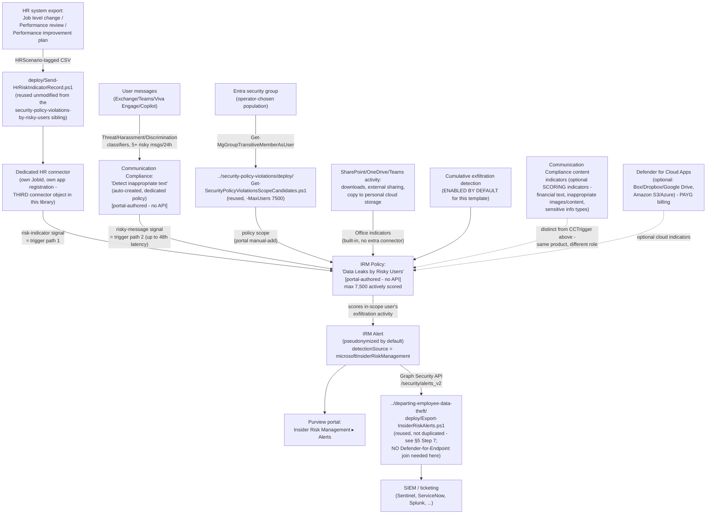

## 1. Scenario summary

Deploys Microsoft Purview Insider Risk Management's **Data leaks by risky users** policy
template — the "risky users" member of the **Data leaks…** template family (base `Data leaks`,
`…by priority users`, `…by risky users`), sharing its bring-into-scope mechanism with this
library's already-built `security-policy-violations-by-risky-users` scenario but scoring a
**materially different indicator set**. Users are brought into scope by an **HR-connector-sourced
employment-stressor signal** (a performance improvement plan, a poor performance review, or a job
level change) and/or a **Communication Compliance risk-signal integration** — at least one is
required, both together is supported — then scored against **built-in Office exfiltration
indicators** (SharePoint Online downloads, sharing files externally, copying data to personal
cloud storage/messaging services) with **cumulative exfiltration detection enabled by default**.
This scenario reuses this repo's existing `Send-HrRiskIndicatorRecord.ps1` HR uploader unmodified
— it was already generalized in the sibling scenario to cover this exact template — and reuses the
base template's scope-candidate script and the departing-employee-data-theft scenario's
plain alert-export script.

**Who it's for:** a tenant that wants employment-stressor-triggered exfiltration detection
**without** a Microsoft Defender for Endpoint dependency — the single biggest practical difference
from this library's `security-policy-violations-by-risky-users` sibling, which scores the same
trigger mechanism but requires an active Defender for Endpoint subscription and its Purview
alert-sharing integration. A tenant with Microsoft 365 E5 but no Defender for Endpoint deployed can
still run this scenario end to end.

## 2. Business/regulatory driver

Microsoft's own scenario framing for the "risky users" family names the same employment-stressor
precursor — performance improvement plans, poor performance reviews, job-level changes/demotions —
as a documented behavioral signal for elevated insider-risk likelihood
[[1]](#references)[[9]](#references). This template correlates that signal with **data-exfiltration
activity** rather than a security-control violation, closing a different detection gap than its
Security-policy-violations-by-risky-users cousin:

- **Risk-weighted exfiltration triage** — a user downloading an unusual volume of SharePoint
  content or copying files to a personal cloud-storage account warrants faster, higher-priority
  triage if that same user was just placed on a performance improvement plan, versus the identical
  activity from a user with no such signal.
- **Coverage for tenants that haven't deployed Microsoft Defender for Endpoint.** Every other
  "risky users"-triggered scenario this library ships (`security-policy-violations-by-risky-users`)
  requires an active Defender for Endpoint subscription. This template's indicator set — SharePoint/
  OneDrive Office activity, optional Communication Compliance content signals, optional cloud-app
  and generative-AI signals — has no such dependency, making it the accessible entry point for a
  tenant licensed for Insider Risk Management but not (yet) for Defender for Endpoint.
- **SOC 2 / ISO 27001 data-exfiltration monitoring evidence for a behaviorally-flagged population**
  — the same audit-evidence rationale this library's other Insider Risk Management scenarios
  document (`security-policy-violations/README.md` §2), applied here to exfiltration activity
  rather than endpoint security-control violations.

No regulation names this specific control by requirement number — the same honest framing this
library's other Insider Risk Management scenarios use.

**Governance note, carried over from the `security-policy-violations-by-risky-users` sibling:**
this scenario's HR-connector trigger path draws directly on **performance-management HR data**
(performance improvement plans, poor performance reviews, job-level changes/demotions). Feeding
that data into a security-monitoring trigger — even though a separate exfiltration-activity signal
is still independently required before anything is scored — carries the same retaliation-perception
and employment-law considerations as the sibling scenario. **Route this trigger path through HR and
Legal review before enabling it in a customer's tenant**, exactly as `security-policy-violations-
by-risky-users/README.md` §2 already establishes for the identical HR-connector mechanism. This is
a deployment-governance recommendation, not a technical limitation; §8 restates it operationally.

## 3. Prerequisites

Full licensing detail and citations: `docs/licensing-matrix.md` §2 (Insider Risk Management row,
including the "Cloud/GenAI indicators on non-M365 → PAYG" note relevant to §6's optional
indicators below).

| Requirement | Minimum | Notes |
|---|---|---|
| Insider Risk Management (all policies) | **Microsoft 365 E5/A5/G5**, **Microsoft Purview Suite**, or the **Microsoft 365 E5 Insider Risk Management** add-on | Same base entitlement as every IRM scenario in this library |
| **Microsoft 365 HR connector** — configured for disgruntlement/risk indicators, **OR** | Job level change, Performance review, and/or Performance improvement plan CSV data type(s) [[2]](#references)[[7]](#references) | At least one of this row or the Communication Compliance row below is required; both together is supported and recommended — §5 Step 4 |
| **Communication Compliance risk-signal integration** — dedicated policy | Selected as an option in the IRM policy-creation workflow itself | Auto-creates a dedicated "Detect inappropriate text" Communication Compliance policy — portal-only, no PowerShell surface for Communication Compliance policy authoring exists [[3]](#references); §5 Step 5 |
| Role to configure policies/settings | **Insider Risk Management** or **Insider Risk Management Admins** role group | `docs/rbac-model.md` §4 |
| Role to create the HR connector | **Data Connector Admin** (or a role group that includes it) | `docs/rbac-model.md` §4; distinct from the IRM policy-configuration role above [[7]](#references) |
| Automation identity for scope-candidate resolution (reused) | App registration with the Microsoft Graph **`GroupMember.Read.All`** application permission, certificate-based | Reused unmodified from the base `Data leaks` template's scoping pattern — §5 Step 3 |
| Automation identity for HR-connector upload (new, dedicated) | Microsoft Entra app registration created via `../security-policy-violations-by-departing-users/../departing-employee-data-theft/deploy/Register-HrConnectorApp.ps1` (reused unmodified, different `-DisplayName`) — no Graph API permission granted, single-purpose against the HR-connector webhook only | §5 Step 2; a **third**, dedicated app/connector distinct from both the departing-employee-data-theft sibling's Resignation-scoped connector and the security-policy-violations-by-risky-users sibling's own dedicated connector — see `design.md` §6 |
| Automation identity for alert export (optional, reused) | App registration with the Microsoft Graph **`SecurityAlert.Read.All`** application permission, certificate-based | Only needed if reusing `../departing-employee-data-theft/deploy/Export-InsiderRiskAlerts.ps1` per §5 Step 7 |
| (Optional) Microsoft Defender for Cloud Apps connections | Box, Dropbox, Google Drive (cloud storage indicators) and/or Amazon S3, Azure (cloud service indicators), each connected in the Microsoft Defender portal | **Not required** — this template scores without them; enables the additional cloud-app indicator category if the tenant already has non-Microsoft cloud storage in scope. Requires **pay-as-you-go billing** enabled in Purview billing [[10]](#references)[[11]](#references); §6 |
| (Optional) Communication Compliance content + generative-AI indicators | No separate license beyond Communication Compliance's own entitlement | Selectable as **scoring** indicators for this template (not just the trigger integration) — §6 explains the distinction from the CC trigger path |

> Verify current entitlement names against `docs/licensing-matrix.md` and the Product Terms before
> a sales commitment — SKU names change, and Microsoft has not labeled this specific template
> preview as of this writing (unlike its `security-policy-violations-by-risky-users` cousin, whose
> template family carries an explicit preview label).

## 4. Architecture



Full rule-by-rule rationale is in `design.md` §4–6.

## 5. Step-by-step implementation

### Step 1 — Assign permissions

Confirm the operator is a member of **Insider Risk Management** or **Insider Risk Management
Admins** (Purview role group) and has **Data Connector Admin** for the HR connector step
(`docs/rbac-model.md` §4). No Defender for Endpoint role is needed anywhere in this scenario —
unlike the security-policy-violations-by-risky-users sibling.

### Step 2 — Register a dedicated HR-connector app and create the connector (manual, reused pattern)

This scenario provisions its **own third** dedicated HR connector — not the departing-employee-
data-theft sibling's Resignation-scoped connector, and not the security-policy-violations-by-
risky-users sibling's own dedicated risk-indicator connector — for the same documented reason both
those scenarios already give: Microsoft's Edit action for an existing connector changes "the Azure
App ID or the column header names," not the set of HR scenarios it was created for [[7]](#references).
VERIFY at deploy time whether the live portal actually allows adding scenarios to an existing
connector via Edit before assuming a third connector is required.

1. Register the app: reuse
   `../security-policy-violations-by-departing-users/../departing-employee-data-theft/deploy/
   Register-HrConnectorApp.ps1` unmodified with a different `-DisplayName` (e.g.
   `"HR Connector - IRM Data Leaks Risky Users"`).
2. Purview portal → **Settings** → **Data connectors** → **My connectors** → **Add connector** →
   **HR (preview)**. Provide the new app's Application ID, select **Job level change**,
   **Performance review**, and **Performance improvement plan** as the HR scenarios to import, and
   map columns per §6's reference (identical schema to the sibling scenario) [[7]](#references).
3. Record the generated **Job ID** — needed for Step 4.

### Step 3 — Resolve and size the policy-scope candidate list (scripted, read-only, reused)

Identical mechanism and cap to the security-policy-violations-by-risky-users sibling — this
template shares the same documented **7,500**-actively-scored-user limit:

```powershell
Connect-MgGraph -ClientId $AppId -TenantId $TenantId -CertificateThumbprint $Thumbprint

# Dry run — shows the query plan, calls nothing
../security-policy-violations/deploy/Get-SecurityPolicyViolationsScopeCandidates.ps1 `
    -GroupId $RiskyUsersGroupId -MaxUsers 7500 -WhatIf

# Resolve, dedupe, filter to enabled accounts, check against the 7,500-user cap
../security-policy-violations/deploy/Get-SecurityPolicyViolationsScopeCandidates.ps1 `
    -GroupId $RiskyUsersGroupId -MaxUsers 7500 -OutputPath ./data-leaks-risky-users-scope-candidates.csv
```

No new script was written for this step — the base template's own scope script has no
template-specific logic beyond the `-MaxUsers` cap it already accepts as a parameter, the same
reuse rationale the security-policy-violations-by-risky-users sibling already established
(`design.md` §2 goal 2).

### Step 4 — Prepare and upload the HR risk-indicator CSV (scripted, mutating, reused unmodified)

`Send-HrRiskIndicatorRecord.ps1` was already generalized in the security-policy-violations-by-
risky-users sibling for exactly this template's HR data shape — its own `.SYNOPSIS` names both
templates as consumers. No fork was needed:

```powershell
Connect-MgGraph -ClientId $AppId -TenantId $TenantId -CertificateThumbprint $Thumbprint  # unrelated session, HR upload below uses its own auth

$hrSecret = Read-Host -AsSecureString -Prompt 'HR connector app secret'

# Dry run — validates the CSV, reports per-scenario row counts, sends nothing
../security-policy-violations-by-risky-users/deploy/Send-HrRiskIndicatorRecord.ps1 `
    -TenantId $TenantId -AppId $HrConnectorAppId -AppSecret $hrSecret -JobId $HrConnectorJobId `
    -CsvPath ./risk_indicators.csv -WhatIf

# Upload — chunked at 500 rows per call
../security-policy-violations-by-risky-users/deploy/Send-HrRiskIndicatorRecord.ps1 `
    -TenantId $TenantId -AppId $HrConnectorAppId -AppSecret $hrSecret -JobId $HrConnectorJobId `
    -CsvPath ./risk_indicators.csv
```

Pass **this scenario's own** `-AppId`/`-JobId` (Step 2) — the script is generic across both
templates' HR data shape, but each scenario's connector object is its own, distinct from the
sibling's. At least one of this step or Step 5 (Communication Compliance) must be completed before
the policy in Step 6 can start scoring — either alone satisfies Microsoft's documented AND/OR
prerequisite [[2]](#references). Schedule this script on the same recurring cadence as the HR
system's own export.

### Step 5 — Enable Communication Compliance risk-signal integration (portal-only, optional but recommended)

During policy creation in Step 6, select the option to integrate Communication Compliance risk
signals as a **trigger**. This automatically creates a dedicated policy using the Threat,
Harassment, and Discrimination trainable classifiers, scoped to all organization users, with every
**Insider Risk Management Investigators** role-group member auto-assigned as a reviewer
[[3]](#references). Users sending 5 or more messages classified as potentially risky within 24
hours are brought in-scope, with up to 48 hours of latency from message to in-scope status.
**Manually add** IRM investigators to the **Communication Compliance Investigators** role group if
they need to review the underlying flagged message directly on the Communication Compliance alerts
page [[3]](#references).

There is no PowerShell or Graph surface for creating or managing Communication Compliance
policies — Microsoft states this explicitly [[3]](#references); this step is portal-only, not a
fabricated cmdlet gap.

**Naming inconsistency, disclosed rather than resolved:** Microsoft's own documentation for this
exact integration uses two different names for the auto-created dedicated policy within the same
article — *"Insider risk trigger - (date created)"* in one paragraph, *"Risky user in messages -
(date created)"* in the next [[3]](#references). Confirm the actual live name against the portal at
deploy time rather than assuming either is authoritative — same disclosed gap as the
security-policy-violations-by-risky-users sibling's own README.md §11.

### Step 6 — Create the Insider Risk Management policy (portal, not scriptable)

Purview portal → **Insider Risk Management** → **Policies** → **Create policy**:

1. Template: **Data leaks by risky users**. Confirm this is the risky-users member of the
   **Data leaks…** family and not its `Data leaks`/`…by priority users` siblings, and not the
   differently-scored `Security policy violations by risky users` cousin — all four "risky/priority
   users" templates across the two families share overlapping naming in the template picker.
2. Name: `Data Leaks by Risky Users`. The template and name can't be changed after policy creation
   [[5]](#references) — confirm before continuing.
3. **Users and groups**: assign the scope resolved in Step 3.
4. **Triggers for this policy**: enable the HR connector risk-indicator signal (Step 4) and/or the
   Communication Compliance integration (Step 5) — at least one is required; both is supported and
   recommended for broader coverage.
5. **Policy indicators**: select **Office indicators** (SharePoint Online downloads/syncing,
   sharing internal files/folders externally, copying data to personal cloud storage/messaging
   services) — this template's primary, built-in scoring category, requiring no additional
   connector. Optionally add:
   - **Communication Compliance indicators** (Sending financial regulatory text that might be
     risky / Sending inappropriate images / Sending inappropriate content / Sending messages that
     contain specific sensitive info types) — a **scoring** indicator category selectable for this
     template, Microsoft documents explicitly, distinct from the CC **trigger** integration in
     Step 5: the same Communication Compliance product plays two different, independently-optional
     roles in this one policy [[4]](#references). Do not conflate the two.
   - **Generative AI app indicators** (Prompt Shields, Protected material detection) — also
     documented as selectable for this template [[4]](#references).
   - **Cloud storage/cloud service indicators** (Box, Dropbox, Google Drive, Amazon S3, Azure) —
     requires those apps connected in Microsoft Defender for Cloud Apps first, and pay-as-you-go
     billing enabled [[10]](#references)[[11]](#references). Microsoft's per-template description
     text explicitly names this "cloud indicators" capability for the `Data theft by departing
     users` and base `Data leaks` templates; **VERIFY against the live policy-creation workflow at
     deploy time** whether the cloud-indicator category is actually offered when this specific
     template (`Data leaks by risky users`) is selected — not explicitly stated either way in this
     template's own description text, unlike its two siblings just named.
6. Select **Cumulative exfiltration detection** (enabled by default for this template — confirm it
   is actually selected rather than assuming the default survived any earlier "Turn on indicators"
   step) [[6]](#references).
7. **Review and submit.**

Use `deploy/policy/data-leaks-risky-users-policy-manifest.json` as the checklist/reference while
completing this workflow — it is not consumed by any API.

### Step 7 — Export correlated alerts for SIEM/ticketing integration (scripted, read-only, reused)

This template has **no** Microsoft Defender for Endpoint signal to join against, so this scenario
reuses the plain departing-employee-data-theft export script — not the security-policy-violations
family's Defender-for-Endpoint-joining variant, which would do wasted, misleading work here:

```powershell
Connect-MgGraph -ClientId $AppId -TenantId $TenantId -CertificateThumbprint $Thumbprint

../departing-employee-data-theft/deploy/Export-InsiderRiskAlerts.ps1 `
    -SinceDateTime (Get-Date).AddDays(-1) -OutputPath ./data-leaks-risky-users-alerts.json
```

**Caveat carried over from every IRM scenario in this library:** if more than one Insider Risk
Management policy is deployed in the tenant, this export cannot tell which policy produced a given
alert — `AlertPolicyId` (present in the Graph alert resource, not selected by this particular
script's output columns) has no documented way to map back to a named Purview policy.

### Step 8 — Validate

```powershell
./validate/Test-DataLeaksRiskyUsersIrmSetup.ps1
```

## 6. Configuration reference

| Setting | Value this scenario uses | Notes |
|---|---|---|
| Policy template | `Data leaks by risky users` | Not Microsoft-labeled preview as of this writing, unlike its `Security policy violations by risky users` cousin — re-verify at deploy time. Cannot be changed after creation [[5]](#references) |
| Triggering events | HR risk-indicator signal (Job level change / Performance review / Performance improvement plan) **AND/OR** Communication Compliance risky-message integration | At least one required; both is supported and recommended [[2]](#references) |
| Primary scoring indicator category | **Office indicators** (built-in) — SharePoint Online downloads/syncs, external file/folder sharing, copying to personal cloud storage/messaging services | No additional connector required |
| Cumulative exfiltration detection | **Enabled by default** for this template | Confirm selected at policy creation, not assumed [[6]](#references) |
| Optional scoring indicators | Communication Compliance content indicators (financial regulatory text, inappropriate images, inappropriate content, sensitive info types); generative AI app indicators (Prompt Shields, Protected material detection) | Both documented as selectable for this template specifically [[4]](#references) — distinct from the CC **trigger** integration, which is a different role for the same product |
| Optional cloud indicators | Cloud storage (Box, Dropbox, Google Drive) / cloud service (Amazon S3, Azure) indicators | Requires Defender for Cloud Apps app connections + pay-as-you-go billing [[10]](#references)[[11]](#references); **VERIFY at deploy time whether this template's policy-creation workflow actually offers this category** — §5 Step 6 |
| Population mechanism | A plain Entra group (or groups), resolved via the reused base-template scope script | No priority-user-group requirement |
| Maximum actively-scored users for this template | **7,500**, cumulative tenant-wide across all policies built from this exact template | [[6]](#references) — same numeric cap as the `Security policy violations by risky users` cousin; do not conflate the two templates despite the identical number |
| HR data types accepted | Job level change, Performance review, Performance improvement plan | Any one, or a combination, satisfies the HR-connector half of the trigger requirement [[7]](#references) — identical to the cousin template |
| HR CSV required columns (reused script) | `UserPrincipalName`, `EffectiveDate`, `HRScenario` (name configurable) | Every other per-scenario column is optional and passed through unvalidated — see the sibling scenario's own README.md §11 for the documented Microsoft-side column-naming inconsistency this reused script's `.NOTES` already discloses |
| Communication Compliance trigger classifiers | Threat, Harassment, Discrimination (Microsoft-provided trainable classifiers) | Auto-created dedicated policy; not editable via any scripted surface [[3]](#references) |
| Communication Compliance trigger threshold | 5+ risky messages within 24 hours; up to 48h latency to in-scope status | [[3]](#references) |
| Defender for Endpoint dependency | **None** | The defining difference from the `security-policy-violations-by-risky-users` sibling |
| User-identity privacy | Pseudonymized (Microsoft default) | Not disabled by this scenario |
| Alert export mechanism | Reused: `../departing-employee-data-theft/deploy/Export-InsiderRiskAlerts.ps1`, unmodified | The plain, non-MDE-joining variant — correct choice given this template's indicator set |
| Cross-policy disambiguation | Not attempted — same disclosed gap as every IRM scenario in this library | `AlertPolicyId` has no documented policy-name mapping |

## 7. Validation / how to prove it works

1. **Automated checks** — `./validate/Test-DataLeaksRiskyUsersIrmSetup.ps1` confirms the Graph
   session and `GroupMember.Read.All` permission actually work (probed against the same group(s)
   used for scoping), and reports the resolved count against the 7,500-user cap. Exits non-zero on
   a hard failure.
2. **Manual checklist** — the same script prints a checklist for the portal-only configuration (HR
   connector existence/scenario mapping, Communication Compliance dedicated trigger policy
   existence, policy existence/template/state, Office/cumulative-exfiltration indicator selection,
   role groups) — see `design.md` §4 for why these can't be automated.
3. **End-to-end functional test (non-production names only, pilot tenant)** — upload a single
   disposable test record via `../security-policy-violations-by-risky-users/deploy/
   Send-HrRiskIndicatorRecord.ps1 -WhatIf:$false` (this scenario's own `-AppId`/`-JobId`) for a
   disposable test account, then perform a benign, disclosed exfiltration-style action already in
   your test plan (e.g., downloading a small number of test files from a disposable SharePoint
   site to a personal OneDrive/cloud-storage test account) rather than moving real data. Confirm an
   alert appears in **Insider Risk Management** → **Alerts**, and that the reused export script
   (§5 Step 7) retrieves it. Repeat separately for the Communication Compliance trigger path if it
   is also enabled (send 5+ test messages matching a risky classifier within 24 hours from a
   disposable test account, per §6's documented threshold).
4. **Evidence trail** — the alert's **Activity explorer** tab shows the specific Office/exfiltration
   activity (and, if enabled, Communication Compliance content match) that contributed to the score.

## 8. Operations & tuning

- **Confirm HR/Legal sign-off on the HR-connector trigger path before go-live, and keep it on
  record** — identical standing item to the security-policy-violations-by-risky-users sibling's own
  §8 guidance, restated here because this scenario uses the same HR-connector mechanism (§2's
  governance note).
- **Two independent trigger paths means two independent health checks, not one.** Confirm the HR
  connector's import log (Settings → Data connectors → this connector → Download log,
  `RecordsSaved` field) **and** — if Communication Compliance integration is enabled — that the
  auto-created dedicated policy is still active, on the same recurring cadence. A silent failure of
  either path alone reduces coverage without producing an error.
- **Confirm at least one trigger is actually enabled at initial deployment sign-off** — the same
  AND/OR configuration-error risk the sibling scenario documents: a policy can be created with
  neither path actually producing signal, a silently non-functional configuration indistinguishable
  from a correctly configured one at creation time.
- **Cumulative exfiltration detection depends on Microsoft Entra data sharing.** Enabling it shares
  organization hierarchy, job titles, and SharePoint-site-access patterns with the Purview portal
  for peer-group comparison [[6]](#references). If the tenant doesn't maintain this data in Microsoft
  Entra ID, detection accuracy degrades — document this as a known-limitation conversation with the
  customer rather than a silent accuracy gap.
- **Re-scope on group-membership change**, same reasoning as every group-scoped IRM template in
  this library — `security-policy-violations/README.md` §8, not repeated here in full.
- **Before scheduling `Send-HrRiskIndicatorRecord.ps1` unattended, verify the `-JobId`/`-AppId`
  pair in the scheduled task matches this scenario's own connector, not a sibling's** — §11
  discloses this as a real operator-error risk given three near-identical connectors now exist in
  this library using the same script/calling convention. A wrong JobId uploads silently, with no
  error, into the wrong policy's trigger path.
- **If cloud-app indicators are enabled, monitor Defender for Cloud Apps connector health
  independently** — a disconnected Box/Dropbox/Google Drive/S3/Azure connector silently stops
  contributing to this policy's scoring without necessarily surfacing as an IRM policy-health
  notification; check the Defender portal's own connector status directly.
- **Treat a correlated alert (HR/CC trigger signal + built-in exfiltration activity on the same
  user) as higher-priority triage** than the base `Data leaks` template's plain-group-scope alerts
  alone — same reasoning the priority-users family documents for its own populations, applied here
  to a behaviorally-flagged rather than a formally-designated population.
- **This control is invisible to exfiltration channels outside the selected indicator set** — e.g.,
  a personal device with no Purview extension/DLP coverage, or a cloud storage provider never
  connected to Defender for Cloud Apps. Pair with a DLP-triggered `Data leaks` (base template)
  policy for broader channel coverage if this gap matters for the target population.
- **Coordinate deployment explicitly if both this template and `security-policy-violations-by-
  risky-users` are deployed against overlapping populations.** The two templates share an
  identical trigger mechanism and a numerically identical (but separately tracked) 7,500-user cap;
  running both against the same group without a deliberate reason doubles the HR-connector/
  Communication-Compliance operational surface (two connectors, potentially two dedicated CC
  policies) for a population that could instead be covered by one template chosen for its actual
  indicator need. Document which template a given population is scoped to and why, rather than
  defaulting to "both" without a reason — a CISO evaluating cost/complexity will ask.

## 9. Rollback / decommission

See `rollback.md`. Quick reference: narrowing policy scope, disabling one trigger path, or turning
off an optional indicator category is reversible in seconds; deleting the policy, the dedicated HR
connector, the auto-created Communication Compliance policy, or revoking either app registration's
certificate, is not.

## 10. Cost & licensing notes

- **No incremental license cost beyond the base Insider Risk Management entitlement** if the
  tenant already has E5/A5/G5, Purview Suite, or the E5 IRM add-on — `docs/licensing-matrix.md`
  §2.
- **No Microsoft Defender for Endpoint entitlement required** — the deliberate licensing
  differentiator versus the security-policy-violations-by-risky-users sibling; confirm this is the
  reason a customer chooses this template over that one when both are otherwise viable.
- **Communication Compliance licensing, if that trigger and/or scoring path is used:**
  Communication Compliance requires the same class of entitlement as Insider Risk Management
  (E5/A5/G5, Purview Suite, or an E5 add-on) per `docs/licensing-matrix.md` §2 — confirm this
  entitlement independently if Communication Compliance was not otherwise already in use.
- **Pay-as-you-go billing, if cloud storage/cloud service indicators are used** —
  `docs/licensing-matrix.md` §2's "Cloud/GenAI indicators on non-M365 → PAYG (Data Security
  processing unit/day)" note applies directly to this template's optional Box/Dropbox/Google
  Drive/Amazon S3/Azure indicator category [[10]](#references)[[11]](#references). This is **not**
  required for the template's core built-in Office indicators — only if the optional cloud-app
  category is enabled.
- **Sizing note specific to this template:** the 7,500-actively-scored-user cap applies
  cumulatively **across all policies built from this exact template** — confirm no other policy
  sharing this specific cap already exists before sizing a new population (manual portal check —
  no Graph/REST usage-count API exists, same disclosed gap as every sibling).
- **No additional cost for the scope-candidate resolution, HR-connector upload, or alert-export
  automation** — all reused scripts use application permissions already covered by the base
  Microsoft Graph SDK or the HR-connector's own OAuth flow, no metered API.

## 11. Known limitations & gotchas

- **Whether the optional cloud-indicator category is actually offered for this specific template
  in the live policy-creation workflow is unconfirmed** — Microsoft's per-template description text
  names it explicitly for `Data theft by departing users` and the base `Data leaks` template, but
  not for `Data leaks by risky users` itself, even though the general cloud-indicators
  configuration article doesn't restrict by template. Flagged as a VERIFY in §5 Step 6/§6 rather
  than assumed either way.
- **This scenario provisions a third, dedicated HR connector** (distinct from both the
  departing-employee-data-theft sibling's Resignation-scoped connector and the
  security-policy-violations-by-risky-users sibling's own dedicated risk-indicator connector) —
  **VERIFY whether the live portal actually supports adding new HR scenarios to an existing
  connector via Edit** before assuming a third connector is strictly required, identical open
  question the sibling scenario already carries for its own second connector.
- **The Communication Compliance auto-created policy naming inconsistency** — "Insider risk
  trigger - (date created)" vs. "Risky user in messages - (date created)" in the same Microsoft
  Learn article — is disclosed, not resolved by guessing; confirm the actual live name at deploy
  time (§5 Step 5).
- **No documented Graph/PowerShell write (or read) API for Communication Compliance policy
  configuration** — creation, editing, and reviewer-permission assignment are all portal-only
  [[3]](#references).
- **`Send-HrRiskIndicatorRecord.ps1`'s re-ingestion/de-duplication behavior for an unchanged row
  re-uploaded on a later scheduled run is not documented by Microsoft** — same disclosed gap the
  sibling scenario's own README.md §11 already carries for this reused script. **VERIFY (pilot
  tenant).**
- **This scenario's "at least one trigger required" prerequisite is a genuine AND/OR** — a policy
  created with neither the HR connector nor Communication Compliance integration actually producing
  signal is possible at creation time but does not satisfy Microsoft's own documented prerequisite;
  treat this as a configuration error to catch at deployment sign-off.
- **The Communication Compliance trigger path's fixed threshold (5+ risky messages within 24 hours)
  is a documented, Microsoft-controlled evasion vector** — identical structural limitation to the
  security-policy-violations-by-risky-users sibling's own README.md §11 finding from its four-lens
  Red Team review: a disciplined insider staying at or under 4 qualifying messages per rolling
  24-hour window generates no Communication Compliance trigger signal, and if that same user also
  has no qualifying HR risk-indicator record, never enters this policy's scope through either
  trigger path regardless of underlying exfiltration risk. Pair with the base `Data leaks` template
  (no message-count trigger gate) for a population where this specific evasion is a live concern.
- **The 7,500-actively-scored cap has no query API to check current cumulative usage against** —
  same disclosed gap as every sibling; Microsoft documents only a portal-visible **Users in scope**
  column on the Policies tab.
- **Cannot disambiguate which Insider Risk Management policy produced a given exported alert if
  more than one policy is deployed in the same tenant** — same disclosed gap as every IRM scenario
  in this library.
- **This scenario does not configure the base `Data leaks` or `Data leaks by priority users`
  templates**, nor the `Security policy violations by risky users` cousin — each is (or would be)
  its own, separately-scoped fragment.
- **This scenario does not configure Adaptive Protection** — same non-goal as every other Insider
  Risk Management scenario in this library.
- **Cumulative exfiltration detection's peer-group accuracy depends on Microsoft Entra hierarchy/
  job-title data being maintained** — accuracy degrades, not fails outright, if the tenant doesn't
  keep this current (§8).

- **Coverage is bounded by the specific indicators selected, not "all exfiltration."** Office
  indicators cover SharePoint/OneDrive/Teams activity and copying to personal cloud storage/
  messaging services — they do not cover printing, removable media/USB, or an attachment sent from
  a personal (non-Microsoft-365) email account, none of which this template's indicator set
  observes unless a separate, differently-scoped control (e.g. a device-control or endpoint DLP
  scenario elsewhere in this library) also covers that channel. A red-teamer aware of which
  indicators are actually selected on this specific policy can route around them.
- **Cumulative exfiltration detection's 30-day peer-group baseline has two disclosed evasion
  properties, not just the Microsoft Entra data-sharing dependency §8 already covers:** (1) a
  recently hired user has no established 30-day personal baseline yet, so early activity is
  compared only against org/peer norms, not the user's own history; (2) an insider who paces
  exfiltration to stay under peer-group and organizational norms — the documented purpose of this
  indicator — generates no cumulative-exfiltration signal by design, the same class of
  threshold-aware evasion as the Communication Compliance message-count gate below. Neither is a
  configuration gap this scenario can close; both are structural properties of a norm-based
  detection model Microsoft controls.
- **Operator-error risk: three near-identical HR-connector-upload scripts/connectors now exist in
  this library** (`departing-employee-data-theft`'s Resignation-scoped connector,
  `security-policy-violations-by-risky-users`'s dedicated connector, and this scenario's own) —
  all invoked with the visually similar `Send-Hr*Record.ps1 -AppId ... -JobId ...` calling
  convention. Pasting the wrong sibling's `-AppId`/`-JobId` silently uploads risk-indicator data
  into the wrong policy's trigger path with no error (the webhook has no scenario-awareness beyond
  the JobId itself). Before scheduling this scenario's upload script, confirm the `-JobId` in the
  scheduled task/script matches **this scenario's own** connector (recorded in README.md §5 Step
  2) — not copy-pasted from a sibling's runbook.

## 12. References

1. Learn about Insider Risk Management — Scenarios (employment-stressor precursor framing: performance improvement plan, poor performance review, position demotion) — <https://learn.microsoft.com/purview/insider-risk-management#scenarios>
2. Learn about Insider Risk Management policy templates — Data leaks by risky users (description, prerequisites table: HR connector disgruntlement/risk indicators AND/OR Communication Compliance integration and dedicated policy) — <https://learn.microsoft.com/purview/insider-risk-management-policy-templates#data-leaks-by-risky-users>
3. Create and manage Communication Compliance policies — Integrate Communication Compliance with Microsoft Purview Insider Risk Management (dedicated "Detect inappropriate text" policy creation as a trigger, Threat/Harassment/Discrimination classifiers, 5+ messages/24h in-scope threshold, up to 48h latency, auto-assigned IRM Investigators reviewers, the two-different-names documentation inconsistency, "PowerShell isn't supported for creating and managing Communication Compliance policies") — <https://learn.microsoft.com/microsoft-365/compliance/communication-compliance-policies#integrate-communication-compliance-with-microsoft-purview-insider-risk-management>
4. Create and manage Communication Compliance policies — "Select Insider Risk Management policy indicators for data-based policy templates" (CC content indicators — financial regulatory text, inappropriate images, inappropriate content, sensitive info types — selectable as SCORING indicators for Data theft, Data leaks, Data leaks by risky users, and Data leaks by priority users templates) and "Select generative AI policy indicators for policy templates" (Prompt Shields, Protected material detection, selectable for Data leaks, Data leaks by risky users, Data leaks by priority users, Risky AI usage) — <https://learn.microsoft.com/microsoft-365/compliance/communication-compliance-policies#integrate-communication-compliance-with-microsoft-purview-insider-risk-management>
5. Create and manage Insider Risk Management policies (template/name immutable after creation) — <https://learn.microsoft.com/purview/insider-risk-management-policies>
6. Create and manage Insider Risk Management policies — Cumulative exfiltration detection (enabled by default for Data leaks / Data leaks by priority users / Data leaks by risky users / Data theft by departing users; peer-group Microsoft Entra data-sharing requirement) and Limits in Insider Risk Management — maximum users in scope per policy template (7,500 for "Data leaks by risky users") — <https://learn.microsoft.com/purview/insider-risk-management-policies#cumulative-exfiltration-detection>, <https://learn.microsoft.com/purview/insider-risk-management-limits#maximum-number-of-users-in-scope-for-a-policy-template>
7. Set up a connector to import HR data — HR scenario/data-type table (this template requires Job level change, Performance review, and/or Performance improvement plan data, identical to its Security policy violations by risky users cousin), Data Connector Admin role requirement — <https://learn.microsoft.com/purview/import-hr-data>
8. Get started with Insider Risk Management — Step 4/Step 6 (HR connector required for this template; Communication Compliance/HR data connector trigger options in the policy-creation workflow) — <https://learn.microsoft.com/purview/insider-risk-management-configure#step-4-recommended-configure-prerequisites-for-policies>, <https://learn.microsoft.com/purview/insider-risk-management-configure#step-6-required-create-an-insider-risk-management-policy>
9. Learn about Insider Risk Management policy templates — Data leaks by risky users description (employment-stressor examples, exfiltration activity examples: downloading files from SharePoint Online, copying data to personal cloud messaging and storage services) — <https://learn.microsoft.com/purview/insider-risk-management-policy-templates#data-leaks-by-risky-users>
10. Configure policy indicators in Insider Risk Management — Cloud storage indicators (Google Drive, Box, Dropbox) and Cloud service indicators (Amazon S3, Azure) — pay-as-you-go billing requirement, Defender for Cloud Apps connection prerequisite — <https://learn.microsoft.com/purview/insider-risk-management-settings-policy-indicators#built-in-indicators-vs-custom-indicators>
11. Get started with Insider Risk Management — Connect to cloud apps in Microsoft Defender (cloud storage/cloud service indicator categories, Defender for Cloud Apps connection prerequisite) — <https://learn.microsoft.com/purview/insider-risk-management-configure#connect-to-cloud-apps-in-microsoft-defender>
12. `security-policy-violations-by-risky-users/README.md` and `design.md` — this scenario's closest cousin in this library, whose already-grounded facts (HR-connector uploader script, app-registration bootstrap, HR/Legal governance framing, the CC-trigger naming inconsistency) this scenario reuses and cross-references rather than re-verifying independently. `departing-employee-data-theft/deploy/Export-InsiderRiskAlerts.ps1` and `Register-HrConnectorApp.ps1` — the plain (non-MDE-joining) alert-export script and the HR-connector app-registration bootstrap, both reused unmodified. `security-policy-violations/deploy/Get-SecurityPolicyViolationsScopeCandidates.ps1` — the scope-candidate script, reused unmodified with `-MaxUsers 7500`.
13. alert resource type — `AlertPolicyId`, `DetectionSource` properties — <https://learn.microsoft.com/graph/api/resources/security-alert>
14. List group transitive members (OData cast, required `ConsistencyLevel: eventual` header, `GroupMember.Read.All` among the higher-privileged application permissions) — <https://learn.microsoft.com/graph/api/group-list-transitivemembers?view=graph-rest-1.0>
15. Microsoft Graph permissions reference (`GroupMember.Read.All`, `SecurityAlert.Read.All`) — <https://learn.microsoft.com/graph/permissions-reference>

> Re-verify all links, cmdlet/API behavior, and licensing terms against current Microsoft Learn
> before a customer-facing assessment or sale. This build's citations were grounded via direct
> Microsoft Learn MCP fetch/search of the URLs above.
