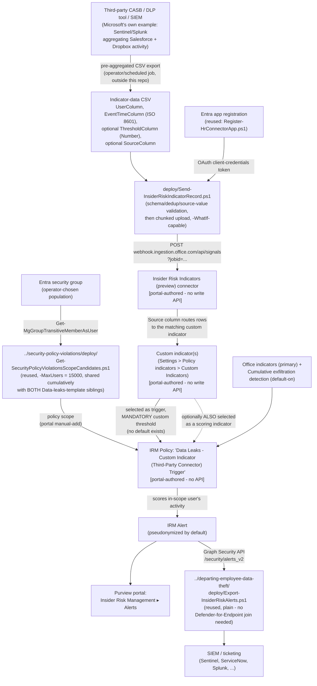

## 1. Scenario summary

Deploys Microsoft Purview Insider Risk Management's **Insider Risk Indicators (preview)** connector to
import pre-aggregated, non-Microsoft-workload detections, Microsoft's own worked example: Salesforce
and Dropbox activity aggregated by a SIEM such as Microsoft Sentinel or Splunk, as one or more **custom
indicators**, then uses those custom indicators as the triggering event (and optionally a scoring
indicator) on the base **Data leaks** Insider Risk Management policy template. Same policy template as
`scenarios/insider-risk/data-leaks/` (DLP-policy trigger) and
`scenarios/insider-risk/data-leaks-exfiltration-activity-trigger/` (built-in-indicator trigger), this
is the **third** trigger mechanism this library builds for it, and the only one that brings in a
detection Microsoft's own built-in indicators and cloud-app connectors don't cover.

**Who it's for:** a tenant that already runs a third-party CASB, DLP tool, or SIEM correlation pipeline
producing per-user risk detections for SaaS apps Insider Risk Management doesn't natively see (anything
beyond the fixed Box/Dropbox/Google Drive/Amazon S3/Azure cloud-indicator list, and beyond
Exchange/SharePoint/OneDrive) and wants that existing investment to feed the same Insider Risk
Management alerting and case-management workflow, one alerts dashboard and one investigation process,
not a second, disconnected one for third-party-sourced risk.

## 2. Business/regulatory driver

Same general framing as both sibling scenarios (`data-leaks/README.md` §2,
`data-leaks-exfiltration-activity-trigger/README.md` §2), general-population exfiltration-monitoring
evidence for SOC 2/ISO 27001 audits, no single named regulatory requirement number. This trigger
mechanism's own specific value:

- **Coverage extension, not duplication.** A tenant already paying for a CASB or third-party DLP tool
  covering, say, Salesforce or a niche SaaS app gets that tool's detections correlated with Microsoft's
  own signal (SharePoint downloads, printing, personal-cloud copying) inside one Insider Risk Management
  case, instead of two separate, uncorrelated alert queues an analyst has to manually cross-reference.
- **A path for SaaS apps outside Microsoft's fixed cloud-indicator list.** Cloud storage/cloud service
  indicators cover exactly Box, Dropbox, Google Drive, Amazon S3, and Azure
  (`data-leaks/README.md` §6), any other SaaS app (Salesforce, a niche vertical SaaS tool, an internal
  system with its own audit log) has no native Insider Risk Management connector at all. This is the
  only mechanism in this library that closes that gap, provided the buyer already has (or builds) an
  upstream aggregation pipeline for it.
- **Consolidated investigation surface.** Once ingested, a custom-indicator-driven alert appears
  alongside every other Insider Risk Management alert in the same **Alerts dashboard**, **Activity
  explorer**, and **User timeline**, the same evidence trail and case workflow this library's other
  scenarios already document, not a bolt-on.

## 3. Prerequisites

Full licensing detail and citations: `docs/licensing-matrix.md` §2 (Insider Risk Management row).

| Requirement | Minimum | Notes |
|---|---|---|
| Insider Risk Management (all policies) | **Microsoft 365 E5/A5/G5**, **Microsoft Purview Suite**, or the **Microsoft 365 E5 Insider Risk Management** add-on | Same base entitlement as every IRM scenario in this library |
| Role to configure policies/settings | **Insider Risk Management** or **Insider Risk Management Admins** role group | `docs/rbac-model.md` §4 |
| Role to create the Insider Risk Indicators connector | **Data Connector Admin** role | Included by default in the role groups above, same role the HR-connector sibling scenario already documents, `docs/rbac-model.md` §11 |
| Entra app registration for the connector | App registration + client secret, **no Microsoft Graph API permission granted** | **Reused unmodified**: `../departing-employee-data-theft/deploy/Register-HrConnectorApp.ps1 -DisplayName '<this connector's app>'`, §5 Step 2 |
| A pre-aggregated, per-user third-party detection source | Any CASB, DLP tool, or SIEM (Microsoft's own examples: Microsoft Sentinel, Splunk) that can export **already-aggregated** detections to CSV | Microsoft: "you can't import 'raw' detection signals... you can only import preprocessed aggregations as a file." This scenario does not perform the aggregation, see `design.md` §7 |
| Automation identity for scope-candidate resolution (reused) | App registration with the Microsoft Graph **`GroupMember.Read.All`** application permission, certificate-based | Reused unmodified from the base template's scoping pattern, §5 Step 8 |
| Automation identity for alert export (optional, reused) | App registration with the Microsoft Graph **`SecurityAlert.Read.All`** application permission, certificate-based | Only needed if reusing `../departing-employee-data-theft/deploy/Export-InsiderRiskAlerts.ps1` per §5 Step 9 |
| Firewall allowlist for the upload host | `webhook.ingestion.office.com` | Same requirement as the HR-connector sibling, §5 Step 5, `deploy/Send-InsiderRiskIndicatorRecord.ps1` |
| **NOT required for this trigger path** | A Purview DLP policy, any built-in-indicator trigger configuration, Microsoft Defender for Cloud Apps connections, pay-as-you-go billing | Cloud/GenAI-indicator PAYG billing is a **different, unrelated** mechanism from this connector, this connector has no PAYG requirement of its own |

> Verify current entitlement names against `docs/licensing-matrix.md` and the Product Terms before a
> sales commitment, and re-check this connector's preview/GA status against the live portal.

## 4. Architecture



Full rationale for the flexible-schema handling, the two documented silent-failure modes this scenario
defends against, and the confirmed-identical ingestion webhook mechanics is in `design.md` §2/§5.

## 5. Step-by-step implementation

### Step 1, Assign permissions

Confirm the operator is a member of **Insider Risk Management** or **Insider Risk Management Admins**
(Purview role group) and holds the **Data Connector Admin** role (included by default in both groups).

### Step 2, Register the Entra app for the connector (scripted, reused unmodified)

Same generic, permission-free app-registration requirement as the HR-connector sibling, no
connector-specific cmdlet exists, and none is needed (`design.md` §2 goal 6).

```powershell
Connect-MgGraph -Scopes 'Application.ReadWrite.All'

../departing-employee-data-theft/deploy/Register-HrConnectorApp.ps1 `
    -DisplayName 'Purview Insider Risk Indicators Connector (single-purpose)' -WhatIf

$irmConnectorApp = ../departing-employee-data-theft/deploy/Register-HrConnectorApp.ps1 `
    -DisplayName 'Purview Insider Risk Indicators Connector (single-purpose)'
```

Record `$irmConnectorApp.AppId`/`.TenantId`; store `.ClientSecret` in a vault immediately. Validate its
hygiene the same way the HR-connector scenario does:

```powershell
../departing-employee-data-theft/validate/Test-HrConnectorAppRegistration.ps1 `
    -DisplayName 'Purview Insider Risk Indicators Connector (single-purpose)'
```

### Step 3, Prepare a sample CSV of your third-party detections

Build (or export directly from your CASB/DLP/SIEM tool) a small sample CSV matching the shape you intend
to use in production. Microsoft's own worked example, reused here rather than an invented format
(`design.md` §6), routes two detection types from one CSV via a `Source` column:

```text
User_Principal_Name,Display_Name,Alert_Severity,Alert_Count,Aggregation_Date,Source_Workload
sarad@contoso.com,Salesforce - Sensitive report downloaded and emailed externally,High,10,2026-09-10T05:52:56.962686Z,Salesforce
bradh@contoso.com,Salesforce - Excessive modifications to sensitive reports,Medium,3,2026-09-10T05:52:56.962686Z,Salesforce
sarad@contoso.com,Dropbox - Sensitive files saved to personal Dropbox,High,14,2026-09-10T05:52:56.962686Z,Dropbox
bradh@contoso.com,Dropbox - Anomalous file copy activity,Medium,5,2026-09-10T05:52:56.962686Z,Dropbox
```

Only `User_Principal_Name` and `Aggregation_Date` (ISO 8601) are mandatory roles, the column *names*
are not fixed by Microsoft; use whatever your export tool actually produces and pass the matching names
to every script below via `-UserColumn`/`-EventTimeColumn`. `Alert_Count` is this example's threshold
field (must be Number-typed); `Source_Workload` is the multi-indicator routing column.

### Step 4, Create the Insider Risk Indicators (preview) connector (portal, not scriptable)

Purview portal → **Settings** → **Data connectors** → **My connectors** → **Add connector** → select
**Insider Risk Indicators (preview)** → accept the terms of service:

1. **Authentication** page: name the connector, paste `$irmConnectorApp.AppId` from Step 2.
2. **Sample file** page: upload the CSV from Step 3. If routing multiple indicators from one CSV, set
   **Source column** to `Source_Workload` and enter the exact, comma-separated (no spaces) values in
   **Related values in source column**, e.g. `Salesforce,Dropbox`. Otherwise select **None (Single
   source)**. In **Verify sample data and data type**, confirm `Alert_Count` (or your own threshold
   column) is assigned a **Number** data type.
3. **Data mapping** page: map **Event time (UTC time)** to `Aggregation_Date` and **Microsoft 365 user
   email address** to `User_Principal_Name` (both mandatory), then select any other columns to carry
   through as supporting context.
4. **Finish**: review and submit. **Copy the Job ID**, required for Step 5.

Use `deploy/policy/data-leaks-custom-indicator-trigger-policy-manifest.json` as the checklist/reference
while completing this workflow, it is not consumed by any API, and is the durable record of the exact
mapping selected, since none of it can be read back via Graph or PowerShell.

### Step 5, Validate and upload your indicator data (scripted, idempotent-safe, dry-run first)

```powershell
$secret = Read-Host -AsSecureString -Prompt 'Insider Risk Indicators connector app secret'

# Dry run - validates schema, ISO 8601 parsing, threshold numeric parsing, source-value matching,
# and duplicate (UPN, EventTime) detection. Makes no network call.
./deploy/Send-InsiderRiskIndicatorRecord.ps1 `
    -TenantId $irmConnectorApp.TenantId -AppId $irmConnectorApp.AppId -AppSecret $secret `
    -JobId $JobId -CsvPath './third_party_alerts.csv' `
    -UserColumn 'User_Principal_Name' -EventTimeColumn 'Aggregation_Date' `
    -ThresholdColumn 'Alert_Count' -SourceColumn 'Source_Workload' `
    -RelatedValues 'Salesforce','Dropbox' -WhatIf

# Real upload
./deploy/Send-InsiderRiskIndicatorRecord.ps1 `
    -TenantId $irmConnectorApp.TenantId -AppId $irmConnectorApp.AppId -AppSecret $secret `
    -JobId $JobId -CsvPath './third_party_alerts.csv' `
    -UserColumn 'User_Principal_Name' -EventTimeColumn 'Aggregation_Date' `
    -ThresholdColumn 'Alert_Count' -SourceColumn 'Source_Workload' `
    -RelatedValues 'Salesforce','Dropbox'
```

The script **fails closed** (throws before any network call) on a duplicate `(User_Principal_Name,
Aggregation_Date)` combination unless `-AllowDuplicateRecords` is passed, Microsoft documents this
exact combination as **silently dropped**, not rejected with an error, by the connector itself
(`design.md` §2 goal 3). It also fails closed on any source-column value not in `-RelatedValues`,
matching Microsoft's own documented connector-side failure for that mismatch.

Verify the upload in the portal: **Settings** → **Data connectors** → this connector → **Download
log** → confirm `RecordsSaved` matches the row count uploaded.

### Step 6, Create the custom indicator(s) (portal, not scriptable)

Purview portal → **Insider Risk Management** → **Settings** → **Policy indicators** → **Custom
Indicators** tab → **Add custom indicator**, once per entry in the manifest's `customIndicators[]`:

1. Enter a name and optional description.
2. **Data connector**: select the connector created in Step 4.
3. If the connector used a Source column, select the specific value (`Salesforce` or `Dropbox` in this
   worked example) this indicator represents.
4. **Data from mapping file**: select the Number-typed threshold column (`Alert_Count`), **or** select
   **Use only as a triggering event without any thresholds**, these are mutually exclusive; the latter
   means this indicator can never be given a trigger threshold later.
5. **Add indicator**.

### Step 7, Resolve and size the policy-scope candidate list (scripted, read-only, reused)

```powershell
Connect-MgGraph -ClientId $AppId -TenantId $TenantId -CertificateThumbprint $Thumbprint

../security-policy-violations/deploy/Get-SecurityPolicyViolationsScopeCandidates.ps1 `
    -GroupId $ScopeGroupId -MaxUsers 15000 -OutputPath ./data-leaks-custom-indicator-scope-candidates.csv
```

**`-MaxUsers` is 15,000**, identical to and shared cumulatively with **both** sibling scenarios, a
three-way shared pool if all three Data-leaks-template policies are deployed in this tenant. Pass a
lower value if either sibling's policy already consumes part of it.

### Step 8, Create the Insider Risk Management policy (portal, not scriptable)

Purview portal → **Insider Risk Management** → **Policies** → **Create policy**:

1. Template: **Data leaks** (base template, not a sibling Data-leaks-family template). Name:
   `Data Leaks - Custom Indicator (Third-Party Connector) Trigger`.
2. **Users and groups**: assign the scope resolved in Step 7.
3. **Triggers for this policy**: select the custom indicator(s) created in Step 6. Set a **custom
   threshold** for each, Microsoft provides no default/recommended threshold for a custom indicator, so
   there is no "Use default thresholds" option to fall back on here, unlike either sibling scenario's
   built-in-indicator triggers.
4. **Policy indicators**: select **Office indicators** and confirm **Cumulative exfiltration detection**
   is selected. Optionally also select the same custom indicator(s) here to additionally score
   already-in-scope users, with their own independently-configured custom threshold.
5. **Review and submit.**

Wait **24 hours** after this step (or any later change to the custom indicators or this policy) before
running Step 5's upload script for the first time, Microsoft documents this sync window explicitly;
uploading during it can leave data unscored.

### Step 9, Export correlated alerts for SIEM/ticketing integration (scripted, read-only, reused)

```powershell
../departing-employee-data-theft/deploy/Export-InsiderRiskAlerts.ps1 `
    -SinceDateTime (Get-Date).AddDays(-1) -OutputPath ./data-leaks-custom-indicator-alerts.json
```

### Step 10, Schedule the upload script and validate

Schedule Step 5's script to run on a recurring cadence (e.g. daily, matching your third-party tool's own
aggregation-export schedule), the same Windows Task Scheduler pattern
`../departing-employee-data-theft/README.md` §8 already documents for the HR connector, reused here
without modification.

```powershell
./validate/Test-DataLeaksCustomIndicatorTriggerSetup.ps1 `
    -CsvPath './third_party_alerts.csv' `
    -UserColumn 'User_Principal_Name' -EventTimeColumn 'Aggregation_Date' `
    -ThresholdColumn 'Alert_Count' -SourceColumn 'Source_Workload' -RelatedValues 'Salesforce','Dropbox' `
    -GroupId $ScopeGroupId
```

## 6. Configuration reference

| Setting | Value this scenario uses | Notes |
|---|---|---|
| Policy template | `Data leaks` | Same template as both siblings. Custom indicators are documented as usable with "any *Data theft* or *Data leaks* policies", imprecise wording; this scenario scopes itself to the base template only. See §11 |
| Triggering mechanism | Custom indicator(s), imported via the Insider Risk Indicators (preview) connector | The third and final documented Data-leaks-template trigger mechanism this library builds |
| Mandatory CSV column roles | A user-identifier column (any name) + an ISO 8601 event-time column (any name) | Column *names* are not fixed by Microsoft for this connector, a real difference from the HR-connector sibling's fixed 3-column schema |
| Optional CSV column roles | A Number-typed threshold column; a Source column (with an exact-match `-RelatedValues` list) for multi-indicator-from-one-CSV | `deploy/Send-InsiderRiskIndicatorRecord.ps1` `-ThresholdColumn`/`-SourceColumn`/`-RelatedValues` |
| Documented silent-drop condition | Duplicate (user, event-time) combination in the uploaded CSV | Microsoft: "the record is dropped", no error surfaced by the service; this scenario's upload script fails closed on this by default |
| Documented hard-failure condition | Source-column values not matching the connector's configured "Related values" exactly | Microsoft: "The connector fails if the column values don't match", checked client-side before upload |
| Custom indicator threshold mode | **Custom only, no default exists** | Microsoft: "Insider Risk Management doesn't provide recommended thresholds for custom indicators." A "Use only as a triggering event without any thresholds" option exists as an alternative to any threshold at all |
| Ingestion webhook mechanics | Identical to the HR-connector sibling's own script: same OAuth token endpoint template, same fixed resource ID, same webhook URL | Confirmed via a direct GitHub fetch of the generic `sample_script.ps1`, not assumed from documentation prose alone, `design.md` §2 goal 5 |
| Chunk size default | 5,000 records per upload call | `sample_script.ps1`'s own `RecordsPerCall` default, different from the HR-connector Learn page's own documented 500-row limit |
| Post-configuration-change sync wait | 24 hours | Microsoft's own documented minimum before uploading data after a custom-indicator or policy change |
| Scoring-indicator selection | Office indicators (primary) + Cumulative exfiltration detection (default-on); optionally the same custom indicator(s) also used as scoring indicators | Identical to both sibling scenarios for the built-in portion |
| Population mechanism | A plain Entra group (or groups), resolved via the reused base-template scope script | No HR-connector, Communication-Compliance-trigger, or priority-user-group requirement |
| Maximum actively-scored users for this template | **15,000**, shared cumulatively across **all three** Data-leaks-template scenarios in this library if all are deployed | Per-template limit, not per-trigger-mechanism |
| DLP policy / built-in-exfiltration-indicator dependency | **None** | The defining difference from both sibling scenarios |
| User-identity privacy | Pseudonymized (Microsoft default) | Not disabled by this scenario |
| Alert export mechanism | Reused: `../departing-employee-data-theft/deploy/Export-InsiderRiskAlerts.ps1`, unmodified | |
| Cross-policy disambiguation | Not attempted, same disclosed gap as every IRM scenario in this library | `AlertPolicyId` has no documented policy-name mapping |

## 7. Validation / how to prove it works

1. **Automated CSV validation (client-side, before any upload)**, 
   `validate/Test-DataLeaksCustomIndicatorTriggerSetup.ps1 -CsvPath ...` re-runs the same schema, ISO
   8601, numeric-threshold, source-value, and duplicate-detection checks
   `deploy/Send-InsiderRiskIndicatorRecord.ps1` performs before an upload, so a candidate file can be
   checked without a Graph session or credentials.
2. **Automated Graph-side checks**, the same script, given `-GroupId`, confirms the Graph session and
   `GroupMember.Read.All` permission work and reports the resolved scope-candidate count against the
   15,000-user cap. Exits non-zero on a hard failure.
3. **Ingestion confirmation**, Purview portal → **Settings** → **Data connectors** → this connector →
   **Download log**: `RecordsSaved` for the most recent run should equal the row count of the CSV
   actually uploaded (accounting for any rows this scenario's own duplicate check already flagged and
   excluded, if `-AllowDuplicateRecords` wasn't used).
4. **Manual checklist**, the same validation script prints a checklist for the portal-only
   configuration: connector mapping, custom indicator creation and threshold-field selection, the
   policy's trigger/scoring selection and mandatory custom threshold, the 24-hour sync wait, the
   firewall allowlist, and role assignment, see `design.md` §4 for why these can't be automated.
5. **End-to-end functional test (non-production names only, pilot tenant)**, upload a small test CSV
   containing a disposable test account's UPN with a threshold-column value exceeding the configured
   custom threshold. Confirm the user is marked in-scope on the **Users dashboard** and that an alert
   eventually surfaces in **Insider Risk Management** → **Alerts**, citing the custom indicator by name
   in **Activity explorer**. This pipeline's exact end-to-end latency (upload → sync → scoring → alert)
   was not independently measured in this build, §11.

## 8. Operations & tuning

- **The threshold decision for a custom indicator has no "default" fallback, treat it as a
  first-class tuning lever from day one, not something to defer.** Unlike either sibling scenario's
  built-in indicators, there is no "Use default thresholds (Recommended)" option for a custom indicator
, every custom indicator used as a trigger or scoring indicator needs a deliberately chosen numeric
  value from the start.
- **Monitor the upload pipeline's own health independently, a failed scheduled upload produces no
  native Microsoft alert.** Unlike a native Microsoft connector whose health is visible to Microsoft
  itself, this pipeline's only failure signal is the connector's own **Download log** (a manual pull) or
  whatever exit-code/logging your task scheduler captures from
  `deploy/Send-InsiderRiskIndicatorRecord.ps1`. Wire the scheduled task's exit code into existing
  infrastructure monitoring rather than relying on someone remembering to check the portal log.
- **Re-verify the third-party source's own detection coverage and tuning independently, this
  scenario inherits whatever gaps and false-positive/negative rates the upstream CASB/DLP/SIEM
  aggregation already has.** Insider Risk Management scores what it's given; it cannot compensate for a
  third-party tool that under- or over-detects.
- **Coordinate policy naming explicitly if deploying alongside either sibling scenario**, same
  reasoning both siblings already document for each other, now a three-way coordination point.
- **Re-scope on group-membership change**, same reasoning as every group-scoped IRM template in this
  library, `security-policy-violations/README.md` §8, not repeated in full here.
- **Track the 15,000-user cap across all three Data-leaks-template siblings deliberately**, there is no
  Graph/REST usage-count API to check current cumulative usage; maintain the sizing math manually if
  more than one is deployed.
- **Re-run the 24-hour sync wait after every custom-indicator or policy edit, not just the first
  deployment**, the same wait applies to any subsequent change, not only initial setup.
- **Restrict write access to the CSV export path and the scheduled-task host as a security control
  input, not just an operational convenience**, §11 discloses this pipeline validates shape, not
  provenance; treat that file path and host with the same access discipline as any other input that can
  influence a security alerting pipeline's output.

## 9. Rollback / decommission

See `rollback.md`. Quick reference: pausing the scheduled upload script, narrowing policy scope, or
raising a threshold is reversible in seconds; deleting the connector, a custom indicator, the policy, or
revoking the app registration's certificate is not.

## 10. Cost & licensing notes

- **No incremental Microsoft license cost beyond the base Insider Risk Management entitlement** if the
  tenant already has E5/A5/G5, Purview Suite, or the E5 IRM add-on, `docs/licensing-matrix.md` §2. This
  connector has **no pay-as-you-go billing requirement of its own**, a genuine difference from the
  cloud-storage/cloud-service built-in indicators either sibling scenario can optionally add.
- **The third-party CASB/DLP/SIEM tool supplying the source detections is a separate license and cost,
  entirely outside this scenario's scope**, do not present this scenario as license-neutral if the
  buyer doesn't already own that tooling; it is the prerequisite this scenario assumes, not something it
  provisions (`design.md` §7).
- **Sizing note:** this template's actively-scored-user cap is 15,000, **shared cumulatively** across
  every policy built from this exact template, now a three-way pool if both sibling scenarios in this
  library are also deployed. No Graph/REST usage-count API exists to check current cumulative usage.
- **No additional Microsoft cost for the upload, scope-candidate resolution, alert-export, or validation
  automation**, all scripts use standard HTTPS/Graph SDK calls, no metered API on the Microsoft side.

## 11. Known limitations & gotchas

- **Microsoft's own wording for which policy templates support custom indicators is imprecise, this
  scenario deliberately does not extend beyond the base `Data leaks` template.** The documentation
  states custom indicators can be added to "any *Data theft* or *Data leaks* policies," which does not
  clearly state whether this covers `Data leaks by priority users`/`Data leaks by risky users`, or only
  `Data theft by departing users` among the "Data theft" family. **VERIFY (portal)** before assuming this
  extends to a sibling template not built in this fragment (`design.md` §2 goal 7).
- **No documented confirmation of whether the connector's Source-column value matching is
  case-sensitive.** `deploy/Send-InsiderRiskIndicatorRecord.ps1` treats it as case-sensitive (the
  stricter, fail-safer assumption), **VERIFY (pilot tenant)** before relying on a specific casing
  convention in production.
- **Re-ingestion/de-duplication behavior for an unchanged CSV re-uploaded on a subsequent scheduled run
  is not documented by Microsoft**, the same open question the HR-connector sibling scenario already
  discloses for its own webhook. Re-running the upload script is always safe in the sense that it never
  deletes tenant state, but whether an unchanged row is re-scored, ignored, or duplicated server-side is
  unconfirmed. **VERIFY (pilot tenant)**.
- **This scenario does not perform the third-party detection or its aggregation.** It starts from an
  already-aggregated CSV; the buyer's own CASB/DLP/SIEM tooling and its own licensing, tuning, and
  false-positive/negative rate are all prerequisites this scenario assumes, not something it builds or
  can validate (`design.md` §7).
- **This pipeline validates the uploaded CSV's *shape*, not its *provenance*, it introduces a new
  trust boundary neither sibling scenario has.** `deploy/Send-InsiderRiskIndicatorRecord.ps1` checks
  that a record is well-formed (valid UPN, ISO 8601 timestamp, numeric threshold, matching source
  value); it has no way to confirm a record genuinely originated from the third-party tool it claims to,
  or that no record was altered or omitted between the tool's export and this script's read of the file.
  Anyone with write access to the export file or the host the scheduled script runs on could inject a
  fabricated record (to generate noise, or to implicate another user) or silently drop their own record
  before this script ever sees it, neither is detectable by anything in this scenario. Restrict write
  access to the CSV export path and the scheduled-task host at least as tightly as any other security-
  control input in your environment; this is a Red Team finding this scenario mitigates by disclosure,
  not by a code control, since no schema-level check can confirm data provenance.
- **A network failure partway through a multi-chunk upload leaves a partial, non-atomic ingestion with
  no automatic resume.** `deploy/Send-InsiderRiskIndicatorRecord.ps1` uploads chunks sequentially and
  throws on the first failed chunk; any chunks already uploaded successfully before the failure remain
  ingested (there is no all-or-nothing transaction, and no built-in retry/resume-from-last-chunk logic).
  Re-running the script after fixing the underlying network issue re-uploads the **entire** CSV,
  including the already-ingested chunks, the same documented UPN+timestamp uniqueness rule (§6) means
  those specific rows are silently dropped as duplicates on the re-run rather than double-counted, but
  confirm this reasoning holds for your data before relying on it, since Microsoft doesn't document
  partial-upload recovery as a supported scenario.
- **A failed scheduled upload produces no native Microsoft alert or notification**, unlike a portal-
  native connector failure, the only signals are the connector's own Download log (a manual pull) and
  whatever the operator's own task-scheduler infrastructure captures. See §8's operational reminder.
- **No default/recommended threshold exists for a custom indicator, a real, easy-to-miss
  operational gap versus either sibling scenario's built-in-indicator triggers**, where "Use default
  thresholds (Recommended)" is always an option even if the underlying numeric value is unpublished. Here
  there is no such fallback at all; an operator who doesn't deliberately choose a custom threshold cannot
  create a working trigger from a custom indicator.
- **This end-to-end pipeline's latency (third-party detection → CSV export → upload → 24-hour-or-less
  sync → scoring → alert) was not independently measured in this build**, no specific figure is
  asserted; **VERIFY (pilot tenant)** before a customer-facing latency commitment.
- **Cannot disambiguate which Insider Risk Management policy produced a given exported alert if more
  than one policy is deployed in the same tenant**, same disclosed gap as every IRM scenario in this
  library, sharper here with up to three Data-leaks-template siblings potentially coexisting.
- **This scenario does not configure Adaptive Protection**, a buyer who wants this policy's alerts to
  drive DLP enforcement wires it into `scenarios/adaptive-protection/dynamic-risk-dlp-enforcement/`
  separately.

## 12. References

1. Set up a connector to import third-party insider risk detections (preview), the full three-step
   process, CSV column-name flexibility ("not required parameters"), mandatory UPN/event-time roles,
   Number-typed threshold-column requirement, Source-column multi-indicator worked example and its exact
   documented failure mode, the UPN+timestamp uniqueness/silent-drop requirement, the 24-hour post-update
   sync wait, the `webhook.ingestion.office.com` firewall allowlist requirement, and the **Data Connector
   Admin** role requirement, confirmed via a direct Microsoft Learn fetch, 
   <https://learn.microsoft.com/purview/import-insider-risk-indicators>
2. Configure policy indicators in Insider Risk Management, "Built-in indicators vs. custom indicators"
   and "Custom indicators" sections: the three-step create-and-use flow, the custom-threshold-only rule
   ("don't use the default thresholds"), the "Use only as a triggering event without any thresholds"
   option, and "Insider Risk Management doesn't provide recommended thresholds for custom indicators", 
   confirmed via a direct Microsoft Learn fetch, 
   <https://learn.microsoft.com/purview/insider-risk-management-settings-policy-indicators#custom-indicators>
3. Get started with Insider Risk Management, "Configure Insider Risk Indicator (preview) connector"
   (Step 4) and Step 6's note pointing custom-trigger/indicator configuration at the Custom indicators
   article, confirmed via a direct Microsoft Learn fetch, 
   <https://learn.microsoft.com/purview/insider-risk-management-configure#configure-insider-risk-indicator-preview-connector>
4. Learn about Insider Risk Management policy templates, confirms custom indicators apply to "any
   *Data theft* or *Data leaks* policies" (imprecise wording flagged in §11) and the base `Data leaks`
   template's own triggering-event/prerequisite table, reused unmodified from both sibling scenarios, 
   confirmed via a direct Microsoft Learn fetch, 
   <https://learn.microsoft.com/purview/insider-risk-management-policy-templates>
5. Sample script source for the generic M365 compliance connector ingestion family, fetched directly
   from GitHub during this build; confirmed identical OAuth token endpoint template, fixed resource ID,
   and webhook URL to the already-grounded HR-connector sibling script, and confirmed a different
   default chunk size (5,000 via `RecordsPerCall`) from the HR-connector Learn page's own documented
   500-row limit, 
   <https://github.com/microsoft/m365-compliance-connector-sample-scripts/blob/main/sample_script.ps1>
6. Limits in Insider Risk Management, "Maximum number of users in scope for a policy template": Data
   leaks = **15,000**, reused unmodified from both sibling scenarios' own already-grounded citation, 
   <https://learn.microsoft.com/purview/insider-risk-management-limits#maximum-number-of-users-in-scope-for-a-policy-template>
7. `data-leaks/README.md`, `data-leaks-exfiltration-activity-trigger/README.md`, and
   `departing-employee-data-theft/README.md`/`design.md`, this scenario's direct siblings, whose own
   already-grounded facts (max-users cap, population mechanism, the HR-connector app-registration and
   ingestion-webhook pattern this scenario reuses/adapts) are cross-referenced rather than re-verified
   independently. `security-policy-violations/deploy/Get-SecurityPolicyViolationsScopeCandidates.ps1`,
   `departing-employee-data-theft/deploy/Register-HrConnectorApp.ps1`,
   `departing-employee-data-theft/validate/Test-HrConnectorAppRegistration.ps1`, and
   `departing-employee-data-theft/deploy/Export-InsiderRiskAlerts.ps1`, reused unmodified.
8. alert resource type, `AlertPolicyId`, `DetectionSource` properties, 
   <https://learn.microsoft.com/graph/api/resources/security-alert>
9. List group transitive members (OData cast, required `ConsistencyLevel: eventual` header,
   `GroupMember.Read.All` among the higher-privileged application permissions), 
   <https://learn.microsoft.com/graph/api/group-list-transitivemembers?view=graph-rest-1.0>
10. Microsoft Graph permissions reference (`GroupMember.Read.All`, `SecurityAlert.Read.All`), 
    <https://learn.microsoft.com/graph/permissions-reference>

> Re-verify all links, cmdlet/API behavior, and licensing terms against current Microsoft Learn before a
> customer-facing assessment or sale. This scenario's citations were grounded via a direct Microsoft
> Learn MCP fetch of the URLs above, plus a direct GitHub source fetch of the generic ingestion sample
> script (ref 5), a materially stronger grounding posture than a WebSearch-snippets-only build.
> Remaining facts that could not be corroborated with reasonable confidence are explicitly flagged
> `VERIFY` above and in `design.md` rather than asserted.
