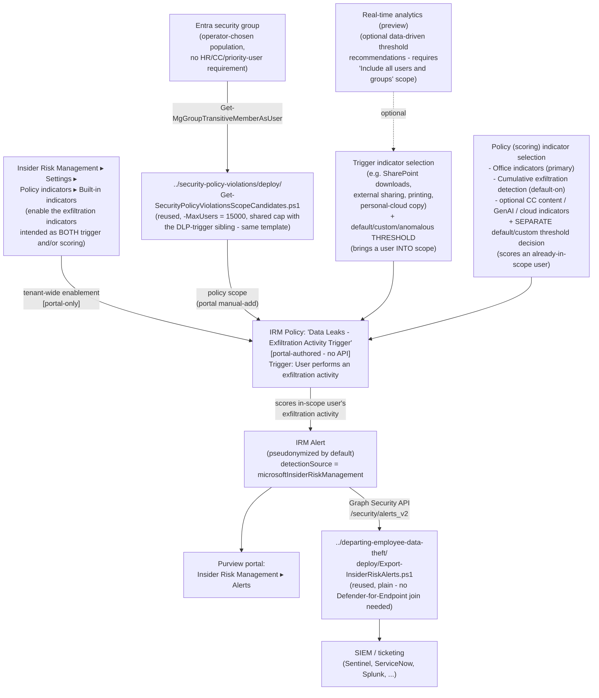

## 1. Scenario summary

Deploys Microsoft Purview Insider Risk Management's base **Data leaks** policy template — the same
template `scenarios/insider-risk/data-leaks/` builds — using its **second** documented triggering-
event option: **"User performs an exfiltration activity"** (one or more built-in indicators, with
default or custom thresholds), instead of that sibling scenario's DLP-policy trigger. Same policy
template, same 15,000-actively-scored-user cap, same population mechanism (a plain Entra group, no
HR-connector/priority-user/Communication-Compliance-trigger requirement) — different trigger
mechanics, worked end to end here for the first time in this library.

**Who it's for:** a tenant that wants the base `Data leaks` template's unconditional, general-
population exfiltration detection but has **no qualifying DLP policy yet** (or doesn't want to
provision one solely to feed this trigger) — the sibling scenario's own `design.md` §7 names this
exact use case as its documented, un-worked-example'd alternative. Also useful for a tenant that
wants trigger-level threshold control over specific built-in exfiltration activities (e.g., "bring
a user into scope only once they exceed 20 SharePoint downloads in a day," not just "any DLP High-
severity match") rather than delegating that judgment to a separately-tuned DLP policy.

## 2. Business/regulatory driver

Identical framing to `data-leaks/README.md` §2 — this is the same compensating control for the same
disclosed evasion gap (`data-leaks-by-risky-users/README.md` §11's Red Team finding: a user who
never triggers an HR-connector or Communication-Compliance gate never enters that sibling's scope
regardless of underlying exfiltration risk). This scenario is a second, equally valid path to the
same general-population, no-precursor-gate control, distinguished from the DLP-trigger sibling by
what determines when a user enters scope:

- **No DLP policy dependency.** A tenant licensed for Insider Risk Management but without a
  suitably-scoped, High-severity DLP policy already tuned for Exchange/SharePoint/OneDrive can
  still deploy this exact template today, using only Insider Risk Management's own built-in
  indicator thresholds as the gate.
- **Threshold-level control over the trigger itself**, not just the eventual scoring. Choosing
  which specific activities (SharePoint downloads, external sharing, printing, personal-cloud
  copying) and at what daily volume bring a user into scope is a materially different tuning lever
  than "any High-severity DLP rule match," useful where a buyer wants the trigger threshold itself
  to reflect organization-specific exfiltration-volume norms rather than a DLP policy's own
  independently-tuned severity model.
- **SOC 2 / ISO 27001 exfiltration-monitoring evidence with no DLP-policy prerequisite** — the same
  audit-evidence rationale `data-leaks/README.md` §2 documents, available to a tenant mid-DLP-
  rollout or one that has deliberately chosen not to gate this control behind a separate product's
  policy configuration.

No regulation names this specific control by requirement number — the same honest framing every
Insider Risk Management scenario in this library uses. No HR/Legal governance review is needed for
this trigger mechanism — it draws on built-in Office-activity indicators, not HR performance-
management data.

## 3. Prerequisites

Full licensing detail and citations: `docs/licensing-matrix.md` §2 (Insider Risk Management row).

| Requirement | Minimum | Notes |
|---|---|---|
| Insider Risk Management (all policies) | **Microsoft 365 E5/A5/G5**, **Microsoft Purview Suite**, or the **Microsoft 365 E5 Insider Risk Management** add-on | Same base entitlement as every IRM scenario in this library |
| At least one built-in exfiltration indicator turned on (Settings → Policy indicators) | Required — the policy workflow can't select an indicator that isn't first enabled tenant-wide | §5 Step 2; `design.md` §5 |
| Role to configure policies/settings | **Insider Risk Management** or **Insider Risk Management Admins** role group | `docs/rbac-model.md` §4 |
| Automation identity for scope-candidate resolution (reused) | App registration with the Microsoft Graph **`GroupMember.Read.All`** application permission, certificate-based | Reused unmodified from the base template's scoping pattern — §5 Step 3 |
| Automation identity for alert export (optional, reused) | App registration with the Microsoft Graph **`SecurityAlert.Read.All`** application permission, certificate-based | Only needed if reusing `../departing-employee-data-theft/deploy/Export-InsiderRiskAlerts.ps1` per §5 Step 5 |
| (Optional) Insider risk analytics enabled, policy scoped to "Include all users and groups" | Only if using **real-time analytics (preview)** threshold recommendations | §6; not required to use fixed/custom thresholds instead |
| (Optional) Microsoft Defender for Cloud Apps connections | Box, Dropbox, Google Drive (cloud storage indicators) and/or Amazon S3, Azure (cloud service indicators), each connected in the Microsoft Defender portal | **Not required** — this template scores without them. Requires **pay-as-you-go billing**; §6 |
| **NOT required, unlike either data-leaks sibling** | Any Purview DLP policy at all, Microsoft 365 HR connector, Communication Compliance trigger integration, Microsoft Defender for Endpoint | The defining simplification of this specific trigger path — §1/§2 |

> Verify current entitlement names against `docs/licensing-matrix.md` and the Product Terms before
> a sales commitment, and re-check this template's GA/preview status against the live portal —
> same disclosed grounding caveat `data-leaks/README.md` §3 already carries for this template.

## 4. Architecture



Full rationale for the two-independent-thresholds model and the trigger-vs-scoring indicator
distinction is in `design.md` §2/§5.

## 5. Step-by-step implementation

### Step 1 — Assign permissions

Confirm the operator is a member of **Insider Risk Management** or **Insider Risk Management
Admins** (Purview role group). No HR/Communication Compliance/Defender-for-Endpoint/DLP role is
needed anywhere in this scenario — a materially shorter prerequisite list than either data-leaks
sibling.

### Step 2 — Turn on the built-in indicators this policy will use (portal, one-time, tenant-wide)

Purview portal → **Insider Risk Management** → **Settings** → **Policy indicators** → **Built-in
Indicators**: confirm the specific exfiltration indicators you intend to use — as a trigger, a
scoring indicator, or both — are turned on. An indicator that isn't enabled here can't be selected
later in the policy-creation workflow (the workflow's own **Turn on indicators** prompt links back
to this same settings page).

### Step 3 — Resolve and size the policy-scope candidate list (scripted, read-only, reused)

```powershell
Connect-MgGraph -ClientId $AppId -TenantId $TenantId -CertificateThumbprint $Thumbprint

# Dry run
../security-policy-violations/deploy/Get-SecurityPolicyViolationsScopeCandidates.ps1 `
    -GroupId $ScopeGroupId -MaxUsers 15000 -WhatIf

# Resolve, dedupe, filter to enabled accounts, check against the confirmed cap
../security-policy-violations/deploy/Get-SecurityPolicyViolationsScopeCandidates.ps1 `
    -GroupId $ScopeGroupId -MaxUsers 15000 -OutputPath ./data-leaks-exfil-trigger-scope-candidates.csv
```

**`-MaxUsers` is 15,000** — the same base `Data leaks` template row in Microsoft's "Limits in
Insider Risk Management" table `data-leaks/README.md` §6/§12 already confirms via a direct
Microsoft Learn fetch. This cap is **shared cumulatively with the DLP-trigger sibling** (and any
other policy built from this exact template) — it is a per-template limit, not a per-trigger-event
limit. Pass a lower value if another `Data leaks`-template policy already consumes part of it.

### Step 4 — Create the Insider Risk Management policy (portal, not scriptable)

Purview portal → **Insider Risk Management** → **Policies** → **Create policy**:

1. Template: **Data leaks**. Confirm this is the base template and not `Data leaks by risky users`
   or `Data leaks by priority users` — all three share overlapping naming in the template picker.
2. Name: `Data Leaks - Exfiltration Activity Trigger` (distinct from the DLP-trigger sibling's own
   `Data Leaks` policy name, so both can coexist in the same tenant if desired — pending §6/§11's
   open question on whether a single policy can use both trigger types at once). The template and
   name can't be changed after policy creation — confirm before continuing.
3. **Users and groups**: assign the scope resolved in Step 3. If you intend to use **real-time
   analytics (preview)** threshold recommendations (optional), scope to **Include all users and
   groups** instead — that feature requires it.
4. **Triggers for this policy**: select **User performs an exfiltration activity**, then choose one
   or more of the listed built-in indicators as the trigger (only indicators turned on in Step 2
   are selectable).
5. **Trigger threshold** (sub-step 5 of this same policy-creation workflow — not a separate
   top-level step in this README): choose **Use default thresholds (Recommended)**, or **Use
   custom thresholds for the triggering events** and set a level per selected trigger indicator.
   Microsoft does not publish the specific numeric values behind the default option for any
   indicator — if default behavior needs to be documented precisely for a customer commitment, use
   custom thresholds instead so the exact values are explicit and recorded in the configuration
   manifest referenced below. See §6's worked example for how a custom threshold level maps to
   daily event counts.
6. **Policy indicators** (sub-step 6 — a separate page, a separate decision from sub-step 5's
   trigger threshold above): select **Office indicators** (SharePoint Online downloads/syncing,
   sharing internal files/folders externally, printing files, copying data to personal cloud
   storage/messaging services) — this template's primary, built-in scoring category. Optionally
   add Communication Compliance content indicators, generative AI app indicators, and/or cloud
   storage/cloud service indicators (requires those apps connected in Microsoft Defender for Cloud
   Apps and pay-as-you-go billing).
7. Select **Cumulative exfiltration detection** (enabled by default for this template — confirm it
   is actually selected).
8. **Decide whether to use default or custom indicator thresholds** for the **scoring** indicators
   selected in sub-step 6 above — this is Microsoft's own separate workflow page from sub-step 5's
   trigger threshold, not the same setting reused. Choose **Use default thresholds for all
   indicators** or **Specify custom thresholds**, independently of whatever was chosen for the
   trigger.
9. **Review and submit.**

Use `deploy/policy/data-leaks-exfiltration-activity-trigger-policy-manifest.json` as the checklist/
reference while completing this workflow — it is not consumed by any API, and is the durable record
of exactly which indicators and threshold mode were selected at each of the two independent
decision points above (sub-steps 5 and 8), since neither can be read back via Graph or PowerShell.

### Step 5 — Export correlated alerts for SIEM/ticketing integration (scripted, read-only, reused)

```powershell
Connect-MgGraph -ClientId $AppId -TenantId $TenantId -CertificateThumbprint $Thumbprint

../departing-employee-data-theft/deploy/Export-InsiderRiskAlerts.ps1 `
    -SinceDateTime (Get-Date).AddDays(-1) -OutputPath ./data-leaks-exfil-trigger-alerts.json
```

Same reuse rationale as the DLP-trigger sibling: no Microsoft Defender for Endpoint signal to join
against.

**Caveat carried over from every IRM scenario in this library:** if more than one Insider Risk
Management policy is deployed in the tenant — including this scenario's own DLP-trigger sibling, if
both are deployed — this export cannot tell which policy produced a given alert; `AlertPolicyId`
has no documented way to map back to a named Purview policy.

### Step 6 — Validate

```powershell
./validate/Test-DataLeaksExfiltrationActivityTriggerSetup.ps1 -GroupId $ScopeGroupId
```

## 6. Configuration reference

| Setting | Value this scenario uses | Notes |
|---|---|---|
| Policy template | `Data leaks` | Same template as the DLP-trigger sibling — not found labeled preview in this build's grounding; re-verify at deploy time. Cannot be changed after creation |
| Triggering event (this scenario's worked example) | **User performs an exfiltration activity** — one or more built-in indicators, default/custom/anomalous-activity thresholds | The DLP-trigger sibling's own documented alternative (`data-leaks/README.md` §6) — this scenario is that alternative's full worked example |
| Trigger-indicator threshold mode | Operator choice: **Use default thresholds (Recommended)** or **Use custom thresholds for the triggering events** | Microsoft's exact default numeric values are unpublished for any indicator — **VERIFY (portal)** before stating a specific default figure to a customer |
| Worked threshold example (Microsoft-published, illustrative only) | SharePoint-download custom thresholds: **10+/day → low** impact, **20+/day → medium** impact, **30+/day → high** impact on risk score/alert severity | Sourced directly from "Configure policy indicators in Insider Risk Management" — Microsoft's own words: "For example, suppose you decide..." — not a stated universal default for this or any other indicator |
| Anomalous-activity trigger option | **"Activity is above user's usual activity for the day"** — available for indicators that support it (not all); dynamically computed per user rather than a fixed daily count | Selectable in place of a fixed threshold where offered; if not listed for a given indicator, it isn't available and must be enabled first in Insider risk settings if merely unselectable |
| Real-time analytics (preview) threshold recommendations | Optional; requires insider risk analytics enabled and this policy scoped to **Include all users and groups** | Gives data-driven recommendations based on the previous 10 days of activity; not usable for custom indicators or indicator variants |
| Scoring-indicator threshold mode (separate decision from the trigger's) | Operator choice: **Use default thresholds for all indicators** or **Specify custom thresholds** | A distinct page/decision in the same policy-creation workflow — `design.md` §2 goal 2/§5 |
| Primary scoring indicator category | **Office indicators** (built-in) — SharePoint Online downloads/syncs, external file/folder sharing, printing files, copying to personal cloud storage/messaging services | Identical to the DLP-trigger sibling; no additional connector required |
| Cumulative exfiltration detection | **Enabled by default** for this template | Confirm selected at policy creation, not assumed |
| Optional scoring indicators | Communication Compliance content indicators; generative AI app indicators (Prompt Shields, Protected material detection) | Both documented as selectable for this template — identical to the DLP-trigger sibling |
| Optional cloud indicators | Cloud storage (Box, Dropbox, Google Drive) / cloud service (Amazon S3, Azure) indicators | Confirmed applicable to this template (`data-leaks/README.md` §6); requires Defender for Cloud Apps + pay-as-you-go billing |
| Population mechanism | A plain Entra group (or groups), resolved via the reused base-template scope script | No HR-connector, Communication-Compliance-trigger, or priority-user-group requirement |
| Maximum actively-scored users for this template | **15,000** — same row as the DLP-trigger sibling, **shared cumulatively** across every policy built from this exact template regardless of which trigger event a given policy uses | Per-template limit, not per-trigger-event |
| DLP policy dependency | **None** | The defining difference from the sibling scenario |
| Defender for Endpoint dependency | **None** | |
| User-identity privacy | Pseudonymized (Microsoft default) | Not disabled by this scenario |
| Alert export mechanism | Reused: `../departing-employee-data-theft/deploy/Export-InsiderRiskAlerts.ps1`, unmodified | The plain, non-MDE-joining variant |
| Whether both triggering-event types can be combined on one policy | **Not confirmed** — a stronger single-select signal than the sibling scenario's own framing, still not an explicit "cannot combine" statement | `design.md` §2 goal 6/§6; `README.md` §11 |
| Cross-policy disambiguation | Not attempted — same disclosed gap as every IRM scenario in this library | `AlertPolicyId` has no documented policy-name mapping |

## 7. Validation / how to prove it works

1. **Automated checks (Graph side)** — `validate/Test-DataLeaksExfiltrationActivityTriggerSetup.ps1`
   confirms the Graph session and `GroupMember.Read.All` permission actually work, and (if
   `-GroupId` is supplied) reports the resolved scope-candidate count against the 15,000-user cap.
   Exits non-zero on a hard failure.
2. **Manual checklist** — the same validation script prints a checklist for the portal-only
   configuration: indicator(s) turned on in Settings, the **trigger** indicator selection and
   threshold mode, the **separate** scoring-indicator selection and threshold mode, Cumulative
   exfiltration detection, policy existence/template/state, and role groups — see `design.md` §5
   for why these can't be automated.
3. **End-to-end functional test (non-production names only, pilot tenant)** — from a disposable
   test account in the scope group, perform an action matching one of the selected trigger
   indicators at a volume exceeding the configured threshold (e.g., if the SharePoint-download
   trigger indicator uses a low custom threshold of 10+/day per §6's worked example, download 11+
   distinct test files from a disposable SharePoint site in one day). Confirm the user is marked
   in-scope on the **Users dashboard**, and that a corresponding alert eventually surfaces in
   **Insider Risk Management** → **Alerts** once the same or another selected scoring indicator's
   activity also crosses its own threshold. This pipeline's exact end-to-end latency was not
   independently measured in this build — §11.
4. **Evidence trail** — the alert's **Activity explorer** tab shows the specific trigger and
   scoring activity that contributed to the score.

## 8. Operations & tuning

- **Two independent threshold decisions, not one — re-tune both deliberately, not just the one you
  remember configuring.** A common operational mistake this scenario's own review surfaced:
  treating "the threshold" as a single setting. Lowering the trigger-indicator threshold brings
  more users into scope sooner; lowering a scoring-indicator threshold raises alert severity sooner
  for users already in scope. Confirm which one actually needs adjustment before changing either.
- **If real-time analytics (preview) is used, re-run it periodically as organizational activity
  norms shift** — its recommendations are based on a rolling 10-day window, not a one-time
  calculation; a threshold tuned for a prior activity baseline can under- or over-alert as normal
  usage patterns change.
- **Coordinate policy naming and trigger choice explicitly if deploying this scenario alongside the
  DLP-trigger sibling in the same tenant** — until §6/§11's open combinability question is
  resolved, treat them as two separate, distinctly-named policies (as this scenario's own §5 Step 4
  already directs) rather than assuming either can absorb the other's trigger mechanism.
- **Re-scope on group-membership change**, same reasoning as every group-scoped IRM template in
  this library — `security-policy-violations/README.md` §8, not repeated here in full.
- **Cumulative exfiltration detection depends on Microsoft Entra data sharing** for peer-group
  accuracy — same disclosed dependency as `data-leaks/README.md` §8.
- **If cloud-app indicators are enabled, monitor Defender for Cloud Apps connector health
  independently** — a disconnected connector silently stops contributing to this policy's scoring.
- **Pair with the HR-connector-triggered siblings for defense in depth, not as a replacement** —
  same framing `data-leaks/README.md` §8 already establishes for the DLP-trigger sibling, applies
  identically here.
- **Confirm at deployment sign-off which specific indicators were selected as the trigger versus as
  a scoring indicator** — the two lists can differ, and a reviewer assuming they're identical could
  misjudge what actually brings a user into this policy's scope.
- **Re-check tenant-wide indicator enablement (Settings → Policy indicators) whenever another team
  changes it, not just at initial deployment.** Because a trigger indicator must first be turned on
  tenant-wide (§5 Step 2) before it's selectable in this policy, another administrator disabling
  that same indicator later — for an unrelated reason, e.g. reducing noise on a different policy —
  silently removes it from this policy's trigger set too, with no error or notification. This is
  the same class of shared-tenant-wide-setting risk `data-leaks/README.md` §8 documents for its own
  global DLP-alerts indicator, applied here to built-in indicator enablement instead.

## 9. Rollback / decommission

See `rollback.md`. Quick reference: narrowing policy scope, changing a trigger or scoring threshold,
or turning off an optional indicator is reversible in seconds; deleting the policy or revoking an
app registration's certificate is not.

## 10. Cost & licensing notes

- **No incremental license cost beyond the base Insider Risk Management entitlement** if the
  tenant already has E5/A5/G5, Purview Suite, or the E5 IRM add-on — `docs/licensing-matrix.md` §2.
- **No Microsoft Defender for Endpoint, HR connector, Communication Compliance, or DLP-policy
  entitlement or deployment required for this trigger mechanism** — the defining licensing/
  operational simplification versus every other Insider Risk Management scenario in this library,
  including its own DLP-trigger sibling.
- **Pay-as-you-go billing, if cloud storage/cloud service indicators are used** —
  `docs/licensing-matrix.md` §2's "Cloud/GenAI indicators on non-M365 → PAYG" note applies
  directly. **Not** required for this template's core built-in Office indicators.
- **Sizing note:** this template's actively-scored-user cap is 15,000, **shared cumulatively**
  with the DLP-trigger sibling and any other policy built from this exact template — confirm no
  other `Data leaks`-template policy already consumes part of it before sizing this deployment. No
  Graph/REST usage-count API exists to check current cumulative usage against that cap.
- **No additional cost for the scope-candidate resolution, alert-export, or validation
  automation** — all scripts use application permissions already covered by the base Microsoft
  Graph SDK, no metered API.

## 11. Known limitations & gotchas

- **Microsoft does not publish the specific numeric default threshold values behind "Use default
  thresholds (Recommended)" for any indicator.** This scenario's `deploy/policy/
  data-leaks-exfiltration-activity-trigger-policy-manifest.json` and `README.md` §5 Step 4
  (trigger-threshold sub-step)/§6 recommend using custom thresholds instead whenever the exact
  trigger sensitivity needs to be documented precisely for a customer commitment — **VERIFY
  (portal)** the live default values if they must be stated.
- **Whether the two triggering-event options (DLP-policy match and exfiltration activity) can be
  enabled simultaneously on one policy is still not confirmed**, though this build's direct fetch of
  "Get started with Insider Risk Management" Step 6 found the two options worded as alternative
  "if you select X... if you select Y..." branches — a stronger single-select signal than this
  library's DLP-trigger sibling scenario disclosed from its own WebSearch-only grounding, but not
  an explicit "cannot be combined" statement. `design.md` §2 goal 6/§6. This scenario's own §5
  Step 4 treats the two as separate, independently-named policies pending confirmation either way.
- **The trigger-indicator threshold and the scoring-indicator threshold are two separate decisions
  in the same policy-creation workflow — a real and easy misconfiguration to make is assuming they
  are one setting.** `design.md` §2 goal 2/§5; §6/§8 above call this out explicitly because no
  Microsoft documentation page states this distinction as plainly as the step-by-step workflow
  itself implies it.
- **A user is never analyzed for an exfiltration channel this policy scores but did not select as a
  trigger indicator, no matter how much of that specific activity they generate.** Only the
  indicator(s) chosen on the Triggers page bring a user into scope in the first place; a scoring
  indicator selected on the separate Indicators page only evaluates activity for a user who is
  *already* in scope through some trigger indicator. A tenant that selects, say, only "Downloading
  content from SharePoint" as the trigger but also enables "Copying data to personal cloud storage"
  as a scoring indicator gets zero alerts for a user who exclusively copies to personal cloud
  storage and never downloads from SharePoint above the trigger threshold — that activity is scored
  only for users already brought into scope by a different behavior. Select trigger indicators
  broadly enough to cover every exfiltration channel this policy is meant to catch; do not assume
  scoring-indicator selection alone provides coverage. Flagged during this scenario's four-lens
  review (`reviews.md`, Red Team finding 1) and reflected in §8's operational reminder above.
- **This scenario does not create, modify, or read back the trigger/scoring threshold selections
  via any script** — both are portal-only decisions with no Graph/PowerShell surface; `deploy/
  policy/data-leaks-exfiltration-activity-trigger-policy-manifest.json` is a manually-maintained
  reference, not a live query, same limitation every portal-only IRM scenario in this library
  discloses.
- **Real-time analytics (preview) threshold recommendations require the policy to be scoped to
  "Include all users and groups"** — not compatible with a narrowly-scoped group population if that
  specific feature is used; a tenant that wants both a narrow population and data-driven threshold
  guidance must choose custom thresholds set manually instead of real-time analytics for this
  policy. Not a limitation of this scenario specifically, but disclosed here because it directly
  affects the population-vs-analytics tradeoff for this particular trigger path.
- **Coverage is bounded by the specific trigger and scoring indicators actually selected, not "all
  exfiltration."** Office indicators cover SharePoint/OneDrive/printing and copying to personal
  cloud storage/messaging services — they do not cover Teams messages, removable media/USB, or
  content sent from a personal (non-Microsoft-365) email account unless a separately-scoped control
  elsewhere in this library also covers that channel.
- **A disciplined insider aware of the specific trigger indicator and threshold in use can pace
  activity to stay just under it** — the same threshold-aware evasion property every fixed-count
  trigger in this library's Insider Risk Management scenarios discloses (e.g.
  `data-leaks-by-risky-users/README.md` §11's Communication Compliance message-count gate). The
  anomalous-activity ("above user's usual activity for the day") option, where available, is
  Microsoft's own documented mitigation for a *static* threshold's predictability, but has its own
  disclosed evasion property: a user who paces activity to stay within their **own** historical
  norm generates no anomalous-activity signal by design.
- **Cumulative exfiltration detection's 30-day peer-group baseline has the same two disclosed
  evasion properties already documented for this template family** — a recently hired user has no
  established personal baseline yet, and a paced/slow-drip exfiltrator staying under peer-group
  norms is not detected by this indicator by design (`data-leaks-by-risky-users/README.md` §11).
- **This scenario does not configure Adaptive Protection** — a buyer who wants this policy's
  alerts to drive DLP enforcement wires it into
  `scenarios/adaptive-protection/dynamic-risk-dlp-enforcement/` separately.
- **Cannot disambiguate which Insider Risk Management policy produced a given exported alert if
  more than one policy is deployed in the same tenant** — same disclosed gap as every IRM scenario
  in this library, and directly relevant if both this scenario and its DLP-trigger sibling are
  deployed together.
- **This end-to-end trigger-to-alert pipeline's latency was not independently measured in this
  build** — `README.md` §7 Step 3 borrows no specific figure from elsewhere rather than asserting
  one; VERIFY against a pilot tenant before a customer-facing latency commitment.

## 12. References

1. Get started with Insider Risk Management — Step 6 "Create an Insider Risk Management policy,"
   sub-steps 12/14/15: the "User matches a data loss prevention (DLP) policy" vs. "User performs an
   exfiltration activity" triggering-event choice, phrased as alternative "if you select X... if
   you select Y..." branches; the trigger-indicator default-vs-custom-vs-anomalous threshold choice
   (a separate decision from the later policy/scoring-indicator threshold page, sub-step 17) —
   confirmed via a direct Microsoft Learn fetch —
   <https://learn.microsoft.com/purview/insider-risk-management-configure#step-6-required-create-an-insider-risk-management-policy>
2. Learn about Insider Risk Management policy templates — Data leaks template description and the
   "Policy template prerequisites and triggering events" table: "Data leak policy activity that
   creates a High severity alert **or** built-in exfiltration event triggers," prerequisite "DLP
   policy configured for High severity alerts... **OR** Customized triggering indicators" —
   confirmed via a direct Microsoft Learn fetch —
   <https://learn.microsoft.com/purview/insider-risk-management-policy-templates#data-leaks>
3. Configure policy indicators in Insider Risk Management — "Indicator level settings": the fully
   worked SharePoint-download custom-threshold example (10+/20+/30+ events per day → low/medium/
   high impact on risk score and alert severity), explicitly framed as an illustrative example, not
   a stated default; the "Activity is above user's usual activity for the day" anomalous-activity
   trigger option; "Use real-time analytics recommendations to set thresholds" (preview, requires
   insider risk analytics enabled and "Include all users and groups" scope, 10-day activity
   window); "you can only modify triggering events for policies created from the Data leaks or
   Data leaks by priority users templates" — confirmed via a direct Microsoft Learn fetch —
   <https://learn.microsoft.com/purview/insider-risk-management-settings-policy-indicators#indicator-level-settings>,
   <https://learn.microsoft.com/purview/insider-risk-management-settings-policy-indicators#use-real-time-analytics-recommendations-to-set-thresholds>
4. Limits in Insider Risk Management — "Maximum number of users in scope for a policy template":
   Data leaks = **15,000**, a per-template (not per-trigger-event) limit — already confirmed via a
   direct Microsoft Learn fetch for the DLP-trigger sibling scenario, reused here unmodified —
   <https://learn.microsoft.com/purview/insider-risk-management-limits#maximum-number-of-users-in-scope-for-a-policy-template>
5. `data-leaks/README.md` and `design.md` — this scenario's direct sibling and template source,
   whose own already-grounded facts (max-users cap, population mechanism, cumulative exfiltration
   detection default, optional indicator applicability) this scenario reuses and cross-references
   rather than re-verifying independently. `security-policy-violations/deploy/
   Get-SecurityPolicyViolationsScopeCandidates.ps1` and `departing-employee-data-theft/deploy/
   Export-InsiderRiskAlerts.ps1` — reused unmodified.
6. alert resource type — `AlertPolicyId`, `DetectionSource` properties —
   <https://learn.microsoft.com/graph/api/resources/security-alert>
7. List group transitive members (OData cast, required `ConsistencyLevel: eventual` header,
   `GroupMember.Read.All` among the higher-privileged application permissions) —
   <https://learn.microsoft.com/graph/api/group-list-transitivemembers?view=graph-rest-1.0>
8. Microsoft Graph permissions reference (`GroupMember.Read.All`, `SecurityAlert.Read.All`) —
   <https://learn.microsoft.com/graph/permissions-reference>

> Re-verify all links, cmdlet/API behavior, and licensing terms against current Microsoft Learn
> before a customer-facing assessment or sale. This scenario's citations were grounded via a direct
> Microsoft Learn MCP fetch of the URLs above, from a session whose network environment did not
> block direct fetches (a materially stronger grounding posture than the DLP-trigger sibling
> scenario's original WebSearch-only build). Remaining facts that could not be corroborated with
> reasonable confidence are still explicitly flagged `VERIFY` above and in `design.md` rather than
> asserted.
