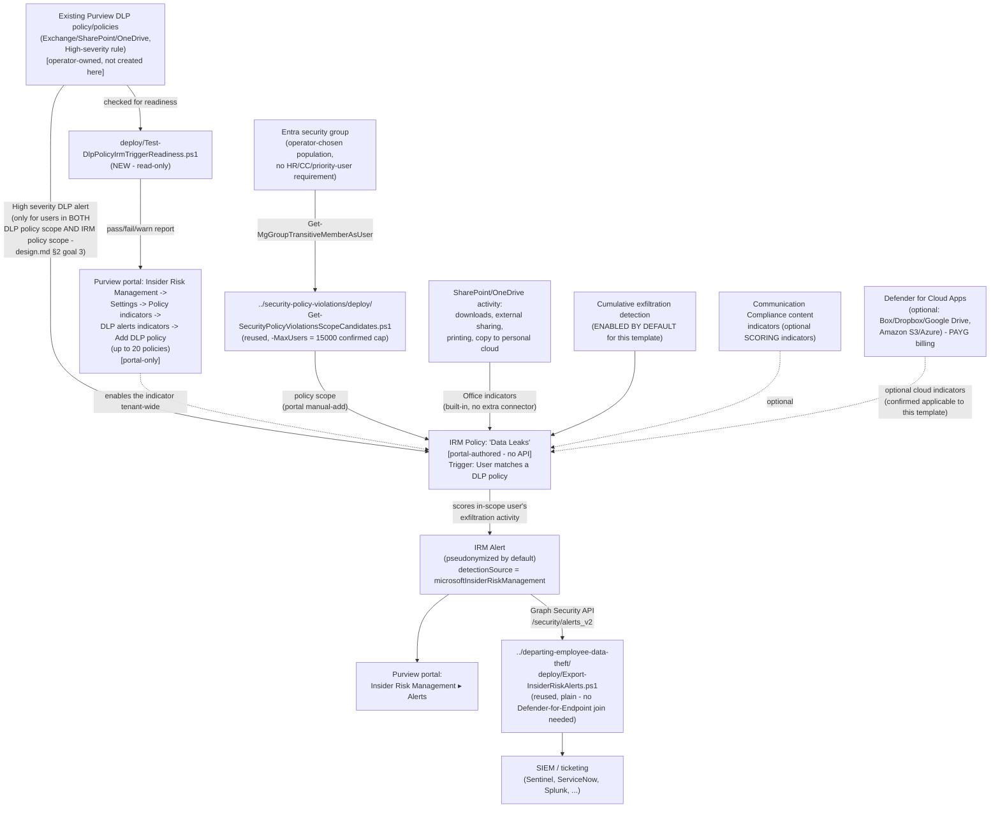

## 1. Scenario summary

Deploys Microsoft Purview Insider Risk Management's **Data leaks** policy template — the base
member of the "Data leaks…" template family (base `Data leaks`, `…by priority users`, `…by
risky users`). Unlike every other Insider Risk Management scenario in this library, this
template has **no HR-connector, Communication Compliance, or priority-user-group requirement at
all**: the population is an ordinary Entra group (or groups) the operator chooses, and the
triggering event is either an existing Purview DLP policy configured for High-severity alerts, or
the product's own built-in exfiltration-activity indicators. This scenario's worked example uses
the **DLP-policy trigger**, wired against one or more operator-supplied, already-existing DLP
policies — the general-purpose runbook this library's `data-leaks-by-risky-users` and two "part2"
DLP scenarios all separately reference as the "no employment-stressor or message-count gate"
control needed to close the specific evasion gaps their own four-lens reviews already disclosed.

**Who it's for:** a tenant that wants unconditional, general-population exfiltration detection —
not gated behind an HR signal or a Communication Compliance message threshold — layered on top of
DLP policies it has already deployed and tuned. Also the natural first Insider Risk Management
policy for a tenant that has DLP but hasn't yet adopted any of the HR-connector- or
priority-user-triggered templates.

## 2. Business/regulatory driver

Every other trigger mechanism in this library's Insider Risk Management scenarios is a
Microsoft-controlled gate a disciplined insider can, by design, stay under: an HR-connector
employment-stressor record, or Communication Compliance's 5-messages-in-24-hours threshold. This
template removes that gate entirely — any user in the policy's scope who is also in scope of a
qualifying DLP policy's High-severity rule is analyzed, with no precursor signal required first.

- **Closes a named, disclosed evasion gap this library's own reviews already found.**
  `data-leaks-by-risky-users/README.md` §11's Red Team finding states plainly that a user who
  never triggers its HR/Communication-Compliance gates "never enters this policy's scope...
  regardless of underlying exfiltration risk," and names this exact template as the compensating
  control. This scenario is that control, built as a standalone, general-purpose runbook rather
  than a one-off attached to a single parent DLP policy.
- **Correlates exfiltration activity with content a DLP policy already flagged as sensitive.**
  Rather than scoring generic Office activity in isolation, the DLP-policy trigger means this
  template's alerts are specifically about users who already produced a High-severity DLP match —
  a materially higher-precision starting point than an unconditional group-wide indicator scan.
- **SOC 2 / ISO 27001 exfiltration-monitoring evidence with no population-selection judgment
  call.** The same audit-evidence rationale this library's other Insider Risk Management
  scenarios document (`security-policy-violations/README.md` §2), applied here to a population
  that isn't first filtered by an HR event or a message-count threshold — useful specifically
  where a customer's compliance narrative needs to show monitoring isn't contingent on a
  behavioral precursor.

No regulation names this specific control by requirement number — the same honest framing this
library's other Insider Risk Management scenarios use. No HR/Legal governance review is needed
for this template's trigger mechanism specifically (unlike the HR-connector-triggered siblings) —
it draws on DLP alert data and built-in activity indicators, not performance-management HR data.

## 3. Prerequisites

Full licensing detail and citations: `docs/licensing-matrix.md` §2 (Insider Risk Management row).

| Requirement | Minimum | Notes |
|---|---|---|
| Insider Risk Management (all policies) | **Microsoft 365 E5/A5/G5**, **Microsoft Purview Suite**, or the **Microsoft 365 E5 Insider Risk Management** add-on | Same base entitlement as every IRM scenario in this library |
| At least one existing Purview DLP policy, scoped to Exchange Online/SharePoint Online/OneDrive for Business, with a High-severity rule | Required **only** if using the DLP-policy triggering event (this scenario's worked example) | Checked by `deploy/Test-DlpPolicyIrmTriggerReadiness.ps1` before wiring it up; §5 Step 2 |
| Role to configure policies/settings | **Insider Risk Management** or **Insider Risk Management Admins** role group | `docs/rbac-model.md` §4 |
| Role to read/manage DLP policies (readiness check only, no create/modify) | **View-Only DLP Compliance Management** or broader (e.g. **Compliance Administrator**) | `docs/rbac-model.md` §4; least-privilege for a read-only check |
| Automation identity for DLP-policy readiness check (new) | App registration/role assignment enabling `Connect-IPPSSession` with at least read access to DLP policies | §5 Step 2 |
| Automation identity for scope-candidate resolution (reused) | App registration with the Microsoft Graph **`GroupMember.Read.All`** application permission, certificate-based | Reused unmodified from the base `Security policy violations` template's scoping pattern — §5 Step 3 |
| Automation identity for alert export (optional, reused) | App registration with the Microsoft Graph **`SecurityAlert.Read.All`** application permission, certificate-based | Only needed if reusing `../departing-employee-data-theft/deploy/Export-InsiderRiskAlerts.ps1` per §5 Step 6 |
| (Optional) Microsoft Defender for Cloud Apps connections | Box, Dropbox, Google Drive (cloud storage indicators) and/or Amazon S3, Azure (cloud service indicators), each connected in the Microsoft Defender portal | **Not required** — this template scores without them. Requires **pay-as-you-go billing** enabled in Purview billing; §6 |
| **NOT required, unlike this template's HR-triggered siblings** | Microsoft 365 HR connector, Communication Compliance trigger integration, Microsoft Defender for Endpoint | The defining simplification of this template — §1/§2 |

> Verify current entitlement names against `docs/licensing-matrix.md` and the Product Terms before
> a sales commitment, and re-check this template's GA/preview status against the live portal —
> this build's grounding did not find it explicitly labeled preview, but could not directly fetch
> `learn.microsoft.com` to confirm (§11).

## 4. Architecture



Full rationale for the DLP-policy trigger choice and the double-scoping requirement is in
`design.md` §2–5.

## 5. Step-by-step implementation

### Step 1 — Assign permissions

Confirm the operator is a member of **Insider Risk Management** or **Insider Risk Management
Admins** (Purview role group), and has at least read access to the DLP policies to be used as a
trigger (`docs/rbac-model.md` §4). No HR/Communication Compliance/Defender-for-Endpoint role is
needed anywhere in this scenario.

### Step 2 — Check candidate DLP policies for trigger readiness (scripted, read-only, new)

```powershell
Connect-IPPSSession -AppId $AppId -Certificate $Cert -Organization $TenantDomain

# Dry run — shows the query plan, calls nothing
./deploy/Test-DlpPolicyIrmTriggerReadiness.ps1 -DlpPolicyName 'PII DLP - Exchange External Send Control' -WhatIf

# Check one or more existing policies
./deploy/Test-DlpPolicyIrmTriggerReadiness.ps1 -DlpPolicyName 'PII DLP - Exchange External Send Control', 'SharePoint PII Guardrail'
```

For each policy, this reports whether it's scoped to a supported workload (Exchange/SharePoint/
OneDrive), whether it has at least one High-severity rule, whether its `Mode` is `Enable` rather
than a Test mode, and reminds the operator to cross-check the policy's own scope against the IRM
policy's future "Users and groups" scope (§6's double-scoping requirement — there is no automated
way to compare the two). Fix any `[FAIL]` in the source DLP policy (or choose a different one)
before continuing — this script never modifies the policy itself. A `[WARN]` on `Mode` is not a
hard blocker, but confirm the policy is not left indefinitely in `TestWithNotifications`/
`TestWithoutNotifications` mode if you need this trigger to actually fire — whether Test mode
still generates the alerts this indicator consumes is unconfirmed (§11).

### Step 3 — Resolve and size the policy-scope candidate list (scripted, read-only, reused)

```powershell
Connect-MgGraph -ClientId $AppId -TenantId $TenantId -CertificateThumbprint $Thumbprint

# Dry run
../security-policy-violations/deploy/Get-SecurityPolicyViolationsScopeCandidates.ps1 `
    -GroupId $ScopeGroupId -MaxUsers 15000 -WhatIf

# Resolve, dedupe, filter to enabled accounts, check against the confirmed cap
../security-policy-violations/deploy/Get-SecurityPolicyViolationsScopeCandidates.ps1 `
    -GroupId $ScopeGroupId -MaxUsers 15000 -OutputPath ./data-leaks-scope-candidates.csv
```

**`-MaxUsers` is 15,000 for this template** — Microsoft's own "Limits in Insider Risk
Management" table gives the base `Data leaks` template its own row at 15,000, confirmed via a
direct Microsoft Learn fetch (§6/§12 ref 6, `design.md` §2 goal 7). This cap is cumulative
**tenant-wide across every policy built from this exact template** — pass a lower value if
another `Data leaks`-template policy already consumes part of it. Do not reuse the
`security-policy-violations` (1,000) or risky/priority-users family (7,500) numbers, which are
documented for different templates.

### Step 4 — Create the Insider Risk Management policy (portal, not scriptable)

Purview portal → **Insider Risk Management** → **Policies** → **Create policy**:

1. Template: **Data leaks**. Confirm this is the base template and not `Data leaks by risky
   users` or `Data leaks by priority users` — all three share overlapping naming in the template
   picker.
2. Name: `Data Leaks`. The template and name can't be changed after policy creation — confirm
   before continuing.
3. **Users and groups**: assign the scope resolved in Step 3.
4. **Triggers for this policy**: select **User matches a data loss prevention (DLP) policy**, then
   add the DLP policy/policies checked for readiness in Step 2 (up to 20). If no qualifying DLP
   policy exists yet, select **User performs an exfiltration activity** instead, choose one or
   more built-in indicators, and choose default or custom thresholds — a fully valid, documented
   alternative this scenario does not further worked-example beyond this configuration reference
   (`design.md` §3/§6/§7).
5. **Policy indicators**: select **Office indicators** (SharePoint Online downloads/syncing,
   sharing internal files/folders externally, printing files, copying data to personal cloud
   storage/messaging services) — this template's primary, built-in scoring category. Optionally
   add Communication Compliance content indicators, generative AI app indicators, and/or cloud
   storage/cloud service indicators (Box, Dropbox, Google Drive, Amazon S3, Azure — requires those
   apps connected in Microsoft Defender for Cloud Apps and pay-as-you-go billing).
6. Select **Cumulative exfiltration detection** (enabled by default for this template — confirm it
   is actually selected rather than assuming the default survived any earlier "Turn on
   indicators" step).
7. **Review and submit.**

Use `deploy/policy/data-leaks-policy-manifest.json` as the checklist/reference while completing
this workflow — it is not consumed by any API.

### Step 5 — Add the DLP policy/policies to the global DLP-alerts indicator setting (portal, not scriptable)

Purview portal → **Insider Risk Management** → **Settings** → **Policy indicators** → **Built-in
Indicators** → **Data loss prevention (DLP) indicators** → **Add DLP policies**, and select each
policy checked in Step 2. This is a **global, tenant-wide** setting, not scoped to one IRM
policy — if other Insider Risk Management policies in the tenant also use the DLP-alerts
indicator, confirm this addition doesn't unintentionally widen their own trigger surface too.

### Step 6 — Export correlated alerts for SIEM/ticketing integration (scripted, read-only, reused)

```powershell
Connect-MgGraph -ClientId $AppId -TenantId $TenantId -CertificateThumbprint $Thumbprint

../departing-employee-data-theft/deploy/Export-InsiderRiskAlerts.ps1 `
    -SinceDateTime (Get-Date).AddDays(-1) -OutputPath ./data-leaks-alerts.json
```

This template has no Microsoft Defender for Endpoint signal to join against, so this scenario
reuses the plain export script, not the `security-policy-violations` family's Defender-for-
Endpoint-joining variant.

**Caveat carried over from every IRM scenario in this library:** if more than one Insider Risk
Management policy is deployed in the tenant, this export cannot tell which policy produced a
given alert — `AlertPolicyId` has no documented way to map back to a named Purview policy.

### Step 7 — Validate

```powershell
./validate/Test-DataLeaksIrmSetup.ps1 -GroupId $ScopeGroupId -DlpTriggerConfigured
```

Checks the resolved scope against the default 15,000-user cap; pass `-MaxUsers` to override if
another policy built from this exact template already consumes part of that shared cap.

## 6. Configuration reference

| Setting | Value this scenario uses | Notes |
|---|---|---|
| Policy template | `Data leaks` | Not found labeled preview in this build's grounding — re-verify at deploy time. Cannot be changed after creation |
| Triggering event (primary, worked example) | **User matches a DLP policy** — one or more existing policies, Exchange/SharePoint/OneDrive, High severity | Up to 20 DLP policies per IRM policy; checked via `deploy/Test-DlpPolicyIrmTriggerReadiness.ps1` |
| Triggering event (documented alternative, not worked-example'd) | **User performs an exfiltration activity** — built-in indicators, default or custom thresholds | Use if no qualifying DLP policy exists; `design.md` §3/§6/§7 |
| Double-scoping requirement | A user's DLP-triggered alert requires membership in **both** the DLP policy's own scope **and** this IRM policy's "Users and groups" scope | Not automatically cross-checked by any tool — manual confirmation required (§5 Step 2/Step 4) |
| Primary scoring indicator category | **Office indicators** (built-in) — SharePoint Online downloads/syncs, external file/folder sharing, printing files, copying to personal cloud storage/messaging services | No additional connector required |
| Cumulative exfiltration detection | **Enabled by default** for this template | Confirm selected at policy creation, not assumed |
| Optional scoring indicators | Communication Compliance content indicators; generative AI app indicators (Prompt Shields, Protected material detection) | Both documented as selectable for this template |
| Optional cloud indicators | Cloud storage (Box, Dropbox, Google Drive) / cloud service (Amazon S3, Azure) indicators | Confirmed applicable to this specific template (unlike the open question `data-leaks-by-risky-users` carries for itself); requires Defender for Cloud Apps + pay-as-you-go billing |
| Population mechanism | A plain Entra group (or groups), resolved via the reused base-template scope script | No HR-connector, Communication-Compliance-trigger, or priority-user-group requirement |
| Maximum actively-scored users for this template | **15,000** — confirmed via a direct Microsoft Learn fetch, cumulative tenant-wide across every policy built from this exact template | Do not reuse the `security-policy-violations` (1,000) or risky/priority-users family (7,500) numbers — different templates |
| DLP-policy trigger workload support | Exchange Online, SharePoint Online, OneDrive for Business only | Endpoint DLP, Microsoft Teams, **Microsoft 365 Copilot**, on-premises repositories, and Power BI are explicitly NOT supported for this indicator — confirmed via a direct Microsoft Learn fetch. A policy that mixes a supported and an unsupported workload still has its supported-workload rules' alerts processed correctly (Microsoft states this explicitly) |
| DLP-policy trigger severity requirement | At least one rule at **High** severity on the parent DLP policy | Lower-severity-only policies never fire this trigger |
| Defender for Endpoint dependency | **None** | |
| User-identity privacy | Pseudonymized (Microsoft default) | Not disabled by this scenario |
| Alert export mechanism | Reused: `../departing-employee-data-theft/deploy/Export-InsiderRiskAlerts.ps1`, unmodified | The plain, non-MDE-joining variant |
| Cross-policy disambiguation | Not attempted — same disclosed gap as every IRM scenario in this library | `AlertPolicyId` has no documented policy-name mapping |

## 7. Validation / how to prove it works

1. **Automated checks (DLP side)** — `deploy/Test-DlpPolicyIrmTriggerReadiness.ps1` confirms each
   candidate DLP policy's workload scope, High-severity rule presence, and the combined 20-policy
   ceiling. Exits with a per-policy `[PASS]`/`[FAIL]`/`[WARN]` report; makes no mutating calls.
2. **Automated checks (Graph side)** — `validate/Test-DataLeaksIrmSetup.ps1` confirms the Graph
   session and `GroupMember.Read.All` permission actually work, and (if `-MaxUsers` is supplied)
   reports the resolved scope-candidate count against it. Exits non-zero on a hard failure.
3. **Manual checklist** — the same validation script prints a checklist for the portal-only
   configuration (DLP-alerts indicator wiring, policy existence/template/state, indicator
   selection, the double-scoping cross-check, role groups) — see `design.md` §4 for why these
   can't be automated.
4. **End-to-end functional test (non-production names only, pilot tenant)** — from a disposable
   test account that is a member of both the scope group and the parent DLP policy's own scope,
   perform an action that already matches the parent DLP policy's High-severity rule (e.g. sending
   a test message containing the parent scenario's own disposable test SIT value externally).
   Confirm the DLP alert appears in the DLP Alerts dashboard, and that a corresponding alert
   surfaces in **Insider Risk Management** → **Alerts** — allow for the same propagation delay
   Microsoft documents for DLP-alert-to-IRM-alert processing elsewhere in this library
   (`dynamic-risk-dlp-enforcement/README.md` §7's up-to-several-hours latency note is the closest
   documented analogue; this exact pipeline's own latency was not independently re-confirmed in
   this build — §11).
5. **Evidence trail** — the alert's **Activity explorer** tab shows the specific DLP alert (and,
   if enabled, Office/cumulative-exfiltration activity) that contributed to the score.

## 8. Operations & tuning

- **Confirm the double-scoping overlap on every scope change, not just at initial deployment.**
  Adding a user to the IRM policy's group without also confirming they're in the parent DLP
  policy's own scope (or vice versa) silently produces no alert for that user — no error, no
  warning from either product.
- **This is a global indicator setting — coordinate before adding or removing a DLP policy from
  it.** Adding a DLP policy to the DLP-alerts indicator affects every Insider Risk Management
  policy in the tenant that also uses that indicator, not just this one. Confirm with whoever owns
  any other DLP-alerts-indicator-triggered IRM policy before changing the tenant-wide list.
- **Re-check the DLP policy's own severity/rule configuration on every change to the parent DLP
  scenario.** If the parent DLP policy (e.g. `exchange-pii-exfil-block`) changes a rule's
  `ReportSeverityLevel` away from High, or removes the rule entirely, this template's trigger
  silently stops firing for that content — re-run `deploy/Test-DlpPolicyIrmTriggerReadiness.ps1`
  after any change to a policy feeding this trigger.
- **Re-scope on group-membership change**, same reasoning as every group-scoped IRM template in
  this library — `security-policy-violations/README.md` §8, not repeated here in full.
- **Cumulative exfiltration detection depends on Microsoft Entra data sharing** for peer-group
  accuracy — same disclosed dependency as `data-leaks-by-risky-users/README.md` §8.
- **If cloud-app indicators are enabled, monitor Defender for Cloud Apps connector health
  independently** — a disconnected connector silently stops contributing to this policy's scoring.
- **Pair with the HR-connector-triggered siblings for defense in depth, not as a replacement.**
  This template closes the "no precursor signal" gap those siblings' own reviews disclosed, but it
  is bounded by its own indicator/workload set (§11) — running this template alongside, not
  instead of, `data-leaks-by-risky-users` gives broader coverage than either alone for a
  population where both matter.
- **Confirm at deployment sign-off which triggering event is actually configured** — the DLP-
  policy trigger and the exfiltration-activity trigger produce materially different alert
  populations; documenting which one (or both, if that combination is confirmed viable — §11) a
  given deployment uses avoids ambiguity during later review.

## 9. Rollback / decommission

See `rollback.md`. Quick reference: removing a DLP policy from the global indicator list,
narrowing policy scope, or turning off an optional indicator is reversible in seconds; deleting
the policy or revoking an app registration's certificate is not.

## 10. Cost & licensing notes

- **No incremental license cost beyond the base Insider Risk Management entitlement** if the
  tenant already has E5/A5/G5, Purview Suite, or the E5 IRM add-on — `docs/licensing-matrix.md`
  §2.
- **No Microsoft Defender for Endpoint, HR connector, or Communication Compliance entitlement
  required for this template's trigger mechanism** — the defining licensing simplification versus
  every other IRM scenario in this library.
- **No additional DLP license required** — this scenario assumes the parent DLP policy/policies
  already exist under their own, independently-licensed deployment; this fragment adds no new DLP
  cost.
- **Pay-as-you-go billing, if cloud storage/cloud service indicators are used** —
  `docs/licensing-matrix.md` §2's "Cloud/GenAI indicators on non-M365 → PAYG" note applies
  directly. **Not** required for this template's core built-in Office indicators.
- **Sizing note:** this template's actively-scored-user cap is 15,000, cumulative tenant-wide
  across every policy built from this exact template (§6/§11) — no Graph/REST usage-count API
  exists to check current cumulative usage against that cap, same disclosed gap as every sibling
  template.
- **No additional cost for the readiness check, scope-candidate resolution, or alert-export
  automation** — all scripts use application permissions already covered by the base Microsoft
  Graph SDK, Security & Compliance PowerShell, or no metered API.

## 11. Known limitations & gotchas

- **This template's actively-scored-user cap is 15,000**, confirmed via a direct Microsoft Learn
  fetch during a follow-up grounding pass (a prior build session's WebSearch-only grounding, whose
  network environment blocked every direct `learn.microsoft.com` fetch, could not confirm it) —
  cumulative tenant-wide across every policy built from this exact template. Do not assume it
  matches the `security-policy-violations` (1,000) or risky/priority-users family (7,500) numbers,
  which are documented for different templates. `design.md` §2 goal 7.
- **Microsoft 365 Copilot is explicitly not a supported workload for the DLP-alerts indicator**,
  confirmed via the same direct fetch (§6/§12 ref 4/9) — a DLP policy scoped only to the Copilot
  location never triggers this template, even though its rules may still carry a High-severity
  tag. Because Copilot-scoped policies use `-EnforcementPlanes CopilotExperiences`/`-Locations`
  rather than a dedicated `...Location` array parameter, `deploy/
  Test-DlpPolicyIrmTriggerReadiness.ps1`'s Copilot check reads a property
  (`EnforcementPlanes`) whose exact shape on `Get-DlpCompliancePolicy`'s output was not
  independently confirmed by a dedicated Get- reference page — VERIFY against a pilot tenant
  before relying on that specific check catching every Copilot-scoped policy.
- **The double-scoping requirement is the most likely silent misconfiguration for this
  scenario.** A user in the IRM policy's "Users and groups" scope but NOT in the parent DLP
  policy's own scope (or vice versa) never has an alert processed, with no error surfaced by
  either product. `deploy/Test-DlpPolicyIrmTriggerReadiness.ps1` reminds the operator to check
  this manually; no tool compares the two scopes programmatically.
- **Whether both triggering-event types (DLP-policy match and exfiltration activity) can be
  enabled simultaneously on one policy is still unconfirmed, though a stronger single-select
  signal has since surfaced** — unlike the risky/priority-users family's explicit documented
  AND/OR prerequisite, this scenario's own grounding found no equivalent explicit statement for
  the base template. A later sibling fragment,
  `../data-leaks-exfiltration-activity-trigger/design.md` §2 goal 6, direct-fetched the same
  Microsoft Learn "Get started with Insider Risk Management" Step 6 workflow and found the two
  triggering-event options worded as alternative "if you select X... if you select Y..."
  branches — suggestive of a single-select choice, not an explicit "cannot combine" statement.
  `design.md` §6 discloses this as an open VERIFY rather than treating it as resolved either way.
- **The DLP-alerts indicator is a global, tenant-wide setting**, not scoped to one IRM policy —
  adding or removing a DLP policy from it can affect other Insider Risk Management policies in the
  tenant that also use it. §8.
- **A policy that mixes a supported workload (e.g. Exchange) with an unsupported one (e.g. Teams)
  on the SAME DLP policy is confirmed safe** — Microsoft states directly that only the
  supported-workload rules' alerts are processed in that case. `deploy/
  Test-DlpPolicyIrmTriggerReadiness.ps1` still prints an informational `[WARN]` on this
  combination (not a `[FAIL]`) so the operator is aware which rules on a mixed policy actually
  feed this trigger; see the script's own `.NOTES` for the citation.
- **Whether a parent DLP policy left in `TestWithNotifications`/`TestWithoutNotifications` mode
  still generates the High-severity alerts this indicator consumes is unconfirmed** — found during
  this scenario's own four-lens review (`reviews.md`). This library's own DLP scenarios commonly
  default a newly-deployed policy to `TestWithNotifications` for a first, safe rollout; a policy
  left there indefinitely could silently produce no IRM trigger signal even though every other
  readiness check passes. `deploy/Test-DlpPolicyIrmTriggerReadiness.ps1` WARNs on `Mode -ne
  'Enable'` rather than FAILing, since test-mode policies are documented to still generate
  incident reports for their own purpose — suggestive, not confirmed, for this specific indicator.
  VERIFY against a pilot tenant before relying on a Test-mode policy as this trigger's source.
- **This scenario does not create, modify, or tune any DLP policy.** The candidate policies it
  points at are assumed to already exist and be independently owned; a poorly-tuned parent DLP
  policy (too broad, too narrow, wrong severity) produces a correspondingly poor trigger signal
  here — this scenario cannot fix a parent policy's own quality issues, only report whether it
  meets the minimum wiring requirements.
- **Coverage is bounded by the specific indicators and DLP policies actually selected, not "all
  exfiltration."** Office indicators cover SharePoint/OneDrive/printing and copying to personal
  cloud storage/messaging services — they do not cover Teams messages, removable media/USB, or
  content sent from a personal (non-Microsoft-365) email account unless a separately-scoped
  control (e.g. a Teams DLP or device-control scenario elsewhere in this library) also covers that
  channel, and the DLP-policy trigger sees only the specific policies added to the global
  indicator list.
- **Cumulative exfiltration detection's 30-day peer-group baseline has the same two disclosed
  evasion properties already documented for this template family** — a recently hired user has no
  established personal baseline yet, and a paced/slow-drip exfiltrator staying under peer-group
  norms is not detected by this indicator by design (`data-leaks-by-risky-users/README.md` §11).
- **This second full worked example for the "User performs an exfiltration activity" triggering
  event was not built in this fragment** — documented as a valid configuration in §5 Step 4/§6,
  not implemented end-to-end (`design.md` §3/§7).
- **This scenario does not configure Adaptive Protection** — a buyer who wants this policy's
  alerts to drive DLP enforcement wires it into
  `scenarios/adaptive-protection/dynamic-risk-dlp-enforcement/` separately.
- **Cannot disambiguate which Insider Risk Management policy produced a given exported alert if
  more than one policy is deployed in the same tenant** — same disclosed gap as every IRM scenario
  in this library.
- **This scenario does not build `Data leaks by priority users`**, which remains open in
  `PROGRESS.md`.
- **This end-to-end pipeline's specific DLP-alert-to-IRM-alert latency was not independently
  re-measured or re-confirmed in this build** — §7 Step 4 borrows the closest documented analogue
  from a sibling scenario rather than asserting an exact figure for this exact composition;
  VERIFY against a pilot tenant before a customer-facing latency commitment.

## 12. References

1. Learn about Insider Risk Management — Scenarios and policy templates overview —
   <https://learn.microsoft.com/purview/insider-risk-management>
2. Learn about Insider Risk Management policy templates — Data leaks template (description,
   "configure at least one Microsoft Purview Data Loss Prevention (DLP) policy... to receive
   insider risk alerts for High Severity DLP policy alerts," up to 20 DLP policies assignable as a
   triggering event, and the dual-scope requirement: "Only users included in Insider Risk
   Management policies using the Data leaks template have high severity DLP policy alerts
   processed, and only users included in a rule for a high severity DLP alert are analyzed by the
   Insider Risk Management policy for consideration") —
   <https://learn.microsoft.com/purview/insider-risk-management-policy-templates>
3. Get started with Insider Risk Management — Step 6, "Triggers for this policy" (the "User
   matches a data loss prevention (DLP) policy" vs. "User performs an exfiltration activity"
   triggering-event choice; default vs. custom thresholds for the exfiltration-activity option) —
   <https://learn.microsoft.com/purview/insider-risk-management-configure>
4. Configure policy indicators in Insider Risk Management — "Supported DLP workloads": Exchange
   Online, SharePoint Online, OneDrive for Business are supported; Endpoint DLP, Microsoft Teams,
   Microsoft 365 Copilot, on-premises repositories, and Power BI are explicitly listed as NOT
   currently supported, and "if your DLP policy spans multiple workloads... only the alerts from
   the supported workloads... are processed" — confirmed via a direct Microsoft Learn fetch —
   <https://learn.microsoft.com/purview/insider-risk-management-settings-policy-indicators#supported-dlp-workloads>
5. Create and manage Insider Risk Management policies — Cumulative exfiltration detection
   (enabled by default for Data leaks / Data leaks by priority users / Data leaks by risky users /
   Data theft by departing users) and template/name immutability after creation —
   <https://learn.microsoft.com/purview/insider-risk-management-policies>
6. Limits in Insider Risk Management — "Maximum number of users in scope for a policy template":
   Data leaks = **15,000** (Data leaks by priority users = 1,000; Data leaks by risky users =
   7,500; Security policy violations by priority users = 1,000, a separate row/cap) — confirmed
   via a direct Microsoft Learn fetch —
   <https://learn.microsoft.com/purview/insider-risk-management-limits#maximum-number-of-users-in-scope-for-a-policy-template>
7. `data-leaks-by-risky-users/README.md` and `design.md` — this scenario's closest cousin in this
   library, whose own Red Team finding (§11) names the base `Data leaks` template as the
   compensating control this fragment builds. `exchange-pii-exfil-block-part2-obfuscation-
   mitigation/design.md` §3/§6a and `pci-teams-exfil-block-part2-obfuscation-mitigation/design.md`
   §6a — the two existing narrow, single-purpose deployments of this same template this fragment
   generalizes from. `security-policy-violations/deploy/
   Get-SecurityPolicyViolationsScopeCandidates.ps1` and `departing-employee-data-theft/deploy/
   Export-InsiderRiskAlerts.ps1` — reused unmodified.
8. alert resource type — `AlertPolicyId`, `DetectionSource` properties —
   <https://learn.microsoft.com/graph/api/resources/security-alert>
9. New-DlpComplianceRule / Get-DlpComplianceRule / Get-DlpCompliancePolicy reference
   (`ReportSeverityLevel`, `ExchangeLocation`/`SharePointLocation`/`OneDriveLocation` location
   properties) —
   <https://learn.microsoft.com/powershell/module/exchangepowershell/get-dlpcompliancepolicy>,
   <https://learn.microsoft.com/powershell/module/exchangepowershell/get-dlpcompliancerule>
10. List group transitive members (OData cast, required `ConsistencyLevel: eventual` header,
    `GroupMember.Read.All` among the higher-privileged application permissions) —
    <https://learn.microsoft.com/graph/api/group-list-transitivemembers?view=graph-rest-1.0>
11. Microsoft Graph permissions reference (`GroupMember.Read.All`, `SecurityAlert.Read.All`) —
    <https://learn.microsoft.com/graph/permissions-reference>
12. New-DlpCompliancePolicy / Set-DlpCompliancePolicy reference (`-EnforcementPlanes`,
    `-Locations`) and "Learn about using Microsoft Purview Data Loss Prevention to protect
    interactions with Microsoft 365 Copilot and Copilot Chat" (the Copilot-scoping mechanism
    `deploy/Test-DlpPolicyIrmTriggerReadiness.ps1`'s Copilot check is grounded against) —
    <https://learn.microsoft.com/powershell/module/exchangepowershell/new-dlpcompliancepolicy>,
    <https://learn.microsoft.com/purview/dlp-microsoft365-copilot-location-learn-about>

> Re-verify all links, cmdlet/API behavior, and licensing terms against current Microsoft Learn
> before a customer-facing assessment or sale. This scenario's original build session's citations
> were grounded via WebSearch only, in a network environment that blocked every direct URL fetch
> attempted (`EGRESS_BLOCKED`); a later follow-up fragment re-confirmed refs 4, 6, and 12 above via
> a direct Microsoft Learn fetch from a session whose network environment did not block it — those
> facts are no longer open VERIFYs. Remaining facts that could not be corroborated with reasonable
> confidence are still explicitly flagged `VERIFY` above and in `design.md` rather than asserted.
