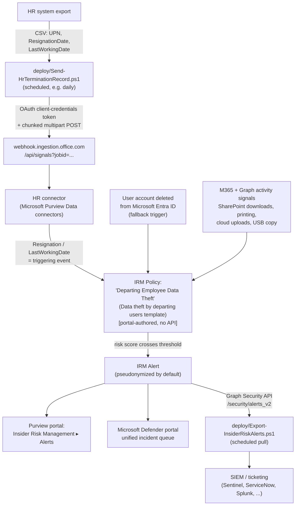

## 1. Problem statement

An employee who has resigned, been terminated, or is otherwise on their way out is
statistically the single highest-probability insider-exfiltration event most enterprises
face: legitimate access hasn't been revoked yet, motivation (a new employer, grievance, or
simple "these are my files") is at a peak, and the activity, downloading a SharePoint
library, copying a client list to a personal cloud drive, printing a source-code folder, 
looks identical to normal, permitted work until it's correlated against *who this user is and
when they're leaving*. No single-message, single-event control (DLP included) can make that
correlation; it requires a signal that spans days to weeks and combines an HR/identity event
with a behavioral pattern. That correlation is exactly what Microsoft Purview Insider Risk
Management's **Data theft by departing users** policy template is built to do.

This scenario deploys that template plus the automation that feeds and operationalizes it:
the HR resignation-date data feed, and a Graph-based alert export path for SOC integration.

## 2. Design goals

1. Start risk scoring for a user **before** their last working day, not after, the highest-
 value exfiltration window is the notice period, and a policy triggered only by account
 deletion (post-departure) misses it entirely.
2. Automate the parts of this template that have a genuinely scriptable, idempotent-safe
 surface, the HR-connector app registration bootstrap, and uploading HR resignation/
 termination data on a recurring schedule, rather than leaving them manual, easily-forgotten
 portal tasks.
3. Be explicit about what **cannot** be scripted. Unlike the DLP scenarios in this library,
 Insider Risk Management policy authoring, priority-user-group management, and role-group
 assignment have no PowerShell or Graph write surface as of this writing (`docs/
 automation-surface.md` §6, "IRM has limited PowerShell coverage; most policy authoring is
 portal-driven"). This scenario does not pretend otherwise: the README's step-by-step is
 portal-first for those pieces, with a config manifest as the single source of truth for
 what to enter, rather than a fabricated cmdlet.
4. Close the operational loop: once alerts exist, get them out of the Purview portal and into
 wherever the SOC actually works, via the Microsoft Graph security API, the one part of the
 *output* side that is genuinely automatable and Microsoft's own documented integration path.
5. Minimize the personal data footprint of the automation itself. The HR resignation CSV this
 scenario uploads carries only `UserPrincipalName`, `ResignationDate`, and `LastWorkingDate`
, not the optional employee-profile fields (name, home address) that a different HR
 scenario (job-level/performance data) would need. Least data in motion, least data at rest.

## 3. Why Insider Risk Management (not DLP alone) for this scenario

- **DLP** (see `scenarios/dlp/pci-teams-exfil-block/`) inspects and can block a single
 message or upload against a fixed rule, in real time, at the moment of transmission. It has
 no concept of "this user resigned nine days ago" and cannot correlate a SharePoint download
 today with a printed folder yesterday and a personal-Dropbox upload the day before, 
 each looks unremarkable in isolation.
- **Insider Risk Management** is purpose-built for exactly that correlation: it ingests
 Microsoft 365 and Microsoft Graph activity signals plus an HR/identity **triggering event**,
 scores **risk indicators** over a rolling **activation window** (30 days by default, with up
 to 90 days of retrospective lookback from the triggering event), and raises an alert when
 the pattern, not a single event, crosses a threshold.
- The two are complementary, not competing: this scenario's design doc for the DLP PCI/Teams
 template already flagged split-message and cumulative exfiltration as a residual risk it
 couldn't close alone, and pointed here. This scenario is that follow-on: IRM's **cumulative
 exfiltration** and **sequence detection** risk factors are exactly the cross-event
 correlation a single-message DLP rule structurally cannot provide.
- **Adaptive Protection** (`scenarios/adaptive-protection/dynamic-risk-dlp-enforcement/`,
 planned next in `PROGRESS.md`) is the natural next step after this scenario: it consumes the
 risk *level* this policy produces and uses it to dynamically tighten DLP/label enforcement
 for that specific user, without a human in the loop for the first response. Out of scope
 here, this scenario ends at detection and alerting, not automated enforcement.

## 4. Policy architecture (what's deployed where)

**What this scenario's code deploys vs. what stays portal-only:**

| Component | Mechanism | Scriptable? |
|---|---|---|
| HR resignation data feed | `deploy/Send-HrTerminationRecord.ps1` → HR connector ingestion webhook | **Yes**, this scenario's code |
| Entra app registration for the HR connector (create/rotate/clean up) | `deploy/Register-HrConnectorApp.ps1` and `deploy/Remove-HrConnectorAppSecret.ps1` → `Microsoft.Graph.Applications` (`New-MgApplication`/`New-MgServicePrincipal`/`Add-MgApplicationPassword`/`Remove-MgApplicationPassword`) | **Yes**, a follow-up fragment resolved this: no HR-connector-*specific* cmdlet exists, but none is needed, because Step 2's requirement is a plain, permission-free app registration that generic Graph cmdlets cover completely (README §5 Step 2); a second follow-up added the matching secret-cleanup script (§6) |
| HR connector object itself | Purview portal → Settings → Data connectors → Add connector → HR | No, portal-only, one-time |
| IRM policy (template, indicators, thresholds, users in scope) | Purview portal → Insider Risk Management → Policies | No, portal-only; `deploy/policy/departing-employee-policy-manifest.json` documents the intended configuration as a **reference for the person doing the portal steps**, not an API payload |
| Priority user group (optional, see §6) | Purview portal → Insider Risk Management → Settings → Priority user groups | No, portal-only |
| Role group membership (who can administer/investigate) | Purview portal → Settings → Roles and groups | No, portal-only; see README §3 for the specific role groups |
| Alert export to SIEM/ticketing | `deploy/Export-InsiderRiskAlerts.ps1` → Microsoft Graph Security API | **Yes**, this scenario's code |

This mixed profile is the honest shape of this module today, not a shortfall of this
scenario's build, see the Microsoft Product Owner review in `reviews.md` for the explicit
check against [Automation surface](/docs/automation-surface/).

## 5. Data flow / where scoring happens

Risk scoring runs entirely inside the Insider Risk Management service, driven by the
Microsoft 365 unified audit log and Microsoft Graph activity signals it already ingests for
every E5-licensed tenant, correlated against the **triggering event** (HR resignation/
termination date, or `User account deleted from Microsoft Entra ID` as a fallback). Identities
are **pseudonymized by default** in the alerts UI until an investigator with the appropriate
role is explicitly granted unmasking rights, this scenario does not change or disable that
default.

**Timing note carried into `README.md` §11:** the HR connector import is not real-time. The
documented pattern (`import-hr-data`) is a scheduled batch upload (Microsoft's own guidance
recommends daily); risk scoring for a given resignation record begins once that record is
ingested, not the moment HR enters it into the source system. A same-day script run (this
scenario's default `Send-HrTerminationRecord.ps1` schedule) keeps that lag to at most one
run cycle, see Operations §8 in the README for the recommended cadence.

## 6. Key decisions

| Decision | Choice | Rationale |
|---|---|---|
| Policy template | **Data theft by departing users** (not the more general **Data leaks** template) | Purpose-built for this exact scenario: it's the only template whose triggering event is the resignation/termination signal itself, and it pre-selects exfiltration-focused risk indicators rather than requiring the buyer to hand-pick them from the general pool. |
| Triggering event | HR connector resignation/termination date, **with** `User account deleted from Microsoft Entra ID` also enabled as a fallback | Microsoft's own guidance treats the HR connector as optional for this template specifically *because* of this fallback, but the fallback alone only fires at account deletion, typically the *end* of the risk window, not the start. This scenario treats the HR connector as the primary signal and the Entra fallback as a safety net for any departure the HR feed missed (e.g., immediate termination with no advance CSV entry), not a substitute. |
| Priority user group | Not deployed by default; scenario documents how to add one | A departing employee with elevated data access (finance, engineering with source access, an executive) should also be a priority user, which sharpens alert severity, but making that decision requires the buyer's own access-tier mapping, which this scenario can't assume. README §8 (Operations & tuning) covers when/how to add it. |
| HR CSV data minimization | Only `UserPrincipalName`, `ResignationDate`, `LastWorkingDate` | The Employee resignation CSV schema supports only these three columns (per `import-hr-data`); this scenario does not use the separate, optional Employee profile connector (name/address/department), which this template doesn't require. |
| HR connector auth | Client secret (`appSecret`), **not** the certificate-based app-only pattern used everywhere else in this repo ([Automation surface §3](/docs/automation-surface/#3-authentication-patterns-interactive-vs-unattended)) | Microsoft's own documented HR-connector ingestion sample script (`import-hr-data` Step 4, GitHub `m365-compliance-connector-sample-scripts`) authenticates via OAuth 2.0 client-credentials with an application ID + secret against `login.windows.net`; no certificate-credential variant of this specific ingestion flow is documented. This is a deliberate, cited deviation, not an oversight, mitigated in README §3/§11 with short secret-rotation guidance, a hard requirement to store the secret in a vault (never in this repo or on disk in plaintext), and a single-purpose app registration with **no Microsoft Graph API permissions granted**, so a leaked secret can only submit HR resignation records, not read tenant data (Red Team finding, `reviews.md`). |
| App registration creation | `deploy/Register-HrConnectorApp.ps1` (generic `Microsoft.Graph.Applications` cmdlets), interactive delegated auth (`Application.ReadWrite.All`) | Not this repo's usual app-only certificate pattern, deliberately: this is a one-time (or rarely-run, for rotation) bootstrap task performed by a human admin, not a scheduled unattended job. A standing app-only credential empowered to create other app registrations and mint their secrets would be a materially higher-value target than the interactive session this task actually needs. Idempotent by display-name lookup; `-RotateSecret` adds a secret without duplicating the app. |
| Superseded-secret cleanup | `deploy/Remove-HrConnectorAppSecret.ps1 -RemoveExpired` (`Remove-MgApplicationPassword`), same interactive delegated auth | `-RotateSecret` above only ever adds a secret, Microsoft Entra applications support multiple concurrent client secrets by design, so nothing deletes the superseded one automatically. This script closes that gap as a separate, explicit step (not folded into `-RotateSecret` itself) so an operator can confirm the new secret works in production before retiring the old one, rather than the rotation script assuming that's already true. `-RemoveExpired` only ever targets already-dead credentials, so it can never reduce the app's working secret count; the separate `-KeyId`/`-Force` path exists for the rarer case of force-retiring a still-valid secret (e.g. suspected exposure). |
| Alert export mechanism | Microsoft Graph Security API `/security/alerts_v2`, filtered client-side on `detectionSource eq 'microsoftInsiderRiskManagement'` | This is Microsoft's own documented integration path for getting IRM alert data into a SIEM (`irm-investigate-alerts-defender`). Client-side filtering (not server-side `$filter`) is used deliberately, see README §11 for why. |
| Case/investigation actions (assign, escalate to eDiscovery, resolve) | Out of scope, left to the Purview/Defender portal | No Graph write surface for IRM case management was found and grounded during this build; scripting alert *triage* would risk fabricating an unverified API. Read-only export is the safe, grounded automation boundary. Once a case *is* manually escalated, `scenarios/insider-risk/irm-case-escalation-to-ediscovery/` picks up from there (provenance linkage + custodian/hold reconciliation on the resulting eDiscovery case), still no API for the escalation click itself. |

## 7. Non-goals

- This scenario does not configure **Adaptive Protection** (risk-based dynamic DLP/label
 enforcement), that consumes this policy's output and is `scenarios/adaptive-protection/
 dynamic-risk-dlp-enforcement/` (planned, next in `PROGRESS.md`).
- This scenario does not configure the **Security policy violations by departing users**
 template (a related but distinct template requiring Microsoft Defender for Endpoint
 integration), that's a candidate follow-up fragment, not this one.
- This scenario does not configure **forensic evidence capture** (video/screen capture on
 flagged devices), a licensed add-on this template can optionally use; noted as a possible
 enhancement in README §11, not deployed here.
- This scenario does not automate priority-user-group membership, role-group assignment, or
 case/alert triage, all portal-only actions with no grounded scriptable surface (§6).
