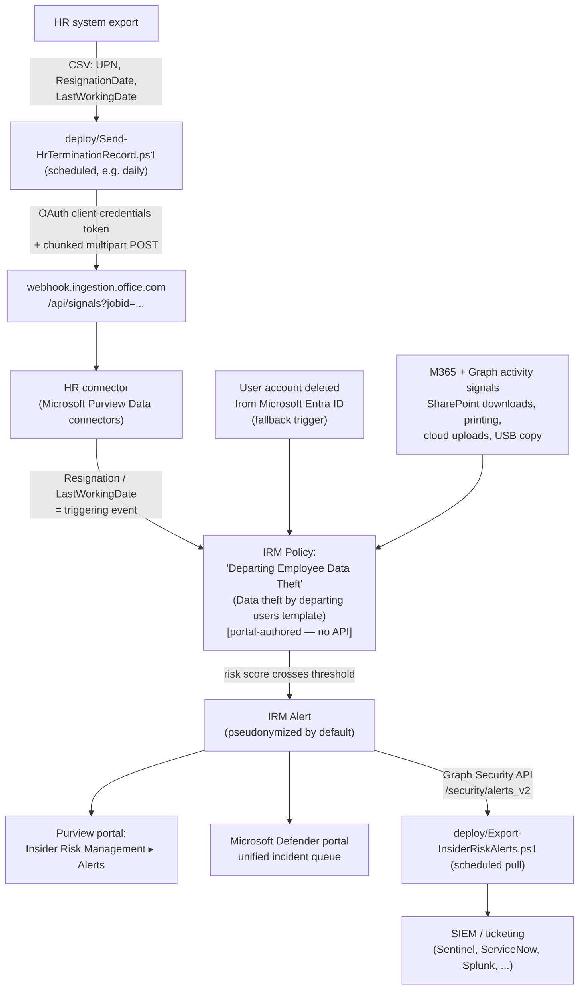

## 1. Scenario summary

Deploys Microsoft Purview Insider Risk Management's **Data theft by departing users** policy
template, fed by an automated daily HR resignation-date data upload, to detect and alert on
exfiltration-pattern activity (mass SharePoint/OneDrive downloads, printing, USB copying,
uploads to personal cloud storage) by employees who have resigned or been terminated — during
the highest-risk window: the notice period, before access is revoked. Generated alerts are
exportable via the Microsoft Graph security API for SIEM/ticketing integration.

**Who it's for:** any Microsoft 365 E5 (or equivalent add-on) tenant with an HR system that can
export resignation/termination dates, that wants a *behavioral, cross-event* detection control
for departing-employee data theft — complementing, not replacing, point controls like DLP
([`dlp/pci-teams-exfil-block`](/scenarios/dlp/pci-teams-exfil-block/)) that can only evaluate one message or upload at a time.

## 2. Business/regulatory driver

Departing employees are one of the highest-frequency, highest-impact insider-risk scenarios in
practice: legitimate access typically remains active through the last working day, and the
activity that constitutes theft (downloading a client list, a source-code repository, a deal
pipeline) is often indistinguishable from ordinary work *unless* it's correlated against
employment status and volume/pattern. No regulation names "insider risk management" as a
required control the way PCI DSS names messaging-technology PAN protection, but this control
supports several drivers a buyer's compliance program will already be tracking:

- **Trade secret / IP protection** and **contractual confidentiality obligations** — the
  business rationale most buyers lead with; this is the technical control that lets a company
  demonstrate it had a monitoring program in place, which matters materially in trade-secret
  litigation (misappropriation claims commonly turn on whether "reasonable measures" to protect
  the secret existed).
- **SOC 2 / ISO 27001 access-and-termination control expectations** — auditors under both
  frameworks look for evidence of monitoring around personnel changes, not just an offboarding
  checklist; this scenario is that evidence for the "monitoring" half.
- **GDPR / data-protection accountability** — if a departing employee exfiltrates a customer
  database, the resulting breach-notification and accountability obligations fall on the
  employer regardless of the individual's culpability; early detection shortens the window
  between exfiltration and containment.
- **Insurance / cyber-liability underwriting** — insider-risk monitoring is an increasingly
  common underwriting question for cyber policies; this scenario is concrete evidence for that
  questionnaire.

## 3. Prerequisites

Full licensing detail and citations: `docs/licensing-matrix.md` §2 (Insider Risk Management
row) and §3 (add-on SKUs). Summary for this scenario:

| Requirement | Minimum | Notes |
|---|---|---|
| Insider Risk Management (all policies) | **Microsoft 365 E5/A5/G5**, **Microsoft Purview Suite**, or the **Microsoft 365 E5 Insider Risk Management** add-on | Cloud/GenAI indicators on non-M365 destinations (Box, Dropbox, Google Drive, Amazon S3, Azure) bill separately as **PAYG** (Data Security processing unit/day) [[1]](#references) |
| Role to configure policies/settings | **Insider Risk Management** or **Insider Risk Management Admins** role group | See §6 below and `docs/rbac-model.md` §4 — narrower **Analyst**/**Investigator**/**Auditor** groups exist for day-2 operation without policy-authoring rights [[2]](#references) |
| Role to create the HR connector | **Data Connector Admin** role | Included by default in both role groups above [[3]](#references) |
| Microsoft 365 audit log | Enabled (default for most tenants) | Insider Risk Management scoring depends on it; confirm it hasn't been explicitly disabled [[4]](#references) |
| HR data source | Any system that can export **UserPrincipalName, ResignationDate, LastWorkingDate** to CSV | This scenario's `deploy/Send-HrTerminationRecord.ps1` uploads the CSV — it does not connect to or extract from the HR system itself |
| Entra app registration for the HR connector | App registration + client secret | Scripted — `deploy/Register-HrConnectorApp.ps1`, idempotent, `-WhatIf`-capable; see §5 step 2 below. No special Entra role is needed to run it unless the tenant has disabled self-service app registration, in which case the operator needs the **Application Developer** role — `docs/rbac-model.md` §11 [[5]](#references) |
| Automation identity for alert export | App registration with the Microsoft Graph **`SecurityAlert.Read.All`** application permission, certificate-based (this repo's default pattern) | See `docs/automation-surface.md` §3; this is a *separate* app registration from the HR connector one above — different surface, different credential type [[6]](#references) |
| Device onboarding (optional) | Required only if device indicators (USB copy, printing, network-share transfer) are enabled | Same onboarding prerequisite as [`dlp/endpoint-dlp-usb-block`](/scenarios/dlp/endpoint-dlp-usb-block/) — see that scenario's README §3 |

> **HR-connector app registration hygiene:** the Entra app `deploy/Register-HrConnectorApp.ps1`
> creates in Step 2 below is **single-purpose by construction** — it grants no Microsoft Graph
> API permissions at all; the app only needs the HR-connector ingestion webhook's own OAuth
> resource (§11). Scoping it this way bounds the blast radius of a leaked client secret to "can
> submit HR resignation records," not "can read tenant data."
> `validate/Test-HrConnectorAppRegistration.ps1` checks this stays true on every run, not just
> at creation time. Rotate the secret on a fixed cadence (e.g. every 90 days,
> `Register-HrConnectorApp.ps1 -RotateSecret`) rather than leaving it valid indefinitely — see
> `reviews.md`, Red Team lens.

> Verify current entitlement names against `docs/licensing-matrix.md` and the Product Terms
> before a sales commitment — SKU names change.

## 4. Architecture



Full rule-by-rule rationale, including exactly what this scenario can and cannot script, is in
`design.md` §4–6.

## 5. Step-by-step implementation

This scenario is **portal-first for policy authoring** (§6 explains why) and **script-first for
the two pieces that have a real automation surface**: the HR data feed and alert export.

### Step 1 — Assign permissions

Purview portal → **Settings** → **Roles and groups** → **Role groups** → add the
administrators who will configure this policy to **Insider Risk Management** or **Insider Risk
Management Admins** [[2]](#references). Confirm the Microsoft 365 audit log is enabled
(**Purview** → **Audit** → confirm status, or `docs/rbac-model.md` §6 for the underlying
`Search-UnifiedAuditLog` dependency) [[4]](#references).

### Step 2 — Register the Entra app for the HR connector (scripted, idempotent)

Microsoft's own HR-connector guide cites only the generic "Register an application" quickstart
for this step — no HR-connector-specific cmdlet exists, because none is needed: the requirement
is a plain, permission-free app registration [[3]](#references)[[5]](#references).
`deploy/Register-HrConnectorApp.ps1` scripts that generic sequence (`New-MgApplication` →
`New-MgServicePrincipal` → `Add-MgApplicationPassword`) instead of leaving it a manual portal
task, and deliberately grants **no** Microsoft Graph API permission — see the callout below.

```powershell
Connect-MgGraph -Scopes 'Application.ReadWrite.All'

# Dry run — reports whether a new app would be created or an existing one reused, calls nothing
./deploy/Register-HrConnectorApp.ps1 -WhatIf

# Real run — creates the app, its service principal, and a 3-month client secret
$hrApp = ./deploy/Register-HrConnectorApp.ps1
```

Record `$hrApp.AppId` (the **Application (client) ID** for Step 3) and `$hrApp.TenantId`. Store
`$hrApp.ClientSecret` (a `SecureString`) in a vault immediately — it is passed to
`deploy/Send-HrTerminationRecord.ps1` as `-AppSecret`, never written to disk, and Microsoft
Entra ID never shows the plaintext value again after this run. Re-run with `-RotateSecret` at
the ~90-day rotation point (§3, §11) rather than creating a second app registration.

Once the new secret from a `-RotateSecret` run is confirmed working in
`Send-HrTerminationRecord.ps1`'s scheduled task, remove the superseded secret it left behind —
`-RotateSecret` adds a secret, it never deletes one (§11):

```powershell
# Dry run — lists which already-expired secrets would be deleted, calls nothing
./deploy/Remove-HrConnectorAppSecret.ps1 -RemoveExpired -WhatIf

# Delete every already-expired secret on the app
./deploy/Remove-HrConnectorAppSecret.ps1 -RemoveExpired
```

`validate/Test-HrConnectorAppRegistration.ps1` warns if an already-expired secret is still
present, as a recurring nudge to run this cleanup.

### Step 3 — Create the HR connector

Purview portal → **Settings** → **Data connectors** → **My connectors** → **Add connector** →
**HR (preview)**. Provide the Entra **Application ID** from Step 2, select the **Employee
resignation** HR scenario, and map the CSV columns (`UserPrincipalName`, `ResignationDate`,
`LastWorkingDate`) [[3]](#references). Record the **Job ID** shown on the confirmation page —
this is the `-JobId` parameter for Step 4.

### Step 4 — Upload resignation data (scripted, dry-run capable)

```powershell
$secret = Read-Host -AsSecureString -Prompt 'HR connector app secret'

# Dry run — validates the CSV schema and reports the upload plan, sends nothing
./deploy/Send-HrTerminationRecord.ps1 `
    -TenantId $TenantId -AppId $AppId -AppSecret $secret -JobId $JobId `
    -CsvPath './employee_resignations.csv' -WhatIf

# Real upload
./deploy/Send-HrTerminationRecord.ps1 `
    -TenantId $TenantId -AppId $AppId -AppSecret $secret -JobId $JobId `
    -CsvPath './employee_resignations.csv'
```

Schedule this to run daily against a freshly exported CSV (Task Scheduler, cron, or a CI
pipeline) — see §8 for cadence guidance and §11 for the propagation-lag tradeoff of any less
frequent a schedule.

### Step 5 — Create the Insider Risk Management policy (portal, not scriptable)

Purview portal → **Insider Risk Management** → **Policies** → **Create policy**:

1. Template: **Data theft by departing users**.
2. Name: `Departing Employee Data Theft`. **The template and name can't be changed after policy
   creation** [[7]](#references) — confirm before continuing.
3. **Users and groups**: select **All users** (or a scoped subset per your organization's
   structure).
4. **Triggering events**: enable both the **HR connector** resignation signal (now fed by Step
   4) **and** the **User account deleted from Microsoft Entra ID** fallback [[1]](#references)
   — see `design.md` §6 for why both, not either.
5. **Content priorities** (optional but recommended): select the tenant's confidential/highly-
   confidential sensitivity labels so matching activity scores higher [[9]](#references).
6. **Indicators**: accept the template's pre-selected exfiltration indicators (SharePoint/
   OneDrive downloads, printing, USB copy, personal-cloud uploads); enable the **cloud
   indicators** for Box/Dropbox/Google Drive/Amazon S3/Azure if the tenant has Defender for
   Cloud Apps connected [[1]](#references).
7. **Detection options**: enable **sequence detection** and **cumulative exfiltration
   detection**; apply Microsoft-provided default thresholds on first deployment
   [[9]](#references)[[10]](#references).
8. **Review and submit.**

Use `deploy/policy/departing-employee-policy-manifest.json` as the checklist/reference while
completing this workflow — it is not consumed by any API (see the file's own `_comment` field
and `design.md` §4).

### Step 6 — Export alerts for SIEM/ticketing integration (scripted, read-only)

```powershell
Connect-MgGraph -ClientId $AppId -TenantId $TenantId -CertificateThumbprint $Thumbprint

# Dry run — shows the query plan, calls nothing
./deploy/Export-InsiderRiskAlerts.ps1 -WhatIf

# Pull the last 24 hours of Insider-Risk-Management-sourced alerts to a file a SIEM polls
./deploy/Export-InsiderRiskAlerts.ps1 -SinceDateTime (Get-Date).AddDays(-1) -OutputPath ./irm-alerts.json
```

### Step 7 — Validate

```powershell
Connect-MgGraph -Scopes 'Application.Read.All'
./validate/Test-HrConnectorAppRegistration.ps1

Connect-MgGraph -ClientId $AppId -TenantId $TenantId -CertificateThumbprint $Thumbprint
./validate/Test-DepartingEmployeeIrmSetup.ps1 -CsvPath './employee_resignations.csv'
```

## 6. Configuration reference

| Setting | Value this scenario uses | Notes |
|---|---|---|
| Policy template | `Data theft by departing users` | Cannot be changed after creation [[7]](#references) |
| Primary triggering event | HR connector — Employee resignation (`ResignationDate`, `LastWorkingDate`) | Fed by `deploy/Send-HrTerminationRecord.ps1` |
| Fallback triggering event | `User account deleted from Microsoft Entra ID` | Enabled explicitly, not relied on alone — `design.md` §6 |
| Activation window | 30 days (Microsoft default) | Configurable in Insider Risk Management global settings; not overridden by this scenario |
| Retrospective lookback | Up to 90 days from the triggering event (10 days for Exchange Online signals) | Microsoft-fixed limit, not configurable per policy [[11]](#references) |
| Priority user group | None by default | See §8 for when to add one; limit is 10,000 users per group [[8]](#references) |
| Indicator categories enabled | Office (SharePoint/OneDrive download/sync/share), Device (USB copy, browser upload, print, network-share transfer), Cloud (Box/Dropbox/Google Drive/Amazon S3/Azure) | Device indicators require device onboarding; cloud indicators require Defender for Cloud Apps and bill as PAYG [[1]](#references) |
| Detection options | Sequence detection + cumulative exfiltration detection, Microsoft-default thresholds | `design.md` §6; do not hand-tune before one full activation-window cycle of baseline data (§8) |
| User-identity privacy | Pseudonymized (Microsoft default) | Not disabled by this scenario — see `reviews.md`, CISO lens |
| Alert export mechanism | Microsoft Graph `GET /security/alerts_v2`, filtered client-side on `detectionSource eq 'microsoftInsiderRiskManagement'` | Server-side `$filter` does **not** support `detectionSource` — see §11 |
| HR CSV schema | `UserPrincipalName`, `ResignationDate`, `LastWorkingDate` (ISO 8601) | Minimal Employee resignation schema — this scenario does not use the Employee profile connector's additional PII fields [[3]](#references) |
| HR upload chunk size | ≤500 data rows per file (documented ingestion limit) | `deploy/Send-HrTerminationRecord.ps1 -ChunkSize` (default 500) [[3]](#references) |

## 7. Validation / how to prove it works

1. **App registration hygiene** — `./validate/Test-HrConnectorAppRegistration.ps1` confirms the
   HR-connector app registration exists, its service principal exists, its client secret isn't
   expired (warns inside 30 days of expiry), and — the check that matters most — that it still
   holds **no** Microsoft Graph API permission, so the single-purpose scoping README.md §3
   documents hasn't silently drifted. Exits non-zero on a hard failure.
2. **Automated checks** — `./validate/Test-DepartingEmployeeIrmSetup.ps1 -CsvPath
   './employee_resignations.csv'` confirms the Graph session and `SecurityAlert.Read.All`
   permission actually work (not just that they were requested) and that the resignation CSV
   schema is correct. Exits non-zero on a hard failure.
3. **Manual checklist** — the same script prints a checklist for everything that has no API to
   query (policy existence/template/state, HR connector import log, role-group membership,
   priority-user-group currency) — see `design.md` §6 for why these can't be automated.
4. **End-to-end functional test (non-production names only)** — in a pilot tenant: add a test
   account's `UserPrincipalName` to a resignation CSV with a near-term `ResignationDate`, run
   `Send-HrTerminationRecord.ps1`, confirm the Purview portal's HR connector log shows
   `RecordsSaved: 1`, then from that test account perform a few of the configured indicator
   activities (e.g., download several files from a SharePoint library, copy a file to USB if
   device indicators are enabled). Confirm an alert appears in **Insider Risk Management** →
   **Alerts** within the activation window, and that `Export-InsiderRiskAlerts.ps1` retrieves it.
5. **Evidence trail** — the alert's **Activity explorer** tab shows the specific indicator
   events that contributed to the score, which is the artifact an auditor or investigator would
   review [[12]](#references).

## 8. Operations & tuning

**HR data feed cadence:** run `deploy/Send-HrTerminationRecord.ps1` **daily** at minimum,
matching Microsoft's own recommended pattern for this connector [[3]](#references). A less
frequent schedule directly widens the gap between an employee's resignation being recorded by
HR and the policy beginning to score their activity — see §11.

**KPIs to watch (first 90 days):**
- **Alert volume vs. departing-employee headcount** — trend alerts generated against the
  count of resignation records ingested in the same period. A near-zero rate across a
  meaningful sample size after 90 days is itself a signal — either the indicators/thresholds
  need tuning, or genuine departing-employee exfiltration risk in this tenant is lower than
  typical (worth confirming, not assuming).
- **Alert-to-case conversion rate** — how many alerts investigators escalate to a formal case.
  A very low rate alongside high alert volume suggests threshold tuning is needed before
  analyst fatigue sets in.
- **HR connector import success rate** — check the connector's log (§7) on the same cadence as
  the upload schedule; a silent upload failure (bad CSV, expired app secret, blocked firewall
  rule for `webhook.ingestion.office.com`) means the policy is *not* scoring new departures
  even though it looks configured correctly in the portal.
- **Time-to-alert from resignation date** — for a true positive, how long between the
  resignation record's ingestion and the first alert. This is the metric that most directly
  measures whether this scenario is closing the notice-period risk window it exists for.

**This control is only as good as HR's data discipline — and that failure mode is invisible by
default.** A technically healthy HR connector (green import log, no script errors) still
produces zero coverage for any departure HR simply never puts in the export — there is no
"expected N departures this month, saw M" negative-space check this scenario can compute on its
own, because it has no independent source of truth for who is actually leaving. Treat "confirm
the departing-employee export ran" as a line item in the org's HR/IT offboarding SOP, not solely
a technical monitoring problem — see `reviews.md`, CISO lens.

**When to add a priority user group:** if alert triage volume makes it hard to prioritize,
identify roles with elevated data access (finance, engineering with source-code access,
executives) and create a priority user group (§6, `insider-risk-management-settings-priority-
user-groups` [[8]](#references)) — this sharpens alert severity for departing users in those
roles without a second policy.

**Incident-response runbook (alert triage):**
1. **Triage** — open the alert in Insider Risk Management → Alerts (or the Defender portal
   unified incident queue, if integrated per §12). Review the **Activity explorer** tab for the
   specific indicator events and their volume.
2. **Classify** — is the pattern consistent with normal end-of-employment activity (returning
   personal files, closing out projects) or does volume/destination suggest exfiltration
   (bulk download immediately followed by a personal-cloud upload, printing far above the
   user's baseline)? Content preview (where supported — §11) can help without opening a full
   case.
3. **Escalate if warranted** — assign the alert/case to an Investigator; Insider Risk
   Management cases can escalate directly to eDiscovery (Premium) for legal hold and further
   investigation if the pattern indicates genuine misappropriation. See
   [`insider-risk/irm-case-escalation-to-ediscovery`](/scenarios/insider-risk/irm-case-escalation-to-ediscovery/) for the scripted follow-through
   (provenance linkage + custodian/hold reconciliation) once that portal escalation step is done.
4. **Coordinate with HR/Legal/IT offboarding** — this policy is a detection control, not an
   offboarding-automation control; a true-positive finding should trigger the org's standard
   incident and (if the person hasn't yet departed) accelerated access-revocation process.
5. **Document** — case outcomes are retained per the tenant's audit-log/case retention
   settings; do not delete case records as part of closing them out.

**Review cadence:** review indicator/threshold configuration quarterly, using the KPIs above;
review HR connector health (import success) on the same cadence as the upload schedule itself
(daily automated check via `validate/Test-DepartingEmployeeIrmSetup.ps1`'s manual-checklist
prompts, or wire the connector's log into the same SIEM `Export-InsiderRiskAlerts.ps1` feeds).

## 9. Rollback / decommission

See `rollback.md` for the full staged procedure (pause → disable feed → permanent removal).
Quick reference: pausing the policy or the HR connector in the portal is reversible in seconds;
deleting the policy, connector, or the HR-connector app registration's client secret is not.

## 10. Cost & licensing notes

- **Base cost is the E5-tier entitlement** (or add-on) already covered in `docs/
  licensing-matrix.md` — if the tenant is already E5 for other Purview controls in this
  library, this scenario adds no incremental per-user cost.
- **PAYG applies only if cloud indicators for non-M365 destinations are enabled** (Box,
  Dropbox, Google Drive, Amazon S3, Azure) — billed as **Data Security processing units/day**
  [[1]](#references). Office/device indicators on M365 signals are covered by the base
  entitlement with no PAYG component.
- **No additional cost for the HR connector or Graph alert export** — both are included
  capabilities of the base entitlement; the only infrastructure cost is wherever the buyer
  schedules the two PowerShell scripts (a lightweight, low-frequency scheduled task — no
  meaningful compute cost).
- **Sizing note:** license scope should match who is *scored*, not just who administers the
  policy — every user in the policy's scope (§6, default "All users") needs the qualifying
  entitlement, which for most enterprise buyers targeting this control means org-wide E5, not
  a narrow subset (contrast with [`dlp/pci-teams-exfil-block`](/scenarios/dlp/pci-teams-exfil-block/), which scopes licensing
  to a narrow user population).

## 11. Known limitations & gotchas

- **HR data feed lag.** Risk scoring for a resignation begins when the HR connector *ingests*
  the record, not when HR enters it in the source system. This scenario's daily-upload
  recommendation (§8) bounds that lag to at most one run cycle — a less frequent schedule
  directly widens the highest-risk window this scenario exists to cover. `design.md` §5.
- **The Entra-account-deletion fallback trigger fires late.** Account deletion typically
  happens *at or after* the last working day — near the end, not the start, of the realistic
  exfiltration risk window. Treat it strictly as a safety net for departures the HR feed
  missed, not a substitute for a well-fed HR connector. `design.md` §6.
- **Retrospective lookback is capped at 90 days before the triggering event.** Risk scoring
  looks backward from the resignation/deletion signal, but only up to 90 days (10 days for
  Exchange Online signals specifically) [[11]](#references). An employee who exfiltrates data
  and then continues in the role for more than 90 days before eventually resigning will have
  that earlier activity fall completely outside the lookback window — it is never scored, by
  design, not as a bug. This is a hard, Microsoft-fixed limit this scenario cannot configure
  around; it is the boundary of what a resignation-triggered template can ever catch, not a
  gap specific to this deployment.
- **No PowerShell or Graph write API for policy authoring.** As of this writing, Insider Risk
  Management policies, priority user groups, and role-group assignment are portal-only — this
  library does not fabricate a cmdlet for them. `docs/automation-surface.md` §6;
  `design.md` §4/§6.
- **Graph `$filter` does not support `detectionSource`.** `deploy/Export-InsiderRiskAlerts.ps1`
  filters Insider-Risk-Management-sourced alerts **client-side** after a server-side pull
  scoped only by date/severity — a wider date range therefore means a larger client-side pull
  before filtering. Don't assume a `detectionSource eq '...'` server `$filter` clause will work;
  it will return an unsupported-filter error [[13]](#references)[[14]](#references).
- **`Export-InsiderRiskAlerts.ps1` has no run-to-run state (cursor).** Each run pulls
  everything since `-SinceDateTime` (default: 7 days ago) — running it on a schedule with the
  default window will re-export alerts the previous run already exported. This script
  deliberately stays stateless (no local database/cursor file) rather than adding that
  complexity to a single scenario's automation; the two supported ways to avoid duplicate
  downstream tickets are (a) narrow `-SinceDateTime` to slightly more than the schedule
  interval (e.g. 25 hours for a daily run) and accept a small overlap, or (b) dedupe
  downstream in the SIEM/ticketing system on the alert `Id` field, which is stable across
  repeated exports. Most SIEM ingestion pipelines already dedupe on a unique ID for exactly
  this reason — treat this as the expected integration pattern, not a defect to fix in-script.
- **HR connector re-upload/idempotency behavior is undocumented.** Microsoft does not document
  whether re-uploading an unchanged CSV (e.g., the same resignation record on consecutive
  scheduled runs) is a safe no-op or creates a duplicate signal. **VERIFY in a pilot tenant**
  before relying on the daily-schedule pattern in production — see `design.md` §6 and the
  script's own `.NOTES` block.
- **Client-secret auth for the HR connector, not this repo's usual certificate pattern.**
  Microsoft's own documented HR-connector ingestion flow uses OAuth 2.0 client-credentials
  with an application secret, not a certificate — a deliberate, cited exception to this
  library's certificate-first default (`docs/automation-surface.md` §3). Store the secret in a
  vault and rotate it on a short cycle; `Send-HrTerminationRecord.ps1` never persists it to disk.
- **`Register-HrConnectorApp.ps1 -RotateSecret` adds a secret, it doesn't replace one.** Microsoft
  Entra applications support multiple concurrent client secrets by design — running with
  `-RotateSecret` issues a new one alongside any existing (even expired) ones. Once the new
  secret is confirmed working in `Send-HrTerminationRecord.ps1`'s scheduled task, remove the
  superseded one with `deploy/Remove-HrConnectorAppSecret.ps1 -RemoveExpired` (Entra admin center,
  or `Remove-MgApplicationPassword` directly, both still work too) — the *timing* of when the new
  secret is confirmed working is still a judgment call this scenario won't guess at for you, but
  the cleanup step itself is scripted, idempotent, and `-WhatIf`-capable rather than a manual
  Entra admin center task [[20]](#references)[[22]](#references).
- **Data risk graph is being retired November 24, 2026.** If a walkthrough or screenshot in a
  demo references the visual "data risk graph" investigation view, note that Microsoft has
  announced its retirement — don't build a workflow around it for a new deployment
  [[15]](#references).
- **This scenario does not configure Adaptive Protection.** Alerts here are detection-only;
  automatically tightening DLP/label enforcement for a flagged user is a separate, planned
  scenario ([`adaptive-protection/dynamic-risk-dlp-enforcement`](/scenarios/adaptive-protection/dynamic-risk-dlp-enforcement/)) — `design.md` §7.
- **Content preview coverage is partial.** Content preview (early triage without opening a
  case) supports SharePoint/OneDrive/Exchange activities but explicitly does **not** support
  endpoint activities (USB transfer, printing, file deletion) or browser/removable-media
  events — exactly the device-indicator categories this template relies on most for the
  "walked out with it" scenario. Investigators will need the full case workflow for those,
  not just Activity explorer preview [[12]](#references).

## 12. References

1. Learn about Insider Risk Management policy templates (Data theft by departing users, cloud indicators, PAYG) — <https://learn.microsoft.com/purview/insider-risk-management-policy-templates>
2. Assign permissions in Insider Risk Management (role groups, Data Connector Admin inclusion) — <https://learn.microsoft.com/purview/insider-risk-management-permissions>
3. Set up a connector to import HR data (CSV schema, app registration, webhook, 500-row limit, sample script) — <https://learn.microsoft.com/purview/import-hr-data>
4. Get started with Insider Risk Management (Step 1 permissions, Step 2 audit log) — <https://learn.microsoft.com/purview/insider-risk-management-configure>
5. Register an application with the Microsoft identity platform — <https://learn.microsoft.com/azure/active-directory/develop/quickstart-register-app>
6. Microsoft Graph permissions reference (`SecurityAlert.Read.All`) — <https://learn.microsoft.com/graph/permissions-reference>
7. Create and manage Insider Risk Management policies (template/name immutable after creation) — <https://learn.microsoft.com/purview/insider-risk-management-policies>
8. Prioritize user groups for Insider Risk Management policies (10,000-user limit) — <https://learn.microsoft.com/purview/insider-risk-management-settings-priority-user-groups>
9. Configure policy indicators in Insider Risk Management — <https://learn.microsoft.com/purview/insider-risk-management-settings-policy-indicators>
10. Investigate Microsoft Purview Insider Risk Management activities (sequence detection, spotlight, content preview) — <https://learn.microsoft.com/purview/insider-risk-management-activities>
11. Limits in Insider Risk Management (lookback periods, trigger volume limits) — <https://learn.microsoft.com/purview/insider-risk-management-limits>
12. Investigate Microsoft Purview Insider Risk Management activities — content preview supported/unsupported activities — <https://learn.microsoft.com/purview/insider-risk-management-activities#standard-alert-dashboard>
13. List alerts_v2 (supported `$filter` properties) — <https://learn.microsoft.com/graph/api/security-list-alerts_v2>
14. alert resource type and detectionSource enum (`microsoftInsiderRiskManagement` member) — <https://learn.microsoft.com/graph/api/resources/security-alert>, <https://learn.microsoft.com/graph/api/resources/security-detectionsource>
15. Data risk graph in Insider Risk Management (retirement date November 24, 2026) — <https://learn.microsoft.com/purview/insider-risk-management-data-risk-graph>
16. Investigate insider risk threats in the Microsoft Defender portal (Graph Security API integration path, Incidents/Alerts/Advanced hunting) — <https://learn.microsoft.com/defender-xdr/irm-investigate-alerts-defender>
17. Microsoft Purview service description — Insider Risk Management licensing table — <https://learn.microsoft.com/office365/servicedescriptions/microsoft-365-service-descriptions/microsoft-365-tenantlevel-services-licensing-guidance/microsoft-purview-service-description>
18. Plan for Insider Risk Management (per-template prerequisites) — <https://learn.microsoft.com/purview/insider-risk-management-plan>
19. New-MgApplication, Get-MgApplication, New-MgServicePrincipal, Add-MgApplicationPassword, Remove-MgApplication, Remove-MgServicePrincipal (Microsoft.Graph.Applications PowerShell reference) — <https://learn.microsoft.com/powershell/module/microsoft.graph.applications/new-mgapplication>, <https://learn.microsoft.com/powershell/module/microsoft.graph.applications/new-mgserviceprincipal>, <https://learn.microsoft.com/powershell/module/microsoft.graph.applications/add-mgapplicationpassword>
20. Add and manage application credentials in Microsoft Entra ID (multiple concurrent client secrets are supported; a secret's plaintext value is shown only once) — <https://learn.microsoft.com/entra/identity-platform/how-to-add-credentials>
21. Delegate app registration permissions in Microsoft Entra ID (default "Users can register applications" behavior; Application Developer / Application Administrator / Cloud Application Administrator roles) — <https://learn.microsoft.com/entra/identity/role-based-access-control/delegate-app-roles>
22. Remove-MgApplicationPassword (Microsoft.Graph.Applications, v1.0; `-ApplicationId` aliased `ObjectId`) and the underlying `application: removePassword` Graph REST action — <https://learn.microsoft.com/powershell/module/microsoft.graph.applications/remove-mgapplicationpassword>, <https://learn.microsoft.com/graph/api/application-removepassword>

> Re-verify all links, cmdlet/API behavior, and licensing terms against current Microsoft Learn
> before a customer-facing assessment or sale — this module changes faster than most in the
> Purview portfolio (several referenced features are marked preview or scheduled for retirement).
