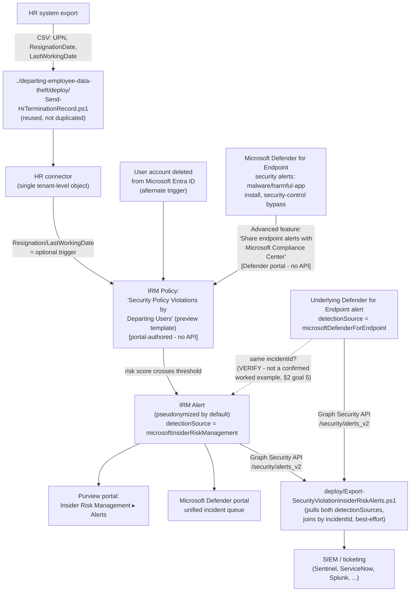

## 1. Problem statement

`scenarios/insider-risk/departing-employee-data-theft/` scores a departing user's *data-handling*
activity (downloads, printing, cloud uploads) against exfiltration indicators. It has a blind
spot by design: a departing user who tampers with their own device's security controls, 
disabling antivirus, installing an unapproved remote-access tool, side-loading unsigned software
, during the notice period generates no signal in that template at all, because Data theft by
departing users doesn't consume Microsoft Defender for Endpoint alerts. That gap is exactly what
this scenario's template, **Security policy violations by departing users**, closes: it takes the
same HR resignation/termination (or Entra account-deletion) triggering event as its sibling, but
scores it against **Microsoft Defender for Endpoint security alerts** instead of Microsoft 365
content-activity signals.

Microsoft designates this entire template family, the scenario heading itself reads
"Intentional or unintentional security policy violations **(preview)**", as **preview**, and the
underlying Defender for Endpoint indicator category is separately labeled "Microsoft Defender for
Endpoint indicators **(preview)**" [[1]](README.md#references) (full citations in README.md §12).
This scenario is explicit about that status throughout, preview features can change behavior or
availability without the same notice as GA features.

## 2. Design goals

1. **Reuse, don't duplicate, the HR data feed.** Microsoft's own policy-health reference groups
   *Data theft by departing user*, *Security policy violations by departing user*, *Data leaks by
   risky users*, and *Security policy violations by risky users* together as templates that share
   the same HR-connector dependency [[2]](README.md#references), the tenant configures **one** HR
   connector object, and any policy template that accepts an HR-connector trigger can consume it.
   If `departing-employee-data-theft` is already deployed, its `deploy/Send-HrTerminationRecord.ps1`
   and the HR connector it feeds already satisfy this template's optional trigger, this scenario
   does not ship a second copy of that script. `AGENTS.md`'s "don't add abstractions beyond what
   the task requires" applies directly here: a second HR ingestion script would be pure duplication
   of already-reviewed, already-grounded code.
2. **Be explicit about the one genuinely new prerequisite:** an active Microsoft Defender for
   Endpoint subscription, plus the Defender-portal-side "Share endpoint alerts with Microsoft
   Compliance Center" advanced feature, a *different* admin surface (Defender, not Purview/EXO)
   than any other Insider Risk Management scenario in this library requires. `README.md` §3
   documents the cost implication: a tenant already on full **Microsoft 365 E5** gets Defender for
   Endpoint **Plan 2** bundled at no incremental cost [[3]](README.md#references); a tenant that
   reached IRM's E5-equivalent entitlement via a narrower add-on (e.g., the standalone
   **Microsoft 365 E5 Insider Risk Management** add-on) does **not** get Defender for Endpoint for
   free and must budget for it separately, a genuine cost difference from the sibling scenario
   that this design flags rather than glossing over.
3. **Don't fabricate a policy-authoring or advanced-features API.** As with the sibling scenario,
   Insider Risk Management policy authoring has no PowerShell/Graph write surface
   (`docs/automation-surface.md` §6). This build additionally searched for a documented Graph or
   PowerShell surface for the Defender for Endpoint "Advanced features" toggle set (which includes
   "Share endpoint alerts with Microsoft Compliance Center") and found none, Microsoft's own
   procedure for every advanced feature on that page is the Microsoft Defender portal UI only
   (`Settings > Endpoints > Advanced features`). Both configuration surfaces stay portal-only in
   this scenario's README, not guessed at.
4. **Ship the one export capability this template's specific correlation model makes genuinely
   possible: joining the resulting Insider Risk Management alert back to the Defender for Endpoint
   alert that triggered it.** The sibling scenario's `Export-InsiderRiskAlerts.ps1` exports a bare
   IRM alert with no further context. Because this template's triggering signal is itself a Graph
   Security API alert (a Defender for Endpoint alert, `detectionSource =
   microsoftDefenderForEndpoint`) that Microsoft's Defender XDR alert-correlation engine can group
   into the same **incident** as the resulting IRM alert (`detectionSource =
   microsoftInsiderRiskManagement`) [[4]](README.md#references), this scenario's
   `deploy/Export-SecurityViolationInsiderRiskAlerts.ps1` attempts that `incidentId` join and
   attaches the underlying Defender for Endpoint alert's title/category/MITRE-technique detail to
   the exported record, giving an investigator the actual security violation (which malware,
   which disabled control) without a second portal lookup. This is new, scenario-specific value,
   not a copy of the sibling's export script.
5. **Disclose, not assume, the one part of goal 4 that isn't independently confirmed.** Microsoft
   documents that alerts are aggregated into a shared incident "with the same attack techniques or
   the same attacker" [[5]](README.md#references) and separately documents that Insider Risk
   Management alert data is "shared with Defender XDR unified alert queue"
   [[4]](README.md#references), but no worked example in Microsoft Learn was found during this
   build that shows a Defender for Endpoint alert and the Insider-Risk-Management alert it
   triggered explicitly sharing one `incidentId`. `design.md` §5 and the script's own `.NOTES`
   both flag this as a **VERIFY (pilot tenant)** item; the script degrades gracefully (a `[WARN]`,
   not a failure) when no correlated alert is found in the pulled batch, rather than assuming the
   join always succeeds.

## 3. Why this template (not just the sibling Data theft template) for this scenario

- **Different signal, same at-risk population.** A departing employee attempting to disable
  Defender for Endpoint, install a keylogger, or side-load unsigned remote-access software during
  their notice period is a materially different (and, for an IT/security-adjacent departing
  employee specifically, arguably higher-severity) risk than bulk file downloads, and one the
  sibling scenario's exfiltration-focused indicator set cannot see at all.
- **Not a replacement, a parallel policy.** Both templates can run simultaneously in scope of the
  same departing population, each scored against its own indicator set; deploying this scenario
  does not require removing or modifying `departing-employee-data-theft`'s policy. A tenant running
  both gets exfiltration coverage *and* device-tampering coverage for the same at-risk population,
  from the same underlying HR/Entra triggering event.
- **The other three "Security policy violations" family templates are out of scope here**, 
  *Security policy violations* (no HR/departure trigger at all, scores every onboarded user
  continuously), *…by priority users* (requires a priority user group), and *…by risky users*
  (requires HR performance-indicator or Communication Compliance signals, not termination dates), 
  are each a materially different scoping decision left to a future, separately-scoped fragment
  rather than folded in here. `README.md` §11.

## 4. Policy architecture (what's deployed where)

| Component | Mechanism | Scriptable? |
|---|---|---|
| HR resignation data feed | Reused from `departing-employee-data-theft/deploy/Send-HrTerminationRecord.ps1`, same connector, same script, no duplicate | **Yes**, reused, not re-shipped |
| Defender for Endpoint → Purview alert sharing | Microsoft Defender portal → Settings → Endpoints → Advanced features → "Share endpoint alerts with Microsoft Compliance Center" | No, portal-only; no Graph/PowerShell surface for MDE advanced features was found during this build |
| IRM Intelligent detections: which Defender for Endpoint alert triage statuses (Unknown/New/In progress/Resolved) to import | Purview portal → Insider Risk Management → Settings → Intelligent detections | No, portal-only |
| IRM policy (template, indicators, triggering events, users in scope) | Purview portal → Insider Risk Management → Policies | No, portal-only; `deploy/policy/security-policy-violations-departing-users-policy-manifest.json` is a reference, not an API payload, same pattern as the sibling scenario |
| Alert export (IRM alert + correlated Defender for Endpoint alert detail) | `deploy/Export-SecurityViolationInsiderRiskAlerts.ps1` → Microsoft Graph Security API | **Yes**, this scenario's own script |

## 5. Data flow / where scoring happens

Identical underlying mechanism to the sibling scenario (Insider Risk Management scoring against
the unified audit log and Graph activity signals, pseudonymized by default) with one addition:
Defender for Endpoint alerts flow into Insider Risk Management as a distinct indicator source,
gated by the "Share endpoint alerts with Microsoft Compliance Center" advanced feature and
filtered by the alert triage statuses selected in Intelligent detections
[[6]](README.md#references). Alerts from Defender for Endpoint are imported **daily**, and Microsoft
documents that the same underlying Defender for Endpoint alert can generate **multiple** Insider
Risk Management activity records as its triage status changes over time (New → In progress →
Resolved) [[6]](README.md#references), `README.md` §11 carries this forward as an
export-deduplication consideration, the same shape of issue the sibling scenario's `Id`-based
dedupe guidance already covers, but worth restating here because the *cause* (one Defender alert,
several IRM activity records) is specific to this template.

**The incident-correlation join (`Export-SecurityViolationInsiderRiskAlerts.ps1`) is
best-effort, not guaranteed.** See §2 goal 5 above, this is disclosed, not silently assumed, in
both the script's `.NOTES` and `README.md` §11.

## 6. Key decisions

| Decision | Choice | Rationale |
|---|---|---|
| Policy template | **Security policy violations by departing users** (not the base **Security policy violations** template, which has no departure trigger at all) | Purpose-built for this exact scenario: the only security-violation-family template whose triggering event is the same resignation/termination signal `departing-employee-data-theft` already uses. |
| HR data feed | Reused from the sibling scenario, not duplicated | Microsoft documents the HR connector as a single tenant-level object multiple policy templates can consume (§2 goal 1), shipping a second copy would be pure duplication of already-reviewed code, against `AGENTS.md`'s no-unneeded-abstraction guidance. |
| Whether to also deploy the base **Security policy violations** or **…by risky users** templates | Out of scope, left as a follow-up | Each has a materially different trigger/scoping model (continuous, priority-group, or performance-signal-driven) that deserves its own scoped fragment, not a bundled add-on to this one. `README.md` §11. |
| Alert export scope | Pull recent `alerts_v2` alerts with **both** `detectionSource` values (`microsoftInsiderRiskManagement` and `microsoftDefenderForEndpoint`) in one call, then join client-side by `incidentId` | The only way to attach the underlying Defender alert's detail without a second, separately-scoped Graph query per IRM alert, but see the disclosed VERIFY in §2 goal 5 on whether the join reliably fires. |
| Cross-policy-template disambiguation for exported alerts | Not attempted, documented as an open gap | The Graph `alert` resource's `alertPolicyId` field is populated "when there's a specific policy that generated the alert" [[7]](README.md#references), but Microsoft doesn't document how to map that GUID back to a named Purview IRM policy via any API, so a tenant running more than one "Security policy violations…" family template in parallel cannot programmatically tell which one produced a given exported alert. `README.md` §11 states this plainly rather than fabricating a lookup. |
| Preview-status disclosure | Called out in Prerequisites, Configuration reference, and Known limitations, not just once | Both the overall template family and its core Defender for Endpoint indicator category are explicitly labeled "(preview)" by Microsoft, material enough to a buyer's support-commitment expectations that repeating it once isn't enough (§11 pattern used elsewhere in this library for preview/retiring features, e.g. the sibling scenario's "data risk graph" retirement note). |

## 7. Non-goals

- This scenario does not deploy the base **Security policy violations**, **…by priority users**,
  or **…by risky users** templates, each is a candidate follow-up fragment with its own distinct
  trigger/scoping model, not a bundled extension of this one.
- This scenario does not configure Defender for Endpoint itself (device onboarding, antivirus
  policy, attack surface reduction), it assumes an already-operational Defender for Endpoint
  deployment and only adds the one Purview-facing integration toggle as a documented manual
  prerequisite.
- This scenario does not re-implement the HR resignation data feed, see §2 goal 1 and §6.
- This scenario does not attempt case/alert triage automation, same grounded boundary as the
  sibling scenario (`departing-employee-data-theft/design.md` §6): no Graph write surface for IRM
  case management was found during either build.
