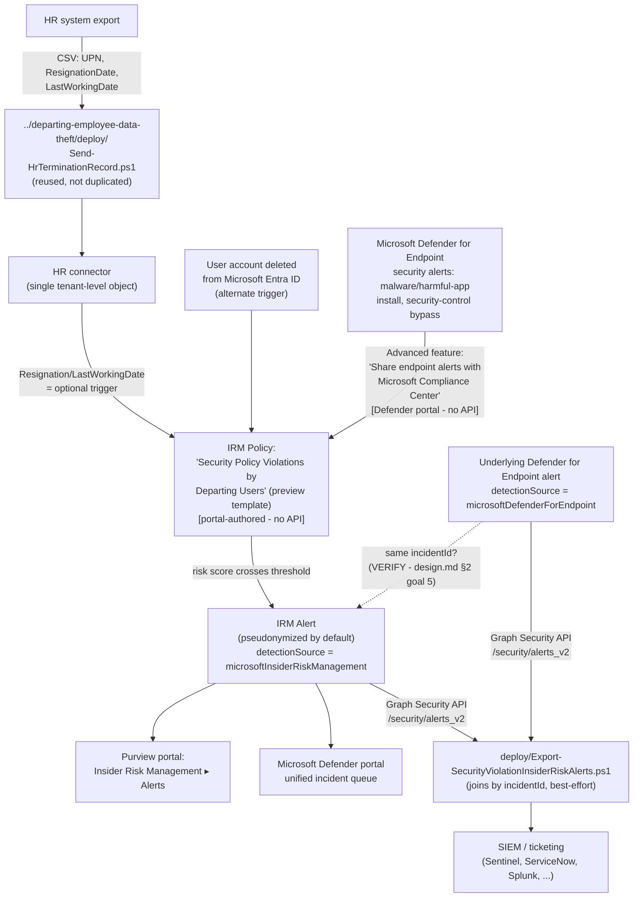

> **Preview feature.** Microsoft labels the "Security policy violations" template family — and its
> core Microsoft Defender for Endpoint indicator category — **(preview)** as of this writing
> [[1]](#references)[[9]](#references). Preview features can change or be withdrawn with less
> notice than GA capabilities; re-verify current status before a customer-facing commitment.

## 1. Scenario summary

Deploys Microsoft Purview Insider Risk Management's **Security policy violations by departing
users** policy template — a sibling of `scenarios/insider-risk/departing-employee-data-theft/`
that scores the same resignation/termination (or Entra account-deletion) triggering event against
a different signal: **Microsoft Defender for Endpoint security alerts** (malware or other
potentially harmful application installs, disabling device security features) instead of
Microsoft 365 content-activity signals. It reuses the sibling scenario's HR data feed rather than
duplicating it, and ships a Graph-based export script that joins the resulting Insider Risk
Management alert back to the underlying Defender for Endpoint alert that triggered it.

**Who it's for:** a tenant that has already deployed (or plans to deploy)
`departing-employee-data-theft` and also runs Microsoft Defender for Endpoint, and wants a second,
parallel detection lens on the same departing-employee population — one that catches device
tampering and unapproved-software installs, which the exfiltration-focused sibling template
cannot see at all.

## 2. Business/regulatory driver

An employee preparing to leave — especially one with IT, security, or engineering access — has
both motive and opportunity to weaken the endpoint controls protecting company data before they
go: disabling antivirus, installing a remote-access tool to retain access after departure, or
side-loading unsigned software to work around a data-handling restriction. None of that shows up
in an exfiltration-focused control; it shows up as a Defender for Endpoint security alert. This
scenario correlates that alert against employment status the same way its sibling correlates
SharePoint downloads against employment status, supporting the same class of drivers:

- **Endpoint-integrity assurance during offboarding** — closes a specific, common gap in
  standard offboarding checklists: a checklist confirms access was *revoked*, not that the
  *device* wasn't tampered with beforehand.
- **SOC 2 / ISO 27001 termination-control expectations** — the same audit evidence rationale as
  the sibling scenario (`departing-employee-data-theft/README.md` §2), extended to device
  integrity rather than data handling.
- **Incident-response cost avoidance** — a disabled endpoint control on a soon-to-depart user's
  device is exactly the kind of gap that turns a routine offboarding into a forensic
  investigation if discovered only after the fact.

No regulation names this specific control by requirement number — the same honest framing the
sibling scenario uses (§2 there).

## 3. Prerequisites

Full licensing detail and citations: `docs/licensing-matrix.md` §2 (Insider Risk Management row).
This scenario adds **one prerequisite the sibling scenario does not have**:

| Requirement | Minimum | Notes |
|---|---|---|
| Insider Risk Management (all policies) | **Microsoft 365 E5/A5/G5**, **Microsoft Purview Suite**, or the **Microsoft 365 E5 Insider Risk Management** add-on | Same base entitlement as every IRM scenario in this library [[2]](#references) |
| **Microsoft Defender for Endpoint** — active subscription | Microsoft's own prerequisite table for this template states only **"Active Microsoft Defender for Endpoint subscription"**, with no Plan 1/Plan 2 qualifier [[1]](#references) | **Cost-planning note:** a tenant already on full **Microsoft 365 E5** (or **Microsoft 365 E5 Security**) gets **Defender for Endpoint Plan 2** bundled at no incremental cost [[3]](#references) — but a tenant that reached IRM's E5-equivalent entitlement via the narrower **Microsoft 365 E5 Insider Risk Management** add-on does **not** get Defender for Endpoint for free and must budget for it as a separate line item. **VERIFY (pilot tenant or a future Microsoft Learn pass):** whether the specific security-violation indicators this template scores (malware/harmful-app installation, security-control tampering) require Defender for Endpoint **Plan 2**'s EDR sensor in practice, or whether Plan 1's next-gen antivirus/tamper-protection alerting is sufficient — Microsoft's prerequisite table for this template doesn't specify a plan, and this build found no page that does. |
| Defender for Endpoint → Purview alert sharing | "Share endpoint alerts with Microsoft Compliance Center" advanced feature, enabled in the Microsoft Defender portal | Portal-only toggle, no documented Graph/PowerShell equivalent — see §5 Step 2 [[4]](#references) |
| HR data source (optional trigger) | Same HR connector as `departing-employee-data-theft` — **reused, not a second connector** | If that scenario is already deployed, skip straight to this scenario's §5 Step 4; Microsoft documents the connector as a single tenant-level object multiple policy templates can consume [[5]](#references) |
| Role to configure policies/settings | **Insider Risk Management** or **Insider Risk Management Admins** role group | Same as the sibling scenario — `docs/rbac-model.md` §4 |
| Role to configure the Defender for Endpoint advanced feature | Microsoft Entra **Security Administrator** (basic permissions), or the granular **Manage security settings in Security Center** permission (legacy Defender for Endpoint RBAC) / **Core security settings (Manage)** permission (Defender unified RBAC) | Different admin surface than Purview RBAC — see `docs/rbac-model.md` §12 |
| Automation identity for alert export | App registration with the Microsoft Graph **`SecurityAlert.Read.All`** application permission, certificate-based | Identical to the sibling scenario's export script — the same app registration can be reused [[6]](#references) |

> Verify current entitlement names against `docs/licensing-matrix.md` and the Product Terms
> before a sales commitment — SKU names change, and this template is Microsoft-labeled preview.

## 4. Architecture



Full rule-by-rule rationale is in `design.md` §4–6.

## 5. Step-by-step implementation

### Step 1 — Assign permissions

Same as the sibling scenario's README §5 Step 1 (Purview role groups, audit log confirmation).
Additionally confirm the operator has a Defender for Endpoint role capable of changing advanced
features (Step 2 below) — typically **Security Administrator**, or the granular permission
`docs/rbac-model.md` §12 documents [[4]](#references).

### Step 2 — Enable the Defender for Endpoint → Purview alert-sharing feature (manual, one-time)

1. Sign in to the [Microsoft Defender portal](https://security.microsoft.com).
2. **Settings** → **Endpoints** → **Advanced features**.
3. Locate **Share endpoint alerts with Microsoft Compliance Center** and toggle it **On**.
4. Select **Save preferences** [[4]](#references).

This sends endpoint security alerts and their triage status to the Purview portal for
consumption by Insider Risk Management policies — it does not, by itself, create any policy or
send any alert data anywhere outside the tenant's own Microsoft 365/Defender data location
[[4]](#references). No Graph/PowerShell equivalent for this toggle was found during this build —
see `design.md` §2 goal 3.

### Step 3 — Configure which Defender for Endpoint alert triage statuses to import (recommended)

Purview portal → **Settings** → **Insider Risk Management** → **Intelligent detections** →
select one or more of **Unknown / New / In progress / Resolved**. Alerts import **daily**; the
same underlying Defender alert can generate multiple Insider Risk Management activity records as
its triage status changes if more than one status is selected [[6]](#references) — see §11.

### Step 4 — Confirm or configure the HR data feed (reused from the sibling scenario)

If `scenarios/insider-risk/departing-employee-data-theft/` is already deployed in this tenant,
its HR connector already satisfies this template's optional trigger — **skip to Step 5**.
Otherwise, follow that scenario's README.md §5 Steps 2–4 to register the connector app, create
the HR connector, and run `../departing-employee-data-theft/deploy/Send-HrTerminationRecord.ps1`
on a recurring schedule. This scenario does not ship a second copy of that script (`design.md`
§2 goal 1).

### Step 5 — Create the Insider Risk Management policy (portal, not scriptable)

Purview portal → **Insider Risk Management** → **Policies** → **Create policy**:

1. Template: **Security policy violations by departing users**.
2. Name: `Security Policy Violations by Departing Users`. The template and name can't be changed
   after policy creation [[7]](#references) — confirm before continuing.
3. **Users and groups**: select the same population as the sibling scenario's policy, or a
   subset — up to **15,000** users can be actively scored under this template
   [[8]](#references).
4. **Triggering events**: enable the HR connector resignation signal (Step 4) **and/or** **User
   account deleted from Microsoft Entra ID** — both are optional per Microsoft's own prerequisite
   table for this template (unlike the sibling's Data theft template, which lists the HR
   connector as its documented, if optional, primary trigger) [[1]](#references).
5. **Indicators**: select the **Microsoft Defender for Endpoint indicators (preview)** category.
   Microsoft's documentation does not enumerate the individual indicator names under this
   category (unlike, e.g., the Office/Device indicator lists the sibling scenario's manifest
   documents verbatim) — **VERIFY against the live policy-creation workflow at deploy time** which
   specific indicator toggles appear, and whether any other indicator categories (Office, Device,
   Cumulative exfiltration) are also selectable for this specific template; not confirmed by
   Microsoft Learn during this build.
6. **Review and submit.**

Use `deploy/policy/security-policy-violations-departing-users-policy-manifest.json` as the
checklist/reference while completing this workflow — it is not consumed by any API (see the
file's own `_comment` field and `design.md` §4).

### Step 6 — Export correlated alerts for SIEM/ticketing integration (scripted, read-only)

```powershell
Connect-MgGraph -ClientId $AppId -TenantId $TenantId -CertificateThumbprint $Thumbprint

# Dry run — shows the query plan, calls nothing
./deploy/Export-SecurityViolationInsiderRiskAlerts.ps1 -WhatIf

# Pull the last 24 hours of security-violation IRM alerts, joined to their Defender
# for Endpoint alert detail where a correlated incidentId is found
./deploy/Export-SecurityViolationInsiderRiskAlerts.ps1 -SinceDateTime (Get-Date).AddDays(-1) -OutputPath ./security-violation-alerts.json
```

### Step 7 — Validate

```powershell
./validate/Test-SecurityViolationIrmSetup.ps1
```

## 6. Configuration reference

| Setting | Value this scenario uses | Notes |
|---|---|---|
| Policy template | `Security policy violations by departing users` **(preview)** | Cannot be changed after creation [[7]](#references) |
| Triggering events | HR connector resignation/termination date **and/or** `User account deleted from Microsoft Entra ID` | Both optional per Microsoft's prerequisite table for this template — unlike the sibling scenario, neither is documented as the required primary [[1]](#references) |
| Indicator category | **Microsoft Defender for Endpoint indicators (preview)** | Individual indicator names not enumerated by Microsoft as of this writing — VERIFY at deploy time (§5 Step 5) |
| Maximum users in scope | 15,000 (Microsoft-fixed limit for this template) | [[8]](#references) — separate from, and larger than, the sibling Data theft template's 20,000 (not the same number; don't conflate the two limits) |
| Defender for Endpoint alert import cadence | Daily | Not configurable to a shorter interval [[6]](#references) |
| Defender alert triage statuses imported | Operator-selected in Intelligent detections (Unknown/New/In progress/Resolved) | Selecting more than one status can produce multiple IRM activity records per underlying Defender alert [[6]](#references) — §11 |
| User-identity privacy | Pseudonymized (Microsoft default) | Not disabled by this scenario |
| Alert export mechanism | Microsoft Graph `GET /security/alerts_v2`, pulling both `microsoftInsiderRiskManagement`- and `microsoftDefenderForEndpoint`-sourced alerts, joined client-side by `incidentId` | Server-side `$filter` does not support `detectionSource` or `incidentId` — see §11 |
| Cross-policy-template disambiguation | Not attempted | `alertPolicyId` is populated on exported alerts but Microsoft doesn't document a way to map it back to a named Purview policy via any API — §11 |

## 7. Validation / how to prove it works

1. **Automated checks** — `./validate/Test-SecurityViolationIrmSetup.ps1` confirms the Graph
   session and `SecurityAlert.Read.All` permission actually work. Exits non-zero on a hard
   failure.
2. **Manual checklist** — the same script prints a checklist for the portal-only configuration
   (policy existence/template/state, Defender for Endpoint advanced-feature toggle, Intelligent
   detections triage-status selection, role groups) — see `design.md` §4 for why these can't be
   automated.
3. **End-to-end functional test (non-production names only, pilot tenant)** — set a near-term
   resignation date for a test account (via the HR CSV or by deleting a disposable test account
   from Microsoft Entra ID), then on a device where that account is signed in and onboarded to
   Defender for Endpoint, trigger a benign Defender for Endpoint detection your test plan already
   uses (e.g., the standard [EICAR test file](https://learn.microsoft.com/defender-endpoint/attack-simulations) or a documented attack simulation) rather than
   actually disabling a security control. Confirm an alert appears in **Insider Risk Management**
   → **Alerts** within the activation window, and that
   `Export-SecurityViolationInsiderRiskAlerts.ps1` retrieves it.
4. **Evidence trail** — the alert's **Activity explorer** tab shows the specific Defender for
   Endpoint alert(s) that contributed to the score.

## 8. Operations & tuning

**This scenario's KPIs, HR-process-discipline dependency, and review cadence mirror the sibling
scenario's README §8 exactly** — re-read that section; it is not repeated here to avoid drift
between two copies of the same guidance. Two items are specific to this scenario:

- **Defender for Endpoint alert-sharing health.** If the "Your organization doesn't have a
  Microsoft Defender for Endpoint subscription" or "Microsoft Defender for Endpoint alerts aren't
  being shared with the Microsoft Purview portal" policy-health notifications appear
  [[9]](#references), this policy silently stops scoring new security-violation activity even
  though it looks correctly configured in the portal — treat checking policy health as a
  standing item in the same cadence as the HR connector import check (sibling README §8).
- **Incident-response runbook (alert triage)** — identical to the sibling scenario's runbook
  (README §8, numbered list) with one substitution at step 1 (Triage): review the exported
  record's `RelatedDefenderAlerts` field (populated when `Export-SecurityViolationInsiderRiskAlerts.ps1`
  found a correlated Defender for Endpoint alert in the same incident) for the specific security
  violation before deciding whether the pattern is normal end-of-employment device cleanup or
  genuine tampering.
- **Confirm at least one triggering event is actually enabled — this template makes both
  optional, unlike the sibling.** Because Microsoft's own prerequisite table lists the HR
  connector *and* the Entra-deletion signal as equally optional for this specific template (§5
  Step 5), a policy can be created with **neither** enabled — a silently non-functional
  configuration that produces no error at creation time. The only signal is Microsoft's own
  "Policy isn't assigning risk scores to activity" health message, which requires someone to
  notice it. `validate/Test-SecurityViolationIrmSetup.ps1`'s manual checklist includes this check
  explicitly — run it as part of initial deployment sign-off, not only ad hoc.
- **Preview status is a rollout-pacing decision, not just a documentation footnote.** Recommend
  piloting this scenario against a narrow user scope for at least one full activation-window
  cycle (30 days, the same default the sibling scenario uses) before recommending it as a
  permanent, tenant-wide control in a customer-facing commitment — a Microsoft-labeled preview
  capability can change behavior with less notice than a GA one, and a buyer's compliance/board
  narrative (§2) should account for that risk explicitly rather than treating this as
  production-equivalent to the GA sibling scenario.

## 9. Rollback / decommission

See `rollback.md`. Quick reference: pausing the policy or turning off the Defender-alert-sharing
feature is reversible in seconds; deleting the policy, or revoking the export app registration's
certificate, is not.

## 10. Cost & licensing notes

- **If the tenant is already on full Microsoft 365 E5 (or E5 Security) for other Purview/IRM
  controls in this library, this scenario adds no incremental license cost** — Defender for
  Endpoint Plan 2 is bundled [[3]](#references).
- **If IRM entitlement came from the narrower Microsoft 365 E5 Insider Risk Management add-on
  instead of full E5, Defender for Endpoint is a genuine incremental cost** — budget it
  separately; this is the one licensing difference between this scenario and its sibling that a
  CISO conversation should surface explicitly (`design.md` §2 goal 2).
- **No additional cost for the HR connector (reused) or the Graph alert export** — same as the
  sibling scenario.
- **Sizing note:** every user in this policy's scope needs both the qualifying IRM entitlement
  **and** to already be Defender-for-Endpoint-onboarded and licensed — a narrower practical
  population than the sibling scenario's "all users" default in many tenants, since Defender for
  Endpoint device licensing tracks devices/users separately from Purview.

## 11. Known limitations & gotchas

- **Preview feature, twice over.** Both the overall "Security policy violations" template family
  and the Defender for Endpoint indicator category it depends on are Microsoft-labeled
  **preview** [[1]](#references)[[9]](#references) — re-verify GA status before a customer-facing
  commitment; preview features can change behavior without the notice period Microsoft applies
  to GA changes.
- **No documented Graph/PowerShell surface for the Defender for Endpoint advanced-features
  toggle or for Intelligent detections' triage-status selection.** Both stay portal-only
  prerequisites in this scenario, not fabricated cmdlets — `design.md` §2 goal 3.
- **The `incidentId` join in `Export-SecurityViolationInsiderRiskAlerts.ps1` is best-effort, not
  guaranteed.** Microsoft documents general cross-product alert correlation into a shared
  incident and separately documents that IRM alert data reaches the same unified alert queue, but
  no worked example confirming this *specific* pairing (Defender for Endpoint alert →
  Insider-Risk-Management-generated alert) sharing one `incidentId` was found during this build.
  **VERIFY in a pilot tenant.** The script logs a `[WARN]`, not a failure, when no correlated
  alert is found — see the script's own `.NOTES` and `design.md` §5.
- **Cannot disambiguate which "Security policy violations…" template produced a given exported
  alert if more than one is deployed in the same tenant.** The Graph `alert` resource's
  `alertPolicyId` field is populated "when there's a specific policy that generated the alert,"
  but no documented API maps that GUID back to a named Purview policy. `design.md` §6.
- **One Defender for Endpoint alert can produce multiple IRM activity records.** If more than one
  triage status is selected in Intelligent detections (§5 Step 3), the same underlying alert
  generates a separate activity record per status transition [[6]](#references) — apply the same
  `Id`-based downstream dedupe guidance the sibling scenario's README §11 already documents for
  its own, differently-caused duplicate-export risk.
- **This scenario does not enumerate the exact Microsoft Defender for Endpoint indicator names**
  selectable in the policy workflow (§5 Step 5, §6) — not documented in a bullet list anywhere
  found in Microsoft Learn during this build, unlike the sibling scenario's Office/Device
  indicator lists. Confirm the live portal's options at deploy time.
- **This scenario does not configure the base Security policy violations, …by priority users, or
  …by risky users templates** — each is a candidate follow-up fragment, not bundled here.
  `design.md` §3/§7.
- **This scenario does not configure Adaptive Protection** — same non-goal as the sibling
  scenario (`departing-employee-data-theft/README.md` §11).
- **This control is invisible to an offline or physical attack on the endpoint itself.** Every
  indicator this template scores comes from the Defender for Endpoint sensor running on a live,
  online Windows/macOS session. A departing user who boots the device from external media,
  removes the storage drive, or otherwise operates outside the running OS the sensor monitors
  generates **no** alert here — this is a structural limit of an EDR-sourced signal, not a
  configuration gap this scenario can close. Pair with physical/device-encryption controls
  (BitLocker, device-loss procedures) for that risk, not with a tighter Insider Risk Management
  policy.
- **The "Share endpoint alerts with Microsoft Compliance Center" toggle is tenant-wide, not
  per-policy.** Enabling or disabling it (§5 Step 2) affects **every** "Security policy
  violations…" family policy in the tenant simultaneously, including any deployed independently
  of this scenario. An operator troubleshooting or reconfiguring a *different* Defender for
  Endpoint integration could disable this toggle for an unrelated reason and silently stop this
  policy from receiving new alerts — `rollback.md` Stage 2 flags this coupling for intentional
  rollback; it's worth the same attention as an unintended side effect during unrelated Defender
  for Endpoint administration.

## 12. References

1. Learn about Insider Risk Management policy templates — Security policy violations by departing users (description, prerequisites table, Defender for Endpoint requirement) — <https://learn.microsoft.com/purview/insider-risk-management-policy-templates#security-policy-violations-by-departing-users>
2. Create and manage Insider Risk Management policies — policy health (HR connector shared across Data theft by departing user / Security policy violations by departing user / Data leaks by risky users / Security policy violations by risky users) — <https://learn.microsoft.com/purview/insider-risk-management-policies#policy-health>
3. Microsoft Defender for Endpoint overview — Licensing (Microsoft 365 E5 and Microsoft 365 E5 Security include Defender for Endpoint Plan 2) — <https://learn.microsoft.com/defender-endpoint/microsoft-defender-endpoint#licensing>
4. Configure advanced features in Defender for Endpoint — "Share endpoint alerts with Microsoft Compliance Center" (portal steps, no API) — <https://learn.microsoft.com/defender-endpoint/advanced-features#share-endpoint-alerts-with-microsoft-compliance-center>
5. Create and manage Insider Risk Management policies — policy health ("HR connector isn't configured or working as expected," confirming the connector is a shared, reusable object across templates) — <https://learn.microsoft.com/purview/insider-risk-management-policies#policy-health>
6. Configure intelligent detections in Insider Risk Management — Microsoft Defender for Endpoint alert statuses (daily import cadence, multiple activity records per triage-status transition) — <https://learn.microsoft.com/purview/insider-risk-management-settings-intelligent-detections#microsoft-defender-for-endpoint-alert-statuses>
7. Create and manage Insider Risk Management policies (template/name immutable after creation) — <https://learn.microsoft.com/purview/insider-risk-management-policies>
8. Limits in Insider Risk Management — maximum users in scope per policy template (15,000 for this template) — <https://learn.microsoft.com/purview/insider-risk-management-limits#maximum-number-of-users-in-scope-for-a-policy-template>
9. Learn about Insider Risk Management — Scenarios ("Intentional or unintentional security policy violations (preview)") and Configure policy indicators — Microsoft Defender for Endpoint indicators (preview) — <https://learn.microsoft.com/purview/insider-risk-management#scenarios>, <https://learn.microsoft.com/purview/insider-risk-management-settings-policy-indicators#built-in-indicators-vs-custom-indicators>
10. alert resource type — `alertPolicyId`, `incidentId`, `detectionSource` properties — <https://learn.microsoft.com/graph/api/resources/security-alert>
11. detectionSource enum values (`microsoftInsiderRiskManagement`, `microsoftDefenderForEndpoint` members) — <https://learn.microsoft.com/graph/api/resources/security-detectionsource>
12. List alerts_v2 (supported `$filter` properties — `incidentId` and `detectionSource` are not among them) — <https://learn.microsoft.com/graph/api/security-list-alerts_v2>
13. Microsoft Graph permissions reference (`SecurityAlert.Read.All`) — <https://learn.microsoft.com/graph/permissions-reference>
14. Integrate insider risk management data with Microsoft Graph security API (Incidents/Alerts/Advanced hunting, alerts aggregated by attack technique/attacker into a shared incident) — <https://learn.microsoft.com/defender-xdr/irm-investigate-alerts-defender>
15. Plan for Insider Risk Management — policy template requirements (Security policy violation template: enable Defender for Endpoint integration) — <https://learn.microsoft.com/purview/insider-risk-management-plan#understand-requirements-and-dependencies>

> Re-verify all links, cmdlet/API behavior, and licensing terms against current Microsoft Learn
> before a customer-facing assessment or sale — this template family is explicitly Microsoft-
> labeled preview and could change materially before reaching general availability.
