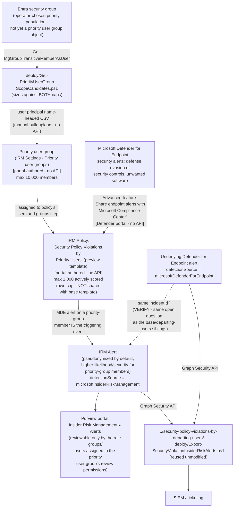

## 1. Problem statement

`scenarios/insider-risk/security-policy-violations/` (the base template) scores the same
Microsoft Defender for Endpoint security-violation signal against a population chosen once, at
policy-creation time, from a plain Entra security group, with no formal, auditable "this
population is elevated risk" object behind it, and no way to restrict who inside the Insider Risk
Management team can review that specific population's alerts separately from every other policy's
alerts. **Security policy violations by priority users** is the same triggering event and the same
indicator category, scored against a materially different population mechanism: a formal
**priority user group**, a named, Microsoft-managed object created in Insider Risk Management
settings, with its own bulk-membership workflow and its own reviewer-permission scoping
. This scenario deploys that template.

## 2. Design goals

1. **Get the population mechanism right, it is not "a bigger/smaller group," it is a different
 kind of object.** The base template scenario resolves a plain Entra security group with
 `Get-MgGroupTransitiveMemberAsUser` and adds it (or the individual users) directly to the
 policy's "Users and groups" step. This template instead requires the operator to first create a
 **priority user group** in **Insider Risk Management → Settings → Priority user groups**, add
 members to *that* object (by search/select, or a bulk CSV upload keyed on a `user principal
 name` column), and only then assign the priority user group, not
 a raw Entra group, to the policy. Conflating the two population mechanisms would misrepresent
 how this template actually works.
2. **Ship the one genuinely new, scriptable capability this template's population mechanism makes
 necessary: turning an existing Entra group into a correctly-formatted, correctly-sized
 candidate list for the priority-user-group bulk-upload workflow.** Because priority user groups
 have no documented Graph/PowerShell write API (this build searched specifically for one and
 found none, every procedure Microsoft documents for creating or populating a priority user
 group is the Purview portal UI), the only automatable piece of this template's setup is
 **preparing** the input to that manual upload: resolving an operator-chosen Entra group's
 transitive membership, deduping, filtering to enabled accounts, and formatting the result as a
 `user principal name`-headed CSV ready to paste into the portal's bulk-upload dialog, 
 `deploy/Get-PriorityUserGroupScopeCandidates.ps1`. This is new, scenario-specific value, not a
 copy of the base template's scope script, because the two scripts check the resolved population
 against **different caps** (§3) and produce output shaped for **different consumption paths** (a
 portal CSV upload here, versus a portal manual-add-group step there).
3. **Disclose, don't guess at, the interaction between this template's two independently-documented
 caps.** §3 below is the core of this design, Microsoft documents a 10,000-member ceiling on a
 priority user group itself, and, separately, a 1,000-actively-scored-user ceiling on this exact
 policy template, **its own, independently-tracked pool, confirmed (by a direct fetch of the same
 limits reference the base template scenario grounded, plus the
 Policy templates page's own "Policy template limits" section) to
 NOT be shared, cumulatively or otherwise, with the base template**, even though both document the
 identical number (1,000), an earlier draft of this design stated the two caps as shared, which
 this fragment's re-verification pass found incorrect (see `PROGRESS.md` "DONE"). No Microsoft
 Learn page found during this build states what happens when a priority user group larger than
 1,000 is assigned to a "…by priority users" policy, whether Microsoft scores the first 1,000 by
 some order, warns at assignment time, or something else. This design treats that gap (a
 *different* open question from the now-resolved shared/not-shared question above) as the single
 most consequential open question for anyone sizing this template's population, not a footnote.
4. **Reuse, don't duplicate, the alert-export script.** Identical reasoning to the base template
 scenario (`security-policy-violations/design.md` §2 goal 3): the sibling's
 `Export-SecurityViolationInsiderRiskAlerts.ps1` applies no policy- or template-specific filter,
 so it already works unmodified against this policy's own alerts. A third copy would be pure
 duplication.
5. **Surface the review-permission scoping feature as a genuine differentiator, not an
 afterthought.** Unlike the base template (and unlike a plain Entra group), a priority user
 group's own settings page lets an operator restrict *who* can review that specific population's
 users, alerts, cases, and reports, to one or more of the built-in Insider Risk Management role
 groups, or to a custom set of individual users, instead of leaving every priority population
 reviewable by every Insider Risk Management Analyst/Investigator in the tenant
. For a genuinely sensitive priority population (e.g., executives, an
 active internal investigation's subjects), this is a real least-privilege control this
 template's population mechanism provides and the base template's plain-group mechanism does not
, `README.md` §3 and §8 state this as a reason to choose this template over the base one for a
 sensitive-enough population, not just a byproduct of the setup steps.
6. **Don't fabricate a policy- or priority-group-authoring API.** As with every other Insider Risk
 Management scenario in this library, this build searched for a documented Graph/PowerShell write
 surface for both policy authoring and priority-user-group management specifically, and found
 neither ([Automation surface §6](/docs/automation-surface/#6-cicd-and-unattended-execution-guidance)). Both stay portal-only prerequisites in this scenario.

## 3. The two caps, and why their interaction is an open question

| Cap | Value | Scope | Source |
|---|---|---|---|
| Priority user group membership | **10,000** members | Per priority user group object | |
| "Security policy violations by priority users" actively-scored population | **1,000** users | Cumulative, tenant-wide, across **every** policy built from this exact template, an independently-tracked pool, confirmed **not** shared with the base template, which documents the identical number (1,000) as its own, separate cap | |

These are two different Microsoft-documented ceilings, checked against two different objects (the
priority user group itself, vs. the policy template's own scoring capacity), and this build found
no Microsoft Learn page that states how they interact when a priority user group larger than 1,000
is assigned to a policy built from this template. Two readings are both plausible from the
documented facts alone, and neither is confirmed:

- Microsoft silently scores only some subset of the group's members (order undocumented) and the
 rest sit in the group but are never actively evaluated, the same "policy performance reduces"
 degraded-not-failed pattern the base template scenario's own over-cap behavior already documents
 from the same limits reference, extended here without a confirmed
 worked example specific to this template.
- The portal surfaces a warning or blocks assignment of an over-sized group at policy-creation
 time, plausible, but not documented, and no worked example was found either way.

**This scenario does not guess between these two readings.** `deploy/
Get-PriorityUserGroupScopeCandidates.ps1` checks a candidate list against **both** caps
independently and reports whichever is smaller as the effective ceiling for planning purposes,
`README.md` §3/§6/§11 state the open question explicitly, and `validate/
Test-PriorityUserGroupIrmSetup.ps1`'s manual checklist includes confirming, at deploy time, what the
live portal actually does when a group approaches or exceeds 1,000 members. **VERIFY (pilot
tenant).**

## 4. Policy architecture (what's deployed where)

| Component | Mechanism | Scriptable? |
|---|---|---|
| Priority-group candidate resolution + dual-cap sizing | `deploy/Get-PriorityUserGroupScopeCandidates.ps1` → Microsoft Graph `GET /groups/{id}/transitiveMembers/microsoft.graph.user` | **Yes**, this scenario's own, genuinely new script; output is a CSV shaped for the manual upload step below |
| Priority user group creation + bulk member upload + reviewer-permission scoping | Purview portal → Insider Risk Management → Settings → Priority user groups → Create priority user group | No, portal-only; no documented Graph/PowerShell write surface was found for this object during this build |
| Defender for Endpoint → Purview alert sharing | Microsoft Defender portal → Settings → Endpoints → Advanced features | No, portal-only, identical mechanism to every sibling in this template family |
| IRM policy (template, indicators, priority-group assignment) | Purview portal → Insider Risk Management → Policies | No, portal-only; `deploy/policy/security-policy-violations-priority-users-policy-manifest.json` is a reference, not an API payload |
| Alert export | `../security-policy-violations-by-departing-users/deploy/Export-SecurityViolationInsiderRiskAlerts.ps1` → Microsoft Graph Security API | **Yes**, reused unmodified, not re-shipped |

## 5. Data flow / where scoring happens

Identical underlying scoring mechanism to the base template (a Defender for Endpoint
security-violation alert on an in-scope user is itself the triggering event, no separate
HR/Entra-deletion gate exists for this template family member either
), with one addition: Microsoft documents that membership in a priority
user group increases both the **likelihood** and the **severity** of resulting alerts for the same
underlying activity, compared to the same activity from a non-priority user
, the scoring model itself treats priority-group membership as a risk
multiplier, not merely a population filter. This is the functional reason to choose this template
over the base one for a genuinely higher-risk subset of users, beyond the reviewer-permission
scoping benefit in §2 goal 5.

## 6. Key decisions

| Decision | Choice | Rationale |
|---|---|---|
| Policy template | **Security policy violations by priority users** (not the base template) | Purpose-built for a population that should be scored more sensitively than the general population, with reviewer access restricted to a subset of the IRM team, neither of which the base template's plain-group mechanism provides. |
| Population mechanism | A **priority user group** (Settings → Priority user groups), populated via portal search/select or a `user principal name`-headed CSV bulk upload | The only population mechanism this template accepts, a plain Entra group, however resolved, cannot be assigned directly to a "…by priority users" policy the way it can to the base template. |
| Candidate-list preparation | `deploy/Get-PriorityUserGroupScopeCandidates.ps1` resolves an existing Entra group (already-maintained by whatever process governs it) into upload-ready CSV, rather than requiring manual, one-by-one portal search/select for a large population | Manual search/select does not scale past a handful of users; the documented CSV bulk-upload path does, and preparing correctly-formatted, correctly-sized input for it is the one genuinely scriptable piece of this template's setup. |
| Dual-cap sizing | Check candidates against **both** the 10,000-member priority-group cap and the 1,000-actively-scored template cap, report the smaller as the effective planning ceiling, and flag the undocumented interaction rather than assume one reading | Neither cap alone tells an operator what actually happens at assignment time, §3. Picking one reading to "make the script simpler" would misrepresent a genuine, disclosed unknown as a known behavior. |
| Alert export | Reuse the departing-users sibling's script unmodified | Same reasoning as the base template scenario (§2 goal 4), no policy- or template-specific filter exists in that script, so a third copy would be pure duplication. |
| Cross-policy-template disambiguation | Not attempted, same disclosed gap as every sibling in this family | Nothing about this template's own mechanism changes the underlying Graph `alertPolicyId`-to-named-policy mapping gap already documented in the base and departing-users scenarios. |
| Whether to also document the review-permission scoping feature | Documented in `README.md` §3 and §8 as a genuine reason to prefer this template for a sensitive population, not just a setup step to click through | It is a real, Microsoft-provided least-privilege control unique to this population mechanism among the four templates in this family, omitting it would undersell a real differentiator to a buyer evaluating which template fits their population. |

## 7. Non-goals

- This scenario does not deploy the base **Security policy violations**, **…by departing users**,
 or **…by risky users** templates, each has its own, already-built or separately-scoped fragment.
- This scenario does not configure Defender for Endpoint itself, and does not re-implement the
 reviewer-permission assignment as a script, both stay documented, portal-only prerequisites,
 identical in kind to every sibling scenario's own non-goals.
- This scenario does not attempt to programmatically create or populate the priority user group
 itself, no Graph/PowerShell write API for that object was found during this build; `deploy/
 Get-PriorityUserGroupScopeCandidates.ps1` prepares the CSV, it does not upload it.
- This scenario does not maintain the source Entra security group used as the candidate-list input
, group lifecycle is assumed to already be handled by whatever process governs that group, the
 same non-goal the base template scenario already states for its own source group.
- This scenario does not resolve the open dual-cap-interaction question in §3, it discloses it.
