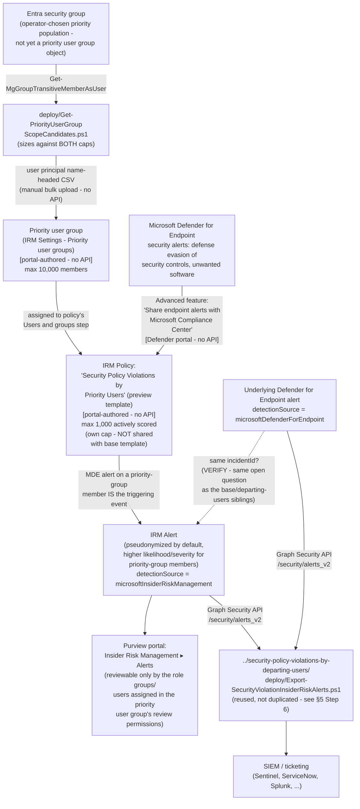

> **Preview feature.** Microsoft labels the "Security policy violations" template family — and its
> core Microsoft Defender for Endpoint indicator category — **(preview)** as of this writing
> [[1]](#references)[[7]](#references). Preview features can change or be withdrawn with less
> notice than GA capabilities; re-verify current status before a customer-facing commitment.

## 1. Scenario summary

Deploys Microsoft Purview Insider Risk Management's **Security policy violations by priority
users** policy template — a sibling of [`insider-risk/security-policy-violations`](/scenarios/insider-risk/security-policy-violations/) (the
base template) that scores the identical triggering event, **Microsoft Defender for Endpoint
security alerts** (malware/harmful-app installs, disabling or bypassing security controls), but
against a materially different population mechanism: a formal, Microsoft-managed **priority user
group** rather than a plain Entra security group. Priority-group membership also increases both
the likelihood and severity of the resulting alerts, and lets an operator restrict who on the
Insider Risk Management team can review that specific population's data — two capabilities the
base template's plain-group mechanism does not offer.

**Who it's for:** a tenant that runs Microsoft Defender for Endpoint and has (or wants) a formally
designated, higher-scrutiny population — executives, privileged administrators, employees on an
active internal investigation, or any group whose security-control tampering would carry
outsized consequences — and wants both a stronger scoring response and reviewer-access
restrictions that a plain group cannot provide. **This is not a "monitor everyone more closely"
control**: like the base template, Microsoft caps this template at **1,000** actively-scored users
tenant-wide, and a priority user group has its own, separately-documented 10,000-member ceiling —
§3 and `design.md` §3 explain why the interaction between those two numbers is a genuinely open
question, not a settled detail this scenario glosses over.

## 2. Business/regulatory driver

Some populations warrant a materially different scrutiny level than "everyone with elevated
access" — and a materially tighter circle of reviewers than "every Insider Risk Management
analyst in the tenant." A priority user group is Microsoft's purpose-built object for exactly that
combination:

- **Elevated-scrutiny monitoring for a formally designated population** — a named, auditable
  object (not an ad hoc group repurposed for this one policy) that a security/compliance program
  can point to directly when explaining who receives heightened scoring and why.
- **Reviewer-access minimization for sensitive populations** — restricting review of a specific
  priority group's alerts, cases, and reports to a named subset of role groups or individuals
  [[2]](#references) supports a genuine least-privilege/need-to-know posture for populations where
  broad IRM-team visibility (e.g., "every analyst can see the CFO's risk score") would itself be a
  privacy or governance concern.
- **SOC 2 / ISO 27001 endpoint-integrity monitoring evidence for a defined high-risk population** —
  the same audit-evidence rationale the base and departing-users sibling scenarios document
  (`security-policy-violations/README.md` §2), extended here to a population the organization has
  formally designated as higher-risk rather than one scoped ad hoc for this policy alone.

No regulation names this specific control by requirement number — the same honest framing this
library's other Insider Risk Management scenarios use.

## 3. Prerequisites

Full licensing detail and citations: `docs/licensing-matrix.md` §2 (Insider Risk Management row)
and §7 (Defender for Endpoint). This template's prerequisite set matches the base template's
(`security-policy-violations/README.md` §3) with **one substitution**: a priority user group in
place of a plain Entra group.

| Requirement | Minimum | Notes |
|---|---|---|
| Insider Risk Management (all policies) | **Microsoft 365 E5/A5/G5**, **Microsoft Purview Suite**, or the **Microsoft 365 E5 Insider Risk Management** add-on | Same base entitlement as every IRM scenario in this library |
| **Microsoft Defender for Endpoint** — active subscription | Microsoft's own prerequisite table for this template states only **"Active Microsoft Defender for Endpoint subscription,"** with no Plan 1/Plan 2 qualifier [[1]](#references) | Same open Plan 1/Plan 2 VERIFY the base and departing-users siblings already carry — not re-litigated here |
| Defender for Endpoint → Purview alert sharing | "Share endpoint alerts with Microsoft Compliance Center" advanced feature, enabled in the Microsoft Defender portal | Portal-only toggle, tenant-wide, shared with every other "Security policy violations…" family policy — §5 Step 2 [[3]](#references) |
| **Priority user group** — created and populated | Purview portal → Insider Risk Management → Settings → Priority user groups → **Create priority user group**; up to **10,000** members per group [[2]](#references) | Distinguishing prerequisite versus the base template — see §5 Step 3/4, `design.md` §2 goal 1. No HR connector and no Entra-deletion trigger, same as the base template. |
| Priority user group **reviewer-permission scoping** (recommended for sensitive populations) | Assign one or more of the **Insider Risk Management**, **Insider Risk Management Analysts**, **Insider Risk Management Investigators** role groups, or specific individual users, as the reviewers for this priority user group [[2]](#references) | Optional but recommended — without it, the group's data remains reviewable by whichever broader IRM role-group membership already applies tenant-wide; §8 |
| Role to configure policies/settings/priority user groups | **Insider Risk Management** or **Insider Risk Management Admins** role group | `docs/rbac-model.md` §4 — same role group governs both policy and priority-user-group configuration |
| Role to configure the Defender for Endpoint advanced feature | Microsoft Entra **Security Administrator** (basic permissions), or the granular **Manage security settings in Security Center** permission (legacy Defender for Endpoint RBAC) / **Core security settings (Manage)** permission (Defender unified RBAC) | `docs/rbac-model.md` §12 |
| Automation identity for candidate-list resolution | App registration with the Microsoft Graph **`GroupMember.Read.All`** application permission, certificate-based | Used by `deploy/Get-PriorityUserGroupScopeCandidates.ps1` — same permission and pattern as the base template's own scope script; the same app registration can be reused |
| Automation identity for alert export (optional, reused) | App registration with the Microsoft Graph **`SecurityAlert.Read.All`** application permission, certificate-based | Only needed if reusing `../security-policy-violations-by-departing-users/deploy/Export-SecurityViolationInsiderRiskAlerts.ps1` per §5 Step 6 — same identity every sibling in this family already uses |

> Verify current entitlement names against `docs/licensing-matrix.md` and the Product Terms before
> a sales commitment — SKU names change, and this template is Microsoft-labeled preview.

## 4. Architecture



Full rule-by-rule rationale is in `design.md` §4–6.

## 5. Step-by-step implementation

### Step 1 — Assign permissions

Confirm the operator is a member of **Insider Risk Management** or **Insider Risk Management
Admins** (Purview role group), and has a Defender for Endpoint role capable of changing advanced
features (Step 2 below) — typically **Security Administrator**, or the granular permission
`docs/rbac-model.md` §12 documents.

### Step 2 — Enable the Defender for Endpoint → Purview alert-sharing feature (manual, one-time)

Identical to the base and departing-users siblings' own Step 2 — **skip this step entirely if
either sibling is already deployed in this tenant**, since the toggle is tenant-wide, not
per-policy (`rollback.md` Stage 2 flags the same coupling here).

1. Sign in to the [Microsoft Defender portal](https://security.microsoft.com).
2. **Settings** → **Endpoints** → **Advanced features**.
3. Locate **Share endpoint alerts with Microsoft Compliance Center** and toggle it **On**.
4. Select **Save preferences** [[3]](#references).

### Step 3 — Resolve and size the priority-group candidate list (scripted, read-only)

Choose the Entra security group (or groups) whose membership should become the priority user
group's population, then resolve and size it against **both** documented caps before creating the
priority user group — see `design.md` §3 for why neither cap alone tells the full story.

```powershell
Connect-MgGraph -ClientId $AppId -TenantId $TenantId -CertificateThumbprint $Thumbprint

# Dry run — shows the query plan, calls nothing
./deploy/Get-PriorityUserGroupScopeCandidates.ps1 -GroupId $PrivilegedUsersGroupId -WhatIf

# Resolve one or more Entra security groups' transitive user membership, dedupe across groups,
# filter to enabled accounts, check against the 10,000-member group cap AND the 1,000-actively-
# scored template cap, and write a CSV ready for the portal's bulk-upload dialog
./deploy/Get-PriorityUserGroupScopeCandidates.ps1 -GroupId $ExecutivesGroupId -OutputPath ./priority-user-group-candidates.csv
```

This script is **read-only** — it never touches the IRM policy, the priority user group, or the
Entra group itself, only reads and reports (`design.md` §2 goal 2). It cannot account for users
already actively scored under **other** policies built from this same template elsewhere in the
tenant, and it cannot confirm what actually happens if the resulting priority user group exceeds
1,000 members once assigned to a policy — both are disclosed gaps, not silently assumed away; see
§11 and the script's own `.NOTES`.

### Step 4 — Create the priority user group (portal, not scriptable)

Purview portal → **Settings** → **Insider Risk Management** → **Priority user groups** →
**Create priority user group** [[2]](#references):

1. **Name and describe the priority user group**: enter a name and description, then **Next**.
2. **Choose members**: search and select users individually, **or** upload the CSV produced by
   Step 3 (a `user principal name`-headed file — confirm the exact expected column header and
   accepted file format against the live upload dialog at deploy time; **VERIFY**). Members must be
   resolvable, mail-enabled users in the directory — `Get-PriorityUserGroupScopeCandidates.ps1`
   flags candidates with no `mail` attribute as a `[WARN]`, an approximation for "mail-enabled,"
   not a guarantee (§11).
3. **Assign review permissions**: select which of the **Insider Risk Management**, **Insider Risk
   Management Analysts**, **Insider Risk Management Investigators** role groups — or which
   individual users — can review this priority group's users, alerts, cases, and reports
   [[2]](#references). Do this deliberately for a sensitive population rather than accepting
   whatever default reviewer scope applies — §8.
4. **Review and finish.**

### Step 5 — Create the Insider Risk Management policy (portal, not scriptable)

Purview portal → **Insider Risk Management** → **Policies** → **Create policy**:

1. Template: **Security policy violations by priority users**. Confirm this is the priority-users
   member of the family and not one of its three siblings (base / by departing users / by risky
   users) — all four share the same "Security policy violations…" naming prefix in the template
   picker.
2. Name: `Security Policy Violations by Priority Users`. The template and name can't be changed
   after policy creation [[4]](#references) — confirm before continuing.
3. **Users and groups**: assign the priority user group created in Step 4 as this policy's
   population. **VERIFY at deploy time** whether the "Users and groups" step for this specific
   template accepts *only* a priority user group, or additionally allows a plain Entra group or
   individual users alongside it (e.g., a broader base population plus a priority-boosted subset)
   — Microsoft's own policy-templates prerequisite table states that a priority user group must be
   assigned to this template [[1]](#references), but this build found no worked example or portal
   screenshot confirming whether that requirement is exclusive or additive. Do not assume either
   way; confirm against the live policy-creation workflow before finalizing scope. **Note on the UI
   control's exact name:** Microsoft's own "Get started" workflow guide names a distinct **"Add or
   edit priority user groups"** option on this page, but states in the same sentence that it
   "appears only if you choose the *Data leaks by priority users* template" [[13]](#references) —
   the sibling template that also requires a priority user group. That guide does not name an
   equivalent option for *this* template. Do not assume the "Add or edit priority user groups"
   label is what appears here; confirm the actual control name shown for this specific template at
   deploy time rather than reusing the sibling's confirmed UI text.
4. **Triggering events**: none to configure — identical to the base template, this template's only
   trigger is the Defender for Endpoint security-violation signal itself, already enabled by
   Step 2. There is no HR-connector or Entra-account-deletion toggle on this template's workflow.
5. **Indicators**: select the **Microsoft Defender for Endpoint indicators (preview)** category.
   As with every sibling in this family, Microsoft's documentation does not enumerate the
   individual indicator names under this category — **VERIFY against the live policy-creation
   workflow at deploy time** which specific indicator toggles appear, and whether any other
   indicator categories are also selectable for this specific template; not confirmed by Microsoft
   Learn during this build. **Separately, VERIFY whether "Risk score boosters" — specifically
   "User is a member of a priority user group," a booster Microsoft's Configure policy indicators
   reference documents generically, not scoped to any one template [[14]](#references) — is
   actually offered for a policy built from this template.** Microsoft's own "Get started" workflow
   guide ties Risk score booster availability to selecting "at least one Office or Device
   indicator" [[13]](#references), and this template's only selectable indicator category is
   **Microsoft Defender for Endpoint indicators (preview)** — a third, separately-documented
   category, distinct from both "Office" and "Device" indicators. No worked example was found
   either confirming or excluding booster availability for a Defender-for-Endpoint-only indicator
   selection; do not assume the priority-group scoring boost described in §6 is automatically
   applied without confirming this checkbox is actually visible and selected at deploy time.
6. **Review and submit.**

Use `deploy/policy/security-policy-violations-priority-users-policy-manifest.json` as the
checklist/reference while completing this workflow — it is not consumed by any API.

### Step 6 — Export correlated alerts for SIEM/ticketing integration (scripted, read-only, reused)

This scenario does not ship a third copy of the family's alert-export script — the base template
scenario already established that Microsoft Graph's `alerts_v2` query it needs applies no
policy-specific filter, so it works unmodified against this policy's own alerts too
(`design.md` §2 goal 4):

```powershell
Connect-MgGraph -ClientId $AppId -TenantId $TenantId -CertificateThumbprint $Thumbprint

../security-policy-violations-by-departing-users/deploy/Export-SecurityViolationInsiderRiskAlerts.ps1 `
    -SinceDateTime (Get-Date).AddDays(-1) -OutputPath ./security-violation-alerts.json
```

**Caveat carried over unchanged from every sibling in this family:** if more than one "Security
policy violations…" template is deployed in the same tenant, this export cannot tell which policy
produced a given alert — `alertPolicyId` is exported as raw, unmapped data (base template
`README.md` §11; not repeated in full here).

### Step 7 — Validate

```powershell
./validate/Test-PriorityUserGroupIrmSetup.ps1
```

## 6. Configuration reference

| Setting | Value this scenario uses | Notes |
|---|---|---|
| Policy template | `Security policy violations by priority users` **(preview)** | Cannot be changed after creation [[4]](#references) |
| Triggering event | Defense evasion of security controls or unwanted software, detected by Microsoft Defender for Endpoint | Not optional/configurable — identical to the base template; no HR/Entra-deletion toggle exists on this template either [[1]](#references) |
| Indicator category | **Microsoft Defender for Endpoint indicators (preview)** | Individual indicator names not enumerated by Microsoft as of this writing — VERIFY at deploy time (§5 Step 5) |
| Population mechanism | A **priority user group** (Settings → Priority user groups) is required for this template | Distinguishing prerequisite versus the base template — `design.md` §2 goal 1. Whether it can be combined with additional plain-group/individual scope on the same policy is unconfirmed — §5 Step 5. The exact **UI control name** used to assign it on this template's "Users and groups" page is also unconfirmed — Microsoft names "Add or edit priority user groups" only for the *Data leaks by priority users* sibling [[13]](#references) — §5 Step 3 |
| Maximum members in a priority user group | **10,000** (Microsoft-fixed limit per group) | [[2]](#references) |
| Maximum actively-scored users for this template | **1,000**, cumulative tenant-wide across all policies built from this exact template — **its own, independently-tracked pool, not shared with the base "Security policy violations" template** | [[6]](#references)[[13]](#references) — Microsoft's Policy template limits reference states the cap applies "across all policies using a given policy template" and lists each template as its own row; the base template happens to document the identical number (1,000), which is a coincidence of the two caps' size, not evidence of a shared pool — smaller than the departing-users (15,000) and risky-users (7,500) siblings' own, separately-tracked caps — do not conflate any of the four |
| Interaction between the two caps above | **Undocumented — VERIFY (pilot tenant)** | `design.md` §3; treated as an open question, not assumed either way. This is a *different* open question from the (now-confirmed) fact that the 1,000-user cap itself is not shared with the base template — see the row above |
| Priority-group effect on scoring | Increases both **likelihood** and **severity** of resulting alerts for the same underlying activity, versus a non-priority user | [[2]](#references) — the functional reason to choose this template over the base one, beyond population mechanism. Whether the separate "Risk score boosters" → "User is a member of a priority user group" checkbox (§5 Step 5) is additionally required, and whether it's even offered for this template's Defender-for-Endpoint-only indicator category, is a separate, unresolved **VERIFY** — do not conflate the two |
| Reviewer-permission scoping | Optional, per-priority-group restriction of who can review that group's alerts/cases/reports to specific role groups or individuals | [[2]](#references) — a capability the base template's plain-group mechanism does not offer; §8 |
| Defender for Endpoint alert-sharing dependency | "Share endpoint alerts with Microsoft Compliance Center" advanced feature (tenant-wide) | Same portal-only mechanism as every sibling — §5 Step 2 |
| User-identity privacy | Pseudonymized (Microsoft default) | Not disabled by this scenario |
| Alert export mechanism | Reused: `../security-policy-violations-by-departing-users/deploy/Export-SecurityViolationInsiderRiskAlerts.ps1`, unmodified | No policy-specific filter exists in that script or in the underlying Graph API |
| Cross-policy-template disambiguation | Not attempted — same disclosed gap as every sibling | `alertPolicyId` is exported as raw, unmapped data |

## 7. Validation / how to prove it works

1. **Automated checks** — `./validate/Test-PriorityUserGroupIrmSetup.ps1` confirms the Graph
   session and `GroupMember.Read.All` permission actually work (probed against the same group(s)
   used to build the candidate CSV, or any group ID supplied), and reports the resolved count
   against both the 10,000-member and 1,000-actively-scored caps. Exits non-zero on a hard failure.
2. **Manual checklist** — the same script prints a checklist for the portal-only configuration
   (priority user group existence/membership/reviewer-permission scoping, policy
   existence/template/state, Defender for Endpoint advanced-feature toggle, role groups) — see
   `design.md` §2 goal 6 for why these can't be automated.
3. **End-to-end functional test (non-production names only, pilot tenant)** — add a disposable test
   account to the priority user group, confirm it appears onboarded to Defender for Endpoint, then
   trigger a benign detection your test plan already uses (e.g., the standard
   [EICAR test file](https://learn.microsoft.com/defender-endpoint/attack-simulations) or a
   documented attack simulation) rather than actually disabling a security control. Confirm an
   alert appears in **Insider Risk Management** → **Alerts** with a severity/likelihood consistent
   with priority-group membership, and that the reused export script (§5 Step 6) retrieves it.
4. **Evidence trail** — the alert's **Activity explorer** tab shows the specific Defender for
   Endpoint alert(s) that contributed to the score.

## 8. Operations & tuning

**This scenario's incident-response runbook, Defender for Endpoint alert-sharing health check, and
preview-status rollout-pacing recommendation mirror the base and departing-users siblings' own
README §8 guidance exactly** — re-read those sections; they are not repeated here to avoid drift
between three copies of the same guidance. Items specific to this scenario:

- **Re-scope on priority-group-membership change, not only on a calendar cadence.** Same
  Red-Team/Blue-Team-driven reasoning the base template scenario's own §8 already applies to its
  plain-group population: because Microsoft doesn't document whether the priority user group's
  membership can drift out of step with the source Entra group used to build it (this scenario's
  candidate CSV is a point-in-time snapshot, not a live sync — §11), treat adding someone to the
  source privileged/executive group as incomplete until the priority user group's own membership is
  updated to match, on the same process trigger, not a periodic review alone. A quarterly review of
  the priority user group's actual membership remains a reasonable **backstop**, not the primary
  mechanism.
- **Confirm what the live portal actually does as the priority user group approaches 1,000
  members** — the open cap-interaction question (§6, `design.md` §3). Run this check the first time
  this template is deployed and again any time the priority user group's membership grows
  materially, not only once at initial rollout — `validate/Test-PriorityUserGroupIrmSetup.ps1`'s
  manual checklist includes this explicitly.
- **Use the reviewer-permission scoping deliberately, not by default.** For a genuinely sensitive
  priority population (executives, subjects of an active investigation), restrict review to a named
  subset of the IRM team at Step 4 rather than leaving the group reviewable by every Insider Risk
  Management Analyst/Investigator in the tenant — the least-privilege benefit this template offers
  over the base template only materializes if this step is actually used, not left at whatever the
  broader tenant-wide role-group membership would otherwise allow.
- **Defender for Endpoint alert-sharing health.** Same standing item as every sibling — if the
  "Your organization doesn't have a Microsoft Defender for Endpoint subscription" or "Microsoft
  Defender for Endpoint alerts aren't being shared with the Microsoft Purview portal" policy-health
  notifications appear, this policy silently stops scoring new activity even though it looks
  correctly configured in the portal.
- **Incident-response runbook (alert triage)** — identical to the base and departing-users
  siblings' runbook, reusing the same exported `RelatedDefenderAlerts` field. Because membership in
  this template's population signals an organizationally-designated elevated-risk user, treat a
  confirmed finding here with correspondingly higher urgency in triage prioritization than an
  equivalent base-template alert — consistent with Microsoft's own likelihood/severity boost for
  this population (§6).
- **Preview status is a rollout-pacing decision, not just a documentation footnote.** Same
  recommendation as every sibling: pilot against a narrow priority population for at least one full
  activation-window cycle before treating this as a permanent, tenant-wide control in a
  customer-facing commitment.

## 9. Rollback / decommission

See `rollback.md`. Quick reference: removing the priority user group from policy scope is
reversible in seconds; deleting the policy or the priority user group itself, or revoking the
candidate-resolution app registration's certificate, is not.

## 10. Cost & licensing notes

- **No incremental license cost beyond the base/departing-users siblings' own baseline** if either
  is already deployed in the tenant — this scenario adds no new licensing tier requirement, only a
  different policy configuration and a priority-user-group object.
- **Sizing note specific to this template:** the 1,000-actively-scored-user cap applies
  cumulatively **across all policies built from this exact template** (§6) — Microsoft's Policy
  template limits reference states the limit applies "across all policies using a given policy
  template" and lists each template as its own row in the Limits table [[6]](#references)
  [[13]](#references). **This cap is its own, independently-tracked pool — confirmed, by a direct
  fetch of that reference, that it is *not* shared with the base "Security policy violations"
  template**, even though both templates happen to document the identical number (1,000). A buyer
  already running a base-template policy has full, unreduced headroom for this priority-users
  template, and vice versa — an earlier draft of this note overstated the two caps as shared; that
  has been corrected here (see `PROGRESS.md` "DONE" for this fragment). Confirm no *other* policy
  built from this exact "…by priority users" template already exists before sizing a new priority
  user group (manual portal check — no Graph/REST usage-count API exists, same disclosed gap as
  every sibling in this family).
- **No additional cost for the candidate-list resolution or alert-export automation** — both use
  application permissions already covered by the base Microsoft Graph SDK, no metered API.

## 11. Known limitations & gotchas

- **Preview feature, twice over** — same status as every sibling: both the overall template family
  and the Defender for Endpoint indicator category it depends on are Microsoft-labeled **preview**
  [[7]](#references)[[1]](#references) — re-verify GA status before a customer-facing commitment.
- **The interaction between the priority user group's 10,000-member cap and this template's own
  1,000-actively-scored cap is not documented by Microsoft** — a *different*, still-open question
  from whether the 1,000-user cap itself is shared with the base template (it is confirmed **not**
  to be, per §6/§10 and [[13]](#references); do not conflate the two). `design.md` §3 lays out the
  two plausible readings of the still-open interaction question and confirms neither. Treat a
  priority user group anywhere near 1,000 members as a signal to confirm live portal behavior
  before relying on full coverage — **VERIFY (pilot
  tenant)**.
- **No documented Graph/PowerShell write API for priority user groups.** Creation, membership
  (including the CSV bulk-upload path), and reviewer-permission assignment are all portal-only —
  `deploy/Get-PriorityUserGroupScopeCandidates.ps1` prepares the CSV, it does not upload it, and no
  script in this repo can create the priority user group object itself.
- **The exact `user principal name` CSV column-header casing and accepted file format for the
  bulk-upload dialog were not independently confirmed against the live portal during this build**
  (this build's network access could not reach the Microsoft Learn page directly to extract a
  verbatim quote; the value used here is corroborated by multiple independent secondary references
  describing the same Microsoft documentation). **VERIFY against the live upload dialog at deploy
  time** before relying on a script-generated CSV to upload without adjustment.
- **This scenario's "mail-enabled" candidate check is an approximation, not a guarantee.**
  `Get-PriorityUserGroupScopeCandidates.ps1` flags a candidate with no `mail` attribute in Microsoft
  Graph as a `[WARN]`, because Microsoft's own portal workflow describes priority-group members as
  "mail-enabled users" — but a populated `mail` attribute in Microsoft Graph is not itself a
  formal guarantee of Exchange mailbox-enablement. Confirm any flagged candidate resolves correctly
  in the portal's own member-search step before assuming the CSV upload will accept them.
- **A no-`mail` candidate is a `[WARN]`, not an automatic exclusion — do not silently drop these
  users from the priority population without checking who they are first.** A guest account or a
  service/non-interactive account onboarded to Defender for Endpoint (a build server, a privileged
  automation identity) can plausibly lack a populated `mail` attribute while still being exactly
  the kind of elevated-access identity this template exists to watch more closely. If such an
  account genuinely cannot be added to the priority user group (mail-enablement turns out to be a
  hard requirement, per the live portal — §5 Step 4), treat it as a **disclosed coverage gap** for
  this specific control — pair it with the base template scenario (`security-policy-violations/`),
  which accepts a plain Entra group with no mail-enablement constraint, rather than assuming the
  gap doesn't matter because this scenario's own script only warned instead of failing.
- **`Get-PriorityUserGroupScopeCandidates.ps1` resolves group membership at the moment it runs — it
  is not a live sync**, and its output CSV is a snapshot, not a maintained link to the source Entra
  group. Adding or removing a user from the source group afterward has no effect on either the
  script's prior output or the priority user group's membership until both are explicitly re-run
  and re-uploaded.
- **The 1,000-actively-scored cap has no query API to check current cumulative usage against** —
  same disclosed gap as the base template scenario; Microsoft documents only a portal-visible
  **Users in scope** column on the Policies tab.
- **The `incidentId` join in the reused export script is best-effort, not guaranteed** — see the
  departing-users sibling's own `README.md` §11 and `design.md` §2 goal 5/§5 for the full grounding
  discussion; not re-litigated here since the mechanism is identical.
- **Cannot disambiguate which "Security policy violations…" template produced a given exported
  alert if more than one is deployed in the same tenant** — including this scenario's own policy
  running alongside its base, departing-users, or risky-users siblings.
- **This scenario does not configure the base, …by departing users, or …by risky users templates**
  — each is its own, already-built or separately-scoped fragment, not bundled here.
- **This scenario does not configure Adaptive Protection** — same non-goal as every other Insider
  Risk Management scenario in this library.
- **This control is invisible to an offline or physical attack on the endpoint itself** — same
  structural EDR-sourced-signal limit already documented for every sibling in this family; pair
  with physical/device-encryption controls for that risk, not a tighter IRM policy.
- **The "Share endpoint alerts with Microsoft Compliance Center" toggle is tenant-wide, not
  per-policy** — enabling or disabling it affects every "Security policy violations…" family policy
  in the tenant simultaneously. Same coupling every sibling's `rollback.md` Stage 2 already flags.

## 12. References

1. Learn about Insider Risk Management policy templates — Security policy violations by priority users (description, prerequisites table, priority-user-group requirement, Defender for Endpoint requirement) — <https://learn.microsoft.com/purview/insider-risk-management-policy-templates#security-policy-violations-by-priority-users>
2. Prioritize user groups for Insider Risk Management policies — priority user group creation workflow (Name and describe → Choose members → review-permission assignment), 10,000-member cap, `user principal name` CSV bulk-upload column, likelihood/severity scoring boost for priority-group members, reviewer-permission scoping to specific role groups/individuals — <https://learn.microsoft.com/purview/insider-risk-management-settings-priority-user-groups>
3. Configure advanced features in Defender for Endpoint — "Share endpoint alerts with Microsoft Compliance Center" (portal steps, no API) — <https://learn.microsoft.com/defender-endpoint/advanced-features#share-endpoint-alerts-with-microsoft-compliance-center>
4. Create and manage Insider Risk Management policies (template/name immutable after creation) — <https://learn.microsoft.com/purview/insider-risk-management-policies>
5. Assign permissions in Insider Risk Management — built-in role groups (Insider Risk Management, Insider Risk Management Analysts, Insider Risk Management Investigators, Insider Risk Management Admins) — <https://learn.microsoft.com/purview/insider-risk-management-permissions>
6. Limits in Insider Risk Management — maximum users in scope per policy template (1,000 for "Security policy violations", identical to "…by priority users"; 15,000 for "…by departing users"; 7,500 for "…by risky users") — <https://learn.microsoft.com/purview/insider-risk-management-limits#maximum-number-of-users-in-scope-for-a-policy-template>
7. Learn about Insider Risk Management — Scenarios ("Intentional or unintentional security policy violations (preview)") and Configure policy indicators — Microsoft Defender for Endpoint indicators (preview) — <https://learn.microsoft.com/purview/insider-risk-management#scenarios>, <https://learn.microsoft.com/purview/insider-risk-management-settings-policy-indicators#built-in-indicators-vs-custom-indicators>
8. List group transitive members — OData cast (`/transitiveMembers/microsoft.graph.user`), required `ConsistencyLevel: eventual` header, permissions (`GroupMember.Read.All` among the higher-privileged options) — <https://learn.microsoft.com/graph/api/group-list-transitivemembers?view=graph-rest-1.0>
9. Get-MgGroupTransitiveMemberAsUser (PowerShell cmdlet reference, `Microsoft.Graph.Groups` module, output type `IMicrosoftGraphUser`) — <https://learn.microsoft.com/powershell/module/microsoft.graph.groups/get-mggrouptransitivememberasuser>
10. alert resource type — `alertPolicyId`, `incidentId`, `detectionSource` properties — <https://learn.microsoft.com/graph/api/resources/security-alert>
11. Microsoft Graph permissions reference (`GroupMember.Read.All`, `SecurityAlert.Read.All`) — <https://learn.microsoft.com/graph/permissions-reference>
12. `security-policy-violations/README.md` and `security-policy-violations-by-departing-users/README.md` — this template family's base and departing-users siblings, whose already-grounded facts (1,000-user cap citation, alert-export script, Defender for Endpoint advanced-feature toggle) this scenario reuses and cross-references rather than re-verifying independently.
13. Get started with Insider Risk Management — Step 4 ("A priority user group is required when using the following policy templates: Security policy violations by priority users, Data leaks by priority users") and Step 6 ("**Add or edit priority user groups**. This option appears only if you choose the *Data leaks by priority users* template"; Risk score boosters instruction tied to selecting "at least one Office or Device indicator") — <https://learn.microsoft.com/purview/insider-risk-management-configure#step-4-recommended-configure-prerequisites-for-policies>, <https://learn.microsoft.com/purview/insider-risk-management-configure#step-6-required-create-an-insider-risk-management-policy>
14. Learn about Insider Risk Management policy templates — Policy template limits ("These maximum limits apply to users across all policies using a given policy template") and Configure policy indicators — Risk score boosters ("User is a member of a priority user group: Scores are boosted if the user is a member of a priority user group," documented generically, not scoped to one template) — <https://learn.microsoft.com/purview/insider-risk-management-policy-templates#policy-template-limits>, <https://learn.microsoft.com/purview/insider-risk-management-settings-policy-indicators#built-in-indicators-vs-custom-indicators>

> Re-verify all links, cmdlet/API behavior, and licensing terms against current Microsoft Learn
> before a customer-facing assessment or sale — this template family is explicitly Microsoft-
> labeled preview and could change materially before reaching general availability. This build's
> original grounding pass could not directly fetch learn.microsoft.com pages (proxy-blocked);
> those citations were grounded via web search of the same official Microsoft Learn URLs and,
> where noted inline (§11), corroborated by independent secondary sources rather than a verbatim
> primary-source fetch. A later re-verification fragment (see `PROGRESS.md` "DONE") *did* have
> direct Microsoft Learn fetch access and used it to add references 13–14 above, which corrected
> this file's earlier, inaccurate claim that the 1,000-actively-scored cap is shared with the base
> template (it is not — §6/§10) and sharpened two open VERIFY items (§5 Steps 3 and 5) with
> verbatim-quoted Microsoft text rather than resolving them by assumption. Re-verify directly
> against the live pages before a customer-facing commitment regardless of citation source.
