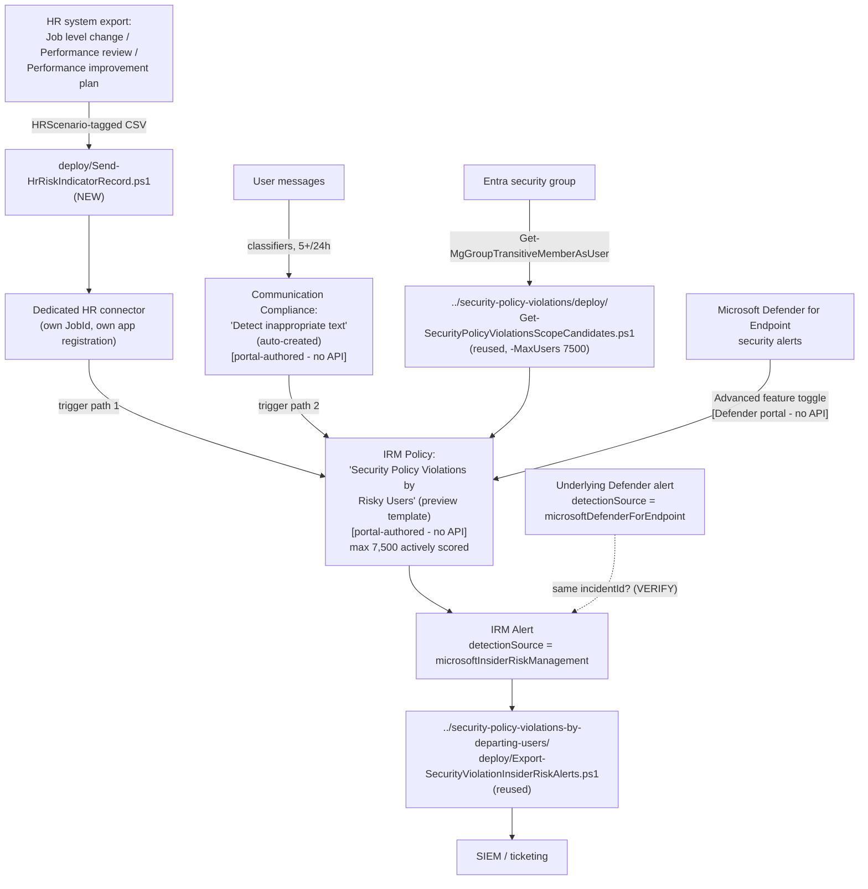

## 1. Problem statement

The base template scores a Microsoft Defender for Endpoint security-violation signal against a
population an operator assigns once, manually, with no behavioral or process-driven signal behind
that assignment. **Security policy violations by risky users** scores the identical Defender for
Endpoint indicator category, but adds a genuinely different bring-into-scope mechanism: an
employment-stressor signal (HR connector: job level change, performance review, or performance
improvement plan) and/or a Communication Compliance risky-message signal — either alone, or both
together, satisfies Microsoft's own AND/OR prerequisite
[[2]](README.md#references). This is the fourth and final member of the "Security policy
violations…" template family this library covers; unlike its three siblings, it is the only one
whose trigger mechanism itself branches into two independent paths that both still require the
same shared Defender for Endpoint prerequisite underneath.

## 2. Design goals

1. **Ship the one genuinely new, scriptable capability this template's HR requirement makes
   necessary: a multi-scenario HR risk-indicator uploader.** The departing-users sibling's own HR
   uploader (`../security-policy-violations-by-departing-users/../departing-employee-data-theft/
   deploy/Send-HrTerminationRecord.ps1`) is hard-coded to a single schema — `UserPrincipalName`,
   `ResignationDate`, `LastWorkingDate` — because that template consumes exactly one HR data type.
   This template consumes **three** (Job level change, Performance review, Performance improvement
   plan), individually or combined in one CSV via Microsoft's own documented `HRScenario` column
   pattern [[7]](README.md#references). Reusing the sibling script unmodified would either silently
   drop two of the three data types or require the operator to hand-edit a script meant to be
   generic — neither is acceptable. `deploy/Send-HrRiskIndicatorRecord.ps1` generalizes the
   sibling's proven OAuth/chunking/webhook mechanics (identical resource ID, endpoint, and 500-row
   limit — a template-family-wide constant, not re-derived) for the three-schema, `HRScenario`-
   tagged shape this template actually needs.
2. **Reuse, don't duplicate, the scope-candidate resolution.** This template has no priority-user-
   group requirement (unlike the priority-users sibling) — its population mechanism is a plain
   Entra group, identical in kind to the base template's own mechanism, just checked against a
   different (7,500, not 1,000) cap. The base template's own
   `Get-SecurityPolicyViolationsScopeCandidates.ps1` already accepts `-MaxUsers` as a parameter for
   exactly this reason — calling it with `-MaxUsers 7500` is the correct reuse, not a
   scenario-specific fork.
3. **Get the indicator-vs-trigger distinction right for THIS specific template, not by analogy to
   its "Data leaks by risky users" cousin.** Microsoft's Communication Compliance integration
   documentation lists indicator categories selectable for "Data theft, Data leaks, Data leaks by
   risky users, and Data leaks by priority users" — **not** "Security policy violations by risky
   users" [[3]](README.md#references). For this template, Communication Compliance integration is
   documented and used **only** as a trigger mechanism (bringing a user into scope), while the
   actual scoring indicator category remains **Microsoft Defender for Endpoint indicators
   (preview)**, identical to every other "Security policy violations…" sibling. Conflating the two
   "risky users" templates — both exist in the same family tree but score different indicator sets
   — would misrepresent how this specific template actually works. `README.md` §5 Step 7 and §6
   state this distinction explicitly.
4. **Provision a dedicated HR connector rather than assuming an existing one can be extended.**
   Microsoft's own documentation describes a connector's Edit action as changing "the Azure App ID
   or the column header names" — it does not document adding new HR scenarios to a connector that
   wasn't created with them. Rather than assume that capability exists (untested, unconfirmed) and
   risk silently corrupting the departing-employee-data-theft sibling's working Resignation-only
   connector, this scenario provisions a second, dedicated connector — its own app registration
   (reusing `Register-HrConnectorApp.ps1` unmodified, a different `-DisplayName`), its own JobId.
   §6 records this as an explicit, disclosed design choice with an open VERIFY, not a silent
   assumption.
5. **Reuse, don't duplicate, the alert-export script.** Identical reasoning to the priority-users
   sibling (`security-policy-violations-by-priority-users/design.md` §2 goal 4): the sibling's
   `Export-SecurityViolationInsiderRiskAlerts.ps1` applies no policy- or template-specific filter,
   so it already works unmodified against this policy's own alerts too.
6. **Disclose the AND/OR trigger shape's operational risk rather than treat it as a detail.**
   Because Microsoft's prerequisite table states the HR-connector and Communication-Compliance
   trigger paths as AND/OR without naming either as a required minimum, a policy can be created
   with neither path actually producing signal — a silently non-functional configuration
   indistinguishable, at creation time, from a correctly configured one. `README.md` §8/§11 and
   `validate/Test-RiskyUsersIrmSetup.ps1`'s manual checklist treat confirming at least one live
   trigger path as a first-class deployment-sign-off item, not an afterthought.
7. **Don't fabricate a policy- or Communication-Compliance-authoring API.** As with every other
   Insider Risk Management and Communication Compliance surface in this library, this build
   searched for a documented Graph/PowerShell write surface for both and found neither — Microsoft
   states plainly that PowerShell isn't supported for Communication Compliance policy management
   [[3]](README.md#references), and IRM policy authoring remains portal-only across the whole
   family (`docs/automation-surface.md` §6).

## 3. Why this template needs a NEW HR schema, not a parameter tweak

| | Departing-users sibling | This scenario |
|---|---|---|
| HR data type(s) | Resignation (single, fixed) | Job level change, Performance review, Performance improvement plan — any one or a combination |
| Required CSV columns | `UserPrincipalName`, `ResignationDate`, `LastWorkingDate` (all three fixed) | `UserPrincipalName`, `EffectiveDate`, and a scenario-identifier column (default `HRScenario`) — everything else is per-scenario-optional |
| Column validation model | Fixed set, hard-fail on any missing | Shared-invariant set hard-fails; per-scenario optional columns pass through unvalidated (matches Microsoft's own "these are examples, not required parameters" framing) |
| Connector object | Reused from `departing-employee-data-theft` | New, dedicated (§2 goal 4) |

A single script cannot honestly serve both shapes without either over-fitting to one schema (the
sibling's actual behavior) or silently accepting malformed data for the other. Two purpose-built
scripts, each honest about the schema it validates, is the correct design — not a shared script
with a schema-selection parameter that would need to embed three separate validation paths behind
one interface anyway.

## 4. Policy architecture (what's deployed where)

| Component | Mechanism | Scriptable? |
|---|---|---|
| HR risk-indicator upload (3 schemas) | `deploy/Send-HrRiskIndicatorRecord.ps1` → dedicated HR connector webhook | **Yes** — this scenario's own, genuinely new script |
| HR connector creation + column mapping | Purview portal → Settings → Data connectors → Add connector → HR (preview) | No — portal-only; the app-registration bootstrap (`Register-HrConnectorApp.ps1`) is reused, the connector object itself is not scriptable, identical constraint to the sibling |
| Communication Compliance dedicated policy | Auto-created by the IRM policy-creation workflow's own option | No — portal-only, no PowerShell surface exists for this product at all [[3]](README.md#references) |
| Scope-candidate resolution | `../security-policy-violations/deploy/Get-SecurityPolicyViolationsScopeCandidates.ps1 -MaxUsers 7500` | **Yes** — reused unmodified |
| Defender for Endpoint → Purview alert sharing | Microsoft Defender portal → Settings → Endpoints → Advanced features | No — portal-only, shared tenant-wide toggle |
| IRM policy (template, indicators, triggers, scope) | Purview portal → Insider Risk Management → Policies | No — portal-only; `deploy/policy/security-policy-violations-risky-users-policy-manifest.json` is a reference, not an API payload |
| Alert export | `../security-policy-violations-by-departing-users/deploy/Export-SecurityViolationInsiderRiskAlerts.ps1` | **Yes** — reused unmodified |

## 5. Data flow / where scoring happens

An HR risk-indicator record or a Communication Compliance risky-message signal brings a user into
this policy's scope (the trigger). Once in scope, the policy scores that user's Microsoft Defender
for Endpoint security-violation activity — the same underlying indicator category every sibling in
this family uses. This is structurally identical to the departing-users sibling's own two-stage
model (trigger brings a user in scope; a separate indicator category does the actual scoring) — not
the base/priority-users siblings' single-stage model, where the Defender for Endpoint alert itself
is both trigger and indicator. Getting this two-stage structure right (rather than treating the HR/
Communication-Compliance signal as if it were itself scored) is why `README.md` §4's diagram shows
two distinct arrows converging on the policy node before a single scoring arrow exits it.

## 6. Key decisions

| Decision | Choice | Rationale |
|---|---|---|
| HR connector object | New, dedicated connector — not the departing-users sibling's Resignation-scoped connector | Microsoft's documented Edit capability doesn't confirm adding new HR scenarios to an existing connector; provisioning a second connector is the unambiguous, documented path — §2 goal 4 |
| HR uploader script | New `Send-HrRiskIndicatorRecord.ps1`, not a parameterized fork of the sibling's resignation uploader | Different, multi-scenario schema with a fundamentally different validation model (shared invariant + per-scenario-optional columns) — §3 |
| Scope-candidate resolution | Reuse the base template's script with `-MaxUsers 7500` | No template-specific logic beyond the cap the script already parameterizes — a third copy would be pure duplication |
| Indicator category | Microsoft Defender for Endpoint indicators (preview) only — NOT Communication Compliance content indicators | This template's own indicator-category documentation does not list CC indicators as selectable, unlike its "Data leaks by risky users" cousin — §2 goal 3 |
| Alert export | Reuse the departing-users sibling's script unmodified | No policy- or template-specific filter exists in that script |
| Trigger-health monitoring | Documented as two independent checks (HR import log AND Communication Compliance policy state), not one combined check | Either path failing silently reduces coverage without an error; a single combined check could mask one path's failure behind the other's success |
| Whether to resolve the "editable existing connector" open question | Not resolved — disclosed as an explicit VERIFY | No worked example or definitive Microsoft Learn statement confirms or rules out extending an existing connector's scenario set; guessing would misrepresent an open question as a settled one, per `AGENTS.md` §4 |
| Whether to flag the HR-connector trigger path as a governance, not purely technical, decision | Documented explicitly in `README.md` §2/§8 as requiring HR/Legal review before enabling | Added during the four-lens review (`reviews.md`, CISO lens) — this is the only scenario in this library whose trigger is drawn from performance-management HR data rather than a security-activity signal, and that distinction carries employment-law/perception risk outside this library's own security-and-compliance scope to assess |

## 7. Non-goals

- This scenario does not deploy the base **Security policy violations**, **…by departing users**,
  or **…by priority users** templates — each has its own, already-built, separately-scoped
  fragment.
- This scenario does not configure Defender for Endpoint itself, and does not attempt to script
  Communication Compliance policy creation, editing, or reviewer assignment — no documented
  PowerShell/Graph surface exists for that product at all, not just for this integration path.
- This scenario does not attempt to resolve whether an existing HR connector can be edited to add
  new scenarios — it discloses the question and takes the documented, unambiguous path (a new
  connector) rather than guessing.
- This scenario does not maintain the source Entra security group used for scope resolution —
  group lifecycle is assumed to already be handled by whatever process governs that group, the same
  non-goal every sibling scenario states for its own source group.
- This scenario does not attempt cross-policy-template alert disambiguation — the same disclosed
  gap every sibling in this family already carries.
