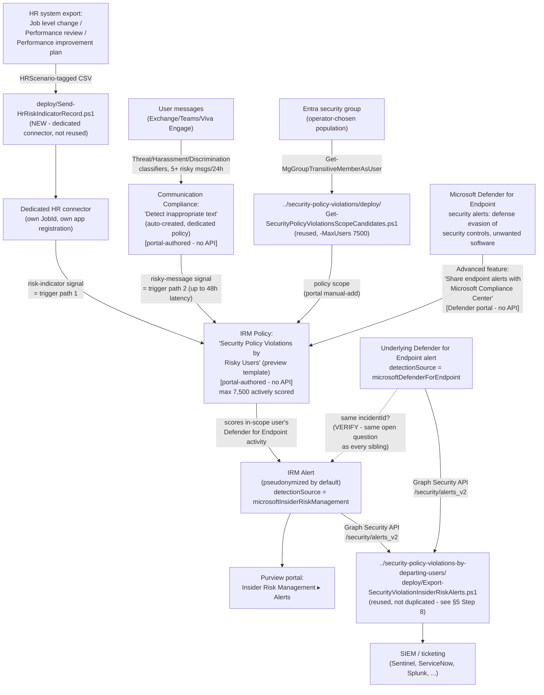

> **Preview feature.** Microsoft labels the "Security policy violations" template family — and its
> core Microsoft Defender for Endpoint indicator category — **(preview)** as of this writing
> [[1]](#references)[[9]](#references). Preview features can change or be withdrawn with less
> notice than GA capabilities; re-verify current status before a customer-facing commitment.

## 1. Scenario summary

Deploys Microsoft Purview Insider Risk Management's **Security policy violations by risky users**
policy template — the fourth and final member of the "Security policy violations…" template family
alongside the already-built base, `…by departing users`, and `…by priority users` scenarios. It
scores the same **Microsoft Defender for Endpoint indicators (preview)** category as every sibling,
but a risky-users population is brought **into scope** by a materially different mechanism: an
**HR-connector-sourced employment-stressor signal** (a performance improvement plan, a poor
performance review, or a job level change) and/or a **Communication Compliance risk-signal
integration** (messages containing potentially threatening, harassing, or discriminatory language)
— at least one is required, and both together is supported. This scenario ships a new,
scenario-specific HR-connector uploader (`deploy/Send-HrRiskIndicatorRecord.ps1`) for the three risk
-indicator HR data types this template needs, none of which the departing-users sibling's
resignation-only uploader can carry.

**Who it's for:** a tenant that already runs (or is deploying) the base "Security policy
violations" template and Microsoft Defender for Endpoint, and wants a materially different
detection lens: not "did this user's device show a security violation" alone, but "did this user's
device show a security violation **after** an employment stressor or a risky-message signal" — a
narrower, evidence-weighted population than the base template's plain-group scope, sized against
Microsoft's larger **7,500**-user template cap.

## 2. Business/regulatory driver

Employment stressors are a well-documented behavioral precursor to both inadvertent and malicious
insider activity — Microsoft's own scenario documentation for this template family names
performance improvement plans, poor performance reviews, and job-level changes explicitly
[[8]](#references). Correlating that stressor signal with a security-control violation on the same
user's device — rather than treating either signal alone — supports:

- **Risk-weighted security-violation triage** — a Defender for Endpoint alert on a user who was
  just placed on a performance improvement plan warrants a different, faster triage priority than
  the identical alert on a user with no such signal. This template makes that correlation a
  first-class trigger instead of something a human analyst has to notice by cross-referencing two
  unrelated systems manually.
- **Early-warning coverage the base template's plain-group scope cannot provide** — the base
  template ([`security-policy-violations/`](../security-policy-violations/)) scores whatever
  population an operator manually assigns; this template scores based on an actual behavioral or
  HR-process signal, closing a detection gap for security-relevant users the base template's static
  group assignment might not include at all.
- **SOC 2 / ISO 27001 endpoint-integrity monitoring evidence for a behaviorally-flagged
  population** — the same audit-evidence rationale this library's other Insider Risk Management
  scenarios document (`security-policy-violations/README.md` §2), extended here to a population
  identified by an employment-stressor or risky-communication signal rather than a static
  role-based group.

No regulation names this specific control by requirement number — the same honest framing this
library's other Insider Risk Management scenarios use.

**Governance note, distinct from every other scenario in this library:** this is the only Insider
Risk Management scenario in this repo whose triggering signal is drawn directly from **performance-
management HR data** (performance improvement plans, poor performance reviews, job-level changes/
demotions) rather than a security-activity signal. Feeding that data into a security-monitoring
trigger — even indirectly, and even though the resulting alert still requires an independent
Defender for Endpoint security-violation signal before anything is scored — is the kind of design
choice that can be perceived as retaliatory or discriminatory if a flagged employee later disputes
a performance action, and may implicate employment-law obligations that are outside this library's
security/compliance scope to assess. **Route this specific trigger path through HR and Legal
review before enabling it in a customer's tenant** — not solely through the Insider Risk Management
or security team that would normally own this kind of control. This is a deployment-governance
recommendation, not a technical limitation; §8 restates it as an operational item.

## 3. Prerequisites

Full licensing detail and citations: `docs/licensing-matrix.md` §2 (Insider Risk Management and
Communication Compliance rows) and §7 (Defender for Endpoint). This template's prerequisite set is
the **most complex in the family** — it is the only member with a genuine **AND/OR** shape (one of
two trigger paths, both requiring a shared Defender for Endpoint prerequisite):

| Requirement | Minimum | Notes |
|---|---|---|
| Insider Risk Management (all policies) | **Microsoft 365 E5/A5/G5**, **Microsoft Purview Suite**, or the **Microsoft 365 E5 Insider Risk Management** add-on | Same base entitlement as every IRM scenario in this library |
| **Microsoft 365 HR connector** — configured for risk indicators, **OR** | Job level change, Performance review, and/or Performance improvement plan CSV data type(s) [[2]](#references)[[7]](#references) | At least one of this row or the Communication Compliance row below is required; both together is supported and recommended — §5 Step 5 |
| **Communication Compliance risk-signal integration** — dedicated risky-user policy | Selected as an option in the IRM policy-creation workflow itself | Auto-creates a dedicated "Detect inappropriate text" Communication Compliance policy — portal-only, no PowerShell surface for Communication Compliance policy authoring exists [[3]](#references); §5 Step 6 |
| **Microsoft Defender for Endpoint** — active subscription | Microsoft's own prerequisite table for this template states only **"Active Microsoft Defender for Endpoint subscription,"** with no Plan 1/Plan 2 qualifier [[2]](#references) | Required **regardless of which trigger path above is used** — same open Plan 1/Plan 2 VERIFY the base/departing-users/priority-users siblings already carry |
| Defender for Endpoint → Purview alert sharing | "Share endpoint alerts with Microsoft Compliance Center" advanced feature, enabled in the Microsoft Defender portal | Portal-only toggle, tenant-wide, shared with every other "Security policy violations…" family policy — §5 Step 3 [[4]](#references) |
| Role to configure policies/settings | **Insider Risk Management** or **Insider Risk Management Admins** role group | `docs/rbac-model.md` §4 |
| Role to configure the Defender for Endpoint advanced feature | Microsoft Entra **Security Administrator** (basic permissions), or the granular **Manage security settings in Security Center** permission (legacy Defender for Endpoint RBAC) / **Core security settings (Manage)** permission (Defender unified RBAC) | `docs/rbac-model.md` §12 |
| Role to create the HR connector | **Data Connector Admin** (or a role group that includes it) | `docs/rbac-model.md` §4; distinct from the IRM policy-configuration role above [[7]](#references) |
| Automation identity for scope-candidate resolution (reused) | App registration with the Microsoft Graph **`GroupMember.Read.All`** application permission, certificate-based | Reused unmodified from the base template — §5 Step 4 |
| Automation identity for HR-connector upload (new, dedicated) | Microsoft Entra app registration created via `../security-policy-violations-by-departing-users/../departing-employee-data-theft/deploy/Register-HrConnectorApp.ps1` (reused unmodified, different `-DisplayName`) — no Graph API permission granted, single-purpose against the HR-connector webhook only | §5 Step 2; **not** the departing-employee-data-theft sibling's own app/connector — see `design.md` §6 |
| Automation identity for alert export (optional, reused) | App registration with the Microsoft Graph **`SecurityAlert.Read.All`** application permission, certificate-based | Only needed if reusing `../security-policy-violations-by-departing-users/deploy/Export-SecurityViolationInsiderRiskAlerts.ps1` per §5 Step 8 |

> Verify current entitlement names against `docs/licensing-matrix.md` and the Product Terms before
> a sales commitment — SKU names change, and this template is Microsoft-labeled preview.

## 4. Architecture



Full rule-by-rule rationale is in `design.md` §4–6.

## 5. Step-by-step implementation

### Step 1 — Assign permissions

Confirm the operator is a member of **Insider Risk Management** or **Insider Risk Management
Admins** (Purview role group), has **Data Connector Admin** for the HR connector step, and has a
Defender for Endpoint role capable of changing advanced features — typically **Security
Administrator**, or the granular permission `docs/rbac-model.md` §12 documents.

### Step 2 — Register a dedicated HR-connector app and create the connector (manual, reused pattern)

This scenario deliberately does **not** reuse the departing-employee-data-theft sibling's HR
connector — that connector is scoped to Resignation data only, and Microsoft's documented Edit
action for an existing connector changes "the Azure App ID or the column header names," not the set
of HR scenarios it was created for [[7]](#references). VERIFY at deploy time whether the live
portal actually allows adding new scenarios to an existing connector via Edit before assuming a
second connector is required — this scenario's scripts assume it is, as the documented, unambiguous
path.

1. Register the app: reuse
   `../security-policy-violations-by-departing-users/../departing-employee-data-theft/deploy/Register-HrConnectorApp.ps1`
   unmodified with a different `-DisplayName` (e.g. `"HR Connector - IRM Risky Users"`). Same
   single-purpose, no-Graph-permission hygiene as the sibling's own use of this script.
2. Purview portal → **Settings** → **Data connectors** → **My connectors** → **Add connector** →
   **HR (preview)**. Provide the new app's Application ID, select **Job level change**,
   **Performance review**, and **Performance improvement plan** as the HR scenarios to import
   (select all three, or only the ones your HR system provides), and map columns — either upload a
   sample CSV shaped per §6 below, or map manually using the **HRScenario** column pattern
   [[7]](#references).
3. Record the generated **Job ID** — needed for Step 4.

### Step 3 — Enable the Defender for Endpoint → Purview alert-sharing feature (manual, one-time)

Identical to every sibling's own Step — **skip entirely if any sibling scenario is already deployed
in this tenant**, since the toggle is tenant-wide, not per-policy (`rollback.md` Stage 2 flags the
same coupling here).

1. Sign in to the [Microsoft Defender portal](https://security.microsoft.com).
2. **Settings** → **Endpoints** → **Advanced features**.
3. Locate **Share endpoint alerts with Microsoft Compliance Center** and toggle it **On**.
4. Select **Save preferences** [[4]](#references).

### Step 4 — Resolve and size the policy-scope candidate list (scripted, read-only, reused)

This template has no priority-user-group requirement — population is a plain Entra group, resolved
and sized exactly like the base template, just against this template's larger **7,500**-user cap:

```powershell
Connect-MgGraph -ClientId $AppId -TenantId $TenantId -CertificateThumbprint $Thumbprint

# Dry run — shows the query plan, calls nothing
../security-policy-violations/deploy/Get-SecurityPolicyViolationsScopeCandidates.ps1 `
    -GroupId $SecurityRelevantUsersGroupId -MaxUsers 7500 -WhatIf

# Resolve, dedupe, filter to enabled accounts, check against the 7,500-user cap
../security-policy-violations/deploy/Get-SecurityPolicyViolationsScopeCandidates.ps1 `
    -GroupId $SecurityRelevantUsersGroupId -MaxUsers 7500 -OutputPath ./risky-users-scope-candidates.csv
```

No new script was written for this step — the base template's own scope script has no
template-specific logic beyond the `-MaxUsers` cap it already accepts as a parameter, so a third
copy would be pure duplication (`design.md` §2 goal 2).

### Step 5 — Prepare and upload the HR risk-indicator CSV (scripted, mutating)

```powershell
Connect-MgGraph -ClientId $AppId -TenantId $TenantId -CertificateThumbprint $Thumbprint  # unrelated session, HR upload below uses its own auth

$hrSecret = Read-Host -AsSecureString -Prompt 'HR connector app secret'

# Dry run — validates the CSV, reports per-scenario row counts, sends nothing
./deploy/Send-HrRiskIndicatorRecord.ps1 -TenantId $TenantId -AppId $HrConnectorAppId `
    -AppSecret $hrSecret -JobId $HrConnectorJobId -CsvPath ./risk_indicators.csv -WhatIf

# Upload — chunked at 500 rows per call
./deploy/Send-HrRiskIndicatorRecord.ps1 -TenantId $TenantId -AppId $HrConnectorAppId `
    -AppSecret $hrSecret -JobId $HrConnectorJobId -CsvPath ./risk_indicators.csv
```

At least one of this step or Step 6 (Communication Compliance) must be completed before the policy
in Step 7 can start scoring — either alone satisfies Microsoft's documented AND/OR prerequisite
[[2]](#references). Schedule this script to run on the same recurring cadence as the HR system's own
export, identical operational pattern to the departing-employee-data-theft sibling's resignation
uploader.

### Step 6 — Enable Communication Compliance risk-signal integration (portal-only, optional but recommended)

During policy creation in Step 7, select the option to integrate Communication Compliance risk
signals. This automatically creates a dedicated policy using the Threat, Harassment, and
Discrimination trainable classifiers, scoped to all organization users, with every **Insider Risk
Management Investigators** role-group member auto-assigned as a reviewer [[3]](#references). Users
sending 5 or more messages classified as potentially risky within 24 hours are brought in-scope for
this IRM policy, with up to 48 hours of latency from message to in-scope status. **Manually add**
IRM investigators to the **Communication Compliance Investigators** role group if they need to
review the underlying flagged message directly on the Communication Compliance alerts page
[[3]](#references).

There is no PowerShell or Graph surface for creating or managing Communication Compliance
policies — Microsoft states this explicitly [[3]](#references); this step is portal-only in this
scenario, not a fabricated cmdlet gap.

### Step 7 — Create the Insider Risk Management policy (portal, not scriptable)

Purview portal → **Insider Risk Management** → **Policies** → **Create policy**:

1. Template: **Security policy violations by risky users**. Confirm this is the risky-users member
   of the family and not one of its three siblings — all four share the same "Security policy
   violations…" naming prefix in the template picker.
2. Name: `Security Policy Violations by Risky Users`. The template and name can't be changed after
   policy creation [[5]](#references) — confirm before continuing.
3. **Users and groups**: assign the scope resolved in Step 4.
4. **Triggering events**: enable the HR connector risk-indicator signal (Step 5) and/or the
   Communication Compliance integration (Step 6) — at least one is required. Enabling both is
   supported and gives broader coverage than either alone.
5. **Indicators**: select the **Microsoft Defender for Endpoint indicators (preview)** category, as
   with every sibling. Communication Compliance content indicators are **not** documented as
   selectable scoring indicators for this specific template — unlike the sibling `Data leaks by
   risky users` template, which does list them — so do not conflate the two "risky users" templates
   when scoping this step. **VERIFY against the live policy-creation workflow at deploy time** which
   specific Defender for Endpoint indicator toggles appear; not enumerated by Microsoft Learn during
   this build.
6. **Review and submit.**

Use `deploy/policy/security-policy-violations-risky-users-policy-manifest.json` as the
checklist/reference while completing this workflow — it is not consumed by any API.

### Step 8 — Export correlated alerts for SIEM/ticketing integration (scripted, read-only, reused)

Identical reasoning to the priority-users sibling — the alert-export script applies no
policy-specific filter, so it works unmodified against this policy's own alerts too:

```powershell
Connect-MgGraph -ClientId $AppId -TenantId $TenantId -CertificateThumbprint $Thumbprint

../security-policy-violations-by-departing-users/deploy/Export-SecurityViolationInsiderRiskAlerts.ps1 `
    -SinceDateTime (Get-Date).AddDays(-1) -OutputPath ./security-violation-alerts.json
```

**Caveat carried over unchanged from every sibling:** if more than one "Security policy
violations…" template is deployed in the same tenant, this export cannot tell which policy produced
a given alert — `alertPolicyId` is exported as raw, unmapped data.

### Step 9 — Validate

```powershell
./validate/Test-RiskyUsersIrmSetup.ps1
```

## 6. Configuration reference

| Setting | Value this scenario uses | Notes |
|---|---|---|
| Policy template | `Security policy violations by risky users` **(preview)** | Cannot be changed after creation [[5]](#references) |
| Triggering events | HR risk-indicator signal (Job level change / Performance review / Performance improvement plan) **AND/OR** Communication Compliance risky-message integration | At least one required; both is supported and recommended [[2]](#references) |
| Indicator category | **Microsoft Defender for Endpoint indicators (preview)** | Not enumerated by Microsoft as of this writing — VERIFY at deploy time. Communication Compliance content indicators are NOT selectable for this template (§5 Step 7) |
| Population mechanism | A plain Entra group (or groups), resolved via the reused base-template scope script | No priority-user-group requirement, unlike the …by priority users sibling |
| Maximum actively-scored users for this template | **7,500**, cumulative tenant-wide across all policies built from this exact template | [[6]](#references) — larger than the base/priority-users siblings' 1,000, smaller than the departing-users sibling's 15,000. Do not conflate the four |
| HR data types accepted | Job level change, Performance review, Performance improvement plan | Any one, or a combination, satisfies the HR-connector half of the trigger requirement [[7]](#references) |
| HR CSV required columns (this scenario's script) | `UserPrincipalName`, `EffectiveDate`, `HRScenario` (name configurable) | Every other documented per-scenario column (`OldLevel`/`NewLevel`, `Remarks`/`Rating`, the improvement-plan columns) is optional and passed through unvalidated — README.md §11 documents a Microsoft-side documentation inconsistency in the improvement-plan column names |
| Communication Compliance classifiers | Threat, Harassment, Discrimination (Microsoft-provided trainable classifiers) | Auto-created dedicated policy; not editable via any scripted surface [[3]](#references) |
| Communication Compliance in-scope threshold | 5+ risky messages within 24 hours; up to 48h latency to in-scope status | [[3]](#references) |
| Defender for Endpoint alert-sharing dependency | "Share endpoint alerts with Microsoft Compliance Center" advanced feature (tenant-wide) | Same portal-only mechanism as every sibling |
| User-identity privacy | Pseudonymized (Microsoft default) | Not disabled by this scenario |
| Alert export mechanism | Reused: `../security-policy-violations-by-departing-users/deploy/Export-SecurityViolationInsiderRiskAlerts.ps1`, unmodified | No policy-specific filter exists in that script or in the underlying Graph API |
| Cross-policy-template disambiguation | Not attempted — same disclosed gap as every sibling | `alertPolicyId` is exported as raw, unmapped data |

## 7. Validation / how to prove it works

1. **Automated checks** — `./validate/Test-RiskyUsersIrmSetup.ps1` confirms the Graph session and
   `GroupMember.Read.All` permission actually work (probed against the same group(s) used for
   scoping), and reports the resolved count against the 7,500-user cap. Exits non-zero on a hard
   failure.
2. **Manual checklist** — the same script prints a checklist for the portal-only configuration (HR
   connector existence/scenario mapping, Communication Compliance dedicated policy existence, policy
   existence/template/state, Defender for Endpoint advanced-feature toggle, role groups) — see
   `design.md` §4 for why these can't be automated.
3. **End-to-end functional test (non-production names only, pilot tenant)** — upload a single
   disposable test record via `Send-HrRiskIndicatorRecord.ps1 -WhatIf:$false` for a test account
   already onboarded to Defender for Endpoint, then trigger a benign detection your test plan
   already uses (e.g., the standard
   [EICAR test file](https://learn.microsoft.com/defender-endpoint/attack-simulations) or a
   documented attack simulation) rather than actually disabling a security control. Confirm an alert
   appears in **Insider Risk Management** → **Alerts**, and that the reused export script (§5
   Step 8) retrieves it. Repeat separately for the Communication Compliance trigger path if it is
   also enabled (send 5+ test messages matching a risky classifier within 24 hours from a
   disposable test account, per §6's documented threshold).
4. **Evidence trail** — the alert's **Activity explorer** tab shows the specific Defender for
   Endpoint alert(s) that contributed to the score.

## 8. Operations & tuning

**This scenario's incident-response runbook, Defender for Endpoint alert-sharing health check, and
preview-status rollout-pacing recommendation mirror the other three siblings' own README §8
guidance exactly** — re-read those sections; they are not repeated here to avoid drift between four
copies of the same guidance. Items specific to this scenario:

- **Confirm HR/Legal sign-off on the HR-connector trigger path before go-live, and keep it on
  record.** Per §2's governance note, this is the only scenario in this library whose trigger draws
  on performance-management data. Treat HR/Legal review as a standing prerequisite to check at
  initial deployment sign-off and at any subsequent review of who is in scope — not a one-time box
  checked before the first policy was ever created.
- **Two independent trigger paths means two independent health checks, not one.** Confirm the HR
  connector's import log (Settings → Data connectors → this connector → Download log,
  `RecordsSaved` field) **and** — if Communication Compliance integration is enabled — that the
  auto-created dedicated policy is still active and hasn't been accidentally disabled or reassigned,
  on the same recurring cadence. A silent failure of either path alone reduces coverage without
  producing an error; nothing in the portal actively surfaces "one of your two trigger paths for
  this policy went quiet."
- **Confirm at least one trigger is actually enabled at initial deployment sign-off.** Because
  Microsoft's own prerequisite table states this template's two trigger paths as AND/OR rather than
  naming either as the mandatory primary, a policy can technically be created with neither actually
  producing signal (e.g., the HR connector exists but has never received an upload, and
  Communication Compliance integration wasn't selected) — a silently non-functional configuration
  with no error at creation time, the same class of risk the departing-users sibling's README §8
  already documents for its own optional-trigger shape.
- **Re-scope on group-membership change, same reasoning as the base template.** This template's
  plain-group population mechanism inherits the base template's own re-scoping guidance
  (`security-policy-violations/README.md` §8) — this scenario does not repeat it in full.
- **Treat a correlated alert (HR/CC signal + Defender for Endpoint violation on the same user) as
  higher-priority triage than a base-template alert alone** — the same reasoning the priority-users
  sibling documents for its own population, applied here to a behaviorally-flagged rather than a
  formally-designated population.
- **Defender for Endpoint alert-sharing health.** Same standing item as every sibling — if the
  "Your organization doesn't have a Microsoft Defender for Endpoint subscription" or "Microsoft
  Defender for Endpoint alerts aren't being shared with the Microsoft Purview portal" policy-health
  notifications appear, this policy silently stops scoring new activity even though it looks
  correctly configured in the portal.
- **Preview status is a rollout-pacing decision, not just a documentation footnote.** Same
  recommendation as every sibling: pilot against a narrow population for at least one full
  activation-window cycle before treating this as a permanent, tenant-wide control in a
  customer-facing commitment.

## 9. Rollback / decommission

See `rollback.md`. Quick reference: narrowing policy scope or disabling one trigger path is
reversible in seconds; deleting the policy, the dedicated HR connector, the auto-created
Communication Compliance policy, or revoking either app registration's certificate, is not.

## 10. Cost & licensing notes

- **No incremental license cost beyond the base/departing-users/priority-users siblings' own
  baseline** for the IRM and Defender for Endpoint entitlements if any sibling is already deployed
  in the tenant — this scenario adds no new licensing *tier* requirement for those two products.
- **Communication Compliance licensing, if that trigger path is used:** Communication Compliance
  itself requires the same class of entitlement as Insider Risk Management (E5/A5/G5, Purview
  Suite, or an E5 add-on) per `docs/licensing-matrix.md` §2 — confirm this entitlement is present
  independently of IRM's own if Communication Compliance was not otherwise already in use in the
  tenant; the two are covered by the same top-tier bundles but are separate line items on a
  narrower add-on-based entitlement.
- **Sizing note specific to this template:** the 7,500-actively-scored-user cap applies cumulatively
  **across all policies built from this exact template** (§6) — confirm no other policy sharing this
  cap already exists before sizing a new population (manual portal check — no Graph/REST usage-count
  API exists, same disclosed gap as every sibling).
- **No additional cost for the scope-candidate resolution, HR-connector upload, or alert-export
  automation** — all use application permissions already covered by the base Microsoft Graph SDK or
  the HR-connector's own OAuth flow, no metered API.

## 11. Known limitations & gotchas

- **Preview feature, twice over** — same status as every sibling: both the overall template family
  and the Defender for Endpoint indicator category it depends on are Microsoft-labeled **preview**
  [[9]](#references)[[2]](#references) — re-verify GA status before a customer-facing commitment.
- **This scenario provisions a second, dedicated HR connector rather than reusing the
  departing-employee-data-theft sibling's connector — VERIFY whether the live portal actually
  supports adding new HR scenarios to an existing connector via Edit before assuming a second
  connector is strictly required.** Microsoft's own documentation describes the Edit action as
  changing "the Azure App ID or the column header names," not as adding scenarios a connector wasn't
  originally created with — `design.md` §6.
- **Documented Microsoft-side inconsistency in the Performance improvement plan CSV column
  reference.** Microsoft's own worked example shows the header
  `UserPrincipalName,EffectiveDate,ImprovementRemarks,PerformanceRating`, but the column-description
  table immediately below it labels the same optional columns "Remarks" and "Rating" — identical
  wording to the separate Performance review section, apparently not updated for this one. Because
  Microsoft's own text states column names are examples mapped at connector-creation time (not a
  fixed contract), this does not block `Send-HrRiskIndicatorRecord.ps1` (which validates only
  `UserPrincipalName`/`EffectiveDate`/the scenario column), but confirm the actual expected column
  names against the live portal's file-mapping step rather than assuming either worked example is
  authoritative.
- **Microsoft's own documentation uses two different names for the Communication Compliance
  auto-created dedicated policy within the same article** — "Insider risk trigger - (date created)"
  in one paragraph, "Risky user in messages - (date created)" in the next. Disclosed as an
  unresolved documentation inconsistency, not resolved by guessing which is correct — confirm the
  actual name against the live portal at deploy time.
- **No documented Graph/PowerShell write (or read) API for Communication Compliance policy
  configuration.** Creation (even the auto-created dedicated policy), editing scope/conditions, and
  reviewer-permission assignment are all portal-only — Microsoft states this explicitly
  [[3]](#references).
- **The HR-connector re-ingestion/de-duplication behavior for an unchanged row re-uploaded on a
  later scheduled run is not documented by Microsoft** — identical open gap to the
  departing-employee-data-theft sibling's own resignation uploader. **VERIFY (pilot tenant).**
- **This scenario's "at least one trigger required" prerequisite is a genuine AND/OR, not
  optional-vs-optional like the departing-users sibling's two triggers** — a policy created with
  *neither* the HR connector nor Communication Compliance integration actually producing signal is
  possible at creation time but does not satisfy Microsoft's own documented prerequisite; treat this
  as a configuration error to catch at deployment sign-off, not a supported "no trigger" state.
- **The Communication Compliance trigger path has a documented, fixed threshold (5+ risky messages
  within 24 hours) that a disciplined insider aware of this control can deliberately stay under.**
  Microsoft's own documentation states this exact count [[3]](#references) — an attacker who limits
  themselves to at most 4 threatening/harassing/discriminatory messages per rolling 24-hour window
  generates no Communication Compliance signal at all, and if that same user also has no qualifying
  HR risk-indicator record, never enters this policy's scope regardless of how severe an individual
  message is. This is a structural property of a documented, count-based threshold Microsoft
  controls, not a configuration gap this scenario can close — pair with the base template's plain-
  group scope (which has no message-count gate at all) for a population where this specific evasion
  is a live concern.
- **The `incidentId` join in the reused export script is best-effort, not guaranteed** — see the
  departing-users sibling's own `README.md` §11 and `design.md` §2 goal 5/§5 for the full grounding
  discussion; not re-litigated here since the mechanism is identical.
- **The 7,500-actively-scored cap has no query API to check current cumulative usage against** —
  same disclosed gap as every sibling; Microsoft documents only a portal-visible **Users in scope**
  column on the Policies tab.
- **Cannot disambiguate which "Security policy violations…" template produced a given exported alert
  if more than one is deployed in the same tenant** — including this scenario's own policy running
  alongside its base, departing-users, or priority-users siblings.
- **This scenario does not configure the base, …by departing users, or …by priority users
  templates** — each is its own, already-built, separately-scoped fragment.
- **This scenario does not configure Adaptive Protection** — same non-goal as every other Insider
  Risk Management scenario in this library.
- **This control is invisible to an offline or physical attack on the endpoint itself** — same
  structural EDR-sourced-signal limit already documented for every sibling in this family.
- **The "Share endpoint alerts with Microsoft Compliance Center" toggle is tenant-wide, not
  per-policy** — enabling or disabling it affects every "Security policy violations…" family policy
  in the tenant simultaneously. Same coupling every sibling's `rollback.md` Stage 2 already flags.

## 12. References

1. Learn about Insider Risk Management — Scenarios (employment-stressor precursor framing: performance improvement plan, poor performance review, position demotion) — <https://learn.microsoft.com/purview/insider-risk-management#scenarios>
2. Learn about Insider Risk Management policy templates — Security policy violations by risky users (description, prerequisites table: HR connector risk indicators AND/OR Communication Compliance integration AND active Defender for Endpoint subscription, no Plan qualifier) — <https://learn.microsoft.com/purview/insider-risk-management-policy-templates#security-policy-violations-by-risky-users>
3. Create and manage Communication Compliance policies — Integrate Communication Compliance with Microsoft Purview Insider Risk Management (dedicated "Detect inappropriate text" policy creation, Threat/Harassment/Discrimination classifiers, 5+ messages/24h in-scope threshold, up to 48h latency, auto-assigned IRM Investigators reviewers, "PowerShell isn't supported for creating and managing Communication Compliance policies") — <https://learn.microsoft.com/microsoft-365/compliance/communication-compliance-policies#integrate-communication-compliance-with-microsoft-purview-insider-risk-management>
4. Configure advanced features in Defender for Endpoint — "Share endpoint alerts with Microsoft Compliance Center" (portal steps, no API) — <https://learn.microsoft.com/defender-endpoint/advanced-features#share-endpoint-alerts-with-microsoft-compliance-center>
5. Create and manage Insider Risk Management policies (template/name immutable after creation) — <https://learn.microsoft.com/purview/insider-risk-management-policies>
6. Limits in Insider Risk Management — maximum users in scope per policy template (7,500 for "Security policy violations by risky users"; 1,000 for the base/priority-users siblings; 15,000 for the departing-users sibling) — <https://learn.microsoft.com/purview/insider-risk-management-limits#maximum-number-of-users-in-scope-for-a-policy-template>
7. Set up a connector to import HR data — HR scenario/data-type table (this template requires Job level change, Performance review, and/or Performance improvement plan data), per-scenario CSV column reference, the HRScenario multi-scenario CSV pattern, Data Connector Admin role requirement, Step 4 upload script pattern — <https://learn.microsoft.com/purview/import-hr-data>
8. Get started with Insider Risk Management — Configure Microsoft 365 HR connector (templates requiring the HR connector, including this one) — <https://learn.microsoft.com/purview/insider-risk-management-configure#step-4-recommended-configure-prerequisites-for-policies>
9. Learn about Insider Risk Management — Scenarios ("Intentional or unintentional security policy violations (preview)") and Configure policy indicators — Microsoft Defender for Endpoint indicators (preview) — <https://learn.microsoft.com/purview/insider-risk-management#scenarios>, <https://learn.microsoft.com/purview/insider-risk-management-settings-policy-indicators#built-in-indicators-vs-custom-indicators>
10. alert resource type — `alertPolicyId`, `incidentId`, `detectionSource` properties — <https://learn.microsoft.com/graph/api/resources/security-alert>
11. List group transitive members (OData cast, required `ConsistencyLevel: eventual` header, `GroupMember.Read.All` among the higher-privileged application permissions) — <https://learn.microsoft.com/graph/api/group-list-transitivemembers?view=graph-rest-1.0>
12. Microsoft Graph permissions reference (`GroupMember.Read.All`, `SecurityAlert.Read.All`) — <https://learn.microsoft.com/graph/permissions-reference>
13. `security-policy-violations/README.md`, `security-policy-violations-by-departing-users/README.md`, and `security-policy-violations-by-priority-users/README.md` — this template family's base, departing-users, and priority-users siblings, whose already-grounded facts (scope-candidate script, alert-export script, Defender for Endpoint advanced-feature toggle, HR-connector app-registration bootstrap) this scenario reuses and cross-references rather than re-verifying independently.

> Re-verify all links, cmdlet/API behavior, and licensing terms against current Microsoft Learn
> before a customer-facing assessment or sale — this template family is explicitly Microsoft-
> labeled preview and could change materially before reaching general availability. This build's
> citations were grounded via direct Microsoft Learn MCP fetch/search of the URLs above.
