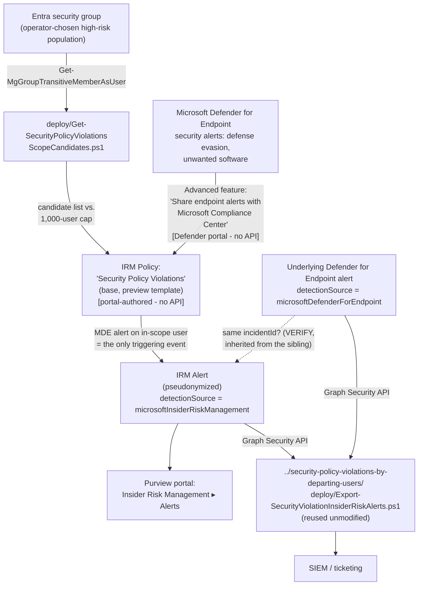

## 1. Problem statement

`scenarios/insider-risk/security-policy-violations-by-departing-users/` scores security-violation
signals against a population gated by employment status (resignation/termination or Entra account
deletion). That gate is exactly right for a departing-employee use case, but it's the wrong shape
for a tenant that wants continuous coverage of a population defined by **role or access level**
instead — a DevOps team with standing local-admin rights, a contractor pool on managed devices, a
help-desk group with elevated troubleshooting permissions — none of whom necessarily appear in an
HR feed or warrant a formal priority-user-group definition. Microsoft's own **Security policy
violations** base template exists for exactly this gap: no HR/departure trigger, no priority-group
requirement — the Defender for Endpoint security-violation alert itself is the only triggering
event [[1]](README.md#references). This scenario deploys that base template.

This scenario's originating backlog item (`PROGRESS.md`, "Follow-ups discovered while building the
Security Policy Violations by Departing Users scenario") described this template as one that
"scores every onboarded user continuously." That framing turned out to be materially misleading
once this build checked Microsoft's own limits reference — see §3 below.

## 2. Design goals

1. **Deploy the base template correctly, not as a smaller copy of the departing-users sibling.**
   The base template's prerequisite/triggering-event table is a genuine subset of the sibling's —
   no HR connector, no Entra-deletion toggle, no priority user group — confirmed directly against
   Microsoft's policy-templates reference during this build, not assumed by removing steps from the
   sibling's README.
2. **Ship a genuinely new, scenario-specific capability: population sizing against the 1,000-user
   cap**, not a copy of the sibling's HR-feed or alert-export scripts. Because this template has no
   built-in population mechanism, `deploy/Get-SecurityPolicyViolationsScopeCandidates.ps1` resolves
   an operator-chosen Entra security group's (or groups') transitive user membership, dedupes
   across groups, filters to enabled accounts, and checks the combined count against Microsoft's
   fixed 1,000-user limit for this specific template — the one piece of pre-deployment diligence
   this template's lack of a built-in population gate makes genuinely necessary, and genuinely
   scriptable via `Get-MgGroupTransitiveMemberAsUser` [[2]](README.md#references).
3. **Reuse, don't duplicate, the alert-export script.** The sibling scenario's
   `Export-SecurityViolationInsiderRiskAlerts.ps1` applies no policy-specific filter — it pulls all
   `alerts_v2` records matching `detectionSource ∈ {microsoftInsiderRiskManagement,
   microsoftDefenderForEndpoint}` in a date window and joins them client-side by `incidentId`, with
   no dependency on which "Security policy violations…" template produced a given alert. That means
   it already works, unmodified, against this scenario's own policy's alerts. Shipping a second,
   near-identical copy would be pure duplication of already-reviewed, already-grounded code —
   `AGENTS.md`'s no-unneeded-abstraction guidance applies directly, the same precedent the sibling
   scenario itself established for the HR-feed script it reused from its own sibling
   (`departing-employee-data-theft`).
4. **Correct the "scores every onboarded user continuously" framing before it reaches a buyer.**
   §3 below documents why: the fixed 1,000-user, tenant-wide, per-template-type cap makes an
   "all users" scope infeasible for any organization above roughly that headcount. This scenario's
   README and this design doc state the correction explicitly rather than quietly building around
   it without naming the discrepancy.
5. **Don't fabricate a policy-authoring or usage-count query API.** As with every other Insider
   Risk Management scenario in this library, policy creation has no PowerShell/Graph write surface
   (`docs/automation-surface.md` §6). This build additionally searched for a documented way to
   query how many users are already actively scored under a given policy template tenant-wide (to
   let the scope-sizing script account for other policies, not just the group(s) it's given) and
   found none — Microsoft's own limits reference points only to the portal's **Users in scope**
   column. `deploy/Get-SecurityPolicyViolationsScopeCandidates.ps1` states this as a disclosed gap
   in its own output and `.NOTES`, not a silently assumed zero.

## 3. Why "scores every onboarded user continuously" is not achievable at enterprise scale

The originating backlog item's phrasing implied this template could passively watch an entire
tenant with no scoping decision required — the natural reading of "no departure/HR trigger, scores
every onboarded user continuously." Microsoft's limits reference contradicts that reading directly:
**this template supports a maximum of 1,000 actively-scored users, tenant-wide, across every policy
built from it** [[3]](README.md#references) — smaller than the departing-users sibling's 15,000 and
the risky-users sibling's 7,500, and identical to the priority-users sibling's own cap despite this
template requiring no priority-group object to enforce a smaller population.

Two consequences follow, both reflected in this scenario's README rather than glossed over:

- **"All users and groups" is not a viable scope for this template in any tenant with more than
  roughly 1,000 people** — Microsoft doesn't reject an over-scoped policy at creation time (no
  client-side validation was found blocking this), it simply means the policy silently exceeds its
  effective capacity and "policy performance reduces" per Microsoft's own limits page language
  [[3]](README.md#references) — a degraded, not a failed, state, which makes it a worse failure
  mode than an outright error would be.
- **A deliberate, bounded, role-based population is the only sound way to deploy this template at
  meaningful scale.** This scenario's §2 goal 2 (the scope-sizing script) exists specifically to
  make that deliberate choice easy to size correctly *before* policy creation, rather than
  discovering the cap has been exceeded only after the fact via a portal-visible **Users in scope**
  count with no proactive warning.

This is not a limitation this scenario introduces — it's a direct reading of Microsoft's own
documented limit, corrected here because the backlog item that scoped this fragment didn't
originally account for it.

## 4. Policy architecture (what's deployed where)

| Component | Mechanism | Scriptable? |
|---|---|---|
| Population resolution + 1,000-user cap sizing | `deploy/Get-SecurityPolicyViolationsScopeCandidates.ps1` → Microsoft Graph `GET /groups/{id}/transitiveMembers/microsoft.graph.user` | **Yes** — this scenario's own, genuinely new script |
| Defender for Endpoint → Purview alert sharing | Microsoft Defender portal → Settings → Endpoints → Advanced features → "Share endpoint alerts with Microsoft Compliance Center" | No — portal-only, identical mechanism to the sibling scenario |
| IRM policy (template, indicators, users in scope) | Purview portal → Insider Risk Management → Policies | No — portal-only; `deploy/policy/security-policy-violations-policy-manifest.json` is a reference, not an API payload |
| Alert export | `../security-policy-violations-by-departing-users/deploy/Export-SecurityViolationInsiderRiskAlerts.ps1` → Microsoft Graph Security API | **Yes** — reused unmodified, not re-shipped |

## 5. Data flow / where scoring happens

Identical underlying scoring mechanism to the sibling scenario (Insider Risk Management evaluating
Defender for Endpoint alerts against in-scope users, pseudonymized by default), with one structural
difference: there is no separate "triggering event" to configure at all. For the departing-users
template, an HR resignation date or Entra deletion event is what makes a user "active" for scoring;
for this base template, simply being in the policy's user/group scope *and* generating a qualifying
Defender for Endpoint alert is sufficient — the alert itself is the trigger
[[1]](README.md#references). This has a direct consequence for population design: because there is
no secondary gate narrowing an already-in-scope population down further, the **user/group scope
selected at policy creation is the only control available** to keep the actively-scored population
within the 1,000-user cap (§3) — unlike the departing-users template, where the HR/Entra-deletion
trigger naturally narrows a larger "all users" scope down to only those actually departing at any
given time.

## 6. Key decisions

| Decision | Choice | Rationale |
|---|---|---|
| Policy template | **Security policy violations** (base) | Purpose-built for a role/access-defined population with no natural HR or priority-group gate — the only member of this template family that fits that shape. |
| Population mechanism | Plain Entra security group(s), resolved via `Get-MgGroupTransitiveMemberAsUser` (transitive, so nested groups resolve correctly) | No HR connector or formal priority-user-group object is required or applicable for this template; a group the tenant likely already maintains (e.g. "Privileged Access Users") is enough. |
| Alert export | Reuse the departing-users sibling's script unmodified | That script's query has no policy-specific filter — shipping a copy would be pure duplication (§2 goal 3). |
| Cross-policy-template disambiguation | Not attempted — same disclosed gap as the sibling scenario | Same `alertPolicyId`-to-named-policy mapping gap; not re-solved here since nothing about this template changes that underlying Graph limitation. |
| 1,000-user cap enforcement | Client-side pre-flight check only (`-MaxUsers` parameter, default 1000), not a hard block | No API exists to read a policy's *actual* enforced scope or other policies' cumulative usage against the same template-wide cap — a hard block would imply a certainty this script doesn't have. The script warns, prints the count, and lets the operator decide, consistent with this repo's pattern of disclosing rather than fabricating certainty (`AGENTS.md` §4). |
| Whether to add the source group directly to policy scope, or flatten to individual users first | Document both as supported options, without asserting which one keeps the policy in sync with future group-membership changes | Microsoft confirms security groups are a supported scope type for IRM policies, but does not document whether the policy tracks the group's live membership or snapshots it at add-time — `README.md` §5 Step 4 and §11 flag this as an open VERIFY rather than picking one behavior to assume. Either way, this scenario's §8 periodic-review recommendation is the mitigation. |
| Whether to build the …by priority users or …by risky users siblings in this same fragment | Out of scope — left as separate follow-ups | Each has a materially different trigger/scoping model (priority-user-group object; HR performance-indicator or Communication Compliance signals) that deserves its own scoped fragment per `AGENTS.md` §6's one-fragment-per-turn discipline, not a bundled three-template build. `README.md` §11; `PROGRESS.md`. |

## 7. Non-goals

- This scenario does not deploy the **…by priority users** or **…by risky users** templates — each
  is a candidate follow-up fragment with its own distinct trigger/scoping model.
- This scenario does not configure Defender for Endpoint itself — it assumes an already-operational
  deployment and only adds the Purview-facing integration toggle as a documented manual
  prerequisite, identical to the sibling scenario's own non-goal.
- This scenario does not attempt to programmatically enforce the 1,000-user cap inside the IRM
  policy itself — Insider Risk Management has no API to do so; the cap check in
  `Get-SecurityPolicyViolationsScopeCandidates.ps1` is advisory, pre-deployment tooling only.
- This scenario does not configure Adaptive Protection — same non-goal as every other Insider Risk
  Management scenario in this library.
- This scenario does not maintain the source Entra security group's membership — group lifecycle
  (adding/removing members as roles change) is assumed to already be handled by whatever process
  governs that group; this scenario only reads it.
