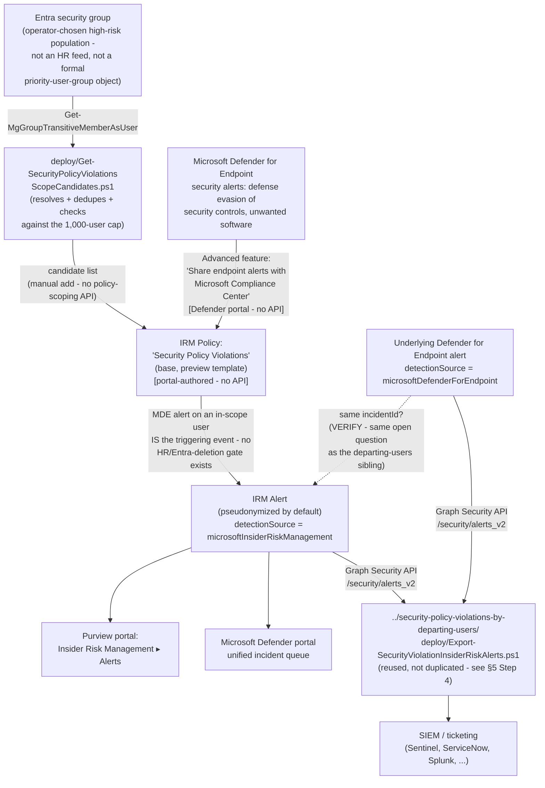

> **Preview feature.** Microsoft groups this template with its departing-users, priority-users, and
> risky-users siblings under the "Intentional or unintentional security policy violations
> **(preview)**" scenario heading. Preview features can change or be withdrawn
> with less notice than GA capabilities; re-verify current status before a customer-facing
> commitment.

## 1. Scenario summary

Deploys Microsoft Purview Insider Risk Management's **Security policy violations** policy
template, the base member of the same template family as
`scenarios/insider-risk/security-policy-violations-by-departing-users/`, but with a materially
different scoping model: **no HR/departure trigger and no priority-user-group requirement.** Its
own triggering event *is* the security signal itself, "Defense evasion of security controls or
unwanted software detected by Microsoft Defender for Endpoint", so any
in-scope, Defender-for-Endpoint-onboarded user starts being scored the moment their device
generates a qualifying alert, with no employment-status or priority-group gate in front of it.

**Who it's for:** a tenant that runs Microsoft Defender for Endpoint and wants continuous
security-violation risk scoring for a bounded, deliberately chosen population, privileged/IT
users, engineers with local admin rights, contractors on managed devices, where neither the
departing-users template's HR/Entra-deletion trigger nor the priority-users template's formal
priority-user-group requirement fits the population being watched. **This is not a "monitor
everyone" control**: Microsoft caps this specific template at **1,000** actively-scored users
tenant-wide (§3, §6), smaller than either the departing-users (15,000) or risky-users (7,500)
siblings, and identical to the priority-users sibling's own cap despite this template requiring no
priority-group object. `design.md` §3 explains why "scores every onboarded user continuously" is
not an accurate description of what this template can do at any but a very small tenant's scale,
correcting that framing before it reaches a buyer.

## 2. Business/regulatory driver

Not every population an organization wants to watch for security-control tampering fits the
departing-users or priority-users templates' specific gating mechanisms. A contractor pool on
managed devices, a DevOps team with standing local-admin rights, or a help-desk group with elevated
troubleshooting permissions may never appear in an HR resignation feed and may not warrant the
administrative overhead of a formal priority-user-group definition, but disabling endpoint
security controls or installing unapproved software is exactly as risky coming from any of them as
from a departing employee. This scenario supports:

- **Continuous, always-on coverage for a defined high-risk population**, independent of employment
 status or a separately maintained priority-group object, the population is scoped once, at
 policy-creation time, by whoever selects the users/groups in the policy's "Users and groups"
 step.
- **SOC 2 / ISO 27001 endpoint-integrity monitoring evidence**, the same audit-evidence rationale
 the sibling scenario documents (`security-policy-violations-by-departing-users/README.md` §2),
 extended to a population defined by role or access level rather than departure status.
- **A lower-administrative-overhead alternative to the priority-users template** for a tenant that
 wants a bounded, high-risk population watched but doesn't want to build and maintain a formal
 **priority user group** object in Insider Risk Management settings ([RBAC model §4](/docs/rbac-model/#4-purview-role-groups-by-module-representative-not-exhaustive);
 `insider-risk-management-settings-priority-user-groups`), a plain Entra security group, resolved
 by this scenario's own `deploy/Get-SecurityPolicyViolationsScopeCandidates.ps1`, is enough.

No regulation names this specific control by requirement number, the same honest framing this
library's other Insider Risk Management scenarios use (e.g.
`security-policy-violations-by-departing-users/README.md` §2).

## 3. Prerequisites

Full licensing detail and citations: [Licensing matrix §2](/docs/licensing-matrix/#2-master-capability--license-matrix) (Insider Risk Management row)
and §7 (Defender for Endpoint). This template's prerequisite set is a strict subset of the
departing-users sibling's, **no HR connector, no Entra-deletion trigger configuration, and no
priority user group** are required or even applicable:

| Requirement | Minimum | Notes |
|---|---|---|
| Insider Risk Management (all policies) | **Microsoft 365 E5/A5/G5**, **Microsoft Purview Suite**, or the **Microsoft 365 E5 Insider Risk Management** add-on | Same base entitlement as every IRM scenario in this library |
| **Microsoft Defender for Endpoint**, active subscription | Microsoft's own prerequisite table for this template states only **"Active Microsoft Defender for Endpoint subscription,"** with no Plan 1/Plan 2 qualifier | Same open Plan 1/Plan 2 VERIFY the departing-users sibling already carries, see that scenario's `README.md` §3 and §11; not re-litigated here |
| Defender for Endpoint → Purview alert sharing | "Share endpoint alerts with Microsoft Compliance Center" advanced feature, enabled in the Microsoft Defender portal | Portal-only toggle, no documented Graph/PowerShell equivalent, identical mechanism to the sibling scenario's §5 Step 2 |
| Role to configure policies/settings | **Insider Risk Management** or **Insider Risk Management Admins** role group | [RBAC model §4](/docs/rbac-model/#4-purview-role-groups-by-module-representative-not-exhaustive) |
| Role to configure the Defender for Endpoint advanced feature | Microsoft Entra **Security Administrator** (basic permissions), or the granular **Manage security settings in Security Center** permission (legacy Defender for Endpoint RBAC) / **Core security settings (Manage)** permission (Defender unified RBAC) | [RBAC model §12](/docs/rbac-model/#12-microsoft-defender-for-endpoint-portal-rbac-an-eighth-system-for-scenarios-that-configure-defender-for-endpoint-tenant-wide-settings) |
| Automation identity for scope resolution | App registration with the Microsoft Graph **`GroupMember.Read.All`** application permission, certificate-based | Used by `deploy/Get-SecurityPolicyViolationsScopeCandidates.ps1`, a different permission than the sibling's alert-export identity, but the same app-only certificate pattern ([Automation surface §3](/docs/automation-surface/#3-authentication-patterns-interactive-vs-unattended)) |
| Automation identity for alert export (optional, reused) | App registration with the Microsoft Graph **`SecurityAlert.Read.All`** application permission, certificate-based | Only needed if reusing `../security-policy-violations-by-departing-users/deploy/Export-SecurityViolationInsiderRiskAlerts.ps1` per §5 Step 4 below, same identity that scenario already uses can be reused here too |

> Verify current entitlement names against [Licensing matrix](/docs/licensing-matrix/) and the Product Terms before
> a sales commitment, SKU names change, and this template is Microsoft-labeled preview.

## 4. Architecture



Full rule-by-rule rationale is in `design.md` §4-6.

## 5. Step-by-step implementation

### Step 1, Assign permissions

Confirm the operator is a member of **Insider Risk Management** or **Insider Risk Management
Admins** (Purview role group), and has a Defender for Endpoint role capable of changing advanced
features (Step 2 below), typically **Security Administrator**, or the granular permission
[RBAC model §12](/docs/rbac-model/#12-microsoft-defender-for-endpoint-portal-rbac-an-eighth-system-for-scenarios-that-configure-defender-for-endpoint-tenant-wide-settings) documents.

### Step 2, Enable the Defender for Endpoint → Purview alert-sharing feature (manual, one-time)

Identical to the sibling scenario's §5 Step 2, **skip this step entirely if
`security-policy-violations-by-departing-users` is already deployed in this tenant**, since the
toggle is tenant-wide, not per-policy (`rollback.md` Stage 2 flags the same coupling here).

1. Sign in to the [Microsoft Defender portal](https://security.microsoft.com).
2. **Settings** → **Endpoints** → **Advanced features**.
3. Locate **Share endpoint alerts with Microsoft Compliance Center** and toggle it **On**.
4. Select **Save preferences**.

### Step 3, Resolve and size the policy's user population (scripted, read-only)

Because this template has no built-in population mechanism (no HR feed, no priority-user-group
requirement) and Microsoft caps it at **1,000** actively-scored users tenant-wide (§6), deliberately
choose a bounded population **before** creating the policy rather than defaulting to "all users", 
see `design.md` §3 for why an all-users scope would silently exceed the cap in any but a very small
tenant.

```powershell
Connect-MgGraph -ClientId $AppId -TenantId $TenantId -CertificateThumbprint $Thumbprint

# Dry run, shows the query plan, calls nothing
./deploy/Get-SecurityPolicyViolationsScopeCandidates.ps1 -GroupId $PrivilegedUsersGroupId -WhatIf

# Resolve one or more Entra security groups' transitive user membership, dedupe across groups,
# filter to enabled accounts, and check the combined count against the 1,000-user cap
./deploy/Get-SecurityPolicyViolationsScopeCandidates.ps1 -GroupId $PrivilegedUsersGroupId, $ContractorsGroupId -OutputPath ./scope-candidates.csv
```

This script is **read-only**, it never touches the IRM policy or the Entra group itself, only
reads and reports (`design.md` §2 goal 2). It cannot account for users already in scope of *other*
policies built from this same template elsewhere in the tenant, Microsoft's own cumulative,
per-template-type limit (§6) has no documented Graph/REST query API to read current usage against,
the same class of gap already established for the IRM alert audit log
(`docs/PROGRESS.md`'s "Follow-ups discovered while building the IRM case-escalation-to-eDiscovery
scenario"). Flagged in §11 and the script's own `.NOTES`, not silently assumed away.

### Step 4, Create the Insider Risk Management policy (portal, not scriptable)

Purview portal → **Insider Risk Management** → **Policies** → **Create policy**:

1. Template: **Security policy violations**. Confirm this is the base template and not one of its
 three siblings (by departing users / by priority users / by risky users), all four share the
 same "Security policy violations…" naming prefix in the template picker.
2. Name: `Security Policy Violations`. The template and name can't be changed after policy creation
, confirm before continuing.
3. **Users and groups**: select **Include specific users and groups**, then add the candidate
 population resolved in Step 3, either the source Entra group(s) directly (Microsoft documents
 Microsoft 365 groups, distribution groups, and both mail-enabled and non-mail-enabled security
 groups as supported scope types), or the individual users from
 `scope-candidates.csv` if a tighter, hand-curated subset is preferred. **Do not select "Include
 all users and groups"** unless the tenant's total user count is confidently under the 1,000-user
 template cap (§6), see `design.md` §3. **VERIFY (pilot tenant):** whether adding the group
 itself keeps the policy's in-scope population in sync with future group-membership changes, or
 captures membership as a snapshot at the moment the group is added, Microsoft's own
 documentation doesn't state this either way, and this scenario's §8/§11 operational guidance
 (periodic re-review) applies regardless of which behavior turns out to be true.
4. **Triggering events**: none to configure, this template's only trigger is the Defender for
 Endpoint security-violation signal itself, already enabled by Step 2. Unlike
 the departing-users sibling, there is no HR-connector or Entra-account-deletion toggle on this
 template's workflow.
5. **Indicators**: select the **Microsoft Defender for Endpoint indicators (preview)** category.
 As with the departing-users sibling, Microsoft's documentation does not enumerate the individual
 indicator names under this category, **VERIFY against the live policy-creation workflow at
 deploy time** which specific indicator toggles appear, and whether any other indicator
 categories are also selectable for this specific template; not confirmed by Microsoft Learn
 during this build.
6. **Review and submit.**

Use `deploy/policy/security-policy-violations-policy-manifest.json` as the checklist/reference
while completing this workflow, it is not consumed by any API (see the file's own `_comment`
field and `design.md` §4).

### Step 5, Export correlated alerts for SIEM/ticketing integration (scripted, read-only, reused)

This scenario does not ship a second copy of the sibling scenario's alert-export script, Microsoft
Graph's `alerts_v2` query this scenario would need is identical (both `detectionSource` values,
joined client-side by `incidentId`), and the sibling's script already applies no policy-specific
filter, so it works unmodified against this policy's own alerts (`design.md` §2 goal 3):

```powershell
Connect-MgGraph -ClientId $AppId -TenantId $TenantId -CertificateThumbprint $Thumbprint

../security-policy-violations-by-departing-users/deploy/Export-SecurityViolationInsiderRiskAlerts.ps1 `
    -SinceDateTime (Get-Date).AddDays(-1) -OutputPath ./security-violation-alerts.json
```

**Caveat carried over unchanged from the sibling scenario:** if both this policy and the
departing-users (or any other "Security policy violations…" family) policy are deployed in the same
tenant, this export cannot tell which policy produced a given alert, `alertPolicyId` is exported as
raw, unmapped data (sibling `README.md` §11; not repeated in full here).

### Step 6, Validate

```powershell
./validate/Test-SecurityPolicyViolationsIrmSetup.ps1
```

## 6. Configuration reference

| Setting | Value this scenario uses | Notes |
|---|---|---|
| Policy template | `Security policy violations` **(preview)**, the base template | Cannot be changed after creation |
| Triggering event | Defense evasion of security controls or unwanted software, detected by Microsoft Defender for Endpoint | Not optional/configurable, this **is** the template's only trigger; no HR/Entra-deletion toggle exists on this template |
| Indicator category | **Microsoft Defender for Endpoint indicators (preview)** | Individual indicator names not enumerated by Microsoft as of this writing, VERIFY at deploy time (§5 Step 4) |
| Maximum users in scope | **1,000** (Microsoft-fixed limit for this template, tenant-wide across all policies built from it) |, identical to the priority-users sibling's own cap despite requiring no priority-group object; smaller than the departing-users (15,000) and risky-users (7,500) siblings, do not conflate the four |
| Population mechanism | Operator-selected Entra security group(s) or individual users, resolved by `deploy/Get-SecurityPolicyViolationsScopeCandidates.ps1` | No HR connector, no formal priority-user-group requirement, a plain Entra group is sufficient |
| Defender for Endpoint alert-sharing dependency | "Share endpoint alerts with Microsoft Compliance Center" advanced feature (tenant-wide) | Same portal-only mechanism as the departing-users sibling, §5 Step 2 |
| User-identity privacy | Pseudonymized (Microsoft default) | Not disabled by this scenario |
| Alert export mechanism | Reused: `../security-policy-violations-by-departing-users/deploy/Export-SecurityViolationInsiderRiskAlerts.ps1`, unmodified | No policy-specific filter exists in that script or in the underlying Graph API, works against any "Security policy violations…" family policy's alerts |
| Cross-policy-template disambiguation | Not attempted, same disclosed gap as the sibling scenario | `alertPolicyId` is exported as raw, unmapped data, sibling `README.md` §11 |

## 7. Validation / how to prove it works

1. **Automated checks**, `./validate/Test-SecurityPolicyViolationsIrmSetup.ps1` confirms the
 Graph session and `GroupMember.Read.All` permission actually work (probed against the same
 group(s) used for scoping, or any group ID supplied), and separately confirms
 `SecurityAlert.Read.All` if an alert-export smoke test is requested. Exits non-zero on a hard
 failure.
2. **Manual checklist**, the same script prints a checklist for the portal-only configuration
 (policy existence/template/state, Defender for Endpoint advanced-feature toggle, role groups,
 in-scope user count against the 1,000 cap), see `design.md` §4 for why these can't be
 automated.
3. **End-to-end functional test (non-production names only, pilot tenant)**, add a disposable test
 account to the scoped population's Entra group, confirm it appears onboarded to Defender for
 Endpoint, then trigger a benign detection your test plan already uses (e.g., the standard
 [EICAR test file](https://learn.microsoft.com/defender-endpoint/attack-simulations) or a
 documented attack simulation) rather than actually disabling a security control. Confirm an
 alert appears in **Insider Risk Management** → **Alerts** and that the reused export script
 (§5 Step 5) retrieves it.
4. **Evidence trail**, the alert's **Activity explorer** tab shows the specific Defender for
 Endpoint alert(s) that contributed to the score.

## 8. Operations & tuning

- **Re-scope on group membership change, not only on a calendar cadence.** Because it isn't
 documented whether the policy's in-scope population tracks the source group's live membership
 (§5 Step 4, §11), treat a **newly added member of the source privileged group as unmonitored
 until an operator manually re-applies scope in the portal**, the higher-severity risk direction,
 since the population this template targets (privileged/IT/elevated-access users) is exactly the
 group where a coverage gap matters most. Tie re-running
 `Get-SecurityPolicyViolationsScopeCandidates.ps1` and re-applying the portal scope to the same
 process that adds someone to the source group (e.g., a step in the privileged-access-onboarding
 checklist), not only to a periodic calendar review. A quarterly review remains a reasonable
 **backstop** for catching drift missed by the event-driven process, not the primary control.
- **Defender for Endpoint alert-sharing health.** Same standing item as the sibling scenario's
 README §8, if the "Your organization doesn't have a Microsoft Defender for Endpoint
 subscription" or "Microsoft Defender for Endpoint alerts aren't being shared with the Microsoft
 Purview portal" policy-health notifications appear, this policy silently
 stops scoring new activity even though it looks correctly configured in the portal.
- **Incident-response runbook (alert triage)**, identical to the departing-users sibling's runbook
 (`security-policy-violations-by-departing-users/README.md` §8), reusing the same exported
 `RelatedDefenderAlerts` field from Step 5's export script.
- **Preview status is a rollout-pacing decision, not just a documentation footnote.** Same
 recommendation as the sibling scenario: pilot against a narrow population for at least one full
 activation-window cycle before treating this as a permanent, tenant-wide control in a
 customer-facing commitment.
- **Population-selection accountability.** Because this template does not have Microsoft's own
 built-in "priority user group" governance model (a named, auditable object with its own settings
 page) or an HR-driven trigger, the population choice is entirely the deploying operator's, a
 weaker built-in accountability trail than either sibling. Document the population-selection
 rationale (which group(s), why) outside this scenario's own artifacts, e.g., in the change
 ticket that authorized deployment, since Insider Risk Management itself doesn't capture "why
 was this group chosen" anywhere queryable.

## 9. Rollback / decommission

See `rollback.md`. Quick reference: pausing the policy or removing groups from scope is reversible
in seconds; deleting the policy, or revoking the scope-resolution app registration's certificate, is
not.

## 10. Cost & licensing notes

- **No incremental license cost beyond the departing-users sibling's own baseline** if that
 scenario (or any other Defender-for-Endpoint-dependent Purview control) is already deployed in
 the tenant, this scenario adds no new licensing tier requirement, only a different policy
 configuration.
- **Sizing note specific to this template:** because the 1,000-user cap applies **across all
 policies built from this exact template** in the tenant (§6), a buyer already running a "Security
 policy violations" (base) policy elsewhere, e.g., from a prior, undocumented deployment, has
 less headroom than this scenario's own §5 Step 3 sizing check alone would suggest. Confirm no
 other base-template policy already exists before sizing a new population (manual portal check, 
 no Graph/REST usage-count API exists, per §5 Step 3).
- **No additional cost for the scope-resolution or alert-export automation**, both use
 application permissions already covered by the base Microsoft Graph SDK, no metered API.

## 11. Known limitations & gotchas

- **Preview feature, twice over**, same status as the departing-users sibling: both the overall
 template family and the Defender for Endpoint indicator category it depends on are
 Microsoft-labeled **preview**, re-verify GA status before a
 customer-facing commitment.
- **The 1,000-user template-wide cap has no query API to check current usage against.** Neither
 `Get-SecurityPolicyViolationsScopeCandidates.ps1` nor any other script in this repo can confirm
 how many users are already in scope of other policies sharing this template, Microsoft
 documents only a portal-visible **Users in scope** column on the Policies tab (§5 Step 3,
 §10). This is a genuine, disclosed gap, not a fabricated workaround.
- **"Scores every onboarded user continuously" (the framing this fragment's originating backlog
 item used) is not an accurate operating model at enterprise scale.** The 1,000-user cap makes a
 tenant-wide "all users" scope infeasible for any organization above roughly that headcount, 
 `design.md` §3 documents this correction explicitly; this scenario deliberately recommends a
 bounded, role-based population instead.
- **No documented Graph/PowerShell surface for the Defender for Endpoint advanced-features toggle**
, same portal-only boundary as the sibling scenario; not fabricated here either.
- **The `incidentId` join in the reused export script is best-effort, not guaranteed**, see the
 sibling scenario's own `README.md` §11 and `design.md` §2 goal 5/§5 for the full grounding
 discussion; not re-litigated here since the mechanism is identical.
- **Cannot disambiguate which "Security policy violations…" template produced a given exported
 alert if more than one is deployed in the same tenant**, including this scenario's own base
 template running alongside its departing-users, priority-users, or risky-users siblings. Same
 disclosed gap as the sibling scenario (`design.md` §6 there).
- **This scenario does not configure the …by priority users or …by risky users templates**, 
 each is its own candidate follow-up fragment with a materially different scoping model, not
 bundled here. `design.md` §7.
- **This scenario does not configure Adaptive Protection**, same non-goal as every other Insider
 Risk Management scenario in this library.
- **This control is invisible to an offline or physical attack on the endpoint itself**, same
 structural EDR-sourced-signal limit already documented for the departing-users sibling
 (`security-policy-violations-by-departing-users/README.md` §11); pair with physical/
 device-encryption controls for that risk, not a tighter IRM policy.
- **The "Share endpoint alerts with Microsoft Compliance Center" toggle is tenant-wide, not
 per-policy**, enabling or disabling it affects every "Security policy violations…" family
 policy in the tenant simultaneously, including this scenario's own policy and any others deployed
 independently of it. Same coupling the sibling scenario's `rollback.md` Stage 2 already flags.
- **`Get-SecurityPolicyViolationsScopeCandidates.ps1` resolves group membership at the moment it
 runs, it is not a live sync.** Adding or removing a user from the source Entra group afterward
 has no effect on this script's own output until it's re-run.
- **Whether the IRM policy scope itself stays in sync with the source group's future membership
 changes (if the group was added directly, §5 Step 4) is not clearly documented by Microsoft
 either way**, a genuinely open question, not just a limitation of this scenario's own tooling.
 Treat both possibilities as live: **VERIFY (pilot tenant)** before assuming either dynamic
 following or a static snapshot, and re-run this scenario's scope-sizing script and manually
 re-confirm the portal scope on the same periodic cadence regardless (§8), that guidance holds
 whichever way this resolves.

## 12. References

1. Learn about Insider Risk Management, Scenarios ("Intentional or unintentional security policy violations (preview)"), <https://learn.microsoft.com/purview/insider-risk-management#scenarios>
2. Learn about Insider Risk Management policy templates, Security policy violations (description, prerequisites/triggering-events table), <https://learn.microsoft.com/purview/insider-risk-management-policy-templates#security-policy-violations>
3. Create and manage Insider Risk Management policies, policy health (HR connector shared across the departing-user templates; base "Security policy violations" is not part of that HR-connector group), <https://learn.microsoft.com/purview/insider-risk-management-policies#policy-health>
4. Configure advanced features in Defender for Endpoint, "Share endpoint alerts with Microsoft Compliance Center" (portal steps, no API), <https://learn.microsoft.com/defender-endpoint/advanced-features#share-endpoint-alerts-with-microsoft-compliance-center>
5. Create and manage Insider Risk Management policies (template/name immutable after creation), <https://learn.microsoft.com/purview/insider-risk-management-policies>
6. Limits in Insider Risk Management, maximum users in scope per policy template (1,000 for "Security policy violations", identical to "…by priority users"; 15,000 for "…by departing users"; 7,500 for "…by risky users"), <https://learn.microsoft.com/purview/insider-risk-management-limits#maximum-number-of-users-in-scope-for-a-policy-template>
7. Learn about Insider Risk Management policy templates, Security policy violations (Defender for Endpoint subscription + integration prerequisite), <https://learn.microsoft.com/purview/insider-risk-management-policy-templates#policy-template-prerequisites-and-triggering-events>
8. List group transitive members, OData cast (`/transitiveMembers/microsoft.graph.user`), required `ConsistencyLevel: eventual` header, permissions (`GroupMember.Read.All` among the higher-privileged options), <https://learn.microsoft.com/graph/api/group-list-transitivemembers?view=graph-rest-1.0>
9. Get-MgGroupTransitiveMemberAsUser (PowerShell cmdlet reference, `Microsoft.Graph.Groups` module, output type `IMicrosoftGraphUser`), <https://learn.microsoft.com/powershell/module/microsoft.graph.groups/get-mggrouptransitivememberasuser>
10. Get started with Insider Risk Management, Step 6, Users and groups page (supported scope group types: Microsoft 365 groups, distribution groups, mail-enabled and non-mail-enabled security groups), <https://learn.microsoft.com/purview/insider-risk-management-configure#step-6-required-create-an-insider-risk-management-policy>
11. alert resource type, `alertPolicyId`, `incidentId`, `detectionSource` properties, <https://learn.microsoft.com/graph/api/resources/security-alert>
12. Microsoft Graph permissions reference (`GroupMember.Read.All`, `SecurityAlert.Read.All`), <https://learn.microsoft.com/graph/permissions-reference>

> Re-verify all links, cmdlet/API behavior, and licensing terms against current Microsoft Learn
> before a customer-facing assessment or sale, this template family is explicitly Microsoft-
> labeled preview and could change materially before reaching general availability.
