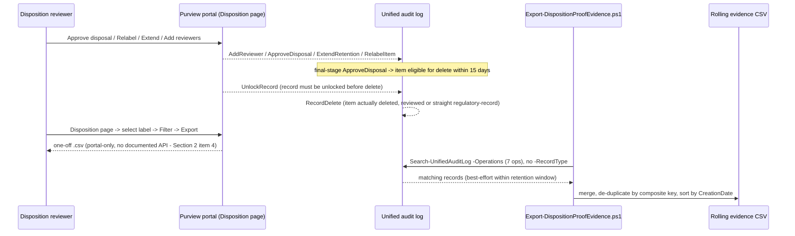

## 1. Problem statement

`scenarios/records-management/regulatory-records-disposition/README.md` Section 7 promises that
disposal is "reviewed, evidenced" and that "proof of disposition" is retained, but stops at
pointing to the portal's **Disposition** page. Every records-management scenario in this repo that
ends in disposition (`regulatory-records-disposition`, `multi-stage-disposition-review`) shares the
same open question: when an auditor, examiner, or regulator asks "prove item X was actually
disposed of, when, by whom, and that it was reviewed (or correctly not reviewed, for a straight
regulatory-record delete)," what do you hand them, and can producing it be automated? This scenario
closes that evidence loop.

## 2. What Microsoft documents (grounding)

1. **The portal-native path**: Records Management > **Disposition** page. Selecting a retention
   label shows a **Pending disposition** tab (time range by expiration date) and a **Disposed
   items** tab (time range by deletion date); both support **Filter** and **Export** to a `.csv`
   file [[1]](#references). Items disposed without a review stage (a straight regulatory-record
   delete) show `Type = Records Disposed` in this same view [[1]](#references).
2. **The audit-log path**: every disposition-review reviewer action has "a corresponding audit
   event in the Disposition review activities auditing activities group" [[1]](#references), listed
   by Microsoft as four Operations — `AddReviewer`, `ApproveDisposal`, `ExtendRetention`,
   `RelabelItem` [[2]](#references). Separately, a record (declared via a record label, reviewed
   or not) being deleted is captured as `RecordDelete` ("Deleted file marked as a record") under
   the **File and page activities** group, documented as applying to "documents and emails"
   [[1]](#references)[[3]](#references). Microsoft states plainly: "This functionality [the
   Disposition page] uses information from the unified audit log and therefore requires auditing to
   be enabled and searchable" [[1]](#references) — the audit log IS the underlying evidence store
   for the portal view, not a separate mechanism.
3. **No confirmed narrower `RecordType`.** Microsoft Graph's `auditLogRecordType` enum confirms two
   plausibly-relevant members by name and description — `RecordsManagement` ("Records management
   audit log record") and `MultiStageDisposition` ("Multi-stage disposition audit log record")
   [[4]](#references) — but no worked `Search-UnifiedAuditLog -RecordType ... -Operations
   ApproveDisposal` example was found pairing either value with the four disposition-review
   Operations. `RecordDelete` is documented under a SharePoint-oriented "File and page activities"
   table (the same table `Search-UnifiedAuditLog`'s own official example queries with `-RecordType
   SharePointFileOperation`) while its own description explicitly extends to Exchange email
   [[3]](#references)[[5]](#references) — an unresolved cross-workload ambiguity, not a documented
   dual-RecordType behavior. This repo already carries the identical class of gap for a different
   pair of Operations (`SharePointDataProactivelyPreserved`/`ExchangeDataProactivelyPreserved` in
   `scenarios/data-lifecycle-management/adaptive-protection-deleted-content-preservation/`) and
   resolved it the same way: **query by `-Operations` only, no `-RecordType` filter**, so a wrong
   guess never silently under-matches real evidence.
4. **No documented PowerShell/Graph equivalent of the portal's Filter+Export button.** The
   Disposition page's `.csv` export is a portal action with no cited cmdlet or REST call anywhere in
   Microsoft's `disposition` reference [[1]](#references), and no `security.dispositionReview*`
   Graph resource exposes a queryable collection of actual pending/disposed items — the only
   `disposition*`-named Graph resource found, `dispositionReviewStage`, models a retention label's
   **stage configuration** (reviewer list per stage), not a live disposition item or its outcome
   [[6]](#references). This scenario does not attempt to reproduce the portal export; it builds the
   complementary, schedulable trail the audit log does support.
5. **Access to disposition items is separately gated.** The **Disposition Management** role (in the
   Records Management role group, not granted to global admins by default) governs who can see and
   act on items in the portal Disposition page [[1]](#references) — a *different* role than what
   this scenario's own export script needs (**View-Only Audit Logs** / **Audit Logs**, the Exchange
   Online role `Search-UnifiedAuditLog` requires, per this repo's `docs/rbac-model.md` Section 6 and
   every other audit-trail script in this library). An identity with only Disposition Management
   cannot run this scenario's script, and vice versa — deliberately kept separate in README.md
   Section 3 rather than conflated.
6. **Record lock status is a documented, separate pair of events.** "Changed record status to
   locked" (`LockRecord`) and "Changed record status to unlocked" (`UnlockRecord`) are both listed
   under the same File and page activities table as `RecordDelete`, with Microsoft stating a locked
   record "wasn't modified or deleted" and that "only users assigned at least the contributor
   permission for a site can change the record status" [[3]](#references). Added to this scenario's
   query set after the four-lens review (`reviews.md`, Red Team finding 2) — an `UnlockRecord`
   immediately preceding a `RecordDelete` with no corresponding final-stage `ApproveDisposal` is
   context worth surfacing, since it's consistent with a record being deleted outside the reviewed
   disposition process.

## 3. Why a separate scenario (not folded into `regulatory-records-disposition/deploy/`)

The precedent in this repo for "add a proof/evidence export to an existing scenario's `deploy/`"
(`Export-EdiscoveryAuditTrail.ps1` under `premium-legal-hold-and-export/`,
`Export-AdaptiveProtectionPreservationEvidence.ps1` under
`adaptive-protection-deleted-content-preservation/`) is used when the evidence is specific to *one*
parent scenario's own objects. Disposition proof is not: it applies identically to
`regulatory-records-disposition`, `multi-stage-disposition-review`, and any future
records-management scenario that ends in either a disposition review or a plain regulatory-record
delete — none of the seven Operations this scenario queries are scoped to a specific label, event
type, or policy. Building it as its own scenario with an optional `-RetentionLabelName` filter
(Section 2, item 3 above; README.md Section 6) serves every sibling from one place, matching this
repo's module-taxonomy precedent of factoring a cross-cutting evidence concern out once it applies
to more than one scenario (`AGENTS.md` Section 2).

## 4. Object model and sequence

Two independent, complementary evidence paths from the same underlying audit log: the portal's
manual, per-label, one-off `.csv` (the Microsoft-documented "proof of disposition" mechanism), and
this scenario's scriptable, tenant-wide, schedulable rolling trail.

## 5. Key decisions

| Decision | Choice | Rationale |
|---|---|---|
| Scope | New standalone scenario, not folded into a sibling's `deploy/` | Applies identically to every disposition-ending records-management scenario (Section 3) |
| RecordType filter | None — `-Operations` only | No worked example confirms `RecordsManagement`/`MultiStageDisposition` for these Operations; a wrong guess would silently under-match (Section 2, item 3) |
| Label scoping | Optional `-RetentionLabelName`, best-effort AuditData property scan | No confirmed property name carries the label on these Operations; scanning avoids asserting a schema Microsoft hasn't published |
| Portal export | Documented, not scripted | No PowerShell/Graph equivalent exists (Section 2, item 4) — this scenario is additive, not a replacement |
| Idempotency | Rolling CSV, composite-key de-duplication | Identical, proven pattern from `premium-legal-hold-and-export` and `adaptive-protection-deleted-content-preservation` |
| Zero-row reporting | `[INCONCLUSIVE]`, never `[FAIL]` | A quiet window is not evidence of a broken control — same precedent as the AdaptiveProtection preservation validator |
| RBAC | Documented as separate from Disposition Management | The script's identity and a portal reviewer's identity are different roles by design (Section 2, item 5) |
| Lock-status context | `LockRecord`/`UnlockRecord` added to the query set | Surfaces out-of-process-deletion context; added after `reviews.md` Red Team finding 2 (Section 2, item 6) |

## 6. Failure modes and guardrails

| Failure mode | Guardrail |
|---|---|
| Record deleted outside the reviewed disposition process | `UnlockRecord`/`RecordDelete`/`ApproveDisposal` all captured together so the sequence can be reconciled; README.md Section 8 documents the specific pattern to watch for |
| Evidence CSV edited or deleted without detection | README.md Section 11 states plainly that composite-key de-duplication is not tamper-evidence, and recommends immutable/access-controlled storage for genuine evidentiary use |
| RecordType guess silently drops real evidence | No `-RecordType` filter at all (Section 2, item 3) |
| Zero-row window misread as "nothing was disposed" | Validator reports `[INCONCLUSIVE]`, prints the alternative explanations (README.md Section 11) |
| Duplicate rows across overlapping scheduled runs | Composite-key de-duplication (CreationDate + Operations + UserIds + AuditData hash) |
| Evidence lost past the audit retention window | README.md Section 8/10 documents the 180-day Standard / up to 1-year (E5 default) / up to 10-year (Premium add-on) tiers and recommends a cadence shorter than the shortest tier in play |
| Auditor asks for a specific label's evidence, tenant has many | `-RetentionLabelName` best-effort filter, disclosed as best-effort (not asserted exact) |
| Interim-stage `ApproveDisposal` mistaken for a completed disposal | Validator explicitly notes that an interim-stage approval moves the item to the next stage, not to deletion (README.md Section 6) |
| Reviewer role confused with export-script role | Both documented and kept explicitly separate (Section 2, item 5; README.md Section 3) |

## 7. Non-goals

- **Reproducing the portal's Filter+Export `.csv` button end-to-end via automation** — no documented
  API exists (Section 2, item 4); this scenario is a complement, not a replacement.
- **Distinguishing manual approval from autoapproval** inside `ApproveDisposal` — Microsoft states
  the same event covers both without naming the distinguishing field (README.md Section 11); the
  raw `AuditData` JSON is preserved so this can be extracted later once the field is identified.
- **Alerting/SIEM streaming** — this scenario produces a CSV; wiring it (or the underlying
  `Search-UnifiedAuditLog` query) into a SIEM is the documented extension covered by
  `scenarios/audit/streaming-to-sentinel-or-management-api/`.
- **Creating or configuring any retention label, event type, or policy** — purely read-only against
  existing disposition activity; the objects it reports on are created by
  `regulatory-records-disposition`, `multi-stage-disposition-review`, or any other
  records-management scenario, not by this one.
- **Per-stage disposition backlog reporting** (how many items are pending review right now, broken
  down by stage) — no documented PowerShell/Graph surface exists for this (a portal-only view);
  already tracked as an open follow-up under `multi-stage-disposition-review`.

## References

Full citation list, dates checked, and re-verification guidance: see `README.md` Section 12. Key
sources for the design decisions above:

1. Disposition of content — <https://learn.microsoft.com/purview/disposition>
2. Audit log activities — Disposition review activities — <https://learn.microsoft.com/purview/audit-log-activities#disposition-review-activities>
3. Audit log activities — File and page activities (`RecordDelete`) — <https://learn.microsoft.com/purview/audit-log-activities#file-and-page-activities>
4. `auditLogRecordType` enum type (Microsoft Graph) — <https://learn.microsoft.com/graph/api/resources/security-auditlogrecordtype>
5. Search-UnifiedAuditLog (worked example using `-RecordType SharePointFileOperation`) — <https://learn.microsoft.com/powershell/module/exchangepowershell/search-unifiedauditlog>
6. `dispositionReviewStage` resource type (Microsoft Graph) — <https://learn.microsoft.com/graph/api/resources/security-dispositionreviewstage>
