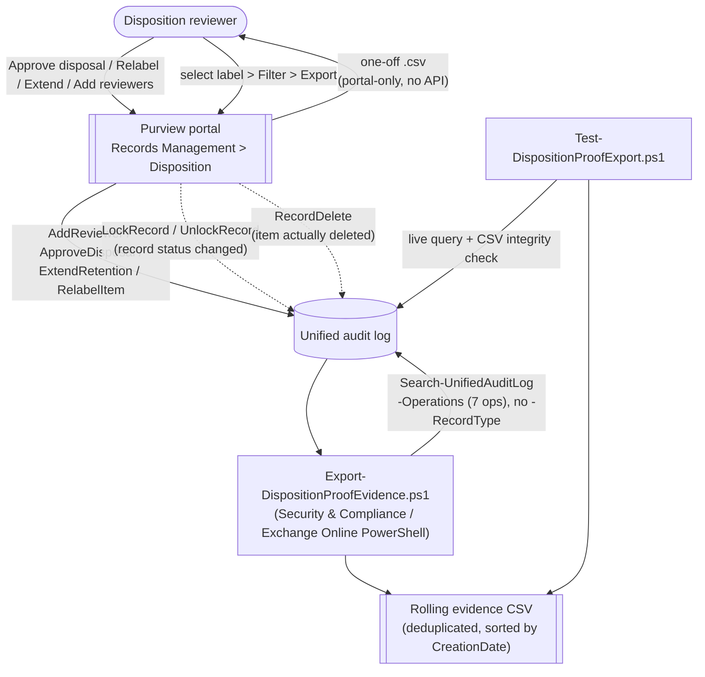

## 1. Scenario summary

Closes the "how do you prove it" question every disposition-ending records-management scenario in
this repo leaves at the portal's door. Documents the Microsoft-native **Disposition** page Filter +
Export workflow (the primary, portal-only "proof of disposition" mechanism), and adds a scriptable,
schedulable companion — `Export-DispositionProofEvidence.ps1` — that builds a rolling, deduplicated
audit trail of every disposition-review reviewer action and every record deletion, tenant-wide or
scoped to one retention label.

**Who it's for:** a records-management team, internal auditor, or compliance function that needs to
answer "prove item X was disposed of correctly — when, by whom, after what review" for an examiner,
regulator, or litigation hold release, without relying solely on a manual, one-off portal export.

**Companion to:** `scenarios/records-management/regulatory-records-disposition/` (whose README.md
Section 7 references this scenario for the evidence loop) and
`scenarios/records-management/multi-stage-disposition-review/` — both scenarios produce the
disposition activity this scenario reports on; neither creates or configures anything itself.

## 2. Business/regulatory driver

Retention schedules only satisfy **DoD 5015.02**, **SEC 17a-4 / FINRA 4511**, **GDPR/CCPA**
storage-limitation, and internal records policies if disposal can be **proven**, not just asserted.
Microsoft's own guidance is explicit that disposition "uses information from the unified audit log"
and requires auditing to be enabled before the fact [[1]](#references) — the audit trail is not
optional tooling here, it is the evidentiary record itself. An examiner asking "show me that this
record class was disposed of on schedule, with the required sign-off" is asking for exactly the two
things this scenario produces: the portal's own per-label export, and a rolling, tenant-wide
automation trail that survives beyond any single manual pull.

## 3. Prerequisites

Full licensing detail: `docs/licensing-matrix.md` Section 2. RBAC: `docs/rbac-model.md`. Automation
surface: `docs/automation-surface.md` (surface 3 — Exchange Online PowerShell,
`Search-UnifiedAuditLog`). Summary:

| Requirement | Minimum | Notes |
|---|---|---|
| Licensing | **Records management** (disposition review, record labels): **M365 E5 / E5 Compliance / Purview Suite** | Same tier as the parent disposition scenarios [[7]](#references) |
| Licensing | **Audit (Standard)**, included in most Microsoft 365/Office 365 plans; **Audit (Premium)** optional for longer retention | See §8/§10 for retention-tier implications |
| Role (portal Disposition page) | **Disposition Management** role (Records Management role group; not granted to global admins by default) | Governs who can view/act on items in the portal — `docs/rbac-model.md` §4 |
| Role (this scenario's export script) | **View-Only Audit Logs** or **Audit Logs** Exchange Online role | `Search-UnifiedAuditLog` is an Exchange Online cmdlet, not a Purview role group — `docs/rbac-model.md` §6. **Deliberately a different role than Disposition Management** — design.md §2 item 5 |
| Auth | `Connect-ExchangeOnline` (certificate app-only preferred) | `docs/automation-surface.md` §3 |
| Auditing | Enabled **at least one day** before the first disposition action | Required for the events this scenario queries to exist at all [[1]](#references) |

> Verify current entitlement names against `docs/licensing-matrix.md` (dated 2026-09-02) before a
> sales commitment — SKU names change.

## 4. Architecture



Two independent, complementary evidence paths off the same audit log: the portal's manual per-label
`.csv` (§5, Portal reference), and this scenario's scriptable, tenant-wide rolling trail. Full
rationale: `design.md`.

## 5. Step-by-step implementation

### Portal path (the Microsoft-documented "proof of disposition" mechanism)

1. **Purview portal** → **Records Management** → **Disposition**.
2. Select a retention label. If applicable, open its **Pending disposition** tab (time range by
   expiration date) or **Disposed items** tab (time range by deletion date) [[1]](#references).
3. Use **Filter** to narrow the view, then **Export** — produces a `.csv` you can sort and manage in
   Excel [[1]](#references). Items disposed with no review stage show `Type = Records Disposed`
   [[1]](#references).
4. This export is **manual and one-off per label** — there is no documented PowerShell or Graph
   equivalent (§11; `design.md` §2 item 4). Repeat it whenever a fresh, portal-sourced export is
   needed.

### Script path (this scenario's automation)

```powershell
# Connect (certificate app-only preferred - docs/automation-surface.md §3)
Connect-ExchangeOnline -AppId $AppId -Certificate $Cert -Organization 'contoso.onmicrosoft.com'

# 1. Dry run - queries the last 7 days tenant-wide, writes nothing
./deploy/Export-DispositionProofEvidence.ps1 -OutputCsvPath ./out/disposition-proof.csv -WhatIf

# 2. Build/merge the rolling evidence trail
./deploy/Export-DispositionProofEvidence.ps1 -OutputCsvPath ./out/disposition-proof.csv

# 3. Validate - live audit-log check + CSV structural integrity
./validate/Test-DispositionProofExport.ps1 -CsvPath ./out/disposition-proof.csv

# 4. Targeted pull for one records schedule (e.g. an examiner request)
./deploy/Export-DispositionProofEvidence.ps1 -StartDate (Get-Date).AddDays(-180) -EndDate (Get-Date) `
    -RetentionLabelName 'Contract Expiration - 7yr' -OutputCsvPath ./out/contract-expiration-audit.csv
```

Read-only against the tenant — the only side effect is the CSV file. `-WhatIf` still runs the
(read-only) audit-log query so the reported would-be-merged count is accurate.

## 6. Configuration reference

| Setting | Value this scenario uses | Notes |
|---|---|---|
| Query cmdlet | `Search-UnifiedAuditLog` | Exchange Online PowerShell [[5]](#references) |
| Disposition-review Operations | `AddReviewer`, `ApproveDisposal`, `ExtendRetention`, `RelabelItem` | Verbatim from Microsoft's "Disposition review activities" table [[2]](#references) |
| Record-deletion Operation | `RecordDelete` | "Deleted file marked as a record" — File and page activities [[3]](#references) |
| Record-lock-status Operations | `LockRecord`, `UnlockRecord` | Context, not disposition itself — a record must be unlocked before it can be modified/deleted by a user; added per `reviews.md` Red Team finding 2 [[3]](#references) |
| `RecordType` filter | **None** | No worked example confirms a narrower value for these Operations — `design.md` §2 item 3 |
| `ApproveDisposal` on an interim stage | Moves the item to the **next** disposition stage, not to deletion | Only the final (or only) stage's approval marks an item eligible for permanent delete, within **15 days** [[1]](#references) |
| `ApproveDisposal` via autoapproval | Same event as manual approval — "no new auditing event for autoapproval" | Distinguishing field not named by Microsoft — §11 VERIFY |
| Portal `Type = Records Disposed` | Item deleted with **no** disposition review (a plain regulatory-record delete) | Portal-only view; this scenario's `RecordDelete` query covers both reviewed and unreviewed cases [[1]](#references) |
| Disposition timelines | 15 days (post-approval delete) · 7–365 days, default 14 (autoapproval timeout) · up to 7 days (config propagation) | Cited from the parent scenarios' own §8; reproduced here for evidence-timing context [[1]](#references)[[10]](#references) |

Exact cmdlet syntax and Learn sources are cited in each script's `.NOTES`.

## 7. Validation / how to prove it works

1. **Automated (live query)** — `./validate/Test-DispositionProofExport.ps1` searches the same seven
   Operations and reports counts per Operation, most-recent-event details, and an explicit
   `[INCONCLUSIVE]` (never `[FAIL]`) note on a zero-row window.
2. **Automated (CSV integrity)** — `./validate/Test-DispositionProofExport.ps1 -CsvPath <path>`
   additionally checks the rolling CSV's structural integrity: non-empty and non-duplicate
   `CompositeKey` values, parseable `CreationDate` on every row, and ascending sort order. These ARE
   `[PASS]`/`[FAIL]` checks — they validate this scenario's own deterministic output, not tenant
   activity.
3. **Idempotency proof** — re-run `deploy/Export-DispositionProofEvidence.ps1` for the same window;
   the "new, non-duplicate record(s) to merge" count is `0` and the CSV is byte-for-byte unchanged in
   row count.
4. **Cross-check against the portal** — for one label, compare the script's `RecordDelete`/
   `ApproveDisposal` counts against the portal's own Filter+Export `.csv` for the same label and time
   range (§5, Portal path). They report the same underlying audit events through two different
   surfaces, so counts should reconcile once you account for the portal's per-label scoping versus
   this script's tenant-wide default.

## 8. Operations & tuning

**KPIs / signals:** count of `ApproveDisposal` events reaching a final stage vs. corresponding
`RecordDelete` events within 15 days (a reconciliation gap here is worth investigating); count of
`RecordDelete` events with `Type = Records Disposed` in the portal (unreviewed regulatory-record
deletes) vs. reviewed disposals; disposition backlog (pending items awaiting review — portal-only,
tracked as an open follow-up under `multi-stage-disposition-review`).

**Out-of-process-deletion pattern (Blue Team):** an `UnlockRecord` event shortly followed by a
`RecordDelete` with **no** corresponding final-stage `ApproveDisposal` in between is worth an
analyst's attention — it's consistent with a record being unlocked and deleted outside the reviewed
disposition process entirely, rather than through it. This scenario's scripts surface the raw
`LockRecord`/`UnlockRecord`/`ApproveDisposal`/`RecordDelete` events so this reconciliation is
possible; they do not themselves compute or alert on the pattern — for continuous, alerting-grade
monitoring at scale, feed this scenario's `-Operations` list into
`scenarios/audit/streaming-to-sentinel-or-management-api/` rather than relying on a scheduled CSV
pull alone.

**Cadence:** schedule `deploy/Export-DispositionProofEvidence.ps1` **daily or weekly** — deliberate
overlap between runs is safe (composite-key de-duplication). Because most retention periods span
years, disposition activity itself is bursty and infrequent per label; a rolling, longer-history CSV
is more useful for an examiner request than any single scheduled window.

**Retention-tier alignment:** run the export on a cadence **shorter than the shortest audit-retention
tier in play** — default **Audit (Standard)** retains most events 180 days; E5-licensed users'
Exchange/SharePoint/OneDrive/Entra ID events default to **1 year**; **Audit (Premium)** with the
10-year add-on extends this further [[8]](#references)[[9]](#references). A quarterly export cadence
is not safe on a Standard-only tenant; a monthly or more frequent cadence is.

**Change management:** treat the rolling CSV like any other compliance evidence artifact — if
committed to source control, its removal should be a deliberate, reviewed commit, not an ad hoc
delete (same discipline as `scenarios/data-estate-insights/sensitivity-label-coverage-report/`).

## 9. Rollback / decommission

See `rollback.md`. Quick reference: this scenario creates **no object inside Microsoft Purview** —
no policy, no label, no rule. There is nothing to disable or delete in the tenant. Rollback is
limited to stopping the export script's schedule and deciding what to do with already-produced CSV
files (which are themselves sensitive evidentiary records — handle accordingly, not as disposable
scratch output).

## 10. Cost & licensing notes

- **No separate meter.** Records Management and Audit (Standard) are per-user E5-tier entitlements
  already assumed by the parent disposition scenarios [[7]](#references); this scenario adds no new
  licensing requirement on top of them.
- **The real cost driver is audit-retention tier**, not this scenario's script. If an evidentiary
  window longer than 180 days (Standard) or 1 year (E5 default for Exchange/SharePoint/OneDrive/
  Entra ID) is required, **Audit (Premium)** — and its separate 10-year retention add-on — is the
  licensed way to extend it; this scenario's rolling CSV is a mitigation for tenants without Premium,
  not a substitute for it if the compliance requirement genuinely needs multi-year raw audit access
  [[8]](#references).
- **Storage cost of the CSV itself** is negligible at typical disposition-event volumes, but scales
  with tenant size and label count if run tenant-wide over long history.

## 11. Known limitations & gotchas

- **The rolling CSV is not itself tamper-evident.** Composite-key de-duplication prevents *accidental*
  duplicate rows across overlapping scheduled runs; it is not an integrity or signing mechanism. An
  identity with write access to `-OutputCsvPath` could edit or delete rows without detection by this
  scenario's own tooling. If this evidence needs to hold up as genuine "proof" for an examiner or in
  litigation, write it to storage with its own tamper-evidence (an immutable/WORM-configured Azure
  Storage container, or a source-control repository with signed commits and restricted write access)
  — not a general-purpose file share. This is a CISO-level consideration, not a cosmetic detail: the
  entire value of this scenario is undermined if the evidence artifact itself has a weaker chain of
  custody than the records it documents.
- **Microsoft recommends the Office 365 Management Activity API over `Search-UnifiedAuditLog` for
  production automation** ("If you want to programmatically download data from the Microsoft 365
  audit log, we recommend that you use the Microsoft 365 Management Activity API instead of using the
  Search-UnifiedAuditLog cmdlet in a PowerShell script" [[5]](#references)). This scenario uses
  `Search-UnifiedAuditLog`, matching every other audit-trail script in this library, because it needs
  no separate app-only Management API subscription/webhook setup for a scheduled pull-based script —
  but for continuous, near-real-time, high-volume streaming, `scenarios/audit/
  streaming-to-sentinel-or-management-api/` is the Microsoft-recommended path and should be preferred
  at that scale.
- **No `RecordType` filter is confirmed for these seven Operations.** `RecordsManagement` and
  `MultiStageDisposition` are both real, documented members of Microsoft Graph's
  `auditLogRecordType` enum [[4]](#references) and plausible candidates by name, but no worked example pairs either
  with `AddReviewer`/`ApproveDisposal`/`ExtendRetention`/`RelabelItem`. `RecordDelete` is documented
  under a SharePoint-oriented table while explicitly stated to apply to Exchange email too. This
  scenario deliberately omits `-RecordType` rather than guess — `design.md` §2 item 3.
- **VERIFY (pilot tenant): manual vs. autoapproved `ApproveDisposal`.** Microsoft states
  autoapproval reuses the same event rather than emitting a new one, without naming the
  distinguishing `AuditData` field. The raw `AuditData` JSON is preserved in every exported row so
  this can be extracted later once the field is identified, without a re-query.
- **VERIFY (pilot tenant): the `AuditData` property name for the retention label.** `-RetentionLabelName`
  performs a best-effort scan of every top-level string property on the parsed `AuditData` object
  rather than asserting a specific property name — no worked example was found confirming one for
  these Operations.
- **The portal's Filter+Export `.csv` cannot be scripted.** No documented PowerShell cmdlet or Graph
  endpoint reproduces it (`design.md` §2 item 4); the only `disposition*`-named Graph resource found,
  `dispositionReviewStage`, models a label's stage/reviewer configuration, not a live disposition
  item or its outcome [[6]](#references). This scenario's script is a complement, covering the same
  underlying audit events through a schedulable path, not a drop-in replacement for the portal
  workflow.
- **A zero-row result is not proof nothing was disposed.** It's equally consistent with no label
  having reached end-of-retention yet, a review-free label with nothing pending, or auditing enabled
  too recently to have captured the activity in question (§3). The validate script reports this as
  `[INCONCLUSIVE]`, never `[FAIL]`.
- **Disposition Management and the export script's Audit Logs role are deliberately separate.** An
  identity with only one of the two cannot do the other's job — see §3 and `design.md` §2 item 5.
- **Scope matches the portal's own**: "A disposition review can include content in Exchange
  mailboxes, SharePoint sites, and OneDrive accounts" [[1]](#references) — Microsoft Teams messages
  are not a disposition-review location, so this scenario's evidence trail inherits that same scope
  boundary, not a gap this scenario introduces.
- **Audit-retention tier limits what history is even reachable** — see §8/§10. This scenario cannot
  retrieve evidence for events that have already aged out of the tenant's configured retention
  window; schedule proactively, don't rely on a retroactive pull for old activity.

## 12. References

1. Disposition of content (portal Filter/Export, timelines, `Type = Records Disposed`, RBAC, audit-enablement prerequisite) — <https://learn.microsoft.com/purview/disposition>
2. Audit log activities — Disposition review activities (`AddReviewer`/`ApproveDisposal`/`ExtendRetention`/`RelabelItem`) — <https://learn.microsoft.com/purview/audit-log-activities#disposition-review-activities>
3. Audit log activities — File and page activities (`RecordDelete`, "documents and emails") — <https://learn.microsoft.com/purview/audit-log-activities#file-and-page-activities>
4. `auditLogRecordType` enum type — `RecordsManagement`/`MultiStageDisposition` members (Microsoft Graph) — <https://learn.microsoft.com/graph/api/resources/security-auditlogrecordtype>
5. Search-UnifiedAuditLog (`-RecordType`, `-Operations`, paging via `-SessionCommand ReturnLargeSet`) — <https://learn.microsoft.com/powershell/module/exchangepowershell/search-unifiedauditlog>
6. `dispositionReviewStage` resource type (Microsoft Graph — label stage configuration, not a live item) — <https://learn.microsoft.com/graph/api/resources/security-dispositionreviewstage>
7. Microsoft Purview service description — Records Management licensing — <https://learn.microsoft.com/office365/servicedescriptions/microsoft-365-service-descriptions/microsoft-365-tenantlevel-services-licensing-guidance/microsoft-purview-service-description>
8. Manage audit log retention policies (180-day Standard default, 1-year E5 default, 10-year Premium add-on) — <https://learn.microsoft.com/purview/audit-log-retention-policies>
9. Learn about auditing solutions in Microsoft Purview (Standard vs. Premium comparison) — <https://learn.microsoft.com/purview/audit-solutions-overview>
10. Maximum numbers for disposition review (retention-limits reference) — <https://learn.microsoft.com/purview/retention-limits#maximum-numbers-for-disposition-review>

> Re-verify all links, cmdlet parameters, licensing, and the `RecordType`/`AuditData`-field open
> questions against current Microsoft Learn before a customer-facing deployment. This scenario is
> read-only against the tenant — the only irreversible-adjacent risk is relying on a stale audit
> window; see §8/§11.
