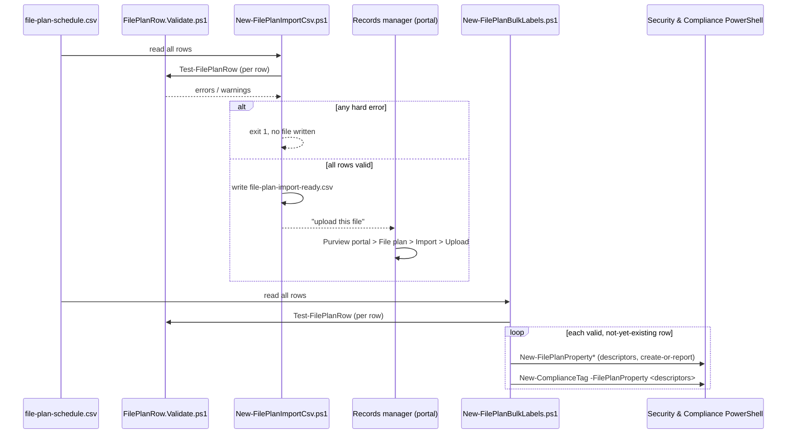

## 1. Problem statement

A real file plan is dozens of record classes at once, HR, Finance, Legal, IT, Sales, Compliance, 
each with its own retention action/duration/type, owning department, category, and legal citation.
Building that one label at a time in the portal doesn't scale, isn't reviewable as a diff, and drifts
easily from whatever spreadsheet Records/Legal actually approved. Microsoft Purview's answer is file
plan's own CSV **Import** feature, but that feature is portal-only (no API performs the upload), and
its validation rules (required columns, group dependencies, length limits, an immutable-after-save
`LabelName`) are easy to violate without noticing until the portal rejects a row. This scenario makes
the whole schedule a single versioned CSV, validates it exhaustively before it touches any tenant,
and ships two ways to actually apply it.

## 2. Design goals

1. **One schedule, two deploy paths.** The same CSV either becomes the file Microsoft's own Import
 button consumes, or drives a fully-scripted PowerShell bulk-create, a team picks per their
 tooling, without maintaining two schedules.
2. **Catch every documented validation rule locally.** Reproduce Microsoft's own import property
 table (required-ness, valid values, group dependencies, max lengths, `LabelName` charset) so a
 bad row fails here, with row number and column, not after a human uploads it.
3. **Never invent an API that doesn't exist.** The CSV import's upload step has no documented
 Graph/REST/PowerShell equivalent, say so plainly (§7, README §11) rather than imply one.
4. **Idempotent, create-or-report.** Path B never silently mutates an existing label or descriptor;
 records objects are high-consequence, matching the sibling `regulatory-records-disposition`
 scenario's philosophy.
5. **Honest about the two paths' feature gaps.** Path B can't set a citation's URL/jurisdiction (no
 documented cmdlet parameter for it); neither path supports multi-stage disposition review. Both
 are stated, not glossed over.
6. **A single source of validation truth.** One dot-sourced rule file
 (`FilePlanRow.Validate.ps1`) backs the generator, the bulk-create script, and the validator, so
 the three can't silently drift on what "valid" means.

## 3. Why bulk import (not one label per fragment)

- The sibling `regulatory-records-disposition` scenario already covers the **event-based, single
 class, deep** case (event type → label → publish → gated trigger). Building nine more
 near-identical single-class fragments would be repetitive scaffolding, not new coverage.
- A real records-management engagement's actual deliverable is **the file plan**, not one label, 
 vendor credibility here comes from showing the schedule-as-code pattern at the scale it's actually
 used, spanning departments/categories/citations, not a single toy label.
- Microsoft explicitly ships a bulk mechanism for exactly this (file plan CSV import), using it
 (and its scriptable equivalent) is the idiomatic, product-aligned answer, not a custom loop
 invented because "many labels" felt annoying to do by hand.

## 4. Object model and sequence

Both consumers call the identical `Test-FilePlanRow` function, the only difference is what happens
after a row passes: a file gets written for a human to upload, or PowerShell creates the objects
directly.

## 5. Key decisions

| Decision | Choice | Rationale |
|---|---|---|
| Source format | One CSV, columns = Microsoft's own import property names | No translation layer; the file that passes validation is directly the file the portal accepts |
| Validation | Shared, dot-sourced `Test-FilePlanRow`, not duplicated per script | Generator, bulk-create, and validate scripts can never silently disagree on "valid" |
| Path A upload | Left to a human | No documented API performs the CSV import upload, inventing one would violate `AGENTS.md` §4 |
| Path B descriptors | `New-FilePlanProperty*` create-or-report, then `-FilePlanProperty` JSON on the label | The documented PowerShell-native equivalent of the CSV's free-text descriptor columns |
| Idempotency | Create-or-report by name (labels and descriptors alike) | Records objects are high-consequence; `LabelName` and core settings are immutable after save anyway |
| Reviewer default | Sample schedule sets `ReviewerEmail` only where `RetentionAction=KeepAndDelete` | Matches the documented group dependency; a `KeepAndDelete` row with no reviewer auto-deletes with no review, both scripts warn |
| Regulatory records | Not exercised in the sample schedule | `Regulatory=TRUE` needs a tenant-level display setting this scenario can't check client-side; keeping the default sample independent of that pre-req avoids a false "it worked" on a misconfigured tenant |
| Dry-run | Custom `-DryRun` on the mutating script | `-WhatIf` is non-functional in S&C PowerShell (established pattern in this repo) |

## 6. Failure modes and guardrails

| Failure mode | Guardrail |
|---|---|
| A bad row reaches the portal or the tenant | `Test-FilePlanRow` reproduces every documented rule; both deploy scripts refuse a failing row before creating/uploading anything |
| Duplicate `LabelName` within the schedule itself | Both the generator and bulk-create script track seen names within the file and fail on a repeat |
| Duplicate `LabelName` already in the tenant | `-TenantChecks` (Path A) / the tenant-connected default (Path B) check `Get-ComplianceTag` first |
| `EventType` referenced before it exists | Both paths check `Get-ComplianceRetentionEventType`; an unmet reference is a hard error, not a warning |
| Silent auto-delete mistaken for reviewed disposition | `KeepAndDelete` with no `ReviewerEmail` is flagged `[WARN]` by every script that touches the row |
| Accidental mutation of an existing label | Create-or-report only; neither deploy script has an "update" mode |
| Citation URL/jurisdiction silently dropped in Path B | `New-FilePlanBulkLabels.ps1` warns explicitly when a row sets `CitationUrl`/`CitationJurisdiction` but only the citation name can be scripted |
| `Regulatory=TRUE` fails at upload for an unconfigured tenant | Flagged `[WARN]` by validation; sample schedule ships with none set |
| CSV/formula injection via a free-text cell (`=`, `+`, `-`, `@` leading a cell, or an embedded tab/CR/LF) opened later in a spreadsheet app | `Test-FilePlanRow` refuses any free-text column starting with those characters or containing a raw control character, a hard error, not a warning |

## 7. Non-goals

- **Multi-stage disposition review**, the CSV import doesn't support it and this scenario's
 PowerShell path uses single-stage `-ReviewerEmail` only; a dedicated fragment
 (`multi-stage-disposition-review`, `-MultiStageReviewProperty`) is tracked in `PROGRESS.md`.
- **Automating the portal upload itself**, no documented API exists for it; Path A always ends with
 a human clicking Upload.
- **Editing an existing schedule in place**, both deploy paths are create-or-report; a correction to
 an already-created row is a new row/label, per `LabelName`'s immutability.
- **Publishing or auto-applying the resulting labels**, this scenario only creates the file plan;
 publishing (`-PublishComplianceTag`, per the sibling scenario) or auto-apply is a separate,
 deliberate policy decision outside this fragment's scope.
- **Setting `CitationUrl`/`CitationJurisdiction` via PowerShell**, no documented
 `New-FilePlanPropertyCitation` parameter accepts them; Path B creates/links the citation name only
 and warns when a row also sets a URL/jurisdiction.
- **Exporting/reconciling an existing tenant's file plan back into this CSV format**, file plan's
 own **Export** produces a different shape than the Import template; round-tripping is a follow-up,
 not built here.
