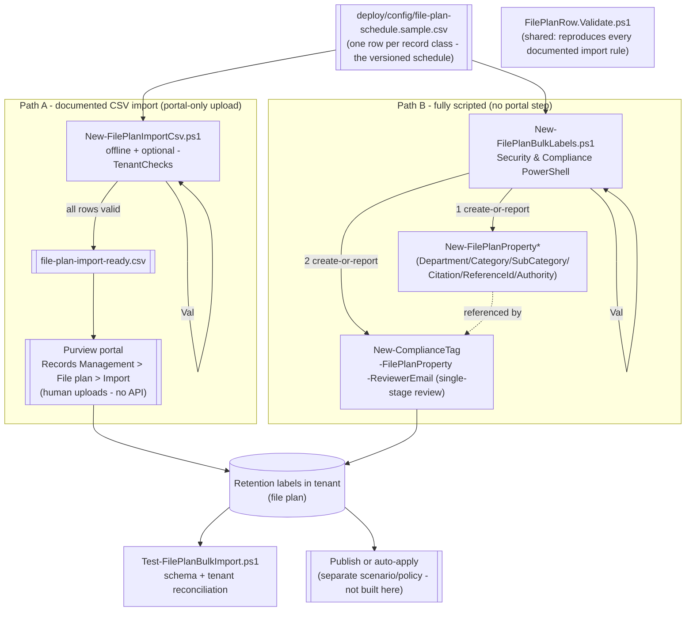

## 1. Scenario summary

Builds a **whole file plan** — many retention-label record classes spanning multiple departments,
categories, and legal citations — from a single versioned CSV schedule, instead of creating labels
one at a time in the portal. Ships **two** automation paths reading the **same** source file: (1) a
validator/generator for Purview's own documented **file plan CSV import** (portal-only — Microsoft
publishes no API for the upload step itself), and (2) a fully-scripted **PowerShell bulk-create**
equivalent (`New-ComplianceTag` + `New-FilePlanProperty*`) for teams who want zero portal
interaction.

**Who it's for:** a records-management or compliance team standing up (or migrating in) a real
records schedule — dozens of record classes across HR, Finance, Legal, IT, Sales, and Compliance —
who need it defined once, versioned, validated before it ever touches the tenant, and reproducible
across environments (pilot → production, or across MSSP client tenants).

**How it differs from the sibling `regulatory-records-disposition` scenario:** that scenario builds
the full lifecycle (event type → label → publish policy → gated trigger event) for **one**
representative event-based record class in depth. This scenario is the **breadth** complement: many
classes, mostly age-based (not event-based), created in bulk from a schedule — the multi-class
follow-up that scenario's own `design.md` §7 flagged as a non-goal.

## 2. Business/regulatory driver

A real organizational file plan is rarely one record class — it's the **entire retention schedule**:
personnel files, financial books and records, executed contracts, litigation holds, security logs,
signed customer agreements, and regulator correspondence, each with its own retention period,
authority, and department owner. Microsoft Purview's **file plan** is explicitly the tool for this:
it "lets you create retention labels interactively **or import in bulk**... labels support
additional administrative information to help you identify and track business or regulatory
requirements" [[3]](#references). Hand-building dozens of labels through the portal UI, one at a
time, doesn't scale and isn't reproducible or diffable for an examiner. Defining the schedule as a
single CSV — validated locally before it ever reaches the tenant — makes the whole file plan a
version-controlled artifact, and directly supports **SOX** (financial books and records), **FLSA**
(HR/payroll records), **IRS** recordkeeping requirements, and internal records-retention schedules
generally, each citable per-row via the **Provision/citation** file plan descriptor
[[3]](#references).

> ⚠️ **Two things a bulk import cannot do.** (1) It cannot configure **multi-stage** disposition
> review — the CSV import explicitly does not support it, and the PowerShell path here (single
> `-ReviewerEmail`) doesn't either; that's a tracked, separate follow-up
> (`multi-stage-disposition-review`, see PROGRESS.md). (2) It cannot **delete** or **update** a
> retention label in bulk — `LabelName` and its core retention settings are immutable after
> creation [[3]](#references), so a mistake in a shipped row means a **new**, correctly-named label,
> not an edit. Review the schedule carefully (`-DryRun` / offline validation) before creating
> anything.

## 3. Prerequisites

Full licensing detail: `docs/licensing-matrix.md`. RBAC: `docs/rbac-model.md`. Automation surface:
`docs/automation-surface.md` (surface 2 — Security & Compliance PowerShell). Summary:

| Requirement | Minimum | Notes |
|---|---|---|
| Licensing | **Records management** (file plan, retention labels): **M365 E5 / E5 Compliance / Purview Suite** | File plan import/export and record labels are E5 records-management capabilities [[7]](#references) |
| Role (file plan access, portal) | **Retention Manager** or **View-only Retention Manager** | Required to see/use the File plan page at all [[3]](#references) |
| Role (create objects, PowerShell) | **Records Management** role group (RecordManagement / Retention Management roles) | `docs/rbac-model.md` — needed for `New-ComplianceTag` / `New-FilePlanProperty*` |
| Reviewers | Individual users, distribution groups, or security groups | `ReviewerEmail`; multiple addresses separated by **semicolons** in the CSV, by **comma/array** in the `-ReviewerEmail` cmdlet parameter — a genuine syntax difference between the two paths (§11) |
| Auth | `Connect-IPPSSession` (certificate app-only preferred) | Security & Compliance PowerShell — `docs/automation-surface.md` §3 |
| Portal path (CSV-import route only) | Records Management → File plan → Import | Human uploads the validated CSV — there is no API/cmdlet for this step (§11) |

> Verify current entitlement names against `docs/licensing-matrix.md` (dated 2026-09-02) before a
> sales commitment — SKU names change.

## 4. Architecture



Both paths validate against the **same** rule set (`FilePlanRow.Validate.ps1`) before touching the
tenant, so a row that would fail the portal's own import validation fails identically here — before
a human uploads anything, or before PowerShell creates anything. Full rationale: `design.md`.

## 5. Step-by-step implementation

```powershell
# --- Path A: documented CSV import (portal upload) ---
# 1. Offline validation - no tenant connection needed
./deploy/New-FilePlanImportCsv.ps1 -InputPath ./deploy/config/file-plan-schedule.sample.csv

# 2. (Recommended) also check LabelName-uniqueness and EventType-exists against your tenant
Connect-IPPSSession -AppId $AppId -Certificate $Cert -Organization 'contoso.onmicrosoft.com'
./deploy/New-FilePlanImportCsv.ps1 -TenantChecks -OutputPath ./deploy/config/file-plan-import-ready.csv

# 3. Upload file-plan-import-ready.csv via the portal:
#    Purview portal > Records Management > File plan > Import > Download a blank template (once, to
#    confirm current column order) > Upload a file > select file-plan-import-ready.csv

# --- Path B: fully scripted, no portal step ---
Connect-IPPSSession -AppId $AppId -Certificate $Cert -Organization 'contoso.onmicrosoft.com'
./deploy/New-FilePlanBulkLabels.ps1 -DryRun          # prints every cmdlet, creates nothing
./deploy/New-FilePlanBulkLabels.ps1                  # creates descriptors + labels, idempotent

# --- Either path: validate ---
./validate/Test-FilePlanBulkImport.ps1
```

### Portal reference

File plan lives in the [Microsoft Purview portal](https://purview.microsoft.com) under **Records
Management → File plan**; the **Import** button is on that page, and file-plan descriptor picklists
(Department/Category/etc.) can also be managed there directly [[3]](#references). `-WhatIf` is
non-functional in S&C PowerShell, so `New-FilePlanBulkLabels.ps1` ships a `-DryRun` instead.

## 6. Configuration reference

The source CSV's columns are Microsoft's own documented file-plan-import property names
[[3]](#references) — both automation paths read the identical file:

| Column | Required | Notes |
|---|---|---|
| `LabelName` | Yes | ≤64 chars; only `a-z A-Z 0-9 - ` (space); unique in tenant; **immutable after save** |
| `Comment` / `Notes` | No | ≤1024 chars each (admin-only / user-facing description) |
| `IsRecordLabel` | No* | `TRUE`/`FALSE`; group-required with the retention trio below once set |
| `RetentionAction` | No* | `Delete` \| `Keep` \| `KeepAndDelete`; required once Duration/Type/ReviewerEmail are set |
| `RetentionDuration` | No* | `Unlimited` or 1–36525 (days); required once Action/Type are set |
| `RetentionType` | No* | `CreationAgeInDays` \| `EventAgeInDays` \| `TaggedAgeInDays` \| `ModificationAgeInDays` |
| `ReviewerEmail` | No | Requires `RetentionAction=KeepAndDelete`; **semicolon**-separated in the CSV, array/comma in the cmdlet (§11) |
| `ReferenceId` / `DepartmentName` / `Category` / `SubCategory` / `AuthorityType` | No | Free-text file-plan descriptors; out-of-box picklist values or your own [[3]](#references) |
| `CitationName` / `CitationUrl` / `CitationJurisdiction` | No | The **Provision/citation** descriptor (name/URL/jurisdiction) |
| `Regulatory` | No | `TRUE` requires `IsRecordLabel=TRUE` **and** the tenant configured to display the regulatory option, or import validation fails [[3]](#references) |
| `EventType` | Cond. | Required iff `RetentionType=EventAgeInDays`; **must already exist** in the tenant before import/deploy [[3]](#references) |
| `IsRecordUnlockedAsDefault` | No | `TRUE` requires `IsRecordLabel=TRUE` and `Regulatory≠TRUE` |
| `ComplianceTagForNextStage` | No | Replacement label at end of retention; not allowed with `Regulatory=TRUE` |

\* "No" per Microsoft's table, but each becomes required the moment any one of the group is set —
see `FilePlanRow.Validate.ps1` for the exact group-dependency logic, reproduced from
[[3]](#references).

| Path B cmdlet | Purpose |
|---|---|
| `New-FilePlanPropertyDepartment` / `-Category` / `-SubCategory -ParentId` / `-Citation` / `-ReferenceId` / `-Authority` | Create-or-report the six descriptor picklist objects [[4]](#references) |
| `New-ComplianceTag -FilePlanProperty <json>` | The label itself; `-FilePlanProperty` takes a `PSCustomObject{Settings=@(@{Key;Value})}` converted to JSON — the exact syntax Microsoft documents [[1]](#references) |

Exact cmdlet syntax and Learn sources are cited in each script's `.NOTES`.

## 7. Validation / how to prove it works

1. **Schema validation (always)** — `New-FilePlanImportCsv.ps1` (offline) or
   `validate/Test-FilePlanBulkImport.ps1` reproduces every documented rule and reports row number +
   column, exactly like the portal's own upload validation.
2. **Tenant checks (Path A, before upload)** — `New-FilePlanImportCsv.ps1 -TenantChecks` confirms no
   `LabelName` collision and every referenced `EventType` already exists.
3. **Post-creation reconciliation (either path)** — `validate/Test-FilePlanBulkImport.ps1` (connected)
   confirms each row's label exists with matching `RetentionAction`/`RetentionType`/
   `RetentionDuration`/`IsRecordLabel`. File-plan-descriptor read-back is reported informationally,
   not hard-asserted (§11 — read-back property names unconfirmed).
4. **Portal spot-check (Path A)** — after upload, confirm the success message and that the new
   labels appear on the **File plan** page with the expected descriptors [[3]](#references).
5. **Idempotency proof** — re-run either deploy path; every already-created label/descriptor reports
   `exists` (Path B) or is excluded as a tenant-side duplicate (Path A's `-TenantChecks`); nothing is
   duplicated or silently mutated.

## 8. Operations & tuning

**KPIs / signals:** file-plan row count vs. schedule row count (drift = someone edited the tenant
outside this pipeline); validation failure rate on each CI run of `New-FilePlanImportCsv.ps1`
(rising failures usually mean the schedule source — an HR/Legal spreadsheet — is drifting from the
CSV's required format); count of labels created without a disposition reviewer (an auto-delete
`KeepAndDelete` label with no review is a `[WARN]` from both scripts — track it as a records-hygiene
metric). **Tuning:** treat the CSV as the single source of truth for the schedule — resist portal
edits that the file doesn't reflect, or the next validation run will report false drift. Batch new
record classes into the same file rather than one-off portal creations, so every class stays
reviewable in one diff.

**Change management:** `LabelName` and its core retention settings can't be changed once saved
[[3]](#references) — a correction is a **new row/label**, never an in-place edit of the CSV for an
existing name. Treat every schedule change as a Records/Legal-reviewed pull request against the CSV.

## 9. Rollback / decommission

See `rollback.md`. Quick reference: `./deploy/Remove-FilePlanBulkLabels.ps1` **attempts**
`Remove-ComplianceTag` for every row's label and **reports** (never forces) failures for labels
already applied, published, regulatory, or event-based. Descriptor objects
(Department/Category/etc.) are **not** removed — they're shared, tenant-wide picklist values other
labels may reference. The portal CSV-import path has no bulk-delete equivalent at all; labels it
creates are removed the same way, one at a time.

## 10. Cost & licensing notes

- **Per-user E5 entitlement**, no Azure consumption meter. File plan (create/import/export) and
  record labels are **E5 / E5 Compliance / Purview Suite** records-management capabilities
  [[7]](#references).
- **Cost is licensing + storage + the labor of building the schedule once**, not per-label. Bulk
  creation front-loads the schedule-design work (department sign-off, citations, retention periods)
  so the ongoing marginal cost of adding one more record class is small — append a CSV row.
- **The expensive mistake is a rushed schedule.** Because `LabelName` and core retention settings are
  immutable, importing a bad schedule at scale means dozens of permanently-misnamed or
  wrongly-scheduled labels, not one. Validate (§7) before either deploy path runs against a
  production tenant.

## 11. Known limitations & gotchas

- **The CSV import step itself has no API.** Microsoft's file plan "Import" is a portal action
  (download template → fill in → upload) with no documented Graph/REST endpoint or PowerShell
  cmdlet [[3]](#references) — `New-FilePlanImportCsv.ps1` validates and prepares the file; a human
  still clicks Upload. Path B (`New-FilePlanBulkLabels.ps1`) is the only fully unattended route.
- **Multi-stage disposition review is out of scope for both paths.** The CSV import explicitly does
  not support it [[3]](#references), and this scenario's PowerShell path uses single-stage
  `-ReviewerEmail` only. A dedicated `multi-stage-disposition-review` fragment
  (`-MultiStageReviewProperty`) is tracked separately in `PROGRESS.md`.
- **`ReviewerEmail` syntax differs by path.** The CSV import documents **semicolon**-separated
  addresses in one cell [[3]](#references); `New-ComplianceTag -ReviewerEmail` takes a PowerShell
  `SmtpAddress[]` array. `New-FilePlanBulkLabels.ps1` splits on `;` and re-assembles the array so one
  CSV cell format serves both paths.
- **`CitationUrl`/`CitationJurisdiction` are not settable via `New-FilePlanPropertyCitation` in
  Path B.** That cmdlet's documented syntax takes only `-Name` [[4]](#references) — this script
  creates/links the citation **name** and warns when a row also sets a URL/jurisdiction, since
  setting those requires the portal. Path A (CSV import) does support all three citation columns
  natively, since the import itself (not a cmdlet) writes them [[3]](#references).
- **`LabelName` and core retention settings are immutable after save** — see §8. Neither script
  offers an "update" mode by design (records objects are never silently mutated, matching the
  sibling `regulatory-records-disposition` scenario's philosophy).
- **`Regulatory=TRUE` has a tenant-configuration prerequisite** this scenario cannot check
  client-side (the tenant must be configured to display the regulatory-record option, or import
  validation fails [[3]](#references)) — both scripts warn on any `Regulatory=TRUE` row; the sample
  schedule ships with none set to keep the default run tenant-config-independent.
- **VERIFY (pilot tenant):** the exact column **order** and header spelling of the live "Download a
  blank template" file — that template is a portal-generated artifact with no linked, fetchable copy
  in Microsoft Learn. This scenario's column set and names are grounded verbatim against the
  documented property table [[3]](#references); confirm exact column order against a real template
  download before a first production upload (Path A only — Path B doesn't depend on column order).
- **VERIFY (pilot tenant):** the property name(s) `Get-ComplianceTag` exposes for file-plan
  descriptor read-back — not documented, so `validate/Test-FilePlanBulkImport.ps1` reports
  descriptors informationally rather than asserting on them.
- **VERIFY (pilot tenant or a future Microsoft Learn pass):** the exact `Search-UnifiedAuditLog`
  `RecordType`/`Operations` values for a retention-label **definition/creation** event. Microsoft
  documents the values for label **application** events (`Changed retention label for a file` /
  `Labeled message as a record` [[8]](#references)) but this scenario did not find a documented
  record type for the act of creating the label object itself — an audit-trail export script for
  bulk-creation events is a tracked follow-up rather than a guessed `RecordType`.
- **CSV/formula-injection guard is a general defensive control, not a Microsoft-documented rule.**
  `FilePlanRow.Validate.ps1` refuses any free-text column whose value starts with `=`, `+`, `-`, or
  `@`, or contains a raw tab/CR/LF — the classic spreadsheet-formula-injection vector, relevant
  because the documented workflow has a human open the file in a spreadsheet app before uploading it
  (§5). If a legitimate value needs one of those leading characters, prefix it with a space or
  apostrophe.
- **Illustrative values.** The sample schedule's ten record classes, retention periods, citations,
  and reviewer addresses are placeholders — replace with your organization's real, Records/Legal
  -approved schedule before deploying.

## 12. References

1. New-ComplianceTag (`-FilePlanProperty` PSCustomObject→JSON shape; `-RetentionAction`/
   `-RetentionDuration`/`-RetentionType`/`-ReviewerEmail`/`-IsRecordLabel`/`-Regulatory`/
   `-IsRecordUnlockedAsDefault`/`-ComplianceTagForNextStage`) — <https://learn.microsoft.com/powershell/module/exchangepowershell/new-compliancetag>
2. Get-ComplianceRetentionEventType / Get-ComplianceTag (live EventType/LabelName checks) — <https://learn.microsoft.com/powershell/module/exchangepowershell/get-complianceretentioneventtype>
3. Use file plan to create and manage retention labels (import property table, group dependencies,
   max lengths, LabelName charset, roles, delete constraints, "not supported for import: multi-stage
   disposition review") — <https://learn.microsoft.com/purview/file-plan-manager>
4. New-FilePlanPropertyDepartment / -Category / -SubCategory (`-ParentId`) / -Citation /
   -ReferenceId / -Authority — <https://learn.microsoft.com/powershell/module/exchangepowershell/new-fileplanpropertydepartment>
5. Get-FilePlanPropertyAuthority / -Category / -Citation / -Department / -ReferenceId /
   -SubCategory (the six `Get-*` cmdlets `-FilePlanProperty`'s values must resolve against) —
   referenced in New-ComplianceTag's own `-FilePlanProperty` documentation [[1]](#references)
6. Learn about records management — <https://learn.microsoft.com/purview/records-management>
7. Microsoft Purview service description — Records Management licensing — <https://learn.microsoft.com/office365/servicedescriptions/microsoft-365-service-descriptions/microsoft-365-tenantlevel-services-licensing-guidance/microsoft-purview-service-description>
8. Declare records by using retention labels — audit log activities for labeling — <https://learn.microsoft.com/purview/declare-records>

> Re-verify all links, cmdlet parameters, licensing, and the portal template's exact column order
> against current Microsoft Learn (and a live template download) before a customer-facing
> deployment. `LabelName` and core retention settings are immutable once saved — validate thoroughly
> before either deploy path touches a production tenant.
