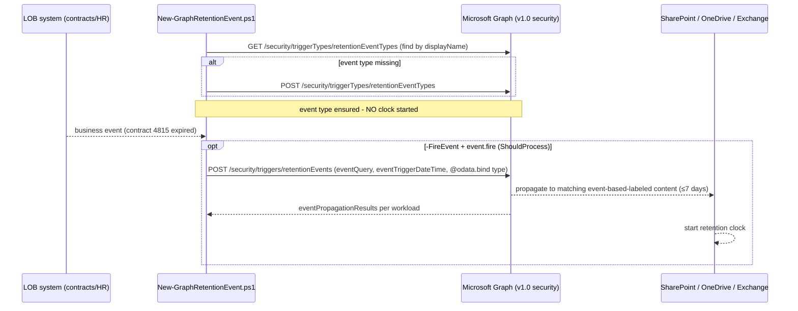

## 1. Problem statement

Event-based retention is only as good as the **trigger**. The sibling scenario
(`scenarios/records-management/regulatory-records-disposition/`) defines the event type, the
event-based record label, and the publish policy — but firing the event by hand in the portal doesn't
scale and isn't auditable for a high-volume flow (every expiring contract, every departing employee).
This scenario builds the **machine trigger**: a Microsoft Graph integration that a line-of-business
system calls to ensure the event type exists and to fire a dated, scoped retention event — starting the
clock for exactly the right records, automatically, at the moment the business event is recorded.

## 2. Design goals

1. **Use the supported automation path.** Microsoft Graph records-management APIs — the REST event API
   is deprecated.
2. **Service-integration shaped.** App-only capable (`RecordsManagement.ReadWrite.All`), idempotent
   event type, precise `eventQuery` scoping — built to be called by another system, not a person.
3. **Start no clock by accident.** Ensuring the event type is safe; firing an event is double-gated
   (`-FireEvent` **and** `event.fire=true`) and always goes through `ShouldProcess` (real `-WhatIf`).
4. **Surface Graph-native status.** Report `eventStatus` / `eventPropagationResults` — the per-workload
   propagation signal the PowerShell path doesn't expose.
5. **Complement, not duplicate, the PowerShell scenario.** Same lifecycle, different surface and
   audience — this is the automation half of a deliberate pair.

## 3. Why Graph (not the PowerShell New-ComplianceRetentionEvent)

- **Supported & modern.** Microsoft explicitly directs event automation to the Graph records-management
  APIs and marks the older REST event API deprecated [[2]](../README.md#12-references).
- **App-only service identity.** Graph supports certificate-based app-only auth cleanly, which is what a
  headless LOB integration needs — vs. the interactive/admin posture of Security & Compliance PowerShell.
- **Richer status.** The Graph `retentionEvent` returns `eventPropagationResults` per workload, giving an
  integration a real "did it land in SharePoint/Exchange" signal.
- **Same obligation, division of labor.** The PowerShell scenario is the admin/definition path; this is
  the runtime trigger path. Together they cover both how a records team defines the schedule and how a
  system drives it.

## 4. Object model and sequence

The event type is create-or-report; the event is the irreversible, gated, status-reporting step.

## 5. Key decisions

| Decision | Choice | Rationale |
|---|---|---|
| Surface | Microsoft Graph (`Invoke-MgGraphRequest`) | Supported automation path; app-only capable; REST event API deprecated |
| Dry-run | Real `-WhatIf` via `ShouldProcess` | Graph SDK supports it (unlike S&C PowerShell); still double-gate the fire |
| Event type | Create-or-report by displayName | Idempotent; safe to call on every integration run |
| Fire gating | `-FireEvent` **and** `event.fire=true` | Firing is irreversible — never a side effect of a routine run |
| Event scope | `eventQuery` required in config, warned if empty | An unscoped event retains all event-type-labeled content |
| Status | Report `eventPropagationResults` | Give the integration a real per-workload success signal |
| Auth | App-only certificate preferred | Headless LOB service identity |

## 6. Failure modes and guardrails

| Failure mode | Guardrail |
|---|---|
| Accidental clock start on a routine run | Double-gated fire + `ShouldProcess`; default run only ensures the event type |
| Runaway/broad event | `eventQuery` required in sample; script warns loudly if empty |
| Duplicate event types | Create-or-report by displayName |
| "Did it land?" invisible | Report `eventStatus` / `eventPropagationResults` after fire and in validate |
| Over-privileged app | README §8/§11 flag `RecordsManagement.ReadWrite.All` as high-privilege; cert app-only + monitoring |
| Mistaking latency for failure | ≤7-day sync documented; propagation status is the real signal |
| Deleting an event assumed to undo retention | Rollback + README state deletion is bookkeeping only |

## 7. Non-goals

- **Defining the label / publish policy** — owned by the sibling PowerShell scenario or the portal; this
  scenario only manages the event type and events.
- **The LOB integration code itself** (webhooks, queue consumers, the contract-system trigger) — this is
  the Graph-facing half; wiring a specific system's event bus is deployment-specific.
- **Beta-only features.** Uses the v1.0 records-management API; beta cmdlets
  (`*-MgBetaSecurity*`) are noted but not relied on.
- **File plan descriptors / label creation over Graph** — the records-management API can also create
  labels and file-plan descriptors; that's a separate follow-up, not this trigger-focused scenario.
- **Un-firing / cancelling retention** — not supported by the platform; the scenario does not pretend to.
