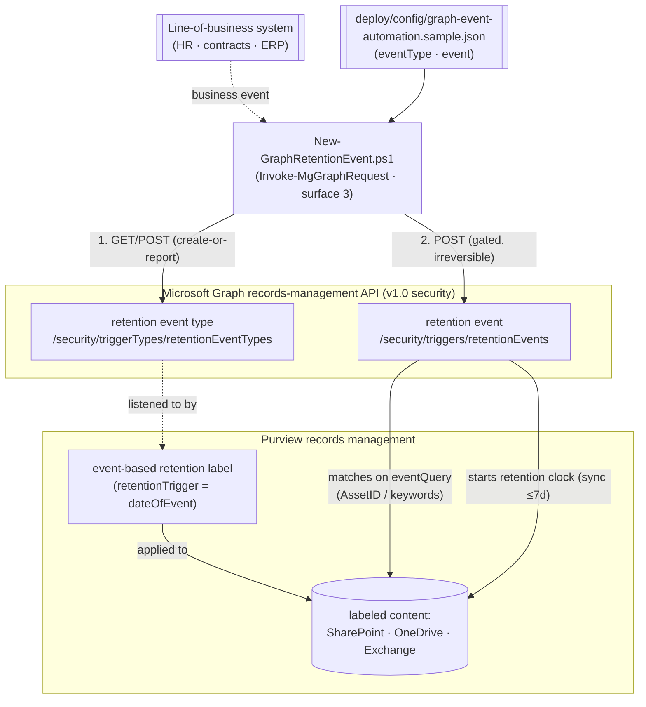

## 1. Scenario summary

Wires a **business system** (HR, contract management, ERP) into Microsoft Purview **event-based
retention** using the **Microsoft Graph records-management APIs**: it ensures a **retention event
type** exists, and — gated behind an explicit switch and sign-off — **fires a retention event** that
starts the retention clock for matching event-based-labeled content. This is the **automation
complement** to the PowerShell scenario in [`records-management/regulatory-records-disposition`](/scenarios/records-management/regulatory-records-disposition/)
(which defines the event type, the event-based record label, and the publish policy in Security &
Compliance PowerShell). Here the same lifecycle's **trigger** is driven programmatically over Graph, so
"the contract expired" or "the employee left" can start retention **automatically** the moment the
business event is recorded — no records manager clicking in the portal.

**Who it's for:** a records-management / platform-integration team that already has event-based
retention labels published (via the PowerShell scenario or the portal) and wants a durable, app-only
integration point for a line-of-business system to fire retention events through Microsoft Graph.

**How it differs from the PowerShell records scenario:** that one uses **Security & Compliance
PowerShell** (`New-ComplianceRetentionEvent`) and is the human/admin path; this one uses **Microsoft
Graph** (surface 2/3) — the **modern, supported automation path** (Microsoft has **deprecated** the
older REST event API) — designed for **app-only** service integration and exposing Graph's
**event-propagation status** that the PowerShell cmdlets don't surface.

## 2. Business/regulatory driver

Event-based retention only works if the **event actually fires** when the business event happens. A
records schedule that says "retain 7 years after contract expiry" is worthless if a person has to
remember to log into the portal and create an event for every expiring contract. The value — and the
audit-defensibility — comes from **automating the trigger**: the contract system marks a contract
expired, and that same transaction fires a Microsoft Graph retention event, starting the clock for
exactly that contract's records [[1]](#references).

Microsoft's guidance is explicit: automate event-based retention with the **Microsoft Graph
records-management APIs**; the **previously-available REST event API is deprecated and no longer works**
[[2]](#references). So a current-best-practice integration uses Graph. The obligations behind it are the
same event-anchored records rules the sibling scenario covers (DoD 5015.02, SEC 17a-4 / FINRA 4511
schedules, GDPR/CCPA storage-limitation) — this scenario is about making the **trigger** reliable,
reproducible, and machine-driven.

> ⚠️ **Firing an event is irreversible.** A retention event, once created, **cannot be cancelled**, and
> deleting the event does **not** stop the retention it started. So the event is fired only with
> `-FireEvent` **and** `event.fire=true` in config, and always through `ShouldProcess` (real `-WhatIf`).
> Test in a lab tenant and get Records/Legal sign-off. See §11.

## 3. Prerequisites

Full licensing detail: `docs/licensing-matrix.md`. RBAC: `docs/rbac-model.md`. Automation surface:
`docs/automation-surface.md` (surface 2 — Microsoft Graph PowerShell SDK; surface 3 — Graph REST).
Summary:

| Requirement | Minimum | Notes |
|---|---|---|
| Licensing | **Records management** (event-based retention): **M365 E5 / E5 Compliance / Purview Suite** | Same entitlement as the sibling records scenario [[6]](#references) |
| Graph permission | **`RecordsManagement.ReadWrite.All`** (fire/create); **`RecordsManagement.Read.All`** (validate) | Delegated or **Application** (app-only) [[3]](#references)[[4]](#references) |
| Role (delegated) | A records-management role that can manage events (e.g. Records Management / Retention Management) | For a signed-in user; app-only uses the granted app permission |
| SDK | **Microsoft.Graph** PowerShell (`Connect-MgGraph`, `Invoke-MgGraphRequest`) | Or the typed `Microsoft.Graph.Security` cmdlets — see §6 |
| Published event-based label | An event-based retention label bound to the event type (portal, or the sibling PowerShell scenario) | The event does nothing without content carrying a matching event-based label |

> Verify current entitlement names against `docs/licensing-matrix.md` (dated 2026-09-02) before a
> sales commitment — SKU names change.

## 4. Architecture



The event type is idempotent (create-or-report by displayName); firing the event is the irreversible,
gated step. The event matches content by `eventQuery` (Asset ID for SharePoint/OneDrive, keywords for
Exchange). Full rationale: `design.md`.

## 5. Step-by-step implementation

```powershell
# Connect (app-only certificate preferred for a service integration - docs/automation-surface.md §3)
Connect-MgGraph -Scopes 'RecordsManagement.ReadWrite.All'

# 1. Dry run (real -WhatIf via the SDK) - shows the event type (and event, with -FireEvent) it would create
./deploy/New-GraphRetentionEvent.ps1 -ConfigPath ./deploy/config/graph-event-automation.json -WhatIf

# 2. Ensure the event type exists (idempotent; starts NO clock)
./deploy/New-GraphRetentionEvent.ps1 -ConfigPath ./deploy/config/graph-event-automation.json

# 3. Validate
./validate/Test-GraphRetentionEvent.ps1 -ConfigPath ./deploy/config/graph-event-automation.json

# 4. LATER, from your business system, for a real dated event (irreversible; requires event.fire=true):
./deploy/New-GraphRetentionEvent.ps1 -ConfigPath ./deploy/config/graph-event-automation.json -FireEvent
```

### REST / raw HTTP (surface 3)

```http
POST https://graph.microsoft.com/v1.0/security/triggerTypes/retentionEventTypes
{ "@odata.type": "#microsoft.graph.security.retentionEventType", "displayName": "Contract Expiration" }

POST https://graph.microsoft.com/v1.0/security/triggers/retentionEvents
{
  "@odata.type": "#microsoft.graph.security.retentionEvent",
  "displayName": "Contract 4815 expired",
  "eventQuery": [ { "queryType": "files", "query": "ComplianceAssetID:4815" } ],
  "eventTriggerDateTime": "2026-09-04T00:00:00Z",
  "retentionEventType@odata.bind": "https://graph.microsoft.com/v1.0/security/triggerTypes/retentionEventTypes/{id}"
}
```

The scripts use `Invoke-MgGraphRequest` (works with both delegated and app-only tokens). The typed
`Microsoft.Graph.Security` cmdlets (`New-MgSecurityTriggerTypeRetentionEventType`,
`New-MgSecurityTriggerRetentionEvent`) are the equivalent path — see §6.

## 6. Configuration reference

| Setting | Value this scenario uses | Notes |
|---|---|---|
| Event-type endpoint | `POST /security/triggerTypes/retentionEventTypes` | `displayName`, `description` [[7]](#references) |
| Event endpoint | `POST /security/triggers/retentionEvents` | Fires the event [[8]](#references) |
| `retentionEventType@odata.bind` | `.../triggerTypes/retentionEventTypes/{id}` | Binds the event to its type |
| `eventQuery[].queryType` | `files` (SPO/ODB) or `messages` (EXO) | Workload of the query [[9]](#references) |
| `eventQuery[].query` | `ComplianceAssetID:<id>` (files) / keywords (messages) | Scopes the event to specific content [[9]](#references) |
| `eventTriggerDateTime` | ISO 8601 timestamp | The date retention starts counting from |
| Typed cmdlets | `New-MgSecurityTriggerTypeRetentionEventType` / `New-MgSecurityTriggerRetentionEvent` | Microsoft.Graph.Security equivalents [[10]](#references) |
| Permission | `RecordsManagement.ReadWrite.All` | Read-only validate: `RecordsManagement.Read.All` [[8]](#references) |

Exact request bodies and Learn sources are cited in each script's `.NOTES`.

## 7. Validation / how to prove it works

1. **Automated** — `./validate/Test-GraphRetentionEvent.ps1` confirms the event type exists and reports
   any events fired for it, with **eventStatus** and **eventPropagationResults** per workload. Exits
   non-zero if the event type is missing.
2. **Idempotency proof** — re-run the deploy without `-FireEvent`; the event type reports `exists` (not
   `created`) and nothing is duplicated.
3. **`-WhatIf` proof** — run the deploy with `-WhatIf` and confirm it prints the intended POSTs and
   fires nothing (no event type or event is created).
4. **Fire test (lab tenant)** — with `event.fire=true` and `-FireEvent`, fire a dated event scoped by
   `ComplianceAssetID`; confirm via validate that the event exists and report its propagation status;
   confirm (up to **7 days** later) that matching labeled content's retention clock has started
   [[1]](#references).
5. **Disposition proof** — for a short lab retention, confirm the content reaches a disposition review /
   disposal per the label (managed by the sibling records scenario / portal).

## 8. Operations & tuning

**KPIs / signals:** **eventPropagationResults** status per workload (the Graph-native signal that a
fired event reached SharePoint/Exchange — this scenario's key advantage over the PowerShell path); count
of events fired vs. business events recorded (a gap means the integration is dropping triggers);
disposition backlog downstream. **Tuning:** always set a precise `eventQuery` (Asset ID / keywords) —
an event with no query starts retention for **all** content carrying that event-type label
[[1]](#references). For a high-volume integration, fire one event per business entity (per contract, per
employee) with its own Asset ID, rather than broad events.

**Change management:** treat the app registration and its `RecordsManagement.ReadWrite.All` grant as a
high-privilege records identity — an app that can fire retention events can start irreversible retention.
Scope it to app-only with a certificate, monitor its activity, and keep the config under version
control.

## 9. Rollback / decommission

See `rollback.md`. Quick reference: `./deploy/Remove-GraphRetentionEvent.ps1` deletes retention **event
records** matching the config's `event.displayName`; `-DeleteEventType` also removes the event type (if
unreferenced). **Deleting an event does not stop retention it already started** — that's bookkeeping
only, by the platform's design. There is no supported "un-fire".

## 10. Cost & licensing notes

- **Per-user E5 entitlement**, no Azure consumption meter. Same records-management entitlement as the
  sibling scenario [[6]](#references); Microsoft Graph API calls themselves have no per-call charge.
- **Cost is integration engineering + governance.** The spend is building and operating the LOB→Graph
  integration reliably, and the storage of records held (possibly for years) once events fire.
- **The expensive mistake is a mis-scoped or runaway event.** An event with no `eventQuery`, or an
  integration bug that fires broadly, starts irreversible retention across content — the dominant risk
  (§11).

## 11. Known limitations & gotchas

- **A fired event can't be cancelled**, and deleting it does **not** stop the retention it started
  [[1]](#references). Firing is gated behind `-FireEvent` **and** `event.fire=true`, and always goes
  through `ShouldProcess` (real `-WhatIf`).
- **The REST event API is deprecated** — this scenario uses **Microsoft Graph**, the supported path
  [[2]](#references).
- **The event does nothing without matching labeled content.** Content must already carry an event-based
  retention label bound to this event type (portal, or the sibling PowerShell scenario) — the event only
  starts the clock for content that's already listening.
- **Scope is dangerous by default.** An event with an empty `eventQuery` triggers retention for **all**
  content with that event type's label [[1]](#references). The sample ships an Asset-ID query and
  `fire=false`.
- **Latency.** A fired event syncs to content in **up to 7 days** — don't mistake latency for failure;
  check `eventPropagationResults` for per-workload progress.
- **`@odata.bind` path quirk.** Microsoft's own v1.0 example binds via
  `.../triggerTypes/retentionEventType/{id}` (singular) while the collection is
  `retentionEventTypes` (plural); this scenario binds to the **plural collection path** with the
  resolved type **id**. Verify against current docs if a bind fails.
- **High-privilege app identity.** `RecordsManagement.ReadWrite.All` app-only can start irreversible
  retention — protect the credential and monitor its use.
- **`eventQuery` vs `eventQueries`.** The v1.0 create body uses `eventQuery`; some SDK models expose
  `eventQueries`. This scenario follows the documented v1.0 REST body (`eventQuery`) [[8]](#references).
- **Illustrative values.** The event-type name, event name, Asset ID, and timestamp are placeholders —
  set them from your business system's real data before wiring up.

## 12. References

1. Start retention when an event occurs (event-based retention; can't-cancel; ≤7-day sync; asset-ID scoping) — <https://learn.microsoft.com/purview/event-driven-retention>
2. Automate events by using Graph API (REST event API deprecated → use Microsoft Graph) — <https://learn.microsoft.com/purview/event-driven-retention#automate-events-by-using-powershell>
3. Use the Microsoft Graph records management APIs (overview; trigger events for an existing label) — <https://learn.microsoft.com/graph/api/resources/security-recordsmanagement-overview>
4. Microsoft Graph permissions reference (RecordsManagement.ReadWrite.All / .Read.All) — <https://learn.microsoft.com/graph/permissions-reference>
5. retentionEvent resource type (methods: list/create/get/delete) — <https://learn.microsoft.com/graph/api/resources/security-retentionevent>
6. Microsoft Purview service description — Records Management licensing — <https://learn.microsoft.com/office365/servicedescriptions/microsoft-365-service-descriptions/microsoft-365-tenantlevel-services-licensing-guidance/microsoft-purview-service-description>
7. Create retentionEventType (POST /security/triggerTypes/retentionEventTypes) — <https://learn.microsoft.com/graph/api/security-retentioneventtype-post>
8. Create retentionEvent (POST /security/triggers/retentionEvents; eventQuery, eventTriggerDateTime, retentionEventType@odata.bind; RecordsManagement.ReadWrite.All) — <https://learn.microsoft.com/graph/api/security-retentionevent-post>
9. eventQuery resource type (queryType files|messages; query = Asset ID / keywords) — <https://learn.microsoft.com/graph/api/resources/security-eventquery>
10. New-MgSecurityTriggerRetentionEvent / New-MgSecurityTriggerTypeRetentionEventType (Microsoft.Graph.Security) — <https://learn.microsoft.com/powershell/module/microsoft.graph.security/new-mgsecuritytriggerretentionevent>

> Re-verify all links, endpoints, permission names, and the irreversibility behaviors against current
> Microsoft Learn before a customer-facing deployment. Firing an event is irreversible — the scenario is
> deliberately conservative (real `-WhatIf`, double-gated event, create-or-report event type).
