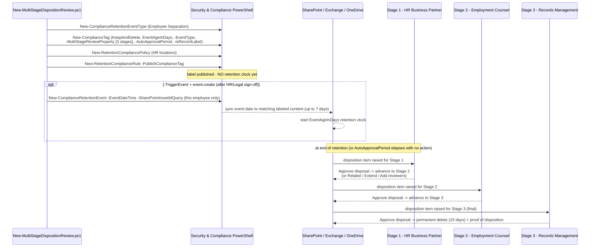

## 1. Problem statement

The regulatory-records-disposition scenario (`scenarios/records-management/regulatory-records-disposition/`)
gives every event-based record a **single** reviewer set: whoever is in `-ReviewerEmail` decides disposal.
That's right for most record classes, but wrong for the ones where **one approver isn't enough**, where
the organization needs a genuine **sign-off chain** before an irreversible, evidenced delete. Employee
separation records are the canonical case: an employee's personnel file may be relevant to a future
wrongful-termination, discrimination, or wage claim, so HR alone should not be the last word on deleting
it. Microsoft Purview's **multi-stage disposition review** (`-MultiStageReviewProperty` on
`New-ComplianceTag`/`Set-ComplianceTag`) models exactly this: up to 5 sequential stages, each with its own
reviewer set, where only the **final** stage's approval disposes the item. This scenario builds that
chain as code, using employee separation records as the concrete, representative case.

## 2. Design goals

1. **Model a real sign-off chain, not a toy example.** HR Business Partner → Employment Counsel → Records
 Management, mirroring how organizations actually gate a legally sensitive delete.
2. **Make the auto-approval risk visible, not hidden.** `-AutoApprovalPeriod` prevents a chain stalling
 forever, but it also means a stage can advance, or, at the final stage, dispose the record, with
 **no human reviewer having looked at it**. That tension is surfaced everywhere: config comment, deploy
 warning, validate output, README §8/§11, and the four-lens review.
3. **Never guess at undocumented behavior.** `-ComplianceTagForNextStage` is a real, accepted parameter
 whose own Microsoft reference page leaves the description as an unfilled placeholder. This scenario
 wires it through (off by default) rather than either inventing a behavior or silently dropping a
 documented parameter, and says exactly what is and isn't confirmed.
4. **Emit valid JSON, regardless of the doc example.** Microsoft's own published `-MultiStageReviewProperty`
 syntax shows reviewer values unquoted inside a JSON array, which is not valid JSON as literally shown.
 The deploy script builds the payload with `ConvertTo-Json`, not string concatenation, so it is always
 well-formed, and says why, rather than quietly "fixing" the doc without comment.
5. **Same guardrails as the parent scenario.** Event-based clock, gated irreversible trigger event,
 create-or-report idempotency, `-DryRun` (no working `-WhatIf` in Security & Compliance PowerShell).
6. **Honest read-back.** Validating that a label's reviewer chain matches the config relies on a
 `Get-ComplianceTag` output property (`MultiStageReviewerMetadata`) that is corroborated by third-party
 worked examples, not Microsoft's own parameter reference. The validate script treats every check
 touching it as `[WARN]`, never `[FAIL]`.

## 3. Why employee separation records (and why this needs a chain the parent scenario doesn't)

- **Litigation exposure differs by record class.** A contract record's disposal (the parent scenario) is
 mostly a business-records-hygiene decision. An employee's personnel file, performance record, or
 separation packet can become evidence in an EEOC charge or a wrongful-termination suit, and U.S.
 recordkeeping floors already require holding it well past casual disposal: EEOC preserves personnel and
 employment records for **1 year** from the record or the personnel action, whichever is later (29 CFR
 1602.14), and if a charge is filed, records related to it must be kept until final disposition
; FLSA payroll records must be kept **3 years**, and records underlying wage
 computations **2 years** (29 CFR 516.5/516.6). This scenario's illustrative 3-year
 (1,095-day) duration sits above both floors, set your own duration to your organization's real
 litigation-hold practice and jurisdiction-specific statutes of limitation, not to this placeholder.
- **A single HR reviewer is a conflict-of-interest risk, not just a formality.** The person closest to a
 separation is often the least appropriate sole approver of destroying that separation's records. A
 chain that adds Employment Counsel and Records Management is the actual control, not a compliance
 checkbox.
- **⚠️ Not currently cited: Executive Order 11246.** An earlier draft of this design considered citing EO
 11246 federal-contractor affirmative-action recordkeeping (a 2-year floor) as an additional driver.
 EO 11246 was rescinded by EO 14173 (January 21, 2025), and OFCCP's final rule rescinding its
 implementing regulations was published August 21, 2026, effective **October 26, 2026**, imminent as of
 this scenario's build date. It is deliberately **not** cited here. Section 503 (Rehabilitation Act) and
 VEVRAA recordkeeping obligations for covered federal contractors remain in force independently of EO
 11246 and are a legitimate additional driver for contractor tenants, but are outside this scenario's
 core grounding, treat them as a customer-specific add-on, not an assumed baseline.

## 4. Object model and sequence

Five build objects (same shape as the parent scenario) plus a **sequential, 3-stage** disposition review
that only the sibling scenario's single-reviewer label doesn't model. Any stage's approval advances the
item; only the last stage's approval disposes it.

## 5. Key decisions

| Decision | Choice | Rationale |
|---|---|---|
| Stage count / makeup | 3 stages: HR → Legal → Records Management | Representative sign-off chain for a legally sensitive record class; Microsoft supports up to 5 |
| Reviewers per stage | Distribution lists, not individuals | Survives staff turnover; each stage still resolves to ≤10 reviewers per Microsoft's documented limit |
| `RetentionDuration` | 1,095 days (3 years), illustrative | Above the EEOC 1-year and FLSA 2/3-year floors, set to your real litigation-hold practice |
| `AutoApprovalPeriod` | 30 days, set explicitly, surfaced everywhere it appears | Prevents an indefinite backlog, but is a documented silent-approval risk for a sign-off chain, never left as an unexamined default |
| `ComplianceTagForNextStage` | Off by default (`null`); passed through only if configured | Parameter is real but its behavior is undocumented by Microsoft (unfilled description), never guessed at |
| MultiStageReviewProperty payload | Built with `ConvertTo-Json`, not string concatenation | Microsoft's own published example is not valid JSON as literally shown; this always emits well-formed JSON |
| Idempotency | Create-or-report by name, same as parent scenario | Never silently mutate a records object, including retrofitting stages onto an in-use label |
| Read-back validation | Defensive (`PSObject.Properties[...]`), `[WARN]` not `[FAIL]` on the reviewer-chain check | `MultiStageReviewerMetadata` is corroborated by third-party examples only, not Microsoft's own reference |
| Dry-run | Custom `-DryRun`, prints the exact JSON payload | `-WhatIf` is non-functional in S&C PowerShell |

## 6. Failure modes and guardrails

| Failure mode | Guardrail |
|---|---|
| Silent auto-approval at a stage nobody reviewed | `AutoApprovalPeriod` (if set) is echoed with a yellow warning at deploy time and reported by validate; README §8/§11 name it as the dominant operational risk of this scenario specifically |
| Accidental clock start | Same as parent: event only on `-TriggerEvent` **and** `event.create=true` |
| Over-broad event | Config ships an asset-ID query scoped to one employee; deploy warns loudly if none is set |
| Invalid JSON reaching `New-ComplianceTag` | Payload built with `ConvertTo-Json`, never string concatenation; `-DryRun` prints the exact JSON before any live run |
| Config exceeds documented limits (>5 stages, >10 reviewers/stage) | Deploy validates and throws before calling `New-ComplianceTag`, rather than letting the cmdlet reject it opaquely |
| Guessing at `-ComplianceTagForNextStage` behavior | Passed through only if configured (default `null`); every place it appears (deploy, README, this file) states the description is an undocumented placeholder |
| Casual teardown of a records control | Rollback disables by default; `-Delete` only **attempts** removal and reports (never forces) failures; identical to the parent scenario's rollback discipline |
| Trusting an unconfirmed read-back property | Validate reads `MultiStageReviewerMetadata` defensively and treats every stage-chain check as `[WARN]` |
| Chain tampered with outside this repo's scripts (`Set-ComplianceTag` called directly to shorten `AutoApprovalPeriod`, drop a stage, or repoint reviewers) | README §8 recommends tight role restriction + `Search-UnifiedAuditLog` monitoring as a compensating control; exact `RecordType`/`Operations` values not yet grounded, tracked in `PROGRESS.md`, not guessed |

## 7. Non-goals

- **A general-purpose N-stage generator for every record class.** This is one representative,
 well-justified use of the multi-stage feature (employee separation), not a claim that every record
 class needs a chain, most don't, and the parent single-reviewer scenario remains the default.
- **Confirming `MultiStageReviewerMetadata`'s exact schema or `-ComplianceTagForNextStage`'s behavior
 against a live tenant.** Both are flagged VERIFY rather than resolved by guessing, see README §11.
- **Editing an existing label's reviewer chain in place.** `Set-ComplianceTag` documents
 `-MultiStageReviewProperty` as settable post-creation, but this scenario's deploy is deliberately
 create-or-report only; changing who reviews a records-disposal decision already in force is a
 controlled, Records/Legal/HR-reviewed action, not a deploy side effect, a documented, not-yet-built
 extension.
- **Reading Microsoft Graph's `dispositionReviewStages`/`labelToBeApplied` records-management surface.**
 Cited in the deploy script's `.NOTES` only as context for `-ComplianceTagForNextStage`'s likely intent
, building a Graph-based companion is a follow-up, not this fragment.
- **Federal-contractor-specific recordkeeping (Section 503 / VEVRAA).** Noted in §3 as a legitimate
 additional driver for contractor tenants but not built into this scenario's default configuration.

## References

See `README.md` §12 for the full, numbered source list.
