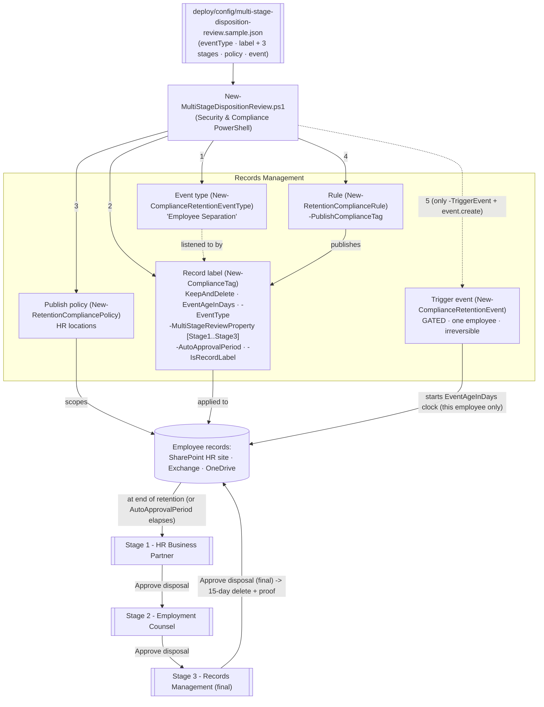

## 1. Scenario summary

Extends the event-based records-disposition pattern
(`scenarios/records-management/regulatory-records-disposition/`) with a **multi-stage disposition review**
panel: a record label whose disposal requires **sequential sign-off from up to 5 reviewer stages**
(`-MultiStageReviewProperty` on `New-ComplianceTag`), not a single reviewer set. Built here for **employee
separation records** — HR Business Partner → Employment Counsel → Records Management — the representative
case where one approver isn't enough because the record may become evidence in a future employment claim.

**Who it's for:** a records-management team (working with HR and Legal) at an organization that needs a
genuine **sign-off chain**, not a single reviewer, before permanently deleting a legally sensitive record
class — and wants that chain, plus its operational risks, defined as reproducible, auditable code.

**How it differs from the parent scenario:** that one uses `-ReviewerEmail` (a single reviewer set); this
one uses `-MultiStageReviewProperty` (a JSON-defined, sequential chain of named stages, each with its own
reviewers), plus `-AutoApprovalPeriod` to stop the chain stalling and an honest, undocumented-by-Microsoft
`-ComplianceTagForNextStage` pass-through. Same event-based clock, same publish model, same irreversible-
trigger gating — different disposal-approval shape.

## 2. Business/regulatory driver

Employee personnel and separation records can become evidence in an EEOC charge, a wrongful-termination
suit, or a wage claim — the organization's exposure doesn't end when the employee leaves. U.S. federal
recordkeeping already sets floors well past "delete when convenient": the EEOC requires preserving
personnel/employment records for **1 year** from the record or the personnel action, whichever is later,
and — critically — **until final disposition** of any charge or action filed against the record
[[9]](#references); FLSA requires **3 years** for payroll records and **2 years** for records underlying
wage computations [[10]](#references). None of that alone justifies a multi-stage *review*, though — the
real driver for a chain (vs. a single reviewer, per the parent scenario) is that the person closest to a
separation (HR) is the **least** appropriate sole approver of destroying that separation's own records.
Adding Employment Counsel and Records Management as independent, sequential sign-offs is the actual
control. Microsoft Purview's multi-stage disposition review models exactly this: **up to 5 sequential
stages**, each with its own reviewer set (individual users or mail-enabled security groups, up to 10 per
stage), where only the **final** stage's approval permanently disposes the item [[1]](#references).

> **Not cited here: Executive Order 11246.** Federal-contractor affirmative-action recordkeeping under EO
> 11246 was rescinded by EO 14173 (Jan 21, 2025); OFCCP's final rule rescinding the implementing
> regulations takes effect **October 26, 2026** [[12]](#references) — imminent as of this scenario's build
> date. It is deliberately not used as a driver. Section 503 (Rehabilitation Act) and VEVRAA recordkeeping
> for covered federal contractors remain independently in force and are a legitimate customer-specific
> add-on — see `design.md` §3.

> ⚠️ **Two irreversible edges, same as the parent scenario.** (1) A **triggered event cannot be
> cancelled**. (2) A **record label that has been applied cannot be deleted** and its retention/reviewer
> chain cannot be shortened or edited by this scenario's scripts. See §11.

## 3. Prerequisites

Full licensing detail: `docs/licensing-matrix.md` (dated 2026-09-10). RBAC: `docs/rbac-model.md`.
Automation surface: `docs/automation-surface.md` (surface 1 — Security & Compliance PowerShell). Summary:

| Requirement | Minimum | Notes |
|---|---|---|
| Licensing | **Records management** (record labels, event-based retention, disposition review): **M365 E5 / E5 Compliance / Purview Suite** | Multi-stage disposition review is part of the same E5 records-management capability set as the parent scenario [[8]](#references) |
| Role (config) | **Records Management** or **Retention Management** role group | To create event types, labels (including the reviewer chain), policies, rules — `docs/rbac-model.md` |
| Role (disposition, per stage) | **Disposition Management** role (in the Records Management role group; **not** granted to global admins by default) | Every stage's reviewers need this role to see and act on their stage's items [[1]](#references) |
| Reviewers (per stage) | Individual **users** or **mail-enabled security groups** (not Microsoft 365 Groups) | Up to **10 reviewers per stage**, up to **5 stages** [[1]](#references) |
| Auth | `Connect-IPPSSession` (certificate app-only preferred) | Security & Compliance PowerShell — `docs/automation-surface.md` §3 |
| Target locations | SharePoint site(s) / mailboxes / OneDrive (HR locations here) | Publish policy needs ≥1 location |

> Verify current entitlement names against `docs/licensing-matrix.md` before a sales commitment — SKU
> names change.

## 4. Architecture



Same five build objects as the parent scenario, plus a **sequential 3-stage** review: any stage's approval
advances the item, only the last stage's approval disposes it. Full rationale: `design.md`.

## 5. Step-by-step implementation

```powershell
# Connect (certificate app-only preferred - docs/automation-surface.md Section 3)
Connect-IPPSSession -AppId $AppId -Certificate $Cert -Organization 'contoso.onmicrosoft.com'

# 1. Dry run - prints the exact cmdlets AND the exact -MultiStageReviewProperty JSON, starts nothing
./deploy/New-MultiStageDispositionReview.ps1 -ConfigPath ./deploy/config/multi-stage-disposition-review.json -DryRun

# 2. Build event type + label (with reviewer chain) + publish policy/rule (NO clock started)
./deploy/New-MultiStageDispositionReview.ps1 -ConfigPath ./deploy/config/multi-stage-disposition-review.json

# 3. Validate
./validate/Test-MultiStageDispositionReview.ps1 -ConfigPath ./deploy/config/multi-stage-disposition-review.json

# 4. LATER, for one real separated employee only (irreversible) - requires event.create=true in config:
./deploy/New-MultiStageDispositionReview.ps1 -ConfigPath ./deploy/config/multi-stage-disposition-review.json -TriggerEvent
```

### Portal reference

Event types and events live in the [Microsoft Purview portal](https://purview.microsoft.com) under
**Records Management → Events**; the multi-stage reviewer chain is configured on the label's disposition
step (**Records Management → File plan → Create label → choose "Start disposition review" → add a
stage**) [[1]](#references); pending disposals — one queue per stage a reviewer belongs to — under
**Records Management → Disposition**. `-WhatIf` is non-functional in S&C PowerShell, so the scripts ship a
`-DryRun`.

## 6. Configuration reference

| Setting | Value this scenario uses | Notes |
|---|---|---|
| Event-type cmdlet | `New-ComplianceRetentionEventType` | Same as parent scenario [[4]](#references) |
| Label cmdlet | `New-ComplianceTag` | [[2]](#references) |
| `RetentionAction` | `KeepAndDelete` | Retain, then dispose (review-gated) |
| `RetentionType` | `EventAgeInDays` | Clock starts on the separation event |
| `RetentionDuration` | `1095` (3 years), illustrative | Above the EEOC 1-year / FLSA 2-3-year floors — set to your real practice, `design.md` §3 |
| `MultiStageReviewProperty` | JSON, 3 stages (HR → Legal → Records Mgmt) | `'{"MultiStageReviewSettings":[{"StageName":"...","Reviewers":[...]},...]}'` — built with `ConvertTo-Json`, up to 5 stages / 10 reviewers-per-stage documented max [[1]](#references)[[2]](#references) |
| `AutoApprovalPeriod` | `30` days | Valid range 7-365, default 14 if set with no value; **silently advances/disposes a stage with no reviewer action** — see §8 [[2]](#references) |
| `ComplianceTagForNextStage` | not set (`null`) by default | Documented parameter, **undocumented behavior** (Microsoft's own reference leaves the description as an unfilled placeholder); passed through only if explicitly configured — §11 |
| `IsRecordLabel` | `$true` | Declares content a record (lockable) |
| Publish cmdlets | `New-RetentionCompliancePolicy` + `New-RetentionComplianceRule -PublishComplianceTag` | Publish (not auto-apply), same as parent [[7]](#references) |
| Event cmdlet | `New-ComplianceRetentionEvent` | Scoped to one employee via `-SharePointAssetIdQuery`/`-ExchangeAssetIdQuery` [[5]](#references) |

Exact cmdlet syntax and Learn sources are cited in each script's `.NOTES`.

## 7. Validation / how to prove it works

1. **Automated** — `./validate/Test-MultiStageDispositionReview.ps1` confirms the event type exists; the
   label exists as a record with `KeepAndDelete`/`EventAgeInDays`, is bound to the event type; reads back
   the reviewer chain (stage count, names) as `[WARN]`-level checks (see §11 on the read-back property's
   confirmation status); confirms the publish policy/rule; reports triggered events and whether
   `AutoApprovalPeriod` is set. Exits non-zero on a hard failure.
2. **Publish test** — apply the published label to a test item (or set as a default library label);
   confirm it appears. Publishing can take up to **7 days**.
3. **Event / clock test (lab tenant)** — create a dated event scoped to one test "employee," confirm the
   clock starts for that employee's labeled content only (sync up to 7 days) [[6]](#references).
4. **Multi-stage review test (lab tenant)** — for a short test duration, let retention elapse (or wait for
   `AutoApprovalPeriod`) and confirm: a disposition item appears for **Stage 1**'s reviewers only; a Stage
   1 "Approve disposal" moves it to **Stage 2**; only **Stage 3**'s approval marks it for permanent
   deletion (15 days later) with proof of disposition retained [[1]](#references). Also test **Relabel**
   and **Extend** at an intermediate stage to confirm the chain doesn't silently continue past a reviewer
   who chose neither delete-path option.
5. **Auto-approval test (lab tenant, short window)** — set a short `AutoApprovalPeriod` on a disposable
   test label, let it elapse with no reviewer action, and confirm the item advances (or, at the final
   stage, is disposed) **without** a reviewer action — proving the risk documented in §8, not just
   asserting it.
6. **Idempotency proof** — re-run the deploy; every object reports `exists` (not `created`); the reviewer
   chain is not re-sent or mutated on an existing label; no event is created without `-TriggerEvent` +
   `event.create`.
7. **Evidence export for an auditor/examiner** —
   `scenarios/records-management/disposition-proof-export/` adds a scriptable, schedulable rolling
   audit trail of `AddReviewer`/`ApproveDisposal`/`ExtendRetention`/`RelabelItem`/`RecordDelete`
   events (companion to the portal's own per-label Filter+Export `.csv`), applicable to this
   scenario's multi-stage chain the same way it applies to the parent single-reviewer scenario.

## 8. Operations & tuning

**KPIs / signals:** publish policy **DistributionStatus**; **per-stage disposition backlog** (a chain adds
a new failure mode the parent scenario doesn't have — a backlog stuck at Stage 1 never reaches Legal or
Records Management, so track backlog **per stage**, not just in aggregate); count of items that reached
each stage vs. items that reached final disposal; count of `AutoApprovalPeriod` auto-advances (this should
be near-zero in a healthy chain — a nonzero, growing count means a stage's reviewers aren't engaging, and
the chain is functionally a silent-approval pipeline, not a review).

**Tuning:**
- Scope each event **narrowly** (one employee's asset-ID query) — an event with no asset-ID query starts
  retention for **all** content carrying the event-type label, i.e. every separated employee at once.
- Set `AutoApprovalPeriod` deliberately, and **do not treat it as a safe default for every stage**: a
  30-day window for an HR-staffing-level Stage 1 may be reasonable; the same window on the **final**
  Records Management stage means a record can be permanently destroyed with zero human review if that
  team is short-staffed for a month. Consider a **shorter** auto-approval window paired with an
  operational alert at Stage N-1 → Stage N transitions, rather than relying on a single global setting.
- Use **mail-enabled security group** reviewers (not individuals) at every stage so staff turnover doesn't
  silently orphan a stage with zero reachable reviewers.
- **Monitor who can change the chain, not just who reviews it.** Anyone holding the Records Management /
  Retention Management config role can call `Set-ComplianceTag` directly (outside this repo's scripts) to
  shorten `AutoApprovalPeriod`, remove a stage, or repoint reviewers — none of which this scenario's
  scripts detect. Restrict that role tightly and alert on `New-ComplianceTag`/`Set-ComplianceTag` activity
  in `Search-UnifiedAuditLog` as a compensating control. This repo has not yet grounded the exact
  `RecordType`/`Operations` values for those specific cmdlets against Microsoft's audit-log reference —
  tracked as a follow-up in `PROGRESS.md` rather than guessed here.

**Change management:** the config file (including the reviewer chain) is the versioned, auditable
sign-off policy. The event type is immutable once a label references it; this scenario's deploy does not
retrofit reviewer-chain changes onto an existing label — changing who approves a records-disposal decision
already relied upon is a deliberate, HR/Legal/Records-reviewed action (`design.md` §7).

## 9. Rollback / decommission

See `rollback.md`. Quick reference: `./deploy/Remove-MultiStageDispositionReview.ps1` **disables** the
publish policy by default; `-Delete` removes the policy + rule and **attempts** to remove the label and
event type. Rollback **cannot** delete a record label already applied, edit or shorten a live reviewer
chain, cancel a triggered event, or reach into an in-flight disposition item at any stage — those are
irreversible or out of scope by design; manage in-flight reviews in the portal.

## 10. Cost & licensing notes

- **Per-user E5 entitlement**, no Azure consumption meter, no separate charge for additional review
  stages — multi-stage disposition review is part of the same records-management capability set as the
  parent scenario [[8]](#references).
- **Cost is licensing + storage + reviewer labor, multiplied by stages.** A 3-stage chain means 3
  distinct teams' review time per disposal decision, not 1 — budget accordingly, and weigh that against
  `AutoApprovalPeriod` shortcuts (§8) that trade cost for risk.
- **The expensive mistake is the same as the parent scenario's, plus one:** a mis-scoped event (retains
  everyone's records, not one employee's), **and** an `AutoApprovalPeriod` set on the final stage that's
  shorter than that team's realistic response time, turning "reviewed disposal" into "timed auto-delete."

## 11. Known limitations & gotchas

- **`-ComplianceTagForNextStage`'s behavior is undocumented by Microsoft.** Its own published parameter
  reference for both `New-ComplianceTag` and `Set-ComplianceTag` leaves the description as an unfilled
  placeholder [[2]](#references)[[3]](#references). The Microsoft Graph records-management
  `retentionLabel` resource's `labelToBeApplied` property — "the replacement label to be applied
  automatically after the retention period of the current label ends" — is the closest documented analog
  [[11]](#references), but this scenario does **not** assume PowerShell's parameter behaves identically.
  It is off by default (`null`) and passed through only if explicitly configured; **VERIFY** (pilot
  tenant, or a future Microsoft Learn pass) before relying on it.
- **VERIFY (pilot tenant): the `MultiStageReviewerMetadata` read-back property.** `Get-ComplianceTag`'s
  own published output documentation does not list a property for reading back the reviewer chain;
  `MultiStageReviewerMetadata` (with `StageId`/`StageName`/`Reviewers`) is corroborated by third-party
  worked examples of real `Get-ComplianceTag` output, not by Microsoft's own reference. `validate/
  Test-MultiStageDispositionReview.ps1` reads it defensively via `PSObject.Properties[...]` and reports
  every check touching it as `[WARN]`, never `[FAIL]` — confirming the exact property name/casing in a
  pilot tenant would let a future revision treat it as a hard check.
- **Microsoft's own `-MultiStageReviewProperty` example is not valid JSON as published** (unquoted
  reviewer values). This scenario's deploy script always emits valid JSON via `ConvertTo-Json` — see
  `design.md` §2 and the script's `.NOTES`.
- **`AutoApprovalPeriod` is a silent-approval risk, not just a convenience** — see §8. Treat it as a
  reviewed operational decision per stage, not a default to accept unexamined.
- **A triggered event can't be cancelled**, and **an applied record label can't be deleted** — identical
  irreversibility to the parent scenario. See §2/§9.
- **The event type is immutable after the label is saved with it**; **the reviewer chain is not retrofit
  onto an existing label** by this scenario's deploy — both are deliberate, create-or-report boundaries.
- **`-WhatIf` is non-functional in S&C PowerShell** — the scripts ship `-DryRun` instead.
- **Latency.** Publishing and event sync each take up to **7 days** — don't mistake latency for failure.
- **Disposition RBAC is per-stage.** The Disposition Management role isn't granted to admins by default;
  a stage's reviewers who lack it won't see that stage's items even though the chain is otherwise healthy.
- **No scripted way to query per-stage disposition backlog was found.** Pending-disposition queue depth
  per stage appears to be portal-only (Records Management → Disposition); no documented PowerShell/Graph
  cmdlet for it surfaced during this build's grounding pass. §8's "per-stage backlog" KPI is therefore a
  manual/portal check today — tracked as a follow-up in `PROGRESS.md` (re-check if Microsoft documents
  one) rather than assumed away.
- **Illustrative values.** The event-type name, 3-year duration, stage names/reviewers, site URL, and
  asset-ID query are placeholders — set them to your real records schedule and sign-off chain, validated
  by Records/Legal/HR, before deploying.

## 12. References

1. Disposition of content (multi-stage disposition review: up to 5 stages, up to 10 reviewers/stage,
   sequential stages, reviewer actions Approve disposal/Relabel/Extend/Add reviewers, auto-approval
   behavior, Disposition Management role) — <https://learn.microsoft.com/purview/disposition>
2. New-ComplianceTag (-MultiStageReviewProperty JSON syntax, -AutoApprovalPeriod 7-365 days,
   -ComplianceTagForNextStage, -RetentionAction, -RetentionType, -EventType, -IsRecordLabel) — <https://learn.microsoft.com/powershell/module/exchangepowershell/new-compliancetag>
3. Set-ComplianceTag (-MultiStageReviewProperty, -ComplianceTagForNextStage also documented here with the
   same unfilled description) — <https://learn.microsoft.com/powershell/module/exchangepowershell/set-compliancetag>
4. New-ComplianceRetentionEventType — <https://learn.microsoft.com/powershell/module/exchangepowershell/new-complianceretentioneventtype>
5. New-ComplianceRetentionEvent (-EventDateTime, -SharePointAssetIdQuery / -ExchangeAssetIdQuery,
   -EventType) — <https://learn.microsoft.com/powershell/module/exchangepowershell/new-complianceretentionevent>
6. Start retention when an event occurs (event-based retention) — <https://learn.microsoft.com/purview/event-driven-retention>
7. New-RetentionComplianceRule (-PublishComplianceTag) — <https://learn.microsoft.com/powershell/module/exchangepowershell/new-retentioncompliancerule>
8. Microsoft Purview service description — Records Management licensing — <https://learn.microsoft.com/office365/servicedescriptions/microsoft-365-service-descriptions/microsoft-365-tenantlevel-services-licensing-guidance/microsoft-purview-service-description>
9. 29 CFR 1602.14 — Preservation of records made or kept (EEOC, 1-year floor; retained until final
   disposition if a charge is filed) — <https://www.ecfr.gov/current/title-29/subtitle-B/chapter-XIV/part-1602/subpart-C/section-1602.14>
10. 29 CFR 516.5 / 516.6 — Records to be preserved (FLSA payroll records 3 years; wage-computation
    records 2 years) — <https://www.ecfr.gov/current/title-29/subtitle-B/chapter-V/subchapter-A/part-516/subpart-A/section-516.5>
11. retentionLabel resource type (Microsoft Graph records management; `labelToBeApplied` — closest
    documented analog to -ComplianceTagForNextStage, not confirmed identical) — <https://learn.microsoft.com/graph/api/resources/security-retentionlabel>
12. Rescission of Executive Order 11246 Implementing Regulations (Federal Register; effective October 26,
    2026) — <https://www.federalregister.gov/documents/2025/07/01/2025-12276/rescission-of-executive-order-11246-implementing-regulations>
13. Get-ComplianceTag — <https://learn.microsoft.com/powershell/module/exchangepowershell/get-compliancetag>

> Re-verify all links, cmdlet parameters, licensing, the `MultiStageReviewerMetadata` read-back property,
> `-ComplianceTagForNextStage`'s actual behavior, and the irreversibility behaviors against current
> Microsoft Learn before a customer-facing deployment. Triggered events and applied record labels are
> irreversible — this scenario is deliberately conservative (dry-run, gated event, create-or-report,
> no force-removal of records, no unconfirmed read-back treated as a hard failure).
